# Trabajo Práctico N.º 1 — Unidad Aritmético-Lógica

## 1. Introducción

Una unidad aritmético-lógica reúne las operaciones que un procesador realiza sobre sus datos. Su diseño requiere definir qué operaciones se admiten, cómo se seleccionan y de qué manera se interpretan los resultados cuando el ancho de los operandos es limitado. A partir de ese problema, en este trabajo se desarrolló una ALU parametrizable en SystemVerilog para una FPGA Artix-7 de la placa Basys 3.

El objetivo fue recorrer el proceso de diseño desde la descripción del comportamiento hasta su implementación en el dispositivo. Para ello se construyó un núcleo capaz de realizar ocho operaciones sobre datos de 8 bits y se lo integró con una interfaz que permite ingresar los operandos y el código de operación mediante los switches y pulsadores de la placa. El resultado se presenta en LEDs, acompañado por los indicadores de cero, acarreo y desbordamiento con signo.

El desarrollo se verificó con testbenches del núcleo, del circuito de sincronización de pulsadores y del módulo que integra ambos. Una vez comprobado su comportamiento en simulación, se utilizó Vivado 2025.2 para sintetizar el diseño, implementar sus conexiones y analizar los recursos utilizados y los márgenes temporales. Las secciones siguientes presentan ese recorrido y explican la relación entre el código, los esquemáticos obtenidos y los resultados de las pruebas.

## 2. Operaciones y representación de los resultados

La ALU recibe dos operandos, A y B, y un código que selecciona la operación. Los operandos y la salida comparten el ancho definido por `NB_DATA`, mientras que `NB_OPCODE` determina la cantidad de bits de control. Los valores utilizados se establecen en la declaración de parámetros de `alu.sv`:

```systemverilog
parameter integer NB_DATA   = 8,
parameter integer NB_OPCODE = 6
```

Con estos anchos, los seis bits del opcode seleccionan las operaciones de la siguiente tabla:

| Operación | Opcode | Expresión | Descripción |
|---|---|---|---|
| ADD | `100000` | `A + B` | Suma |
| SUB | `100010` | `A - B` | Resta |
| AND | `100100` | `A & B` | AND bit a bit |
| OR | `100101` | `A \| B` | OR bit a bit |
| XOR | `100110` | `A ^ B` | XOR bit a bit |
| SRA | `000011` | `$signed(A) >>> B` | Desplazamiento aritmético a derecha |
| SRL | `000010` | `A >> B` | Desplazamiento lógico a derecha |
| NOR | `100111` | `~(A \| B)` | NOR bit a bit |

En las operaciones booleanas se aplica la función correspondiente a cada par de bits. En los desplazamientos, en cambio, B se interpreta como la cantidad de posiciones que debe desplazarse A. SRL introduce ceros por la izquierda, mientras que SRA replica el bit de signo. Esta diferencia permite, por ejemplo, que el patrón `80` hexadecimal produzca `40` al desplazarse lógicamente una posición y `C0` al hacerlo aritméticamente. Los códigos que no aparecen en la tabla producen resultado cero, por lo que el comportamiento queda definido para cualquier valor de la entrada de control.

El ancho fijo de la salida hace necesario distinguir el patrón obtenido de su interpretación numérica. Con 8 bits pueden representarse valores entre 0 y 255 sin signo, o entre −128 y 127 en complemento a dos. Una operación puede superar uno de esos rangos sin superar el otro. Por este motivo, además del resultado se incorporaron tres indicadores:

| Salida | Indicador | Condición |
|---|---|---|
| `o_zero` | Cero, Z | Todos los bits del resultado son cero |
| `o_carry` | Acarreo, C | ADD genera un acarreo fuera del ancho del resultado |
| `o_overflow` | Desbordamiento, V | ADD o SUB excede el rango con signo |

El indicador de cero responde a una pregunta independiente de la interpretación numérica: si el patrón de salida contiene algún uno. Por eso se activa tanto cuando una resta entre operandos iguales produce cero como cuando una suma excede los ocho bits y deja esos bits en cero. No implica, por sí solo, que la operación haya quedado dentro del rango representable.

Para interpretar este último caso se utiliza el carry. En la suma `FF + 01`, los operandos sin signo representan 255 y 1, de modo que el resultado completo es 256 y necesita nueve bits. Al conservar los ocho bits de salida se obtiene `00`, mientras que el bit adicional queda reflejado en C. Así, Z y C pueden estar activos al mismo tiempo sin contradecirse: uno describe la salida de ocho bits y el otro informa el acarreo de la suma.

El overflow, en cambio, permite interpretar el resultado cuando los operandos representan números con signo. En el ejemplo anterior, los mismos patrones corresponden a −1 y 1, cuya suma es cero y no desborda. Para observar la situación inversa puede considerarse `7F + 01`: aunque 128 cabe en ocho bits sin signo y no genera carry, supera el máximo positivo del complemento a dos. El patrón obtenido es `80`, que se interpreta como −128; por eso se activa V y se advierte que la salida ya no representa la suma con signo esperada.

Esta limitación también afecta a la resta. Al calcular `80 - 01`, la operación con signo es −128 − 1, cuyo resultado queda por debajo del mínimo representable. Los ocho bits conservados forman `7F`, equivalente a 127, y el overflow señala ese cambio de signo incorrecto. En este diseño, C se reserva para el acarreo de ADD y permanece en cero durante SUB; no se lo define como indicador de préstamo.

En las operaciones booleanas y los desplazamientos se mantienen C y V en cero, ya que para ellas no se definieron indicadores de acarreo ni de desbordamiento. Esto incluye los bits descartados al desplazar, que no se almacenan en C. Z sigue dependiendo del patrón de salida en todas las operaciones y también se activa ante un opcode inválido, para el cual se estableció resultado cero.

La siguiente tabla reúne los casos que se utilizaron para distinguir estas situaciones durante la verificación. A, B y el resultado están expresados en hexadecimal.

| A | B | Operación | Resultado | Z | C | V |
|---|---|---|---|---:|---:|---:|
| `05` | `03` | ADD | `08` | 0 | 0 | 0 |
| `FF` | `01` | ADD | `00` | 1 | 1 | 0 |
| `7F` | `01` | ADD | `80` | 0 | 0 | 1 |
| `80` | `80` | ADD | `00` | 1 | 1 | 1 |
| `80` | `01` | SUB | `7F` | 0 | 0 | 1 |
| `7F` | `FF` | SUB | `80` | 0 | 0 | 1 |
| `05` | `05` | SUB | `00` | 1 | 0 | 0 |

## 3. Organización del diseño

Una vez definido el comportamiento de la ALU, se separó el cálculo de las tareas necesarias para utilizarla desde la placa. El módulo `alu` contiene únicamente lógica combinacional y puede probarse sin switches, pulsadores ni reloj. La interacción con el usuario queda a cargo de `alu_top`, que almacena los datos y conecta el núcleo con los recursos de la Basys 3. Entre los pulsadores y esos registros se utiliza `button_input`, encargado de sincronizar cada señal con el reloj.

Esta separación también organiza la verificación: cada módulo tiene un testbench que comprueba su comportamiento antes de analizar el conjunto. Los archivos que describen el circuito, sus pruebas y su configuración son los siguientes:

| Archivo | Función |
|---|---|
| `alu.sv` | Implementa las operaciones y los indicadores |
| `button_input.sv` | Sincroniza la entrada de un pulsador |
| `alu_top.sv` | Integra los sincronizadores, los registros y la ALU |
| `alu_tb.sv` | Comprueba las operaciones y sus indicadores |
| `button_input_tb.sv` | Comprueba la propagación del nivel del pulsador |
| `alu_top_tb.sv` | Comprueba las cargas, el reset y las salidas del conjunto |
| `basys3.xdc` | Define las conexiones físicas y las restricciones temporales |
| `scripts/create_sync_project.tcl` | Crea el proyecto de Vivado a partir de las fuentes |

La figura 1 muestra cómo Vivado interpreta esta organización. Bajo el módulo superior aparecen cuatro instancias del sincronizador, una por pulsador, y la instancia `alu_core`. Los testbenches se encuentran en Simulation Sources, separados de los módulos destinados a síntesis.

<p align="center">
  <a href="docs/images/sources.png">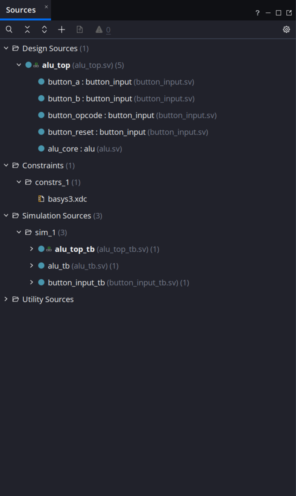</a>
</p>

<p align="center"><em>Figura 1. Organización de los módulos de diseño, las restricciones y los testbenches.</em></p>

## 4. Desarrollo del núcleo combinacional

El núcleo se implementó mediante un bloque `always_comb` que selecciona la operación con una sentencia `case`. Como la ALU es combinacional, un cambio en los operandos o en el opcode provoca el recálculo de sus salidas sin esperar un flanco de reloj. La conservación de los datos, necesaria para ingresarlos de manera secuencial desde la placa, se resuelve fuera de este módulo.

Dentro del bloque se asigna inicialmente cero a carry y overflow. Las ramas correspondientes a ADD y SUB calculan los indicadores que necesitan, mientras que las demás conservan los valores predeterminados. A su vez, todas las ramas asignan el resultado y el caso `default` cubre los opcodes inválidos. Así se evita que una salida deba conservar el valor de una operación previa y se mantiene el carácter combinacional del circuito.

El siguiente fragmento muestra la estructura del bloque; se omiten las ramas intermedias, que se desarrollan a continuación:

```systemverilog
always_comb begin
  o_carry = 1'b0;
  o_overflow = 1'b0;

  case (i_data_opcode)
    // ... ramas de las operaciones ...
    default: o_result = {NB_DATA{1'b0}};
  endcase
end
```

Para obtener el carry de la suma se antepone un cero a cada operando y se realiza la operación con un bit adicional. La concatenación de las salidas permite separar ese bit de los ocho que componen el resultado:

```systemverilog
{o_carry, o_result} = {1'b0, i_data_a} + {1'b0, i_data_b};
```

El overflow requiere analizar el signo de los operandos y del resultado. En una suma solo puede aparecer si ambos operandos tienen el mismo signo y la salida tiene el contrario. Esa condición se expresa comparando los bits más significativos:

```systemverilog
o_overflow = (i_data_a[NB_DATA-1] == i_data_b[NB_DATA-1]) &&
             (o_result[NB_DATA-1] != i_data_a[NB_DATA-1]);
```

En la resta, el desbordamiento ocurre cuando los operandos tienen signos distintos y el resultado difiere del signo de A. La rama SUB calcula primero la diferencia y luego evalúa esa condición:

```systemverilog
o_result = i_data_a - i_data_b;

o_overflow = (i_data_a[NB_DATA-1] != i_data_b[NB_DATA-1]) &&
             (o_result[NB_DATA-1] != i_data_a[NB_DATA-1]);
```

Las ramas restantes permiten expresar directamente las funciones bit a bit y los desplazamientos. La diferencia entre estos últimos aparece en SRA: antes de aplicar `>>>`, la conversión `$signed(i_data_a)` hace que el operando se interprete con signo y que se replique su bit más significativo. SRL conserva la interpretación sin signo e introduce ceros:

```systemverilog
OP_AND: o_result = i_data_a & i_data_b;
OP_OR:  o_result = i_data_a | i_data_b;
OP_XOR: o_result = i_data_a ^ i_data_b;
OP_SRA: o_result = $signed(i_data_a) >>> i_data_b;
OP_SRL: o_result = i_data_a >> i_data_b;
OP_NOR: o_result = ~(i_data_a | i_data_b);
```

Como el indicador de cero solo necesita conocer el resultado seleccionado, su cálculo queda fuera del bloque de selección y es común a todas las operaciones:

```systemverilog
assign o_zero = (o_result == {NB_DATA{1'b0}});
```

Al elaborar el diseño, Vivado representa estas expresiones mediante los bloques de la figura 2. A la izquierda se encuentran los operandos y las funciones aritméticas y lógicas; sus salidas llegan al multiplexor controlado por el opcode. A la derecha se reconoce la comparación con cero y la selección de los otros indicadores. Esta vista permite relacionar la descripción funcional con un circuito antes de analizar su implementación en recursos específicos de la FPGA.

<p align="center">
  <a href="docs/images/schematic_alu_rtl.png">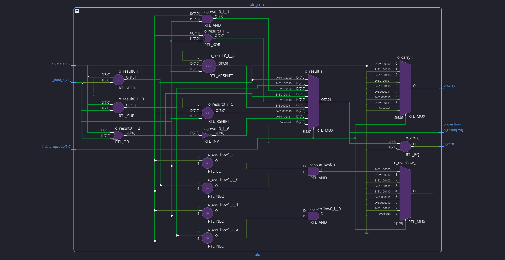</a>
</p>

<p align="center"><em>Figura 2. Operaciones, selección del resultado y cálculo de los indicadores en la vista RTL.</em></p>

## 5. Integración con los controles de la placa

### 5.1 Sincronización de las entradas

Para utilizar la ALU desde la Basys 3 se decidió compartir los ocho switches entre A, B y el opcode. Cada pulsador selecciona el registro que debe recibir el valor configurado. Esta forma de ingreso exige que las señales de los botones puedan utilizarse en un circuito gobernado por el reloj de 100 MHz, aunque sus transiciones sean producidas manualmente y no tengan relación temporal con él.

El módulo `button_input` resuelve esa entrada al dominio de reloj mediante dos flip-flops en serie. El primero captura el nivel del pin y el segundo toma la muestra de la primera etapa en el siguiente flanco. Esto deja tiempo para que una eventual metastabilidad de la primera etapa se resuelva antes de que la señal se utilice en el resto del circuito.

```systemverilog
(* ASYNC_REG = "TRUE" *) reg button_meta = 1'b0;
(* ASYNC_REG = "TRUE" *) reg button_sync = 1'b0;

always @(posedge clk) begin
  button_meta <= button;
  button_sync <= button_meta;
end

assign button_pressed = button_sync;
```

Las asignaciones no bloqueantes hacen que ambos registros se actualicen tomando los valores que tenían sus entradas antes del flanco. Por eso la segunda etapa recibe la muestra del ciclo previo y no el nuevo valor que se está asignando a la primera. El atributo `ASYNC_REG` identifica la cadena para que Vivado la preserve y favorezca la proximidad de los flip-flops durante la implementación. [Documentación de AMD sobre ASYNC_REG](https://docs.amd.com/r/en-US/ug912-vivado-properties/ASYNC_REG).

El esquema elaborado de la figura 3 permite reconocer esa conexión: la salida Q del primer registro llega a D del segundo, y ambos comparten el mismo reloj. La salida de la segunda etapa es el nivel que se entrega al módulo superior.

<p align="center">
  <a href="docs/images/schematic_button_rtl.png">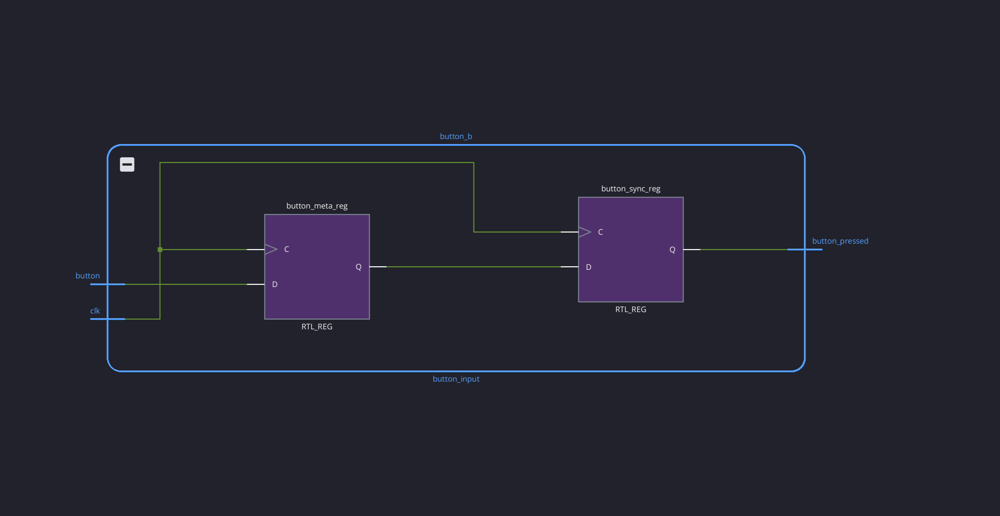</a>
</p>

<p align="center"><em>Figura 3. Dos registros conectados en serie para sincronizar el pulsador.</em></p>

La salida reproduce el nivel del pulsador con el retardo de las dos etapas, por lo que puede utilizarse como habilitación de carga mientras el botón permanece presionado. Como el sincronizador no filtra los rebotes mecánicos, una misma pulsación puede producir varias activaciones. Para la operación prevista esto permite recargar el mismo valor: el usuario prepara primero los switches y los conserva en esa posición hasta soltar el botón y dejar que se propague su liberación.

Esta condición de uso explica por qué el bus de switches se conecta directamente a los registros de datos. Cuando llega la habilitación, el número ya debe estar configurado y debe seguir disponible durante la carga. El sincronizador de los botones reduce el riesgo de propagar metastabilidad en las señales de control, pero no garantiza por sí mismo la captura coherente de los ocho switches si estos se modifican durante una carga.

### 5.2 Almacenamiento de los operandos y del opcode

Con las señales de los botones sincronizadas, el módulo superior puede utilizarlas para habilitar tres bancos de registros. A y B ocupan ocho bits cada uno, mientras que el opcode ocupa seis. Todos se actualizan en el flanco ascendente de `clk`, y cada registro conserva su valor cuando su habilitación está desactivada.

El reset se evalúa antes de las cargas para darle prioridad. Además de la entrada sincronizada del pulsador central, se utiliza `startup_reset`, inicializado en uno, para borrar los registros en el primer ciclo después de la configuración. El bloque que reúne estas decisiones es el siguiente:

```systemverilog
reg startup_reset = 1'b1;

always @(posedge clk) begin
  startup_reset <= 1'b0;

  if (startup_reset || reset_pressed) begin
    data_a <= 8'b0;
    data_b <= 8'b0;
    opcode <= 6'b0;
  end else begin
    if (load_a) begin
      data_a <= switches;
    end

    if (load_b) begin
      data_b <= switches;
    end

    if (load_opcode) begin
      opcode <= switches[5:0];
    end
  end
end
```

En el primer flanco, la condición del `if` todavía utiliza el uno inicial de `startup_reset`, porque su actualización a cero se hace efectiva después de evaluar el bloque. Esto produce el borrado inicial y deja los ciclos siguientes bajo el control del pulsador de reset.

Mientras el reset está activo, la rama de carga no se ejecuta. Una vez liberado y propagado ese cambio por el sincronizador, vuelven a actuar las habilitaciones de los botones que sigan presionados. Como cada carga se evalúa con un `if` independiente, también es posible cargar A y B simultáneamente con el mismo valor de los switches.

La figura 4 muestra cómo se integran estas funciones. Los sincronizadores llegan a las entradas de habilitación CE de los registros, los switches llegan a D y el reloj común llega a C. Las salidas de los registros alimentan la ALU, cuyo resultado y cuyos indicadores se conectan directamente a los once LEDs.

<p align="center">
  <a href="docs/images/schematic_top_rtl.png">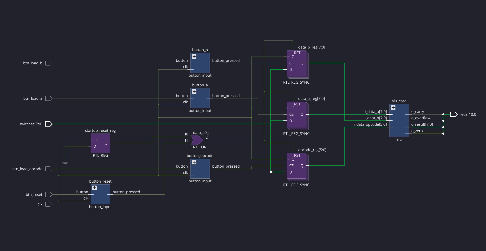</a>
</p>

<p align="center"><em>Figura 4. Integración de los pulsadores sincronizados, los registros y el núcleo de cálculo.</em></p>

### 5.3 Secuencia de uso y conexiones físicas

La distribución de botones acompaña la secuencia de ingreso: el botón izquierdo carga A, el derecho carga B y el superior carga el opcode. El botón central borra los tres registros, mientras que el inferior queda sin utilizar. La asignación completa es la siguiente:

| Recurso | Puerto | Función |
|---|---|---|
| SW7–SW0 | `switches[7:0]` | Dato compartido para las cargas |
| BTNL, izquierda | `btn_load_a` | Cargar A |
| BTNR, derecha | `btn_load_b` | Cargar B |
| BTNU, arriba | `btn_load_opcode` | Cargar opcode desde SW5–SW0 |
| BTNC, centro | `btn_reset` | Borrar A, B y opcode |
| LED7–LED0 | `leds[7:0]` | Resultado |
| LED8 | `leds[8]` | Cero |
| LED9 | `leds[9]` | Carry |
| LED10 | `leds[10]` | Overflow |

Por ejemplo, para calcular 5 + 3 se configura primero `00000101` y se presiona y suelta el botón izquierdo. Luego se ingresa `00000011` y se hace lo mismo con el derecho. Finalmente se coloca `100000` en los seis switches inferiores y se pulsa el botón superior. La ALU recibe entonces los tres valores guardados y muestra `00001000`, encendiendo LED3. Si se presiona reset, A, B y el opcode se borran; el resultado pasa a cero y se enciende LED8.

Para llevar esta asignación funcional a la placa se utilizó `basys3.xdc`, tomando como referencia el [archivo maestro de restricciones de Digilent](https://github.com/Digilent/digilent-xdc/blob/master/Basys-3-Master.xdc). En él se conectan los botones de A, B, opcode y reset a W19, T17, T18 y U18, respectivamente. Los indicadores de cero, carry y overflow se asignan a V13, V3 y W3. El reloj entra por W5 y se declara con período de 10 ns:

```tcl
set_property -dict { PACKAGE_PIN W5 IOSTANDARD LVCMOS33 } [get_ports clk]
create_clock -name sys_clk -period 10.000 [get_ports clk]
```

La vista I/O Ports de la figura 5 permite revisar en conjunto estas conexiones y las del resto de los switches y LEDs. El total es de 24 bits de entrada o salida: ocho switches, cuatro pulsadores, un reloj y once LEDs.

<p align="center">
  <a href="docs/images/ports.png">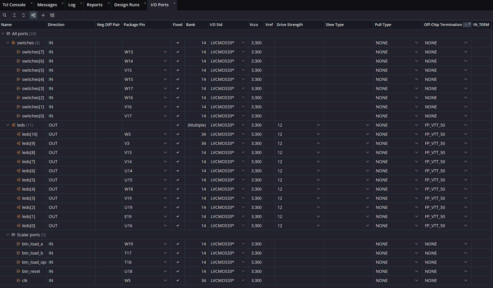</a>
</p>

<p align="center"><em>Figura 5. Conexiones físicas del diseño y estándar eléctrico LVCMOS33.</em></p>

Además de los pines, el XDC define el alcance del análisis temporal. Las entradas de los pulsadores se consideran asíncronas hasta la primera etapa de sincronización. Los switches se capturan bajo la condición de estabilidad durante la carga, y los LEDs no tienen un reloj externo de captura. Por ello se exceptúan estas rutas mediante:

```tcl
set_false_path -from [get_ports {btn_load_a btn_load_b btn_load_opcode btn_reset}]
set_false_path -from [get_ports {switches[*]}]
set_false_path -to [get_ports {leds[*]}]
```

Las rutas entre registros, incluidas las etapas del sincronizador, siguen sujetas al reloj. Esta distinción será importante al interpretar los resultados temporales: cumplir las restricciones internas no demuestra que los switches se mantengan estables ni reemplaza la prueba de las entradas manuales en la placa.

## 6. Verificación del comportamiento

### 6.1 Revisión del diseño y estrategia de prueba

Antes de interpretar los resultados funcionales se revisó el diseño con las herramientas de análisis estático. El panel Linter de Vivado, mostrado en la figura 6, no registró violaciones ni reglas exceptuadas en la ejecución documentada. Esta revisión permite detectar problemas en la descripción, pero debe complementarse con estímulos que comprueben el comportamiento esperado.

<p align="center">
  <a href="docs/images/linter_successful.png">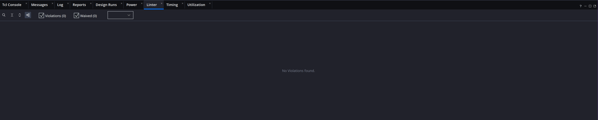</a>
</p>

<p align="center"><em>Figura 6. Análisis estático de Vivado sin violaciones reportadas.</em></p>

La simulación se organizó siguiendo la estructura del circuito. Primero se verificó que la ALU calculara correctamente cada operación y sus indicadores. Después se comprobó la propagación de una pulsación por el sincronizador y, finalmente, se probaron las cargas y salidas del módulo superior. Así, cada prueba se concentra en una responsabilidad concreta antes de evaluar su integración.

### 6.2 Operaciones e indicadores de la ALU

El testbench `alu_tb.sv` utiliza la tarea `check_result` para aplicar dos operandos y un opcode. La tarea calcula los valores esperados, deja transcurrir 10 ns y compara el resultado y los tres indicadores con las salidas del dispositivo bajo prueba. La comparación usa `!==`, de modo que también detecta valores desconocidos o de alta impedancia. El fragmento de la tarea que realiza esa comprobación es:

```systemverilog
#10;
tests = tests + 1;

if ({result, zero, carry, overflow} !==
    {expected, expected_zero, expected_carry, expected_overflow}) begin
  errors = errors + 1;
  $display("ERROR op=%b A=%h B=%h expected=%h obtained=%h", test_opcode, test_a, test_b,
           expected, result);
  $display("  expected Z/C/V=%b%b%b, obtained=%b%b%b", expected_zero, expected_carry,
           expected_overflow, zero, carry, overflow);
end
```

Para comprobar los indicadores se eligieron criterios que permiten contrastar las expresiones del núcleo. El carry de ADD se verifica evaluando si A supera la diferencia entre el máximo sin signo y B. En el caso del overflow, los operandos se extienden con signo a nueve bits y se calcula si la suma o resta queda fuera de −128 a 127. El modelo de prueba puede así detectar el desbordamiento mediante el rango numérico, mientras que la ALU lo obtiene mediante los bits de signo. La extensión de los operandos se realiza antes de seleccionar la operación:

```systemverilog
signed_a = {test_a[NB_DATA-1], test_a};
signed_b = {test_b[NB_DATA-1], test_b};
```

Con esos valores ampliados, la rama de suma establece las salidas esperadas de esta manera:

```systemverilog
OP_ADD: begin
  expected = test_a + test_b;
  expected_carry = test_a > (ALL_ONES - test_b);
  signed_result = signed_a + signed_b;
  expected_overflow = (signed_result < SIGNED_MIN) || (signed_result > SIGNED_MAX);
end
```

Para SUB se utiliza el mismo criterio de rango sobre la diferencia:

```systemverilog
signed_result = signed_a - signed_b;
expected_overflow = (signed_result < SIGNED_MIN) || (signed_result > SIGNED_MAX);
```

La secuencia comienza con 14 casos dirigidos que incluyen resultado cero, acarreo, desbordamiento de suma y resta, desplazamientos y un opcode inválido. A continuación se generan cien pares de operandos por cada una de las ocho operaciones, utilizando `$urandom()` con una semilla fija inicializada una sola vez. El siguiente fragmento reúne la inicialización del generador y el bucle de pruebas aleatorias; entre ambos se ejecutan los casos dirigidos:

```systemverilog
seed = 32'h1a2b3c4d;
seed = $urandom(seed);

// ... inicialización de señales y casos dirigidos ...

for (i = 0; i < 8; i = i + 1) begin
  for (j = 0; j < 100; j = j + 1) begin
    check_result($urandom(), $urandom(), operations[i]);
  end
end
```

De este modo, cada operación recibe cien pruebas aleatorias, además de los casos dirigidos que le corresponden. La secuencia completa reúne 814 comprobaciones.

La figura 7 muestra el comienzo de esa secuencia. En el primer intervalo, `FF + 01` entrega `00`, con cero y carry activos. Luego se observan los resultados `C0` y `40` de SRA y SRL sobre `80`. Más adelante aparecen casos de overflow. Las señales esperadas se presentan junto a las salidas del núcleo para facilitar su comparación.

<p align="center">
  <a href="docs/images/waveforms_alu.png">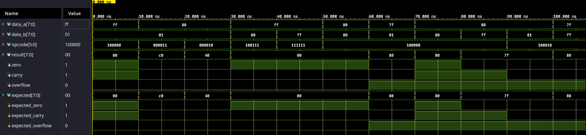</a>
</p>

<p align="center"><em>Figura 7. Resultados e indicadores durante los primeros casos dirigidos.</em></p>

La comparación automática se mantiene durante toda la simulación, no solo en el intervalo visible. Si se encuentra una diferencia, el testbench informa los operandos, el opcode y las salidas involucradas; al terminar, utiliza `$fatal` si hubo errores. La condición de cierre distingue una ejecución con errores de una aprobada:

```systemverilog
if (errors != 0) begin
  $fatal(1, "FAIL: %0d errors in %0d tests", errors, tests);
end

$display("PASS: %0d tests completed without errors", tests);
$finish;
```

La figura 8 muestra el resultado de la ejecución completa, que finalizó a los 8140 ns con las 814 comprobaciones aprobadas.

<p align="center">
  <a href="docs/images/testbench_alu.png">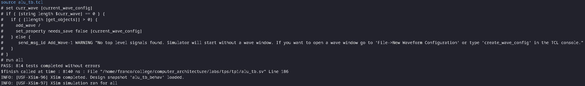</a>
</p>

<p align="center"><em>Figura 8. Finalización de la simulación de la ALU sin errores.</em></p>

### 6.3 Propagación de los pulsadores

Una vez comprobado el núcleo, se verificó el módulo `button_input` de forma aislada. Su testbench genera un reloj de período 10 ns y modifica el botón en los flancos descendentes. Las comprobaciones se realizan después de los flancos ascendentes y de la actualización de los registros, lo que permite observar el retardo introducido por la cadena. El reloj y la tarea de espera se describen así:

```systemverilog
always #5 begin
  clk = ~clk;
end

task automatic tick;
  begin
    @(posedge clk);
    #1;
  end
endtask
```

La prueba de activación aprovecha esa tarea para comprobar que la salida cambia después de dos flancos, y no inmediatamente al modificar el pin:

```systemverilog
@(negedge clk);
button = 1'b1;
#1;
check("El cambio del pin espera al reloj", 1'b0);

tick;
check("Primer flanco: captura en la primera etapa", 1'b0);

tick;
check("Segundo flanco: salida presionada", 1'b1);
```

En la figura 9, el botón se activa a los 10 ns. La primera etapa lo captura a los 15 ns y la salida se activa a los 25 ns, luego del segundo flanco ascendente. Al soltar el botón a los 80 ns, la salida se desactiva a los 95 ns. Aunque la captura solo muestra la entrada y la salida, ese comportamiento coincide con la conexión de dos registros presentada en la figura 3.

<p align="center">
  <a href="docs/images/waveforms_button.png">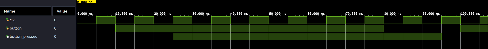</a>
</p>

<p align="center"><em>Figura 9. Retardo de propagación al presionar y soltar el botón.</em></p>

La prueba también contempla el nivel inicial, una pulsación sostenida y una pulsación de un ciclo. En conjunto se realizaron 14 comprobaciones, que finalizaron sin errores a los 126 ns, como muestra la figura 10. El resultado verifica la secuencia lógica de las etapas; la metastabilidad es un fenómeno eléctrico que esta simulación RTL no reproduce.

<p align="center">
  <a href="docs/images/testbench_button.png">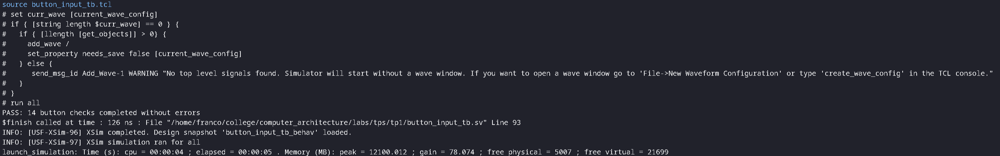</a>
</p>

<p align="center"><em>Figura 10. Finalización de las 14 comprobaciones del sincronizador.</em></p>

### 6.4 Carga de datos e integración del sistema

La última etapa de la verificación utiliza `alu_top_tb.sv` para comprobar el recorrido completo desde los switches y pulsadores hasta los registros y LEDs. La tarea `check_state` compara A, B, opcode y los once bits de salida, de modo que puede detectar tanto un cálculo incorrecto como una carga realizada en un registro distinto del esperado. Su condición de error reúne esas señales en una sola comparación:

```systemverilog
if ({dut.data_a, dut.data_b, dut.opcode, leds} !==
    {expected_a, expected_b, expected_opcode, expected_leds}) begin
  errors = errors + 1;
  $display("ERROR: %0s", description);
  $display("  expected A=%h B=%h opcode=%b LED=%h", expected_a, expected_b, expected_opcode,
           expected_leds);
  $display("  obtained A=%h B=%h opcode=%b LED=%h", dut.data_a, dut.data_b, dut.opcode, leds);
end
```

La secuencia comienza con el borrado de arranque y con cambios de switches mientras los botones están sueltos. Después carga A, B y el opcode por separado y observa los dos flancos de sincronización y el flanco adicional en el que el registro utiliza la habilitación. Para contemplar ese recorrido, el testbench define el número de ciclos de carga como:

```systemverilog
localparam integer LOAD_CYCLES = 3;
```

El tercer flanco es necesario porque, cuando la segunda etapa del sincronizador actualiza su salida, el registro de datos todavía evalúa la habilitación anterior. Recién en el flanco siguiente encuentra el nivel activo y captura el dato. Esta secuencia relaciona la espera del testbench con las asignaciones no bloqueantes del circuito.

La figura 11 recoge el inicio de la simulación, hasta el comienzo de la pulsación para cargar A. Durante ese intervalo, `leds` muestra `100` hexadecimal, que corresponde al indicador de cero encendido, y el contador de errores permanece en cero. Todavía no se cargó un opcode válido, por lo que el resultado de ocho bits no cambia.

<p align="center">
  <a href="docs/images/waveforms_top.png">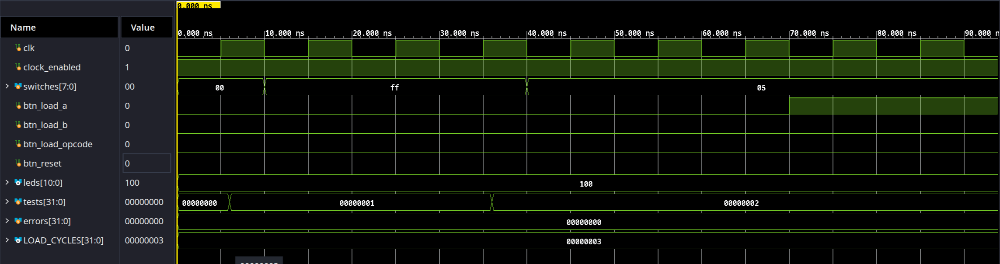</a>
</p>

<p align="center"><em>Figura 11. Inicialización, cambios de switches y comienzo de la carga de A.</em></p>

La simulación continúa fuera de esa ventana con pulsaciones sostenidas, rebotes al soltar manteniendo fijo el dato y cargas simultáneas de A y B. También comprueba que el reset tenga prioridad y que, al liberar el reset, los botones que sigan presionados vuelvan a habilitar las cargas. Para verificar la dependencia del reloj, el testbench lo detiene mientras cambia una entrada y comprueba que los registros conserven su estado hasta que se reanuden los flancos.

Por último se aplican operaciones con resultados e indicadores conocidos, incluidos casos en los que carry u overflow deben apagarse al seleccionar otra operación. Las 38 comprobaciones del top finalizaron sin errores a los 7051 ns, según la consola de la figura 12.

<p align="center">
  <a href="docs/images/testbench_top.png">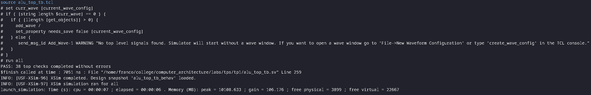</a>
</p>

<p align="center"><em>Figura 12. Finalización de las 38 comprobaciones de integración.</em></p>

Las tres simulaciones reúnen 866 comprobaciones aprobadas: 814 de la ALU, 14 del sincronizador y 38 del conjunto. Este resultado respalda los casos funcionales ensayados, aunque no constituye una prueba exhaustiva de todas las entradas ni de todos los posibles rebotes. La verificación temporal y la prueba física completan aspectos que no quedan cubiertos por estos estímulos.

## 7. Síntesis e implementación en la FPGA

Con el comportamiento verificado, se sintetizó el diseño para el dispositivo `xc7a35tcpg236-1`. En esta etapa Vivado transforma los operadores y registros de la descripción RTL en una red de recursos disponibles en la Artix-7. La síntesis terminó correctamente, como se muestra en la figura 13, y permitió avanzar a la implementación.

<p align="center">
  <a href="docs/images/synthesis_successful.png">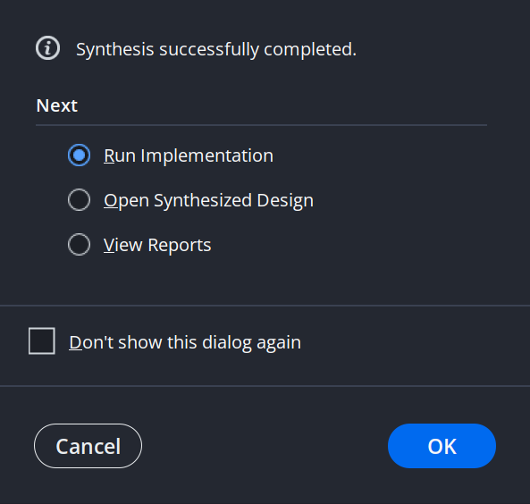</a>
</p>

<p align="center"><em>Figura 13. Finalización de la síntesis para el dispositivo seleccionado.</em></p>

Durante la implementación se determina dónde se ubican esos recursos y cómo se conectan. Este paso incorpora las restricciones de pines y de reloj, y produce el diseño sobre el que se realiza el análisis temporal posterior al ruteo. La figura 14 documenta su finalización correcta.

<p align="center">
  <a href="docs/images/implementation_successful.png">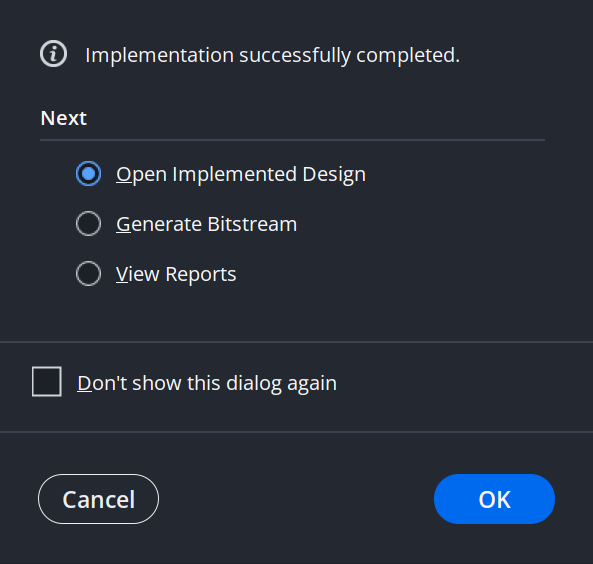</a>
</p>

<p align="center"><em>Figura 14. Finalización de la ubicación y el ruteo del circuito.</em></p>

### 7.1 Relación entre el esquema RTL y el circuito implementado

El esquema del top implementado, presentado en la figura 15, permite seguir el mismo recorrido que la vista RTL: entradas, sincronizadores, registros, ALU y salidas. La diferencia es el nivel de detalle. Los bancos de datos aparecen descompuestos en registros individuales y se incorporan los buffers de entrada, salida y distribución del reloj. Por eso la vista global ocupa más espacio, aunque sigue describiendo la misma organización funcional.

<p align="center">
  <a href="docs/images/schematic_top_implementation.png">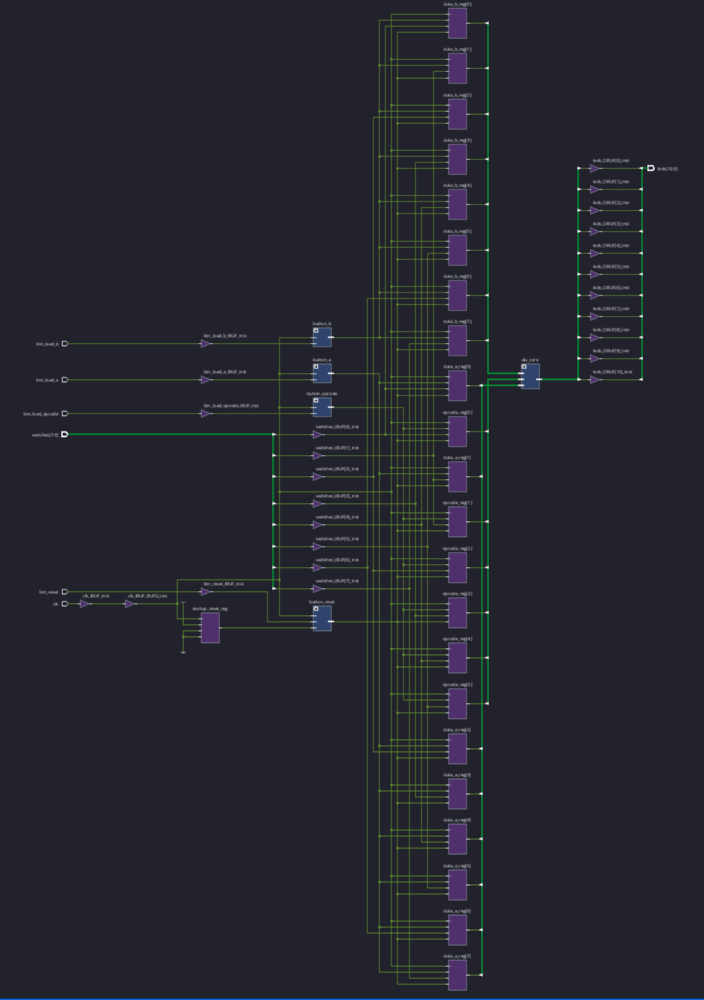</a>
</p>

<p align="center"><em>Figura 15. Vista general de los recursos y conexiones del módulo superior.</em></p>

Al abrir el núcleo de la ALU se observa cómo se resolvieron las operaciones en la tecnología del dispositivo. La figura 16 muestra LUT, multiplexores y cadenas CARRY4. Las expresiones del código no se convierten necesariamente en compuertas individuales: Vivado combina funciones dentro de las LUT y utiliza recursos dedicados de acarreo para la lógica aritmética. Esta transformación explica la diferencia entre los operadores de la figura 2 y la red que se obtiene después de la síntesis e implementación.

<p align="center">
  <a href="docs/images/schematic_alu_implementation.png">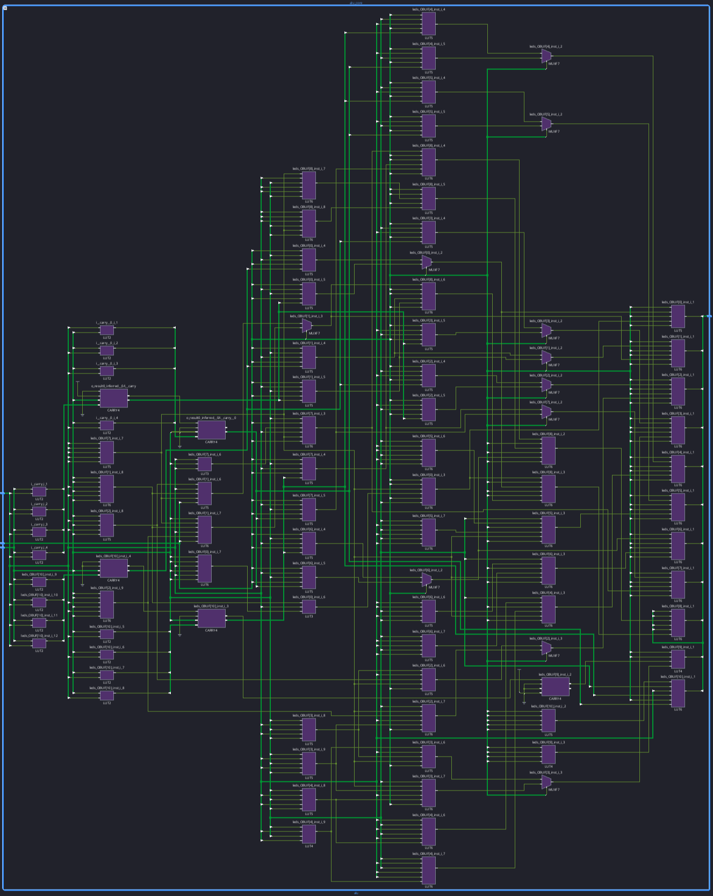</a>
</p>

<p align="center"><em>Figura 16. Implementación del núcleo mediante LUT, multiplexores y cadenas de acarreo.</em></p>

En el sincronizador la relación es más directa. Los dos registros de la descripción se implementan mediante dos flip-flops FDRE, con sus habilitaciones activas y sus entradas de reset conectadas a cero. La figura 17 permite comprobar que se conserva la conexión en serie y el reloj compartido, aun cuando la herramienta utilice otros nombres para las conexiones de la instancia.

<p align="center">
  <a href="docs/images/schematic_button_implementation.png">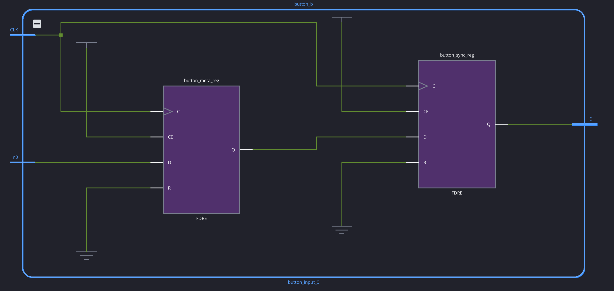</a>
</p>

<p align="center"><em>Figura 17. Dos flip-flops FDRE que implementan las etapas del sincronizador.</em></p>

### 7.2 Recursos utilizados

Los esquemáticos muestran cómo está construido el circuito, mientras que el reporte de utilización permite cuantificar su costo. Los valores obtenidos se resumen en la siguiente tabla y en la figura 18:

| Recurso | Utilizado | Disponible | Utilización |
|---|---:|---:|---:|
| LUT | 76 | 20800 | 0,37 % |
| Flip-flops | 31 | 41600 | 0,07 % |
| I/O | 24 | 106 | 22,64 % |

<p align="center">
  <a href="docs/images/utilization_summary.png">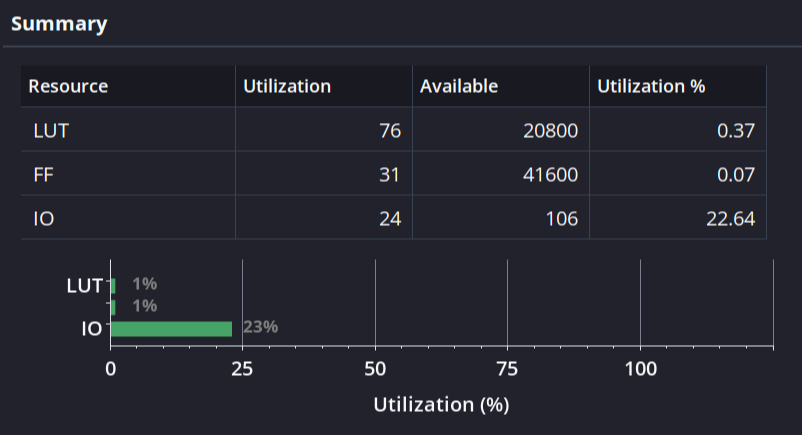</a>
</p>

<p align="center"><em>Figura 18. Ocupación de LUT, flip-flops y pines de entrada y salida.</em></p>

La cantidad de flip-flops coincide con la estructura prevista: los registros de A, B y opcode requieren 22 bits, los cuatro sincronizadores agregan ocho y el reset de arranque utiliza uno. Los 24 I/O también se corresponden con la interfaz de ocho switches, cuatro botones, un reloj y once LEDs. Esta relación permite contrastar el reporte con las decisiones tomadas durante el diseño.

La vista jerárquica de la figura 19 muestra que 75 de las 76 LUT pertenecen al núcleo y que este no contiene registros, como corresponde a su funcionamiento combinacional. La fila del top incluye los recursos de sus submódulos, por lo que no debe sumarse nuevamente la fila de la ALU. En el mismo reporte se observan once multiplexores F7 y un buffer global de reloj.

<p align="center">
  <a href="docs/images/utilization_hierarchy.png">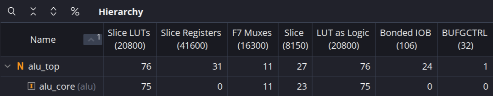</a>
</p>

<p align="center"><em>Figura 19. Distribución de los recursos entre el módulo superior y la ALU.</em></p>

Finalmente, la vista Device permite ubicar el circuito dentro de la estructura física del FPGA. La figura 20 complementa la información de los esquemáticos y los reportes mostrando las regiones y recursos resaltados. Los porcentajes de ocupación se toman del reporte de utilización, ya que el tamaño aparente de los elementos en esta vista depende de la representación gráfica.

<p align="center">
  <a href="docs/images/device.png">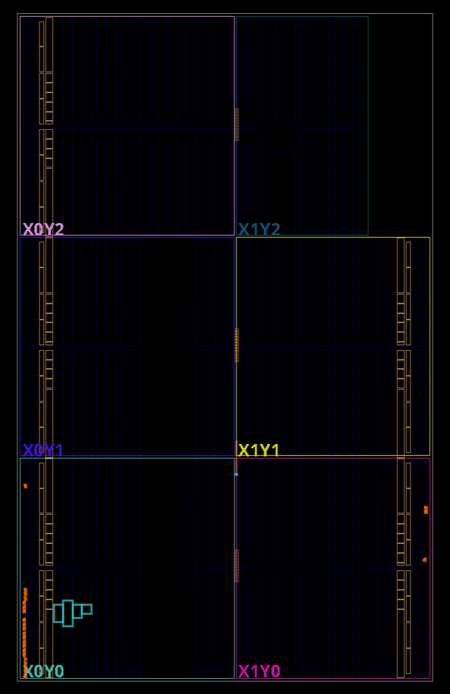</a>
</p>

<p align="center"><em>Figura 20. Distribución física mostrada por Vivado en la vista Device.</em></p>

## 8. Análisis temporal y preparación de la prueba física

La implementación se analizó con un reloj de período 10 ns. El resultado posterior al ruteo, mostrado en la figura 21, informa márgenes positivos para setup, hold y ancho de pulso, sin endpoints con falla.

| Análisis | Peor margen | Violación total | Endpoints con falla |
|---|---:|---:|---:|
| Setup, WNS / TNS | 7,224 ns | 0,000 ns | 0 |
| Hold, WHS / THS | 0,128 ns | 0,000 ns | 0 |
| Ancho de pulso, WPWS / TPWS | 4,500 ns | 0,000 ns | 0 |

<p align="center">
  <a href="docs/images/timing_summary.png">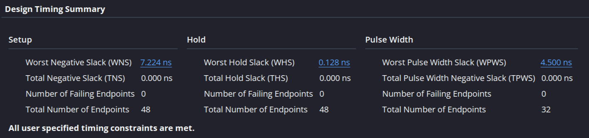</a>
</p>

<p align="center"><em>Figura 21. Cumplimiento de las restricciones temporales especificadas.</em></p>

El margen de setup indica cuánto tiempo queda entre la llegada de los datos y el límite requerido antes del flanco de captura. En la ruta más exigente analizada ese margen es de 7,224 ns. El margen de hold, de 0,128 ns, indica que también se cumple la conservación mínima de los datos después del flanco. El reporte contempla 48 endpoints para setup y hold y 32 para ancho de pulso, todos sin violaciones.

Estos resultados deben interpretarse dentro del alcance definido en el XDC. Las rutas hacia los LEDs están exceptuadas y la ALU no tiene un registro de captura a la salida, de modo que el resumen no establece por sí solo una frecuencia máxima para todo el núcleo. Del mismo modo, el análisis interno no comprueba la estabilidad de los switches durante una carga. Esa condición depende del procedimiento de uso descrito y debe verificarse junto con la respuesta de los pulsadores en la placa.

El siguiente paso es generar el bitstream de la implementación documentada y programar la Basys 3 desde Hardware Manager. La prueba física deberá comenzar con cargas independientes de A, B y opcode, y continuar con operaciones que permitan distinguir los indicadores: una suma sin desbordamiento, una suma con carry y resultado cero, y casos de overflow en suma y resta. También deberá comprobarse el borrado desde registros no nulos y la conservación de los datos al soltar cada botón. Estas pruebas quedan pendientes y completarán la evidencia obtenida en simulación y en los reportes de Vivado.

## 9. Conclusiones

Como grupo, consideramos que el principal aprendizaje del trabajo fue comprender que la corrección de un circuito depende tanto de sus operaciones como de las condiciones en que recibe y conserva los datos. La interacción con los pulsadores hizo necesario relacionar una acción manual con la captura gobernada por un reloj. Esa relación nos permitió fundamentar la separación entre sincronización, almacenamiento y cálculo, y reconocer la importancia de definir el procedimiento de uso junto con el hardware.

La verificación por módulos también modificó nuestra manera de evaluar el diseño. Comprobar una operación aritmética no alcanza para asegurar que el usuario cargue el operando esperado o que el reset tenga prioridad sobre una carga. Al examinar esos comportamientos por separado y luego en conjunto, pudimos establecer qué responsabilidad se estaba comprobando en cada prueba. Del mismo modo, los casos de carry y overflow nos ayudaron a distinguir el patrón binario obtenido de su interpretación numérica: los indicadores aportan información necesaria para decidir si un resultado representa la operación esperada.

Finalmente, entendemos que los resultados favorables de las herramientas deben interpretarse junto con sus condiciones y límites. Las simulaciones respaldan los casos ensayados y el análisis temporal respalda las rutas sujetas a las restricciones definidas; ninguno sustituye la observación de los controles físicos. Por eso consideramos que el diseño cuenta con una base de verificación suficiente para pasar al ensayo en la placa, pero reservamos la validación de la interacción manual hasta realizar esa prueba. Esta distinción entre lo comprobado y lo pendiente forma parte del criterio de diseño que nos deja el trabajo.

## Referencias

- [Digilent: archivo maestro de restricciones de la Basys 3](https://github.com/Digilent/digilent-xdc/blob/master/Basys-3-Master.xdc).
- [AMD: propiedad ASYNC_REG, Vivado Design Suite Properties Reference Guide (UG912)](https://docs.amd.com/r/en-US/ug912-vivado-properties/ASYNC_REG).
- Fuentes SystemVerilog, testbenches y restricciones del proyecto.
- Capturas de elaboración, simulación e implementación incluidas en este informe.
