# Trabajo Práctico N.º 1 — Unidad Aritmético-Lógica

## 1. Introducción y objetivos

Una unidad aritmético-lógica constituye uno de los componentes fundamentales de un procesador, ya que concentra las operaciones aritméticas y lógicas realizadas sobre los datos. En este trabajo se desarrolló una ALU en Verilog con el propósito de recorrer el flujo completo de diseño digital: desde la descripción funcional y su verificación hasta la implementación sobre una FPGA.

Para alcanzar ese propósito se plantearon los siguientes objetivos:

1. Describir en Verilog una ALU capaz de realizar suma, resta, AND, OR, XOR, NOR, desplazamiento lógico a derecha y desplazamiento aritmético a derecha.
2. Parametrizar el ancho del bus de datos para que el módulo pueda reutilizarse posteriormente en un sistema de mayor tamaño.
3. Construir un testbench que combine casos específicos con entradas pseudoaleatorias.
4. Incorporar una comprobación automática que compare cada salida con un resultado de referencia.
5. Sintetizar e implementar el diseño para el dispositivo Artix-7 de la Basys 3.
6. Analizar los recursos utilizados y el comportamiento temporal mediante las herramientas de Vivado.
7. Validar el funcionamiento final utilizando los switches, pulsadores y LEDs de la placa.

## 2. Especificación

La interfaz de la ALU está formada por dos operandos, denominados A y B, un código de operación y una salida de resultado. Los operandos y el resultado comparten el mismo ancho, definido mediante el parámetro `NB_DATA`; para esta implementación se utilizó un valor predeterminado de 8 bits. El código de operación ocupa 6 bits y determina cuál de las ocho funciones disponibles debe aplicarse.

| Operación | Opcode | Expresión |
|---|---:|---|
| ADD | `100000` | `A + B` |
| SUB | `100010` | `A - B` |
| AND | `100100` | `A & B` |
| OR | `100101` | `A \| B` |
| XOR | `100110` | `A ^ B` |
| SRA | `000011` | `$signed(A) >>> B` |
| SRL | `000010` | `A >> B` |
| NOR | `100111` | `~(A \| B)` |

Cuando el código recibido no coincide con ninguna operación válida, la salida toma el valor cero. Esta decisión permite definir el comportamiento del circuito para todas las combinaciones posibles de la entrada de control.

## 3. Arquitectura

Para mantener separadas las distintas responsabilidades, el proyecto se organizó en tres partes. El núcleo `alu.v` contiene exclusivamente la lógica combinacional; `alu_basys3_top.v` adapta sus entradas y salidas a los recursos físicos de la placa; y `alu_tb.v` proporciona un entorno independiente para verificar el funcionamiento del núcleo antes de llevarlo al hardware.

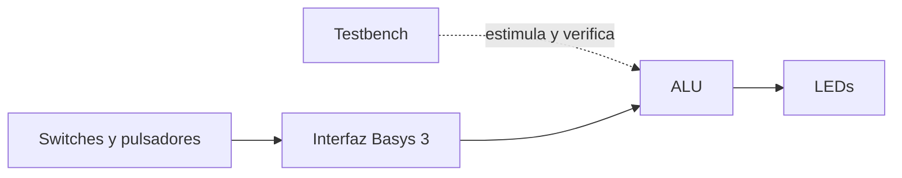

| Archivo | Descripción |
|---|---|
| `alu.v` | Núcleo combinacional parametrizable |
| `alu_tb.v` | Testbench con verificación automática |
| `alu_basys3_top.v` | Interfaz de entrada y salida para la Basys 3 |
| `basys3.xdc` | Restricciones de pines y ruteo |
| `tp1/tp1.xpr` | Proyecto de Vivado |

<!-- Captura 01: fuentes del proyecto. Guardar como docs/images/01-fuentes-vivado.png -->
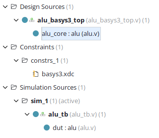

## 4. Implementación de la ALU

El desarrollo comenzó con el núcleo de la ALU. Su declaración incorpora parámetros para el ancho de los datos y del opcode:

```verilog
module alu #(
    parameter NB_DATA   = 8,
    parameter NB_OPCODE = 6
);
```

Las operaciones se seleccionan mediante una sentencia `case` dentro de un bloque `always @(*)`. De esta forma, cualquier modificación de los operandos o del opcode provoca la actualización del resultado sin esperar un flanco de reloj. Los códigos se declararon como `localparam`, lo que permite identificarlos por nombre y evita dispersar constantes binarias dentro del módulo.

```verilog
always @(*) begin
  case (i_data_opcode)
    OP_ADD:  o_result = i_data_a + i_data_b;
    OP_SUB:  o_result = i_data_a - i_data_b;
    OP_AND:  o_result = i_data_a & i_data_b;
    OP_OR:   o_result = i_data_a | i_data_b;
    OP_XOR:  o_result = i_data_a ^ i_data_b;
    OP_SRA:  o_result = $signed(i_data_a) >>> i_data_b;
    OP_SRL:  o_result = i_data_a >> i_data_b;
    OP_NOR:  o_result = ~(i_data_a | i_data_b);
    default: o_result = {NB_DATA{1'b0}};
  endcase
end
```

La diferencia entre los dos desplazamientos requiere especial atención. SRL introduce ceros por la izquierda, mientras que SRA debe conservar el signo del operando. Por ese motivo, antes de aplicar el operador `>>>`, la entrada A se convierte explícitamente mediante `$signed`. El caso `default`, además de establecer una respuesta conocida para opcodes inválidos, asegura que la salida reciba una asignación en todos los caminos del bloque combinacional.

## 5. Análisis del esquema sintetizado

Una vez incorporados el núcleo de la ALU y su interfaz para la placa, se ejecutó la síntesis y se abrió la vista **Schematic** de Vivado. Esta representación no reproduce literalmente el código fuente: muestra la red de elementos lógicos que el sintetizador obtuvo a partir de él.

<!-- Captura 02: esquema sintetizado. Guardar como docs/images/02-esquema-sintetizado.png -->
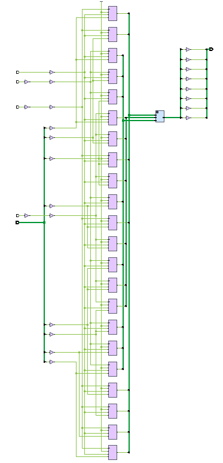

El recorrido general puede leerse de izquierda a derecha:

1. Las líneas de entrada reciben los valores de los switches y los pulsadores.
2. Tres bancos de registros almacenan A, B y el opcode. La suma de sus anchos da los 22 flip-flops observados en el reporte (`8 + 8 + 6 = 22`).
3. Las salidas de esos registros ingresan al núcleo `alu_core`, donde se realizan las operaciones y se selecciona el resultado correspondiente al opcode.
4. Los ocho bits resultantes atraviesan los buffers de salida y llegan a `LED7–LED0`.

La captura muestra numerosos bloques de tipo LUT porque una FPGA no implementa necesariamente cada expresión mediante una compuerta AND, OR o XOR individual. Vivado combina parte de esas expresiones dentro de tablas de consulta y utiliza recursos especializados, como las cadenas de acarreo, para resolver eficientemente la suma y la resta. Por este motivo, el aspecto del esquemático sintetizado difiere de un diagrama construido únicamente con compuertas lógicas elementales.

## 6. Verificación funcional

### 6.1 Estructura del testbench

Una vez descripta la ALU, se construyó un testbench autocheckeable. Este módulo no se sintetiza ni se carga en la placa: su única función es generar estímulos durante la simulación y comprobar la respuesta del diseño.

Las entradas de la ALU se representan mediante variables `reg`, ya que reciben valores desde el testbench. La salida se declara como `wire`, porque es producida por el dispositivo bajo prueba:

```verilog
reg  [NB_DATA-1:0]   data_a;
reg  [NB_DATA-1:0]   data_b;
reg  [NB_OPCODE-1:0] opcode;
wire [NB_DATA-1:0]   result;

reg [NB_DATA-1:0] expected;
reg [NB_OPCODE-1:0] operations[0:7];
integer seed;
integer errors;
integer tests;
integer i;
integer j;
```

Además de las señales conectadas a la ALU, `expected` conserva el resultado calculado por el modelo de referencia. El arreglo `operations` contiene los ocho códigos válidos; `seed` controla la generación pseudoaleatoria; y los enteros restantes cuentan pruebas, errores y repeticiones de los ciclos.

La ALU se instancia con el nombre `dut`, abreviatura de *Device Under Test*. De esta manera, `data_a`, `data_b` y `opcode` quedan conectados a sus entradas, mientras que `result` permite observar la salida calculada.

```verilog
alu #(
    .NB_DATA(NB_DATA),
    .NB_OPCODE(NB_OPCODE)
) dut (
    .o_result(result),
    .i_data_a(data_a),
    .i_data_b(data_b),
    .i_data_opcode(opcode)
);
```

### 6.2 Comprobación automática

Para evitar repetir el mismo procedimiento en cada prueba, se definió la tarea `check_result`. Cada llamada recibe dos operandos y un opcode, los aplica al DUT y calcula de manera independiente el valor que debería obtenerse. Ese valor se almacena en `expected`.

El modelo de referencia utiliza un `case` con las mismas operaciones, pero se encuentra dentro del entorno de prueba y no forma parte del circuito sintetizado. La tarea completa es la siguiente:

```verilog
task check_result;
  input [NB_DATA-1:0] test_a;
  input [NB_DATA-1:0] test_b;
  input [NB_OPCODE-1:0] test_opcode;
  begin
    data_a = test_a;
    data_b = test_b;
    opcode = test_opcode;

    case (test_opcode)
      OP_ADD: expected = test_a + test_b;
      OP_SUB: expected = test_a - test_b;
      OP_AND: expected = test_a & test_b;
      OP_OR:  expected = test_a | test_b;
      OP_XOR: expected = test_a ^ test_b;
      OP_SRA: expected = $signed(test_a) >>> test_b;
      OP_SRL: expected = test_a >> test_b;
      OP_NOR: expected = ~(test_a | test_b);
      default: expected = {NB_DATA{1'b0}};
    endcase

    #10;
    tests = tests + 1;
    if (result !== expected) begin
      errors = errors + 1;
      $display("ERROR op=%b A=%h B=%h expected=%h obtained=%h",
               test_opcode, test_a, test_b, expected, result);
    end
  end
endtask
```

Las primeras tres asignaciones colocan el estímulo en las entradas del DUT. A continuación, el `case` calcula el resultado esperado. El retardo `#10` deja transcurrir 10 ns para que la lógica combinacional se estabilice, y recién entonces se incrementa `tests` y se comparan ambas respuestas.

La comparación se realiza con `!==` en lugar de `!=`, por lo que también se consideran errores los estados desconocidos (`X`) o de alta impedancia (`Z`). Ante una diferencia, el testbench incrementa `errors` e imprime toda la información necesaria para identificar el caso que falló.

### 6.3 Casos dirigidos

La verificación comienza con cinco casos seleccionados manualmente para cubrir comportamientos que podrían no aparecer en una secuencia aleatoria:

1. La suma `FF + 01`, cuyo resultado de nueve bits se trunca a `00` por el ancho de la salida.
2. El desplazamiento aritmético de `80` una posición, que debe producir `C0` al replicar el bit de signo.
3. El desplazamiento lógico del mismo patrón, que debe producir `40` al ingresar un cero por la izquierda.
4. Una operación NOR con valores conocidos.
5. Un opcode inválido, para comprobar que se aplique el caso `default` y la salida sea cero.

Estos casos aparecen explícitamente al comienzo del bloque `initial`:

```verilog
check_result({NB_DATA{1'b1}},
             {{(NB_DATA-1){1'b0}}, 1'b1}, OP_ADD);
check_result({1'b1, {(NB_DATA-1){1'b0}}},
             {{(NB_DATA-1){1'b0}}, 1'b1}, OP_SRA);
check_result({1'b1, {(NB_DATA-1){1'b0}}},
             {{(NB_DATA-1){1'b0}}, 1'b1}, OP_SRL);
check_result({NB_DATA{1'b1}}, {NB_DATA{1'b0}}, OP_NOR);
check_result({NB_DATA{1'b1}}, {NB_DATA{1'b1}},
             {NB_OPCODE{1'b1}});
```

Las concatenaciones mantienen las pruebas adaptables al valor de `NB_DATA`. Por ejemplo, `{NB_DATA{1'b1}}` genera un operando compuesto completamente por unos, independientemente del ancho elegido.

### 6.4 Pruebas pseudoaleatorias

Después de los casos dirigidos se recorren las ocho operaciones mediante dos ciclos `for`. Para cada operación se generan cien pares de operandos con `$random`, y cada combinación se envía a `check_result`:

```verilog
for (i = 0; i < 8; i = i + 1)
  for (j = 0; j < 100; j = j + 1)
    check_result($random(seed), $random(seed), operations[i]);
```

La semilla del generador se mantuvo fija, de modo que cualquier falla pueda reproducirse utilizando exactamente la misma secuencia de datos. Las asignaciones a señales de 8 bits conservan la porción correspondiente de los números generados por `$random`.

Antes de comenzar los ciclos, el arreglo `operations` se carga con los ocho opcodes válidos. El índice `i` selecciona una operación y el índice `j` cuenta las cien combinaciones generadas para ella. De esta manera, ninguna operación depende de ser elegida al azar: todas reciben exactamente la misma cantidad de pruebas.

```verilog
operations[0] = OP_ADD;
operations[1] = OP_SUB;
operations[2] = OP_AND;
operations[3] = OP_OR;
operations[4] = OP_XOR;
operations[5] = OP_SRA;
operations[6] = OP_SRL;
operations[7] = OP_NOR;

seed = 32'h1a2b3c4d;
```

```text
5 casos dirigidos + 8 operaciones × 100 casos = 805 pruebas
```

### 6.5 Resultado de la simulación

La simulación comportamental se ejecutó con XSim mediante `Run Behavioral Simulation` y se dejó avanzar hasta que `$finish` detuvo el testbench. Al concluir las 805 verificaciones, no se registraron diferencias entre la salida del diseño y el modelo de referencia:

```verilog
if (errors == 0)
  $display("PASS: %0d tests completed without errors", tests);
else
  $display("FAIL: %0d errors in %0d tests", errors, tests);

$finish;
```

Como `errors` permaneció en cero, la rama de éxito imprimió en la consola:

```text
PASS: 805 tests completed without errors
```

<!-- Captura 03: consola con PASS. Guardar como docs/images/03-testbench-pass.png -->
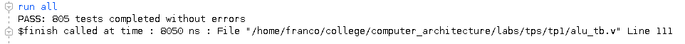

<!-- Captura 04: formas de onda. Guardar como docs/images/04-formas-de-onda.png -->
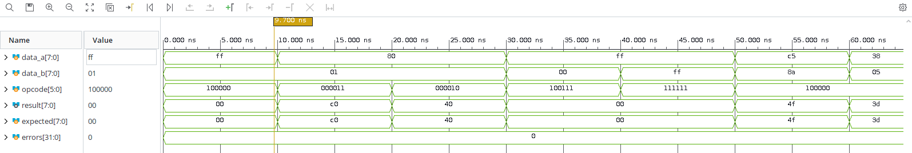

En las formas de onda puede observarse que `result` y `expected` coinciden después de cada cambio de entradas, mientras que `errors` permanece en cero. Los primeros intervalos corresponden a los casos dirigidos; a partir de allí comienzan los estímulos pseudoaleatorios.

## 7. Interfaz con la Basys 3

### 7.1 Asignación funcional

Aunque el núcleo necesita dos operandos de 8 bits y un opcode de 6 bits, la interfaz propuesta reutiliza los ocho switches inferiores de la Basys 3. El usuario configura un valor y selecciona su destino mediante un pulsador; dicho valor queda almacenado en un registro independiente, por lo que los switches pueden modificarse para ingresar el dato siguiente.

| Recurso | Función |
|---|---|
| `SW7–SW0` | Dato de entrada |
| `BTNU` | Carga del registro A |
| `BTNL` | Carga del registro B |
| `BTNR` | Carga del opcode desde `SW5–SW0` |
| `BTND` | Puesta a cero de A, B y opcode |
| `LED7–LED0` | Resultado de la ALU |

El procedimiento de uso se divide en tres cargas sucesivas:

1. Se representa el operando A en `SW7–SW0` y se presiona `BTNU`. El valor queda almacenado en `data_a`.
2. Se modifica el mismo banco de switches para representar B y se presiona `BTNL`. El nuevo valor queda almacenado en `data_b` sin alterar A.
3. Se configura el opcode en `SW5–SW0` y se presiona `BTNR`. Los dos switches superiores no intervienen porque el código posee 6 bits.

Una vez cargados los tres valores, la ALU actualiza los LEDs de forma combinacional. Por ejemplo, para calcular `5 + 3`, se carga `00000101` en A, `00000011` en B y `100000` en el registro de operación. El resultado `00001000` se muestra encendiendo únicamente `LED3`. `BTND` permite borrar los tres registros antes de comenzar una nueva secuencia.

### 7.2 Versión alternativa sin reloj

La primera versión de la interfaz utilizaba el oscilador de 100 MHz para sincronizar los pulsadores y detectar sus flancos. Durante la prueba física se comprobó que el oscilador de la placa asignada no entregaba señal, aunque la programación JTAG y las entradas y salidas combinacionales funcionaban correctamente. Debido a que no fue posible reemplazar la placa, se adoptó una versión alternativa que no depende de dicho oscilador.

En la solución implementada, el flanco ascendente de cada pulsador carga directamente uno de los registros. `BTND` se utiliza como reset asíncrono común:

```verilog
always @(posedge btnU or posedge btnD) begin
  if (btnD) data_a <= 8'b0;
  else data_a <= sw;
end

always @(posedge btnL or posedge btnD) begin
  if (btnD) data_b <= 8'b0;
  else data_b <= sw;
end

always @(posedge btnR or posedge btnD) begin
  if (btnD) opcode <= 6'b0;
  else opcode <= sw[5:0];
end
```

Esta alternativa mantiene la forma de uso prevista: primero se configura el dato en los switches y luego se pulsa el botón correspondiente. Aunque el rebote mecánico puede producir más de un flanco, las escrituras repetidas almacenan el mismo valor mientras los switches permanezcan estables. El uso de pulsadores como relojes no constituye la arquitectura recomendada para un diseño general, pero permitió validar el funcionamiento de la ALU con el hardware disponible.

### 7.3 Restricciones

Los nombres utilizados en Verilog no determinan por sí mismos una conexión física. Esa relación se establece en `basys3.xdc`, donde cada puerto del módulo superior se asocia con el pin correspondiente de la Basys 3 y con su estándar eléctrico.

```tcl
set_property -dict { PACKAGE_PIN T18 IOSTANDARD LVCMOS33 } [get_ports btnU]
set_property -dict { PACKAGE_PIN V17 IOSTANDARD LVCMOS33 } [get_ports {sw[0]}]
set_property -dict { PACKAGE_PIN U16 IOSTANDARD LVCMOS33 } [get_ports {led[0]}]
```

Los pines de los pulsadores no son entradas dedicadas de reloj. En consecuencia, Vivado rechazó inicialmente su conexión con los buffers globales de reloj. Dado el carácter excepcional de esta interfaz, se habilitó el ruteo no dedicado mediante:

```tcl
set_property CLOCK_DEDICATED_ROUTE FALSE [get_nets btnU_IBUF]
set_property CLOCK_DEDICATED_ROUTE FALSE [get_nets btnL_IBUF]
set_property CLOCK_DEDICATED_ROUTE FALSE [get_nets btnR_IBUF]
```

<!-- Captura 05: restricciones o planificación de E/S. Guardar como docs/images/05-restricciones-xdc.png -->
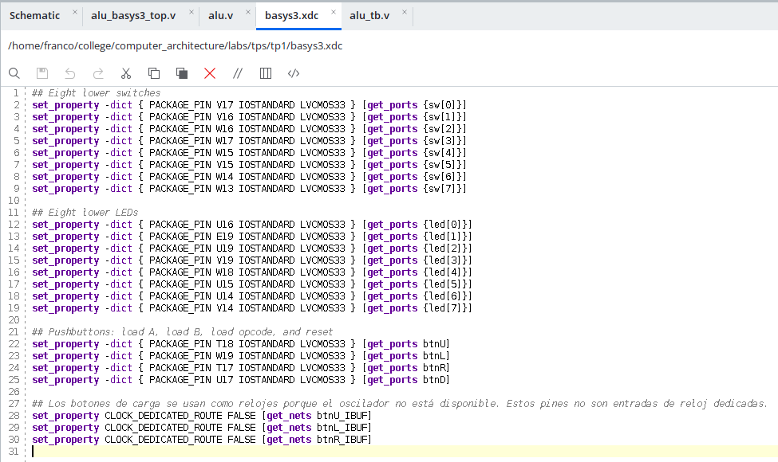

## 8. Síntesis e implementación

Con la verificación funcional completada, el proyecto se configuró para el dispositivo `xc7a35tcpg236-1` presente en la Basys 3. La síntesis transformó la descripción RTL en recursos disponibles en la arquitectura Artix-7, entre ellos LUT, flip-flops y cadenas de acarreo. Posteriormente, la implementación determinó su ubicación física y el ruteo de las conexiones internas.

Ambas etapas finalizaron correctamente, lo que permitió avanzar a la generación del bitstream y al análisis del diseño ya implementado.

<!-- Captura 06: síntesis completada. Guardar como docs/images/06-sintesis-completada.png -->
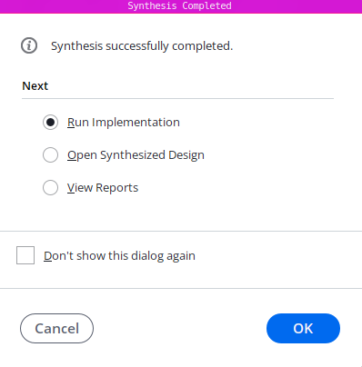

<!-- Captura 07: implementación completada. Guardar como docs/images/07-implementacion-completada.png -->
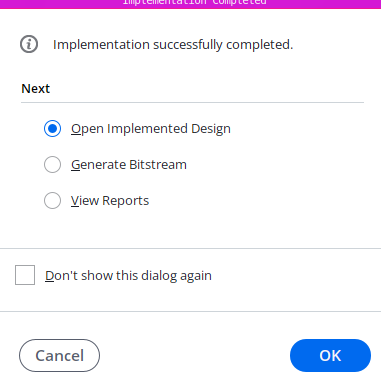

### 8.1 Utilización de recursos

| Recurso | Utilizado | Disponible | Utilización |
|---|---:|---:|---:|
| LUT | 64 | 20800 | 0,31 % |
| Flip-flops | 22 | 41600 | 0,05 % |
| I/O | 20 | 106 | 18,87 % |

<!-- Captura 08: Report Utilization. Guardar como docs/images/08-utilizacion.png -->
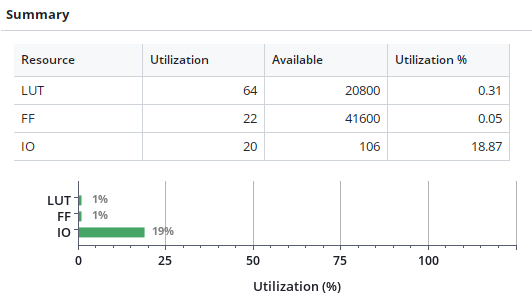

La vista jerárquica permite distinguir los recursos correspondientes al núcleo de la ALU de aquellos utilizados por la interfaz superior:

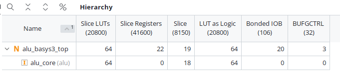

## 9. Análisis temporal

En la versión alternativa no existe un reloj periódico: los tres eventos de carga son producidos manualmente por los pulsadores. Por esta razón no se definió un periodo de reloj y Vivado informó que no existen restricciones temporales especificadas por el usuario. Los valores WNS y WHS aparecen como infinitos y no deben interpretarse como márgenes temporales del circuito.

El reporte registró 52 endpoints y ninguna violación, pero esta información no reemplaza el análisis de un diseño síncrono con un reloj definido. La temporización del núcleo combinacional se complementó mediante la simulación en XSim, mientras que la respuesta completa de la interfaz se comprobó directamente sobre la placa.

<!-- Captura 09: Design Timing Summary. Guardar como docs/images/09-timing-summary.png -->
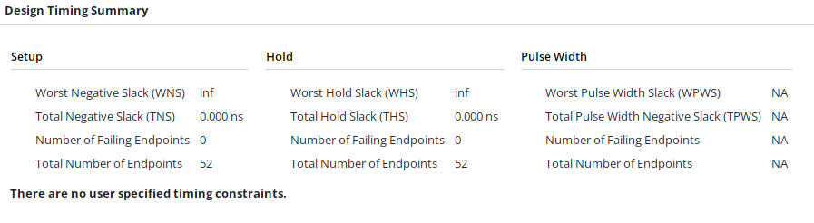

## 10. Generación del bitstream

Una vez finalizada la implementación, Vivado generó correctamente el bitstream. Este archivo contiene la configuración que se transferirá al FPGA para establecer el comportamiento de sus recursos lógicos, sus conexiones internas y sus pines de entrada y salida.

<!-- Captura 10: bitstream completado. Guardar como docs/images/10-bitstream-generado.png -->
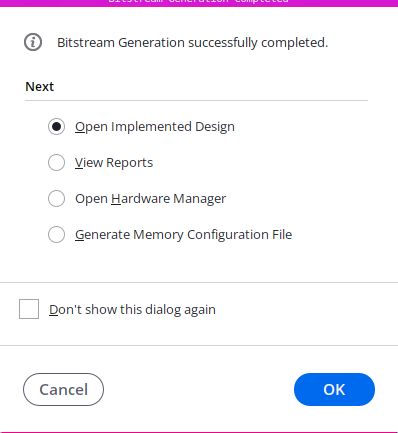

## 11. Validación sobre la placa

La placa fue detectada y programada mediante Hardware Manager. Antes de ensayar la ALU se utilizó un diseño de diagnóstico para verificar por separado los switches, los pulsadores y los LEDs. Estas entradas y salidas respondieron correctamente. También se comprobó mediante un contador que el oscilador de 100 MHz no entregaba flancos al diseño, lo que motivó la versión alternativa descripta anteriormente.

### 11.1 Procedimiento

1. Conectar y encender la Basys 3.
2. Detectar el dispositivo mediante Hardware Manager.
3. Programar el FPGA con `alu_basys3_top.bit`.
4. Cargar A, B y el opcode mediante los switches y pulsadores asignados.
5. Comparar los LEDs con el resultado esperado.

### 11.2 Casos realizados

| A | B | Operación | Opcode | Esperado | Observado |
|---:|---:|---|---:|---:|---:|
| 5 | 3 | ADD | `100000` | 8 | 8 |
| 10 | 4 | SUB | `100010` | 6 | 6 |
| `00001100` | `00001010` | AND | `100100` | `00001000` | `00001000` |
| `10000000` | 1 | SRL | `000010` | `01000000` | `01000000` |
| `10000000` | 1 | SRA | `000011` | `11000000` | `11000000` |

### 11.3 Evidencia fotográfica

**Suma (ADD)**

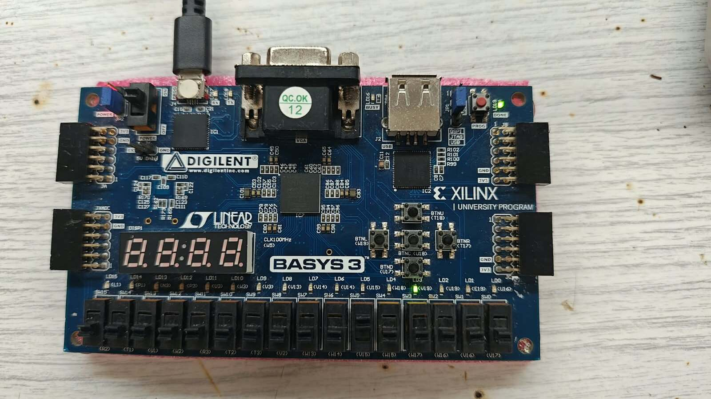

**Resta (SUB)**

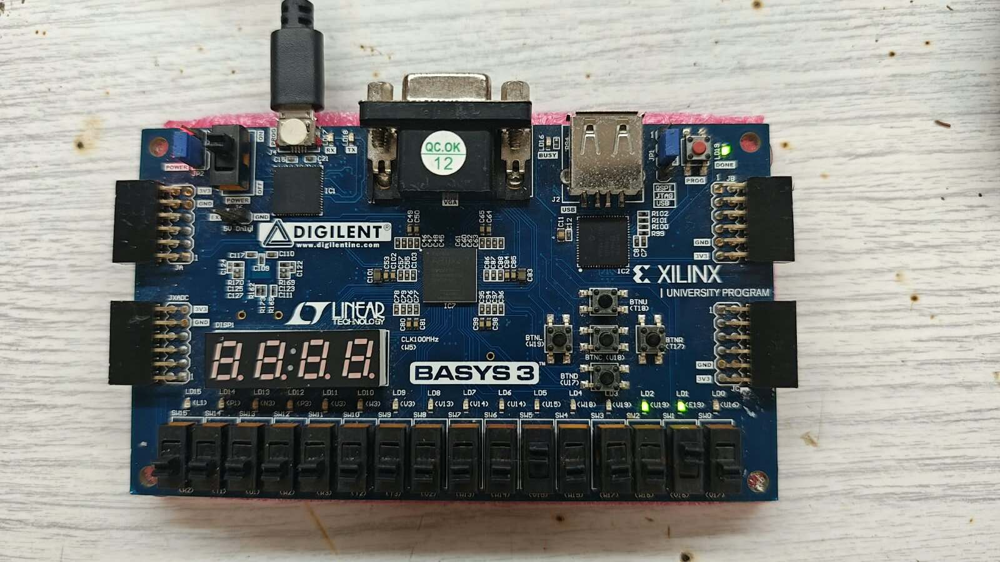

**AND bit a bit**

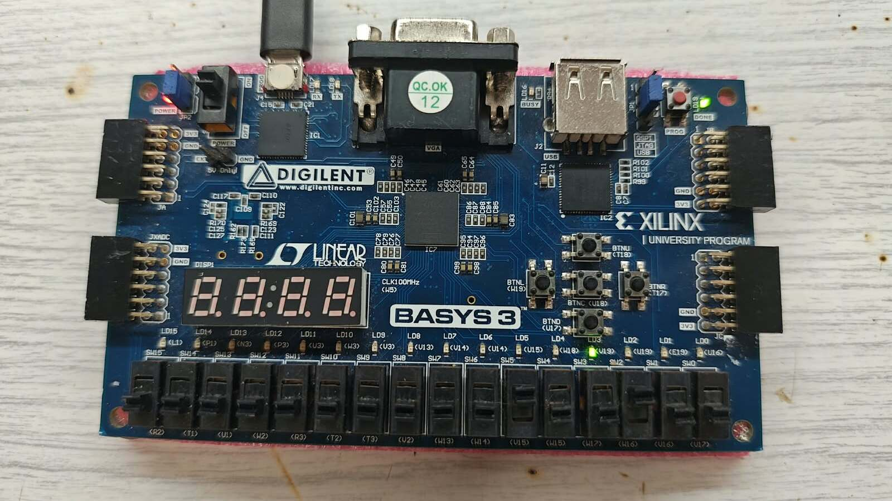

**Desplazamiento lógico a derecha (SRL)**

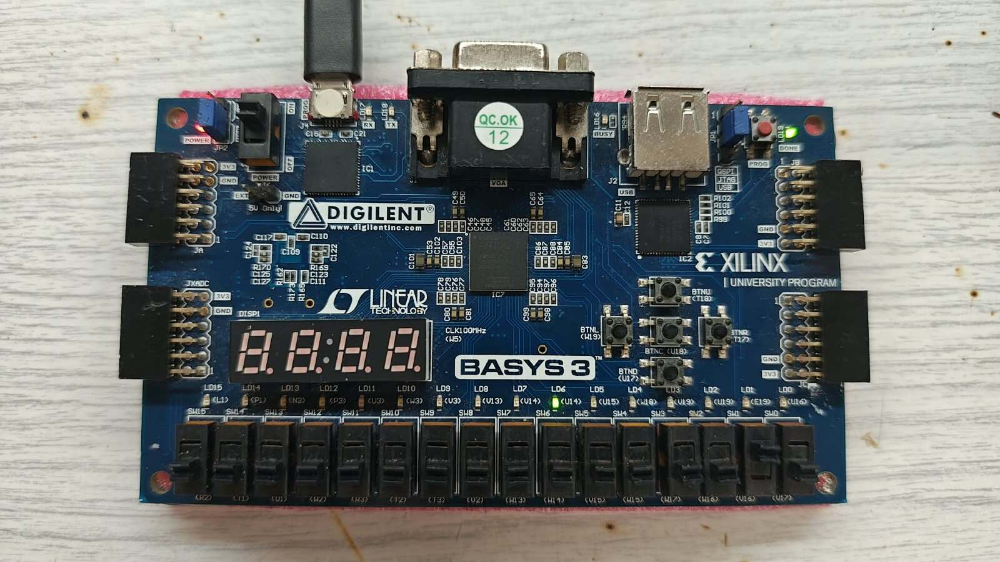

**Desplazamiento aritmético a derecha (SRA)**

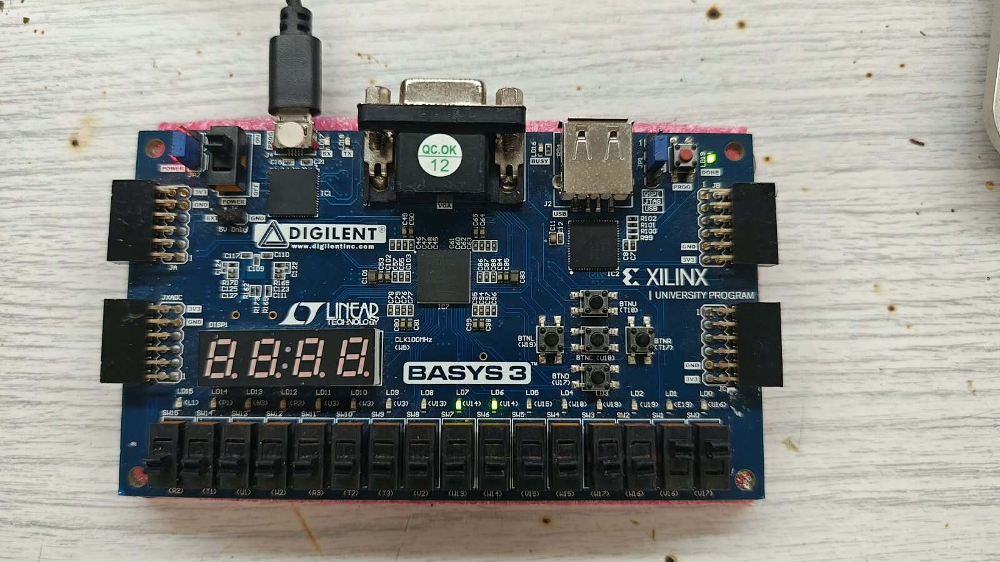

## 12. Conclusiones

El trabajo permitió recorrer las principales etapas de un flujo de diseño digital, desde una descripción funcional en Verilog hasta la obtención de una configuración para un dispositivo concreto. La separación entre el núcleo combinacional, la interfaz de placa y el entorno de verificación facilitó tanto la reutilización del módulo como la identificación de responsabilidades dentro del proyecto.

La ALU respondió correctamente en los 805 casos evaluados por el testbench. La síntesis, la implementación y la generación del bitstream finalizaron sin errores para el dispositivo seleccionado. Aunque la falla del oscilador impidió utilizar la interfaz síncrona inicialmente prevista, la versión basada en los flancos de los pulsadores permitió completar la validación física. Los cinco casos ensayados sobre la placa produjeron los resultados esperados.

## 13. Referencias

- AMD, documentación de Vivado Design Suite.
- Digilent, manual de referencia y archivo maestro de restricciones de la Basys 3.
