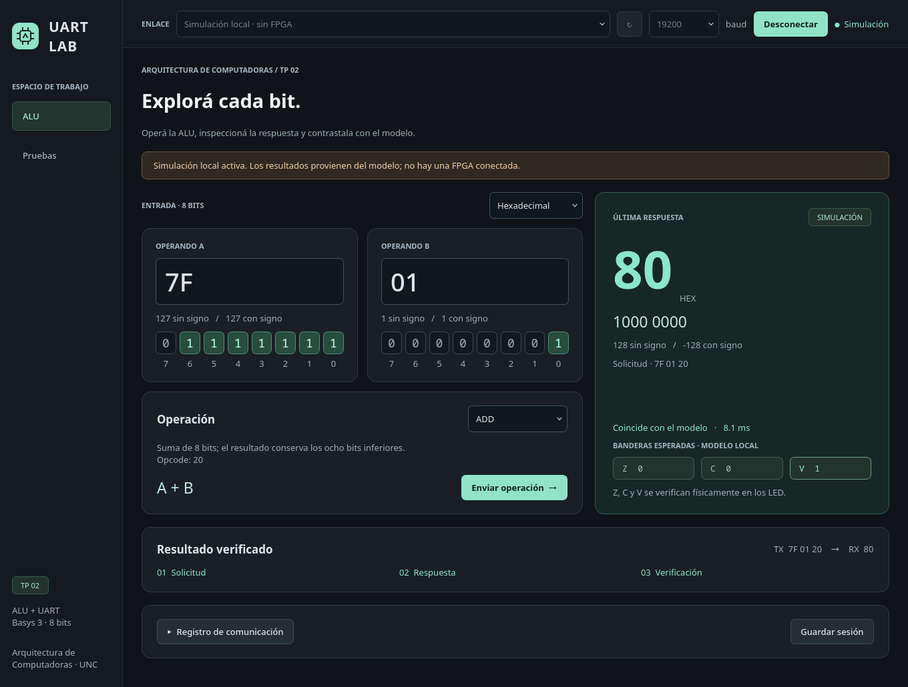
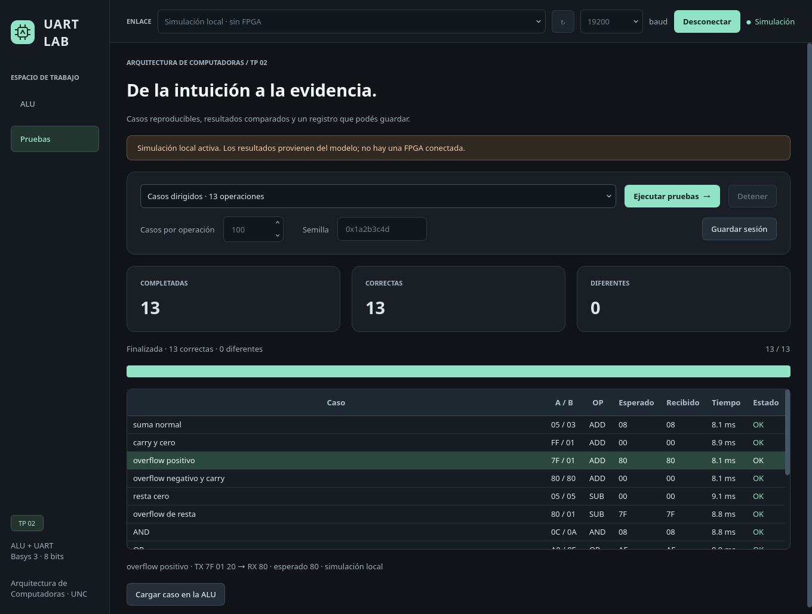

# UART Lab

Aplicación de escritorio del TP2 para operar la ALU de la Basys 3, inspeccionar
bits y ejecutar pruebas reproducibles. Tiene un tema oscuro, una vista de ALU
y una vista de pruebas. La comunicación y las suites se ejecutan en un hilo
separado para mantener la ventana disponible.



## Instalación y ejecución

Desde la raíz del repositorio, con Python 3.10 o posterior:

```bash
python -m venv tp2/tools/.venv
source tp2/tools/.venv/bin/activate
python -m pip install -r tp2/tools/requirements-gui.txt
python tp2/tools/uart_alu_gui.py
```

Para explorarla sin placa:

```bash
python tp2/tools/uart_alu_gui.py --demo
```

El modo de simulación se identifica en la conexión, la respuesta, el aviso de
la vista y los registros exportados. Usa el modelo Python de la ALU; no es una
simulación del RTL ni evidencia de validación física.

En Windows, la activación del entorno se realiza con
`tp2\tools\.venv\Scripts\Activate.ps1` desde PowerShell. Qt requiere una sesión
gráfica y sus bibliotecas de plataforma; las pruebas automáticas pueden usar
`QT_QPA_PLATFORM=offscreen`.

## Usar la placa

1. Programar la Basys 3 con el bitstream del TP2 y presionar BTNC.
2. Actualizar los puertos y elegir el canal USB–UART de la placa.
3. Mantener **19200 baud**, que es el valor del bitstream actual, y conectar.
4. Elegir el formato de entrada, ingresar A/B o tocar sus bits, seleccionar la
   operación y enviar. También se puede enviar con **Ctrl+Enter**.
5. Inspeccionar el último resultado en hexadecimal, binario y decimal con/sin
   signo. La GUI compara el byte recibido con el modelo local.

El selector de baud configura la PC: **no cambia la FPGA**. UART usa 8N1, sin
control de flujo. El protocolo manda tres bytes `A B opcode` y recibe uno.

Las banderas Z/C/V que muestra la GUI son **valores esperados por el modelo**.
No se reciben por UART; para comprobarlas hay que observar los LED de la placa.
El caso manual `INVÁLIDO (3F)` permite verificar el resultado cero del opcode
inválido.

## Pruebas y registro

La vista Pruebas reutiliza las suites del cliente de terminal: 13 casos
dirigidos, casos aleatorios de las ocho operaciones y la combinación de ambos.
La cantidad y la semilla aleatoria son configurables. Se puede detener una
suite; la transacción en curso termina antes de cerrar o reutilizar el puerto.
Al seleccionar una fila se muestran los bytes, el resultado esperado, el
recibido y el origen. **Cargar caso en la ALU** prepara su repetición manual.



Guardar sesión exporta JSON con eventos fechados, solicitudes, respuestas,
comparaciones, duración y origen de cada transacción. El registro visible es
desplegable y conserva las últimas 2000 líneas; el JSON incluye toda la sesión.
Se pueden conservar juntos resultados de placa y de simulación: cada uno lleva
su origen. Las duraciones incluyen la espera de reposo del transporte, no son
una medición aislada de la latencia de la ALU.

Ante timeout, pérdida de conexión o bytes adicionales, la GUI interrumpe el
trabajo y desconecta el enlace. Ante un resultado distinto del modelo, detiene
la suite para inspeccionar el caso. No reintenta una operación automáticamente.

La capa serie mantiene una sola solicitud en vuelo y espera 25 ms de reposo
después de una respuesta, por encima del timeout de 10 ms del controlador. Esto
reduce el riesgo de mezclar operaciones y detecta bytes adicionales durante
esa ventana. **No corrige el problema de realineación del RTL ni detecta toda
corrupción posible**: el protocolo no tiene delimitación de paquetes ni CRC.
La conexión deja un período inicial de reposo y descarta bytes viejos en la PC.
Si una operación falla, revisar la conexión y, si es necesario, reiniciar la
placa antes de reconectar.

## Base para el TP3

La aplicación separa responsabilidades:

| Archivo | Responsabilidad |
| --- | --- |
| `uart_lab/protocol.py` | Opcodes, modelo de ALU y generación de casos del TP2; también lo usa la terminal. |
| `uart_lab/transport.py` | Conexión serie y transporte de bytes; longitud de respuesta configurable. Incluye el transporte de demostración del TP2. |
| `uart_lab/session.py` | Formato de solicitud/respuesta y registro de una transacción del TP2. |
| `uart_lab/worker.py` | Propiedad del puerto, trabajo en segundo plano y cancelación. |
| `uart_lab/widgets.py` | Componentes visuales reutilizables. |
| `uart_lab/window.py` | Navegación y vistas de ALU/pruebas. |
| `uart_lab/theme.py` | Estilo visual compartido. |

Cuando se conozca la consigna del TP3, se podrá agregar su protocolo y sus vistas
de procesador, registros o memoria, conservando el transporte y el estilo. No
hay botones vacíos ni se supone todavía un contrato de debug de RISC-V.

La terminal sigue disponible y necesita solamente `requirements.txt`:

```bash
python tp2/tools/uart_alu_client.py --port /dev/ttyUSB1 --suite directed
```

## Verificación de la aplicación

```bash
python -m unittest discover -s tp2/tools/tests -v
```

Las pruebas ejercitan la GUI real con Qt en modo offscreen: edición y formatos,
operaciones, suites, cancelación, cierre durante trabajo y errores de conexión.
En POSIX también verifican pyserial contra un pseudo-terminal con una FPGA
virtual: paquetes enviados, timeout, respuestas adicionales, respuestas de
varios bytes y compatibilidad del cliente de terminal. No requieren una placa
ni reemplazan la validación física del práctico.
