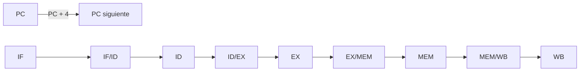
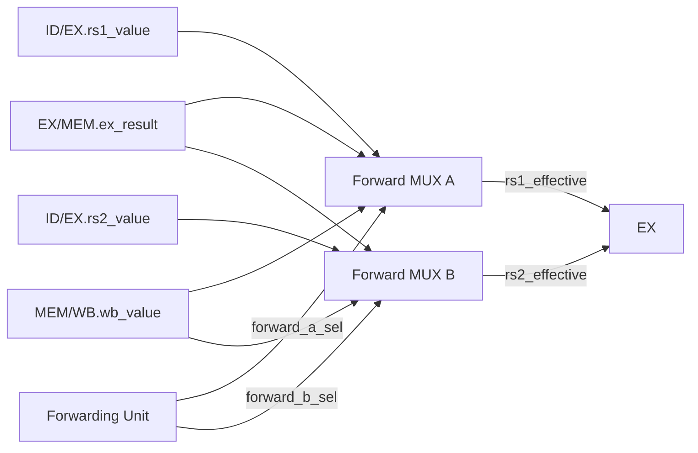
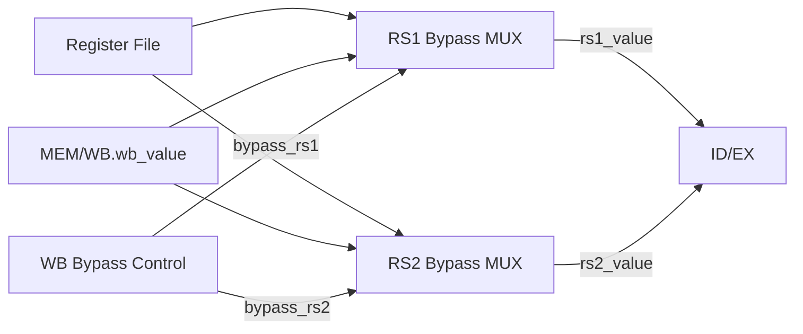
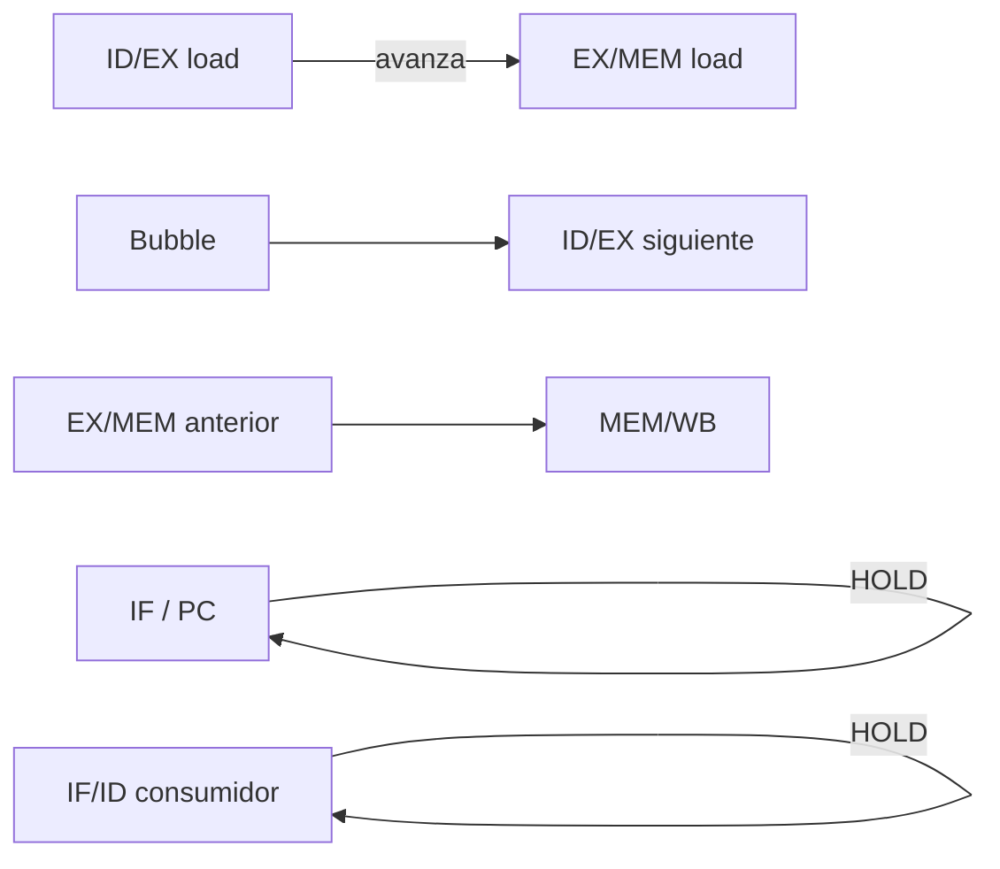
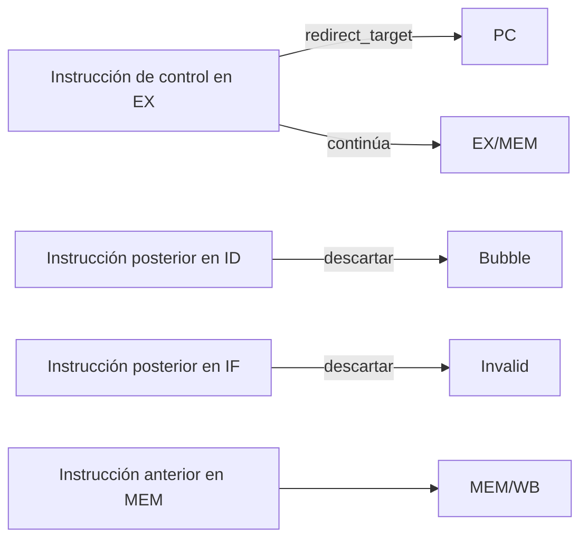
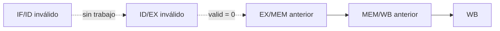

# Control del pipeline y hazards

## Función del control del pipeline

El pipeline puede avanzar de forma regular cuando cada instrucción encuentra disponibles los datos que necesita y no aparece ningún evento que cambie el flujo de ejecución. En ese caso, cada ciclo efectivo desplaza el trabajo una etapa hacia adelante: IF busca una nueva instrucción, ID prepara la siguiente, EX ejecuta la actual, MEM completa el acceso o transporta el resultado y WB hace commit del resultado de la instrucción más antigua.

Ese avance deja de ser suficiente en tres situaciones:

- una instrucción necesita un resultado anterior que todavía no llegó al Register File;
- una instrucción en EX cambia el camino mediante un branch o jump;
- se confirma `halt` o un fault asociado a una instrucción.

La arquitectura resuelve esos casos manteniendo la ejecución in-order del procesador. Algunas dependencias se corrigen sustituyendo operandos mediante forwarding o bypass; otras exigen retener instrucciones e introducir una bubble. Los redirects y la confirmación de `halt` o fault descartan las instrucciones posteriores que ya habían ingresado al pipeline.

`Pipeline Hazard Control` reúne esos eventos y selecciona una única acción coherente para el ciclo. Esa acción determina cómo se actualizan simultáneamente el PC y los cuatro registros interetapa.

## Avance normal como referencia

El comportamiento más simple es `act_normal`. Durante este ciclo no se aplica un redirect ni se confirma `halt` o fault, y no hay una dependencia `load-use` que requiera espera.



En el flanco:

```text
PC       ← PC + 4
IF/ID    ← salida de IF
ID/EX    ← salida de ID
EX/MEM   ← salida de EX
MEM/WB   ← salida de MEM
```

Cada captura utiliza los valores anteriores al flanco. Por lo tanto, una instrucción avanza una sola etapa por ciclo aunque todos los registros se actualicen simultáneamente.

Este recorrido sirve como referencia para los demás casos: un hazard modifica únicamente las actualizaciones de los registros necesarias para conservar el resultado correcto.

# Dependencias de datos

## Qué problema resuelven

Una instrucción puede consumir un registro antes de que una instrucción anterior haya llegado a WB.

Por ejemplo:

```asm
add x1, x4, x5
sub x2, x1, x3
```

Cuando `sub` alcanza EX, la escritura de `x1` todavía puede no haberse producido en el Register File. Sin una corrección, el operando leído previamente en ID sería una versión antigua.

Esta arquitectura utiliza tres mecanismos complementarios:

- **forwarding hacia EX** para resultados que ya existen en EX/MEM o MEM/WB;
- **bypass WB→ID** cuando WB escribe el mismo registro que ID está leyendo;
- **stall `load-use`** cuando el productor inmediato es un load cuyo dato todavía no existe.

Los tres mecanismos actúan en puntos distintos del recorrido y no se sustituyen entre sí.

## Forwarding hacia EX

### Recorrido funcional

EX no consume directamente `ID/EX.rs1_value` y `ID/EX.rs2_value`. Esos campos son valores base. Antes de utilizarlos, dos muxes comprueban si existe una versión más reciente producida por una instrucción anterior.



Cada fuente se resuelve de manera independiente. Una misma instrucción puede utilizar un operando proveniente de EX/MEM y el otro de MEM/WB.

El forwarding alcanza todos los usos reales de esos operandos dentro de EX:

- operaciones de ALU;
- comparación de branches;
- base de loads y stores;
- dato de stores;
- base de JALR.

La explicación de esos recorridos se encuentra en [Etapa EX](stage_ex.md).

### Identificación del productor correcto

Para cada fuente `rsN`, la unidad busca productores válidos que:

- escriban arquitectónicamente un registro;
- tengan `rd != x0`;
- coincidan con el índice consumido;
- correspondan a una fuente que la instrucción realmente utiliza.

Las coincidencias son:

```text
exmem_match_rsN =
    ID/EX.valid
    && idex_uses_rsN
    && EX/MEM.valid
    && EX/MEM.reg_write
    && (EX/MEM.rd != 0)
    && (EX/MEM.rd == ID/EX.rsN)

memwb_match_rsN =
    ID/EX.valid
    && idex_uses_rsN
    && MEM/WB.valid
    && MEM/WB.reg_write
    && (MEM/WB.rd != 0)
    && (MEM/WB.rd == ID/EX.rsN)
```

`idex_uses_rs1` e `idex_uses_rs2` se derivan combinacionalmente de `ID/EX.instruction`; no forman campos adicionales del registro.

<a id="prioridad-por-antigüedad"></a>

### Prioridad según el orden de los productores

Si EX/MEM y MEM/WB escriben el mismo registro, EX/MEM contiene la versión más reciente en orden de programa. La prioridad es:

```text
EX/MEM > MEM/WB > valor base ID/EX
```

Sin embargo, no todo resultado de EX/MEM está disponible para reenviar. Para un load:

```text
EX/MEM.ex_result = dirección efectiva
```

y no el dato cargado.

Por eso:

```text
exmem_result_available =
    !is_load(EX/MEM.mem_op)
```

La selección queda:

```text
forward_exmem_rsN =
    exmem_match_rsN
    && exmem_result_available

forward_memwb_rsN =
    !exmem_match_rsN
    && memwb_match_rsN
```

La negación de la segunda expresión utiliza `exmem_match_rsN`, no `forward_exmem_rsN`.

Esto conserva una propiedad importante: si EX/MEM contiene el productor más reciente pero se trata de un load cuyo valor todavía no está disponible, MEM/WB no puede reemplazarlo por una versión más antigua del mismo registro.

### Selectores

Los dos muxes utilizan la misma codificación:

| Selector | Fuente |
|---|---|
| `00` | `ID/EX.rsN_value` |
| `01` | `EX/MEM.ex_result` |
| `10` | `MEM/WB.wb_value` |
| `11` | reservado |

La selección A y B es independiente.

## Bypass `WB → ID`

El forwarding anterior corrige operandos cuando la instrucción ya se encuentra en EX. Existe otro caso en el que el productor está en WB mientras un consumidor lee el mismo registro en ID.

```text
productor        → WB
consumidor       → ID
```

La escritura del Register File ocurre en ese mismo flanco. La arquitectura no depende de que el almacenamiento físico sea `write-first`, `read-first` o tenga otra semántica específica. En cambio, utiliza un bypass explícito.



La escritura efectiva usa el [predicado `rf_write_fire` de WB](stage_wb.md#condición-efectiva-de-writeback), que exige ciclo efectivo, entrada válida, intención de escritura y destino distinto de cero.

Los bypass se habilitan únicamente si esa misma escritura es real:

```text
bypass_rs1 =
    rf_write_fire
    && (MEM/WB.rd == id_rs1)

bypass_rs2 =
    rf_write_fire
    && (MEM/WB.rd == id_rs2)
```

Cada puerto selecciona `MEM/WB.wb_value` cuando existe coincidencia y utiliza la lectura ordinaria del Register File en caso contrario.

Los valores posteriores a esta selección se capturan como `ID/EX.rs1_value` e `ID/EX.rs2_value`. Si al llegar a EX aparece un productor todavía más reciente, el forwarding externo vuelve a sustituirlos.

El mecanismo local dentro de ID se desarrolla en [Etapa ID](stage_id.md), y el commit de la escritura se desarrolla en [Etapa WB](stage_wb.md).

## Dependencia `load-use`

### Por qué el forwarding no alcanza

Un load inmediato seguido por un consumidor presenta un caso distinto:

```asm
lw  x1, 0(x0)
add x2, x1, x3
```

Cuando `lw` está en EX:

```text
EX produce dirección efectiva
MEM todavía no produjo el dato
```

y la instrucción consumidora se encuentra en ID.

Si ambas avanzaran normalmente, en el ciclo siguiente el consumidor llegaría a EX mientras el load estaría en MEM. La arquitectura no incorpora bypass `DMEM → EX`, por lo que el dato todavía no estaría disponible en uno de los productores aceptados por los Forward MUX.

La solución es introducir exactamente una espera en el flujo nominal.

### Detección

El detector compara el destino del load situado en ID/EX con las fuentes que la instrucción de IF/ID consume realmente:

```text
ifid_rs1 = IF/ID.instruction[19:15]
ifid_rs2 = IF/ID.instruction[24:20]

load_use_stall =
    ID/EX.valid
    && is_load(ID/EX.mem_op)
    && (ID/EX.rd != 0)
    && IF/ID.valid
    && (
         (ifid_uses_rs1 && (ifid_rs1 == ID/EX.rd))
         ||
         (ifid_uses_rs2 && (ifid_rs2 == ID/EX.rd))
       )
```

Una coincidencia accidental en un campo que la instrucción no utiliza no genera dependencia. Tampoco participa un candidato de fetch, porque ese estado tiene `IF/ID.valid=0`.

### Efecto del stall

Cuando `load_use_stall` resulta aplicable, la acción seleccionada es `act_load_use`.



El efecto completo es:

```text
PC       → retener
IF/ID    → retener
ID/EX    → bubble
EX/MEM   → capturar EX
MEM/WB   → capturar MEM
```

El consumidor permanece en ID mientras el load continúa. En el avance siguiente se captura al consumidor en ID/EX y al resultado del load en MEM/WB. Durante el ciclo posterior, EX utiliza ese resultado ya registrado mediante forwarding; no consume la entrada que MEM/WB captura en ese mismo flanco.

El mismo mecanismo cubre dependencias sobre `store_data`; no existe un camino especial de forwarding desde MEM para ese caso.

### Stall no equivale a HOLD

`act_load_use` ocurre dentro de un **ciclo efectivo de la CPU**.

Por lo tanto, durante ese ciclo:

- `cycle_count` incrementa;
- instrucciones anteriores pueden avanzar;
- un store anterior puede hacer commit;
- un writeback anterior puede ocurrir;
- en modo STEP se consume una orden.

En **HOLD**, en cambio, `cpu_cycle_fire=0` y no se selecciona ninguna acción del pipeline.

# Cambios del camino de ejecución

## Redirect

Branches tomados, `JAL` y `JALR` se resuelven en EX. Cuando la instrucción solicita un cambio de flujo y ningún fault propio ni `halt` lo impide, `Pipeline Hazard Control` selecciona `act_redirect`.

En ese ciclo:

```text
PC       → redirect_target
IF/ID    → invalidar
ID/EX    → bubble
EX/MEM   → capturar EX
MEM/WB   → capturar MEM
```



La instrucción que produce el redirect continúa hacia EX/MEM. Esto es necesario para que `JAL` o `JALR` conserven su enlace `PC+4` y puedan escribirlo posteriormente en `rd`.

Las instrucciones situadas en ID e IF son posteriores a la instrucción de EX y pertenecen al camino abandonado, por lo que se descartan.

El cálculo y la validación de `redirect_target` se desarrollan en [Etapa EX](stage_ex.md). La relación entre redirects y faults de target se desarrolla en [Faults, redirects y terminación](faults_and_termination.md).

<a id="fronteras-por-fault-y-halt"></a>

## Descarte de instrucciones por fault y `halt`

Cuando se confirma un fault, se descartan la instrucción que lo provocó y las posteriores; las anteriores pueden terminar su ejecución. Cuando se confirma `halt`, esta instrucción se consume en EX, se descartan las posteriores y se deja terminar a las anteriores. En ambos casos se deja de admitir trabajo nuevo.

Los candidatos que pueden provocar esa terminación se generan en:

- EX, para faults propios de ejecución y para `halt`;
- ID, para instrucción ilegal o candidato de fetch transportado desde IF.

La semántica de cada causa pertenece a [Faults, redirects y terminación](faults_and_termination.md). Este documento define cómo la selección de esos candidatos determina la actualización del pipeline.

## Fault propio de EX

Una instrucción cuyo fault se confirma en EX no puede continuar como una operación válida hacia MEM.

La acción `act_ex_fault` produce:

```text
PC       → retener
IF/ID    → invalidar
ID/EX    → bubble
EX/MEM   → invalidar
MEM/WB   → capturar MEM
```

La instrucción que provocó el fault se elimina antes de EX/MEM. Las instrucciones posteriores, situadas en ID e IF, también se descartan. La instrucción anterior situada en MEM conserva su avance.

Por eso, por ejemplo, un store anterior puede hacer commit en el mismo ciclo en que se confirma el fault de una instrucción posterior en EX.

## `halt` confirmado en EX

La confirmación de `halt` aplica las mismas actualizaciones de los registros del pipeline que la de un fault propio de EX:

```text
PC       → retener
IF/ID    → invalidar
ID/EX    → bubble
EX/MEM   → invalidar
MEM/WB   → capturar MEM
```

La diferencia es semántica: `halt` representa terminación normal y el fault representa terminación excepcional.

La instrucción `halt` se consume en EX y no entra válidamente a EX/MEM. El trabajo anterior sigue disponible para drenado.

## Fault confirmado en ID

Un fault detectado en ID corresponde a una instrucción posterior a la que se encuentra simultáneamente en EX.

Por eso `act_id_fault` conserva la instrucción de EX:

```text
PC       → retener
IF/ID    → invalidar
ID/EX    → bubble
EX/MEM   → capturar EX
MEM/WB   → capturar MEM
```

La instrucción que provoca el fault en ID no pasa a EX. La instrucción anterior que ya estaba en EX continúa normalmente.

Esta diferencia entre `act_ex_fault` y `act_id_fault` responde al orden de las instrucciones en el programa.

# Selección de una única acción

## Separación entre autorización y coordinación

`Pipeline Hazard Control` no decide si la CPU ejecuta un ciclo.

La autorización proviene de [Control de ejecución y sesión](execution_control.md) mediante:

```text
cpu_cycle_fire
```

Solo dentro de un ciclo efectivo se selecciona una acción del pipeline.

Esto separa dos preguntas:

```text
¿hay ciclo de la CPU?
    → Cycle Authorization

¿cómo se actualiza el pipeline durante ese ciclo?
    → Pipeline Hazard Control
```

RESET, un LOAD aceptado y la preparación tienen prioridad global sobre la ejecución de la CPU y se resuelven fuera de estas acciones.

## Estado terminal y drenado

El control utiliza:

```text
terminal_active =
    global_state en {
        HALT_DRAIN_AUTO,
        HALT_DRAIN_STEP,
        FAULT_DRAIN_AUTO,
        FAULT_DRAIN_STEP,
        FINISHED,
        FAULT
    }

terminal_none =
    !terminal_active

drain_active =
    terminal_active
    && !pipeline_empty
```

Mientras `terminal_none=1`, pueden seleccionarse las seis acciones ordinarias. Durante un drenado activo se utilizan las dos acciones de drain.

## Prioridad de los eventos no terminales

Cuando varios eventos combinacionales aparecen en el mismo ciclo, se priorizan los de las instrucciones anteriores. Dentro de una misma instrucción, su fault propio tiene prioridad sobre su efecto normal.

La prioridad es:

```text
EX fault
    ↓
halt EX
    ↓
redirect EX
    ↓
ID fault
    ↓
load-use
    ↓
normal
```

La secuencia no significa que `halt` tenga prioridad universal sobre cualquier fault. Expresa la situación concreta del pipeline: los eventos de EX corresponden a trabajo más antiguo que los de ID, y un fault propio de la instrucción de EX precede a sus otros efectos.

## Confirmaciones

Los candidatos se convierten en eventos aplicados durante un ciclo efectivo según [las confirmaciones y la prioridad según el orden del programa](faults_and_termination.md#confirmación-y-prioridad-según-el-orden-del-programa). Ese contrato define `ex_fault_confirm`, `halt_confirm`, `redirect_apply`, `ex_frontier_selected`, `id_fault_confirm` y `fault_confirm`.

El control utiliza esos eventos para seleccionar las acciones. Si no se confirma `halt` o fault ni se aplica un redirect, decide entre load-use y avance normal.

Finalmente:

```text
load_use_apply =
    cpu_cycle_fire
    && terminal_none
    && !ex_frontier_selected
    && !id_fault_confirm
    && load_use_stall

normal_advance =
    cpu_cycle_fire
    && terminal_none
    && !ex_frontier_selected
    && !id_fault_confirm
    && !load_use_apply
```

# Las ocho acciones del pipeline

Las seis acciones del funcionamiento no terminal son:

```text
act_ex_fault
act_halt
act_redirect
act_id_fault
act_load_use
act_normal
```

Durante drenado existen dos acciones adicionales:

```text
act_drain_load_use
act_drain_advance
```

Se derivan mediante:

```text
drain_cycle =
    cpu_cycle_fire
    && drain_active

drain_load_use =
    drain_cycle
    && load_use_stall

drain_advance =
    drain_cycle
    && !load_use_stall

act_ex_fault        = ex_fault_confirm
act_halt            = halt_confirm
act_redirect        = redirect_apply
act_id_fault        = id_fault_confirm
act_load_use        = load_use_apply
act_normal          = normal_advance
act_drain_load_use  = drain_load_use
act_drain_advance   = drain_advance
```

La indicación conjunta es:

```text
pipeline_action =
    act_ex_fault
    || act_halt
    || act_redirect
    || act_id_fault
    || act_load_use
    || act_normal
    || act_drain_load_use
    || act_drain_advance
```

Las acciones son mutuamente excluyentes:

```text
$onehot0({
    act_ex_fault,
    act_halt,
    act_redirect,
    act_id_fault,
    act_load_use,
    act_normal,
    act_drain_load_use,
    act_drain_advance
})
```

En un ciclo efectivo no terminal aparece exactamente una de las seis primeras. En un ciclo efectivo de drenado aparece una de las dos últimas. Durante HOLD o con un terminal ya vacío no se selecciona ninguna.

# Efecto de cada acción sobre el pipeline

La tabla siguiente reúne el comportamiento que se explicó por escenario.

| Acción | PC | IF/ID.next | ID/EX.next | EX/MEM.next | MEM/WB.next |
|---|---|---|---|---|---|
| `act_ex_fault` | Retener | Invalidar ambos flags | Bubble | Invalidar | Capturar MEM |
| `act_halt` | Retener | Invalidar ambos flags | Bubble | Invalidar | Capturar MEM |
| `act_redirect` | `redirect_target` | Invalidar ambos flags | Bubble | Capturar EX | Capturar MEM |
| `act_id_fault` | Retener | Invalidar ambos flags | Bubble | Capturar EX | Capturar MEM |
| `act_load_use` | Retener | Retener cinco campos | Bubble | Capturar EX | Capturar MEM |
| `act_normal` | `PC + 4` | Capturar IF | Capturar ID | Capturar EX | Capturar MEM |
| `act_drain_load_use` | Retener | Retener cinco campos | Bubble | Capturar EX | Capturar MEM |
| `act_drain_advance` | Retener | Invalidar ambos flags | Capturar ID | Capturar EX | Capturar MEM |

En IF/ID, “invalidar ambos flags” significa:

```text
valid = 0
fetch_fault_valid = 0
```

Los demás bits pueden conservar residuos sin representar trabajo activo.

En ID/EX y EX/MEM, una bubble o invalidación se expresa mediante `valid=0`. Los demás campos tampoco necesitan borrarse para impedir efectos.

## Controles locales derivados de las acciones

Los bloques de actualización de cada etapa convierten la acción seleccionada en señales locales.

### PC

```text
pc_write_enable =
    act_normal
    || act_redirect

next_pc_sel =
    act_redirect
```

Cuando `pc_write_enable=0`, el PC conserva su valor. No existe una tercera entrada especial para stall, fault o `halt`.

### IF/ID

```text
ifid_capture_if =
    act_normal

ifid_hold =
    act_load_use
    || act_drain_load_use

ifid_invalidate =
    act_redirect
    || act_halt
    || act_ex_fault
    || act_id_fault
    || act_drain_advance
```

### ID/EX

```text
idex_capture_id =
    act_normal
    || act_drain_advance

idex_bubble =
    act_load_use
    || act_redirect
    || act_halt
    || act_ex_fault
    || act_id_fault
    || act_drain_load_use
```

### EX/MEM

```text
exmem_capture_ex =
    act_normal
    || act_load_use
    || act_redirect
    || act_id_fault
    || act_drain_load_use
    || act_drain_advance

exmem_invalidate =
    act_halt
    || act_ex_fault
```

### MEM/WB

```text
memwb_capture_mem =
    pipeline_action
```

Estos controles no autorizan ciclos por sí mismos. Únicamente materializan la acción ya seleccionada durante un ciclo efectivo.

Las entradas y salidas concretas de cada bloque de actualización se desarrollan en [Etapa IF](stage_if.md), [Etapa ID](stage_id.md), [Etapa EX](stage_ex.md) y [Etapa MEM](stage_mem.md).

# Efectos arquitectónicos de instrucciones anteriores

Invalidar una entrada nueva no cancela los efectos de una instrucción anterior que ya puede hacer commit durante el mismo ciclo.

El [writeback de WB mediante `rf_write_fire`](stage_wb.md#condición-efectiva-de-writeback) y el [store de MEM mediante `dmem_store_fire`](stage_mem.md#dmem-write-control) conservan sus efectos aunque se descarten instrucciones posteriores. Ambos requieren un ciclo efectivo y utilizan el contenido válido de sus registros anterior al flanco. Un redirect, `halt` o fault de una instrucción posterior no impide ese commit.

Por esta razón:

- una instrucción en WB puede escribir aunque se confirme el fault o `halt` de una instrucción posterior;
- un store en MEM puede hacer commit aunque se confirme el fault o `halt` de una instrucción posterior;
- la instrucción causante no produce su propio efecto si fue invalidada antes de alcanzar la etapa de commit correspondiente.

La escritura del Register File se desarrolla en [Etapa WB](stage_wb.md) y la escritura de DMEM en [Etapa MEM](stage_mem.md).

# Drenado del pipeline

<a id="estado-alcanzable-después-de-una-frontera-terminal"></a>

## Estado alcanzable después de confirmar `halt` o fault

Después de confirmar `halt` o fault, la arquitectura deja de admitir instrucciones nuevas. Esa confirmación deja:

```text
IF/ID.valid = 0
IF/ID.fetch_fault_valid = 0
ID/EX.valid = 0
```

Por lo tanto:

```text
load_use_stall = 0
```

en cualquier drenado alcanzable desde una sesión legal.

Solo pueden permanecer instrucciones anteriores en:

```text
EX/MEM
MEM/WB
```

Cada ciclo autorizado de drenado aplica `act_drain_advance`, mantiene el PC y continúa desplazando ese trabajo anterior hasta vaciar el pipeline.



En modo AUTO esos ciclos se autorizan automáticamente. En modo STEP cada avance de drenado requiere su propio STEP. Esa política pertenece a [Control de ejecución y sesión](execution_control.md).

## `act_drain_load_use`

`act_drain_load_use` permanece dentro del contrato combinacional de las ocho acciones, pero no es alcanzable desde una sesión legal con la arquitectura vigente.

Puede verificarse mediante una prueba artificial que fuerce simultáneamente:

- estado de drain activo;
- ciclo efectivo;
- un load válido en ID/EX;
- un consumidor dependiente válido en IF/ID.

La prueba comprueba la ecuación, la exclusión mutua y la fila correspondiente de actualización. No representa una secuencia end-to-end alcanzable desde reset y no modifica la FSM para hacerla alcanzable.

# HOLD

HOLD no es una novena acción del pipeline.

Cuando:

```text
cpu_cycle_fire = 0
```

no se selecciona ninguna de las ocho acciones y el estado de la CPU permanece retenido, salvo que actúe una prioridad global superior como reset, LOAD aceptado o preparación.

Esto evita confundir dos situaciones diferentes:

```text
stall load-use
    → existe ciclo de la CPU
    → parte del pipeline avanza

HOLD
    → no existe ciclo de la CPU
    → el pipeline no avanza
```

La distinción es especialmente importante en STEP, porque un stall consume un paso mientras una espera entre comandos no lo hace.

# Invariantes principales del control

El comportamiento anterior puede resumirse mediante las siguientes propiedades:

- como máximo una acción `act_*` está activa simultáneamente;
- un productor EX/MEM más reciente oculta a uno coincidente en MEM/WB;
- un load en EX/MEM nunca reenvía su dirección efectiva como dato de `rd`;
- `x0` no genera forwarding, bypass ni writeback;
- `load-use` retiene PC e IF/ID pero permite avanzar el trabajo anterior;
- un redirect descarta solamente las instrucciones posteriores a la de EX;
- un fault de ID no cancela la instrucción anterior situada en EX;
- un fault propio de EX o `halt` impide que su propia instrucción ingrese válida a EX/MEM;
- un redirect, `halt` o fault de una instrucción posterior no cancela stores o writebacks anteriores que ya pueden hacer commit;
- durante un drenado legal solo `act_drain_advance` resulta alcanzable;
- HOLD no genera efectos de la CPU ni repite commits.

Las propiedades formales y su clasificación entre comportamiento alcanzable y pruebas artificiales se consolidan en [Invariantes arquitectónicos](architectural_invariants.md).

## Trazabilidad

- [Pipeline CPU](cpu_pipeline.md): modelo temporal, validez y contenido de los registros interetapa.
- [Etapa IF](stage_if.md): actualización del PC e IF/ID.
- [Etapa ID](stage_id.md): bypass WB→ID, detector `load-use` e ID/EX.
- [Etapa EX](stage_ex.md): forwarding, redirects, faults propios y EX/MEM.
- [Etapa MEM](stage_mem.md): stores, MEM/WB y efectos anteriores.
- [Etapa WB](stage_wb.md): `rf_write_fire` y commit del Register File.
- [Faults, redirects y terminación](faults_and_termination.md): candidatos, causas, confirmaciones y precisión.
- [Control de ejecución y sesión](execution_control.md): `cpu_cycle_fire`, RUN, STEP, HOLD y drenado AUTO/STEP.
- [Invariantes arquitectónicos](architectural_invariants.md): propiedades de seguridad y cobertura.
