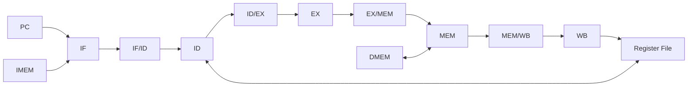

# Pipeline de la CPU

## Organización general

La CPU utiliza un pipeline **in-order de cinco etapas**: IF, ID, EX, MEM y WB. Cada etapa realiza una parte distinta del procesamiento de una instrucción y puede trabajar, en el mismo ciclo, sobre una instrucción diferente.

Entre las etapas se encuentran cuatro registros intermedios —IF/ID, ID/EX, EX/MEM y MEM/WB— que conservan la información necesaria para que cada instrucción continúe su recorrido en el ciclo siguiente.

El recorrido permanece ordenado: las instrucciones ingresan siguiendo el orden del programa y los efectos arquitectónicos visibles conservan ese mismo orden. El solapamiento cambia cuántas instrucciones se encuentran activas al mismo tiempo, pero no altera la semántica secuencial del programa.

## Avance del pipeline

### Ciclo efectivo

El estado del pipeline cambia únicamente durante un **ciclo efectivo de la CPU**. En un avance ordinario, cada registro intermedio captura el trabajo producido por la etapa anterior y la instrucción activa continúa hacia la etapa siguiente.

Las capturas utilizan los valores existentes antes del flanco de actualización. Una instrucción no atraviesa varias etapas en un mismo ciclo: IF produce la entrada de IF/ID, ID la de ID/EX, EX la de EX/MEM y MEM la de MEM/WB.

Cuando la CPU se encuentra en HOLD no ocurre un ciclo efectivo y el estado del pipeline permanece retenido. La relación entre el clock físico, RUN, STEP, HOLD y la autorización de ciclos se desarrolla en [Control de ejecución y sesión](execution_control.md).

### Validez

Cada registro intermedio conserva una indicación de **validez** que distingue una instrucción activa de datos residuales almacenados en ese registro.

Una entrada inválida puede conservar valores en sus campos, pero esos valores no representan una instrucción en ejecución y no producen efectos arquitectónicos. Tampoco participan como productores o consumidores válidos en la resolución de dependencias.

Esta separación permite representar distintas situaciones sin borrar físicamente todos los campos del registro:

- **Bubble:** una posición del pipeline no contiene una instrucción activa.
- **Stall:** una parte del pipeline conserva temporalmente su estado mientras el trabajo anterior continúa.
- **Flush:** una instrucción que ya había ingresado al pipeline queda invalidada porque ya no pertenece a la ejecución correcta.
- **HOLD:** la CPU no realiza un ciclo efectivo y los registros del pipeline conservan su estado.

La selección exacta de capturas, retenciones, bubbles e invalidaciones se encuentra en [Control del pipeline y hazards](control_and_hazards.md).

### Identidad de una instrucción

Mientras una instrucción permanece activa, el pipeline conserva su palabra de instrucción y su **PC propio** en los registros interetapa donde esa información sigue siendo necesaria.

El PC propio identifica la posición original de esa instrucción dentro del programa. Es distinto del PC global utilizado por IF, que puede encontrarse buscando una instrucción posterior mientras las anteriores avanzan por ID, EX, MEM o WB.

## IF — Instruction Fetch

IF forma el frente de entrada del pipeline. Utiliza el PC global para seleccionar en IMEM la palabra de 32 bits asociada a la búsqueda actual. En un recorrido secuencial, el frente continúa con la dirección siguiente; un cambio de flujo puede sustituir ese recorrido por otro destino.

La búsqueda también se valida antes de tratar su resultado como una instrucción. Si la dirección de fetch presenta un problema de alineación o queda fuera de la imagen ejecutable, IF genera un **candidato de fault de fetch** en lugar de una instrucción activa. Ese candidato no constituye todavía un fault arquitectónico confirmado.

La detección y la confirmación de los faults de fetch se describen en [Faults, redirects y terminación](faults_and_termination.md), mientras que los límites y la validación de IMEM se detallan en [Arquitectura de memoria](memory_architecture.md).

### Registro IF/ID

IF/ID conserva una instrucción obtenida correctamente o la información asociada a un candidato de fetch. Ambas situaciones utilizan el mismo PC de origen, pero se distinguen mediante indicadores de validez separados.

| Campo | Ancho | Función |
|---|---:|---|
| `valid` | 1 | Indica una instrucción obtenida y activa en ID. |
| `pc` | 32 | PC propio de la instrucción o del fetch candidato. |
| `instruction` | 32 | Palabra obtenida de IMEM; carece de significado como instrucción cuando el fetch falló. |
| `fetch_fault_valid` | 1 | Indica un candidato de fault de fetch transportado hacia ID. |
| `fetch_fault_cause` | 3 | Conserva la causa del candidato de fetch. |

En un estado legal, `valid` y `fetch_fault_valid` no se encuentran activos simultáneamente.

Un fetch normal ingresa a IF/ID con `valid=1` y `fetch_fault_valid=0`. Cuando la búsqueda falla, se registra una entrada con `valid=0` y `fetch_fault_valid=1`, que conserva el PC de esa búsqueda y no representa una instrucción activa.

Cuando IF/ID se invalida, ambos indicadores dejan de representar trabajo activo. Cuando se retiene, sus cinco campos permanecen sin cambios.

## ID — Instruction Decode

ID recibe la entrada de IF/ID e interpreta la instrucción activa. En esta etapa se reconocen la operación y sus operandos, se leen los registros fuente y se genera el inmediato cuando corresponde.

El decoder también determina la legalidad de la codificación y produce la información de control que utilizarán las etapas posteriores. El banco de registros proporciona dos lecturas combinacionales y mantiene `x0` permanentemente en cero.

Cuando una escritura de WB coincide con una lectura de ID en el mismo ciclo, el camino WB→ID proporciona directamente el valor actualizado. De esta forma, ID/EX conserva como valores base los operandos correctos para la instrucción que avanza hacia EX.

La codificación del decoder y las señales funcionales generadas en ID se detallan en [Etapa ID](stage_id.md#decoder). La reconstrucción de inmediatos pertenece a [Datapath](datapath.md#inmediato); el bypass WB→ID y las dependencias entre instrucciones se desarrollan en [Control del pipeline y hazards](control_and_hazards.md).

En ID puede confirmarse un fault por una instrucción ilegal o por un candidato de fetch. Su confirmación respeta el orden de las instrucciones y se coordina con el control del pipeline. Ese comportamiento se especifica en [Faults, redirects y terminación](faults_and_termination.md).

### Registro ID/EX

ID/EX conserva el contexto completo que EX utiliza para ejecutar la instrucción. Además de su identidad, transporta los índices y valores base de los operandos, el inmediato y los controles necesarios para determinar el comportamiento de la etapa.

| Campo | Ancho | Función |
|---|---:|---|
| `valid` | 1 | Instrucción activa en EX. |
| `pc` | 32 | PC propio de la instrucción. |
| `instruction` | 32 | Palabra de instrucción. |
| `rs1` | 5 | Índice del primer registro fuente. |
| `rs2` | 5 | Índice del segundo registro fuente. |
| `rd` | 5 | Índice del registro destino. |
| `rs1_value` | 32 | Valor base de la primera fuente después del bypass WB→ID. |
| `rs2_value` | 32 | Valor base de la segunda fuente después del bypass WB→ID. |
| `immediate` | 32 | Inmediato generado y extendido a 32 bits. |
| `alu_op` | 6 | Operación seleccionada para la ALU. |
| `alu_src` | 1 | Selección entre segundo operando de registro e inmediato. |
| `result_sel` | 2 | Selección del resultado producido por EX. |
| `flow_op` | 3 | Tipo de operación de flujo: NONE, BEQ, BNE, JAL, JALR o HALT. |
| `mem_op` | 4 | Tipo de operación de memoria o NONE. |
| `reg_write` | 1 | Indica que la instrucción produce un resultado destinado al Register File. |

`alu_op`, `alu_src`, `result_sel`, `flow_op`, `mem_op` y `reg_write` forman conceptualmente el control transportado hacia EX. La arquitectura no introduce un campo adicional que duplique esa información.

## EX — Execute

EX concentra la ejecución de las operaciones que requieren cálculo. Antes de utilizar los operandos registrados en ID/EX, el forwarding puede sustituirlos por resultados más recientes producidos por instrucciones anteriores que todavía no llegaron al banco de registros.

Con los operandos efectivos, EX realiza las operaciones aritméticas, lógicas, comparaciones y desplazamientos; calcula las direcciones utilizadas por loads y stores; forma los destinos de branches y jumps; y produce el valor de enlace cuando corresponde.

EX también es la etapa donde se resuelven los cambios de flujo y se validan los accesos de datos y la alineación de los destinos de los saltos que se toman. Un fault propio de la instrucción prevalece sobre sus efectos normales. `halt` también alcanza su punto de confirmación en esta etapa.

Los bloques concretos que forman estos caminos —ALU, muxes, sumadores, generación de targets y selección de resultados— se detallan en [Datapath](datapath.md). La selección de operandos reenviados se especifica en [Control del pipeline y hazards](control_and_hazards.md), y el descarte de instrucciones por redirects, faults y `halt` se desarrolla en [Faults, redirects y terminación](faults_and_termination.md).

Para los stores, la dirección calculada y el dato que se almacenará continúan por caminos diferentes. EX/MEM conserva ambos por separado para que MEM pueda utilizar la dirección y el dato ya resuelto sin volver a reconstruir los operandos.

### Registro EX/MEM

Después de EX, la instrucción ya no necesita conservar sus operandos base ni el inmediato. EX/MEM transporta el resultado consolidado de la etapa y la información que MEM todavía utiliza.

| Campo | Ancho | Función |
|---|---:|---|
| `valid` | 1 | Instrucción activa en MEM. |
| `pc` | 32 | PC propio de la instrucción. |
| `instruction` | 32 | Palabra de instrucción. |
| `rd` | 5 | Destino utilizado por writeback y forwarding. |
| `reg_write` | 1 | Indica que la instrucción produce un resultado para el Register File. |
| `mem_op` | 4 | Describe la operación de load, store o ausencia de acceso a DMEM. |
| `ex_result` | 32 | Dirección efectiva para memoria o resultado producido en EX. |
| `store_data` | 32 | Dato ya resuelto que utiliza un store en MEM. |

Un branch o jump que aplica un redirect continúa como instrucción válida si aún tiene efectos pendientes, como la escritura del enlace de JAL o JALR. En cambio, `halt` y una instrucción cuyo fault se confirma en EX no ingresan válidamente a EX/MEM.

## MEM — Memory

MEM recibe el resultado producido en EX y completa la parte de la instrucción relacionada con la memoria de datos.

Un load utiliza la dirección conservada en `EX/MEM.ex_result` para obtener el valor correspondiente de DMEM. Un store utiliza esa misma dirección junto con `EX/MEM.store_data` para realizar su escritura. Las instrucciones que no acceden a DMEM conservan el resultado que ya habían producido en EX.

Los accesos que llegan válidamente a MEM ya superaron los chequeos arquitectónicos realizados en EX. MEM no introduce una segunda confirmación de esos faults.

La organización de los bytes, los tamaños de acceso, la extensión de loads y la semántica exacta de las escrituras se detallan en [Arquitectura de memoria](memory_architecture.md).

### Registro MEM/WB

MEM/WB conserva el valor final que WB utiliza como resultado arquitectónico. Para un load, ese valor proviene de DMEM; para las restantes instrucciones que escriben un registro, proviene del resultado que llegó desde EX.

| Campo | Ancho | Función |
|---|---:|---|
| `valid` | 1 | Instrucción activa en WB. |
| `pc` | 32 | PC propio de la instrucción. |
| `instruction` | 32 | Palabra de instrucción. |
| `rd` | 5 | Registro destino. |
| `reg_write` | 1 | Indica que la instrucción escribe el Register File. |
| `wb_value` | 32 | Valor final seleccionado para writeback. |

En MEM/WB ya no se transportan `mem_op`, `store_data` ni resultados alternativos. WB recibe directamente el valor que corresponde hacer visible en el banco de registros.

## WB — Write Back

WB constituye la última etapa del recorrido. Cuando una entrada válida representa una instrucción que escribe un registro distinto de `x0`, el valor conservado en `MEM/WB.wb_value` se hace visible en el Register File durante el ciclo efectivo correspondiente.

Las instrucciones sin destino de registro pueden atravesar esta etapa con `reg_write=0` sin producir una escritura. De la misma forma, una entrada inválida no produce un efecto aunque sus campos conserven valores residuales.

La habilitación exacta del writeback y la conservación de commits anteriores se especifican en [Etapa WB](stage_wb.md#condición-efectiva-de-writeback). La autorización del ciclo pertenece a [Control de ejecución y sesión](execution_control.md).

## Comportamiento ante cambios del avance normal

El contenido de los cuatro registros no siempre avanza de forma uniforme. La acción aplicada en cada ciclo determina qué trabajo continúa, qué trabajo permanece retenido y qué trabajo se invalida.

A nivel del pipeline, las situaciones principales se resumen así:

| Situación | Comportamiento general |
|---|---|
| Avance normal | Las instrucciones activas progresan hacia la etapa siguiente y IF incorpora nuevo trabajo. |
| Dependencia load-use | El consumidor permanece en IF/ID, ID/EX recibe una bubble y las instrucciones anteriores continúan. |
| Redirect | El PC adopta el destino resuelto y se invalidan las instrucciones posteriores de ese camino. |
| Fault confirmado | Se descartan la instrucción que provoca el fault y las posteriores; las anteriores conservan sus efectos válidos. |
| `halt` confirmado | Se dejan de admitir instrucciones nuevas, se descartan las posteriores a `halt` y solo continúan las anteriores. |
| HOLD | No ocurre un ciclo efectivo de la CPU y el pipeline conserva su estado. |

Las prioridades y la tabla exacta de actualización de PC, IF/ID, ID/EX, EX/MEM y MEM/WB se encuentran en [Control del pipeline y hazards](control_and_hazards.md).

## Drenado del pipeline

Confirmar `halt` o un fault impide admitir instrucciones nuevas y descarta las posteriores. Si existen instrucciones anteriores todavía activas, estas continúan hasta terminar de producir sus efectos válidos.

En las ejecuciones alcanzables por esta arquitectura, confirmar `halt` o fault deja inválidos IF/ID e ID/EX. Por lo tanto, durante el drenado solo pueden permanecer instrucciones anteriores en EX/MEM y MEM/WB.

El drenado termina cuando esos registros dejan de contener instrucciones activas. Su avance automático o controlado mediante STEP depende del modo de ejecución vigente y se desarrolla en [Control de ejecución y sesión](execution_control.md). El tratamiento de la instrucción que provoca `halt` o fault y de las anteriores se detalla en [Faults, redirects y terminación](faults_and_termination.md).

## Observación del pipeline

Los cuatro registros intermedios forman parte del estado observable del procesador. La validez, el PC propio y la palabra de instrucción permiten identificar qué instrucciones se encuentran activas en cada registro, mientras que los campos adicionales conservan la información funcional utilizada por las etapas.

Los campos internos definidos en este capítulo forman parte de la arquitectura vigente. La representación externa que Debug utiliza para transmitirlos puede seleccionar y serializar esa información sin modificar el contenido funcional de los registros.

La información observable y los aspectos de representación que todavía permanecen abiertos se desarrollan en [Arquitectura de Debug](debug_architecture.md).

## Trazabilidad

- [Decisiones](../decisions.md): DEC-ARCH-003, DEC-ARCH-002, DEC-ARCH-004, DEC-ARCH-007, DEC-ARCH-008 y DEC-SYS-006.
- [Requisitos](../requirements.md): REQ-CPU-004 a REQ-CPU-011, REQ-CPU-013; REQ-HAZ-001 a REQ-HAZ-010; REQ-DBG-014; REQ-EXEC-018.
