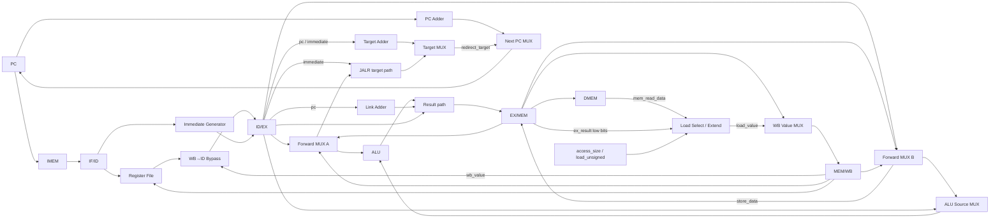

# Datapath

## Qué describe este documento

El datapath es la parte del procesador que **almacena, transporta y transforma datos**. Incluye registros, registros interetapa, memorias, sumadores, multiplexores y unidades funcionales. Su función es recibir una instrucción ya capturada, obtener sus operandos, producir los valores intermedios necesarios y transportar el resultado correcto hasta el punto donde se vuelve arquitectónicamente visible.

Este documento no describe la lógica que decide cuándo avanzar, cuándo insertar bubbles, cuándo hacer flush o cómo se generan las señales de control. Esos temas pertenecen al plano de control y se desarrollan en otros capítulos. Aquí el foco está puesto únicamente en los **valores que existen en la CPU** y en los **caminos por los que esos valores circulan**.

La idea central es simple: distintas clases de instrucciones reutilizan un mismo conjunto de caminos de datos. Lo que cambia de una instrucción a otra no es la existencia de nuevos caminos completos, sino qué valores se seleccionan, qué unidades funcionales intervienen y cuál de los resultados producidos continúa hacia las etapas siguientes.

---

# Vista general del recorrido de datos

A grandes rasgos, el flujo de datos del procesador puede representarse así:



Los selectores de muxes y los controles locales de tamaño y signo son entradas del datapath. `access_size` y `load_unsigned` se derivan en MEM y no son campos adicionales de EX/MEM; su generación se describe en [Etapa MEM](stage_mem.md#mem-decode).

Este recorrido contiene dos ideas estructurales que aparecen una y otra vez.

La primera es el **camino principal de resultado**, que lleva un valor desde EX hasta WB:

```text
operandos
    → operación en EX
    → ex_result
    → MEM
    → wb_value
    → Register File
```

La segunda es que algunos valores no pertenecen a ese camino principal, sino que siguen un recorrido paralelo porque cumplen otra función. El caso más importante es el dato de un store:

```text
rs2_effective
    → store_data
    → EX/MEM
    → DMEM
```

Ese valor no compite con `ex_result`; ambos existen al mismo tiempo y representan cosas distintas.

---

# Estado persistente del datapath

El datapath contiene estado persistente en cuatro grupos principales:

- el **PC**;
- el **Register File**;
- los **registros interetapa**;
- y, como almacenamiento visible para el programa, **IMEM** y **DMEM**.

## PC

El PC conserva la dirección desde la cual IF intenta obtener la próxima instrucción. Es un registro de 32 bits.

Desde el punto de vista del datapath, el PC no es una historia de ejecución ni un contador general; es simplemente el valor de dirección que alimenta el camino de fetch.

## Register File

El Register File contiene treinta y dos registros de 32 bits:

```text
x0 ... x31
```

Tiene dos puertos de lectura combinacional y un puerto de escritura síncrona.

La arquitectura fija que:

```text
x0 = 0
```

por lo que leer `x0` produce siempre cero y escribir sobre `rd=0` no altera su valor observable.

## Registros interetapa

Los cuatro registros interetapa almacenan el estado de cada instrucción mientras cruza el pipeline:

```text
IF/ID
ID/EX
EX/MEM
MEM/WB
```

Cada uno contiene un subconjunto del estado que la etapa siguiente necesita interpretar. La selección exacta de sus campos surge del recorrido funcional de los datos: cada etapa registra lo que todavía será necesario más adelante.

## IMEM y DMEM

IMEM almacena la imagen de instrucciones. DMEM almacena datos observables por loads y stores. Desde el punto de vista del datapath, ambas memorias forman parte del espacio donde el programa obtiene o deposita información.

La organización y semántica completa de memoria se desarrollan en [Arquitectura de memoria](memory_architecture.md). Aquí las trataremos como extremos del recorrido de instrucciones y datos.

---

# Fetch: de PC a IF/ID

El primer camino del datapath es el de la instrucción que entra al pipeline.

A partir del PC actual, IMEM entrega la word de 32 bits ubicada en esa dirección. Esa word y el PC asociado se almacenan en IF/ID. Desde este momento, la instrucción ya no es solamente “la instrucción ubicada en la dirección actual de fetch”, sino una entidad transportada por el pipeline con su propio contexto.

Además del valor leído desde IMEM, IF también calcula:

```text
pc_plus_4 = PC + 4
```

que representa la continuación secuencial natural del flujo de instrucciones.

Aunque más adelante puedan existir redirecciones, el datapath siempre dispone de este camino secuencial.

---

# De una instrucción almacenada a sus operandos

Una vez que la instrucción se encuentra en IF/ID, el datapath extrae de su codificación tres grupos de datos:

1. índices de registros fuente y destino;
2. fragmentos que eventualmente formarán un inmediato;
3. la propia word de instrucción, que sigue siendo útil como identidad y contenido observable.

## Índices de registros

Los campos utilizados son:

```text
rs1 = instruction[19:15]
rs2 = instruction[24:20]
rd  = instruction[11:7]
```

Estos índices alimentan el Register File y también forman parte de la identidad transportada más adelante, porque el destino `rd` sigue siendo necesario hasta WB.

## Inmediato

El Immediate Generator reconstruye un valor de 32 bits a partir de los campos fragmentados de la instrucción. Todos los offsets se interpretan en bytes.

Las reconstrucciones son:

| Formato | Inmediato de 32 bits |
|---|---|
| I | `sext_12(instruction[31:20])` |
| S | `sext_12({instruction[31:25], instruction[11:7]})` |
| B | `sext_13({instruction[31], instruction[7], instruction[30:25], instruction[11:8], 1'b0})` |
| U | `{instruction[31:12], 12'b0}` |
| J | `sext_21({instruction[31], instruction[19:12], instruction[20], instruction[30:21], 1'b0})` |

Este valor inmediato es un dato más del datapath. Más adelante podrá convertirse en operando de la ALU, en desplazamiento de un target o incluso en el resultado que se escribirá en `rd`, según la clase de instrucción.

## Lectura del Register File

Con `rs1` y `rs2`, el Register File produce dos valores base:

```text
rf_rs1_value
rf_rs2_value
```

Estos valores son la primera versión disponible de los operandos, pero todavía no son necesariamente los operandos finales que utilizará EX.

---

# Bypass en ID

Existe un caso particular importante: una instrucción en WB puede estar escribiendo en un registro que, durante ese mismo ciclo, la instrucción en ID necesita leer.

Para que el dato utilizado en ID refleje el valor más reciente, el datapath incluye un camino de bypass desde MEM/WB hacia ID. Así se obtienen dos valores después del bypass:

```text
rs1_value
rs2_value
```

Conceptualmente:

```text
rs1_value =
    bypass_rs1 ? MEM/WB.wb_value : rf_rs1_value

rs2_value =
    bypass_rs2 ? MEM/WB.wb_value : rf_rs2_value
```

Los operandos que se registran en ID/EX ya incorporan el bypass; no se capturan directamente las salidas del Register File.

Esto tiene una consecuencia importante para todo el datapath posterior: EX parte de operandos base que ya incorporan la posible coincidencia con el writeback del mismo ciclo.

---

# Qué guarda ID/EX

ID/EX constituye el punto donde el datapath deja de ver la instrucción como una word recién capturada y pasa a verla como un conjunto estructurado de valores listos para usarse en ejecución.

Desde el punto de vista de los datos, ID/EX conserva al menos:

- el PC de la instrucción;
- la word de instrucción;
- `rd`;
- `rs1_value`;
- `rs2_value`;
- el inmediato reconstruido;
- los campos de control que la etapa EX todavía necesita;
- y la validez de la entrada.

Este registro es clave porque reúne, en un mismo lugar, los datos desde los cuales EX puede producir tanto resultados aritméticos como direcciones, targets o enlaces.

---

# Forwarding hacia EX

Aunque ID/EX ya contiene operandos después del bypass, todavía es posible que el valor más reciente de una fuente no esté en el Register File ni en MEM/WB al momento en que la instrucción fue decodificada, sino que esté siendo producido por una instrucción más cercana.

Por eso, antes de entrar a las unidades funcionales de EX, cada operando atraviesa un multiplexor de forwarding.

## Operandos efectivos

Se obtienen dos operandos efectivos:

```text
rs1_effective
rs2_effective
```

Cada uno de estos valores puede provenir de tres lugares:

| Selector | Fuente |
|---|---|
| `00` | valor base almacenado en ID/EX |
| `01` | `EX/MEM.ex_result` |
| `10` | `MEM/WB.wb_value` |

Desde el punto de vista del datapath, esto significa que EX no opera directamente sobre los valores almacenados en ID/EX, sino sobre una versión potencialmente actualizada de ellos.

El detalle de cuándo se selecciona una u otra fuente pertenece al control de forwarding; lo importante aquí es que el camino de datos existe y que su salida son los operandos efectivos finales.

---

# Selección de operandos para la ALU

La ALU utiliza dos entradas.

La entrada A toma siempre:

```text
alu_operand_a = rs1_effective
```

La entrada B puede tomar uno de dos valores:

- `rs2_effective`;
- el inmediato almacenado en ID/EX.

El ALU Source MUX produce entonces:

```text
alu_operand_b
```

De este modo, el datapath puede reutilizar la misma ALU para operaciones muy distintas.

Las instrucciones registro-registro utilizan dos operandos provenientes, en última instancia, del Register File. Las inmediatas sustituyen el segundo operando por el inmediato. Loads y stores también utilizan el inmediato, pero en ese caso el resultado de la ALU no representa un valor aritmético final, sino una dirección efectiva.

---

# ALU

La ALU es la unidad funcional principal de EX. Produce un resultado de 32 bits y el indicador:

```text
zero
```

Las operaciones implementadas son:

| Operación | Resultado |
|---|---|
| ADD | `A+B` módulo `2^32` |
| SUB | `A-B` módulo `2^32` |
| SLL | shift lógico izquierdo por `B[4:0]` |
| SRL | shift lógico derecho por `B[4:0]` |
| SRA | shift aritmético derecho por `B[4:0]` |
| AND | `A AND B` |
| OR | `A OR B` |
| XOR | `A XOR B` |
| SLT | `1` si `A signed < B signed`, en otro caso `0` |
| SLTU | `1` si `A unsigned < B unsigned`, en otro caso `0` |

La ALU reutiliza el mismo hardware tanto para resultados aritméticos como para comparaciones y cálculo de direcciones.

Los shifts consumen solo cinco bits de la cantidad, por lo que cantidades con los mismos cinco bits bajos producen el mismo desplazamiento efectivo.

---

# Caminos auxiliares de EX

Además de la ALU, EX contiene otros recorridos de datos que producen valores necesarios para ciertas clases de instrucciones.

<a id="target-pc-relative"></a>

## Destino relativo al PC

Una instrucción puede necesitar sumar su PC con un offset inmediato para formar una dirección de destino. Para eso existe un sumador dedicado que produce:

```text
pc_relative_target = ID/EX.pc + ID/EX.immediate
```

Este valor se usa en branches y JAL.

## Target indirecto de JALR

JALR necesita un target basado en un registro:

```text
jalr_sum = rs1_effective + ID/EX.immediate
```

y luego limpia el bit menos significativo:

```text
jalr_target = jalr_sum & 32'hFFFFFFFE
```

Este valor no sustituye al resultado de la ALU de manera implícita: forma parte de un camino separado destinado a seleccionar el próximo PC.

## Link

JAL y JALR también necesitan producir una dirección de retorno:

```text
link_value = ID/EX.pc + 4
```

Este valor sí pertenece al camino principal de resultado, porque termina escribiéndose en `rd`.

---

# El valor `ex_result`

No toda instrucción interpreta la salida relevante de EX de la misma manera. Algunas necesitan el resultado de la ALU; otras necesitan el inmediato; otras necesitan `PC+4`.

Para unificar estos casos, el datapath define un valor explícito:

```text
ex_result
```

`ex_result` es el resultado que sale de EX y continúa hacia MEM a través de EX/MEM. Las fuentes posibles son:

- el resultado de la ALU;
- el inmediato;
- el link `PC+4`.

Así, EX produce un único valor principal transportado por el pipeline, aun cuando ese valor haya sido originado por unidades diferentes.

Esto simplifica enormemente los caminos posteriores: MEM y WB reciben un valor ya resuelto desde el punto de vista de EX, sin necesidad de reinterpretar qué tipo de instrucción lo produjo.

---

# El camino separado de `store_data`

Los stores ilustran por qué `ex_result` no puede representar toda la información de una instrucción.

Un store necesita dos datos distintos al mismo tiempo:

1. la dirección efectiva del acceso;
2. el contenido que se escribirá en memoria.

La dirección efectiva proviene de la ALU y viaja como:

```text
ex_result
```

El dato a escribir, en cambio, es:

```text
store_data = rs2_effective
```

y sigue un camino paralelo hasta EX/MEM.

En otras palabras, un store no reemplaza el camino principal de resultado por el dato de escritura, sino que conserva ambos valores simultáneamente:

```text
ex_result  = dirección
store_data = dato
```

Esto permite que MEM disponga, en el mismo ciclo, tanto de la dirección como del contenido del acceso.

---

# Qué guarda EX/MEM

Desde el punto de vista de los datos, EX/MEM conserva el estado necesario para que MEM pueda actuar sin reconstruir información.

Incluye, al menos:

- el PC de la instrucción;
- la word de instrucción;
- `rd`;
- `ex_result`;
- `store_data` cuando corresponde;
- información de acceso a memoria cuando corresponde;
- la intención de writeback cuando corresponde;
- y la validez.

A partir de aquí, el datapath ya separó dos familias de instrucciones:

- las que continuarán usando `ex_result` como futuro valor de writeback;
- y las que lo utilizarán como dirección de memoria.

---

# Loads

Un load emplea la ALU para formar:

```text
effective_address = rs1_effective + immediate
```

Ese valor entra a EX/MEM como `ex_result`. Cuando la instrucción llega a MEM, dicho valor se interpreta como dirección de acceso a DMEM.

DMEM produce una lectura lógica. El bloque `Load Select / Extend` combina esa lectura con los bits bajos de la dirección, el tamaño del acceso y la selección signed/unsigned para identificar y ensamblar los bytes correctos y obtener:

```text
load_value
```

con el ancho y la extensión apropiados para LB, LH, LW, LBU o LHU.

El recorrido completo es:

```text
rs1_effective + immediate
        ↓
ex_result (dirección)
        ↓
DMEM
        ↓
selección de bytes y extensión
        ↓
load_value
        ↓
wb_value
        ↓
rd
```

Esto muestra con claridad que la dirección y el dato cargado son dos valores diferentes en momentos distintos del recorrido.

---

# Stores

Un store comparte con el load el cálculo de dirección:

```text
effective_address = rs1_effective + immediate
```

pero utiliza además el camino paralelo de `store_data`.

En MEM, DMEM recibe simultáneamente:

- la dirección desde `EX/MEM.ex_result`;
- el contenido desde `EX/MEM.store_data`.

El recorrido puede verse así:

```text
rs1_effective + immediate
        ↓
ex_result (dirección)
        ↓
DMEM address

rs2_effective
        ↓
store_data
        ↓
DMEM data
```

Un store no produce `wb_value` ni escribe `rd`; su efecto visible termina en DMEM.

---

# Instrucciones aritméticas

Las instrucciones aritméticas, tanto registro-registro como inmediatas, son el caso más directo del datapath.

En ambos casos el resultado visible proviene de la ALU y no se transforma en MEM. El camino completo es:

```text
operandos efectivos
    → ALU
    → ex_result
    → EX/MEM
    → wb_value
    → MEM/WB
    → rd
```

La diferencia entre una instrucción registro-registro y una inmediata no cambia este recorrido global. Solo cambia el origen del segundo operando que recibe la ALU.

---

# LUI

LUI utiliza el inmediato U-type como valor final. Su caso es importante porque muestra que el resultado que atraviesa EX no siempre nace en la ALU.

El inmediato reconstruido llega a EX ya completo y se selecciona como:

```text
ex_result = immediate
```

A partir de allí continúa exactamente por el mismo camino de writeback que cualquier otro productor de registros:

```text
immediate
    → ex_result
    → wb_value
    → rd
```

---

# Branches

Los branches utilizan la ALU y el sumador de target, pero no generan un valor destinado a writeback.

Los operandos efectivos permiten formar una comparación. Paralelamente, el datapath produce:

```text
pc_relative_target = ID/EX.pc + immediate
```

que representa el destino potencial del salto.

Desde el punto de vista de los datos, lo importante es que EX dispone al mismo tiempo de:

- el resultado de la comparación;
- el destino relativo al PC.

La decisión de si ese target efectivamente se convierte en el próximo PC pertenece al plano de control. El datapath solo garantiza que el valor existe y que está correctamente calculado.

---

# JAL y JALR

Estas instrucciones combinan dos caminos de datos distintos en una misma instrucción.

Por un lado producen un target de salto:

- `pc_relative_target` para JAL;
- `jalr_target` para JALR.

Por otro lado producen un valor de enlace:

```text
link_value = ID/EX.pc + 4
```

Ese valor de enlace entra al camino principal de resultado y termina escribiéndose en `rd`.

Por lo tanto, en una misma instrucción de salto con enlace, el datapath produce dos salidas conceptualmente distintas:

- un valor que alimenta la actualización del PC;
- un valor que viaja por `ex_result → wb_value → rd`.

Esto explica por qué JAL y JALR no necesitan un mecanismo especial de writeback: su enlace reutiliza el mismo camino principal que usa el resto de las instrucciones que escriben un registro.

---

# De EX a WB

Una vez que el valor principal de EX entró a EX/MEM, MEM decide cuál será el valor final de writeback.

Aquí aparece otro concepto clave del datapath:

```text
wb_value
```

`wb_value` es el dato definitivo que entra a MEM/WB y que, si corresponde, podrá escribirse en el Register File.

Sus fuentes son dos:

- `EX/MEM.ex_result`;
- `load_value`.

Para todas las instrucciones que no son load:

```text
wb_value = EX/MEM.ex_result
```

Para un load:

```text
wb_value = load_value
```

Este es el último punto donde el camino principal de resultados cambia de significado. Después de este mux, WB no necesita distinguir si el valor provino de una operación aritmética, de un inmediato, de un enlace o de una carga desde memoria.

---

# Qué guarda MEM/WB

MEM/WB contiene el resultado ya finalizado desde el punto de vista del datapath.

Sus campos relevantes son, al menos:

- el PC de la instrucción;
- la word de instrucción;
- `rd`;
- `wb_value`;
- la información necesaria para determinar si existe writeback;
- y la validez.

A partir de este punto ya no hay nuevas transformaciones de datos. Solo resta hacer commit del valor final en el Register File.

---

# Writeback

WB constituye el final del camino principal de resultados.

Cuando la entrada en MEM/WB corresponde a una instrucción que escribe un registro y el destino no es `x0`, `wb_value` se aplica al puerto de escritura del Register File.

Desde el punto de vista del datapath, este es el punto en el que un valor producido por la instrucción vuelve a incorporarse al estado arquitectónico del procesador.

Muchas clases de instrucciones distintas convergen aquí:

- aritméticas;
- inmediatas;
- LUI;
- loads;
- JAL;
- JALR.

La unificación es posible porque todas ellas hicieron coincidir previamente su recorrido en el par:

```text
ex_result
wb_value
```

---

# Caminos fundamentales resumidos por clase de instrucción

## Aritméticas registro-registro

```text
rs1_effective
rs2_effective
    → ALU
    → ex_result
    → wb_value
    → rd
```

## Aritméticas inmediatas

```text
rs1_effective
immediate
    → ALU
    → ex_result
    → wb_value
    → rd
```

## LUI

```text
immediate
    → ex_result
    → wb_value
    → rd
```

## Loads

```text
rs1_effective + immediate
    → ex_result (dirección)
    → DMEM
    → selección de bytes y extensión
    → load_value
    → wb_value
    → rd
```

## Stores

```text
rs1_effective + immediate
    → ex_result (dirección)
    → DMEM address

rs2_effective
    → store_data
    → DMEM data
```

## Branches

```text
rs1_effective
rs2_effective
    → comparación en EX

ID/EX.pc + immediate
    → pc_relative_target
```

## JAL

```text
ID/EX.pc + immediate
    → pc_relative_target

ID/EX.pc + 4
    → link_value
    → ex_result
    → wb_value
    → rd
```

## JALR

```text
rs1_effective + immediate
    → jalr_target (bit 0 limpio)

ID/EX.pc + 4
    → link_value
    → ex_result
    → wb_value
    → rd
```

---

# Inventario funcional de bloques de datos

La siguiente tabla resume únicamente los bloques que pertenecen al datapath o al almacenamiento funcional de la CPU.

| Bloque | Naturaleza | Función de datos |
|---|---|---|
| PC | registro de 32 bits | conserva la dirección actual de fetch |
| IMEM | memoria | entrega la word de instrucción almacenada |
| IF/ID | registro interetapa | conserva instrucción, PC y contexto de fetch |
| Register File | 32×32, 2R1W | entrega registros fuente y recibe writeback |
| Immediate Generator | combinacional | reconstruye inmediatos I/S/B/U/J |
| WB→ID Bypass path | camino combinacional | sustituye lecturas del RF por `wb_value` cuando coincide el destino |
| ID/EX | registro interetapa | conserva operandos base, inmediato, identidad y contexto |
| Forward MUX A | mux 3:1 | produce `rs1_effective` |
| Forward MUX B | mux 3:1 | produce `rs2_effective` |
| ALU Source MUX | mux 2:1 | selecciona `rs2_effective` o inmediato como operando B |
| ALU | unidad funcional | realiza operación aritmética, lógica, comparación o dirección |
| Target Adder | combinacional | calcula `pc_relative_target` |
| JALR path | combinacional | calcula `jalr_target` con bit 0 limpio |
| Link Adder | combinacional | calcula `PC+4` para JAL/JALR |
| Result path / Result MUX | camino combinacional | produce `ex_result` a partir de ALU, inmediato o link |
| EX/MEM | registro interetapa | conserva `ex_result`, `store_data` e identidad |
| DMEM | memoria | recibe dirección y dato de store; produce dato de load |
| Load Select / Extend | combinacional | selecciona bytes por dirección y tamaño, ensambla y extiende la lectura lógica para producir `load_value` |
| WB Value MUX | mux 2:1 | produce `wb_value` a partir de `ex_result` o `load_value` |
| MEM/WB | registro interetapa | conserva `wb_value` e identidad hasta WB |

No se incluyen en esta tabla bloques cuyo rol principal sea decidir acciones, detectar hazards, arbitrar comandos o confirmar faults, porque pertenecen al plano de control.

---

# Qué deliberadamente no cubre este documento

Para mantener una separación clara, este documento no desarrolla:

- cómo se generan las señales de control;
- cómo se decide forwarding;
- cuándo se inserta un stall `load-use`;
- cuándo se descarta trabajo por redirect;
- cómo se detectan y confirman faults;
- cómo se selecciona el próximo PC desde el punto de vista del control;
- cómo RUN, STEP u HOLD autorizan ciclos;
- ni cómo se arbitran LOAD, RUN y STEP.

Todos esos temas se apoyan en el datapath, pero no forman parte del datapath mismo.

---

# Referencias a los documentos de control y de etapa

Los caminos de datos descritos aquí se complementan con los siguientes documentos:

- [Etapa IF](stage_if.md): realización local de fetch y captura en IF/ID.
- [Etapa ID](stage_id.md): estructura local de lecturas, inmediatos y datos que entran a ID/EX.
- [Etapa EX](stage_ex.md): realización local de operandos efectivos, ALU, targets, link y `ex_result`.
- [Etapa MEM](stage_mem.md): realización local de `load_value`, stores y selección de `wb_value`.
- [Etapa WB](stage_wb.md): commit final de `wb_value` en el Register File.
- [Control del pipeline y hazards](control_and_hazards.md): forwarding, stalls, bubbles, flushes y acciones del pipeline.
- [Faults, redirects y terminación](faults_and_termination.md): redirects, confirmación de `halt` o fault y drain.
- [Control de ejecución y sesión](execution_control.md): autorización de ciclos de la CPU.
- [Arquitectura de memoria](memory_architecture.md): semántica completa de IMEM y DMEM.
