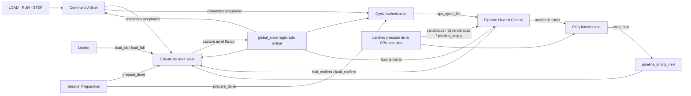
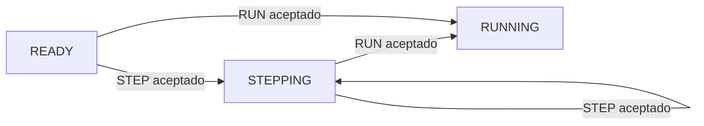
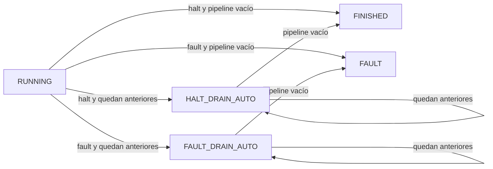
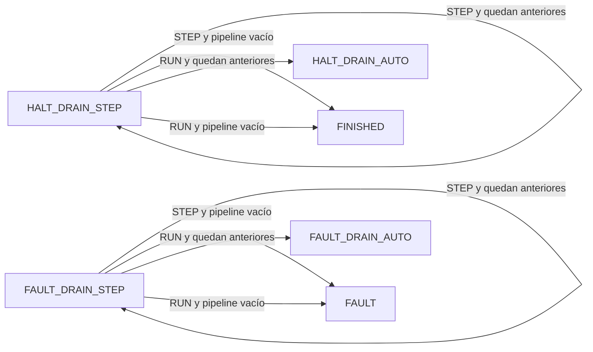
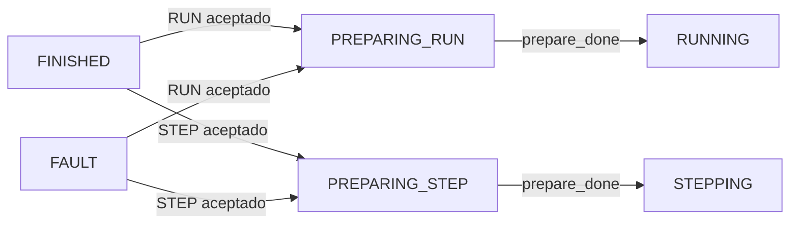

# Control de ejecución y sesión

## Imagen, sesión y ejecución

El procesador distingue entre el programa que está almacenado y una ejecución concreta de ese programa. La **imagen** es el contenido confirmado de IMEM; una **sesión** es una ejecución de esa imagen desde un estado inicial limpio hasta que termina normalmente o por fault.

Esta separación permite reutilizar una misma imagen varias veces. Después de una ejecución, el programa puede seguir cargado en IMEM, pero una sesión nueva vuelve a comenzar con un estado de ejecución reinicializado: `PC=0`, Register File en cero, pipeline vacío, DMEM lógicamente en cero y `cycle_count=0`.

Por eso cargar un programa y ejecutarlo no son la misma operación. La carga establece qué instrucciones existen; la preparación establece desde qué estado comienza una ejecución; RUN y STEP determinan cómo esa ejecución avanza en el tiempo.

<a id="clock-físico-y-ciclo-cpu"></a>

## Clock físico y ciclo de la CPU

El clock físico del sistema continúa funcionando incluso cuando el pipeline no está ejecutando instrucciones. Puede haber actividad mientras se carga una imagen, se prepara una sesión, se espera una orden del usuario o se transmite información de Debug.

La arquitectura distingue entonces entre un flanco físico y un **ciclo efectivo de la CPU**.

```text
cpu_cycle_fire = 1
```

indica que en ese flanco se ejecuta un ciclo del procesador. Durante ese ciclo pueden avanzar instrucciones, producirse un stall `load-use`, resolverse un redirect, confirmarse `halt` o un fault, o avanzar las instrucciones anteriores durante drain.

Cuando:

```text
cpu_cycle_fire = 0
```

el pipeline no ejecuta un ciclo. El sistema puede seguir activo en otros subsistemas, pero el estado de la CPU permanece retenido salvo que una operación global, como RESET, LOAD aceptado o preparación de sesión, esté modificándolo.

Esta separación permite utilizar el mismo clock físico para todo el sistema sin confundir actividad general con avance del procesador.

## Por qué hace falta un control global

El control interno del pipeline responde qué ocurre **dentro de un ciclo de la CPU ya autorizado**. Si aparece una dependencia, decide qué registros retener; si una instrucción redirige el flujo, descarta las posteriores; si se confirma `halt` o un fault, deja de admitir trabajo nuevo y determina qué instrucciones pueden terminar.

Antes de autorizar cualquier ciclo, el sistema necesita saber si hay una imagen cargada, si la sesión ya fue preparada, si se ejecuta en modo continuo o paso a paso, si quedan instrucciones por drenar después de confirmar `halt` o fault, o si la sesión ya terminó.

Además, una misma orden externa puede significar cosas diferentes según ese contexto. Un STEP en una sesión lista ejecuta el primer ciclo; en `STEPPING` ejecuta un ciclo adicional; durante un drain STEP avanza únicamente trabajo anterior; después de `FINISHED` o `FAULT` inicia la preparación de una sesión nueva.

Por eso la arquitectura conserva una fase global mediante `global_state`. La FSM global no reemplaza al control del pipeline; conserva el contexto necesario para decidir qué operaciones son posibles y cuándo corresponde generar `cpu_cycle_fire`.



En este esquema la FSM conserva la fase de la sesión, `Cycle Authorization` decide si en el flanco actual se ejecuta un ciclo de la CPU y `Pipeline Hazard Control` determina cómo se utiliza ese ciclo. La única flecha de regreso a `global_state` representa una captura registrada en el flanco; `next_state` no autoriza ni modifica el ciclo que lo produce.

---

# Comenzar desde una imagen inexistente

Después de reset no existe una imagen ejecutable confirmada. El sistema se encuentra en `NO_IMAGE`, con:

```text
loaded_image_size_bytes = 0
```

En esa situación RUN y STEP no pueden iniciar una ejecución porque todavía no hay programa válido.

Una carga aceptada lleva al sistema a `LOADING`. Durante esta fase el Loader recibe y escribe la nueva imagen en IMEM. El progreso de esa carga pertenece al Loader y todavía no forma parte del estado ejecutable de la CPU.

Si la carga falla, el sistema vuelve a `NO_IMAGE`. Si termina correctamente, aparece `load_ok` y comienza una fase distinta: la imagen ya fue recibida, pero todavía falta preparar el estado inicial de la primera sesión.

Ese estado es `PREPARING_READY`.


Durante `PREPARING_READY`, Session Preparation establece el estado inicial de ejecución. El PC vuelve a cero, el Register File se observa en cero, los registros interetapa quedan inválidos, DMEM presenta el cero lógico de una sesión nueva y `cycle_count` vuelve a cero.

La preparación puede ocupar varios clocks físicos. Mientras no termina, no existe un ciclo de la CPU.

`prepare_done` certifica que ese trabajo ya terminó antes del flanco actual. En `PREPARING_READY`, ese flanco publica la imagen confirmada y lleva a `READY`, pero no ejecuta todavía una instrucción.

`READY` representa una imagen válida y una sesión preparada que todavía espera una orden.

---

# RUN: ejecución continua

RUN inicia o reanuda una ejecución continua.

Cuando RUN se acepta en `READY`, el mismo flanco ya constituye el primer ciclo de la CPU. Si ese ciclo no termina la sesión, el estado siguiente es `RUNNING`.

En `RUNNING`, cada flanco habilitado solicita automáticamente otro ciclo de la CPU. El procesador continúa de esta manera hasta que se produce una condición que inicia la terminación de la ejecución.

Esto no implica que todos los ciclos sean iguales. Dentro de `RUNNING`, el control del pipeline puede seleccionar avance normal, stall `load-use`, redirect o confirmación de `halt` o fault. Todos ellos siguen siendo ciclos de la CPU porque `cpu_cycle_fire=1`.


Un stall no detiene el modo continuo; solamente altera cómo avanza el pipeline durante ese ciclo. Un redirect tampoco abandona `RUNNING`; cambia el PC y descarta trabajo posterior, pero la sesión continúa.

---

# STEP: ejecución de un solo ciclo

STEP utiliza el mismo datapath que RUN, pero cambia la política temporal.

Con RUN, después de un ciclo se solicita otro automáticamente. Con STEP, se ejecuta exactamente un ciclo y después se vuelve a esperar.

Si STEP se acepta en `READY`, ese flanco ejecuta el primer ciclo de la sesión. Si no se confirma `halt` o fault, el estado siguiente es `STEPPING`.

`STEPPING` representa una sesión activa detenida entre dos ciclos. Por sí solo no solicita `cpu_cycle_fire`; necesita una nueva orden RUN o STEP.



Las flechas anteriores muestran el caso en que el ciclo ejecutado no confirma `halt` ni fault.

Un stall `load-use` consume el STEP. Aunque el consumidor permanezca retenido, el ciclo existió: el load y las instrucciones anteriores avanzaron. No se agrega un segundo ciclo automático para completar la dependencia.

---

<a id="cuando-una-sesión-encuentra-una-frontera-terminal"></a>

# Cuando se confirma `halt` o fault

Una sesión puede terminar normalmente mediante `halt` o excepcionalmente mediante un fault.

Confirmar `halt` o fault no implica necesariamente que todo el pipeline ya esté vacío. En ese momento pueden existir instrucciones anteriores en MEM o WB que todavía deben terminar su ejecución.

Esas instrucciones conservan sus efectos. Por eso la arquitectura no salta siempre directamente desde ejecución a `FINISHED` o `FAULT`.

Si todavía queda trabajo anterior, aparece una fase intermedia de **drain**.

Durante el drain no se admite trabajo nuevo. La instrucción que provoca un fault ya fue descartada, o `halt` ya se consumió en EX. Las instrucciones posteriores también se descartaron; únicamente continúan las anteriores hasta abandonar el pipeline.

## Drain después de RUN

Si `halt` o fault se confirmó durante la ejecución continua, el drenado también continúa automáticamente.

Un `halt` conduce a `HALT_DRAIN_AUTO` cuando todavía queda trabajo. Un fault conduce a `FAULT_DRAIN_AUTO`.



En los estados AUTO, cada flanco elegible solicita un nuevo ciclo de drain hasta que desaparece la última instrucción anterior.

`FINISHED` representa una terminación normal con pipeline vacío. `FAULT` representa una terminación excepcional con pipeline vacío.

## Drain después de STEP

Si `halt` o fault se confirmó durante un ciclo originado por STEP, el drenado respeta la modalidad paso a paso.

`HALT_DRAIN_STEP` y `FAULT_DRAIN_STEP` no avanzan automáticamente. Cada STEP autoriza un único ciclo adicional de drain.

RUN también puede aceptarse en esos estados. En ese caso, el ciclo actual se ejecuta y, si todavía queda trabajo después del flanco, el resto del drenado pasa a modalidad AUTO.



Así, la modalidad de ejecución en la que se confirmó `halt` o fault sigue determinando cómo se completa el trabajo anterior.

---

# Después de `FINISHED` o `FAULT`

Llegar a un estado terminal termina la sesión, pero no elimina necesariamente la imagen confirmada.

La misma imagen puede ejecutarse otra vez. Sin embargo, RUN o STEP desde `FINISHED` o `FAULT` no reanudan la ejecución anterior. La sesión anterior ya terminó y su pipeline está vacío.

Antes de ejecutar nuevamente se reconstruye el estado inicial.

Si la nueva orden es RUN, la FSM entra en `PREPARING_RUN`. Si la orden es STEP, entra en `PREPARING_STEP`.



En ambos casos, mientras `prepare_done=0` no existe un ciclo de la CPU.

Cuando la preparación termina, la nueva sesión ya está limpia antes del flanco. Ese mismo flanco ejecuta el primer ciclo pendiente.

`PREPARING_RUN` y `PREPARING_STEP` son estados distintos porque durante la preparación hay que conservar qué tipo de ejecución fue solicitada. No existe una cola adicional para recordar esa orden; el propio estado contiene ese contexto.

---

# LOAD durante una sesión existente

Una nueva carga abandona la sesión vigente y reemplaza la imagen.

LOAD puede aceptarse desde:

```text
NO_IMAGE
READY
STEPPING
HALT_DRAIN_STEP
FAULT_DRAIN_STEP
FINISHED
FAULT
```

Cuando se acepta, el sistema pasa a `LOADING` y:

```text
loaded_image_size_bytes = 0
```

El flanco no ejecuta un ciclo de la CPU de la sesión anterior.

`RUNNING`, los drains AUTO, `LOADING` y los estados de preparación no aceptan LOAD. Una solicitud no elegible se rechaza y no altera por sí sola la ejecución actual. En particular, un LOAD rechazado durante `RUNNING` no cancela el ciclo automático correspondiente.

---

# RESET

RESET tiene prioridad sobre cualquier otro efecto funcional.

La orden UART RESET sigue el [intercambio externo aprobado](../decisions.md#acuerdo-parcial-de-dec-proto-002--intercambio-reset-con-aceptación-antes-del-reset-global): primero transmite `[RESET][ACCEPTED]` completa y luego genera la solicitud global de reset, al finalizar físicamente su segundo byte incluido Stop. El botón físico lo solicita directamente. El reset generado conserva el acondicionamiento y la prioridad funcional aquí definidos; no se agrega un estado global de espera UART.

Durante la respuesta automática Debug, la capa de protocolo descarta RX y no reconoce RESET UART; la PC espera la respuesta completa antes de enviarlo. El botón físico sigue pudiendo solicitar reset de inmediato y abortar la transmisión. La exclusión de nuevas solicitudes se aplica desde el instante postciclo observado hasta finalizar físicamente el último byte, incluido Stop; no cambia la prioridad del reset funcional ni agrega estados a la FSM global. Véase el [acuerdo de envío exclusivo](../decisions.md#acuerdo-parcial-de-dec-proto-001--envío-exclusivo-de-debug-con-estado-retenido).

Desde cualquier estado lleva al sistema a:

```text
NO_IMAGE
```

y deja:

```text
PC = 0
Register File = 0 lógico
cycle_count = 0
IF/ID.valid = 0
ID/EX.valid = 0
EX/MEM.valid = 0
MEM/WB.valid = 0
IF/ID.fetch_fault_valid = 0
loaded_image_size_bytes = 0
```

En ese mismo flanco no se realizan stores, writebacks, operaciones del Loader ni operaciones de mantenimiento.

IMEM y DMEM no necesitan borrarse físicamente. El tamaño confirmado invalida la imagen anterior y la preparación de la próxima sesión restablece el cero lógico de DMEM.

---

# FSM global

Las situaciones anteriores se representan mediante `global_state`.

La FSM registra únicamente la fase de la sesión. No escribe directamente PC, Register File, memorias o registros interetapa, y tampoco selecciona las acciones internas del pipeline.

Sus estados son:

| Estado | Significado |
|---|---|
| `NO_IMAGE` | No existe una imagen ejecutable confirmada. |
| `LOADING` | Se recibe y valida una imagen nueva. |
| `PREPARING_READY` | Se prepara la primera sesión de una imagen recién cargada. |
| `READY` | Imagen y sesión preparadas, esperando RUN o STEP. |
| `RUNNING` | Ejecución continua. |
| `STEPPING` | Ejecución paso a paso, detenida entre órdenes. |
| `HALT_DRAIN_AUTO` | `halt` confirmado con trabajo anterior; drain automático. |
| `HALT_DRAIN_STEP` | `halt` confirmado con instrucciones anteriores pendientes; drenado mediante órdenes STEP. |
| `FAULT_DRAIN_AUTO` | fault confirmado con trabajo anterior; drain automático. |
| `FAULT_DRAIN_STEP` | fault confirmado con instrucciones anteriores pendientes; drenado mediante órdenes STEP. |
| `FINISHED` | Terminación normal con pipeline vacío. |
| `FAULT` | Terminación excepcional con pipeline vacío. |
| `PREPARING_RUN` | Preparación de una sesión nueva con RUN pendiente. |
| `PREPARING_STEP` | Preparación de una sesión nueva con STEP pendiente. |

La representación externa de estos estados en Debug está aprobada: un byte con códigos 0x00–0x0D en el mismo orden de la tabla anterior. No impone la codificación física de la FSM. Véase el [acuerdo de estados](../decisions.md#acuerdo-parcial-de-dec-proto-001--códigos-externos-de-global_state).

La modalidad AUTO/STEP del drain forma parte de `global_state`; no existe un registro `drain_auto`. El tipo terminal también está representado por el estado; no existe un flip-flop separado `terminal_kind`.

---

# Estado global asociado a la sesión

Además de `global_state`, el sistema conserva otros registros globales:

| Registro | Función |
|---|---|
| `fault_cause[2:0]` | Causa del fault confirmado. |
| `fault_pc[31:0]` | PC de la operación causante. |
| `loaded_image_size_bytes` | Tamaño de la imagen confirmada. |
| `cycle_count[63:0]` | Cantidad de ciclos efectivos de la CPU de la sesión. |

PC, Register File, memorias y registros interetapa pertenecen al datapath.

Señales como `image_valid`, `program_finished`, `fault_info_valid`, `continuous_mode` o `drain_mode` se derivan combinacionalmente de este estado y no agregan nuevos registros persistentes.

---

# Aceptación de LOAD, RUN y STEP

LOAD, RUN y STEP son operaciones conceptuales. Su codificación UART se define en el protocolo externo.

El Command Arbiter primero comprueba si cada operación es elegible en el estado actual y después aplica la prioridad:

```text
RESET
    >
LOAD
    >
STEP
    >
RUN
```

Por eso un LOAD aceptado excluye RUN y STEP, mientras un STEP aceptado excluye RUN.

La elegibilidad es:

| Operación | Estados elegibles |
|---|---|
| LOAD | `NO_IMAGE`, `READY`, `STEPPING`, `HALT_DRAIN_STEP`, `FAULT_DRAIN_STEP`, `FINISHED`, `FAULT` |
| RUN | `READY`, `STEPPING`, `HALT_DRAIN_STEP`, `FAULT_DRAIN_STEP`, `FINISHED`, `FAULT` |
| STEP | `READY`, `STEPPING`, `HALT_DRAIN_STEP`, `FAULT_DRAIN_STEP`, `FINISHED`, `FAULT` |

`load_accept`, `run_accept` y `step_accept` representan solicitudes que ya superaron este arbitraje.

---

<a id="autorización-de-un-ciclo-cpu"></a>

# Autorización de un ciclo de la CPU

Una vez conocido el estado actual y las órdenes aceptadas, `Cycle Authorization` determina si existe un ciclo efectivo de la CPU.

Hay tres fuentes.

La primera corresponde a estados que avanzan automáticamente:

```text
automatic_cycle_request =
    state en {
        RUNNING,
        HALT_DRAIN_AUTO,
        FAULT_DRAIN_AUTO
    }
```

La segunda corresponde a estados que esperan una orden:

```text
command_cycle_request =
    state en {
        READY,
        STEPPING,
        HALT_DRAIN_STEP,
        FAULT_DRAIN_STEP
    }
    && (run_accept || step_accept)
```

La tercera corresponde al primer ciclo de una sesión reutilizada:

```text
prepare_cycle_request =
    state en {
        PREPARING_RUN,
        PREPARING_STEP
    }
    && prepare_done
```

Las tres se combinan:

```text
cycle_request =
    automatic_cycle_request
    || command_cycle_request
    || prepare_cycle_request
```

La autorización efectiva incorpora las prioridades globales:

```text
cpu_cycle_fire =
    !reset
    && !load_accept
    && cycle_request
```

Estas ecuaciones utilizan siempre `global_state` actual. `next_state` no realimenta la autorización del mismo flanco.

---

# Origen del ciclo

Cuando un ciclo confirma `halt` o fault, el control necesita distinguir si las instrucciones anteriores continuarán automáticamente o por pasos.

Un ciclo es de origen continuo cuando proviene de `RUNNING`, de un drain AUTO, de una orden RUN aceptada en un estado de espera de comandos o del final de `PREPARING_RUN`.

```text
continuous_cycle =
    automatic_cycle_request
    ||
    (
        state en {
            READY,
            STEPPING,
            HALT_DRAIN_STEP,
            FAULT_DRAIN_STEP
        }
        && run_accept
    )
    ||
    (
        state == PREPARING_RUN
        && prepare_done
    )
```

```text
cycle_from_continuous =
    cpu_cycle_fire
    && continuous_cycle
```

Los demás ciclos efectivos corresponden a STEP.

No se registra el origen por separado; al confirmar `halt` o fault, el estado siguiente `*_AUTO` o `*_STEP` ya conserva esa información.

---

# Resultado de un ciclo

Para un ciclo ejecutado desde `READY`, `STEPPING`, `RUNNING`, `PREPARING_RUN` o `PREPARING_STEP`, el estado siguiente depende de si se confirmó `halt` o fault y del origen del ciclo.

| Resultado | Origen STEP | Origen continuo |
|---|---|---|
| Sin confirmar `halt` o fault | `STEPPING` | `RUNNING` |
| `halt_confirm` y pipeline vacío | `FINISHED` | `FINISHED` |
| `halt_confirm` y quedan anteriores | `HALT_DRAIN_STEP` | `HALT_DRAIN_AUTO` |
| `fault_confirm` y pipeline vacío | `FAULT` | `FAULT` |
| `fault_confirm` y quedan anteriores | `FAULT_DRAIN_STEP` | `FAULT_DRAIN_AUTO` |

Un redirect o un stall `load-use` no cambia esta clasificación.

Durante un drain ya se ha determinado si la terminación es por `halt` o fault, y no se confirma otra condición de terminación. El siguiente estado depende solamente de si quedan instrucciones pendientes y, en los drains STEP, de si la orden aceptada fue STEP o RUN.

| Estado | Ciclo | Quedan anteriores | Pipeline vacío |
|---|---|---|---|
| `HALT_DRAIN_AUTO` | automático | `HALT_DRAIN_AUTO` | `FINISHED` |
| `HALT_DRAIN_STEP` | STEP | `HALT_DRAIN_STEP` | `FINISHED` |
| `HALT_DRAIN_STEP` | RUN | `HALT_DRAIN_AUTO` | `FINISHED` |
| `FAULT_DRAIN_AUTO` | automático | `FAULT_DRAIN_AUTO` | `FAULT` |
| `FAULT_DRAIN_STEP` | STEP | `FAULT_DRAIN_STEP` | `FAULT` |
| `FAULT_DRAIN_STEP` | RUN | `FAULT_DRAIN_AUTO` | `FAULT` |

---

# Pipeline vacío

Para conocer si existe trabajo activo en el pipeline:

```text
pipeline_empty =
    !IF/ID.valid
    && !ID/EX.valid
    && !EX/MEM.valid
    && !MEM/WB.valid
```

Para decidir el estado siguiente después del ciclo actual se utilizan los valores que quedarán después del flanco:

```text
pipeline_empty_next =
    !IF/ID.next.valid
    && !ID/EX.next.valid
    && !EX/MEM.next.valid
    && !MEM/WB.next.valid
```

Así, si el ciclo actual consume la última instrucción anterior, la FSM puede entrar directamente en `FINISHED` o `FAULT` sin agregar un ciclo de drain vacío.

`IF/ID.fetch_fault_valid` no forma parte de esta expresión porque la confirmación de `halt` o fault ya invalida ese candidato.

---

# HOLD

HOLD no es un estado adicional.

Describe un flanco en el que no existe ciclo de la CPU y tampoco una operación global superior modificando el estado de ejecución.

Durante HOLD permanecen estables el PC, los registros interetapa, el Register File y `cycle_count`, y no se producen nuevos efectos de la CPU.

Esto ocurre, por ejemplo, mientras `STEPPING` espera otra orden o mientras un drain STEP espera el siguiente STEP.

HOLD y un stall `load-use` son situaciones diferentes:

| Situación | `cpu_cycle_fire` | Efecto |
|---|---:|---|
| stall `load-use` | 1 | parte del pipeline avanza |
| HOLD | 0 | no existe avance CPU |

---

# Preparación y prioridad global

Las acciones globales siguen esta prioridad:

```text
RESET
    >
LOAD aceptado / preparación efectiva
    >
ciclo efectivo de la CPU
    >
HOLD
```

Session Preparation puede modificar PC, Register File, registros interetapa y metadata de DMEM mientras la sesión todavía no está lista.

`prepare_done=1` certifica que esas modificaciones ya terminaron antes del flanco actual. Por eso `PREPARING_RUN` y `PREPARING_STEP` pueden utilizar ese mismo flanco como primer ciclo de la nueva sesión sin competir con una escritura de preparación.

Para LOAD en los perfiles `REFERENCE` y `ALT_1000`, el [presupuesto aprobado de preparación](../decisions.md#acuerdo-parcial-de-dec-proto-003--presupuesto-máximo-de-preparación-de-sesión) es como máximo 1 ms (50.000 clocks de 50 MHz), desde la entrada a `PREPARING_READY` hasta su commit en READY. Es una cota de diseño que deberá cumplir la secuencia física todavía pendiente; se completa apenas `prepare_done` lo permita, sin espera fija. Un perfil futuro deberá revisar su presupuesto antes de utilizarse.

---

# Contador lógico de ciclos

`cycle_count` es un contador sin signo de 64 bits asociado a la sesión.

Se inicializa en cero durante la preparación y aumenta exactamente una vez por ciclo de la CPU:

```text
cycle_counter_increment =
    cpu_cycle_fire
```

```text
cycle_count.next =
    (cycle_count + 1) mod 2^64
```

Cuenta avance normal, stalls `load-use`, redirects, ciclos que confirman `halt` o fault y cada ciclo de drain.

No cuenta HOLD, clocks de carga, UART, Debug ni mantenimiento que no constituya un ciclo de la CPU.

El wrap de `0xffffffffffffffff` a cero no genera fault ni modifica el modo de ejecución.

---

# Señales derivadas de `global_state`

Las siguientes señales son decodificaciones combinacionales:

| Señal | Estados |
|---|---|
| `loader_active` | `LOADING` |
| `prepare_active` | `PREPARING_READY`, `PREPARING_RUN`, `PREPARING_STEP` |
| `continuous_mode` | `RUNNING`, `HALT_DRAIN_AUTO`, `FAULT_DRAIN_AUTO` |
| `step_mode` | `STEPPING`, `HALT_DRAIN_STEP`, `FAULT_DRAIN_STEP` |
| `drain_mode` | los cuatro estados DRAIN |
| `halt_drain_active` | `HALT_DRAIN_AUTO`, `HALT_DRAIN_STEP` |
| `fault_drain_active` | `FAULT_DRAIN_AUTO`, `FAULT_DRAIN_STEP` |
| `program_finished` | `FINISHED` |
| `fault_active` / `fault_info_valid` | `FAULT_DRAIN_AUTO`, `FAULT_DRAIN_STEP`, `FAULT` |
| `fault_terminal` | `FAULT` |

No constituyen nuevos estados persistentes.

---

# Tabla de transiciones

RESET domina cualquier fila y lleva a `NO_IMAGE`.

| Estado actual | Evento | Ciclo CPU | Siguiente |
|---|---|:-:|---|
| `NO_IMAGE` | LOAD aceptado | no | `LOADING` |
| `NO_IMAGE` | otro | no | `NO_IMAGE` |
| `LOADING` | `load_ok` | no | `PREPARING_READY` |
| `LOADING` | `load_fail` | no | `NO_IMAGE` |
| `LOADING` | carga en curso | no | `LOADING` |
| `PREPARING_READY` | `prepare_done` | no | `READY` |
| `PREPARING_READY` | sin `prepare_done` | no | `PREPARING_READY` |
| `READY` | LOAD aceptado | no | `LOADING` |
| `READY` | STEP aceptado | sí | según resultado del ciclo STEP |
| `READY` | RUN aceptado | sí | según resultado del ciclo continuo |
| `READY` | sin orden | no | `READY` |
| `STEPPING` | LOAD aceptado | no | `LOADING` |
| `STEPPING` | STEP aceptado | sí | según resultado del ciclo STEP |
| `STEPPING` | RUN aceptado | sí | según resultado del ciclo continuo |
| `STEPPING` | sin orden | no | `STEPPING` |
| `RUNNING` | automático | sí | según resultado del ciclo continuo |
| `HALT_DRAIN_AUTO` | automático | sí | `HALT_DRAIN_AUTO` o `FINISHED` |
| `FAULT_DRAIN_AUTO` | automático | sí | `FAULT_DRAIN_AUTO` o `FAULT` |
| `HALT_DRAIN_STEP` | LOAD aceptado | no | `LOADING` |
| `HALT_DRAIN_STEP` | STEP aceptado | sí | `HALT_DRAIN_STEP` o `FINISHED` |
| `HALT_DRAIN_STEP` | RUN aceptado | sí | `HALT_DRAIN_AUTO` o `FINISHED` |
| `HALT_DRAIN_STEP` | sin orden | no | `HALT_DRAIN_STEP` |
| `FAULT_DRAIN_STEP` | LOAD aceptado | no | `LOADING` |
| `FAULT_DRAIN_STEP` | STEP aceptado | sí | `FAULT_DRAIN_STEP` o `FAULT` |
| `FAULT_DRAIN_STEP` | RUN aceptado | sí | `FAULT_DRAIN_AUTO` o `FAULT` |
| `FAULT_DRAIN_STEP` | sin orden | no | `FAULT_DRAIN_STEP` |
| `FINISHED` | LOAD aceptado | no | `LOADING` |
| `FINISHED` | RUN aceptado | no | `PREPARING_RUN` |
| `FINISHED` | STEP aceptado | no | `PREPARING_STEP` |
| `FINISHED` | sin orden | no | `FINISHED` |
| `FAULT` | LOAD aceptado | no | `LOADING` |
| `FAULT` | RUN aceptado | no | `PREPARING_RUN` |
| `FAULT` | STEP aceptado | no | `PREPARING_STEP` |
| `FAULT` | sin orden | no | `FAULT` |
| `PREPARING_RUN` | `prepare_done` | sí | según resultado del ciclo continuo |
| `PREPARING_RUN` | sin `prepare_done` | no | `PREPARING_RUN` |
| `PREPARING_STEP` | `prepare_done` | sí | según resultado del ciclo STEP |
| `PREPARING_STEP` | sin `prepare_done` | no | `PREPARING_STEP` |

---

# Invariantes principales

- `global_state` pertenece siempre al conjunto de estados definido por la FSM.
- No existe un ciclo de la CPU antes de que haya una sesión ejecutable.
- `PREPARING_READY` llega a `READY` sin ejecutar CPU.
- `PREPARING_RUN` y `PREPARING_STEP` utilizan `prepare_done` para ejecutar el primer ciclo de una sesión reutilizada.
- RUN mantiene ejecución continua; STEP autoriza un ciclo por aceptación.
- Un stall `load-use` consume el STEP que lo produjo.
- Los drains AUTO avanzan automáticamente.
- Los drains STEP permanecen retenidos hasta otra orden.
- RUN desde un drain STEP convierte el trabajo restante a modalidad AUTO.
- `FINISHED` representa `halt` con pipeline vacío.
- `FAULT` representa fault con pipeline vacío.
- RUN o STEP desde un terminal inician una sesión nueva sobre la imagen retenida.
- RESET prevalece sobre cualquier otro efecto.
- LOAD aceptado abandona la sesión vigente y suprime un ciclo de la CPU coincidente.
- Un LOAD rechazado no cancela un ciclo automático.
- `pipeline_empty_next` evita agregar un ciclo vacío al final del drain.
- `cycle_count` incrementa exactamente una vez por `cpu_cycle_fire`.
- HOLD no constituye un estado adicional.

## Trazabilidad

- [Visión del sistema](system_overview.md): carga, sesión y ejecución.
- [Pipeline CPU](cpu_pipeline.md): estructura del pipeline y ciclo efectivo.
- [Control del pipeline y hazards](control_and_hazards.md): acciones internas durante cada ciclo de la CPU.
- [Faults, redirects y terminación](faults_and_termination.md): confirmación de `halt` o fault y drain.
- [Arquitectura de memoria](memory_architecture.md): imagen confirmada y cero lógico de DMEM.
- [Arquitectura de Debug](debug_architecture.md): estado observable de la sesión.
- [Invariantes arquitectónicos](architectural_invariants.md): propiedades globales de seguridad.
