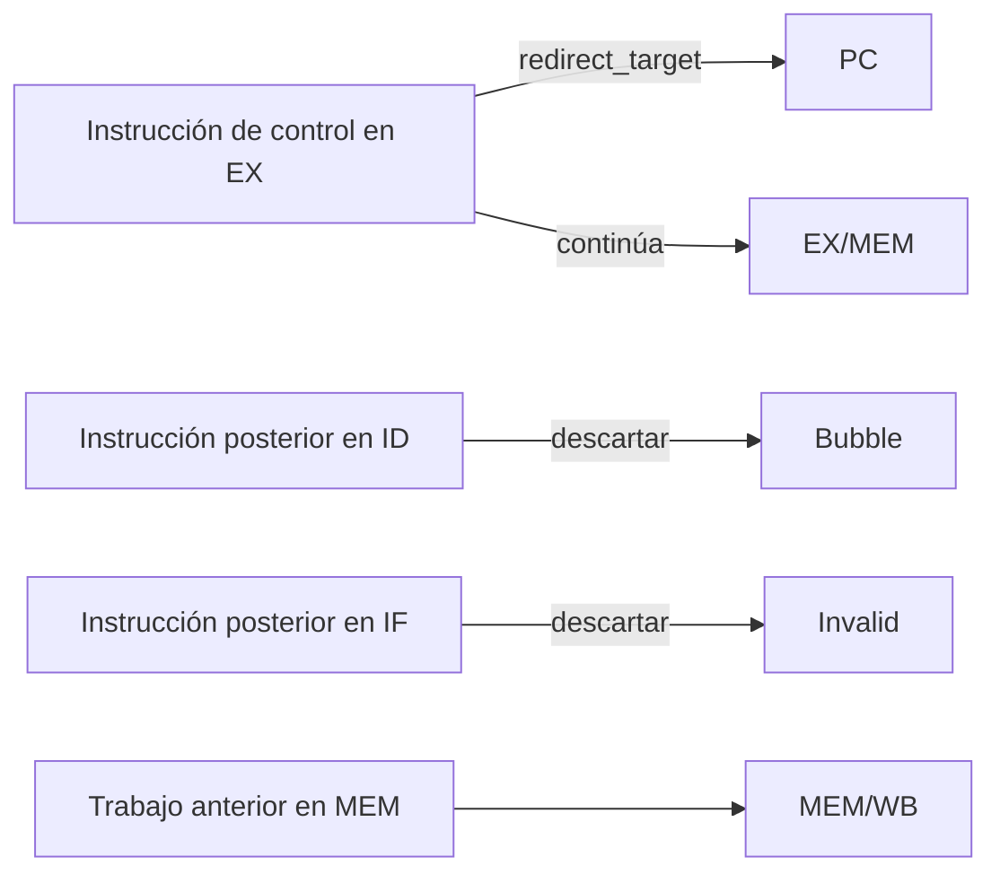
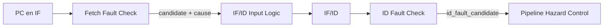
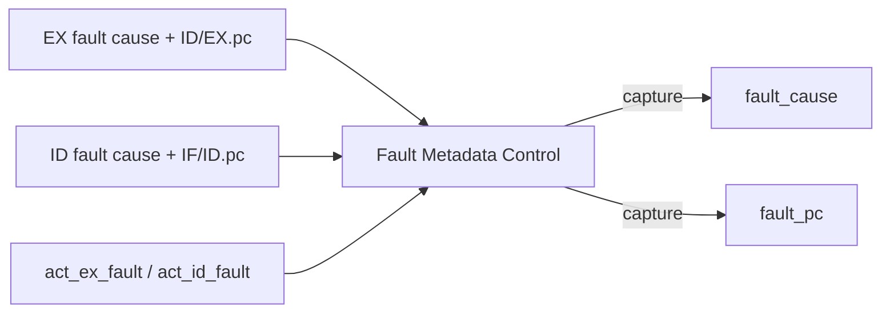

# Faults, redirects y terminación

## Función de este mecanismo

El pipeline puede tener varias instrucciones activas al mismo tiempo, pero sus efectos siguen el orden del programa. Esa propiedad se vuelve especialmente importante cuando una instrucción cambia el flujo, termina la ejecución o encuentra una condición inválida.

La arquitectura distingue tres situaciones:

- un **redirect** cambia el camino de ejecución y descarta las instrucciones posteriores a la que lo provoca, pertenecientes al camino abandonado;
- `halt` solicita la **terminación normal** del programa;
- un **fault** provoca una **terminación por error** y conserva información sobre la operación que falló.

En los dos casos de terminación, las instrucciones anteriores a la que provoca `halt` o fault pueden terminar su ejecución. La instrucción que provoca un fault y todas las posteriores se descartan antes de producir sus efectos normales. En `halt`, la propia instrucción se consume en EX y tampoco continúa hacia MEM.

Esto permite que el estado final represente una ejecución precisa: refleja los efectos de las instrucciones anteriores a la que provoca `halt` o fault.

<a id="detección-candidatura-y-confirmación"></a>

## Detección, candidato y confirmación

Encontrar una condición problemática no basta para modificar inmediatamente el estado de ejecución.

Una instrucción más antigua todavía puede resolver un redirect, un fault o `halt` y descartar el trabajo donde apareció esa detección. Por esta razón, la arquitectura separa:

```text
detección
    ↓
candidato
    ↓
arbitraje según el orden del programa
    ↓
confirmación
    ↓
aplicación del redirect o inicio de la terminación
```

Un **candidato** es información combinacional —o, en el caso del fetch, información transportada mediante IF/ID— que todavía no produce por sí sola un efecto terminal.

La **confirmación** ocurre únicamente durante un ciclo efectivo de la CPU y cuando ningún evento de una instrucción anterior prevalece.

`Pipeline Hazard Control` realiza ese arbitraje. Las ecuaciones y la prioridad completa se desarrollan en [Control del pipeline y hazards](control_and_hazards.md).

<a id="edad-dentro-del-pipeline"></a>

## Orden de las instrucciones dentro del pipeline

En un ciclo determinado, las instrucciones que están en las etapas más avanzadas del pipeline son anteriores en el orden del programa a las que están en las primeras etapas:

```text
WB  >  MEM  >  EX  >  ID  >  IF
anterior                    posterior
```

Esta relación determina qué evento tiene prioridad y qué instrucciones se descartan al aplicarlo.

Por ejemplo, si EX presenta un redirect válido mientras ID contiene una instrucción ilegal, el redirect corresponde a una instrucción anterior. La instrucción ilegal pertenece al camino descartado y se elimina antes de confirmar su fault.

La prioridad entre eventos ordinarios queda:

```text
fault propio de EX
        ↓
halt en EX
        ↓
redirect en EX
        ↓
fault en ID
        ↓
load-use
        ↓
avance normal
```

La secuencia refleja el orden de las instrucciones que pueden originar esos eventos. Dentro de una misma instrucción de EX, su fault propio tiene prioridad sobre sus efectos normales.

# Redirect: cambiar el camino sin terminar la sesión

Branches tomados, `JAL` y `JALR` resuelven su destino en EX.

Cuando la instrucción solicita un cambio de flujo y su target es válido, `act_redirect`:

```text
PC       → redirect_target
IF/ID    → invalidar
ID/EX    → bubble
EX/MEM   → capturar la instrucción de EX
MEM/WB   → capturar MEM
```



El redirect no constituye una terminación. La sesión continúa desde el nuevo PC.

La instrucción que lo origina puede conservar efectos posteriores. `JAL` y `JALR`, por ejemplo, continúan hacia EX/MEM con `PC+4` como resultado de enlace.

Un candidato posterior desaparece si queda en el camino descartado. Esto incluye tanto instrucciones ordinarias como un posible candidato de fetch o incluso un `halt` que todavía no alcanzó su punto de confirmación.

El cálculo de targets se desarrolla en [Etapa EX](stage_ex.md); la actualización coordinada del pipeline se desarrolla en [Control del pipeline y hazards](control_and_hazards.md).

# Faults originados por fetch

## Detección en IF

IF comprueba que la búsqueda actual:

- esté alineada a cuatro bytes;
- pertenezca completamente a la capacidad de IMEM;
- pertenezca completamente a la imagen confirmada.

La [validación de fetch](memory_architecture.md#validación-de-fetch) comprueba toda la región con aritmética de 33 bits. La [alineación](memory_architecture.md#alineación) es independiente del rango: si ambas condiciones fallan para una búsqueda, se selecciona desalineación. `Fetch Fault Check` forma el candidato cuando falla cualquiera de esas condiciones.

IF produce:

```text
if_fetch_fault_candidate
if_fetch_fault_cause
```

pero **no existe confirmación arquitectónica directa desde IF**.

## Transporte mediante IF/ID

Durante un avance normal, un fetch que falló se representa en IF/ID como:

```text
valid             = 0
pc                = PC causante
instruction       = 0
fetch_fault_valid = 1
fetch_fault_cause = causa detectada
```

La ausencia de `valid` impide tratar esa entrada como una instrucción normal. `fetch_fault_valid` conserva, por separado, la existencia del candidato.



La etapa IF y la forma exacta del registro se desarrollan en [Etapa IF](stage_if.md).

## Confirmación en ID

Cuando ese candidato llega a ID:

```text
id_fetch_fault_candidate =
    !IF/ID.valid
    && IF/ID.fetch_fault_valid
```

ID utiliza:

```text
id_fault_cause = IF/ID.fetch_fault_cause
id_fault_pc    = IF/ID.pc
```

El candidato solo se confirma si no se confirma un fault o `halt` ni se aplica un redirect de la instrucción anterior situada en EX.

Confirmar el fault en ID permite respetar el orden de las instrucciones. Una búsqueda especulativa equivocada no termina la sesión si una instrucción anterior cambia el camino antes de que se confirme el candidato.

## Coincidencia con `load-use`

Un candidato recién detectado en IF puede coincidir con una dependencia `load-use` entre instrucciones anteriores.

En ese ciclo, el candidato todavía no está dentro de IF/ID. El stall conserva:

```text
PC    → HOLD
IF/ID → HOLD
```

y por lo tanto el candidato no se captura ni se confirma.

El comportamiento es:

| Ciclo | EX | ID | IF | Resultado |
|---|---|---|---|---|
| k | load productor | consumidor dependiente | candidato en P | `load-use`; PC e IF/ID retienen |
| k+1 | bubble | consumidor | candidato nuevamente en P | avance; consumidor→EX, candidato→IF/ID |
| k+2 | consumidor | candidato | búsqueda siguiente | EX se resuelve antes de una posible confirmación ID |

Como el PC se mantuvo, IF vuelve a detectar la misma condición en el ciclo siguiente. No hace falta un camino excepcional IF→control ni un registro adicional.

Si el consumidor que llega a EX redirige la ejecución o provoca un fault, ese evento descarta al candidato transportado en IF/ID. Si ningún evento de una instrucción anterior lo descarta, el candidato puede confirmarse en ID.

La interacción completa con el stall se desarrolla en [Control del pipeline y hazards](control_and_hazards.md).

# Instrucción ilegal

Una búsqueda correcta puede obtener una palabra cuya codificación no pertenece al subconjunto de instrucciones implementado.

`Decoder` produce:

```text
decode_legal = 0
```

y `ID Fault Check` forma:

```text
illegal_candidate =
    IF/ID.valid
    && !decode_legal
```

La condición `IF/ID.valid` es esencial. Una bubble puede conservar bits residuales en `instruction`, pero esos bits no representan una instrucción y no generan un fault.

La causa es:

```text
id_fault_cause = 3'b010
id_fault_pc    = IF/ID.pc
```

Si en EX no se confirma un fault o `halt` ni se aplica un redirect, se confirma en ID el fault de la instrucción ilegal.

En ese ciclo:

```text
IF/ID    → invalidar
ID/EX    → bubble
EX/MEM   → capturar la instrucción anterior de EX
MEM/WB   → capturar MEM
PC       → retener
```

La causante no entra válidamente a EX. Las instrucciones anteriores conservan su avance.

La whitelist y la decodificación exacta se desarrollan en [Etapa ID](stage_id.md#codificaciones-legales).

# Faults de loads y stores

## Dónde se detectan

Loads y stores forman su dirección efectiva en EX:

```text
effective_address =
    (rs1_effective + immediate) mod 2^32
```

La misma etapa conoce:

- la clase de acceso;
- su tamaño;
- la dirección completa;
- la capacidad de DMEM.

Por eso los faults de memoria se detectan en EX, antes de que la operación ingrese válidamente a MEM.

## Alineación

Las condiciones son:

```text
BYTE
    → cualquier dirección

HALFWORD
    → effective_address[0] == 0

WORD
    → effective_address[1:0] == 0
```

Un incumplimiento genera un candidato de desalineación correspondiente a load o store.

## Rango

La [validación de toda la región](memory_architecture.md#validación-de-toda-la-región) comprueba el extremo calculado sin signo de 33 bits contra la capacidad. El carry de la suma modular que produjo `effective_address` no es, por sí solo, una causa de fault.

## Resultado de un fault de load

Cuando se confirma el fault de un load en EX:

```text
EX/MEM.valid = 0 para la causante
```

Por lo tanto:

- no llega a MEM como load activo;
- no produce `load_value` arquitectónico;
- no alcanza WB como productor válido;
- no modifica `rd`, incluso si `rd=x0`.

## Resultado de un fault de store

Cuando se confirma el fault de un store:

```text
EX/MEM.valid = 0 para la causante
```

y no se habilita ninguna escritura de DMEM.

No existe una escritura parcial aunque una parte de la región estuviera dentro de rango. Ningún byte ni metadata de validez perteneciente a la causante cambia.

La arquitectura de DMEM y sus reglas de atomicidad se desarrollan en [Arquitectura de memoria](memory_architecture.md).

# Faults de destinos de control

## Qué targets se comprueban

La alineación del target se comprueba en EX únicamente cuando la instrucción solicita realmente un redirect:

```text
target_misaligned_candidate =
    redirect_requested
    && (redirect_target[1:0] != 2'b00)
```

Esto afecta a:

- BEQ tomado;
- BNE tomado;
- JAL;
- JALR.

Un branch no tomado no utiliza su target y no produce un fault por esa dirección.

## JALR

JALR forma:

```text
jalr_sum =
    (rs1_effective + immediate) mod 2^32

jalr_target =
    jalr_sum & 32'hFFFFFFFE
```

La alineación se comprueba **después** de limpiar el bit 0.

Si el bit 1 permanece activo:

```text
redirect_target[1:0] != 0
```

y aparece `instruction-address-misaligned`.

## Efecto del fault

Cuando el target falla:

- no se aplica el redirect;
- la instrucción causante no entra válida a EX/MEM;
- `JAL/JALR` no conservan un enlace escribible;
- las instrucciones posteriores se descartan;
- las anteriores de MEM y WB conservan sus efectos.

`fault_pc` identifica el PC de la instrucción de branch/jump, no el target inválido.

## Target alineado fuera de imagen

Un target alineado no se compara en EX contra el tamaño de la imagen.

Si apunta fuera de la imagen confirmada:

1. el redirect puede aplicarse;
2. `JAL/JALR` pueden conservar su enlace;
3. IF intenta buscar desde el nuevo PC;
4. IF detecta el eventual `instruction-access-fault`;
5. el candidato se transporta y puede confirmarse posteriormente en ID.

Son dos operaciones distintas:

```text
salto válido a target alineado
        ↓
fetch posterior inválido
```

El fault pertenece al fetch, no a la instrucción que produjo el target.

<a id="candidatura-de-ex"></a>

# Candidato de EX

Los faults de EX convergen en:

```text
load_misaligned_candidate
load_access_candidate
store_misaligned_candidate
store_access_candidate
target_misaligned_candidate
```

y forman:

```text
ex_fault_candidate =
    target_misaligned_candidate
    || load_misaligned_candidate
    || load_access_candidate
    || store_misaligned_candidate
    || store_access_candidate
```

Los candidatos de memoria incluyen `ID/EX.valid` y la clase de operación correspondiente.

Para una misma operación de memoria:

```text
misalignment > access fault
```

Las clases legales de instrucción impiden que una misma instrucción sea simultáneamente una operación de memoria y una operación de redirect.

El detalle de `EX Flow Check` se desarrolla en [Etapa EX](stage_ex.md).

# `halt` y terminación normal

## Detección y recorrido

La única codificación válida es:

```text
0x0000000B
```

ID la reconoce como `halt`, pero ese reconocimiento no termina la ejecución.

La instrucción continúa hasta EX, donde:

```text
ex_halt_candidate =
    ID/EX.valid
    && (ID/EX.flow_op == HALT)
```

Este punto de confirmación evita que un `halt` posterior, perteneciente a un camino incorrecto, termine la sesión.

Por ejemplo:

```text
EX  → branch tomado
ID  → halt
```

El redirect anterior descarta el `halt` antes de que alcance EX.

## Confirmación

`halt` se confirma solamente si:

- existe ciclo efectivo de la CPU;
- no se ha confirmado previamente `halt` o un fault;
- la propia instrucción no presenta un fault de EX.

La prioridad local es:

```text
fault propio de EX
    ↓
halt
    ↓
redirect
```

Cuando se confirma `halt`:

```text
PC       → retener
IF/ID    → invalidar
ID/EX    → bubble
EX/MEM   → invalidar
MEM/WB   → capturar MEM
```

La instrucción `halt` se consume en EX. No llega válida a MEM ni WB y no produce un efecto sobre registros o memoria.

Las instrucciones anteriores que todavía ocupan MEM o WB continúan hasta terminar su ejecución.

# Referencia de causas

La arquitectura utiliza siete causas:

| `fault_cause[2:0]` | Causa | Detección | `fault_pc` |
|---|---|---|---|
| `000` | `instruction-address-misaligned` | IF para fetch o EX para target tomado | PC del fetch, o PC del branch/jump causante |
| `001` | `instruction-access-fault` | IF | PC del fetch |
| `010` | `illegal-instruction` | ID | PC de la instrucción |
| `100` | `load-address-misaligned` | EX | PC del load |
| `101` | `load-access-fault` | EX | PC del load |
| `110` | `store-address-misaligned` | EX | PC del store |
| `111` | `store-access-fault` | EX | PC del store |

El código:

```text
011
```

permanece reservado.

No existe un código `NONE`. La validez de `fault_cause` se deriva del estado terminal de fault.

`fault_pc` siempre identifica la operación causante:

- para load/store contiene el PC de la instrucción, no la dirección de datos;
- para target desalineado contiene el PC del branch/jump, no el target;
- para fetch contiene la dirección de la búsqueda fallida.

<a id="confirmación-y-prioridad-por-edad"></a>

# Confirmación y prioridad según el orden del programa

Las confirmaciones principales son:

```text
ex_fault_confirm =
    cpu_cycle_fire
    && terminal_none
    && ex_fault_candidate

halt_confirm =
    cpu_cycle_fire
    && terminal_none
    && !ex_fault_candidate
    && ex_halt_candidate

redirect_apply =
    cpu_cycle_fire
    && terminal_none
    && !ex_fault_candidate
    && !ex_halt_candidate
    && redirect_requested
```

Confirmar un fault o `halt`, o aplicar un redirect en EX, bloquea la confirmación del candidato de la instrucción posterior situada en ID:

```text
ex_frontier_selected =
    ex_fault_confirm
    || halt_confirm
    || redirect_apply

id_fault_confirm =
    cpu_cycle_fire
    && terminal_none
    && !ex_frontier_selected
    && id_fault_candidate
```

La confirmación total de fault es:

```text
fault_confirm =
    ex_fault_confirm
    || id_fault_confirm
```

Estas ecuaciones se integran con las ocho acciones en [Control del pipeline y hazards](control_and_hazards.md).

## Ejemplos de prioridad

### Fault EX frente a fault ID

```text
EX → load misaligned
ID → instrucción ilegal
```

El fault de EX corresponde a la instrucción anterior y se confirma. La instrucción ilegal se descarta.

### Redirect EX frente a fault ID

```text
EX → branch tomado válido
ID → candidato de fault
```

El redirect se aplica y el candidato de ID pertenece al camino abandonado.

### Fault ID con EX normal

```text
EX → instrucción ordinaria válida
ID → instrucción ilegal
```

La instrucción de EX continúa hacia EX/MEM y el fault de ID se confirma.

### Fault EX frente a `halt`

Una instrucción en EX que presenta un fault propio no puede terminar normalmente como `halt` ni aplicar otro efecto nominal. El fault propio prevalece.

# Metadata persistente del fault

## Por qué se conserva globalmente

Una vez confirmado un fault, todavía pueden quedar instrucciones anteriores por completar.

El pipeline puede necesitar varios ciclos de drenado antes de alcanzar el estado `FAULT`, pero la causa del problema ya quedó determinada. Esa información se conserva en dos registros globales:

```text
fault_cause[2:0]
fault_pc[31:0]
```

No forman parte de los registros interetapa.

## Captura

La habilitación es:

```text
fault_capture_fire =
    fault_confirm
```

equivalentemente:

```text
fault_capture_fire =
    act_ex_fault
    || act_id_fault
```

Si el fault se confirma en EX:

```text
fault_cause ← ex_fault_cause
fault_pc    ← ID/EX.pc
```

Si el fault se confirma en ID:

```text
fault_cause ← id_fault_cause
fault_pc    ← IF/ID.pc
```

Sin `fault_capture_fire`, ambos registros conservan su contenido.



## Validez de la metadata

La información representa un fault actual únicamente durante:

```text
FAULT_DRAIN_AUTO
FAULT_DRAIN_STEP
FAULT
```

Fuera de esos estados, los bits pueden conservar contenido residual sin significado de fault activo.

Una nueva sesión cambia esa interpretación mediante el estado global. No es necesario utilizar el borrado físico de `fault_cause` y `fault_pc` como mecanismo de validez.

La exposición externa de esta información se desarrolla en [Arquitectura de Debug](debug_architecture.md).

<a id="efectos-que-sobreviven-a-una-frontera"></a>

# Efectos de las instrucciones anteriores a `halt` o fault

Confirmar `halt` o el fault de una instrucción posterior no revierte los efectos de las instrucciones anteriores que ya hicieron commit.

Durante el mismo ciclo en que se confirma un fault o `halt` pueden ocurrir:

```text
rf_write_fire = 1
```

para una instrucción anterior en WB, o:

```text
dmem_store_fire = 1
```

para un store anterior en MEM.

Esto es correcto porque ambas instrucciones son anteriores a la que provoca `halt` o fault.

En cambio, la causante queda invalidada antes de alcanzar el punto donde produciría su efecto:

```text
fault en ID
    → no entra válida a EX

fault en EX
    → no entra válida a MEM
```

Así se preserva la precisión sin necesitar rollback.

Los puntos de commit se desarrollan en [Etapa MEM](stage_mem.md) y [Etapa WB](stage_wb.md).

<a id="drenado-después-de-una-frontera-terminal"></a>

# Drenado después de confirmar `halt` o fault

<a id="frontera-y-estado-terminal-no-son-el-mismo-momento"></a>

## Confirmar la terminación y alcanzar el estado terminal ocurren en momentos distintos

Confirmar `halt` o fault deja de admitir instrucciones nuevas y descarta las que no deben continuar. La sesión solo alcanza `FINISHED` o `FAULT` cuando las instrucciones anteriores que permanecen en el pipeline terminan su ejecución.

Si existe trabajo anterior, el procesador entra en un estado de drenado:

```text
halt
    → HALT_DRAIN_AUTO
      o HALT_DRAIN_STEP

fault
    → FAULT_DRAIN_AUTO
      o FAULT_DRAIN_STEP
```

La elección AUTO/STEP depende del origen de ejecución y pertenece a [Control de ejecución y sesión](execution_control.md).

## Estado del pipeline después de confirmar

Confirmar `halt` o fault deja:

```text
IF/ID.valid             = 0
IF/ID.fetch_fault_valid = 0
ID/EX.valid             = 0
```

Por lo tanto, en una ejecución legal:

```text
load_use_stall = 0
```

durante el drenado.

Solo pueden permanecer instrucciones anteriores en:

```text
EX/MEM
MEM/WB
```

Cada ciclo autorizado aplica `act_drain_advance` y desplaza ese trabajo hacia el final.

## Drenado AUTO y STEP

En modo AUTO, los ciclos de drenado se autorizan automáticamente.

En modo STEP, cada ciclo de drenado necesita una nueva orden STEP. Esperar esa orden mantiene el pipeline en HOLD sin modificar la metadata ni repetir los efectos que ya hicieron commit.

Esta diferencia modifica el ritmo del vaciado, pero se dejan terminar las mismas instrucciones anteriores.

## Detección de pipeline vacío

El control global calcula [pipeline_empty_next](execution_control.md#pipeline-vacío) con los cuatro `valid` posteriores al flanco. `fetch_fault_valid` no participa: confirmar `halt` o fault también invalida ese candidato. Los datos residuales no representan trabajo pendiente.

Si el pipeline queda vacío en el mismo flanco en que se confirma `halt` o fault, la FSM puede alcanzar directamente:

```text
FINISHED
```

para `halt`, o:

```text
FAULT
```

para un fault, sin introducir un ciclo vacío adicional.

La FSM y sus transiciones se desarrollan en [Control de ejecución y sesión](execution_control.md).

# Finalización normal y excepcional

La terminación normal y la terminación por fault dejan de admitir trabajo nuevo y drenan las instrucciones anteriores, pero conservan estados distintos.

```text
halt confirmado
    ↓
drenado de anteriores
    ↓
FINISHED
```

```text
fault confirmado
    ↓
drenado de anteriores
    ↓
FAULT
```

`FINISHED` representa la finalización solicitada por el programa mediante `halt`.

`FAULT` representa una terminación causada por una de las siete condiciones de error y mantiene disponible `fault_cause`/`fault_pc`.

Una sesión nueva puede reutilizar la imagen ya cargada mediante el flujo de preparación definido por el control global. No se reanudan las instrucciones de la sesión terminal anterior.

La representación externa de estos estados y los comandos adicionales de recuperación pertenecen a [Arquitectura de Debug](debug_architecture.md) y a las decisiones de protocolo todavía abiertas.

# Invariantes principales

El mecanismo de faults y terminación conserva las siguientes propiedades:

- IF detecta faults de fetch, pero la confirmación ocurre en ID;
- un candidato no modifica por sí solo el estado terminal;
- confirmar un fault o `halt`, o aplicar un redirect en EX, tiene prioridad sobre confirmar un candidato en ID;
- un branch no tomado no valida ni falla por su target;
- un target alineado fuera de imagen produce, si corresponde, un fault de fetch posterior;
- la desalineación prevalece sobre access fault dentro del mismo acceso;
- una instrucción causante de fault produce cero efectos normales;
- un fault de store no modifica parcialmente DMEM;
- un fault de load no produce writeback;
- un fault de JAL/JALR no aplica redirect ni escribe el enlace;
- `halt` solo se confirma después de alcanzar EX;
- las instrucciones anteriores pueden hacer commit en el mismo ciclo en que se confirma el fault o `halt` de una instrucción posterior;
- `fault_cause` y `fault_pc` se capturan una sola vez por sesión terminada por fault;
- durante un drenado legal solo sobreviven instrucciones anteriores en EX/MEM y MEM/WB;
- alcanzar `FINISHED` o `FAULT` no requiere un ciclo vacío adicional si `pipeline_empty_next` ya es verdadero.

Las propiedades generales de seguridad se consolidan en [Invariantes arquitectónicos](architectural_invariants.md).

## Trazabilidad

- [Pipeline CPU](cpu_pipeline.md): orden de las instrucciones, validez, registros interetapa y drenado.
- [Etapa IF](stage_if.md): detección y transporte de candidatos de fetch.
- [Etapa ID](stage_id.md): instrucción ilegal y confirmación de candidatos transportados.
- [Etapa EX](stage_ex.md): faults de memoria, targets, redirects y candidato de `halt`.
- [Etapa MEM](stage_mem.md): efectos de stores anteriores.
- [Etapa WB](stage_wb.md): writebacks anteriores.
- [Control del pipeline y hazards](control_and_hazards.md): prioridad, confirmaciones y ocho acciones.
- [Arquitectura de memoria](memory_architecture.md): rango, alineación, atomicidad e imagen.
- [Control de ejecución y sesión](execution_control.md): FSM terminal, drenado AUTO/STEP y nuevas sesiones.
- [Arquitectura de Debug](debug_architecture.md): observabilidad de estado y metadata.
- [Invariantes arquitectónicos](architectural_invariants.md): propiedades de seguridad y cobertura.
