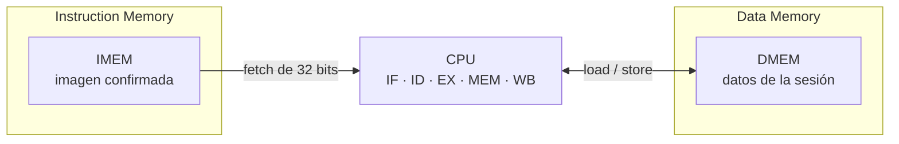
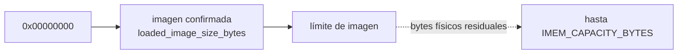
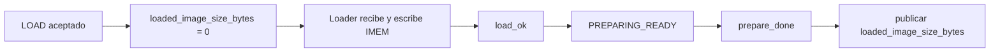
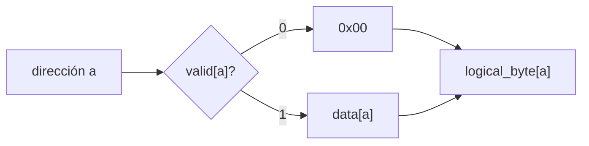
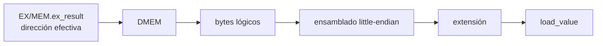

# Arquitectura de memoria

## Función de las memorias dentro del procesador

La CPU trabaja con dos espacios de memoria lógicamente independientes:

- **IMEM** contiene la imagen de instrucciones que IF puede buscar.
- **DMEM** contiene los datos sobre los que operan loads y stores.

Ambas memorias comienzan en la dirección `0x00000000`, pero pertenecen a espacios diferentes. Una dirección numérica como `0x00000010` identifica, por lo tanto, una posición de IMEM y otra distinta de DMEM.

La separación permite que IF busque una instrucción mientras MEM accede a datos durante el mismo ciclo de la CPU. No aparece un hazard estructural entre ambos accesos porque no compiten por un único espacio lógico.



Las dos memorias son **byte-addressed**: PC y direcciones efectivas se expresan siempre en bytes. La diferencia entre una instrucción de 32 bits y un acceso `byte`, `halfword` o `word` se resuelve determinando cuántos bytes consecutivos forman cada operación.

## Dos memorias con responsabilidades diferentes

Aunque IMEM y DMEM comparten el direccionamiento por bytes, su estado arquitectónico no se interpreta de la misma manera.

En IMEM importa distinguir qué parte del almacenamiento pertenece realmente al programa cargado. Por eso existe una **imagen confirmada** cuyo tamaño delimita los fetches ejecutables.

En DMEM importa distinguir qué bytes fueron escritos durante la sesión actual. Un byte que todavía no recibió una escritura se observa como cero, aunque el almacenamiento físico conserve residuos de una ejecución anterior.

Estas dos reglas evitan que el procesador confunda contenido físico residual con estado válido de la sesión:

```text
IMEM
contenido ejecutable
    = bytes pertenecientes a la imagen confirmada

DMEM
contenido observable
    = bytes escritos en la sesión actual
      + cero lógico para el resto
```

# Instruction Memory

## Imagen ejecutable

El contenido ejecutable de IMEM forma un único prefijo contiguo que comienza en:

```text
0x00000000
```

La imagen confirmada presenta estas propiedades:

- no es vacía;
- comienza en cero;
- no contiene huecos;
- su tamaño es múltiplo de cuatro;
- no supera `IMEM_CAPACITY_BYTES`.

La arquitectura no utiliza un bitmap de instrucciones válidas ni varias regiones ejecutables separadas. Tampoco existe un entry point configurable: una sesión preparada comienza con:

```text
PC = 0x00000000
```



Los bytes posteriores al límite pueden contener datos de una carga anterior. No forman parte del programa actual y no se ejecutan por el solo hecho de contener una codificación válida.

## Estado persistente de la imagen

La información persistente que describe la imagen es:

```text
loaded_image_size_bytes
```

De ella se derivan:

```text
image_valid =
    (loaded_image_size_bytes != 0)

loaded_instruction_count =
    loaded_image_size_bytes / 4
```

El ancho del registro permite representar también una imagen que ocupe exactamente toda la capacidad:

```text
IMAGE_SIZE_WIDTH =
    max(1, ceil(log2(IMEM_CAPACITY_BYTES + 1)))
```

Los estados persistentes legales son `0` o un tamaño no vacío, múltiplo de cuatro y no mayor que `IMEM_CAPACITY_BYTES`.

El valor cero representa la ausencia de una imagen ejecutable confirmada.

## Carga y publicación de una imagen

El Loader escribe IMEM mientras recibe una nueva imagen, pero el progreso de esa carga permanece separado del estado público `loaded_image_size_bytes`.

Una nueva imagen se vuelve ejecutable únicamente después de completarse la carga y la preparación correspondiente.



`load_ok` indica que la recepción y validación privada de la carga terminaron correctamente, pero no publica por sí solo la imagen.

El commit ocurre con:

```text
PREPARING_READY
&& prepare_done
```

En ese momento el tamaño validado se convierte en `loaded_image_size_bytes`. Ese flanco publica la nueva imagen, pero no inicia un ciclo de la CPU.

Una carga vacía, parcial, truncada, discontinua, sobredimensionada o fallida no publica una imagen nueva. Una solicitud de LOAD rechazada conserva la imagen y la sesión vigentes.

RUN o STEP iniciados desde un estado terminal pueden reutilizar la imagen confirmada sin volver a cargarla.

La secuencia global de LOAD y preparación se desarrolla en [Control de ejecución y sesión](execution_control.md).

## Organización y fetch

IMEM se organiza conceptualmente como words de 32 bits.

Para un fetch válido:

```text
word_index = PC >> 2
```

El índice se utiliza únicamente después de establecer que el acceso pertenece a la región válida. El shift no redondea un PC inválido ni transforma una dirección fuera de rango en una posición aceptable.

Durante la carga, el Loader reconstruye una word completa antes de habilitar su escritura en IMEM.

En ejecución, IF utiliza cuatro bytes consecutivos:

```text
PC
PC + 1
PC + 2
PC + 3
```

Como el subconjunto implementado contiene únicamente instrucciones de 32 bits y no utiliza instrucciones comprimidas, un fetch válido comienza en una dirección alineada a cuatro bytes.

## Pertenecer a la imagen no implica ser una instrucción legal

IMEM determina si los cuatro bytes pertenecen a la imagen confirmada.

Una word ubicada correctamente dentro de la imagen todavía puede contener una codificación no admitida por el procesador.

Las comprobaciones quedan separadas:

```text
IF
    → ¿pueden buscarse estos cuatro bytes?

ID
    → ¿la word corresponde a una instrucción implementada?
```

La primera puede producir un candidato de fetch fault. La segunda puede producir `illegal-instruction`.

La separación completa se desarrolla en [Faults, redirects y terminación](faults_and_termination.md).

# Data Memory

## Estado de datos de una sesión

DMEM conserva los bytes escritos por el programa durante la sesión actual.

Al comenzar una sesión nueva, el procesador observa:

```text
0x00
```

en cualquier byte que todavía no haya sido escrito, independientemente de lo que permanezca físicamente almacenado.

Esta propiedad se denomina **cero lógico**.

No requiere que toda la memoria de datos se borre físicamente en un único flanco. Lo que importa arquitectónicamente es que una lectura no pueda distinguir un residuo viejo de un byte físicamente inicializado en cero.

## Validez por byte

La implementación de referencia asocia una validez independiente a cada byte:

```text
VALID_BIT_COUNT =
    DMEM_CAPACITY_BYTES

logical_byte[a] =
    valid[a]
        ? data[a]
        : 8'h00
```

Por lo tanto:

```text
valid[a] = 0
    → el byte se observa como 0x00

valid[a] = 1
    → el byte se observa con data[a]
```

La granularidad es por **byte**, no por word.

Esto resulta necesario porque un `SB` puede escribir una única posición sin convertir automáticamente en válidos los otros tres bytes de la word lógica.



La preparación de sesión establece el estado necesario para que esta semántica ya sea correcta antes de autorizar RUN o STEP.

## Organización little-endian

Los valores multibyte utilizan orden **little-endian**.

Para una word:

```text
0x12345678
```

almacenada desde una dirección `A`:

| Dirección | Byte |
|---|---:|
| `A + 0` | `0x78` |
| `A + 1` | `0x56` |
| `A + 2` | `0x34` |
| `A + 3` | `0x12` |

El byte situado en la dirección menor ocupa los bits menos significativos del valor.

DMEM puede verse conceptualmente como cuatro lanes de bytes:

```text
dirección creciente →

+0        +1        +2        +3
┌────────┬────────┬────────┬────────┐
│ byte 0 │ byte 1 │ byte 2 │ byte 3 │
└────────┴────────┴────────┴────────┘
 bits       bits       bits       bits
  7:0       15:8       23:16      31:24
```

Para cada byte de un acceso validado:

```text
bank_i =
    byte_address_i[1:0]

row_i =
    byte_address_i >> 2
```

Esta organización es conceptual. No implica que la implementación física utilice obligatoriamente cuatro bloques RAM independientes.

IMEM conserva el mismo orden arquitectónico de bytes. Este endianness no determina el orden de serialización del protocolo UART.

# Recorridos de acceso a DMEM

## Loads

Un load llega a MEM después de que EX haya calculado y validado su dirección efectiva.

En MEM:



Según la operación:

| Instrucción | Bytes leídos | Resultado |
|---|---:|---|
| `LB` | 1 | extensión con signo |
| `LBU` | 1 | extensión con cero |
| `LH` | 2 | ensamblado + extensión con signo |
| `LHU` | 2 | ensamblado + extensión con cero |
| `LW` | 4 | word completa |

Cada byte se filtra primero mediante su validez lógica y luego participa del ensamblado.

Por ejemplo, en una sesión inicialmente limpia, después de escribir únicamente `0xff` en la dirección 1:

```text
dirección 0 → 0x00
dirección 1 → 0xff
dirección 2 → 0x00
dirección 3 → 0x00
```

un `LW` desde la dirección 0 produce:

```text
0x0000ff00
```

El recorrido detallado de la etapa se encuentra en [Etapa MEM](stage_mem.md).

## Stores

Un store llega a MEM con:

```text
EX/MEM.ex_result
    = dirección efectiva

EX/MEM.store_data
    = dato ya resuelto mediante forwarding
```

Según la instrucción:

```text
SB
    → usa store_data[7:0]

SH
    → usa store_data[15:0]

SW
    → usa store_data[31:0]
```

Un store válido actualiza solamente los bytes seleccionados.

Para cada uno de ellos se modifican conjuntamente:

```text
data[byte]
valid[byte]
```

Los bytes no seleccionados conservan tanto el dato como la validez que tenían antes del flanco.

La escritura es atómica respecto del acceso: o se actualizan todos los bytes que pertenecen al store válido, o ninguno.

# Formación y validación de direcciones

## Dirección efectiva de loads y stores

EX calcula la dirección efectiva mediante aritmética RV32 normal:

```text
effective_address =
    (rs1_effective + ID/EX.immediate)
    mod 2^32
```

`rs1_effective` ya incorpora el forwarding correspondiente.

La suma anterior puede producir carry y envolver el espacio de 32 bits. Ese carry no constituye por sí mismo un fault.

Por ejemplo:

```text
rs1_effective = 0xffffffff
immediate     = 1

effective_address = 0x00000000
```

La dirección resultante puede ser válida.

## Validación de toda la región

Después de formar la dirección efectiva se comprueba que **todo el acceso** pertenezca a DMEM.

El tamaño `N` es:

```text
N = 1  → byte
N = 2  → halfword
N = 4  → word
```

La condición utiliza aritmética ensanchada:

```text
dmem_range_valid =
    ({1'b0, effective_address} + N)
    <= DMEM_CAPACITY_BYTES
```

El cálculo del extremo de la región y la comparación utilizan aritmética sin signo de 33 bits.

Esta segunda operación no se reduce módulo `2^32`. De ese modo, una región que atraviesa el límite superior no reaparece artificialmente como una dirección baja.

```text
effective_address = 0xffffffff
N                 = 4

extremo = 2^32 + 3
```

Ese acceso no se interpreta como una región que continúa desde `0x00000000`.

## Validación de fetch

Un fetch ocupa siempre cuatro bytes y agrega una condición adicional: la región pertenece tanto a la capacidad configurada como a la imagen confirmada.

```text
if_fetch_range_valid =
    image_valid
    && ({1'b0, PC} + 33'd4 <= IMEM_CAPACITY_BYTES)
    && ({1'b0, PC} + 33'd4 <= loaded_image_size_bytes)
```

Por ejemplo, con una imagen confirmada de ocho bytes:

```text
PC = 0
    → fetch válido por región

PC = 4
    → fetch válido por región

PC = 8
    → fuera de imagen
```

aunque IMEM tenga una capacidad física mayor.

## Casos de borde

| Caso | Resultado |
|---|---|
| Base `0xffffffff` + inmediato `1`, word | EA=`0`; el carry inicial no genera fault |
| EA=`0xfffffffc`, N=`4` | extremo=`2^32`; válido por región solo si la capacidad arquitectónica alcanza `2^32` |
| EA=`0xffffffff`, N=`4` | extremo=`2^32+3`; nunca hace alias con direcciones bajas |
| `ALT_1000`, word desde `996` | última word alineada dentro de rango |
| `ALT_1000`, word desde `1000` | access fault |
| imagen de 8 bytes, `PC=8` | fetch fuera de imagen aunque IMEM tenga espacio |

# Alineación

La validación de región no reemplaza la comprobación de alineación.

Las reglas son:

| Acceso | Condición |
|---|---|
| `LB`, `LBU`, `SB` | sin restricción adicional |
| `LH`, `LHU`, `SH` | `address[0] = 0` |
| `LW`, `SW` | `address[1:0] = 00` |
| fetch | `PC[1:0] = 00` |

La arquitectura no reconstruye accesos multibyte desalineados mediante dos operaciones internas ni los redondea hacia una dirección alineada.

Si una misma operación incumple alineación y rango:

```text
misalignment
    >
access fault
```

Esa prioridad corresponde únicamente a las causas de la misma operación. Entre instrucciones distintas, tienen prioridad las que aparecen antes en el programa.

Loads y stores se validan en EX antes de ingresar a EX/MEM como entradas válidas. Una operación que falla no llega a producir un acceso parcial en MEM.

Los fetch faults siguen otro recorrido: IF detecta, IF/ID transporta y ID confirma.

La semántica completa de esas causas se desarrolla en [Faults, redirects y terminación](faults_and_termination.md).

# Temporización de las memorias

## Lecturas combinacionales

IMEM y DMEM presentan lectura combinacional.

Esto permite que:

```text
IF
    → obtenga instruction
      durante su etapa

MEM
    → obtenga load_value
      durante su etapa
```

sin introducir una etapa adicional ni un handshake de memoria.

No existe latencia variable ni un stall específico originado por las memorias arquitectónicas.

## Escrituras síncronas

Los cambios de estado ocurren en el flanco funcional autorizado:

```text
Loader
    → escritura de IMEM

CPU store
    → escritura de DMEM
```

Los datos y controles consumidos para esos efectos corresponden al estado anterior al flanco.

## Acceso simultáneo de CPU

La independencia Harvard permite en un mismo ciclo:

```text
IF  → lectura de IMEM

MEM → lectura o escritura de DMEM
```

La CPU genera como máximo una solicitud por memoria y por ciclo.

No existe un structural hazard IF/MEM.

# Ownership de las memorias

Además de la CPU, otros bloques utilizan las memorias en momentos específicos.

| Memoria | Agentes conceptuales | Relación |
|---|---|---|
| IMEM | CPU / Loader | Loader escribe durante carga; CPU busca durante ejecución |
| DMEM | CPU / Debug | CPU accede durante ejecución; Debug puede leer directamente cuando la CPU no ejecuta ciclos |
| DMEM | Session Preparation | establece el estado lógico inicial antes de ejecutar |

Dentro de una misma memoria existe como máximo un agente autorizado para una operación incompatible en un momento dado.

El contrato arquitectónico fija esa exclusión, pero no asigna nombres concretos a grants, muxes de ownership o puertos físicos.

Una colisión prohibida entre agentes representa una violación interna de la implementación, no un nuevo fault del programa ejecutado.

La captura y observación externa de memoria se desarrollan en [Arquitectura de Debug](debug_architecture.md).

<a id="compromiso-de-stores-y-loads"></a>

# Commit de stores y loads

## Store

Un store produce su efecto arquitectónico en MEM mediante [dmem_store_fire](stage_mem.md#dmem-write-control), que exige ciclo efectivo, EX/MEM válido y operación store.

La actualización de la metadata utiliza la misma condición:

```text
dmem_metadata_write_fire =
    dmem_store_fire
```

La dirección, el dato y el tipo de store son los valores anteriores al flanco de EX/MEM.

Un store anterior puede hacer commit en el mismo ciclo en que se confirma el fault o `halt` de una instrucción posterior.

Durante HOLD:

```text
cpu_cycle_fire = 0
```

y el store retenido no repite la escritura.

## Load

La lectura de DMEM es combinacional y no constituye por sí misma un commit arquitectónico.

El load produce `load_value` en MEM, lo captura posteriormente en MEM/WB y modifica el Register File únicamente cuando alcanza un writeback válido.

Por eso:

```text
leer DMEM
    ≠
escribir RF
```

y no existe un bypass directo:

```text
DMEM → EX
```

La interacción temporal entre load, MEM/WB y forwarding se desarrolla en [Control del pipeline y hazards](control_and_hazards.md).

# Preparación de una nueva sesión

RESET o una nueva carga no dependen de borrar físicamente todos los bits de IMEM o DMEM en un único flanco.

En IMEM, la validez del programa se controla mediante `loaded_image_size_bytes`. Invalidar ese tamaño evita ejecutar contenido residual.

En DMEM, la preparación establece el cero lógico de la nueva sesión. La implementación de referencia puede limpiar la metadata de validez durante varios ciclos.

```text
preparación de sesión
        ↓
IMEM
    imagen confirmada coherente

DMEM
    cero lógico coherente
        ↓
prepare_done
```

`prepare_done` representa que la sesión ya puede observar el estado inicial arquitectónico esperado.

El mecanismo interno que realiza esta preparación puede ser secuencial o paralelo; la arquitectura fija el estado observable al finalizar, no una cantidad concreta de bits procesados por ciclo.

La FSM que coordina esta fase se desarrolla en [Control de ejecución y sesión](execution_control.md).

# Capacidades y parametrización

La capacidad en bytes determina los límites de cada memoria:

```text
4 <= CAPACITY_BYTES <= 2^32

CAPACITY_BYTES % 4 == 0

WORD_COUNT =
    CAPACITY_BYTES / 4
```

No existe un requisito de potencia de dos.

Los anchos derivados conservan al menos un bit:

```text
index_width =
    max(1, ceil(log2(element_count)))
```

Esto evita generar vectores de ancho cero en una configuración mínima.

La parametrización conserva la semántica de rango explicada anteriormente: los bits bajos de una dirección nunca sustituyen una comparación completa contra la capacidad.

## Perfiles definidos

| Perfil | IMEM | DMEM | Alcance |
|---|---:|---:|---|
| `REFERENCE` | 1024 bytes | 2048 bytes | elaboración, simulación, síntesis, implementación y validación FPGA |
| `ALT_1000` | 1000 bytes | 1000 bytes | elaboración, simulación y smoke tests de parametrización |

`ALT_1000` verifica especialmente que el diseño no dependa de que las capacidades sean potencias de dos.

Esta tabla es la fuente común de capacidades de PC y FPGA. El [acuerdo de perfil compartido](../decisions.md#acuerdo-parcial-de-dec-proto-001--perfil-compartido-de-memoria-y-protocolo) fija REFERENCE por defecto y selección igual a priori en ambos extremos. Códigos/layout del protocolo se conservan entre perfiles, y límites/ventanas se derivan de sus capacidades; no se agrega negociación de perfil en UART.

Una configuración fuera del dominio arquitectónico se rechaza antes de ejecutar. Una configuración perteneciente al dominio pero no soportada por una realización concreta se distingue mediante un error de configuración, sin convertirla en un fault producido por el programa.

# Implementación de referencia y contrato arquitectónico

La implementación inicial utiliza RTL sintetizable e inferible.

La arquitectura no depende de que la herramienta sintetice una tecnología particular de RAM ni de que los cuatro lanes conceptuales de DMEM aparezcan como cuatro bloques físicos separados.

Cualquier realización conserva funcionalmente:

- lectura combinacional;
- escritura síncrona;
- byte addressing;
- little-endian;
- validación de región completa;
- aislamiento lógico entre IMEM y DMEM;
- cero lógico de DMEM;
- granularidad observable por byte;
- atomicidad de stores;
- ownership compatible con carga, ejecución, preparación y Debug.

El bitmap de validez por byte es la realización de referencia del cero lógico. Otras representaciones internas pueden producir el mismo comportamiento observable.

# Límite con Debug y protocolo

La arquitectura de memoria determina qué valores existen y cuándo son válidos, pero no termina de definir cómo se representan externamente.

En particular, permanecen separados:

```text
validez interna por byte de DMEM
```

y:

```text
criterio externo de "memoria utilizada"
```

El [acuerdo de memoria utilizada](../decisions.md#acuerdo-parcial-de-dec-sys-005--memoria-utilizada-como-bytes-escritos-en-la-sesión) selecciona explícitamente los bytes escritos por stores comprometidos del programa en la sesión actual, incluidos valores cero, como lista única ordenada de dirección/valor actual. Lecturas y preparación no incorporan entradas. La metadata de validez de referencia puede reutilizarse para ese criterio, sin exigir un segundo bitmap. La representación binaria externa queda aprobada con cantidad unsigned de cinco bytes little-endian y entradas de dirección de cuatro bytes little-endian/valor de uno; cantidad cero sin entradas. Véase [DEC-SYS-005](../decisions.md#dec-sys-005--criterio-de-memoria-de-datos-utilizada), cerrada. Recorrido y captura se definirán en D06; el criterio no se deduce únicamente de la existencia de la metadata.

Tampoco el orden little-endian arquitectónico determina automáticamente el orden de bytes del protocolo UART.

Esas decisiones se desarrollan en [Arquitectura de Debug](debug_architecture.md) y en las decisiones pendientes de protocolo.

# Invariantes principales

La arquitectura de memoria conserva las siguientes propiedades:

- IMEM y DMEM representan espacios lógicos independientes;
- todas las direcciones arquitectónicas están expresadas en bytes;
- la CPU puede buscar instrucciones y acceder a datos en el mismo ciclo;
- únicamente el prefijo delimitado por `loaded_image_size_bytes` pertenece a la imagen ejecutable;
- bytes residuales posteriores a una imagen corta no pueden ejecutarse;
- todo byte de DMEM no escrito en la sesión actual se observa como cero;
- stores parciales modifican únicamente sus bytes seleccionados;
- los valores multibyte usan little-endian;
- el carry de la suma que forma una dirección efectiva no constituye un fault;
- el extremo completo de cada región se valida antes de indexar;
- una dirección fuera de rango no hace alias mediante truncamiento;
- los accesos multibyte utilizan alineación natural;
- un acceso fallido no produce efectos parciales;
- un store retenido durante HOLD no repite su escritura;
- una lectura de DMEM no produce por sí sola un commit en el Register File;
- una nueva sesión no observa residuos de la sesión anterior como datos válidos.

Las propiedades generales de seguridad se consolidan en [Invariantes arquitectónicos](architectural_invariants.md).

## Trazabilidad

- [Visión del sistema](system_overview.md): posición de IMEM y DMEM dentro del sistema.
- [Etapa IF](stage_if.md): uso de IMEM y detección de fetch faults.
- [Etapa EX](stage_ex.md): formación y validación de direcciones efectivas.
- [Etapa MEM](stage_mem.md): loads, stores, extensión y commit en DMEM.
- [Control del pipeline y hazards](control_and_hazards.md): load-use, forwarding y efectos anteriores.
- [Faults, redirects y terminación](faults_and_termination.md): alineación, access faults y precisión.
- [Control de ejecución y sesión](execution_control.md): Loader, preparación y publicación de imagen.
- [Arquitectura de Debug](debug_architecture.md): observación de DMEM y snapshot.
- [Invariantes arquitectónicos](architectural_invariants.md): propiedades de seguridad y parametrización.
