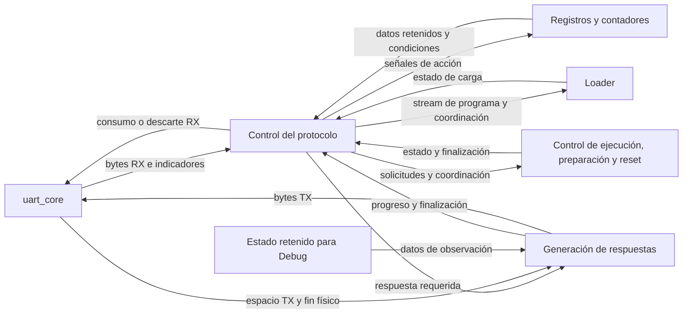

# Control del protocolo

## Función dentro del sistema

El control del protocolo interpreta los bytes entregados por [uart_core](uart_core.md) y coordina las operaciones LOAD, RUN, STEP, RESET y CHECK_READY dentro de la FPGA. Produce las respuestas definidas en [protocol.md](../protocol.md) y sigue su finalización física mediante tx_done_tick.

La [separación de responsabilidades](../decisions.md#acuerdo-parcial-de-dec-sys-007--organización-funcional-del-control-del-protocolo), la [agrupación en módulos](../decisions.md#acuerdo-parcial-de-dec-sys-007--módulos-del-control-del-protocolo-y-respuestas) y la comunicación de solicitud y finalización de respuestas están aprobadas. protocol_controller contiene interpretación y coordinación, y response_serializer contiene generación y seguimiento de respuestas. Las demás fronteras, las FSM privadas y los recursos concretos permanecen pendientes.

## Organización funcional

Se distinguen tres responsabilidades:

| Parte funcional | Responsabilidad |
|---|---|
| Control del protocolo | Interpretar solicitudes, determinar cuándo consumir o descartar RX y coordinar los servicios y sus respuestas. |
| Registros y contadores | Conservar código, tamaño, progreso y tiempos de espera; actualizarse mediante las señales de acción del control. |
| Generación de respuestas | Formar cabeceras, serializar Debug, conservar el byte pendiente cuando TX está llena y seguir el fin físico del envío. |

El diagrama representa responsabilidades e intercambios funcionales. Las flechas no fijan puertos físicos. Los controles de ejecución, preparación y reset conservan sus responsabilidades respectivas aunque se presenten juntos en el diagrama.

## Agrupación en módulos

Se utilizan dos módulos, cada uno con sus recursos internos:

| Módulo | Responsabilidad y recursos |
|---|---|
| `protocol_controller` | Interpreta solicitudes, consume o descarta RX y coordina las operaciones con Loader y control de ejecución. Contiene su FSM, registros y contadores. |
| `response_serializer` | Forma cabeceras, recorre Debug, entrega bytes a TX y sigue la finalización física de la respuesta. Contiene sus controles, registros y contadores. |

protocol_controller solicita una respuesta a [response_serializer](response_serializer.md). Este comunica cuándo termina el último byte, incluido Stop. Mientras el serializador espera espacio en TX, el controlador conserva la atención RX que corresponda a la fase.

El [contrato de comunicación](response_serializer.md#comunicación-con-el-controlador) utiliza response_start con el serializador libre y los campos response_opcode, response_result y response_with_debug estables en el flanco de aceptación. El serializador captura esos campos, mantiene response_busy hasta terminar físicamente el mensaje y comunica esa finalización mediante response_done_tick. El controlador conserva la coordinación y las respuestas pendientes hasta poder solicitarlas.

El controlador utiliza r_data, rx_empty e indicadores RX de uart_core y genera rd_uart. El serializador recibe tx_full y tx_done_tick y produce w_data y wr_uart. Así se distingue el consumo de RX de la producción de TX; el mecanismo interno y los controles que cumplirán esa independencia todavía deben diseñarse.

Cada FSM emite señales de acción y los recursos correspondientes realizan sus actualizaciones. La separación funcional entre control y acciones se mantiene dentro de ambos módulos. Loader, la FSM global CPU y preparación conservan sus responsabilidades existentes.

## Interpretación y coordinación

El control interpreta el código y los campos de cada solicitud conforme a su formato. Durante LOAD distingue la recepción del tamaño de la recepción del contenido; los bytes del programa se entregan al Loader y no se interpretan como nuevos comandos.

La fase de transporte determina si RX se procesa o se descarta. Durante recuperación por silencio y exclusión Debug, el control continúa retirando RX sin guardar comandos para después. Los errores y vencimientos mantienen las prioridades aprobadas en el protocolo.

Las solicitudes hacia el [control global de sesión](../interfaces.md#bloque-8-1) se coordinan con su aceptación y elegibilidad. La FSM global CPU conserva el control de la ejecución; la fase del transporte y los pendientes de respuesta pertenecen al control del protocolo. RUN puede continuar mientras se atienden CHECK_READY o RESET en las condiciones aprobadas.

## Registros y contadores

La FSM determina las acciones y los recursos realizan sus actualizaciones al flanco del clock funcional, conforme al [criterio de diseño del TP2](../decisions.md#acuerdo-parcial-de-dec-sys-007--correcciones-de-diseño-de-fsm-del-tp2). Deben distinguirse captura, carga, incremento, limpieza y conservación cuando corresponda.

La lista concreta de registros y contadores, sus anchos y sus señales de acción se definirán al concretar cada módulo. Los recursos de interpretación y coordinación pertenecen a protocol_controller y los de recorrido y transmisión a response_serializer. Esta separación no exige un módulo por registro ni introduce por sí misma un ciclo adicional.

El tamaño recibido en la solicitud y el tamaño validado pendiente del Loader deben relacionarse explícitamente al diseñar su frontera. El registro de reconstrucción de instrucciones y las escrituras IMEM pertenecen al [Loader](../interfaces.md#bloque-9-1).

## Generación de respuestas

Las cabeceras y el cuerpo Debug se producen en el orden del protocolo. Si TX está llena, se conserva el byte pendiente hasta poder encolarlo. Esa espera permite que RX siga siendo consumido o descartado según la fase.

El seguimiento distingue la incorporación de un byte a la FIFO de su finalización física. Una respuesta termina al consumir tx_done_tick del último byte, incluido su Stop. Los eventos de cada byte se relacionan con la respuesta en orden; los recursos y la coordinación concreta de ese seguimiento todavía deben diseñarse.

Las respuestas completas no se intercalan. Si RUN alcanza terminal durante una respuesta breve, se conserva el resultado pendiente y se termina primero la respuesta que ya estaba en curso. La misma regla mantiene ACCEPTED antes del resultado de un RUN muy rápido.

Debug se obtiene mediante lectura directa del estado retenido, conforme a la [arquitectura de Debug](debug_architecture.md) y al [envío coherente](../protocol.md#enviar-una-observación-coherente). La exclusión comienza en el instante observado y termina con el último Stop, incluida la espera previa por TX.

## Relación con los demás bloques

El Loader reconstruye words little-endian y escribe IMEM con ownership. El control del protocolo coordina la recepción y las respuestas de LOAD y no sustituye esas acciones.

La FSM global CPU y la autorización de ciclos mantienen la ejecución. Session Preparation establece el estado inicial y publica la nueva imagen mediante el commit aprobado. La coordinación de RESET debe esperar el fin físico de ACCEPTED antes de solicitar el reset global; el botón físico conserva su comportamiento directo.

Todas estas funciones utilizan el dominio funcional común. HOLD de CPU no detiene UART, recursos privados del protocolo o serialización.

## Alcance del siguiente paso

La separación funcional, la agrupación en protocol_controller y response_serializer y la [comunicación entre ambos](response_serializer.md#comunicación-con-el-controlador) quedan definidas. El serializador tiene aprobados sus [cinco grupos internos](response_serializer.md#organización-interna). El siguiente paso es concretar su recorrido y continuar con las demás fronteras, controles de acción, FSM y relaciones temporales.

La demostración del consumo de cada byte LOAD antes del siguiente completo, incluida escritura IMEM, y de la continuidad RX durante espera TX sigue pendiente antes de implementar el control. DEC-SYS-007 permanece abierto y el trabajo continúa únicamente en diseño.
