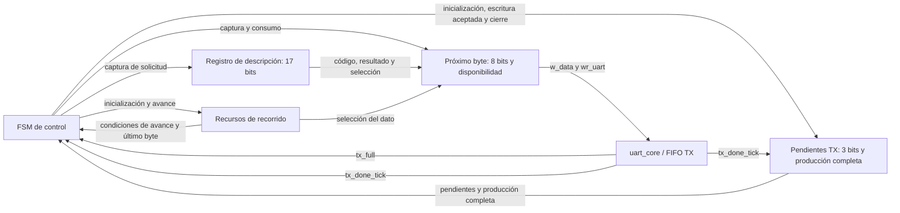

# Serialización de respuestas

## Función del módulo

response_serializer forma las respuestas del [protocolo](../protocol.md) y las entrega byte a byte a [uart_core](uart_core.md). Serializa las cabeceras y, cuando corresponde, el cuerpo Debug a partir del estado retenido.

La [agrupación en módulos](../decisions.md#acuerdo-parcial-de-dec-sys-007--módulos-del-control-del-protocolo-y-respuestas) está aprobada. El serializador contiene sus controles, registros y contadores de recorrido y seguimiento. [protocol_controller](protocol_controller.md) conserva la interpretación de solicitudes y la coordinación de operaciones y RX.

Los puertos y el intercambio con el controlador están aprobados en el [acuerdo de solicitud y finalización](../decisions.md#acuerdo-parcial-de-dec-sys-007--solicitud-y-finalización-de-respuestas). La [organización interna](../decisions.md#acuerdo-parcial-de-dec-sys-007--organización-interna-del-serializador) fija cinco grupos de control y recursos. La frontera completa de observación Debug, el recorrido concreto, los controles de acción y la FSM privada todavía deben definirse.

## Relación con UART y el controlador

protocol_controller indica qué respuesta enviar. response_serializer forma sus bytes, conserva el byte pendiente mientras tx_full está activo y lo incorpora mediante w_data y wr_uart cuando existe espacio. Solo el serializador produce las escrituras TX de las respuestas.

tx_done_tick informa el fin físico de cada byte. El serializador sigue esos eventos en orden y comunica al controlador el final de la respuesta completa. La finalización no se acredita al encolar su último byte.

La ocupación del serializador no autoriza ni detiene ciclos CPU por sí misma. Las respuestas breves durante RUN respetan su ejecución continua; la exclusión Debug corresponde a la coordinación del controlador y comienza desde el instante observado, incluso si todavía se espera a que termine una respuesta anterior.

## Comunicación con el controlador

Se utiliza una solicitud de una respuesta completa, con código, resultado y selección de cuerpo Debug, y dos indicadores de retorno:

| Dirección respecto del serializador | Señal | Ancho | Significado |
|---|---|---|---|
| Entrada | `response_start` | 1 | Pulso de un clock para solicitar una respuesta cuando el serializador está libre. |
| Entrada | `response_opcode` | 8 | Primer byte de la respuesta; reproduce el código recibido, incluido un código desconocido. |
| Entrada | `response_result` | 8 | Segundo byte, según la tabla de resultados del protocolo. |
| Entrada | `response_with_debug` | 1 | Agrega el cuerpo Debug después de la cabecera. |
| Salida | `response_busy` | 1 | Respuesta en curso desde su aceptación hasta el fin físico del último byte. |
| Salida | `response_done_tick` | 1 | Evento de un clock que comunica el fin físico de la respuesta completa. |

Fuera de reset, response_start se acepta al flanco con response_busy en cero. Los tres campos deben estar estables para ese flanco y se capturan en registros internos; posteriormente pueden cambiar en el controlador sin alterar el mensaje en curso. Durante reset no se acepta una solicitud.

response_with_debug vale uno para STEP realizado y RUN terminal. Las demás respuestas utilizan solo los dos bytes de cabecera, incluidos STEP y RUN rechazados y RUN / ACCEPTED. La selección describe los formatos existentes y no agrega un byte al enlace UART.

response_busy permanece activo durante la producción, las esperas por espacio y la salida física de los bytes ya encolados. response_done_tick se consume al flanco que completa el Stop del último byte, manteniendo la referencia temporal aprobada para LOAD, RESET y la liberación Debug. Después de ese flanco response_busy vuelve a cero; una nueva solicitud se acepta en un flanco posterior con el serializador libre. El contador de pendientes y el indicador de producción completa permiten identificar ese byte, conforme al seguimiento descrito más abajo; su realización mediante controles y FSM sigue pendiente.

response_done_tick comunica una única finalización por respuesta. El evento se presenta para el mismo flanco de consumo que tx_done_tick del último byte, sin un registro adicional que desplace ese hito. Durante reset se suprimen aceptación y finalización y response_busy queda inactivo. Un reset físico que aborta el envío no produce una finalización normal. La generación de reset global a partir de la aceptación UART se concretará en el controlador y el acondicionamiento de reset.

El controlador solicita otra respuesta cuando el serializador está libre. Si existe una respuesta pendiente, la coordinación la conserva en el controlador hasta ese momento; la realización de ese pendiente sigue abierta. El serializador atiende una respuesta por vez y no necesita una cola de respuestas para este intercambio.

```mermaid
sequenceDiagram
    participant CTRL as protocol_controller
    participant SER as response_serializer
    participant UART as uart_core
    SER-->>CTRL: response_busy = 0
    CTRL->>SER: response_start y campos estables
    Note over CTRL,SER: Flanco de aceptación; capturar campos
    SER-->>CTRL: response_busy = 1
    loop Bytes de cabecera y cuerpo, si corresponde
        SER->>UART: w_data y wr_uart cuando hay espacio
        UART-->>SER: tx_done_tick al terminar cada Stop
        Note over CTRL,UART: CTRL continúa consumiendo o descartando RX según la fase
    end
    Note over SER,UART: Flanco de fin físico del último byte
    SER-->>CTRL: response_done_tick
    SER-->>CTRL: response_busy = 0 después del flanco
```

El diagrama resume producción y finalización; no exige esperar el fin de cada byte antes de encolar el siguiente. Los bytes se pueden producir usando los lugares disponibles de la FIFO TX mientras el transmisor avanza.

## Organización interna

Los cinco grupos permanecen dentro de response_serializer:

| Grupo | Recurso o función |
|---|---|
| FSM de control | Emite las órdenes de captura, avance y envío; conserva el estado registrado. Sus estados, codificación y controles concretos siguen pendientes. |
| Registro de descripción | Conserva response_opcode de ocho bits, response_result de ocho bits y response_with_debug de uno: 17 bits capturados al aceptar la solicitud. |
| Registro del próximo byte | Conserva un byte de ocho bits y un indicador de disponibilidad de un bit mientras espera su incorporación a TX. |
| Recursos de recorrido | Identifican sección, campo y byte de la respuesta. Sus índices, anchos y secuencia se concretarán al definir el recorrido. |
| Seguimiento de transmisión | Cuenta bytes encolados cuyo Stop aún no terminó y conserva un indicador de producción completa. El contador recorre cero a cuatro y tiene tres bits; el indicador tiene uno. |



El diagrama presenta la organización de los recursos; las flechas de acción no fijan todavía nombres de enables ni una tabla de controles. La lógica de selección del dato utiliza el descriptor, la posición y la observación Debug. El registro del próximo byte captura el resultado y lo conserva durante espera TX.

La FSM determina qué acción corresponde y la lógica de cada recurso actualiza sus valores al flanco del clock funcional, conforme al [criterio de diseño del TP2](../decisions.md#acuerdo-parcial-de-dec-sys-007--correcciones-de-diseño-de-fsm-del-tp2). La organización no exige un módulo por registro o contador ni introduce una copia completa del snapshot.

## Seguimiento de transmisión

El contador de pendientes aumenta por cada escritura aceptada en FIFO TX, con wr_uart activo y tx_full en cero, y disminuye por cada tx_done_tick. Si ambos eventos ocurren en el mismo flanco, conserva su valor. Las condiciones utilizan las señales previas al flanco, como la [FIFO](uart_fifo.md#solicitudes-y-operaciones-aceptadas); la cuenta se inicializa en cero al reset y al aceptar una nueva respuesta.

La cota de cuatro incluye el byte en transmisión: uart_core conserva el primer elemento de FIFO hasta el flanco final de Stop. El registro del próximo byte no forma parte de esa cuenta mientras todavía no se haya incorporado a la FIFO. Solo response_serializer escribe TX, y la siguiente respuesta se acepta después del fin físico de la anterior; por eso comienza sin bytes TX de otro mensaje pendientes.

El indicador de producción completa se inicializa en cero para cada respuesta y se activa cuando su último byte se incorpora a TX. Obtener ese byte en el registro de producción todavía no cierra el mensaje. La cuenta puede llegar a cero entre bytes mientras la producción continúa, y esa condición no informa por sí sola el fin de respuesta.

Fuera de reset, el último Stop se reconoce con respuesta en curso, producción completa, un único byte pendiente previo al flanco y tx_done_tick activo. Ese flanco consume response_done_tick, lleva la cuenta a cero y deja libre el serializador. Los controles concretos que actualizan el contador, el indicador y el estado se definirán junto con la FSM.

## Alcance del siguiente paso

La responsabilidad, el módulo response_serializer, los seis puertos de coordinación y los cinco grupos internos están aprobados. El siguiente paso es definir cómo se recorre la respuesta y concretar los recursos de posición que ese recorrido requiere.

Siguen pendientes los estados y controles de la FSM, los índices y anchos de recorrido, la frontera de lectura Debug y la coordinación concreta de respuestas pendientes en protocol_controller. El seguimiento tiene definidos el contador y el indicador y debe concretarse en las acciones de la FSM. DEC-SYS-007 permanece abierto y el trabajo continúa únicamente en diseño.
