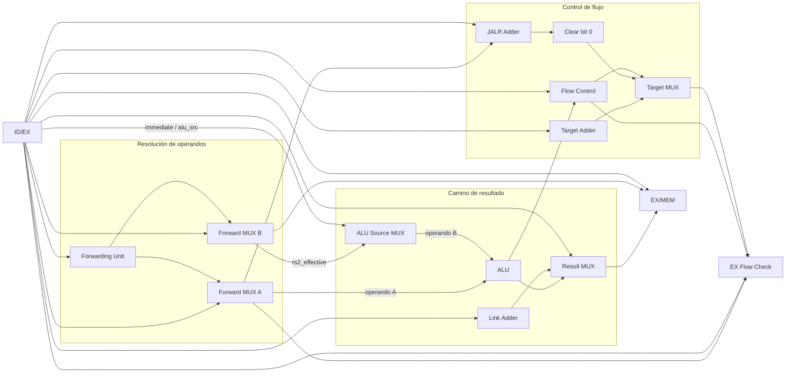
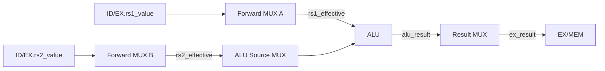
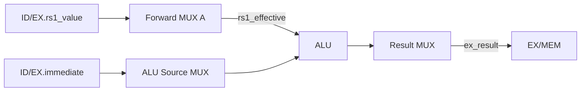
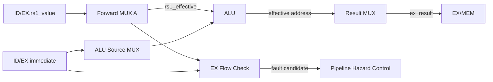
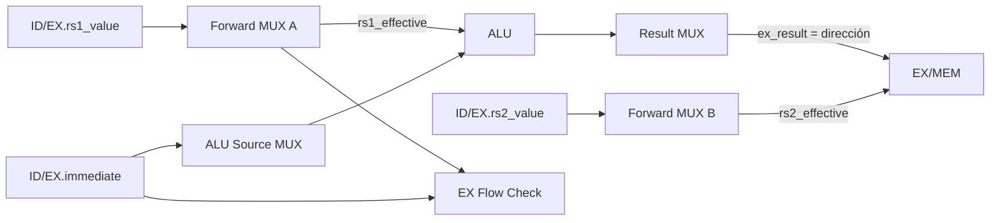
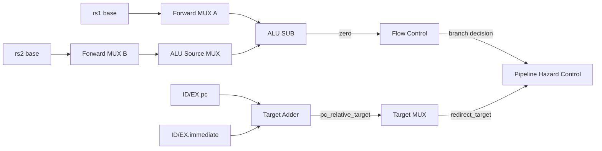
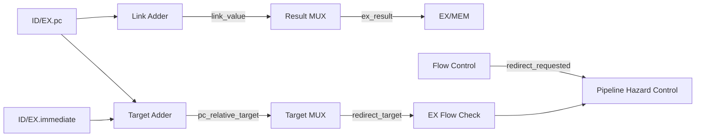
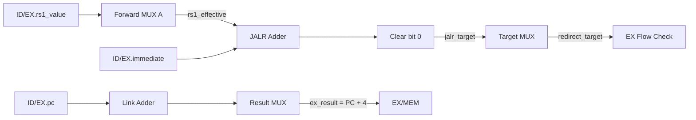
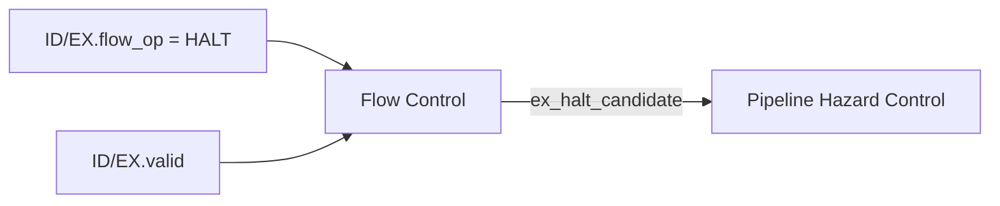

# Etapa EX — Execute

## Función de la etapa

EX recibe desde ID/EX una instrucción ya decodificada junto con los datos y controles necesarios para ejecutarla. En esta etapa se resuelven los operandos que realmente consume la instrucción, se calculan resultados y direcciones, se determinan los cambios de flujo y se detectan los faults que dependen de información disponible recién en ejecución.

La etapa produce dos clases de salidas. Por un lado, forma los datos que pueden continuar hacia MEM a través de EX/MEM: el resultado de una operación, una dirección efectiva, un enlace o el dato de un store. Por otro, produce eventos de control que pueden cambiar el avance del pipeline: una solicitud de redirect, un candidato de `halt` o un candidato de fault propio de EX.

EX es una etapa combinacional entre ID/EX y EX/MEM. Sus bloques se evalúan en paralelo durante el mismo ciclo. Los recorridos que se muestran a continuación representan **dependencias funcionales**, no una secuencia de subciclos internos. La instrucción registrada en ID/EX determina qué caminos son relevantes y qué resultado termina seleccionado.

## Organización general

La etapa puede entenderse como cuatro caminos que operan simultáneamente:

1. **Resolución de operandos**, donde el forwarding forma `rs1_effective` y `rs2_effective`.
2. **Camino de resultado**, donde la ALU, el inmediato o el enlace producen `ex_result`.
3. **Camino de control de flujo**, donde se forman los targets y se decide si existe una solicitud de redirect o un candidato de `halt`.
4. **Validación de EX**, donde se comprueban direcciones de datos y targets utilizados por la instrucción.

El registro EX/MEM conserva únicamente la información que continúa teniendo significado después de esos caminos.



La separación anterior no implica bloques aislados. Un mismo valor puede alimentar varios caminos en paralelo. `rs1_effective`, por ejemplo, participa en la ALU, en el cálculo de JALR y en la validación de accesos de datos.

## Qué recibe EX

ID/EX entrega a la etapa tres grupos de información:

- **Identidad:** `valid`, `pc`, `instruction`, `rs1`, `rs2` y `rd`.
- **Datos:** `rs1_value`, `rs2_value` e `immediate`.
- **Controles:** `alu_op`, `alu_src`, `result_sel`, `flow_op`, `mem_op` y `reg_write`.

`rs1_value` y `rs2_value` son valores base obtenidos en ID. Todavía pueden quedar obsoletos si una instrucción anterior produjo una versión más reciente del mismo registro. Por esa razón, EX forma primero los operandos efectivos mediante forwarding.

## Recorridos por clase de instrucción

### Operaciones R-type

Las operaciones R-type utilizan dos registros fuente y producen su resultado en la ALU. Este grupo incluye `add`, `sub`, `sll`, `slt`, `sltu`, `xor`, `srl`, `sra`, `or` y `and`.

Ambas fuentes atraviesan la lógica de forwarding. `ALU Source MUX` selecciona `rs2_effective` como segundo operando y la ALU ejecuta la operación indicada por `alu_op`. `Result MUX` selecciona después `alu_result` como `ex_result`.



Para estas instrucciones:

```text
alu_operand_a = rs1_effective
alu_operand_b = rs2_effective
ex_result     = alu_result
```

El resultado puede reenviarse desde EX/MEM a una instrucción posterior porque `ex_result` ya contiene el valor arquitectónico destinado a `rd`.

### Operaciones I-type aritméticas y shifts

Las operaciones I-type aritméticas y de desplazamiento utilizan `rs1` y un inmediato. Este grupo incluye `addi`, `slti`, `sltiu`, `xori`, `ori`, `andi`, `slli`, `srli` y `srai`.

`rs1` atraviesa forwarding de la misma forma que en las operaciones R-type. El segundo operando no procede de `rs2`: `ALU Source MUX` selecciona `ID/EX.immediate`.



El camino funcional queda:

```text
alu_operand_a = rs1_effective
alu_operand_b = immediate
ex_result     = alu_result
```

En los shifts inmediatos, la cantidad de posiciones que se desplaza el operando ya está contenida en el inmediato generado a partir de la instrucción. Los bits fijos que distinguen `srli` de `srai` forman parte de la decodificación realizada en ID.

### `LUI`

`LUI` no obtiene su resultado arquitectónico de la ALU. El inmediato U generado en ID ya representa el valor que la instrucción escribe en `rd`.

`Result MUX` selecciona directamente `ID/EX.immediate`:


Por lo tanto:

```text
ex_result = ID/EX.immediate
```

La ALU y los caminos de target pueden presentar valores combinacionales durante ese ciclo, pero esos valores no forman parte del efecto funcional de `LUI`.

### Loads

Los loads `lb`, `lh`, `lw`, `lbu` y `lhu` calculan en EX la dirección efectiva que MEM utilizará para leer DMEM.

La base `rs1` atraviesa forwarding y el inmediato I se selecciona como segundo operando de la ALU:



La dirección efectiva es:

```text
effective_address =
    (rs1_effective + ID/EX.immediate) mod 2^32
```

Para un load:

```text
ex_result = effective_address
```

`EX Flow Check` evalúa esa misma dirección para comprobar la alineación y que el acceso completo quede dentro de DMEM.

El dato cargado todavía no existe en EX. Por esa razón, un load almacenado en EX/MEM no puede reenviar `EX/MEM.ex_result` como valor de `rd`: en ese momento `ex_result` es solamente la dirección efectiva. El dato arquitectónico aparece después de la lectura y extensión realizadas en MEM.

### Stores

Los stores `sb`, `sh` y `sw` utilizan dos caminos de datos diferentes dentro de EX:

- `rs1_effective + immediate` forma la dirección efectiva;
- `rs2_effective` forma el dato que MEM escribirá.



La separación queda:

```text
EX/MEM.ex_result  = effective_address
EX/MEM.store_data = rs2_effective
```

Esto permite que el forwarding resuelva tanto una dependencia sobre la base de la dirección como una dependencia sobre el dato que se almacenará.

La validación de alineación y rango ocurre en EX antes de que el store pueda llegar a producir una escritura en MEM.

### `BEQ` y `BNE`

Los branches comparan dos registros y, en paralelo, forman el target relativo al PC propio de la instrucción.

Las dos fuentes atraviesan forwarding. La ALU realiza una resta y utiliza `zero` como indicador de igualdad:



La condición es:

```text
branch_taken =
    (is_beq && ALU.zero)
    || (is_bne && !ALU.zero)
```

Si el branch no se toma, no existe solicitud de redirect y el target calculado no produce ningún efecto.

Si el branch se toma, `Flow Control` genera `redirect_requested`. `Target MUX` presenta `pc_relative_target` como `redirect_target`, y `EX Flow Check` comprueba la alineación de ese destino antes de que el redirect pueda aplicarse.

### `JAL`

`JAL` produce dos resultados funcionales en paralelo:

- un nuevo destino para el PC;
- el enlace `PC + 4` que posteriormente se escribe en `rd`.



Los dos valores son:

```text
redirect_target =
    (ID/EX.pc + ID/EX.immediate) mod 2^32

ex_result =
    (ID/EX.pc + 4) mod 2^32
```

Si el target es válido y el redirect se aplica, IF comienza a buscar desde `redirect_target`. Al mismo tiempo, la instrucción JAL continúa hacia EX/MEM con el enlace en `ex_result`, que más adelante llega a `rd`.

### `JALR`

`JALR` también produce un redirect y un enlace, pero el destino se calcula a partir de `rs1_effective`.



El cálculo del target es:

```text
jalr_sum =
    (rs1_effective + ID/EX.immediate) mod 2^32

jalr_target =
    jalr_sum & 32'hFFFFFFFE
```

El forwarding de `rs1` participa directamente en este cálculo. Una versión obsoleta del registro base produciría un destino incorrecto.

La limpieza afecta únicamente al bit 0. Si el bit 1 del resultado permanece activo, el target continúa desalineado para este procesador de instrucciones de 32 bits y `EX Flow Check` genera el candidato correspondiente.

En paralelo:

```text
ex_result =
    (ID/EX.pc + 4) mod 2^32
```

Ese valor es el enlace que continúa hacia WB si la propia instrucción no termina en fault.

### `halt`

`halt` no produce un resultado arquitectónico destinado a EX/MEM. Su función en EX es alcanzar el punto donde la terminación normal puede confirmarse respetando el orden de las instrucciones.



El candidato es:

```text
ex_halt_candidate =
    ID/EX.valid
    && (ID/EX.flow_op == HALT)
```

Cuando el control selecciona `act_halt`, la instrucción se consume en EX y no entra válidamente en EX/MEM. Las instrucciones anteriores pueden terminar su ejecución durante el drenado.

## Resumen de recorridos

| Clase | Operando A | Operando B | `ex_result` | Camino de flujo | Validación propia de EX |
|---|---|---|---|---|---|
| R-type | `rs1_effective` | `rs2_effective` | ALU | — | — |
| I-type aritm./shift | `rs1_effective` | inmediato | ALU | — | — |
| LUI | — | — | inmediato | — | — |
| Load | `rs1_effective` | inmediato | dirección efectiva | — | alineación y rango DMEM |
| Store | `rs1_effective` | inmediato | dirección efectiva | — | alineación y rango DMEM |
| BEQ/BNE | `rs1_effective` | `rs2_effective` | sin efecto de registro | destino relativo al PC | alineación solo si se toma |
| JAL | — | — | `PC + 4` | destino relativo al PC | alineación del target |
| JALR | `rs1_effective` | inmediato | `PC + 4` | target `rs1 + imm`, bit 0 limpio | alineación del target |
| `halt` | — | — | sin efecto | terminación normal | — |

La tabla muestra qué resultados tienen significado funcional para cada clase. Los demás bloques combinacionales pueden seguir evaluándose físicamente, pero sus salidas no se consumen como parte de esa instrucción.

# Bloques que implementan la etapa

## Resolución de operandos

### `Forwarding Unit`

Los valores registrados en ID/EX representan el estado conocido cuando la instrucción pasó por ID. Una instrucción anterior puede haber producido desde entonces una versión más reciente de `rs1` o `rs2`. `Forwarding Unit` identifica ese productor pendiente y selecciona la fuente correcta para cada operando.

La unidad observa:

| Origen | Información |
|---|---|
| ID/EX | `valid`, `instruction`, `rs1`, `rs2` |
| EX/MEM | `valid`, `rd`, `reg_write`, `mem_op` |
| MEM/WB | `valid`, `rd`, `reg_write` |

El uso semántico de `rs1` y `rs2` se deriva nuevamente de `ID/EX.instruction`; no se agregan campos `uses_rs1` o `uses_rs2` al registro.

La [identificación de productores](control_and_hazards.md#identificación-del-productor-correcto) y la [selección por prioridad](control_and_hazards.md#prioridad-según-el-orden-de-los-productores) definen las ecuaciones de la unidad. EX/MEM domina sobre MEM/WB y sobre la base de ID/EX.

Un load coincidente en EX/MEM no tiene disponible el dato de `rd`, pero sigue ocultando cualquier versión anterior de MEM/WB mediante `exmem_match`. La instrucción consumidora inmediata se retuvo previamente mediante un stall load-use; no se incorpora un interlock adicional en EX.

Las salidas son:

| Señal | Destino |
|---|---|
| `forward_a_sel[1:0]` | `Forward MUX A` |
| `forward_b_sel[1:0]` | `Forward MUX B` |

La [codificación de los selectores de forwarding](control_and_hazards.md#selectores) distingue base ID/EX, resultado EX/MEM y valor MEM/WB. Cada mux aplica su propio selector.

### `Forward MUX A`

`Forward MUX A` produce `rs1_effective`.

| Entrada | Origen |
|---|---|
| valor base | `ID/EX.rs1_value` |
| productor reciente | `EX/MEM.ex_result` |
| productor en WB | `MEM/WB.wb_value` |
| selección | `forward_a_sel` |

Su salida alimenta:

- `ALU.A`;
- `JALR Adder`;
- `EX Flow Check`.

De esta forma, una dependencia sobre `rs1` se resuelve de la misma manera tanto si el registro participa en una operación aritmética como si forma una dirección de memoria o un target de JALR.

### `Forward MUX B`

`Forward MUX B` produce `rs2_effective`.

| Entrada | Origen |
|---|---|
| valor base | `ID/EX.rs2_value` |
| productor reciente | `EX/MEM.ex_result` |
| productor en WB | `MEM/WB.wb_value` |
| selección | `forward_b_sel` |

Su salida alimenta:

- `ALU Source MUX`;
- `EX/MEM.store_data`.

El dato de store queda así resuelto en EX antes de registrarse para MEM.

## Camino principal de resultado

### `ALU Source MUX`

`ALU Source MUX` selecciona el segundo operando de la ALU:

```text
alu_operand_b =
    ID/EX.alu_src
        ? ID/EX.immediate
        : rs2_effective
```

R-type y branches utilizan `rs2_effective`. Las operaciones I-type y los accesos de memoria utilizan el inmediato.

### `ALU`

La ALU recibe:

```text
A = rs1_effective
B = alu_operand_b
```

y ejecuta la operación definida por `ID/EX.alu_op`.

Sus salidas son:

- `alu_result[31:0]`, utilizado por `Result MUX`;
- `zero`, utilizado por `Flow Control` para BEQ/BNE.

En loads y stores, `alu_result` representa la dirección efectiva. En branches, la resta entre operandos permite obtener la condición de igualdad mediante `zero`.

Los códigos de `alu_op` se detallan en [los controles generados en ID](stage_id.md#codificación-de-los-controles); la operación sobre los datos se describe en [Datapath](datapath.md#alu).

### `Link Adder`

`Link Adder` calcula el valor que JAL y JALR escriben posteriormente en `rd`:

```text
link_value =
    (ID/EX.pc + 4) mod 2^32
```

La operación utiliza el PC propio de la instrucción. El PC global de IF puede encontrarse buscando otra instrucción y no participa en este cálculo.

### `Result MUX`

`Result MUX` consolida el único campo `ex_result` que continúa por EX/MEM:

| `result_sel` | Fuente |
|---|---|
| `00` | `alu_result` |
| `01` | `ID/EX.immediate` |
| `10` | `link_value` |
| `11` | reservado |

Esto permite representar con un solo campo resultados conceptualmente diferentes:

- resultado ALU;
- valor de LUI;
- enlace de JAL/JALR;
- dirección efectiva de load/store.

## Camino de control de flujo

### `Target Adder`

`Target Adder` forma el destino relativo al PC utilizado por BEQ, BNE y JAL:

```text
pc_relative_target =
    (ID/EX.pc + ID/EX.immediate) mod 2^32
```

El target se calcula durante el ciclo incluso si un branch finalmente no se toma. Solo adquiere significado arquitectónico cuando `Flow Control` genera una solicitud de redirect.

### `JALR Adder`

`JALR Adder` calcula:

```text
jalr_sum =
    (rs1_effective + ID/EX.immediate) mod 2^32
```

La base utiliza el operando posterior al forwarding.

### `Clear bit 0`

El camino JALR transforma la suma mediante:

```text
jalr_target =
    jalr_sum & 32'hFFFFFFFE
```

La operación limpia únicamente el bit 0.

### `Target MUX`

`Target MUX` selecciona el destino que puede presentarse como redirect:

```text
target_sel = 0  → pc_relative_target
target_sel = 1  → jalr_target
```

`target_sel` se deriva localmente de:

```text
target_sel =
    (ID/EX.flow_op == JALR)
```

La salida `redirect_target` llega tanto a `EX Flow Check` como al `Next PC MUX` de IF.

### `Flow Control`

`Flow Control` interpreta `ID/EX.flow_op` y `ALU.zero`.

Las clases locales son:

```text
is_beq  = (flow_op == BEQ)
is_bne  = (flow_op == BNE)
is_jal  = (flow_op == JAL)
is_jalr = (flow_op == JALR)
is_halt = (flow_op == HALT)
```

Para branches:

```text
branch_taken =
    (is_beq && ALU.zero)
    || (is_bne && !ALU.zero)
```

La solicitud de cambio de flujo es:

```text
redirect_requested =
    ID/EX.valid
    && (branch_taken || is_jal || is_jalr)
```

El candidato de terminación normal es:

```text
ex_halt_candidate =
    ID/EX.valid
    && is_halt
```

Las salidas del bloque son:

| Señal | Destino |
|---|---|
| `target_sel` | `Target MUX` |
| `redirect_requested` | `EX Flow Check`, `Pipeline Hazard Control` |
| `ex_halt_candidate` | `Pipeline Hazard Control` |

`redirect_requested` no cambia por sí sola el PC. El redirect se aplica únicamente cuando la acción seleccionada por el control del pipeline es `act_redirect`.

## Validación propia de EX

### `EX Flow Check`

`EX Flow Check` detecta las condiciones inválidas que dependen de resultados disponibles en EX.

Observa:

- `ID/EX.valid`;
- `ID/EX.mem_op`;
- `rs1_effective`;
- `ID/EX.immediate`;
- `redirect_requested`;
- `redirect_target`;
- `DMEM_CAPACITY_BYTES`.

### Accesos a DMEM

La dirección efectiva utilizada para validar un load o store es:

```text
effective_address =
    (rs1_effective + ID/EX.immediate) mod 2^32
```

El carry de esa suma no constituye un fault.

El tamaño se deriva de `mem_op`:

| Operaciones | Bytes |
|---|---:|
| LB, LBU, SB | 1 |
| LH, LHU, SH | 2 |
| LW, SW | 4 |

La región se valida calculando su extremo con una suma sin signo de 33 bits y comprobando la alineación natural según el tamaño del acceso, como se describe en [Arquitectura de memoria](memory_architecture.md#formación-y-validación-de-direcciones) y [sus reglas de alineación](memory_architecture.md#alineación). Esta comprobación no confunde el extremo del acceso con el carry permitido de la suma que forma la dirección efectiva.

A partir de esas condiciones se generan:

```text
load_misaligned_candidate
load_access_candidate
store_misaligned_candidate
store_access_candidate
```

Dentro de un mismo acceso, la desalineación prevalece sobre el fault de rango.

### Targets de control

Un target se valida únicamente cuando la instrucción solicita realmente un redirect:

```text
target_misaligned_candidate =
    redirect_requested
    && (redirect_target[1:0] != 2'b00)
```

Por lo tanto, un branch no tomado no genera un fault por un target que no utiliza.

Un target alineado que apunta fuera de la imagen no genera aquí un access fault de instrucción. Si el redirect se aplica, IF detecta el eventual `instruction-access-fault` cuando intente realizar el fetch correspondiente.

### Causa producida por EX

```text
ex_fault_candidate =
    target_misaligned_candidate
    || load_misaligned_candidate
    || load_access_candidate
    || store_misaligned_candidate
    || store_access_candidate
```

| Causa | Código |
|---|---|
| `instruction-address-misaligned` | `000` |
| `load-address-misaligned` | `100` |
| `load-access-fault` | `101` |
| `store-address-misaligned` | `110` |
| `store-access-fault` | `111` |

Las salidas son:

| Señal | Destino |
|---|---|
| `ex_fault_candidate` | `Pipeline Hazard Control` |
| `ex_fault_cause[2:0]` | `Fault Metadata Control` |

La confirmación y captura de metadata se desarrollan en [Faults, redirects y terminación](faults_and_termination.md). Las propiedades de DMEM se detallan en [Arquitectura de memoria](memory_architecture.md).

<a id="selección-de-la-frontera-de-ex"></a>

## Prioridad entre fault, `halt` y redirect en EX

Los caminos combinacionales pueden producir al mismo tiempo una solicitud de redirect y una condición que invalida ese efecto. La arquitectura resuelve la instrucción actual con la siguiente prioridad local:

```text
fault propio de EX
    ↓
halt
    ↓
redirect
    ↓
avance normal
```

Un fault propio suprime los efectos normales de la instrucción. `halt` se confirma únicamente si no existe un fault propio. Un redirect puede aplicarse únicamente cuando no existe ni fault propio ni `halt`.

La selección completa de las acciones del pipeline se desarrolla en [Control del pipeline y hazards](control_and_hazards.md).

## Salida de la etapa

### `EX/MEM Update Control`

`EX/MEM Update Control` convierte la acción seleccionada por `Pipeline Hazard Control` en una operación local sobre EX/MEM.

Recibe las ocho acciones de `Pipeline Hazard Control` y produce `capture` e `invalidate` para EX/MEM. Su derivación está en [los controles locales de EX/MEM](control_and_hazards.md#exmem).

La instrucción de EX continúa durante redirect, para conservar el enlace de JAL/JALR, y durante fault ID, porque es anterior a la causante. `halt` y un fault propio se consumen en EX y no ingresan válidamente a MEM. Sin acción de pipeline ni prioridad global superior, el registro retiene su estado.

### Registro `EX/MEM`

El [contrato de EX/MEM](cpu_pipeline.md#registro-exmem) define sus ocho campos y anchos. El resultado y el dato de store siguen caminos distintos y las entradas locales proceden de:

| Campo | Origen |
|---|---|
| `valid`, `pc`, `instruction`, `rd` | `ID/EX` |
| `reg_write`, `mem_op` | `ID/EX` |
| `ex_result` | `Result MUX` |
| `store_data` | `rs2_effective` |

Cuando `capture=1`, el registro conserva el contexto producido por la instrucción que estaba en EX antes del flanco.

Cuando `invalidate=1`, `valid` pasa a cero. Los demás bits pueden conservar valores residuales sin representar una instrucción activa.

EX/MEM no conserva `rs1`, `rs2`, los operandos base, el inmediato, `alu_result` ni `link_value` por separado. Esos valores ya fueron consumidos o consolidados dentro de `ex_result` y `store_data`.

El uso de estos campos continúa en [Etapa MEM](stage_mem.md).

## Comportamiento resumido de EX

| Situación | Efecto de la instrucción actual | EX/MEM |
|---|---|---|
| R/I/LUI | Produce resultado para `rd` | Captura |
| Load | Produce dirección efectiva | Captura |
| Store | Produce dirección y `store_data` | Captura |
| Branch no tomado | No solicita redirect | Captura |
| Branch tomado | Solicita redirect válido | Captura |
| JAL/JALR | Solicita redirect y conserva enlace | Captura |
| Fault propio de EX | Suprime efectos de la causante | Invalida |
| `halt` confirmado | Consume `halt` en EX | Invalida |
| Fault en ID | La instrucción anterior de EX conserva su efecto | Captura |
| `load-use` detectado en ID | La instrucción ya presente en EX continúa | Captura |
| HOLD sin ciclo efectivo | No cambia el estado registrado | Retiene |

## Trazabilidad

- [Pipeline CPU](cpu_pipeline.md): posición de EX dentro del pipeline y contrato general de EX/MEM.
- [Etapa ID](stage_id.md): formación de ID/EX y significado de los controles que recibe EX.
- [Datapath](datapath.md): ALU, targets, enlace y caminos de resultado.
- [Control del pipeline y hazards](control_and_hazards.md): forwarding, `load-use`, prioridades y acciones.
- [Arquitectura de memoria](memory_architecture.md): capacidad, rango, alineación y semántica de DMEM.
- [Faults, redirects y terminación](faults_and_termination.md): confirmación de faults, redirect, `halt` y precisión.
- [Control de ejecución y sesión](execution_control.md): ciclos efectivos, HOLD y drenado.
- [Etapa MEM](stage_mem.md): consumo de `EX/MEM.ex_result`, `store_data` y `mem_op`.
