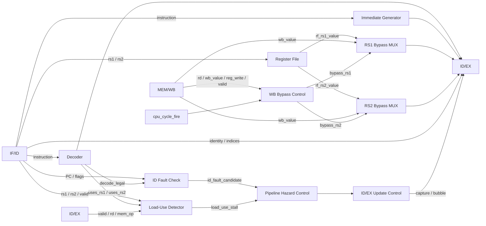
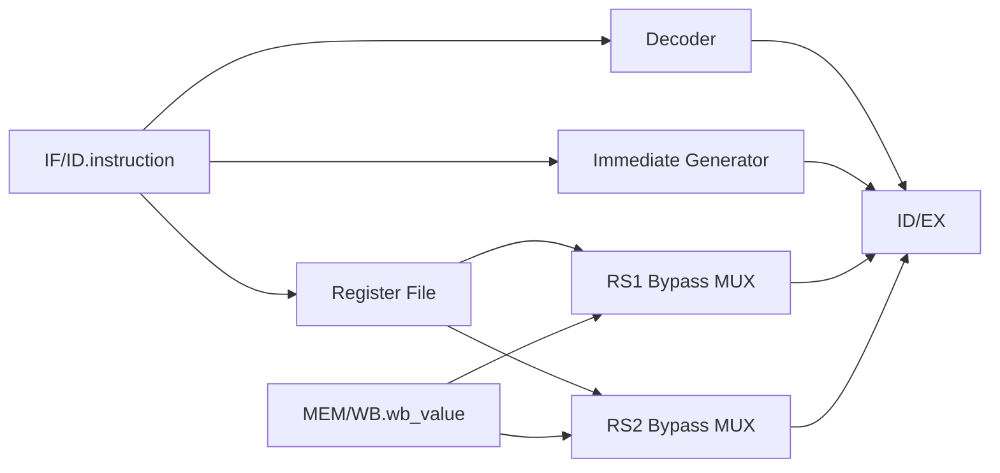

# Etapa ID — Instruction Decode

## Función de la etapa

ID recibe desde IF/ID una instrucción obtenida por la etapa de búsqueda y transforma esa palabra de 32 bits en el contexto que EX utiliza para ejecutarla.

Durante ese proceso, ID:

- reconoce la instrucción y determina si su codificación pertenece al subconjunto implementado;
- identifica los registros fuente y destino;
- lee los operandos desde el Register File;
- genera el inmediato correspondiente al formato de la instrucción;
- corrige las lecturas que coinciden con un writeback del mismo ciclo mediante bypass WB→ID;
- detecta una dependencia `load-use` con la instrucción inmediatamente anterior;
- reúne en ID/EX los datos y controles que continúan hacia EX.

ID también recibe los candidatos de fault de fetch transportados por IF/ID y detecta las instrucciones ilegales. Ambos casos convergen en `ID Fault Check`, que presenta al control del pipeline un único candidato de fault asociado a esta etapa.

## Organización interna

La etapa está compuesta por los siguientes bloques:

- `Decoder`
- `Register File`
- `Immediate Generator`
- `RS1 Bypass MUX`
- `RS2 Bypass MUX`
- `WB Bypass Control`
- `ID Fault Check`
- `Load-Use Detector`
- `ID/EX Update Control`
- registro `ID/EX`



El camino principal de ID forma en paralelo la decodificación, el inmediato y los operandos. Los bloques de fault y `load-use` observan esa misma información para determinar si la instrucción puede avanzar normalmente.

## Flujo normal de decodificación

Con una instrucción válida en IF/ID y sin una acción anterior que la descarte:

1. `Decoder` reconoce la codificación y genera los controles.
2. `Register File` lee los operandos indicados por `rs1` y `rs2`.
3. `Immediate Generator` forma el inmediato de 32 bits cuando la instrucción lo utiliza.
4. `WB Bypass Control` determina si alguno de los operandos coincide con una escritura efectiva de WB.
5. Los dos bypass MUX seleccionan, para cada fuente, el valor del Register File o `MEM/WB.wb_value`.
6. `Load-Use Detector` comprueba si el productor inmediatamente anterior es un load cuyo resultado todavía no está disponible.
7. `ID Fault Check` comprueba si la entrada representa una instrucción ilegal o un candidato de fetch.
8. Si el control selecciona avance normal, ID/EX captura la identidad, los operandos después del bypass, el inmediato y los controles de la instrucción.



Los cálculos combinacionales de ID utilizan la entrada actual de IF/ID. La captura de ID/EX ocurre en el flanco y conserva el contexto que EX utilizará durante el ciclo siguiente.

## `Decoder`

`Decoder` interpreta la palabra de instrucción almacenada en IF/ID y produce dos clases de información: la **legalidad de la codificación** y los **controles funcionales** que describen cómo continuará la instrucción.

### Entrada

| Señal | Origen |
|---|---|
| `instruction[31:0]` | `IF/ID` |

### Campos observados

La decodificación utiliza los campos fijos definidos por RISC-V:

```text
opcode = instruction[6:0]
funct3 = instruction[14:12]
funct7 = instruction[31:25]
```

En los shifts inmediatos, los bits superiores de la instrucción también forman parte de la validación de la codificación.

La coincidencia es estricta respecto del subconjunto de instrucciones implementado. Una combinación que comparte `opcode` con una instrucción válida, pero no coincide con sus campos fijos restantes, no se considera legal.

La palabra exacta `0x0000000B` se reconoce como `halt`.

### Salidas

| Señal | Destino | Función |
|---|---|---|
| `decode_legal` | `ID Fault Check` | Indica que la codificación pertenece al subconjunto implementado. |
| `alu_op[5:0]` | `ID/EX.alu_op` | Selecciona la operación de ALU. |
| `alu_src` | `ID/EX.alu_src` | Selecciona el origen del segundo operando de ALU. |
| `result_sel[1:0]` | `ID/EX.result_sel` | Selecciona la clase de resultado producida por EX. |
| `flow_op[2:0]` | `ID/EX.flow_op` | Clasifica branches, jumps, `halt` o flujo ordinario. |
| `mem_op[3:0]` | `ID/EX.mem_op` | Clasifica loads, stores o ausencia de acceso a memoria. |
| `reg_write` | `ID/EX.reg_write` | Indica intención de escritura en el Register File. |
| `uses_rs1` | `Load-Use Detector` | Indica que la instrucción consume realmente `rs1`. |
| `uses_rs2` | `Load-Use Detector` | Indica que la instrucción consume realmente `rs2`. |

`uses_rs1` y `uses_rs2` son resultados combinacionales de ID. No se almacenan como campos adicionales en IF/ID ni en ID/EX.

La clasificación de uso de fuentes queda resumida así:

| Clase de instrucción | `uses_rs1` | `uses_rs2` |
|---|---:|---:|
| R-type, BEQ/BNE, stores | 1 | 1 |
| Aritmética/shifts inmediatos, loads, JALR | 1 | 0 |
| JAL, LUI, `halt` | 0 | 0 |
| Codificación ilegal | 0 | 0 |

Una codificación no reconocida produce `decode_legal=0` y controles funcionalmente neutros. La entrada no se convierte por eso en una operación distinta ni genera efectos normales.

### Codificaciones legales

La siguiente whitelist consolida los acuerdos 34 y 37 de [DEC-ARCH-003](../decisions.md#acuerdo-parcial-aprobado--ecuaciones-rtl-del-decoder-de-id). Contiene las 32 instrucciones RV32I implementadas y la palabra que codifica la instrucción personalizada `halt`. Los campos que no se indican como fijos no tienen restricciones adicionales: índices de registros, inmediatos y los cinco bits de shamt.

| Instrucción | `opcode` | `funct3` | Campo fijo adicional | Operación ALU |
|---|---|---|---|---|
| ADD | `0110011` | `000` | `funct7=0000000` | ADD |
| SUB | `0110011` | `000` | `funct7=0100000` | SUB |
| SLL | `0110011` | `001` | `funct7=0000000` | SLL |
| SLT | `0110011` | `010` | `funct7=0000000` | SLT |
| SLTU | `0110011` | `011` | `funct7=0000000` | SLTU |
| XOR | `0110011` | `100` | `funct7=0000000` | XOR |
| SRL | `0110011` | `101` | `funct7=0000000` | SRL |
| SRA | `0110011` | `101` | `funct7=0100000` | SRA |
| OR | `0110011` | `110` | `funct7=0000000` | OR |
| AND | `0110011` | `111` | `funct7=0000000` | AND |
| ADDI | `0010011` | `000` | — | ADD |
| SLTI | `0010011` | `010` | — | SLT |
| SLTIU | `0010011` | `011` | — | SLTU |
| XORI | `0010011` | `100` | — | XOR |
| ORI | `0010011` | `110` | — | OR |
| ANDI | `0010011` | `111` | — | AND |
| SLLI | `0010011` | `001` | `instruction[31:25]=0000000` | SLL |
| SRLI | `0010011` | `101` | `instruction[31:25]=0000000` | SRL |
| SRAI | `0010011` | `101` | `instruction[31:25]=0100000` | SRA |
| LB | `0000011` | `000` | — | ADD |
| LH | `0000011` | `001` | — | ADD |
| LW | `0000011` | `010` | — | ADD |
| LBU | `0000011` | `100` | — | ADD |
| LHU | `0000011` | `101` | — | ADD |
| SB | `0100011` | `000` | — | ADD |
| SH | `0100011` | `001` | — | ADD |
| SW | `0100011` | `010` | — | ADD |
| BEQ | `1100011` | `000` | — | SUB |
| BNE | `1100011` | `001` | — | SUB |
| JAL | `1101111` | — | — | ADD, sin consumo funcional |
| JALR | `1100111` | `000` | — | ADD |
| LUI | `0110111` | — | — | ADD, sin consumo funcional |
| `halt` | word exacta | — | `instruction=0x0000000B` | ADD, sin consumo funcional |

Toda combinación fuera de esta tabla es ilegal. Compartir un opcode no basta para admitir otros branches, operaciones o instrucciones personalizadas. En una instrucción aritmética de tipo I, los doce bits del inmediato son variables; en los shifts inmediatos se validan los siete bits superiores y se utiliza `instruction[24:20]` como cantidad de desplazamiento.

### Codificación de los controles

Los códigos transportados describen la operación que ejecutarán las etapas. EX consume `alu_op`, `alu_src`, `result_sel` y `flow_op`; `mem_op` conserva su código hasta EX/MEM y `reg_write` llega hasta MEM/WB. No se añade un bus obligatorio ni campos derivados a los latches.

| `alu_op[5:0]` | Operación | `alu_op[5:0]` | Operación |
|---|---|---|---|
| `000000` | SLL | `100000` | ADD |
| `000010` | SRL | `100010` | SUB |
| `000011` | SRA | `100100` | AND |
| `101010` | SLT | `100101` | OR |
| `101011` | SLTU | `100110` | XOR |

El código heredado `100111` de NOR no se emite para ninguna instrucción válida del TP3. Esta tabla describe el contrato de la CPU; la adaptación de la ALU anterior es trabajo de implementación.

| Control | Códigos |
|---|---|
| `alu_src` | `0`: RS2; `1`: IMMEDIATE |
| `result_sel[1:0]` | `00`: ALU; `01`: IMMEDIATE; `10`: LINK; `11`: reservado |
| `flow_op[2:0]` | `000`: NONE; `001`: BEQ; `010`: BNE; `011`: JAL; `100`: JALR; `101`: HALT; `110`/`111`: reservados |
| `mem_op[3:0]` | `0000`: NONE; `0001`: LB; `0010`: LH; `0011`: LW; `0100`: LBU; `0101`: LHU; `0110`: SB; `0111`: SH; `1000`: SW; `1001`–`1111`: reservados |
| `reg_write` | `0`: sin intención de escritura; `1`: resultado destinado al RF, sujeto a validez y commit de WB |

### Controles por clase de instrucción

La operación ALU de cada instrucción está en la whitelist. Los controles restantes son:

| Clase | `alu_src` | `result_sel` | `flow_op` | `mem_op` | `reg_write` |
|---|---:|---|---|---|---:|
| R-type | 0 | ALU | NONE | NONE | 1 |
| I aritmética/shifts | 1 | ALU | NONE | NONE | 1 |
| Loads | 1 | ALU | NONE | según load | 1 |
| Stores | 1 | ALU | NONE | según store | 0 |
| BEQ/BNE | 0 | ALU | según branch | NONE | 0 |
| JAL | 1 | LINK | JAL | NONE | 1 |
| JALR | 1 | LINK | JALR | NONE | 1 |
| LUI | 1 | IMMEDIATE | NONE | NONE | 1 |
| `halt` | 0 | ALU | HALT | NONE | 0 |

Para JAL, LUI y `halt`, ADD y `alu_src` tienen los valores deterministas aprobados, pero el resultado de la ALU no se consume funcionalmente. JALR utiliza el camino dedicado de target de EX; LINK selecciona el enlace de esa misma instrucción.

Una codificación no reconocida conserva `decode_legal=0`, ADD, `alu_src=0`, `result_sel=ALU`, `flow_op=NONE`, `mem_op=NONE`, `reg_write=0`, `uses_rs1=0` y `uses_rs2=0`. Esos defaults no convierten la palabra ilegal en una instrucción ejecutable: la confirmación de fault impide su entrada válida a ID/EX. Los selectores de forwarding pertenecen a [Control del pipeline y hazards](control_and_hazards.md); los selectores de target y writeback se derivan localmente en EX y MEM.

## `Register File`

`Register File` es el banco arquitectónico de 32 registros de 32 bits. ID utiliza dos puertos de lectura combinacionales y WB utiliza un único puerto de escritura síncrona.

### Entradas

| Señal | Origen |
|---|---|
| `Read Register 1[4:0]` | `IF/ID.instruction[19:15]` |
| `Read Register 2[4:0]` | `IF/ID.instruction[24:20]` |
| `Write Register[4:0]` | `MEM/WB.rd` |
| `Write Data[31:0]` | `MEM/WB.wb_value` |
| `write_enable` | `WB Bypass Control.rf_write_fire` |
| inicialización de sesión | `Session Preparation` |

### Salidas

| Señal | Destino |
|---|---|
| `rf_rs1_value[31:0]` | `RS1 Bypass MUX` |
| `rf_rs2_value[31:0]` | `RS2 Bypass MUX` |
| contenido completo del RF | Debug/Snapshot |

`x0` conserva permanentemente el valor cero:

```text
lectura de x0       → 0
escritura a x0      → sin modificación
destino WB igual 0  → sin writeback ni bypass
```

La salida del Register File no se captura directamente en ID/EX. Cada puerto pasa primero por su bypass MUX para resolver una eventual escritura coincidente de WB.

La observación del banco completo se desarrolla en [Arquitectura de Debug](debug_architecture.md), mientras que la habilitación efectiva de writeback se relaciona con [Etapa WB](stage_wb.md).

## `Immediate Generator`

`Immediate Generator` reconstruye el inmediato definido por el formato de la instrucción y lo extiende a 32 bits.

### Entrada

| Señal | Origen |
|---|---|
| `instruction[31:0]` | `IF/ID` |

### Salida

| Señal | Destino |
|---|---|
| `immediate[31:0]` | `ID/EX.immediate` |

Los formatos I, S, B, U y J se reconstruyen según [las expresiones del Immediate Generator](datapath.md#inmediato). R-type y `halt` no consumen un inmediato. En shifts inmediatos, la cantidad efectiva utiliza `instruction[24:20]`; los bits superiores pertenecen a la validación de la codificación.

La relación entre estos inmediatos y los caminos de ALU, memoria y control de flujo se desarrolla en [Datapath](datapath.md).

## `WB Bypass Control`

Una instrucción en ID puede leer un registro en el mismo ciclo en que WB escribe ese mismo registro. `WB Bypass Control` resuelve esta coincidencia sin depender del comportamiento interno del almacenamiento del Register File.

### Entradas

| Señal | Origen |
|---|---|
| `cpu_cycle_fire` | `Cycle Authorization` |
| `MEM/WB.valid` | `MEM/WB` |
| `MEM/WB.reg_write` | `MEM/WB` |
| `MEM/WB.rd[4:0]` | `MEM/WB` |
| `IF/ID.instruction[19:15]` | `IF/ID` |
| `IF/ID.instruction[24:20]` | `IF/ID` |

### Escritura efectiva de WB

`rf_write_fire` es el [predicado de commit de WB](stage_wb.md#condición-efectiva-de-writeback), formado con el contenido anterior al flanco de MEM/WB y la autorización del ciclo. El bloque reutiliza ese predicado para seleccionar de manera independiente las fuentes coincidentes; las [ecuaciones de bypass WB→ID](control_and_hazards.md#bypass-wb--id) pertenecen al control del pipeline.

### Salidas

| Señal | Destino |
|---|---|
| `rf_write_fire` | `Register File.write_enable` |
| `bypass_rs1` | `RS1 Bypass MUX.sel` |
| `bypass_rs2` | `RS2 Bypass MUX.sel` |

El bypass actúa únicamente sobre las lecturas de ID. No sustituye al forwarding de EX ni elimina la espera `load-use`.

La coordinación completa entre bypass, forwarding y stalls se desarrolla en [Control del pipeline y hazards](control_and_hazards.md).

## `RS1 Bypass MUX`

El primer bypass MUX selecciona el valor base que ID/EX conservará para `rs1`.

### Entradas

| Señal | Origen |
|---|---|
| `rf_rs1_value[31:0]` | `Register File` |
| `MEM/WB.wb_value[31:0]` | `MEM/WB` |
| `bypass_rs1` | `WB Bypass Control` |

### Salida

| Señal | Destino |
|---|---|
| `rs1_value[31:0]` | `ID/EX.rs1_value` |

La selección es:

```text
rs1_value =
    bypass_rs1 ? MEM/WB.wb_value : rf_rs1_value
```

El valor resultante es la base con la que la instrucción entra en EX. Si posteriormente existe un productor más reciente en EX/MEM o MEM/WB, el forwarding de EX puede sustituir esta base.

## `RS2 Bypass MUX`

El segundo bypass MUX aplica la misma política al segundo operando.

### Entradas

| Señal | Origen |
|---|---|
| `rf_rs2_value[31:0]` | `Register File` |
| `MEM/WB.wb_value[31:0]` | `MEM/WB` |
| `bypass_rs2` | `WB Bypass Control` |

### Salida

| Señal | Destino |
|---|---|
| `rs2_value[31:0]` | `ID/EX.rs2_value` |

La selección es:

```text
rs2_value =
    bypass_rs2 ? MEM/WB.wb_value : rf_rs2_value
```

Este valor se conserva incluso cuando la instrucción terminará utilizando un inmediato como segundo operando de ALU, porque `rs2` también puede cumplir otras funciones, como transportar el dato de un store.

## `ID Fault Check`

`ID Fault Check` reúne las dos clases de problemas que pueden presentarse en ID:

- una instrucción válida cuya codificación no pertenece al subconjunto implementado;
- un candidato de fault de fetch transportado desde IF.

Estas dos situaciones son mutuamente excluyentes por la representación de IF/ID.

### Entradas

| Señal | Origen |
|---|---|
| `IF/ID.valid` | `IF/ID` |
| `IF/ID.pc[31:0]` | `IF/ID` |
| `IF/ID.fetch_fault_valid` | `IF/ID` |
| `IF/ID.fetch_fault_cause[2:0]` | `IF/ID` |
| `decode_legal` | `Decoder` |

<a id="candidaturas"></a>

### Candidatos de fault

```text
illegal_candidate =
    IF/ID.valid
    && !decode_legal

id_fetch_fault_candidate =
    !IF/ID.valid
    && IF/ID.fetch_fault_valid

id_fault_candidate =
    illegal_candidate
    || id_fetch_fault_candidate
```

La causa y el PC asociados quedan definidos por:

```text
if (illegal_candidate):
    id_fault_cause = 3'b010
    id_fault_pc    = IF/ID.pc

else if (id_fetch_fault_candidate):
    id_fault_cause = IF/ID.fetch_fault_cause
    id_fault_pc    = IF/ID.pc
```

Una entrada con `valid=0` y `fetch_fault_valid=0` es simplemente una posición inactiva. Sus bits residuales de `instruction` no pueden convertirse en una instrucción ilegal.

### Salidas

| Señal | Destino |
|---|---|
| `id_fault_candidate` | `Pipeline Hazard Control` |
| `id_fault_cause[2:0]` | `Fault Metadata Control` |
| `id_fault_pc[31:0]` | `Fault Metadata Control` |

`ID Fault Check` genera el candidato. Para confirmarlo se necesita un ciclo de la CPU y que en EX no se confirme un fault o `halt` ni se aplique un redirect de la instrucción anterior.

La prioridad según el orden del programa, la captura de metadata y las causas de fault se desarrollan en [Faults, redirects y terminación](faults_and_termination.md).

## `Load-Use Detector`

Un resultado de load no está disponible para una instrucción inmediatamente posterior cuando esa consumidora necesitaría utilizarlo en EX. `Load-Use Detector` identifica exactamente esa relación entre el productor situado en ID/EX y la instrucción situada en IF/ID.

### Entradas desde IF/ID y Decoder

| Señal | Origen |
|---|---|
| `IF/ID.valid` | `IF/ID` |
| `rs1[4:0]` | `IF/ID.instruction[19:15]` |
| `rs2[4:0]` | `IF/ID.instruction[24:20]` |
| `uses_rs1` | `Decoder` |
| `uses_rs2` | `Decoder` |

### Entradas desde ID/EX

| Señal | Origen |
|---|---|
| `ID/EX.valid` | `ID/EX` |
| `ID/EX.rd[4:0]` | `ID/EX` |
| `ID/EX.mem_op[3:0]` | `ID/EX` |

### Condición

La [ecuación de detección de load-use](control_and_hazards.md#detección) compara el load válido de ID/EX con las fuentes realmente utilizadas por la instrucción válida de IF/ID. `rd=0`, campos no consumidos y candidatos de fetch no generan dependencias.

### Salida

| Señal | Destino |
|---|---|
| `load_use_stall` | `Pipeline Hazard Control` |

Cuando el control selecciona el stall load-use, IF/ID se retiene e ID/EX recibe una bubble. El load anterior continúa hacia MEM y, en el avance siguiente, su resultado puede alcanzar al consumidor mediante el forwarding correspondiente.

La prioridad de `load-use` y su interacción con las demás acciones se desarrolla en [Control del pipeline y hazards](control_and_hazards.md).

## `ID/EX Update Control`

`ID/EX Update Control` convierte la acción seleccionada por `Pipeline Hazard Control` en una de dos operaciones locales: **capturar ID** o **introducir una bubble**.

### Entradas

Todas provienen de `Pipeline Hazard Control`:

- `act_ex_fault`
- `act_halt`
- `act_redirect`
- `act_id_fault`
- `act_load_use`
- `act_normal`
- `act_drain_load_use`
- `act_drain_advance`

### Salidas

| Señal | Destino |
|---|---|
| `capture` | `ID/EX.capture` |
| `bubble` | `ID/EX.bubble` |

La captura y la bubble se derivan de las ocho acciones según [los controles locales de ID/EX](control_and_hazards.md#idex). Sin acción de pipeline ni prioridad global superior, el registro retiene su estado.

Durante load-use, la instrucción consumidora permanece en IF/ID y la bubble permite que el load anterior continúe. Redirect, halt y fault impiden la entrada válida de las instrucciones descartadas. Durante `act_drain_advance`, la captura conserva la validez cero que ya tiene IF/ID después de confirmar `halt` o fault; no introduce instrucciones nuevas durante drain.

## Registro `ID/EX`

ID/EX es el registro que conecta decodificación y ejecución. Conserva el contexto completo que EX utiliza para procesar una instrucción.

### Campos

El [contrato de ID/EX](cpu_pipeline.md#registro-idex) define la identidad, los operandos base, el inmediato y los seis controles transportados con sus anchos. Las siguientes tablas indican cómo ID forma esas entradas.

### Entradas de identidad

| Campo | Origen |
|---|---|
| `valid` | `IF/ID.valid` |
| `pc` | `IF/ID.pc` |
| `instruction` | `IF/ID.instruction` |
| `rs1` | `IF/ID.instruction[19:15]` |
| `rs2` | `IF/ID.instruction[24:20]` |
| `rd` | `IF/ID.instruction[11:7]` |

### Entradas de datos

| Campo | Origen |
|---|---|
| `rs1_value` | `RS1 Bypass MUX` |
| `rs2_value` | `RS2 Bypass MUX` |
| `immediate` | `Immediate Generator` |

### Entradas de control funcional

| Campo | Origen |
|---|---|
| `alu_op` | `Decoder` |
| `alu_src` | `Decoder` |
| `result_sel` | `Decoder` |
| `flow_op` | `Decoder` |
| `mem_op` | `Decoder` |
| `reg_write` | `Decoder` |

### Entradas de actualización

| Señal / acción | Origen |
|---|---|
| `capture` | `ID/EX Update Control` |
| `bubble` | `ID/EX Update Control` |
| clear de sesión | `Session Preparation` |

Cuando `capture=1`, ID/EX toma el contexto de la instrucción que se encontraba en IF/ID antes del flanco. Cuando `bubble=1`, `valid` pasa a cero; los demás campos pueden conservar valores residuales sin representar una instrucción activa.

`uses_rs1` y `uses_rs2` no forman parte del registro. Son propiedades combinacionales utilizadas en ID para la detección `load-use`.

La distribución de estos campos dentro de EX se desarrolla en [Etapa EX](stage_ex.md).

## Comportamiento ante una instrucción ilegal

Una palabra obtenida correctamente puede no pertenecer al subconjunto de instrucciones implementado. En ese caso:

- `IF/ID.valid=1`;
- `Decoder` produce `decode_legal=0`;
- `ID Fault Check` genera `id_fault_candidate` con causa `010`;
- `id_fault_pc` toma el PC almacenado en IF/ID.

Si ese candidato se confirma, ID/EX recibe una bubble y la instrucción ilegal no ingresa válidamente a EX.

Una codificación ilegal no se transforma en una operación neutra que continúe ejecutándose. Los controles neutros del decoder únicamente mantienen determinista la lógica combinacional mientras la validez y el control de fault impiden sus efectos.

## Comportamiento ante un candidato de fetch

Un candidato detectado en IF llega a ID con:

```text
IF/ID.valid = 0
IF/ID.fetch_fault_valid = 1
```

ID no intenta decodificar esa entrada como una instrucción. `ID Fault Check` copia la causa y el PC transportados por IF/ID y presenta el candidato al control del pipeline.

Un fault, `halt` o redirect de la instrucción anterior en EX puede descartar ese candidato antes de su confirmación. De esta forma, un fetch perteneciente a un camino posteriormente abandonado no produce un fault arquitectónico.

La secuencia completa IF→IF/ID→ID se desarrolla en [Faults, redirects y terminación](faults_and_termination.md).

## Comportamiento ante `load-use`

Cuando `Load-Use Detector` identifica la dependencia y en EX no se confirma un fault o `halt` ni se aplica un redirect:

- IF/ID conserva a la instrucción consumidora;
- ID/EX recibe una bubble;
- el load que ya se encuentra en EX continúa hacia MEM;
- las instrucciones anteriores siguen avanzando.

En el siguiente ciclo efectivo, la consumidora puede ingresar a ID/EX. Cuando alcance EX, el resultado del load ya se encuentra disponible por el camino de forwarding correspondiente.

El stall constituye un ciclo efectivo de la CPU; no equivale a un HOLD global. Esa diferencia se desarrolla en [Control del pipeline y hazards](control_and_hazards.md) y en [Control de ejecución y sesión](execution_control.md).

## Resumen de comportamiento

| Situación | Trabajo en ID | ID/EX |
|---|---|---|
| Avance normal | Se decodifica la instrucción activa | Captura |
| `load-use` seleccionado | La consumidora permanece en IF/ID | Bubble |
| Redirect anterior | La instrucción de ID, posterior a la de EX, se descarta | Bubble |
| Halt anterior confirmado | La instrucción de ID, posterior a la de EX, se descarta | Bubble |
| Fault EX confirmado | La instrucción de ID, posterior a la de EX, se descarta | Bubble |
| Fault ID confirmado | La causante queda fuera de EX | Bubble |
| HOLD sin ciclo de la CPU | El estado no avanza | Retiene |

La tabla resume el efecto visible sobre ID. La prioridad que determina cuál de estas situaciones se aplica pertenece a [Control del pipeline y hazards](control_and_hazards.md).

## Trazabilidad

- [Pipeline CPU](cpu_pipeline.md): función general de ID y contrato del registro ID/EX.
- [Etapa IF](stage_if.md): formación de IF/ID y transporte de candidatos de fetch.
- [Datapath](datapath.md): formatos de inmediato y caminos de operandos y resultados.
- [Decisiones aprobadas](../decisions.md#acuerdo-parcial-aprobado--ecuaciones-rtl-del-decoder-de-id): whitelist y controles consolidados en Decoder.
- [Control del pipeline y hazards](control_and_hazards.md): bypass WB→ID, `load-use`, prioridades y acciones.
- [Faults, redirects y terminación](faults_and_termination.md): instrucción ilegal, candidato de fetch y confirmación de faults en ID.
- [Control de ejecución y sesión](execution_control.md): autorización de ciclos, HOLD y preparación de sesión.
- [Etapa EX](stage_ex.md): consumo de los campos registrados en ID/EX.
