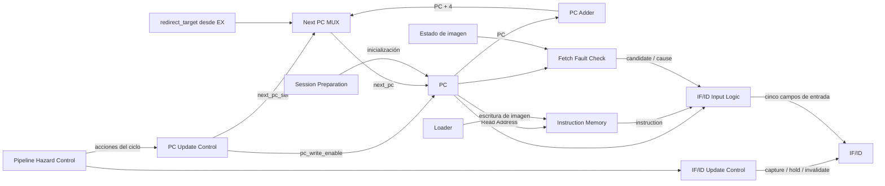
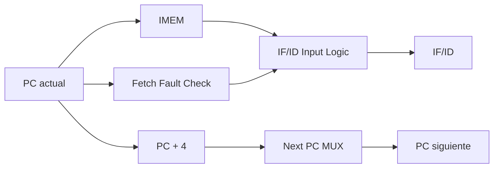

# Etapa IF — Instruction Fetch

## Función de la etapa

IF constituye el frente de entrada del pipeline. Su función es mantener la dirección de búsqueda actual, obtener desde IMEM la palabra asociada a esa dirección y preparar la información que llegará a ID durante el ciclo siguiente.

La etapa también determina si esa búsqueda puede representar una instrucción válida. Una dirección desalineada, una búsqueda fuera de la capacidad de IMEM o una búsqueda fuera de la imagen cargada generan un **candidato de fault de fetch**. IF detecta y transporta ese candidato; la confirmación ocurre posteriormente en ID, donde se puede dar prioridad a los eventos de las instrucciones anteriores.

La etapa queda delimitada por el PC en su entrada de estado y por el registro IF/ID en su salida. El control del pipeline puede hacer que IF avance normalmente, redirija la búsqueda, retenga su estado o invalide el trabajo que ya no pertenece al camino correcto.

## Organización interna

La etapa está compuesta por los siguientes bloques:

- `PC Update Control`
- `Next PC MUX`
- `PC`
- `PC Adder`
- `Instruction Memory`
- `Fetch Fault Check`
- `IF/ID Input Logic`
- `IF/ID Update Control`
- registro `IF/ID`



El camino normal del PC y el camino de formación de IF/ID son independientes hasta el registro de salida. El primero determina desde qué dirección se busca; el segundo determina si lo obtenido se representa como una instrucción activa o como un candidato de fault.

## Flujo normal de una búsqueda

Durante un avance normal, el PC actual alimenta simultáneamente al sumador `PC + 4`, a IMEM, al chequeo de fetch y a la lógica de entrada de IF/ID.

Si la búsqueda es válida:

1. IMEM presenta la palabra de 32 bits correspondiente al PC.
2. `Fetch Fault Check` no genera un candidato de fault.
3. `IF/ID Input Logic` forma una entrada con una instrucción activa.
4. `IF/ID Update Control` ordena la captura.
5. El PC adopta `PC + 4`.

Después del flanco, ID observa la instrucción que pertenecía al PC anterior, mientras IF comienza la búsqueda correspondiente al nuevo valor del PC.



Los valores utilizados para la captura corresponden al estado previo al flanco. Por lo tanto, el incremento del PC y la captura de IF/ID ocurren en el mismo flanco sin que IF/ID pierda la dirección de origen de la instrucción.

## `PC Update Control`

`PC Update Control` transforma la acción seleccionada por `Pipeline Hazard Control` en los controles locales del PC.

### Entradas

| Señal | Origen |
|---|---|
| `act_normal` | `Pipeline Hazard Control` |
| `act_redirect` | `Pipeline Hazard Control` |

### Salidas

| Señal | Destino | Significado |
|---|---|---|
| `pc_write_enable` | `PC.write_enable` | Autoriza la actualización del PC. |
| `next_pc_sel` | `Next PC MUX.sel` | Selecciona entre avance secuencial y redirect. |

Durante avance normal, el PC recibe `PC + 4`; durante redirect, recibe `redirect_target`. Las otras acciones lo retienen. Las ecuaciones de `pc_write_enable` y `next_pc_sel` están en [los controles locales del PC](control_and_hazards.md#pc).

No existe una tercera fuente especial para halt o fault: esas situaciones conservan el PC al no habilitar su escritura.

## `Next PC MUX`

`Next PC MUX` selecciona la única dirección que puede escribirse en el PC durante un ciclo de ejecución.

### Entradas

| Señal | Origen |
|---|---|
| `pc_plus_4[31:0]` | `PC Adder` |
| `redirect_target[31:0]` | resolución de flujo en EX |
| `next_pc_sel` | `PC Update Control` |

### Salida

| Señal | Destino |
|---|---|
| `next_pc[31:0]` | `PC` |

La selección es:

```text
next_pc_sel = 0  →  pc_plus_4
next_pc_sel = 1  →  redirect_target
```

El target de redirect se calcula en EX. IF únicamente lo recibe como una alternativa para el próximo PC; la formación y validación de ese destino pertenecen a [Etapa EX](stage_ex.md) y a [Faults, redirects y terminación](faults_and_termination.md).

## `PC`

El PC es un registro de 32 bits que representa la dirección del frente actual de búsqueda.

### Entradas

| Señal / acción | Origen |
|---|---|
| `next_pc[31:0]` | `Next PC MUX` |
| `write_enable` | `PC Update Control.pc_write_enable` |
| inicialización de sesión | `Session Preparation` |
| `reset` | control global |

### Salidas

| Señal | Destino |
|---|---|
| `PC[31:0]` | `PC Adder` |
| `PC[31:0]` | `Instruction Memory` |
| `PC[31:0]` | `Fetch Fault Check` |
| `PC[31:0]` | `IF/ID Input Logic` |
| `PC[31:0]` | Debug, cuando forma parte del snapshot |

Al preparar una nueva sesión, el PC se inicializa en `0x00000000`. Durante la ejecución secuencial avanza de cuatro en cuatro bytes. Un redirect sustituye ese recorrido por el destino resuelto en EX.

La preparación de sesión, el reset y la autorización de ciclos se desarrollan en [Control de ejecución y sesión](execution_control.md).

## `PC Adder`

`PC Adder` forma la dirección secuencial siguiente.

### Entrada

| Señal | Origen |
|---|---|
| `PC[31:0]` | `PC` |

### Salida

| Señal | Destino |
|---|---|
| `pc_plus_4[31:0]` | `Next PC MUX` |

La operación utiliza aritmética de 32 bits:

```text
pc_plus_4 = (PC + 4) mod 2^32
```

El resultado representa únicamente el siguiente PC secuencial. La validez de la búsqueda asociada a esa dirección se evalúa cuando ese valor pasa a ser el PC actual.

## `Instruction Memory`

IMEM contiene la imagen de instrucciones disponible para la CPU. IF la consulta utilizando el PC como dirección arquitectónica expresada en bytes.

### Entradas

| Señal / interfaz | Origen |
|---|---|
| `Read Address[31:0]` | `PC` |
| interfaz de escritura de imagen | `Loader` |

### Salida

| Señal | Destino |
|---|---|
| `instruction[31:0]` | `IF/ID Input Logic` |

La lectura utilizada por IF es combinacional y entrega una palabra de 32 bits. Durante la carga de un programa, IMEM recibe escrituras desde el Loader; carga y ejecución no actúan como agentes funcionales concurrentes sobre la misma memoria.

La presencia física de una palabra en IMEM no la convierte por sí sola en parte del programa ejecutable. La búsqueda también se valida contra la imagen confirmada, lo que impide interpretar como instrucciones los residuos de una carga anterior.

La organización, capacidad, direccionamiento y ownership de IMEM se detallan en [Arquitectura de memoria](memory_architecture.md).

## `Fetch Fault Check`

`Fetch Fault Check` determina si la búsqueda asociada al PC actual puede ingresar al pipeline como una instrucción activa.

### Entradas

| Señal | Origen |
|---|---|
| `PC[31:0]` | `PC` |
| `image_valid` | derivado de `loaded_image_size_bytes != 0` |
| `loaded_image_size_bytes` | estado global de la imagen |
| `IMEM_CAPACITY_BYTES` | configuración de IMEM |

### Condiciones de búsqueda

El chequeo comprueba la alineación a cuatro bytes y que toda la región de búsqueda quede dentro de la capacidad física y de la imagen confirmada. El cálculo del extremo de la región utiliza 33 bits; una dirección inválida no se admite mediante truncamiento. Las condiciones completas están en [Arquitectura de memoria](memory_architecture.md#validación-de-fetch).

Si fallan alineación y rango en la misma búsqueda, la causa seleccionada es desalineación. La formación del candidato y sus causas se especifican en [Faults, redirects y terminación](faults_and_termination.md#detección-en-if).

### Salidas

| Señal | Destino |
|---|---|
| `if_fetch_fault_candidate` | `IF/ID Input Logic` |
| `if_fetch_fault_cause[2:0]` | `IF/ID Input Logic` |

Las causas utilizadas por IF son:

| Código | Condición |
|---|---|
| `000` | `instruction-address-misaligned` |
| `001` | `instruction-access-fault` |

`Fetch Fault Check` no tiene un camino directo hacia `Pipeline Hazard Control`. IF detecta el candidato y lo transporta mediante IF/ID. La decisión de confirmarlo ocurre posteriormente en ID.

La semántica completa de detección, descarte y confirmación se desarrolla en [Faults, redirects y terminación](faults_and_termination.md).

## `IF/ID Input Logic`

`IF/ID Input Logic` construye los cinco campos que podrían capturarse en IF/ID durante un avance normal.

### Entradas

| Señal | Origen |
|---|---|
| `PC[31:0]` | `PC` |
| `instruction[31:0]` | `Instruction Memory` |
| `if_fetch_fault_candidate` | `Fetch Fault Check` |
| `if_fetch_fault_cause[2:0]` | `Fetch Fault Check` |

### Fetch válido

Cuando no existe candidato de fault:

```text
ifid_in_valid             = 1
ifid_in_pc                = PC
ifid_in_instruction       = instruction
ifid_in_fetch_fault_valid = 0
ifid_in_fetch_fault_cause = 3'b000
```

El valor cero de `fetch_fault_cause` es determinista, pero carece de significado de fault cuando `fetch_fault_valid=0`.

### Fetch candidato

Cuando `Fetch Fault Check` detecta un problema:

```text
ifid_in_valid             = 0
ifid_in_pc                = PC
ifid_in_instruction       = 32'b0
ifid_in_fetch_fault_valid = 1
ifid_in_fetch_fault_cause = if_fetch_fault_cause
```

La palabra cero no representa una instrucción. El candidato queda identificado exclusivamente por `fetch_fault_valid`, su causa y el PC asociado.

### Salidas

| Señal | Destino |
|---|---|
| `ifid_in_valid` | `IF/ID.valid` |
| `ifid_in_pc[31:0]` | `IF/ID.pc` |
| `ifid_in_instruction[31:0]` | `IF/ID.instruction` |
| `ifid_in_fetch_fault_valid` | `IF/ID.fetch_fault_valid` |
| `ifid_in_fetch_fault_cause[2:0]` | `IF/ID.fetch_fault_cause` |

Esta lógica prepara una entrada posible; la captura efectiva depende de `IF/ID Update Control`.

## `IF/ID Update Control`

`IF/ID Update Control` convierte la acción global del pipeline en una de tres operaciones locales sobre el registro IF/ID: **capturar**, **retener** o **invalidar**.

### Entradas

Todas las entradas provienen de `Pipeline Hazard Control`:

- `act_ex_fault`
- `act_halt`
- `act_redirect`
- `act_id_fault`
- `act_load_use`
- `act_normal`
- `act_drain_load_use`
- `act_drain_advance`

### Salidas

| Señal | Destino |
|---|---|
| `capture` | `IF/ID.capture` |
| `hold` | `IF/ID.hold` |
| `invalidate` | `IF/ID.invalidate` |

La captura, retención e invalidación se derivan de las ocho acciones según [los controles locales de IF/ID](control_and_hazards.md#ifid). En ausencia de una acción de pipeline y de una prioridad global superior, el registro conserva su estado.

`act_drain_load_use` permanece en ese contrato combinacional, aunque no sea alcanzable desde una sesión legal. La distinción entre esta rama artificial y el drain legal se explica en [Control del pipeline y hazards](control_and_hazards.md#act_drain_load_use).

## Registro `IF/ID`

IF/ID es el registro que conecta la búsqueda con la decodificación. Conserva una instrucción obtenida correctamente o un candidato de fault de fetch, pero nunca ambas cosas simultáneamente en un estado legal.

### Campos

El [contrato de IF/ID](cpu_pipeline.md#registro-ifid) define sus cinco campos y anchos, incluida la validez independiente del candidato de fetch. Las conexiones locales de esos campos son las siguientes.

### Entradas de datos

| Campo | Origen |
|---|---|
| `valid` | `IF/ID Input Logic.ifid_in_valid` |
| `pc` | `IF/ID Input Logic.ifid_in_pc` |
| `instruction` | `IF/ID Input Logic.ifid_in_instruction` |
| `fetch_fault_valid` | `IF/ID Input Logic.ifid_in_fetch_fault_valid` |
| `fetch_fault_cause` | `IF/ID Input Logic.ifid_in_fetch_fault_cause` |

### Entradas de control

| Señal / acción | Origen |
|---|---|
| `capture` | `IF/ID Update Control` |
| `hold` | `IF/ID Update Control` |
| `invalidate` | `IF/ID Update Control` |
| clear de sesión | `Session Preparation` |

### Salidas hacia ID

IF/ID entrega a la etapa siguiente:

- `valid`
- `pc[31:0]`
- `instruction[31:0]`
- `fetch_fault_valid`
- `fetch_fault_cause[2:0]`

Los slices `instruction[19:15]`, `instruction[24:20]` e `instruction[11:7]` se utilizan directamente en ID cuando corresponden a los campos `rs1`, `rs2` y `rd`; no constituyen registros adicionales dentro de IF/ID.

El detalle de cómo ID interpreta esta información se desarrolla en [Etapa ID](stage_id.md).

## Retención durante `load-use`

Una dependencia `load-use` no permite que IF/ID sea sobrescrito por la búsqueda que se encuentra actualmente en IF.

Durante `act_load_use`:

- el PC permanece retenido;
- IF/ID conserva íntegramente sus cinco campos;
- ID/EX recibe una bubble;
- las instrucciones anteriores continúan avanzando.

Si el PC retenido produce simultáneamente un candidato de fetch, ese candidato no se captura en ese ciclo. Como el PC tampoco cambia, `Fetch Fault Check` vuelve a detectar la misma condición cuando la ejecución pueda avanzar.

Este comportamiento mantiene la instrucción consumidora en IF/ID y evita introducir un camino especial de confirmación de fault desde IF.

La detección de `load-use` y su prioridad respecto de otras acciones se detalla en [Control del pipeline y hazards](control_and_hazards.md). La secuencia específica de un candidato de fetch retenido se desarrolla en [Faults, redirects y terminación](faults_and_termination.md).

<a id="redirects-y-descarte-del-trabajo-joven"></a>

## Redirects y descarte de instrucciones posteriores

Cuando EX resuelve un cambio de flujo válido, `act_redirect` provoca dos efectos simultáneos sobre IF:

- el PC captura `redirect_target`;
- IF/ID se invalida.

La palabra presentada por IMEM para el PC anterior y cualquier candidato de fetch asociado a ese camino se descartan. En el ciclo siguiente, IF comienza la búsqueda desde el nuevo PC.

De esta forma, un candidato de fault detectado sobre una búsqueda posterior no se convierte en fault si una instrucción anterior redirige el flujo antes de que ese candidato sea confirmado.

## Halt, faults y drenado

La confirmación de `halt`, de un fault en EX o de un fault en ID detiene la admisión de nuevo trabajo desde IF. En esos casos el PC permanece retenido e IF/ID se invalida.

Durante un drenado legal tampoco se incorporan nuevas instrucciones. El pipeline completa únicamente el trabajo anterior que todavía permanece en etapas posteriores.

IF no confirma nuevos faults ni `halt` durante el drenado. La lógica de terminación y drenado se desarrolla en [Faults, redirects y terminación](faults_and_termination.md) y en [Control de ejecución y sesión](execution_control.md).

## Resumen de comportamiento

| Situación | PC | IF/ID |
|---|---|---|
| Avance normal | `PC + 4` | Captura instrucción o candidato de fetch |
| Redirect | `redirect_target` | Invalida |
| Load-use | Retiene | Retiene |
| Halt confirmado | Retiene | Invalida |
| Fault EX confirmado | Retiene | Invalida |
| Fault ID confirmado | Retiene | Invalida |
| Drenado | Retiene | Invalida en el avance alcanzable |
| HOLD sin ciclo de la CPU | Retiene | Retiene |

La tabla resume únicamente el comportamiento visible de IF. La selección exacta entre las ocho acciones del pipeline pertenece a [Control del pipeline y hazards](control_and_hazards.md).

## Trazabilidad

- [Pipeline CPU](cpu_pipeline.md): organización general de IF y contrato del registro IF/ID.
- [Datapath](datapath.md): bloques combinacionales y caminos de datos relacionados.
- [Control del pipeline y hazards](control_and_hazards.md): acciones, retenciones, invalidaciones y `load-use`.
- [Arquitectura de memoria](memory_architecture.md): IMEM, imagen confirmada, direccionamiento y validación de región.
- [Faults, redirects y terminación](faults_and_termination.md): detección y confirmación de fetch faults, redirects y terminación por `halt` o fault.
- [Control de ejecución y sesión](execution_control.md): autorización de ciclos, preparación, reset y drenado.
