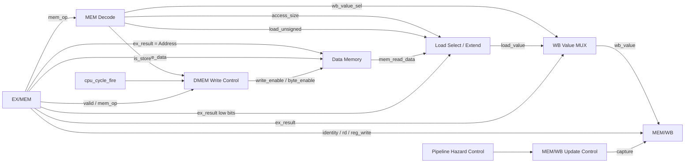
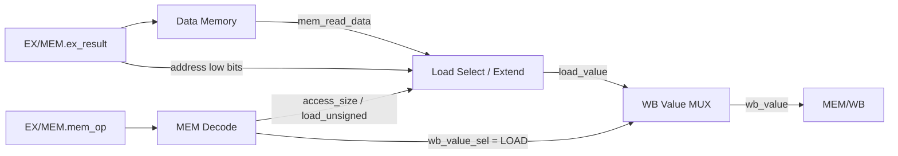
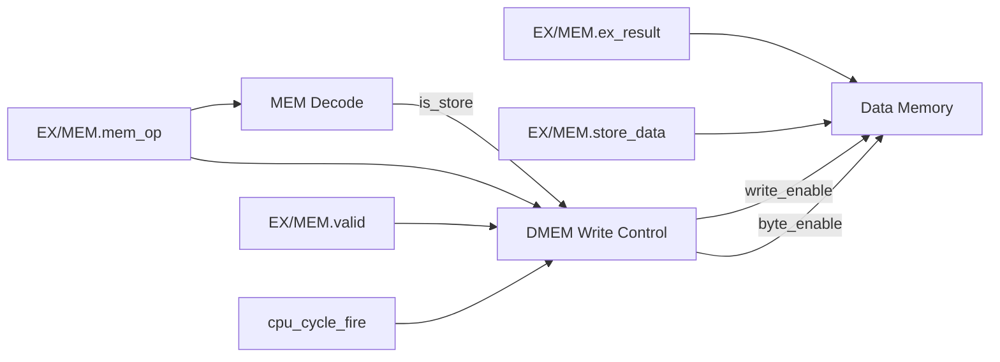
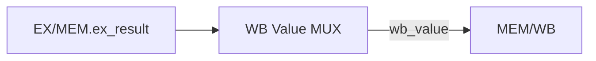

# Etapa MEM — Memory

## Función de la etapa

MEM recibe desde EX/MEM una instrucción que ya completó su ejecución en EX. En esta etapa se resuelven los efectos relacionados con Data Memory y se consolida el valor que, si la instrucción escribe un registro, continuará hacia WB.

La función concreta de MEM depende de la clase de instrucción:

- un **load** utiliza la dirección calculada en EX para leer DMEM y producir el valor cargado;
- un **store** utiliza la dirección y el dato calculados en EX para modificar DMEM;
- una instrucción que ya produjo su resultado en EX simplemente transporta ese resultado hacia MEM/WB;
- una instrucción sin escritura de registro puede atravesar la etapa sin producir un nuevo efecto sobre el Register File.

Los chequeos de alineación y rango de loads y stores ya ocurrieron en EX. Por eso, una operación de memoria que alcanza MEM como entrada válida representa un acceso arquitectónicamente admitido. MEM no vuelve a decidir si la dirección es válida: realiza el acceso correspondiente y forma el resultado que continúa por el pipeline.

Al igual que en EX, la lógica combinacional de MEM se evalúa en paralelo durante el ciclo. La clase de operación almacenada en `EX/MEM.mem_op` determina qué caminos tienen significado funcional y qué valor selecciona finalmente `WB Value MUX`.

## Organización general

La etapa puede entenderse mediante tres caminos principales:

1. **Decodificación local de memoria**, que deriva de `mem_op` el tipo y tamaño de acceso.
2. **Camino de DMEM**, que realiza la lectura de un load o la escritura de un store.
3. **Camino de writeback**, que selecciona entre el valor leído de DMEM y el resultado previamente producido en EX.

El registro MEM/WB consolida la salida de la etapa en un único campo `wb_value`.



Los caminos anteriores no representan subetapas temporales. `MEM Decode`, la lectura combinacional de DMEM, la extensión de loads y la selección de `wb_value` se resuelven dentro del mismo ciclo de MEM. Un store, en cambio, hace commit de su escritura en el flanco correspondiente al ciclo efectivo.

## Qué recibe MEM

EX/MEM entrega ocho campos:

- `valid`
- `pc[31:0]`
- `instruction[31:0]`
- `rd[4:0]`
- `reg_write`
- `mem_op[3:0]`
- `ex_result[31:0]`
- `store_data[31:0]`

El significado de `ex_result` ya quedó determinado en EX. Para una instrucción aritmética, LUI o un salto con enlace contiene el resultado arquitectónico. Para un load o store contiene la dirección efectiva.

`store_data` solamente adquiere significado funcional para stores. Para las demás clases de instrucción puede conservar un valor residual sin producir efectos.

## Recorridos por clase de instrucción

### Loads

Los loads son las instrucciones para las que MEM produce un nuevo valor arquitectónico. EX ya calculó y validó la dirección; MEM utiliza esa dirección para leer DMEM y convertir los bytes obtenidos en un valor de 32 bits.

El camino es:



Para todos los loads:

```text
address = EX/MEM.ex_result
```

`MEM Decode` distingue el tamaño del acceso y la política de extensión:

| Instrucción | Bytes | Extensión |
|---|---:|---|
| `lb` | 1 | signo |
| `lh` | 2 | signo |
| `lw` | 4 | sin cambio |
| `lbu` | 1 | cero |
| `lhu` | 2 | cero |

La lectura de DMEM presenta datos lógicos y `Load Select / Extend` identifica los bytes de la dirección solicitada, los ensambla y aplica la extensión para producir `load_value[31:0]`. En la vista por lanes, los bits bajos de la dirección identifican la posición del byte o halfword dentro de la word.

Para un load:

```text
wb_value = load_value
```

El dato cargado queda disponible para forwarding normal recién después de ser capturado en MEM/WB. No existe un bypass directo `DMEM → EX`.

### `LB` y `LBU`

Ambas instrucciones leen un byte. La diferencia aparece únicamente en la extensión aplicada al resultado.

Conceptualmente:

```text
LB:
load_value = sign_extend(byte, 32)

LBU:
load_value = zero_extend(byte, 32)
```

Si el byte leído tiene el bit más significativo en uno, `LB` completa los bits superiores con unos, mientras `LBU` los completa con ceros.

### `LH` y `LHU`

Estas instrucciones leen dos bytes consecutivos ya validados y los interpretan en orden little-endian.

Conceptualmente:

```text
halfword = {byte_address_plus_1, byte_address}

LH:
load_value = sign_extend(halfword, 32)

LHU:
load_value = zero_extend(halfword, 32)
```

La dirección menor contiene los bits menos significativos del halfword.

### `LW`

`LW` utiliza los cuatro bytes del acceso para formar directamente el valor de 32 bits:

```text
load_value = {
    byte_address_plus_3,
    byte_address_plus_2,
    byte_address_plus_1,
    byte_address
}
```

No existe una extensión posterior porque el tamaño leído ya coincide con el ancho del Register File.

La organización exacta de los byte lanes, el cero lógico y la semántica little-endian se desarrollan en [Arquitectura de memoria](memory_architecture.md).

### Stores

Los stores no producen un valor para el Register File. Su efecto arquitectónico ocurre en MEM mediante una escritura síncrona sobre DMEM.

EX ya dejó preparados dos valores separados:

```text
EX/MEM.ex_result = dirección efectiva
EX/MEM.store_data = dato del store
```

El recorrido es:



La escritura utiliza el [predicado de commit de DMEM Write Control](#dmem-write-control): solo un store válido de EX/MEM participa de un ciclo efectivo de la CPU.

Cuando se cumple:

```text
address = EX/MEM.ex_result
data    = EX/MEM.store_data
```

`mem_op` determina cuántos bytes participan:

| Instrucción | Efecto |
|---|---|
| `sb` | escribe el byte menos significativo de `store_data` |
| `sh` | escribe los 16 bits menos significativos |
| `sw` | escribe los 32 bits |

Los bytes no seleccionados conservan su contenido y su estado lógico.

### `SB`

`SB` actualiza un único byte:

```text
store_byte = EX/MEM.store_data[7:0]
```

La dirección efectiva identifica el byte arquitectónico que recibe ese valor.

### `SH`

`SH` actualiza dos bytes consecutivos:

```text
byte menor     ← store_data[7:0]
byte siguiente ← store_data[15:8]
```

El orden respeta la representación little-endian.

### `SW`

`SW` actualiza cuatro bytes:

```text
address + 0 ← store_data[7:0]
address + 1 ← store_data[15:8]
address + 2 ← store_data[23:16]
address + 3 ← store_data[31:24]
```

La validez de rango y alineación de estos accesos ya fue resuelta en EX. Un store que produjo un fault propio nunca llega a MEM con `EX/MEM.valid=1`.

### Instrucciones con resultado producido en EX

Las operaciones R-type, las operaciones I-type aritméticas y de shift, `LUI`, `JAL` y `JALR` llegan a MEM con su resultado arquitectónico ya contenido en `EX/MEM.ex_result`.

No necesitan transformar ese dato:



Para estas instrucciones:

```text
wb_value = EX/MEM.ex_result
```

Según la clase de instrucción, ese valor ya representa:

- un resultado de ALU;
- el inmediato de `LUI`;
- `PC + 4` para `JAL` o `JALR`.

MEM actúa como etapa de paso para ese resultado y lo consolida en el formato único que WB consumirá.

### Branches

`BEQ` y `BNE` ya resolvieron su condición y su eventual redirect en EX. Cuando llegan válidamente a MEM, no realizan un acceso a DMEM ni escriben un registro.

`MEM Decode` interpreta `mem_op=NONE`, por lo que:

```text
is_load  = 0
is_store = 0
```

`WB Value MUX` puede presentar combinacionalmente `EX/MEM.ex_result`, pero ese valor no produce un efecto arquitectónico porque `reg_write=0`.

La instrucción continúa por el pipeline únicamente para conservar el modelo temporal y la observabilidad de la instrucción activa.

### `halt` y faults propios de EX

`halt` y una instrucción cuyo fault se confirma en EX no ingresan válidamente a EX/MEM.

Por lo tanto, MEM no recibe esas instrucciones como operaciones activas y no necesita un camino especial para neutralizar sus efectos. La invalidez establecida al salir de EX impide tanto escrituras en DMEM como futuros writebacks.

El tratamiento de esas instrucciones y de las anteriores se desarrolla en [Faults, redirects y terminación](faults_and_termination.md).

## Resumen de recorridos

| Clase | Acceso DMEM | Valor hacia MEM/WB | Efecto arquitectónico en MEM |
|---|---|---|---|
| `LB/LH/LW/LBU/LHU` | lectura | `load_value` | forma dato de load |
| `SB/SH/SW` | escritura | irrelevante para RF | modifica DMEM |
| R-type | ninguno | `EX/MEM.ex_result` | ninguno adicional |
| I-type aritm./shift | ninguno | `EX/MEM.ex_result` | ninguno adicional |
| `LUI` | ninguno | `EX/MEM.ex_result` | ninguno adicional |
| `JAL/JALR` | ninguno | `EX/MEM.ex_result` | ninguno adicional |
| `BEQ/BNE` | ninguno | irrelevante | ninguno |
| entrada inválida | ninguno efectivo | irrelevante | ninguno |

La tabla muestra qué camino tiene significado para cada clase. DMEM y los muxes pueden presentar valores combinacionales para otras entradas, pero `valid`, `mem_op` y `reg_write` determinan cuáles pueden producir efectos.

# Bloques que implementan la etapa

## Decodificación local de memoria

### `MEM Decode`

`MEM Decode` interpreta `EX/MEM.mem_op` y genera los controles locales que utiliza MEM.

### Entrada

| Señal | Origen |
|---|---|
| `EX/MEM.mem_op[3:0]` | `EX/MEM` |

La codificación recibida está fijada en [los controles generados en ID](stage_id.md#codificación-de-los-controles). MEM la interpreta sin modificarla ni registrar campos derivados.

A partir de ella se derivan localmente:

```text
is_load =
    mem_op ∈ {LB, LH, LW, LBU, LHU}

is_store =
    mem_op ∈ {SB, SH, SW}
```

El tamaño queda:

```text
access_size = 00 (BYTE)     → LB, LBU, SB
access_size = 01 (HALFWORD) → LH, LHU, SH
access_size = 10 (WORD)     → LW, SW
access_size = 11            → reservado
```

y:

```text
load_unsigned =
    (mem_op == LBU)
    || (mem_op == LHU)
```

El selector del valor de writeback se obtiene directamente de la clase de memoria:

```text
wb_value_sel =
    is_load(EX/MEM.mem_op)
```

### Salidas

| Señal | Destino |
|---|---|
| `is_store` | `DMEM Write Control` |
| `access_size[1:0]` | `Load Select / Extend` |
| `load_unsigned` | `Load Select / Extend` |
| `wb_value_sel` | `WB Value MUX` |

`is_load` puede mantenerse como señal interna para formar `wb_value_sel`; no necesita exponerse como un puerto adicional si ningún otro bloque lo consume.

Las mismas funciones de clasificación se utilizan en otros puntos de la CPU a partir del `mem_op` registrado en cada etapa, sin transportarlas como nuevos campos de pipeline.

## Camino de Data Memory

### `Data Memory`

DMEM es una memoria byte-addressed organizada lógicamente para soportar accesos de uno, dos y cuatro bytes.

### Entradas desde la CPU

| Señal | Origen |
|---|---|
| `Address[31:0]` | `EX/MEM.ex_result` |
| `Write Data[31:0]` | `EX/MEM.store_data` |
| `write_enable` | `DMEM Write Control.dmem_store_fire` |
| `byte_enable` | `DMEM Write Control` |

### Entrada de mantenimiento

| Señal / acción | Origen |
|---|---|
| preparación de sesión | `Session Preparation` |

### Salida

| Señal | Destino |
|---|---|
| `mem_read_data[31:0]` | `Load Select / Extend` |

La lectura es combinacional. La escritura de un store ocurre síncronamente cuando `dmem_store_fire=1`.

Arquitectónicamente, cada byte que no fue escrito durante la sesión actual se observa como cero. La organización de referencia conserva una validez independiente por byte:

```text
logical_byte[a] =
    valid[a] ? data[a] : 8'h00
```

Un store actualiza de manera coherente tanto el dato como la validez de cada byte seleccionado. Un byte no seleccionado conserva ambos.

Esta semántica impide que una sesión nueva observe como datos propios residuos de una ejecución anterior.

La organización completa de DMEM, sus capacidades y la preparación del cero lógico se desarrollan en [Arquitectura de memoria](memory_architecture.md).

### `Load Select / Extend`

`Load Select / Extend` convierte la lectura de DMEM en el valor arquitectónico de 32 bits correspondiente al load.

### Entradas

| Señal | Origen |
|---|---|
| `mem_read_data[31:0]` | `Data Memory` |
| `address_low_bits[1:0]` | `EX/MEM.ex_result[1:0]` |
| `access_size[1:0]` | `MEM Decode` |
| `load_unsigned` | `MEM Decode` |

### Salida

| Señal | Destino |
|---|---|
| `load_value[31:0]` | `WB Value MUX` |

La selección antecede a la extensión. Para una dirección `A`, el byte seleccionado es `logical_byte[A]`, el halfword es `{logical_byte[A+1], logical_byte[A]}` y la word reúne los cuatro bytes en orden little-endian. En una lectura presentada por lanes de word, `address_low_bits` selecciona el lane de byte o el par de lanes del halfword; una word válida utiliza los cuatro lanes.

El comportamiento de extensión sobre esos valores ya seleccionados es:

```text
BYTE + signed:
    sign_extend(selected_byte)

BYTE + unsigned:
    zero_extend(selected_byte)

HALFWORD + signed:
    sign_extend(selected_halfword)

HALFWORD + unsigned:
    zero_extend(selected_halfword)

WORD:
    assembled_word[31:0]
```

`mem_read_data`, posición de dirección, tamaño y signo describen conjuntamente el camino conceptual de selección/extensión. Esta descripción no fija un empaquetado físico nuevo para la interfaz de DMEM: una realización que preseleccione bytes dentro del acceso conserva la misma selección por dirección. La organización por lanes y el cero lógico se especifican en [Arquitectura de memoria](memory_architecture.md#organización-little-endian).

## Escritura de stores

### `DMEM Write Control`

`DMEM Write Control` determina si la instrucción que ocupa MEM hace commit de una escritura y qué tamaño de store realiza.

### Entradas

| Señal | Origen |
|---|---|
| `cpu_cycle_fire` | `Cycle Authorization` |
| `EX/MEM.valid` | `EX/MEM` |
| `is_store` | `MEM Decode` |
| `EX/MEM.mem_op[3:0]` | `EX/MEM` |

La habilitación efectiva es:

```text
dmem_store_fire =
    cpu_cycle_fire
    && EX/MEM.valid
    && is_store
```

### Salidas

| Señal | Destino |
|---|---|
| `dmem_store_fire` / `write_enable` | `Data Memory.write_enable` |
| `byte_enable` | `Data Memory.byte_enable` |

`byte_enable` representa la cantidad de bytes seleccionados por `SB`, `SH` o `SW`; `Data Memory` combina esa información con la dirección efectiva para actualizar los bytes correspondientes.

El mismo `dmem_store_fire` gobierna la actualización de la metadata lógica asociada a esos bytes. El dato y su validez cambian como un único efecto del store.

MEM no repite los chequeos de alineación o rango. El gating por `EX/MEM.valid` expresa el resultado de la validación realizada en EX.

<a id="store-anterior-frente-a-una-frontera-joven"></a>

### Store anterior a la instrucción que provoca `halt` o fault

Un store válido que ya se encuentra en MEM es anterior a cualquier instrucción situada ese mismo ciclo en EX, ID o IF.

Por eso, confirmar el fault o `halt` de una instrucción posterior no cancela ese store. Es posible que, en el mismo ciclo:

```text
dmem_store_fire = 1
```

y simultáneamente se confirme `halt` o el fault de una instrucción posterior.

El store anterior conserva su efecto porque todavía pertenece al prefijo válido del programa.

Durante HOLD, en cambio, `cpu_cycle_fire=0`, por lo que una instrucción retenida en EX/MEM no repite su escritura.

La relación entre el orden de las instrucciones y los efectos que se conservan se desarrolla en [Faults, redirects y terminación](faults_and_termination.md).

## Formación del valor de writeback

### `WB Value MUX`

Todas las instrucciones que eventualmente escriben el Register File convergen en MEM sobre un único dato de 32 bits: `wb_value`.

### Entradas

| Señal | Origen |
|---|---|
| `EX/MEM.ex_result[31:0]` | `EX/MEM` |
| `load_value[31:0]` | `Load Select / Extend` |
| `wb_value_sel` | `MEM Decode` |

### Salida

| Señal | Destino |
|---|---|
| `wb_value[31:0]` | `MEM/WB.wb_value` |

La selección es:

```text
wb_value_sel = 0  → EX/MEM.ex_result
wb_value_sel = 1  → load_value
```

Como:

```text
wb_value_sel = is_load(EX/MEM.mem_op)
```

se obtiene:

```text
load
    → wb_value = load_value

resto
    → wb_value = EX/MEM.ex_result
```

Para stores, branches o entradas inválidas, el dato seleccionado puede existir combinacionalmente pero no produce escritura porque `reg_write` o `valid` no habilitan WB.

Esta convergencia tiene una consecuencia importante: MEM/WB no necesita recordar de dónde provino el resultado. WB y el forwarding posterior utilizan siempre el mismo campo `wb_value`.

## Salida de la etapa

### `MEM/WB Update Control`

`MEM/WB Update Control` determina cuándo el registro de salida captura el estado producido por MEM.

Recibe las ocho acciones de `Pipeline Hazard Control` y produce `capture`. La [ecuación local de MEM/WB](control_and_hazards.md#memwb) habilita la captura para cualquiera de las acciones seleccionadas en un ciclo efectivo. Durante HOLD, MEM/WB conserva su estado.

MEM/WB no necesita una operación especial de invalidación. Si EX/MEM contiene una entrada inválida, la captura transporta `valid=0` hacia MEM/WB. Si contiene una instrucción anterior válida, esa instrucción continúa incluso cuando se acaba de confirmar el fault o `halt` de una instrucción posterior.

La tabla global de actualización se desarrolla en [Control del pipeline y hazards](control_and_hazards.md).

### Registro `MEM/WB`

MEM/WB es el último registro interetapa antes de Write Back. En este punto, cualquier instrucción que escribe en el banco de registros ya posee un único valor arquitectónico listo para utilizarse.

### Campos

El [contrato de MEM/WB](cpu_pipeline.md#registro-memwb) define sus seis campos y anchos. MEM aporta un único valor final de writeback, sin registrar sus fuentes por separado.

### Entradas

| Campo | Origen |
|---|---|
| `valid` | `EX/MEM.valid` |
| `pc` | `EX/MEM.pc` |
| `instruction` | `EX/MEM.instruction` |
| `rd` | `EX/MEM.rd` |
| `reg_write` | `EX/MEM.reg_write` |
| `wb_value` | `WB Value MUX` |

### Control

| Señal / acción | Origen |
|---|---|
| `capture` | `MEM/WB Update Control` |
| clear de sesión | `Session Preparation` |

MEM/WB ya no conserva `mem_op`, `store_data`, `ex_result` ni `load_value` por separado. Todos los posibles datos destinados a un registro convergieron previamente en `wb_value`.

El mismo `wb_value` se utiliza después para:

- escritura del Register File;
- bypass WB→ID;
- forwarding MEM/WB→EX.

El consumo de estos campos se desarrolla en [Etapa WB](stage_wb.md).

## Efectos simultáneos dentro de MEM

En un ciclo efectivo, la etapa puede realizar simultáneamente dos acciones sobre la instrucción que ocupa EX/MEM:

- hacer commit de un store en DMEM, si corresponde;
- capturar en MEM/WB el contexto que continuará hacia WB.

Para un store, la segunda acción transporta una instrucción con `reg_write=0`, por lo que su paso posterior por WB no genera escritura.

Para un load, la lectura combinacional y la formación de `load_value` alimentan la captura de `wb_value` en el mismo flanco. La escritura del Register File ocurre recién cuando esa entrada de MEM/WB alcance WB en un ciclo posterior.

Esta separación distingue el punto de commit de cada tipo de efecto:

```text
store → efecto arquitectónico en MEM
load  → dato consolidado en MEM, efecto sobre RF en WB
```

## Comportamiento resumido de MEM

| Situación | DMEM | `wb_value` | MEM/WB |
|---|---|---|---|
| Load válido | lectura | `load_value` | captura |
| Store válido | escritura síncrona | irrelevante para RF | captura con `reg_write=0` |
| R/I/LUI | sin acceso | `EX/MEM.ex_result` | captura |
| JAL/JALR | sin acceso | enlace en `EX/MEM.ex_result` | captura |
| BEQ/BNE | sin acceso | irrelevante | captura con `reg_write=0` |
| Entrada EX/MEM inválida | sin efecto | irrelevante | propaga `valid=0` |
| HOLD sin ciclo efectivo | sin store | conserva combinacionalmente lecturas | retiene |

## Trazabilidad

- [Pipeline CPU](cpu_pipeline.md): función general de MEM y contrato del registro MEM/WB.
- [Etapa EX](stage_ex.md): formación de `EX/MEM.ex_result`, `store_data` y `mem_op`.
- [Datapath](datapath.md): dirección, dato de store, selección de load y valor de writeback.
- [Etapa ID](stage_id.md#codificación-de-los-controles): codificación de `mem_op` que MEM interpreta localmente.
- [Arquitectura de memoria](memory_architecture.md): byte addressing, little-endian, cero lógico, validez por byte y capacidades.
- [Control del pipeline y hazards](control_and_hazards.md): acciones de pipeline y actualización de MEM/WB.
- [Faults, redirects y terminación](faults_and_termination.md): conservación de los efectos de las instrucciones anteriores a `halt` o fault.
- [Control de ejecución y sesión](execution_control.md): `cpu_cycle_fire`, HOLD y preparación de sesión.
- [Etapa WB](stage_wb.md): escritura del Register File y uso de `MEM/WB.wb_value`.
