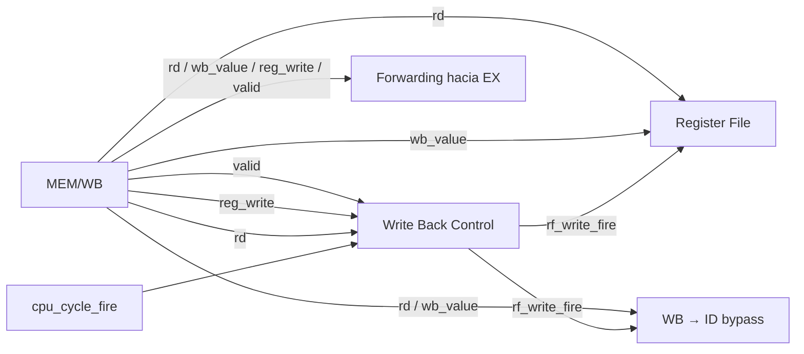
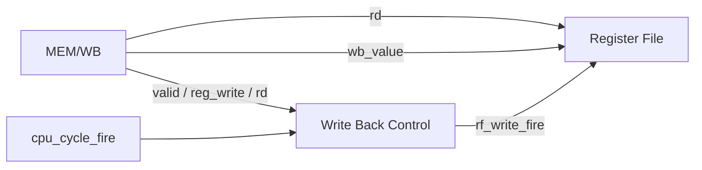
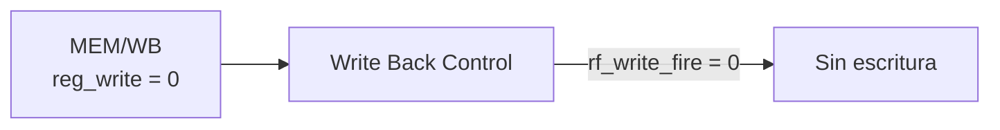

# Etapa WB — Write Back

## Función de la etapa

WB constituye el último punto del recorrido de una instrucción por el pipeline. Cuando una instrucción válida produce un resultado destinado al Register File, esta etapa hace visible ese valor en el registro arquitectónico correspondiente.

A diferencia de EX y MEM, WB no vuelve a calcular ni seleccionar el origen del resultado. Esa convergencia ya ocurrió en MEM: `MEM/WB.wb_value` contiene el valor arquitectónico final, independientemente de que haya surgido de una operación de ALU, de `LUI`, del enlace de `JAL/JALR` o de un load.

Por lo tanto, el trabajo de WB consiste en decidir si la entrada actual de MEM/WB representa una escritura arquitectónica efectiva y, cuando corresponde, aplicar:

```text
Register File[rd] ← wb_value
```

La misma información de MEM/WB también queda disponible para el bypass WB→ID y para el forwarding MEM/WB→EX. Esos caminos no crean resultados nuevos: reutilizan exactamente el valor que WB está en condiciones de escribir.

## Organización general

WB es la etapa más simple del pipeline. Su camino principal se forma con tres campos de MEM/WB y la autorización del ciclo:



El Register File pertenece físicamente al datapath de ID, pero su puerto de escritura recibe el efecto de WB. La flecha de retorno desde MEM/WB hacia el banco de registros representa, por lo tanto, una conexión que cruza varias etapas.

## Qué recibe WB

MEM/WB conserva seis campos:

- `valid`
- `pc[31:0]`
- `instruction[31:0]`
- `rd[4:0]`
- `reg_write`
- `wb_value[31:0]`

No todos participan de la escritura.

Los campos funcionales de WB son:

| Campo | Función en WB |
|---|---|
| `valid` | Indica que MEM/WB contiene una instrucción activa. |
| `rd` | Identifica el registro destino. |
| `reg_write` | Indica que la instrucción produce una escritura arquitectónica. |
| `wb_value` | Contiene el valor final que puede escribirse. |

`pc` e `instruction` conservan la identidad de la instrucción para observación y trazabilidad, pero no intervienen en la actualización del Register File.

## Recorridos por clase de instrucción

### Instrucciones que escriben un registro

En WB convergen todas las instrucciones cuyo resultado termina en `rd`:

- operaciones R-type;
- operaciones I-type aritméticas y shifts;
- `LUI`;
- `JAL`;
- `JALR`;
- `LB`, `LH`, `LW`, `LBU` y `LHU`.

Aunque esos resultados surgieron de caminos diferentes en etapas anteriores, para WB todos tienen exactamente la misma representación:

```text
MEM/WB.rd
MEM/WB.wb_value
MEM/WB.reg_write = 1
```

El recorrido es:



Cuando la escritura es elegible:

```text
RF[MEM/WB.rd] ← MEM/WB.wb_value
```

WB no distingue si `wb_value` provino de ALU, DMEM, un inmediato o `PC + 4`. Esa distinción dejó de ser necesaria al capturar MEM/WB.

### Operaciones R-type e I-type

Para una operación aritmética, lógica, comparación o shift, `wb_value` contiene el resultado producido originalmente por la ALU en EX y transportado a través de MEM.

En WB:

```text
rd       = destino decodificado
wb_value = resultado ALU consolidado
```

No existe una selección adicional.

### `LUI`

Para `LUI`, `wb_value` contiene el inmediato U que EX había seleccionado como `ex_result`.

WB trata ese valor exactamente igual que un resultado de ALU:

```text
RF[rd] ← wb_value
```

### `JAL` y `JALR`

Para `JAL` y `JALR`, el valor que llega a WB es el enlace:

```text
wb_value = instruction_PC + 4
```

El redirect ya se resolvió en EX. WB únicamente aplica la escritura del enlace en `rd`.

Por esta razón, el cambio de flujo y el writeback son efectos separados de una misma instrucción: el primero se resuelve en EX y el segundo se hace visible en WB.

### Loads

Para `LB`, `LH`, `LW`, `LBU` y `LHU`, MEM ya leyó DMEM, ensambló los bytes y realizó la extensión correspondiente.

Cuando el load llega a WB:

```text
wb_value = load_value final de 32 bits
```

No existe un segundo tratamiento signed/unsigned ni una nueva lectura de memoria.

Este mismo `wb_value` ya puede utilizarse como productor normal desde MEM/WB hacia EX. Por eso el dato de un load no necesita un camino especial en WB.

### Instrucciones que no escriben un registro

Stores y branches pueden atravesar MEM/WB con:

```text
reg_write = 0
```

En esos casos, el contenido de `rd` o `wb_value` no produce ningún efecto arquitectónico.

El camino queda conceptualmente:



Esto incluye:

- `SB`, `SH`, `SW`;
- `BEQ`, `BNE`.

Los stores ya hicieron commit en MEM. Los branches ya resolvieron su efecto de control en EX. WB no añade ningún efecto nuevo para estas instrucciones.

### Entradas inválidas

Una entrada con:

```text
MEM/WB.valid = 0
```

no representa una instrucción activa, aunque `rd`, `reg_write` o `wb_value` conserven bits residuales.

La validez forma parte de la condición efectiva de escritura, por lo que esos residuos nunca producen un commit accidental.

### Escrituras dirigidas a `x0`

`x0` permanece permanentemente en cero.

Incluso si una instrucción válida llega con:

```text
reg_write = 1
rd = 0
```

la escritura se suprime:

```text
RF[x0] no cambia
```

La misma condición también impide que ese caso habilite bypass WB→ID.

## Condición efectiva de writeback

La escritura arquitectónica del Register File se resume en un único predicado:

```text
rf_write_fire =
    cpu_cycle_fire
    && MEM/WB.valid
    && MEM/WB.reg_write
    && (MEM/WB.rd != 0)
```

Cada término cumple una función diferente:

- `cpu_cycle_fire` indica que existe un ciclo efectivo de la CPU;
- `MEM/WB.valid` confirma que la entrada representa una instrucción activa;
- `MEM/WB.reg_write` indica que esa instrucción produce un resultado para el banco;
- `MEM/WB.rd != 0` preserva la semántica de `x0`.

Cuando el predicado vale uno:

```text
Write Address = MEM/WB.rd
Write Data    = MEM/WB.wb_value
Write Enable  = 1
```

Cuando vale cero, WB no modifica el Register File.

## Relación con el ciclo efectivo

El writeback ocurre únicamente durante un ciclo efectivo de la CPU.

Esto resulta especialmente importante en STEP y HOLD. Si MEM/WB conserva una instrucción que escribe un registro mientras la CPU está detenida entre dos pasos:

```text
cpu_cycle_fire = 0
```

entonces:

```text
rf_write_fire = 0
```

La instrucción no vuelve a escribir repetidamente el banco por permanecer físicamente almacenada en MEM/WB.

Cuando se autoriza el siguiente ciclo, esa entrada puede hacer commit de su writeback una única vez mientras el pipeline avanza.

La generación de `cpu_cycle_fire`, los modos RUN/STEP y las prioridades globales se desarrollan en [Control de ejecución y sesión](execution_control.md).

<a id="estado-preflanco-y-avance-simultáneo-de-memwb"></a>

## Valores anteriores al flanco y avance simultáneo de MEM/WB

En un mismo flanco pueden ocurrir dos hechos distintos:

1. WB escribe utilizando el contenido **actual** de MEM/WB.
2. MEM/WB captura simultáneamente la nueva salida producida por MEM.

La nueva entrada capturada no es la que escribe el Register File en ese mismo flanco.

Conceptualmente:

```text
antes del flanco:

MEM/WB = instrucción A
MEM    = instrucción B

en el flanco:

A hace commit de su writeback
MEM/WB captura a B

después del flanco:

MEM/WB = instrucción B
```

Esta separación preserva el avance de una etapa por ciclo y evita adelantar artificialmente el resultado de MEM.

<a id="fronteras-jóvenes-y-writeback-de-instrucciones-anteriores"></a>

## Writeback de instrucciones anteriores a un redirect, `halt` o fault

Una instrucción que ya se encuentra en WB es más antigua que las instrucciones situadas simultáneamente en MEM, EX, ID o IF.

Por eso, un redirect, `halt` o fault detectado por una instrucción posterior no cancela retrospectivamente un writeback válido que ya corresponde a MEM/WB.

Por ejemplo:

```text
MEM/WB = I1 válida, con escritura de registro
ID/EX  = I3 que confirma fault
```

Durante el mismo ciclo pueden ocurrir:

```text
I1 → writeback válido
I3 → provoca la confirmación de un fault
```

Confirmar el fault descarta la instrucción que lo provoca y las posteriores, pero conserva los efectos válidos de las anteriores.

El tratamiento preciso de esas instrucciones se desarrolla en [Faults, redirects y terminación](faults_and_termination.md).

## Relación con el bypass WB→ID

WB puede escribir un registro en el mismo ciclo en que ID intenta leerlo. Para que ID observe el valor nuevo de manera independiente de la implementación interna del Register File, la arquitectura utiliza un bypass combinacional explícito.

La misma condición `rf_write_fire` habilita ambos caminos. Las [ecuaciones de bypass](control_and_hazards.md#bypass-wb--id) comparan por separado `rd` con cada índice leído por ID.

Si existe coincidencia, el puerto correspondiente de ID selecciona:

```text
MEM/WB.wb_value
```

en lugar de la salida del Register File anterior al bypass.

Esto significa que la escritura y el bypass describen el mismo valor arquitectónico durante el mismo ciclo:

```text
RF[rd] ← wb_value
```

y, si ID lee ese mismo `rd`:

```text
ID recibe wb_value
```

La organización completa del bypass dentro de ID se desarrolla en [Etapa ID](stage_id.md), y su interacción con forwarding se detalla en [Control del pipeline y hazards](control_and_hazards.md).

## Relación con el forwarding MEM/WB→EX

`MEM/WB.wb_value` también forma una de las entradas de los dos Forward MUX de EX.

Este camino no depende de que la instrucción haya sido originalmente un load, una operación de ALU, `LUI` o un salto con enlace. MEM ya consolidó todos esos orígenes en el mismo campo.

Por eso MEM/WB constituye el primer punto desde el cual un load puede reenviar su dato arquitectónico normal:

```text
MEM/WB.wb_value → Forward MUX A/B
```

La selección efectiva sigue la prioridad general:

```text
EX/MEM > MEM/WB > valor base ID/EX
```

El detalle se desarrolla en [Etapa EX](stage_ex.md) y [Control del pipeline y hazards](control_and_hazards.md).

## El Register File como destino de WB

Aunque el Register File se encuentra dentro de la organización de ID, posee un puerto de escritura gobernado desde WB.

La conexión funcional es:

| Entrada del Register File | Origen |
|---|---|
| `Write Register[4:0]` | `MEM/WB.rd` |
| `Write Data[31:0]` | `MEM/WB.wb_value` |
| `Write Enable` | `rf_write_fire` |

Las lecturas `rs1` y `rs2` permanecen combinacionales en ID. La escritura ocurre síncronamente en el flanco del ciclo efectivo.

El banco mantiene además la regla:

```text
RF[0] = 0
```

independientemente de cualquier contenido residual de `wb_value`.

La estructura completa del banco de registros y sus puertos de lectura se desarrolla en [Etapa ID](stage_id.md).

## Qué instrucciones producen un writeback

| Clase | `reg_write` | Valor en `wb_value` | Efecto en WB |
|---|---:|---|---|
| R-type | 1 | resultado ALU | escribe `rd` |
| I-type aritm./shift | 1 | resultado ALU | escribe `rd` |
| `LUI` | 1 | inmediato U | escribe `rd` |
| `JAL` | 1 | `PC + 4` | escribe `rd` |
| `JALR` | 1 | `PC + 4` | escribe `rd` |
| Loads | 1 | dato cargado y extendido | escribe `rd` |
| Stores | 0 | irrelevante | sin escritura |
| `BEQ/BNE` | 0 | irrelevante | sin escritura |
| entrada inválida | irrelevante | irrelevante | sin escritura |

En cualquiera de las clases que escriben un registro, `rd=0` suprime finalmente la modificación del Register File.

## Final del recorrido de una instrucción

WB no posee un registro interetapa posterior. Una vez que una instrucción activa ocupa MEM/WB y participa del ciclo efectivo correspondiente, su recorrido por el pipeline termina en esta etapa.

Para una instrucción que escribe un registro, el último efecto es la actualización del Register File. Para stores y branches, el efecto arquitectónico ya ocurrió en una etapa anterior y su llegada a WB únicamente completa su tránsito por el pipeline.

La ausencia de un registro posterior también explica por qué MEM/WB contiene solo la información necesaria para el último efecto, forwarding y observación: no existe otra etapa que necesite reconstruir controles consumidos previamente.

## Comportamiento resumido de WB

| Situación | Register File |
|---|---|
| Instrucción válida con `reg_write=1`, `rd!=0` y ciclo efectivo | escribe `wb_value` en `rd` |
| `reg_write=0` | sin escritura |
| `valid=0` | sin escritura |
| `rd=0` | sin escritura |
| HOLD | sin escritura |
| Fault/`halt` posterior | la instrucción anterior elegible conserva su writeback |
| Reset/LOAD/preparación con prioridad global | no se ejecuta un ciclo normal de la CPU |

## Trazabilidad

- [Pipeline CPU](cpu_pipeline.md): función general de WB y contenido de MEM/WB.
- [Etapa MEM](stage_mem.md): formación del único `wb_value` arquitectónico.
- [Etapa ID](stage_id.md): Register File y bypass WB→ID.
- [Etapa EX](stage_ex.md): forwarding desde MEM/WB.
- [Control del pipeline y hazards](control_and_hazards.md): bypass, forwarding y condiciones de validez.
- [Faults, redirects y terminación](faults_and_termination.md): preservación de efectos de instrucciones anteriores.
- [Control de ejecución y sesión](execution_control.md): `cpu_cycle_fire`, RUN, STEP, HOLD y prioridades globales.
- [Arquitectura de Debug](debug_architecture.md): observación del estado arquitectónico y del pipeline.
