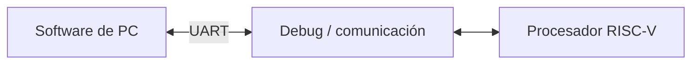
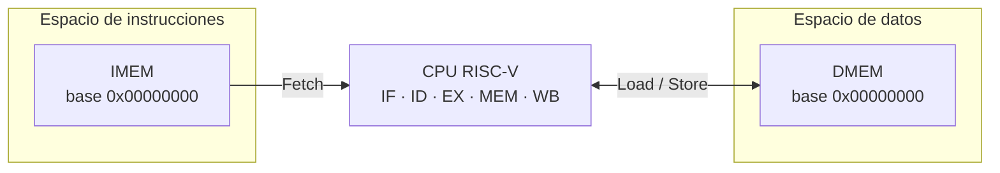
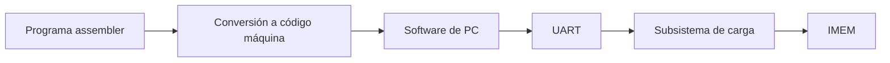
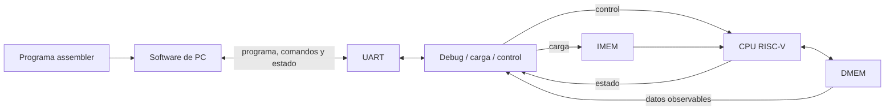

# Visión general del sistema

## El sistema

El sistema implementa sobre FPGA un **procesador RISC-V de 32 bits con pipeline de cinco etapas**. Alrededor del procesador se integran los bloques necesarios para cargar programas desde una computadora, controlar su ejecución y observar su estado mediante una comunicación UART.

El procesador es el núcleo que ejecuta las instrucciones. La UART y la lógica de Debug no intervienen en el recorrido normal de una instrucción: forman la infraestructura que permite programar y manejar el procesador desde el exterior. Del lado de la computadora, una aplicación se encarga de preparar el programa, enviarlo a la FPGA, solicitar su ejecución y presentar la información recibida.

En conjunto, la arquitectura se divide en tres partes principales:

1. **Procesador RISC-V**, responsable de ejecutar el programa.
2. **Subsistema de Debug y comunicación**, responsable de conectar el procesador con la computadora y administrar las operaciones externas.
3. **Software de PC**, responsable de preparar programas y permitir al usuario controlar y observar la ejecución.

## El procesador RISC-V

### Arquitectura de instrucciones

El procesador utiliza **RISC-V** como arquitectura de conjunto de instrucciones. Una arquitectura de instrucciones, o ISA, define el lenguaje máquina que comparten el software y el hardware: establece qué operaciones puede expresar un programa, cómo se codifican y qué efecto produce cada una.

La base utilizada es **RV32I**, la variante entera de 32 bits de RISC-V. El procesador implementa un **subconjunto de 32 instrucciones de RV32I** definido para el sistema, junto con una instrucción adicional denominada `halt`. Las instrucciones RISC-V que quedan fuera de ese subconjunto no forman parte del ISA implementado.

Todas las instrucciones implementadas ocupan 32 bits. Un programa ejecutable está formado, por lo tanto, por una secuencia de palabras de instrucción que la CPU obtiene y procesa en el orden determinado por el flujo del programa.

La codificación de las instrucciones y la lógica de decodificación se desarrollan en [Etapa ID](stage_id.md#decoder). La reconstrucción de inmediatos y sus recorridos de datos se describen en [Datapath](datapath.md).

### Estado de ejecución

El estado sobre el que trabaja la CPU se organiza alrededor de los siguientes elementos:

- **Program Counter (PC):** identifica la dirección desde la que se busca la próxima instrucción. Al iniciar una nueva ejecución comienza en la dirección cero y, mientras no haya un cambio de flujo, avanza de cuatro en cuatro bytes.
- **Banco de registros:** contiene 32 registros arquitectónicos de 32 bits utilizados como operandos y destinos de las instrucciones.
- **Registro `x0`:** forma parte del banco de registros, pero conserva siempre el valor cero y no puede ser modificado por una escritura.
- **Instruction Memory (IMEM):** contiene la imagen del programa que puede ser buscada por la etapa IF.
- **Data Memory (DMEM):** contiene los datos utilizados por las instrucciones de load y store.

IMEM y DMEM pertenecen a espacios lógicos independientes.

## El pipeline de cinco etapas

### División de la ejecución

Una instrucción no se procesa mediante una única operación indivisible. Su ejecución requiere buscarla, interpretarla, obtener sus operandos, realizar los cálculos correspondientes, acceder a memoria cuando sea necesario y hacer visible el resultado cuando corresponda.

La CPU distribuye ese trabajo entre cinco etapas:

- **IF — Instruction Fetch:** obtiene la próxima instrucción desde IMEM.
- **ID — Instruction Decode:** interpreta la instrucción y obtiene la información necesaria para ejecutarla.
- **EX — Execute:** realiza las operaciones de cálculo y resuelve los cambios de flujo.
- **MEM — Memory:** atiende los accesos a DMEM.
- **WB — Write Back:** escribe en el banco de registros los resultados que correspondan.

La separación en etapas permite que distintas instrucciones se encuentren en distintas partes de su ejecución al mismo tiempo. Mientras una instrucción está en EX, otra puede encontrarse en ID y una tercera puede estar siendo buscada en IF.

La organización completa de las etapas y de los registros que las separan se desarrolla en [Pipeline CPU](cpu_pipeline.md).

### Registros intermedios

Para mantener separada la información de esas instrucciones, las etapas se conectan mediante cuatro registros intermedios: **IF/ID**, **ID/EX**, **EX/MEM** y **MEM/WB**.

Cada registro conserva la información que la instrucción necesita para continuar hacia la etapa siguiente. De esta forma, el trabajo de una etapa puede avanzar sin perder el contexto de las demás instrucciones que todavía se encuentran dentro del pipeline.

El pipeline es **in-order**. Las instrucciones ingresan respetando el orden del programa y la arquitectura garantiza ese mismo orden en los efectos que finalmente se hacen visibles.

### Situaciones contempladas por el pipeline

El avance ordinario no cubre todos los casos posibles de ejecución. La arquitectura contempla, entre otras, estas situaciones:

- **Dependencias de datos:** una instrucción depende de un resultado anterior y el pipeline utiliza la versión correcta del operando o introduce la espera necesaria.
- **Cambios de flujo:** un branch o un jump redirige la ejecución y se descartan las instrucciones posteriores que pertenecen al camino abandonado.
- **Faults:** una condición inválida termina la ejecución de forma precisa, conservando los efectos válidos de las instrucciones anteriores.
- **Finalización mediante `halt`:** el programa termina normalmente y el pipeline deja de admitir trabajo posterior mientras completa el anterior.

La resolución de dependencias y la actualización del pipeline se detallan en [Control del pipeline y hazards](control_and_hazards.md). El tratamiento de redirects, faults y `halt` se desarrolla en [Faults, redirects y terminación](faults_and_termination.md).

## Organización de memoria

La arquitectura utiliza una organización **Harvard lógica**: Instruction Memory y Data Memory ocupan espacios de direcciones independientes y cumplen funciones diferentes dentro del pipeline. La misma dirección numérica puede existir en ambos espacios sin referirse al mismo contenido.

Las características generales de esta organización son:

- **IMEM y DMEM tienen base `0x00000000`:** cada una comienza en cero dentro de su propio espacio lógico.
- **El direccionamiento es por bytes:** el PC y las direcciones de datos representan posiciones medidas en bytes.
- **Las instrucciones ocupan 32 bits:** el flujo secuencial utiliza `PC + 4` y cada fetch obtiene una instrucción completa.
- **DMEM admite accesos de distinto tamaño:** las instrucciones soportadas pueden operar sobre uno, dos o cuatro bytes.
- **El orden arquitectónico es little-endian:** dentro de un valor de varios bytes, la dirección menor contiene la parte menos significativa.
- **IF y MEM pueden utilizar sus memorias en el mismo ciclo:** la búsqueda de una instrucción no introduce un conflicto estructural con un acceso de datos.

La arquitectura mantiene IMEM y DMEM como espacios independientes y permite que IF y MEM accedan a ellos en un mismo ciclo.

Durante la carga, IMEM pasa temporalmente a ser escrita por el subsistema encargado de incorporar el nuevo programa. DMEM, en cambio, pertenece al estado de ejecución de cada sesión.

Las capacidades, reglas de validez, alineación, rango y estado inicial de ambas memorias se detallan en [Arquitectura de memoria](memory_architecture.md).

## Carga de un programa

La CPU no contiene un programa fijo dentro de su lógica. El sistema permite tomar un programa escrito en la computadora, convertirlo a las instrucciones que entiende el procesador y cargarlo en IMEM sin volver a sintetizar la FPGA.

El recorrido general de una carga es:

### Del assembler al código máquina

Los programas se escriben en assembler, pero la CPU ejecuta palabras de código máquina. Antes de transferir un programa a la FPGA, cada instrucción se convierte a su codificación binaria correspondiente.

La traducción utiliza el **subconjunto de instrucciones implementado por el procesador**, incluida la instrucción `halt`.

### Transferencia hacia la FPGA

El software de PC envía el programa traducido mediante UART. Dentro de la FPGA, el subsistema de carga recibe esa información y escribe las instrucciones en IMEM.

La configuración del hardware permanece inalterada; únicamente se reemplaza el programa almacenado. Una carga incompleta o fallida no se utiliza como programa ejecutable.

Una nueva ejecución comienza después de completar correctamente la carga y preparar el estado inicial correspondiente.

La relación entre carga, preparación y comienzo de una sesión se desarrolla en [Control de ejecución y sesión](execution_control.md).

## Control de la ejecución

El sistema permite controlar desde el exterior cómo avanza el procesador una vez que existe un programa correctamente cargado y preparado. Para ello dispone de dos modalidades de ejecución: **RUN**, orientada a la ejecución continua del programa, y **STEP**, orientada a observar su evolución ciclo por ciclo.

Ambas modalidades actúan sobre la misma CPU y el mismo pipeline. La diferencia se encuentra únicamente en la forma en que se autoriza su avance.

### RUN

El modo **RUN** permite que el procesador avance de forma continua. Una vez iniciada la ejecución, la CPU continúa realizando ciclos sin necesitar una nueva orden desde la PC para cada uno de ellos.

Este modo se mantiene mientras la ejecución continúe activa y hasta que aparezca una condición que la termine.

### STEP

El modo **STEP** permite avanzar exactamente **un ciclo del procesador** por cada orden aceptada. Después de ese ciclo, la CPU vuelve a esperar.

Un STEP no representa una instrucción completa. Como varias instrucciones pueden encontrarse simultáneamente en distintas etapas, un único paso puede modificar el estado de varias de ellas.

La coordinación de RUN, STEP, espera, preparación y drenado se detalla en [Control de ejecución y sesión](execution_control.md).

## Finalización de la ejecución

### Terminación normal

La instrucción `halt` indica la finalización normal de un programa.

En una CPU con pipeline, encontrar `halt` no significa que todo el trabajo anterior haya terminado en ese mismo instante. Pueden existir instrucciones anteriores que todavía se encuentran en etapas posteriores y cuyos efectos siguen perteneciendo legítimamente al programa.

Por esa razón, una vez establecida la terminación, la CPU deja de incorporar trabajo posterior y permite completar únicamente las instrucciones anteriores que todavía permanecen activas. La ejecución se considera terminada cuando ese trabajo pendiente ha finalizado y el pipeline queda vacío.

### Terminación por fault

La ejecución también puede encontrar condiciones inválidas, como una instrucción no soportada o un acceso que no puede realizarse correctamente. Estas situaciones se representan como **faults** y se distinguen de la terminación normal mediante `halt`.

El tratamiento del fault conserva el orden del programa: las instrucciones anteriores pueden terminar de producir sus efectos válidos, mientras que la instrucción que provoca el fault y las posteriores se descartan antes de producir sus efectos normales.

Las causas de fault, sus puntos de detección y confirmación, la precisión de la terminación y el drenado se detallan en [Faults, redirects y terminación](faults_and_termination.md).

## Debug y observación

### Función de Debug

Debug permite observar el estado del procesador desde la computadora sin formar parte del datapath normal de las instrucciones.

Su función es especialmente importante durante la ejecución paso a paso, porque permite relacionar cada ciclo con el estado del banco de registros, las instrucciones que se encuentran dentro del pipeline y los datos producidos por el programa.

Al finalizar una ejecución continua, la misma infraestructura permite recuperar el estado necesario para analizar el resultado.

### Información observable

El sistema permite observar el banco completo de registros y los cuatro registros intermedios del pipeline. También expone la información necesaria de la memoria de datos y del estado general de la ejecución.

La información transmitida corresponde a un mismo estado lógico del procesador. La UART puede necesitar muchos ciclos físicos para enviar todos los datos, pero la serialización conserva la coherencia de esa instantánea y no mezcla información perteneciente a momentos diferentes de la ejecución.

El contenido observable y las reglas de coherencia del snapshot se detallan en [Arquitectura de Debug](debug_architecture.md).

## Software de PC

El software de PC constituye la interfaz del usuario con el procesador.

Desde allí se prepara el programa, se realiza su traducción a código máquina, se inicia la transferencia hacia la FPGA y se solicitan las operaciones de ejecución. El mismo software recibe la información enviada por Debug y la presenta de una forma que permita interpretar el estado del procesador.

La interacción completa sigue este recorrido:

El flujo comienza con un programa escrito por el usuario y termina con la observación del estado producido por su ejecución. UART y Debug proporcionan el vínculo entre la computadora y la FPGA, mientras que la CPU conserva como responsabilidad central la ejecución de las instrucciones.
