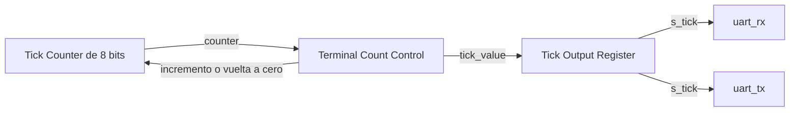

# Generador de ticks UART

## Función del generador

El generador produce la referencia temporal compartida por el receptor y el transmisor UART. Su salida s_tick es un pulso de un ciclo del clock funcional, utilizado para avanzar las cuentas que miden los intervalos de muestreo y transmisión.

Se conserva el módulo [baud_tick_gen del TP2](../../../tp2/rtl/baud_tick_gen.sv), adaptado a la frecuencia funcional del TP3 según el [acuerdo del generador](../decisions.md#acuerdo-parcial-de-dec-sys-007--generador-de-ticks-uart). La configuración utiliza 50 MHz, 19200 baud nominales y factor 16. Receptor y transmisor reciben la misma salida del generador.

## Organización interna

El bloque contiene un contador de ocho bits, la comparación de fin de cuenta y un registro de un bit para la salida s_tick. El contador conserva la fase del generador; la comparación determina si debe avanzar o volver a cero y qué valor debe registrar la salida.

Los recursos y el control permanecen dentro de baud_tick_gen. El bloque utiliza una cuenta periódica; la comparación de fin de cuenta no requiere una FSM adicional con fases de trama. La lógica que actualiza el contador y el registro de salida queda diferenciada de la condición que selecciona sus acciones.

## Divisor y frecuencia efectiva

Se conserva el cálculo del TP2: dividir la frecuencia funcional por la frecuencia nominal de ticks y redondear al entero más cercano.

| Magnitud | Valor |
|---|---|
| Frecuencia funcional | 50.000.000 Hz |
| Baud nominal | 19.200 |
| Factor de ticks por bit | 16 |
| Frecuencia nominal de ticks | 19.200 × 16 = 307.200 Hz |
| Divisor ideal | 50.000.000 / 307.200 = 162,760416… |
| Divisor entero seleccionado | 163 |
| Frecuencia efectiva de ticks | 50.000.000 / 163 ≈ 306.748,47 Hz |
| Baud efectivo | 50.000.000 / (163 × 16) ≈ 19.171,78 |
| Error relativo al baud nominal | Aproximadamente −0,147 % |

Cada clock funcional dura 20 ns. Los pulsos consecutivos se separan por 163 clocks, equivalentes a 3,26 µs, y dieciséis intervalos de tick duran 52,16 µs.

Los parámetros conservan los nombres CLK_FREQ_HZ, BAUD_RATE y OVERSAMPLE del TP2. Para el TP3 toman 50.000.000, 19.200 y 16, respectivamente; el divisor y el ancho del contador se derivan de ellos. La integración debe utilizar la misma frecuencia funcional declarada por la plataforma. La frecuencia de referencia de 100 MHz del TP2 se adapta a la configuración común de 50 MHz.

El protocolo y la configuración de PC mantienen 19200 baud nominales. Los presupuestos de tiempo aprobados siguen expresados con ese valor y sus márgenes; la aproximación del divisor se documenta como característica de la generación física del enlace.

## Cuenta y generación del pulso

El contador utiliza los valores de cero a 162. En cada flanco ascendente del clock funcional, fuera de reset, se realizan las siguientes actualizaciones:

| Condición previa al flanco | Acción del contador | Valor registrado en s_tick |
|---|---|---|
| counter distinto de 162 | Incrementar una vez. | Cero. |
| counter igual a 162 | Volver a cero. | Uno. |

Después del flanco de fin de cuenta, s_tick permanece en uno hasta el siguiente flanco. En ese siguiente flanco vuelve a cero y el contador avanza a uno, conservando el comportamiento del TP2. La comparación utiliza el valor previo al flanco y las actualizaciones se hacen visibles después de él.

RX y TX consumen el pulso al flanco siguiente a su generación, cuando s_tick está alto antes del flanco. Esa relación es la misma para ambos y mantiene un intervalo de 163 clocks entre pulsos consumidos. La salida registrada permite que los consumidores utilicen una referencia síncrona de un ciclo.

## Clock y reset

El generador y sus consumidores pertenecen al dominio funcional común. s_tick habilita las acciones temporizadas de RX y TX; los registros de esos bloques continúan utilizando clk como clock.

El reset funcional, activo alto y consumido al flanco, pone counter en cero y s_tick en cero. Mientras está activo no se generan ticks. Después de liberar reset, el primer pulso se registra en el flanco número 163 de la nueva cuenta y sus consumidores lo usan en el siguiente.

La cuenta permanece activa entre tramas, durante HOLD de la CPU y durante las fases de preparación, respuestas o recuperación del protocolo. Comenzar una trama no reinicia el generador compartido. Cada receptor o transmisor controla su propio contador de intervalo con la referencia común.

## Frontera de baud_tick_gen

Se conservan los puertos del TP2:

| Dirección | Señal | Ancho | Origen o destino |
|---|---|---|---|
| Entrada | `clk` | 1 | Clock funcional común. |
| Entrada | `reset` | 1 | Reset funcional común, activo alto. |
| Salida | `s_tick` | 1 | Pulso registrado hacia uart_rx y uart_tx. |

El contador y su comparación son internos al módulo. El generador tampoco recibe comandos del protocolo: su salida aporta la referencia periódica a los bloques físicos de UART.

## Alcance del siguiente paso

Quedan definidos el divisor, la cuenta, el pulso registrado, la relación con sus consumidores, el reset y los puertos del generador. Las [FIFO RX y TX](uart_fifo.md) tienen definido su funcionamiento. [uart_core](uart_core.md) conecta una única instancia del generador a RX y TX; el diseño continúa con el control del protocolo y su coordinación con los servicios.

La realización del clock de plataforma y la validación temporal del enlace en simulación y FPGA permanecen pendientes. La revisión de este documento no acredita esas pruebas. El trabajo continúa únicamente en diseño dentro de DEC-SYS-007.
