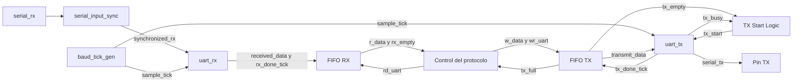

# Integración UART

## Función de uart_core

uart_core reúne los bloques físicos de recepción y transmisión y presenta sus bytes, solicitudes y estados al control del protocolo dentro de la FPGA. Se conserva el módulo [uart_core del TP2](../../../tp2/rtl/uart_core.sv) como referencia, conforme al [acuerdo de conexiones](../decisions.md#acuerdo-parcial-de-dec-sys-007--conexiones-internas-de-uart_core).

El módulo conecta el sincronizador, el generador compartido, el receptor, el transmisor y las dos FIFO. La interpretación de LOAD, RUN, STEP, RESET y CHECK_READY y la coordinación de sus respuestas corresponden al control del protocolo. uart_core recibe y transmite bytes mientras ese control procesa las operaciones o descarta los datos que correspondan a una fase de recuperación o exclusión.

La [agrupación aprobada](protocol_controller.md#agrupación-en-módulos) utiliza protocol_controller para RX y coordinación de operaciones y response_serializer para producir TX y seguir su fin físico. Las referencias al control del protocolo en el diagrama representan esa capa completa; no reúnen ambos módulos dentro de uart_core.

Las conexiones internas, la frontera ampliada hacia el control del protocolo y la composición del reporte de errores están aprobadas. La frontera y el reporte se fijan en el [acuerdo de puertos y errores](../decisions.md#acuerdo-parcial-de-dec-sys-007--puertos-y-reporte-de-errores-de-uart_core).

## Organización interna

Se utilizan los siguientes módulos:

- `serial_input_sync`, para sincronizar serial_rx.
- [baud_tick_gen](uart_baud_tick_gen.md), compartido por RX y TX.
- [uart_rx](uart_rx.md), para recibir y validar cada trama.
- [uart_tx](uart_tx.md), para transmitir cada byte.
- Dos instancias de [fifo](uart_fifo.md), una por sentido.

`TX Start Logic` es la condición combinacional que solicita el envío cuando existe un byte en TX y el transmisor está libre. Forma parte de uart_core y conserva la coordinación del TP2. Los registros y contadores permanecen dentro de los módulos correspondientes.

El diagrama presenta los caminos de datos y solicitudes ya acordados. La exposición de los indicadores RX, del fin físico TX y del error de recepción se describe en la frontera posterior.

## Clock, reset y parámetros compartidos

Todos los módulos reciben el clock funcional común, con objetivo de 50 MHz, y el reset funcional acondicionado, activo alto y consumido al flanco. Se conserva el sincronizador de dos registros del TP2; ambos se inicializan en uno, y solo la segunda etapa alimenta al receptor.

Los parámetros comunes de uart_core son CLK_FREQ_HZ=50.000.000, BAUD_RATE=19.200, OVERSAMPLE=16 y FIFO_ADDR_WIDTH=2. RX y TX utilizan ocho bits de datos y un Stop con factor de ticks 16; ambas FIFO utilizan DATA_WIDTH=8 y ADDR_WIDTH=2.

El generador conecta s_tick a la señal interna sample_tick, que alimenta ambos bloques. Son nombres de la misma referencia síncrona, con un pulso registrado de un clock cada 163 clocks. Se mantiene la cuenta entre tramas y durante HOLD de CPU.

El reset global inicializa los módulos y vacía ambas FIFO. La recuperación de recepción del protocolo conserva TX y consume o descarta RX mediante su interfaz; no aplica ese reset global para realizar el descarte.

## Camino de recepción

serial_rx alimenta exclusivamente al sincronizador. Su salida synchronized_rx llega a la entrada rx del receptor. uart_rx entrega received_data de ocho bits y activa rx_done_tick cuando ha completado y validado el byte.

Las conexiones de la FIFO RX son:

| Puerto de FIFO RX | Conexión |
|---|---|
| `wr` | rx_done_tick desde uart_rx. |
| `write_data` | received_data desde uart_rx.data_out. |
| `rd` | rd_uart desde el control del protocolo. |
| `read_data` | r_data hacia el control del protocolo. |
| `empty` | rx_empty hacia el control del protocolo. |
| `full` | rx_full interno, utilizado para el reporte de desbordamiento. |

El receptor y la FIFO consumen las señales en el flanco que valida el Stop. Si hay espacio, la FIFO guarda el byte y actualiza su ocupación. Después de ese flanco, el control del protocolo puede observar el primer dato válido mediante r_data y rx_empty.

El control del protocolo toma el byte de r_data previo al flanco y activa rd_uart cuando corresponde retirarlo. Solo lo considera disponible con rx_empty en cero. Durante recuperación o exclusión Debug utiliza el mismo retiro para descartar datos, sin interpretar solicitudes. La generación concreta de esas órdenes se desarrollará al diseñar el control.

No se supedita el registro de bytes válidos al avance de la CPU o a la disponibilidad TX. La continuidad de consumo o descarte corresponde al contrato del controlador todavía pendiente de demostrar.

## Camino de transmisión

El control del protocolo entrega w_data y solicita su incorporación mediante wr_uart cuando TX tiene espacio. Si tx_full está activo, conserva el byte pendiente hasta poder escribirlo, mientras sigue atendiendo RX.

Las conexiones de la FIFO TX son:

| Puerto de FIFO TX | Conexión |
|---|---|
| `wr` | wr_uart desde el control del protocolo. |
| `write_data` | w_data desde el control del protocolo. |
| `rd` | tx_done_tick desde uart_tx. |
| `read_data` | transmit_data hacia uart_tx.data_in. |
| `empty` | tx_empty interno, utilizado para solicitar el comienzo. |
| `full` | tx_full hacia el control del protocolo. |

Fuera de reset, tx_start está activo si tx_empty y tx_busy valen cero. Durante reset se mantiene en cero. En el flanco de aceptación, uart_tx captura transmit_data en su registro interno y comienza el Start. La FIFO conserva ese byte como su primer elemento durante toda la transmisión.

Al flanco indicado por tx_done_tick termina el Stop completo, la FIFO acepta el retiro del byte transmitido y uart_tx vuelve a IDLE. El retiro y la finalización se producen en el mismo flanco. Después de él se presentan el nuevo primer byte y los nuevos flags; si existe otro byte pendiente, se solicita su transmisión para el siguiente flanco.

El control del protocolo puede producir mensajes de cualquier longitud compatible con los formatos aprobados usando el espacio disponible. La FIFO almacena solo los bytes pendientes inmediatos y el registro del transmisor conserva el byte en curso.

## Frontera de uart_core

Se conservan los puertos del TP2 y se agregan tres salidas: rx_activity, rx_receiving y tx_done_tick. Los nombres internos rx_done_tick, rx_full, tx_empty y tx_busy siguen participando en la coordinación de módulos dentro de uart_core.

| Dirección | Señal | Ancho | Origen o destino |
|---|---|---|---|
| Entrada | `clk` | 1 | Clock funcional común. |
| Entrada | `reset` | 1 | Reset funcional común, activo alto. |
| Entrada | `serial_rx` | 1 | Pin serie hacia el sincronizador. |
| Salida | `serial_tx` | 1 | Salida registrada de uart_tx hacia el pin serie. |
| Salida | `r_data` | 8 | Primer byte de FIFO RX hacia el control del protocolo. |
| Entrada | `rd_uart` | 1 | Solicitud de retiro RX desde el control del protocolo. |
| Salida | `rx_empty` | 1 | FIFO RX vacía, hacia el control del protocolo. |
| Entrada | `w_data` | 8 | Byte de respuesta desde el control del protocolo. |
| Entrada | `wr_uart` | 1 | Solicitud de escritura TX desde el control del protocolo. |
| Salida | `tx_full` | 1 | FIFO TX llena, hacia el control del protocolo. |
| Salida | `rx_error_tick` | 1 | Evento de error RX hacia el control del protocolo. |
| Salida | `rx_activity` | 1 | Actividad desde uart_rx hacia el control del protocolo. |
| Salida | `rx_receiving` | 1 | Trama en curso desde uart_rx hacia el control del protocolo. |
| Salida | `tx_done_tick` | 1 | Fin físico de cada byte desde uart_tx hacia el control del protocolo. |

Los dos indicadores RX y el evento TX se llevan directamente desde sus productores, sin una etapa de registro adicional en uart_core. Sus condiciones y flancos de consumo mantienen los contratos de [recepción](uart_rx.md#indicadores-para-el-control-del-protocolo) y [transmisión](uart_tx.md#stop-completo-y-evento-de-finalización).

response_serializer asocia los eventos de fin TX, en orden, con los bytes de la respuesta que está enviando y comunica su finalización completa a protocol_controller. De ese modo se identifica el final del segundo byte de aceptación LOAD o RESET y el último byte de Debug. La secuencia de producción, seguimiento y exclusión se concretará al diseñar ambos módulos, respetando el [protocolo aprobado](../protocol.md).

## Reporte de errores

Se conserva el reporte combinado del TP2: rx_error_tick se activa ante frame_error_tick o cuando rx_done_tick coincide con rx_full. Un error de trama no entrega un byte válido; un desbordamiento indica que el byte válido recibido no pudo guardarse. La FIFO utiliza el flag full previo al flanco, incluso si se solicita un retiro en ese mismo flanco, según su contrato.

El evento se consume en el flanco correspondiente, no se repite por el solo hecho de conservar RX llena y permanece en cero durante reset. El control del protocolo reacciona conforme a la fase y las prioridades ya aprobadas, sin exigir un código externo diferente para trama y desbordamiento. La prioridad del error y el abandono o descarte de la recepción se concretarán en su FSM privada.

## Alcance del siguiente paso

Quedan definidas las conexiones de sincronización, referencia temporal y caminos de bytes y solicitudes de RX y TX, la frontera ampliada y el reporte combinado de errores. La [organización del control del protocolo](protocol_controller.md#agrupación-en-módulos) distingue protocol_controller y response_serializer, cada uno con sus controles y recursos, y mantiene las responsabilidades de Loader y ejecución. La [comunicación entre ambos](response_serializer.md#comunicación-con-el-controlador) y los [grupos internos del serializador](response_serializer.md#organización-interna) están definidos; el siguiente paso es concretar su recorrido y los controles de acción.

El diseño del control del protocolo y la demostración de su latencia de consumo y continuidad RX durante espera TX siguen pendientes dentro de DEC-SYS-007. El trabajo continúa únicamente en diseño.
