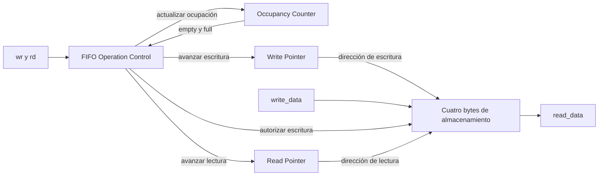

# FIFO de recepción y transmisión UART

## Función de las FIFO

Las FIFO conservan el orden de los bytes entre el enlace serie y su procesamiento interno. La FIFO RX guarda bytes completos recibidos hasta que el control del protocolo los consume o descarta. La FIFO TX guarda bytes pendientes de transmisión hasta que la integración los retira según el avance del transmisor.

Se conserva el módulo [fifo del TP2](../../../tp2/rtl/fifo.sv) y se utilizan dos instancias independientes, conforme al [acuerdo de funcionamiento](../decisions.md#acuerdo-parcial-de-dec-sys-007--funcionamiento-de-las-fifo-uart). Ambas tienen ancho de ocho bits y capacidad de cuatro entradas, definidos por DATA_WIDTH=8 y ADDR_WIDTH=2. Los dos caminos utilizan el mismo clock funcional, con objetivo de 50 MHz, pero sus solicitudes y estados de ocupación son independientes.

## Organización interna

Cada instancia conserva cuatro bytes de almacenamiento, un puntero de lectura de dos bits, un puntero de escritura de dos bits y una cuenta de ocupación de tres bits. La cuenta representa valores de cero a cuatro y permite distinguir vacío de lleno aunque ambos punteros coincidan.

La lógica combinacional determina qué solicitudes pueden aceptarse. La lógica de los recursos realiza las escrituras, los avances de puntero y la actualización de ocupación al flanco ascendente del clock funcional. Los recursos permanecen dentro del módulo fifo; este bloque conserva el control por solicitudes y flags del TP2, sin introducir estados de trama.

## Solicitudes y operaciones aceptadas

Fuera de reset, las condiciones son:

| Operación | Condición de aceptación |
|---|---|
| Lectura o retiro | rd activo y empty en cero. |
| Escritura | wr activo y full en cero. |

Las condiciones utilizan el estado previo al flanco. Si la FIFO está llena y se solicitan ambas operaciones, se acepta solo la lectura, como en el TP2. Si está vacía, se acepta solo la escritura. Las solicitudes que no se aceptan no actualizan el recurso correspondiente.

En cada escritura aceptada se guarda write_data en la posición del puntero de escritura y ese puntero avanza una posición. En cada lectura aceptada se retira el primer byte y avanza el puntero de lectura. Ambos punteros recorren circularmente las cuatro posiciones, de cero a tres.

La ocupación se actualiza según las operaciones aceptadas:

| Escritura aceptada | Lectura aceptada | Cambio de ocupación |
|---|---|---|
| No | No | Se conserva. |
| Sí | No | Aumenta en uno. |
| No | Sí | Disminuye en uno. |
| Sí | Sí | Se conserva. |

Cuando ambas operaciones se aceptan, el consumidor toma el dato de lectura previo al flanco y la escritura incorpora el nuevo byte en su posición correspondiente. El nuevo primer dato y los flags se hacen visibles después del flanco.

## Salida de lectura y flags

read_data presenta combinacionalmente el contenido de la posición señalada por el puntero de lectura. Mientras empty esté en cero, representa el byte más antiguo pendiente. Observar esa salida no retira el byte: el retiro ocurre al aceptar rd en un flanco.

La salida solo es válida con empty en cero. Con la cola vacía puede mostrar un valor residual, incluso después de reset; el consumidor utiliza el flag para determinar si existe un byte disponible.

empty vale uno cuando la cuenta de ocupación es cero. full vale uno cuando la cuenta es cuatro. Las escrituras y lecturas aceptadas actualizan esos flags a partir del nuevo valor de ocupación después del flanco.

## Clock y reset

La FIFO utiliza clk para todas sus actualizaciones. Las solicitudes no dependen de s_tick ni de la autorización de ciclos de CPU. Su consumo y producción pueden continuar mientras la CPU está en HOLD o ejecuta un programa.

El reset funcional, activo alto y consumido al flanco, pone ambos punteros y la cuenta en cero y suprime las operaciones de ese flanco. La cola queda vacía. No es necesario borrar los cuatro bytes físicos: la ocupación indica que ninguno está disponible para lectura.

La recuperación del protocolo conserva TX y descarta la recepción pendiente mediante el camino RX. El retiro durante descarte se coordinará en la integración y en el control del protocolo; no requiere aplicar reset global para vaciar RX.

## Frontera del módulo fifo

Se conservan los puertos del TP2, con ancho de datos de ocho bits:

| Dirección | Señal | Ancho | Función |
|---|---|---|---|
| Entrada | `clk` | 1 | Clock funcional común. |
| Entrada | `reset` | 1 | Reset funcional común, activo alto. |
| Entrada | `rd` | 1 | Solicitud de retiro del primer byte. |
| Entrada | `wr` | 1 | Solicitud de escritura de un byte. |
| Entrada | `write_data` | 8 | Byte para una escritura aceptada. |
| Salida | `read_data` | 8 | Primer byte pendiente, válido cuando empty vale cero. |
| Salida | `empty` | 1 | Cola vacía. |
| Salida | `full` | 1 | Cola llena. |

Las reglas de la FIFO son comunes a ambos caminos. La integración determinará los productores y consumidores de cada instancia y generará las solicitudes rd y wr correspondientes.

La FIFO no informa por sí sola un error de protocolo ante una escritura no aceptada. En RX, la integración debe reportar el desbordamiento si un byte completo recibido no puede guardarse. En TX, el productor conserva el byte pendiente y espera espacio, sin impedir el consumo o descarte RX, conforme al [contrato de buffers](../decisions.md#acuerdo-parcial-de-dec-sys-007--buffers-y-contrato-de-consumo-uart).

## Fundamento de la capacidad y comprobación pendiente

Se mantienen cuatro entradas como capacidad de referencia del TP2 y margen para el desacople. Esa cantidad no es un mínimo obtenido de las latencias del controlador del TP3, que todavía debe diseñarse. Su suficiencia se apoya en el contrato de consumir y procesar cada byte de LOAD antes de que llegue completo el siguiente.

A 19200 baud nominales y 8N1, cada byte ocupa diez bits y llega aproximadamente cada 0,520833 ms. A 50 MHz, ese intervalo representa unos 26.042 clocks funcionales. El procesamiento incluye retirar el byte, incorporarlo al registro de reconstrucción externo a la FIFO y, cuando completa una instrucción, escribir la word en IMEM.

Si se cumple ese contrato, RX no acumula bytes de forma sostenida durante una carga normal. Los cuatro lugares aportan margen, mientras el registro de reconstrucción conserva la instrucción en formación. La elección de profundidad no deriva del tamaño de cuatro bytes de una instrucción.

TX permite producir las respuestas progresivamente, utilizando el espacio disponible. Un mensaje Debug completo puede superar la profundidad de la cola; el productor conserva el byte pendiente cuando full está activo y continúa en cuanto haya espacio. Esa espera debe permitir que RX siga consumiendo o descartando datos.

Antes de implementar el control del protocolo se deberá comprobar documentalmente:

- La latencia máxima de retiro y procesamiento RX, incluida la escritura IMEM, es menor que la separación entre bytes completos para el enlace configurado, con margen respecto de los valores nominales.
- El consumo o descarte RX continúa durante la espera de espacio TX y las fases que lo requieren.
- El productor TX mantiene el byte pendiente mientras no puede aceptarse su escritura y avanza únicamente al introducirlo correctamente en la cola.

Después se verificarán esas condiciones en simulación. El acuerdo mantiene la capacidad como base de diseño y no acredita todavía el análisis de latencias ni una medición del enlace.

## Alcance del siguiente paso

Quedan definidos el almacenamiento, los punteros, la ocupación, la aceptación de operaciones, los flags, el reset y los puertos de las FIFO. Sus productores, consumidores y conexiones con receptor, transmisor y control del protocolo están definidos en [uart_core](uart_core.md), tomando el TP2 como referencia.

El control del protocolo, la demostración del presupuesto de consumo y la validación RTL y en placa permanecen pendientes dentro de DEC-SYS-007. El trabajo continúa únicamente en diseño.
