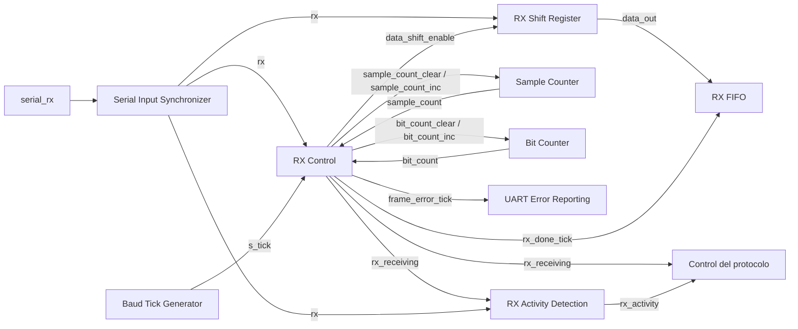
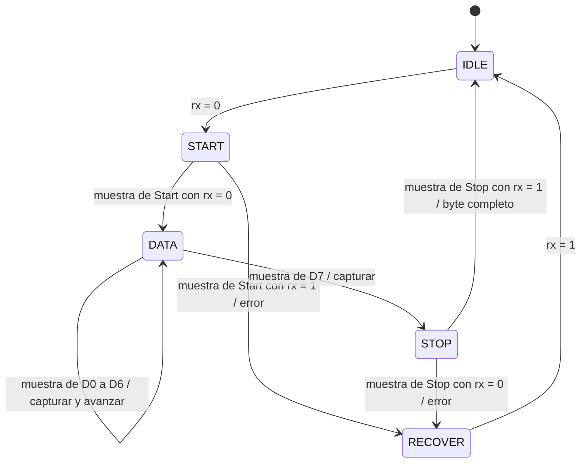
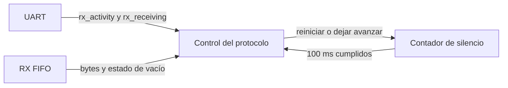

# Receptor UART

## Función del receptor

El receptor UART convierte la señal serie que llega desde la PC en bytes de ocho bits. Reconoce el comienzo de una trama, toma las muestras de sus bits de datos y comprueba el bit de Stop antes de entregar el byte al camino de recepción.

El receptor trabaja sobre cada trama 8N1. La interpretación de esos bytes como códigos de operación, tamaños o contenido de un programa corresponde a los bloques que realizan el [protocolo](../protocol.md). Una instrucción de 32 bits, por ejemplo, requiere recibir cuatro bytes y reconstruirlos fuera del receptor.

El diseño toma como referencia [uart_rx del TP2](../../../tp2/rtl/uart_rx.sv), aplicando la [separación entre control y acciones](../decisions.md#acuerdo-parcial-de-dec-sys-007--correcciones-de-diseño-de-fsm-del-tp2). La [organización en cuatro partes](../decisions.md#acuerdo-parcial-de-dec-sys-007--organización-del-receptor-uart) está aprobada. El [acuerdo de estados y agrupación](../decisions.md#acuerdo-parcial-de-dec-sys-007--estados-y-agrupación-del-receptor-uart) conserva los cinco estados y el comportamiento de recepción del TP2, con los recursos dentro de uart_rx. Los [indicadores de recepción](../decisions.md#acuerdo-parcial-de-dec-sys-007--indicadores-de-recepción-uart) y la [codificación one-hot](../decisions.md#acuerdo-parcial-de-dec-sys-007--codificación-one-hot-del-receptor-uart) están aprobados. El diseño del subsistema UART continúa con los demás bloques y su integración.

## Organización interna

El receptor se organiza en cuatro partes:

- `RX Control`, que contiene el estado registrado y la lógica combinacional de la FSM.
- `Sample Counter`, que cuenta los ticks de sobremuestreo transcurridos entre muestras.
- `Bit Counter`, que identifica cuál de los ocho bits de datos se está recibiendo.
- `RX Shift Register`, que incorpora las muestras y forma el byte recibido.

Los contadores y el registro de desplazamiento conservan el estado de la recepción. La FSM consulta el nivel de la línea y los contadores para decidir qué acción corresponde. Luego emite controles que esos recursos consumen en el flanco ascendente del clock funcional.

La separación es funcional. Se conserva uart_rx como módulo receptor: la FSM, ambos contadores y el registro de recepción permanecen dentro de él, con lógica diferenciada para el control y para la actualización de los recursos. Los contadores y el registro no se convierten en módulos nuevos. El sincronizador, el generador de baud y las FIFO mantienen las fronteras de módulos del TP2; sus adaptaciones y conexiones se concretan en el diseño de cada bloque.

## Entrada sincronizada y referencia temporal

El pin `serial_rx` es externo al dominio de clock. Como en el TP2, pasa primero por un sincronizador de dos registros; solo la salida de la segunda etapa alimenta al receptor. Tanto la FSM como el registro de desplazamiento observan esa misma señal sincronizada, denominada `rx`.

El generador de baud proporciona `s_tick`, un pulso que indica un tick de sobremuestreo. Se conserva el factor 16 aprobado para UART. Todos los registros del receptor utilizan el clock funcional común, con objetivo de 50 MHz; `s_tick` participa en las decisiones de control y no se utiliza como un clock independiente.

El [generador de ticks](uart_baud_tick_gen.md) utiliza un divisor de 163 sobre el clock funcional de 50 MHz y comparte su pulso registrado con el transmisor. El cambio de frecuencia respecto del TP2 no modifica la división de responsabilidades del receptor.

## `RX Control`

`RX Control` conserva el estado actual de la recepción en un registro. Su lógica combinacional calcula el siguiente estado y las señales de acción a partir de ese estado, `rx`, `s_tick` y los valores de los contadores.

Las decisiones se expresarán mediante casez, usando `?` para las condiciones irrelevantes en cada elección, conforme al criterio docente registrado. El cálculo de un incremento o del nuevo contenido del registro de recepción queda en la lógica del recurso correspondiente.

### Entradas

| Señal | Origen | Función |
|---|---|---|
| `rx` | `Serial Input Synchronizer` | Nivel sincronizado de la línea serie. |
| `s_tick` | `Baud Tick Generator` | Referencia de avance del sobremuestreo. |
| `sample_count[3:0]` | `Sample Counter` | Permite determinar cuándo corresponde tomar una muestra. |
| `bit_count[2:0]` | `Bit Counter` | Permite identificar el bit de datos actual y reconocer el último. |

Las comparaciones de los contadores forman condiciones combinacionales para la FSM. Las transiciones utilizan `sample_count = 7` para comprobar el Start, `sample_count = 15` para muestrear cada bit de datos y el Stop, y `bit_count = 7` para reconocer el último bit de datos. Estas condiciones solo autorizan el muestreo cuando también está activo `s_tick`.

### Controles de acción

| Señal | Destino | Acción que autoriza |
|---|---|---|
| `sample_count_clear` | `Sample Counter` | Poner el contador de sobremuestreo en cero. |
| `sample_count_inc` | `Sample Counter` | Incrementar el contador de sobremuestreo una vez. |
| `bit_count_clear` | `Bit Counter` | Poner el índice del bit de datos en cero. |
| `bit_count_inc` | `Bit Counter` | Avanzar al siguiente índice de bit de datos. |
| `data_shift_enable` | `RX Shift Register` | Incorporar una muestra de `rx` mediante un desplazamiento. |

Cada control es de un bit. Sin una orden de actualización, el recurso conserva su valor. La tabla de control evita ordenar simultáneamente limpieza e incremento de un mismo contador. El reset común inicializa los contadores y el registro de datos en cero y sitúa el control en reposo.

La FSM también genera los eventos `rx_done_tick` y `frame_error_tick`, usados en el TP2 para indicar un byte correctamente recibido o un error de trama. La descripción de estados concreta sus condiciones y duración. El reporte de desbordamiento de FIFO pertenece a la integración UART, donde se conoce si existe espacio para guardar el byte.

## Contadores de recepción

`Sample Counter` conserva la cuenta del intervalo de muestreo. Con sobremuestreo 16 y un bit de Stop, la organización de referencia del TP2 utiliza cuatro bits para representar los valores de cero a quince. La FSM ordena los incrementos y las limpiezas necesarios para recorrer cada intervalo.

`Bit Counter` conserva el índice del bit de datos que se recibe. Para una trama de ocho bits utiliza tres bits, con valores de cero a siete. Se inicializa para el primer bit y avanza cuando corresponde pasar al siguiente. Su valor permite a la FSM reconocer cuándo se han recibido los ocho bits y debe comprobarse el Stop.

Cada contador realiza su propia actualización al flanco de clock. La FSM emite la orden de avanzar; el contador calcula y registra el valor incrementado.

## `RX Shift Register`

`RX Shift Register` conserva ocho bits. Cuando `data_shift_enable` está activo, desplaza su contenido hacia el bit menos significativo e incorpora la muestra de `rx` en el bit más significativo. Como la UART transmite primero D0 y termina con D7, después de ocho capturas el registro contiene el byte en su orden habitual, de D7 a D0.

Estar recibiendo datos no habilita por sí solo una captura en cada clock. El registro cambia únicamente cuando la FSM ordena tomar la muestra correspondiente. De este modo, la lógica del registro realiza el desplazamiento y la FSM se limita a decidir cuándo debe realizarse.

La salida `data_out[7:0]` presenta el contenido de este registro. Durante la recepción puede contener un byte parcial; solo debe consumirse como byte completo cuando el receptor indique `rx_done_tick`. La FIFO RX conserva los bytes completos mientras el registro comienza a formar el siguiente, por lo que esta organización no requiere un segundo registro de byte terminado.

## Relación entre decisión y acción

Cuando llega el momento de muestrear un bit de datos, la lógica combinacional de control activa `data_shift_enable` y los controles que correspondan a los contadores. En el siguiente flanco ascendente, cada recurso consume su control: el registro incorpora el bit y los contadores adoptan los valores indicados.

El registro de estado puede cambiar en ese mismo flanco. Separar la FSM de los recursos no agrega una etapa de espera entre la decisión y la captura. Las decisiones usan los valores previos al flanco y las actualizaciones se hacen visibles después de él, como en los demás bloques síncronos del sistema.

## Estados y transiciones

Se conservan los cinco estados del TP2 y su comportamiento de recepción. Cada estado identifica una fase de la recepción; sus controles ordenan las acciones sobre los recursos correspondientes.

| Estado | Función |
|---|---|
| `IDLE` | Esperar el nivel bajo que puede iniciar una trama. |
| `START` | Comprobar que la línea sigue baja aproximadamente en el centro del Start. |
| `DATA` | Ordenar las ocho capturas de datos, desde D0 hasta D7. |
| `STOP` | Comprobar el nivel alto del Stop y, si es correcto, anunciar el byte completo. |
| `RECOVER` | Esperar que la línea vuelva a alto después de un error de trama. |

Mientras no se cumple una condición de transición, el receptor conserva el estado actual. El reset lleva a `IDLE` desde cualquier estado, inicializa los recursos y suprime los eventos de recepción.

### Codificación del estado

Se conserva la codificación one-hot del TP2. El registro de estado tiene cinco bits y cada estado legal activa exactamente uno, según el [acuerdo de codificación](../decisions.md#acuerdo-parcial-de-dec-sys-007--codificación-one-hot-del-receptor-uart).

| Estado | Valor de state[4:0] |
|---|---|
| `IDLE` | `00001` |
| `START` | `00010` |
| `DATA` | `00100` |
| `STOP` | `01000` |
| `RECOVER` | `10000` |

El reset escribe `00001`, correspondiente a IDLE. La lógica combinacional calcula el siguiente estado usando estos mismos valores y el registro lo adopta al flanco ascendente del clock funcional. La codificación facilita identificar la fase de recepción al observar el registro en una simulación.

Estos bits pertenecen a la FSM privada del receptor. La representación de global_state que se transmite en el protocolo sigue la tabla externa de la FSM global del sistema; el estado privado de UART no agrega campos a sus mensajes.

### Espera y comprobación de Start

En `IDLE`, la FSM mantiene en cero ambos contadores. Al observar `rx = 0`, pasa a `START`, donde espera ocho ticks de sobremuestreo antes de comprobar el nivel de la línea.

El contador comienza en cero. Los primeros siete ticks ordenan un incremento; en el octavo, su valor previo al flanco es siete y se toma la muestra. Si `rx` sigue baja, se reconoce un Start válido, se limpian los contadores y se pasa a `DATA`. Si está alta, se anuncia un error de trama y se pasa a `RECOVER`, como en el TP2.

La espera de ocho ticks sitúa la comprobación aproximadamente en el centro del Start. El instante exacto conserva la resolución del sobremuestreo, ya que el comienzo de la trama puede ocurrir entre dos ticks.

### Captura de los bits de datos

En `DATA`, cada muestra se toma después de dieciséis ticks desde la muestra anterior. Cuando `s_tick` está activo y `sample_count` vale quince, la FSM activa `data_shift_enable` y `sample_count_clear`.

Si `bit_count` está entre cero y seis, también activa `bit_count_inc` y permanece en `DATA`. Cuando vale siete, ordena la captura de D7 y pasa a `STOP`, conservando el índice. El registro de desplazamiento realiza todas las capturas, incluida la última; el cambio de estado y la captura de D7 ocurren en el mismo flanco.

No se emite todavía `rx_done_tick`: los ocho bits forman el byte, pero falta validar el Stop.

### Validación de Stop y recuperación

En `STOP`, la FSM espera otros dieciséis ticks y comprueba `rx` cuando `sample_count` vale quince. Si la línea está alta, activa `rx_done_tick` y vuelve a `IDLE`. Si está baja, activa `frame_error_tick` y pasa a `RECOVER`. En ambos casos ordena poner el contador de sobremuestreo en cero.

La validación ocurre aproximadamente en el centro del Stop. El evento de recepción indica que el byte fue validado en ese punto; no representa la terminación física del Stop de una transmisión TX.

En `RECOVER`, la FSM mantiene en cero los dos contadores y no captura datos. Espera a que la línea vuelva a alto y entonces pasa a `IDLE`. Esta recuperación evita interpretar un nivel bajo sostenido como nuevos comienzos de trama.

La espera de silencio de 100 ms aprobada por el protocolo se realiza fuera de esta FSM. Volver a `IDLE` permite reconocer otra trama física; la aceptación o el descarte de sus bytes depende de la fase del protocolo.

### Tabla de acciones

Los valores de los contadores corresponden al instante previo al flanco. Las señales que no aparecen en la columna de controles permanecen en cero; los recursos sin orden conservan su valor. Las condiciones de cada estado son excluyentes.

| Estado actual | Condición | Estado siguiente | Controles activos |
|---|---|---|---|
| `IDLE` | `rx = 1` | `IDLE` | `sample_count_clear`, `bit_count_clear` |
| `IDLE` | `rx = 0` | `START` | `sample_count_clear`, `bit_count_clear` |
| `START` | `s_tick = 0` | `START` | Ninguno |
| `START` | `s_tick = 1`, `sample_count != 7` | `START` | `sample_count_inc` |
| `START` | `s_tick = 1`, `sample_count = 7`, `rx = 0` | `DATA` | `sample_count_clear`, `bit_count_clear` |
| `START` | `s_tick = 1`, `sample_count = 7`, `rx = 1` | `RECOVER` | `sample_count_clear`, `frame_error_tick` |
| `DATA` | `s_tick = 0` | `DATA` | Ninguno |
| `DATA` | `s_tick = 1`, `sample_count != 15` | `DATA` | `sample_count_inc` |
| `DATA` | `s_tick = 1`, `sample_count = 15`, `bit_count != 7` | `DATA` | `sample_count_clear`, `data_shift_enable`, `bit_count_inc` |
| `DATA` | `s_tick = 1`, `sample_count = 15`, `bit_count = 7` | `STOP` | `sample_count_clear`, `data_shift_enable` |
| `STOP` | `s_tick = 0` | `STOP` | Ninguno |
| `STOP` | `s_tick = 1`, `sample_count != 15` | `STOP` | `sample_count_inc` |
| `STOP` | `s_tick = 1`, `sample_count = 15`, `rx = 1` | `IDLE` | `sample_count_clear`, `rx_done_tick` |
| `STOP` | `s_tick = 1`, `sample_count = 15`, `rx = 0` | `RECOVER` | `sample_count_clear`, `frame_error_tick` |
| `RECOVER` | `rx = 0` | `RECOVER` | `sample_count_clear`, `bit_count_clear` |
| `RECOVER` | `rx = 1` | `IDLE` | `sample_count_clear`, `bit_count_clear` |

### Eventos de recepción

Se conservan eventos combinacionales consumidos al flanco, como en el TP2. `rx_done_tick` se activa únicamente para la muestra válida de Stop. En ese flanco, la FIFO puede capturar `data_out`, que ya contiene los ocho bits recibidos, mientras la FSM vuelve a `IDLE`.

`frame_error_tick` se activa únicamente al detectar un Start falso o un Stop inválido. En esos casos no se activa `rx_done_tick` y el registro parcial no se entrega como byte válido. Permanecer en `RECOVER` no repite el aviso de error.

Cada evento se consume una vez y corresponde a un ciclo del clock funcional, con `s_tick` de un ciclo. La tabla no registra las órdenes en una etapa adicional: la actualización de estado y las acciones autorizadas comparten el flanco correspondiente.

## Indicadores para el control del protocolo

El consumidor de los indicadores de actividad y recepción en curso es el control del protocolo dentro de la FPGA. Ese control recibe los bytes desde la FIFO RX, interpreta las solicitudes y coordina su procesamiento. Durante una recuperación, descarta la recepción pendiente y comprueba el silencio requerido antes de admitir otra solicitud, conforme a [Descarte y silencio](../protocol.md#descarte-y-silencio).

La UART conserva la responsabilidad de recibir y transmitir bytes. El control del protocolo debe diseñarse para los servicios del TP3; el controlador que esperaba operandos en el TP2 no cubre esos servicios. La organización interna y la agrupación física de ese control permanecen pendientes.

El receptor genera las siguientes salidas informativas, aprobadas en el [acuerdo de indicadores](../decisions.md#acuerdo-parcial-de-dec-sys-007--indicadores-de-recepción-uart) y expuestas por la integración UART al control del protocolo:

| Señal | Significado | Uso por el consumidor |
|---|---|---|
| `rx_receiving` | Hay una trama en curso, con la FSM en START, DATA o STOP. | Impide declarar la recepción libre mientras se procesa esa trama. |
| `rx_activity` | La línea sincronizada cambia de nivel, está baja o hay una trama en curso. | Reinicia el contador de silencio durante la recuperación, aunque no se produzca un byte válido. |

Estas señales informan sobre la recepción; no ordenan capturas ni actualizaciones de los contadores del receptor. El temporizador de 100 ms pertenece al control del protocolo. La condición de finalización también requiere línea en reposo y FIFO RX vacía, según el contrato ya aprobado.

### Generación de los indicadores

Fuera de reset, las condiciones son:

| Indicador | Condición para valer uno |
|---|---|
| `rx_receiving` | El estado actual es START, DATA o STOP. |
| `rx_changed` interno | `rx` difiere de `rx_previous`. |
| `rx_activity` | `rx_changed` o `rx = 0` o `rx_receiving = 1`. |

`rx_receiving` se obtiene combinacionalmente del estado registrado. `RX Activity Detection` combina ese indicador con el nivel sincronizado de la línea y la detección de cambios. Permanece dentro de uart_rx como lógica auxiliar; no requiere un módulo HDL nuevo.

Para detectar cambios se conserva `rx_previous`, un registro auxiliar de un bit que captura `rx` en cada flanco ascendente del clock funcional. Este registro observa la línea continuamente, con independencia del estado de recepción y de `s_tick`. Se inicializa en uno, el nivel de reposo, al igual que el sincronizador. Durante reset los indicadores externos permanecen en cero.

La comparación es combinacional. Cuando cambia el nivel sincronizado, `rx_changed` queda activo hasta el flanco en que `rx_previous` captura ese nivel. El control del protocolo consume la actividad en ese flanco. No se agrega una etapa de registro a las salidas ni una demora antes de reiniciar el contador de silencio.

`rx_activity` es un nivel que puede mantenerse activo durante varios clocks. Una trama mantiene ese indicador en uno mientras se procesa, incluso si sus bits consecutivos tienen el mismo valor. En RECOVER, `rx_receiving` vale cero; si la línea sigue baja, `rx_activity` continúa activo. La transición de retorno a alto también se detecta antes de comenzar a contar silencio.

Durante recuperación, el control del protocolo pone el contador de silencio en cero en cada flanco con `rx_activity = 1`. Cuando vale cero, permite avanzar la cuenta. Al cumplir los 100 ms, comprueba ausencia de actividad, línea en reposo, `rx_receiving = 0` y FIFO RX vacía antes de admitir solicitudes. Ante actividad coincidente con la finalización de la espera, prevalece reiniciar la cuenta, conforme al requisito de silencio continuo.

Fuera de reset, `rx_activity = 0` acredita que la línea sincronizada está alta, no presenta un cambio de nivel y no hay trama en curso. El consumidor puede comprobar el reposo de la línea mediante ese indicador y completar la condición con el estado de vacío de la FIFO.

### Frontera de uart_rx

La lista de señales del receptor queda definida de la siguiente manera; la integración debe llevar los dos indicadores nuevos hasta la frontera UART con el control del protocolo.

| Dirección | Señal | Ancho | Origen o destino |
|---|---|---|---|
| Entrada | `clk` | 1 | Clock funcional común. |
| Entrada | `reset` | 1 | Reset funcional común, activo alto. |
| Entrada | `rx` | 1 | Salida del sincronizador de la línea serie. |
| Entrada | `s_tick` | 1 | Pulso de sobremuestreo del generador de baud. |
| Salida | `data_out` | 8 | Dato para la FIFO RX, consumido con rx_done_tick. |
| Salida | `rx_done_tick` | 1 | Evento para guardar el byte recibido en la FIFO RX. |
| Salida | `frame_error_tick` | 1 | Reporte de error de trama hacia la integración UART. |
| Salida | `rx_receiving` | 1 | Indicador de trama en curso hacia el control del protocolo. |
| Salida | `rx_activity` | 1 | Indicador de actividad hacia el control del protocolo. |

Los controles de acción de los contadores y del registro de recepción son internos a uart_rx. El reporte combinado de error de trama y desbordamiento de FIFO se concretará al diseñar la integración UART.

## Alcance del siguiente paso

El receptor tiene definidos su organización interna, los recursos y controles, los estados y transiciones, la codificación one-hot, los eventos y los indicadores de actividad. Los nombres, las condiciones de generación y el consumidor de los indicadores quedan definidos.

El [transmisor UART](uart_tx.md), el [generador de ticks compartido](uart_baud_tick_gen.md) y las [FIFO](uart_fifo.md) tienen definidos sus diseños. Sus conexiones están definidas en [uart_core](uart_core.md), que expone rx_activity y rx_receiving directamente al control del protocolo. La organización interna de ese control sigue pendiente.

El control del protocolo, su coordinación con los servicios y la comprobación del presupuesto de consumo siguen pendientes dentro de DEC-SYS-007. El trabajo continúa en la etapa de diseño.
