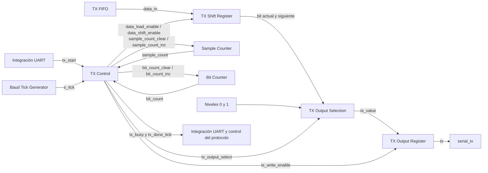
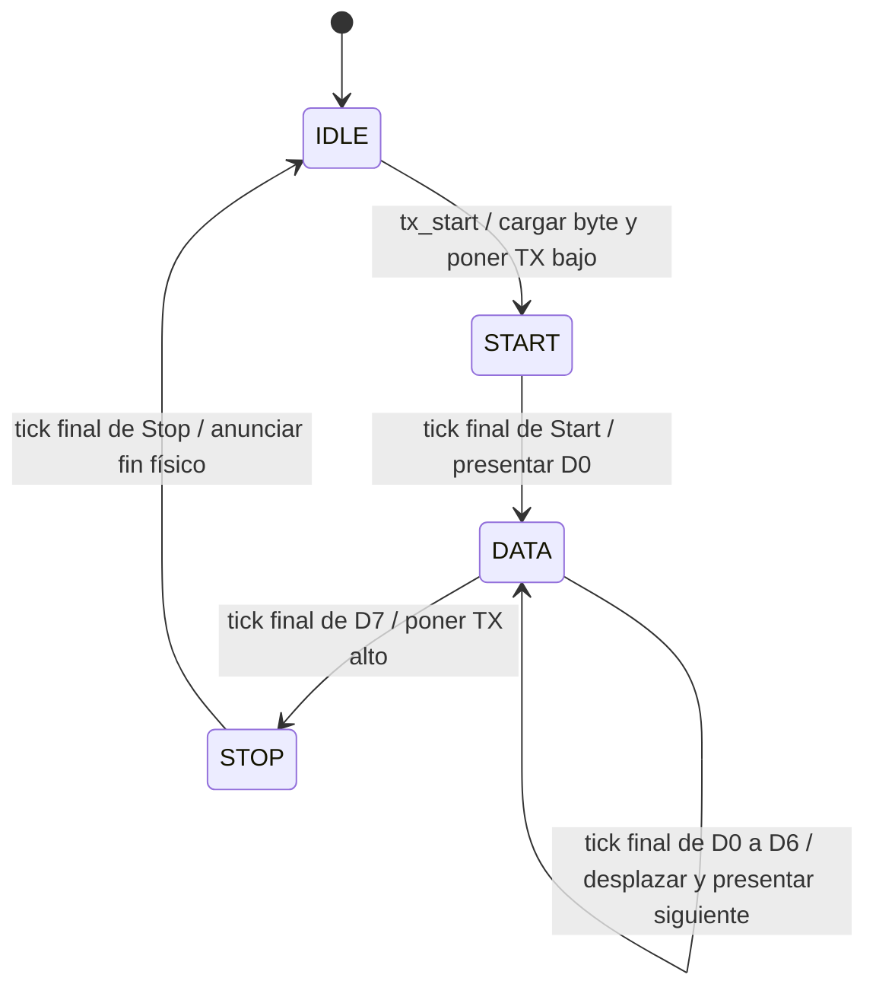

# Transmisor UART

## Función del transmisor

El transmisor UART convierte un byte de ocho bits en una trama serie 8N1. Envía un Start bajo, los bits de datos desde D0 hasta D7 y un Stop alto. La línea permanece alta cuando no hay transmisión.

El byte procede de la FIFO TX. El control del protocolo forma las respuestas y solicita su envío mediante la integración UART; uart_tx realiza la transmisión de cada byte. Por ello, terminar de encolar una respuesta y terminar de transmitirla físicamente son hitos diferentes.

El diseño toma como referencia [uart_tx del TP2](../../../tp2/rtl/uart_tx.sv) y aplica el [criterio de separación entre control y acciones](../decisions.md#acuerdo-parcial-de-dec-sys-007--correcciones-de-diseño-de-fsm-del-tp2). La [organización interna](../decisions.md#acuerdo-parcial-de-dec-sys-007--organización-del-transmisor-uart), los [cuatro estados y su comportamiento](../decisions.md#acuerdo-parcial-de-dec-sys-007--estados-del-transmisor-uart), la [codificación one-hot](../decisions.md#acuerdo-parcial-de-dec-sys-007--codificación-one-hot-del-transmisor-uart), el [selector de salida](../decisions.md#acuerdo-parcial-de-dec-sys-007--selector-de-salida-del-transmisor-uart) y los [puertos del módulo](../decisions.md#acuerdo-parcial-de-dec-sys-007--puertos-del-transmisor-uart) están aprobados. La descripción concreta las transiciones, acciones y eventos a partir del TP2; el recorrido de las señales y la coordinación de los demás bloques se completarán en la integración UART.

## Organización interna

Se conserva uart_tx como módulo, con cinco partes funcionales:

- `TX Control`, que contiene el estado registrado y la lógica combinacional de la FSM.
- `Sample Counter`, que cuenta los ticks correspondientes a la duración de cada bit.
- `Bit Counter`, que identifica el bit de datos que se está transmitiendo.
- `TX Shift Register`, que conserva el byte y prepara los bits sucesivos.
- `TX Output Register`, que conserva el nivel de la línea serie entre actualizaciones.

Los contadores y registros permanecen dentro de uart_tx. `TX Output Selection` es la lógica combinacional que selecciona el valor de entrada del registro de salida; forma parte del camino de datos y no requiere un módulo HDL independiente.

La FSM determina cuándo cargar un byte, desplazar el registro, actualizar un contador o cambiar el nivel de salida. Cada recurso realiza su actualización mediante la señal correspondiente. El siguiente estado y las acciones autorizadas pueden registrarse en el mismo flanco.

## Referencia temporal

El transmisor utiliza el clock funcional común, con objetivo de 50 MHz. El generador de baud aporta `s_tick`, un pulso de un ciclo que marca el avance del contador de duración. Como en el receptor, `s_tick` se utiliza para habilitar decisiones y no como un clock independiente.

La configuración aprobada es 19200 baud nominales, ocho bits de datos, sin paridad, un Stop y factor de ticks 16. El [generador de ticks](uart_baud_tick_gen.md) utiliza un divisor de 163 sobre el clock funcional de 50 MHz y comparte su pulso registrado con el receptor. La tabla de estados y acciones define los cambios de nivel mediante el contador de duración.

## `TX Control`

`TX Control` conserva el estado actual en un registro y calcula combinacionalmente el siguiente estado y las órdenes de acción. Sus decisiones se expresarán mediante casez y patrones con `?` para las condiciones irrelevantes, conforme a las correcciones docentes registradas.

El control recibe `tx_start`, `s_tick`, `sample_count[3:0]` y `bit_count[2:0]`. Estas señales permiten reconocer una solicitud de envío, determinar cuándo termina el intervalo de un bit y distinguir el último bit de datos.

### Controles de acción

| Señal | Destino | Acción que autoriza |
|---|---|---|
| `sample_count_clear` | `Sample Counter` | Poner la cuenta de duración en cero. |
| `sample_count_inc` | `Sample Counter` | Incrementar la cuenta de duración una vez. |
| `bit_count_clear` | `Bit Counter` | Poner el índice de datos en cero. |
| `bit_count_inc` | `Bit Counter` | Avanzar al siguiente índice de datos. |
| `data_load_enable` | `TX Shift Register` | Capturar el byte de data_in. |
| `data_shift_enable` | `TX Shift Register` | Desplazar el contenido un bit hacia la derecha, incorporando cero por el extremo superior. |
| `tx_write_enable` | `TX Output Register` | Registrar el nivel seleccionado para la salida serie. |
| `tx_output_select` | `TX Output Selection` | Seleccionar nivel alto, nivel bajo, bit actual o bit siguiente. |

Los enables son de un bit. tx_output_select tiene dos bits y utiliza la codificación aprobada en la tabla de selección de salida. Los controles de un mismo recurso evitan órdenes simultáneas incompatibles, como carga y desplazamiento del registro del byte o limpieza e incremento de un contador. Sin una orden de actualización, los recursos conservan su valor.

La FSM también informa `tx_busy` y `tx_done_tick`, como en el TP2. La integración utiliza la ocupación para coordinar el comienzo de otra transmisión y el evento de finalización para reconocer que terminó el byte en curso. Sus condiciones y temporización se desarrollan junto con los estados.

## Contadores y registro del byte

`Sample Counter` utiliza cuatro bits para representar los valores de cero a quince de cada intervalo de dieciséis ticks. El contador recibe órdenes de incremento y limpieza; el cálculo y registro del valor corresponden a su propia lógica.

`Bit Counter` utiliza tres bits para identificar D0 a D7. La FSM consulta ese índice y ordena su avance cuando corresponde comenzar el siguiente bit de datos.

`TX Shift Register` utiliza ocho bits. Captura data_in al aceptar el comienzo de un envío, como en el TP2, de manera que los cambios posteriores de la entrada no alteren el byte en curso. La carga y los desplazamientos son acciones diferenciadas de la FSM.

El desplazamiento hacia la derecha prepara los bits siguientes respetando el orden D0 a D7. Se realizan siete desplazamientos, al pasar de cada bit D0 a D6 al siguiente. Al terminar D7 se inicia el Stop y se conserva el registro del byte hasta una carga posterior.

## Registro del nivel de salida

`TX Output Register` utiliza un bit. Su salida alimenta `tx`, que la integración conecta al pin serial_tx. El registro se inicializa en uno, el nivel de reposo, mientras los contadores y el registro del byte se inicializan en cero.

La lógica de selección prepara el valor que corresponde registrar: cero para Start, uno para reposo o Stop y el bit de datos correspondiente durante la transmisión. La FSM controla esa selección y emite tx_write_enable; el registro captura el nivel y lo conserva hasta la siguiente actualización.

El registro del byte y el registro de salida pueden actualizarse en el mismo flanco. La selección utiliza los datos previos a ese flanco. Como referencia, el TP2 toma data_reg[0] para iniciar D0 y data_reg[1] para iniciar el bit siguiente mientras desplaza el registro. Este recorrido debe conservarse en la adaptación para que la separación no repita un bit ni agregue un ciclo de espera.

## Estados y transiciones

Se conservan los cuatro estados del TP2, conforme al [acuerdo de estados](../decisions.md#acuerdo-parcial-de-dec-sys-007--estados-del-transmisor-uart). Cada uno identifica la parte de la trama que se está transmitiendo.

| Estado | Función |
|---|---|
| `IDLE` | Conservar el reposo alto y esperar una solicitud de transmisión. |
| `START` | Conservar el nivel bajo durante la cuenta de Start. |
| `DATA` | Conservar cada bit de datos durante su intervalo y preparar el siguiente. |
| `STOP` | Conservar el nivel alto durante un Stop completo y anunciar el fin del byte. |

Mientras no se cumple una transición, se conserva el estado actual. El reset lleva a IDLE, pone los contadores y el registro del byte en cero, registra uno en la salida TX y suprime el evento de finalización.

### Codificación del estado

Se conserva la codificación one-hot del TP2, conforme al [acuerdo de codificación](../decisions.md#acuerdo-parcial-de-dec-sys-007--codificación-one-hot-del-transmisor-uart). El registro state[3:0] utiliza cuatro bits y cada estado legal activa exactamente uno.

| Estado | Valor de state[3:0] |
|---|---|
| `IDLE` | `0001` |
| `START` | `0010` |
| `DATA` | `0100` |
| `STOP` | `1000` |

El reset escribe 0001, correspondiente a IDLE. La lógica combinacional calcula el siguiente estado utilizando esos valores y el registro lo adopta al flanco ascendente del clock funcional. Esta codificación permite identificar directamente la fase de transmisión al observar el registro en simulación.

El estado pertenece a la FSM privada de uart_tx. La representación externa de global_state sigue el protocolo aprobado y no incorpora los bits de esta FSM.

### Comienzo del envío

En IDLE, la FSM ordena mantener alto el registro de salida y poner el contador de duración en cero. Cuando `tx_start = 1`, acepta el byte de data_in, ordena la carga del registro del byte, pone el índice de datos en cero, registra cero en TX y pasa a START. Todas esas acciones ocurren en el mismo flanco.

La solicitud solo se acepta en IDLE. Durante los demás estados, data_in y tx_start no cambian la transmisión que ya está en curso. La integración conserva los bytes posteriores en la FIFO y coordina cuándo solicitar el siguiente envío.

### Cuenta de Start y transmisión de datos

En START, la salida registrada permanece baja y la cuenta avanza con cada s_tick. Los primeros quince ticks ordenan un incremento; en el decimosexto, sample_count vale quince antes del flanco y la FSM ordena limpiar el contador, presentar data_reg[0] en TX y pasar a DATA. No se desplaza todavía el registro del byte: el índice cero identifica D0.

Cada bit de datos conserva su nivel durante dieciséis intervalos de tick. Al cumplirlos, si bit_count está entre cero y seis, la FSM ordena limpiar la cuenta, incrementar el índice, desplazar el registro del byte y registrar su bit siguiente en TX. El valor de salida se obtiene de data_reg[1] previo al flanco; el desplazamiento y la actualización de TX ocurren simultáneamente.

Cuando bit_count vale siete, se ha transmitido D7. Al terminar su intervalo se limpia la cuenta y se registra uno en TX para comenzar STOP. En esa transición no se incrementa el índice ni se desplaza el registro del byte.

Como en el TP2, el comienzo de Start se acepta al flanco funcional, independientemente de la fase del generador libre de ticks. Su cuenta espera dieciséis pulsos; la espera hasta el primero depende de esa fase. Los bits de datos y el Stop comienzan en flancos que consumen un tick y duran dieciséis intervalos completos entre ticks.

### Stop completo y evento de finalización

STOP conserva la línea alta. La cuenta avanza durante dieciséis intervalos de tick desde el comienzo del Stop. Cuando s_tick está activo y sample_count vale quince, la FSM ordena limpiar el contador, anuncia tx_done_tick y vuelve a IDLE.

Se conserva el evento combinacional del TP2, consumido una vez al flanco que finaliza el Stop. Antes de ese flanco el transmisor todavía está ocupado; en ese flanco termina el Stop y sus consumidores pueden registrar la finalización física del byte. El nivel combinacional del evento no autoriza a actuar antes del flanco correspondiente.

Fuera de reset, tx_busy vale uno en START, DATA y STOP y cero en IDLE. Durante reset, tx_busy y tx_done_tick se mantienen en cero. El evento de finalización dura un ciclo del clock funcional, bajo el contrato de s_tick de un ciclo, y no se emite al cargar el byte ni al comenzar el Stop.

### Selección del nivel de salida

La tabla de acciones utiliza las siguientes alternativas de tx_output_select[1:0], conforme al [acuerdo del selector](../decisions.md#acuerdo-parcial-de-dec-sys-007--selector-de-salida-del-transmisor-uart):

| Código | Selección | Valor que prepara la lógica de salida |
|---|---|---|
| `00` | `HIGH` | Uno, para reposo y Stop. |
| `01` | `LOW` | Cero, para Start. |
| `10` | `CURRENT_BIT` | data_reg[0], para comenzar D0. |
| `11` | `NEXT_BIT` | data_reg[1], para comenzar D1 a D7 mientras se desplaza el registro. |

La selección es combinacional y solo tiene efecto sobre TX si tx_write_enable está activo. Cuando no hay orden de escritura, el selector toma HIGH como valor por defecto y el registro de salida conserva el nivel anterior. El selector y el enable son controles internos de uart_tx; no se exponen como puertos del módulo.

### Tabla de acciones

Los contadores y datos de entrada a las decisiones corresponden al instante previo al flanco. Los controles que no aparecen en una fila permanecen en cero; la columna de selección solo resulta significativa si está activo tx_write_enable. Las condiciones de cada estado son excluyentes.

| Estado actual | Condición | Estado siguiente | Controles activos | Selección TX |
|---|---|---|---|---|
| `IDLE` | `tx_start = 0` | `IDLE` | `sample_count_clear`, `tx_write_enable` | `HIGH` |
| `IDLE` | `tx_start = 1` | `START` | `sample_count_clear`, `bit_count_clear`, `data_load_enable`, `tx_write_enable` | `LOW` |
| `START` | `s_tick = 0` | `START` | Ninguno | — |
| `START` | `s_tick = 1`, `sample_count != 15` | `START` | `sample_count_inc` | — |
| `START` | `s_tick = 1`, `sample_count = 15` | `DATA` | `sample_count_clear`, `tx_write_enable` | `CURRENT_BIT` |
| `DATA` | `s_tick = 0` | `DATA` | Ninguno | — |
| `DATA` | `s_tick = 1`, `sample_count != 15` | `DATA` | `sample_count_inc` | — |
| `DATA` | `s_tick = 1`, `sample_count = 15`, `bit_count != 7` | `DATA` | `sample_count_clear`, `bit_count_inc`, `data_shift_enable`, `tx_write_enable` | `NEXT_BIT` |
| `DATA` | `s_tick = 1`, `sample_count = 15`, `bit_count = 7` | `STOP` | `sample_count_clear`, `tx_write_enable` | `HIGH` |
| `STOP` | `s_tick = 0` | `STOP` | `tx_write_enable` | `HIGH` |
| `STOP` | `s_tick = 1`, `sample_count != 15` | `STOP` | `sample_count_inc`, `tx_write_enable` | `HIGH` |
| `STOP` | `s_tick = 1`, `sample_count = 15` | `IDLE` | `sample_count_clear`, `tx_write_enable`, `tx_done_tick` | `HIGH` |

## Relación con la integración UART

La [integración UART](uart_core.md) conserva la conexión del TP2: presenta el primer byte de la FIFO en data_in y solicita su transmisión cuando existe un byte pendiente y el transmisor está libre. El byte se conserva en el registro interno durante la transmisión. tx_done_tick solicita el retiro de FIFO al completar Stop y llega directamente a response_serializer para seguir el envío de la respuesta.

El protocolo requiere conocer el fin físico del byte, incluido todo el Stop. Ese evento permite iniciar el timeout de contenido después de ACCEPTED, aplicar RESET después de su aceptación y liberar la exclusión de Debug al terminar el último byte de su respuesta. Encolar un byte en la FIFO no acredita su envío completo; las [secuencias del protocolo](../protocol.md) mantienen esa distinción.

## Frontera de uart_tx

Se conservan los puertos del transmisor del TP2 para la configuración de ocho bits, conforme al [acuerdo de puertos](../decisions.md#acuerdo-parcial-de-dec-sys-007--puertos-del-transmisor-uart). Las señales de acción entre la FSM y los recursos permanecen internas, mientras la integración UART aporta el byte y la solicitud de envío y consume las salidas de estado.

| Dirección | Señal | Ancho | Origen o destino |
|---|---|---|---|
| Entrada | `clk` | 1 | Clock funcional común. |
| Entrada | `reset` | 1 | Reset funcional común, activo alto. |
| Entrada | `tx_start` | 1 | Solicitud de comienzo desde la integración UART. |
| Entrada | `s_tick` | 1 | Pulso de un ciclo desde el generador de baud. |
| Entrada | `data_in` | 8 | Primer byte presentado por la FIFO TX. |
| Salida | `tx` | 1 | Nivel registrado hacia serial_tx. |
| Salida | `tx_done_tick` | 1 | Evento de fin físico hacia la integración UART y, a través de ella, al control del protocolo. |
| Salida | `tx_busy` | 1 | Ocupación hacia la integración UART para coordinar otro envío. |

La integración debe presentar data_in estable en el flanco que acepta tx_start en IDLE. Ese flanco captura el byte, comienza el Start y deja el transmisor ocupado después del flanco. La entrada puede cambiar posteriormente sin modificar el envío en curso. tx_done_tick se consume en el flanco final del Stop, con la relación temporal ya definida en los estados.

La frontera conserva los tres eventos y niveles de salida del TP2. uart_core expone tx_done_tick en la frontera del subsistema UART. response_serializer identifica cuándo ese byte es el último de una respuesta y comunica response_done_tick a protocol_controller en el mismo flanco de finalización física, según el [contrato de coordinación](response_serializer.md#comunicación-con-el-controlador). El mecanismo interno de seguimiento permanece pendiente.

## Alcance del siguiente paso

La organización, los cuatro estados, su codificación one-hot, las transiciones, los controles, el selector, los eventos y los puertos del transmisor quedan definidos.

El [generador de ticks compartido](uart_baud_tick_gen.md) y las [FIFO RX y TX](uart_fifo.md) tienen definidos sus diseños. [uart_core](uart_core.md) conecta el byte y la solicitud de envío, retira el byte de FIFO al terminar Stop y expone tx_done_tick al control del protocolo sin registro adicional.

El control del protocolo, su coordinación con los servicios, el seguimiento de respuestas y la comprobación del presupuesto de consumo siguen pendientes dentro de DEC-SYS-007. El trabajo continúa únicamente en diseño.
