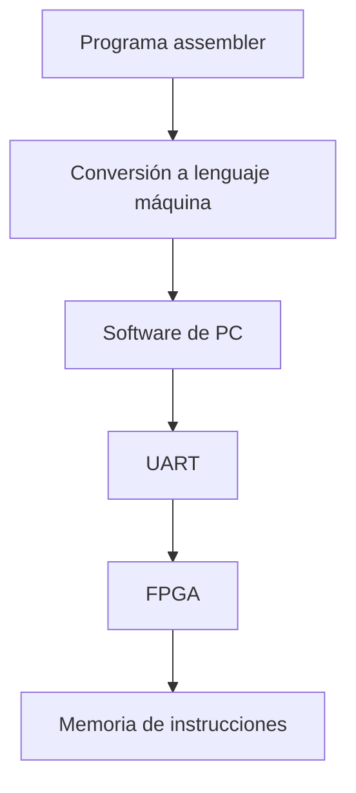
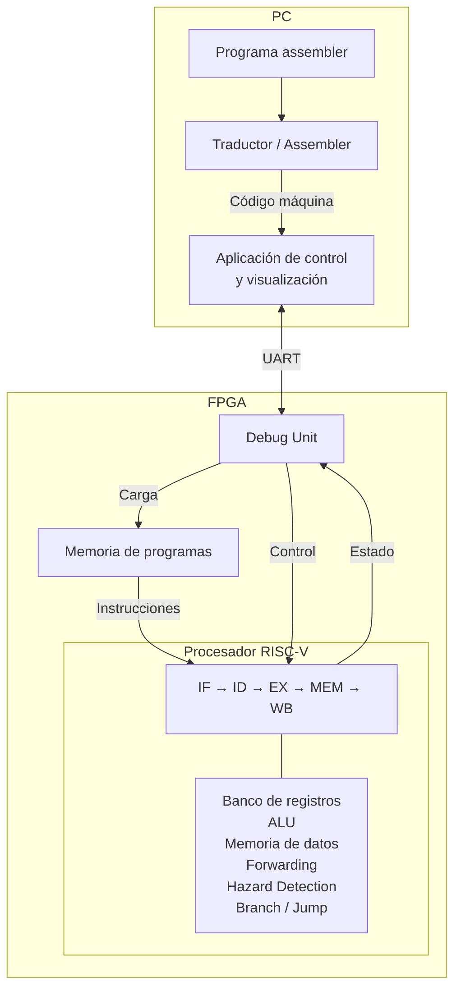

# Trabajo Práctico 3 — Procesador RISC-V Pipeline con Debug por UART

## 1. Objetivo general

El objetivo del Trabajo Práctico 3 es implementar en FPGA un **procesador RISC-V con pipeline de cinco etapas**, integrado con un sistema de **carga de programas, control de ejecución y depuración mediante UART**.

El sistema completo debe estar formado por tres partes principales:

1. **Procesador RISC-V pipeline**, implementado en la FPGA.
2. **Unidad de debug y comunicación UART**, encargada de conectar el procesador con una PC.
3. **Software de PC**, utilizado para escribir/cargar programas, controlar su ejecución y visualizar el estado interno del procesador.

El sistema debe permitir cargar y reemplazar programas sin necesidad de volver a sintetizar el diseño de la FPGA.

---

# 2. Procesador RISC-V

El procesador debe implementar una arquitectura RISC-V de 32 bits con un pipeline de cinco etapas:

Cada etapa tiene una responsabilidad específica y debe poder trabajar de manera solapada con las demás.

---

## 2.1. IF — Instruction Fetch

La etapa **Instruction Fetch** obtiene la próxima instrucción que debe ingresar al pipeline.

Debe encargarse de:

- mantener o utilizar el valor actual del **Program Counter (PC)**;
- acceder a la memoria de instrucciones;
- obtener la instrucción correspondiente;
- determinar cuál será la próxima dirección de ejecución según el flujo normal o un cambio de control.

La instrucción obtenida debe almacenarse en el registro intermedio correspondiente para que pueda ser procesada por la etapa siguiente.

---

## 2.2. ID — Instruction Decode

La etapa **Instruction Decode** interpreta la instrucción obtenida en IF.

Debe encargarse de:

- identificar el tipo y formato de la instrucción;
- identificar los registros involucrados;
- leer los operandos necesarios desde el banco de registros;
- obtener el valor inmediato cuando corresponda;
- generar la información de control necesaria para las etapas posteriores.

La información generada debe avanzar hacia la siguiente etapa a través del registro intermedio correspondiente.

---

## 2.3. EX — Execute

La etapa **Execute** realiza las operaciones principales asociadas a la instrucción.

Debe ser capaz de realizar, según corresponda:

- operaciones aritméticas;
- operaciones lógicas;
- desplazamientos;
- comparaciones;
- cálculos de direcciones para accesos a memoria;
- cálculos relacionados con branches;
- cálculos relacionados con jumps.

La ALU constituye el componente principal de esta etapa.

---

## 2.4. MEM — Memory

La etapa **Memory** se encarga de los accesos a la memoria de datos.

Según la instrucción, debe poder:

- leer información desde memoria;
- escribir información en memoria;
- transferir hacia la etapa siguiente un resultado que no requiere acceso a memoria.

Debe soportar los tamaños de acceso requeridos por las instrucciones implementadas.

---

## 2.5. WB — Write Back

La etapa **Write Back** completa las instrucciones que deben modificar el banco de registros.

Debe seleccionar el valor correcto a escribir y actualizar el registro destino cuando corresponda.

El valor escrito puede provenir, entre otros casos, de:

- una operación realizada por la ALU;
- una lectura de memoria;
- una instrucción de salto que deba guardar una dirección de retorno.

---

# 3. Registros intermedios del pipeline

Entre las cinco etapas deben existir registros intermedios que conserven la información necesaria para que cada instrucción continúe su recorrido por el pipeline.

Conceptualmente deben existir registros equivalentes a:

- IF/ID;
- ID/EX;
- EX/MEM;
- MEM/WB.

Estos registros deben conservar tanto los datos como la información de control que sea necesaria para las etapas posteriores.

También deben poder ser observados desde el sistema de debug.

---

# 4. Riesgos del pipeline

La ejecución solapada de varias instrucciones introduce situaciones en las que el procesador puede producir resultados incorrectos si no se toman medidas adicionales.

El diseño debe resolver correctamente los riesgos estructurales, de datos y de control.

---

## 4.1. Riesgos estructurales

Un riesgo estructural ocurre cuando dos instrucciones necesitan utilizar simultáneamente un mismo recurso y dicho recurso no permite ambos accesos en el mismo ciclo.

La arquitectura debe evitar que estas situaciones produzcan conflictos o resultados incorrectos.

---

## 4.2. Riesgos de datos

Un riesgo de datos ocurre cuando una instrucción necesita un valor que depende de una instrucción anterior cuyo resultado todavía no se encuentra disponible en el lugar esperado.

El procesador debe preservar las dependencias verdaderas entre instrucciones y garantizar que cada instrucción utilice el valor correcto.

Para ello deben implementarse los mecanismos necesarios de resolución de dependencias, incluyendo forwarding y/o detenciones del pipeline cuando corresponda.

---

## 4.3. Riesgos de control

Un riesgo de control ocurre cuando todavía no se conoce con certeza cuál será la próxima instrucción válida debido a un branch o jump.

El procesador debe evitar que instrucciones pertenecientes a un camino incorrecto produzcan efectos sobre:

- el banco de registros;
- la memoria de datos;
- el estado arquitectónico del procesador.

La arquitectura debe resolver correctamente los cambios de flujo y eliminar o invalidar las instrucciones incorrectas cuando sea necesario.

---

# 5. Conjunto mínimo de instrucciones

El procesador debe soportar, como mínimo, las siguientes instrucciones.

## 5.1. J-Type

- `jal`

## 5.2. S-Type

- `sb`
- `sh`
- `sw`

## 5.3. B-Type

- `beq`
- `bne`

## 5.4. U-Type

- `lui`

## 5.5. R-Type

- `add`
- `sub`
- `sll`
- `srl`
- `sra`
- `and`
- `or`
- `xor`
- `slt`
- `sltu`

## 5.6. I-Type — Load

- `lb`
- `lh`
- `lw`
- `lbu`
- `lhu`

## 5.7. I-Type — Operaciones inmediatas

- `addi`
- `andi`
- `ori`
- `xori`
- `slti`
- `sltiu`
- `slli`
- `srli`
- `srai`

## 5.8. Jump indirecto

- `jalr`

---

# 6. Memoria de instrucciones

El procesador debe disponer de una memoria de instrucciones o memoria de programa.

Esta memoria debe:

- almacenar las instrucciones del programa que se ejecutará;
- permitir que el procesador lea instrucciones durante la etapa IF;
- permitir que el sistema de carga escriba nuevas instrucciones desde la PC.

La memoria de programa debe poder ser modificada sin volver a sintetizar la FPGA.

---

# 7. Carga y reprogramación de programas

El sistema debe permitir programar y reprogramar el procesador mediante UART.

El flujo general debe ser:

El usuario debe poder cargar un nuevo programa desde la PC sin volver a generar el bitstream del diseño.

La reprogramación debe dejar al procesador en un estado coherente para comenzar una nueva ejecución.

La implementación debe definir claramente qué ocurre con:

- la memoria de instrucciones anterior;
- la memoria de datos;
- el banco de registros;
- los registros intermedios del pipeline;
- el Program Counter;
- cualquier estado interno adicional.

Estas decisiones deben ser documentadas y justificadas.

---

# 8. Conversión de assembler a lenguaje máquina

Los programas deben poder escribirse en assembler.

Debe existir una herramienta de software capaz de convertir el programa assembler al código máquina utilizado por el procesador.

La herramienta debe soportar, como mínimo, el conjunto de instrucciones requerido en este trabajo.

El resultado de la traducción debe poder enviarse a la FPGA mediante UART.

---

# 9. Finalización del programa

Debe existir un mecanismo que permita indicar que un programa ha finalizado.

Este mecanismo puede implementarse mediante una instrucción, codificación o convención de **HALT / STOP**, siempre que pueda ser detectado de forma confiable por el sistema.

Cuando se detecte el final del programa:

- no deben iniciarse nuevas instrucciones válidas;
- las instrucciones que todavía deban completar su ejecución deben tratarse correctamente;
- el pipeline debe quedar vacío antes de considerar finalizada completamente la ejecución.

También debe definirse qué comportamiento tendrá el sistema si se ejecuta un programa que no contiene una condición válida de finalización.

---

# 10. Modos de ejecución

El sistema debe soportar dos modos de ejecución:

1. ejecución continua;
2. ejecución paso a paso.

---

## 10.1. Ejecución continua

En este modo:

1. la PC envía un comando de inicio mediante UART;
2. el procesador comienza a ejecutar el programa cargado;
3. la ejecución continúa automáticamente;
4. el programa finaliza al detectarse la condición de STOP/HALT;
5. el pipeline debe quedar vacío;
6. el sistema envía a la PC la información de debug requerida.

La PC no debe enviar una orden por cada instrucción durante la ejecución continua.

---

## 10.2. Ejecución paso a paso

En este modo, cada comando de avance recibido desde la PC debe permitir avanzar **un único ciclo de clock del procesador**.

Un paso representa un ciclo de pipeline, no una instrucción completa.

En un mismo ciclo pueden avanzar simultáneamente varias instrucciones ubicadas en distintas etapas.

Después de cada paso debe poder observarse el estado interno requerido para depuración.

El modo paso a paso debe implementarse sin alterar incorrectamente la señal de clock principal.

---

# 11. UART

La UART es el canal de comunicación entre la PC y la FPGA.

Debe soportar comunicación en ambos sentidos.

## PC hacia FPGA

Debe permitir, como mínimo:

- cargar instrucciones;
- iniciar ejecución continua;
- seleccionar o utilizar el modo paso a paso;
- ordenar el avance de un ciclo;
- transmitir los comandos necesarios para operar el sistema.

## FPGA hacia PC

Debe permitir, como mínimo:

- transmitir información de estado;
- transmitir el contenido de los registros;
- transmitir los registros intermedios del pipeline;
- transmitir información de la memoria de datos.

La UART no forma parte del camino normal de ejecución de las instrucciones RISC-V.

---

# 12. Debug Unit

Debe implementarse una **Debug Unit** encargada de administrar la interacción entre la PC y el procesador.

Sus responsabilidades deben incluir:

- recibir comandos desde UART;
- interpretar dichos comandos;
- controlar la carga del programa;
- controlar el inicio de la ejecución;
- controlar el avance paso a paso;
- recopilar el estado interno requerido;
- enviar ese estado hacia la PC.

La Debug Unit debe permitir observar el procesador sin modificar incorrectamente su comportamiento funcional.

---

# 13. Información de debug obligatoria

El sistema debe poder enviar a la PC, mediante UART, la siguiente información.

## 13.1. Banco completo de registros

Debe poder transmitirse el contenido de los **32 registros** del procesador.

La información debe permitir identificar claramente:

- qué registro se está mostrando;
- cuál es su valor actual.

## 13.2. Registros intermedios del pipeline

Debe poder transmitirse el contenido de los registros intermedios asociados al pipeline.

Deben poder observarse los estados correspondientes a:

- IF/ID;
- ID/EX;
- EX/MEM;
- MEM/WB.

La representación exacta de sus campos puede definirse libremente siempre que permita interpretar correctamente el estado del pipeline.

## 13.3. Memoria de datos utilizada

Debe poder transmitirse a la PC el contenido relevante de la memoria de datos utilizada por el programa.

La implementación debe definir un criterio claro para determinar qué posiciones se consideran utilizadas.

Ese criterio debe mantenerse consistente y documentarse.

---

# 14. Software de PC

Debe desarrollarse una aplicación que permita interactuar con la FPGA.

La interfaz puede implementarse como:

- CLI;
- TUI;
- GUI;
- o una combinación de las anteriores.

Debe permitir, como mínimo:

- seleccionar o escribir un programa assembler;
- convertirlo a lenguaje máquina;
- cargarlo en la FPGA;
- iniciar la ejecución continua;
- ejecutar paso a paso;
- visualizar los 32 registros;
- visualizar los registros intermedios del pipeline;
- visualizar la memoria de datos utilizada;
- mostrar información de estado y errores de comunicación cuando corresponda.

---

# 15. Program Counter

El procesador debe disponer de un **Program Counter (PC)** que identifique la dirección asociada al flujo actual de ejecución.

Debe relacionarse con:

- la etapa IF;
- la memoria de instrucciones;
- la lógica de branches;
- la lógica de jumps;
- el mecanismo de finalización;
- el reinicio o carga de un nuevo programa.

La implementación debe garantizar que el PC avance o cambie de valor de manera coherente con la instrucción ejecutada.

---

# 16. Banco de registros

El procesador debe disponer de un banco de 32 registros compatible con el comportamiento arquitectónico requerido.

Debe permitir:

- leer los operandos necesarios para una instrucción;
- escribir resultados en la etapa WB;
- proporcionar su contenido completo a la Debug Unit.

La implementación debe respetar el comportamiento definido por RISC-V para los registros arquitectónicos.

---

# 17. Unidad de control

Debe existir lógica de control capaz de interpretar cada instrucción y generar las decisiones necesarias para el funcionamiento del datapath.

Debe controlar, según corresponda:

- operación de la ALU;
- selección de operandos;
- lectura y escritura de memoria;
- escritura del banco de registros;
- selección del dato de Write Back;
- tratamiento de branches;
- tratamiento de jumps;
- señales necesarias para transportar la información por el pipeline.

---

# 18. Generación de inmediatos

El procesador debe reconstruir correctamente los campos inmediatos correspondientes a los distintos formatos de instrucciones RISC-V.

La lógica de generación de inmediatos debe producir el valor adecuado para cada tipo de instrucción que lo requiera.

Ese valor debe estar disponible para las etapas posteriores del pipeline.

---

# 19. ALU

La ALU debe implementar todas las operaciones necesarias para soportar el conjunto mínimo de instrucciones.

Debe realizar, entre otras:

- suma;
- resta;
- AND;
- OR;
- XOR;
- comparaciones con signo;
- comparaciones sin signo;
- desplazamientos lógicos;
- desplazamientos aritméticos.

También podrá utilizarse para cálculos auxiliares relacionados con direcciones y control de flujo.

---

# 20. Forwarding

El procesador debe disponer de un mecanismo de forwarding cuando sea necesario para resolver dependencias de datos sin esperar innecesariamente a que el resultado sea escrito en el banco de registros.

El forwarding debe permitir utilizar resultados producidos por instrucciones anteriores que ya están disponibles dentro del pipeline.

El mecanismo debe evitar utilizar valores incorrectos o todavía no válidos.

---

# 21. Hazard Detection

Debe existir un mecanismo de detección de hazards.

Su responsabilidad es detectar situaciones en las que una instrucción no puede continuar correctamente debido a una dependencia o a una condición todavía no resuelta.

Cuando sea necesario, debe provocar la detención, espera, invalidación o inserción correspondiente para preservar el comportamiento correcto del programa.

---

# 22. Branches

El procesador debe soportar:

- `beq`;
- `bne`.

Para estas instrucciones debe:

- comparar correctamente los operandos;
- determinar si el branch se toma;
- calcular el destino correcto;
- actualizar el flujo de ejecución;
- impedir que instrucciones del camino incorrecto modifiquen el estado del procesador.

---

# 23. Jumps

El procesador debe soportar:

- `jal`;
- `jalr`.

Debe:

- calcular el destino correcto;
- modificar el PC;
- guardar la dirección de retorno cuando corresponda;
- impedir que instrucciones incorrectamente iniciadas continúen produciendo efectos.

---

# 24. Memoria de datos

El procesador debe disponer de una memoria de datos accesible desde la etapa MEM.

Debe soportar:

## Stores

- byte mediante `sb`;
- halfword mediante `sh`;
- word mediante `sw`.

## Loads

- byte con signo mediante `lb`;
- halfword con signo mediante `lh`;
- word mediante `lw`;
- byte sin signo mediante `lbu`;
- halfword sin signo mediante `lhu`.

La memoria debe interactuar con la Debug Unit para permitir observar el contenido utilizado durante la ejecución.

---

# 25. Clock

La señal de clock principal del sistema no debe ser manipulada de forma incorrecta para controlar la ejecución.

No deben implementarse soluciones que dependan de modificar arbitrariamente el clock como parte del funcionamiento lógico normal del procesador.

El control de modos de ejecución debe realizarse preservando una distribución de clock válida y verificable.

---

# 26. Análisis temporal

Una vez integrado el diseño, debe realizarse un análisis temporal.

Debe determinarse:

- el camino crítico;
- la demora asociada;
- la frecuencia máxima razonable de operación;
- la presencia de problemas relacionados con clock o skew;
- las métricas de timing reportadas por Vivado.

La frecuencia utilizada finalmente debe ser compatible con los resultados del análisis temporal.

---

# 27. Reprogramación y reinicio del estado

La arquitectura debe definir un procedimiento coherente para comenzar una nueva ejecución.

Debe establecerse explícitamente qué ocurre con:

- PC;
- memoria de instrucciones;
- memoria de datos;
- banco de registros;
- registros intermedios del pipeline;
- estado de la Debug Unit;
- estado de control.

No existe una única política obligatoria para todos estos elementos, pero la elegida debe garantizar que un programa nuevo pueda ejecutarse correctamente y debe quedar documentada.

---

# 28. Comportamiento ante ausencia de STOP

El sistema debe definir qué sucede si un programa no contiene una condición de finalización válida.

La política elegida puede incluir, por ejemplo:

- ejecución indefinida;
- una condición externa de aborto;
- un límite de ejecución;
- otro mecanismo equivalente.

La decisión debe estar documentada y debe ser coherente con los modos de ejecución implementados.

---

# 29. Decisiones de implementación

Los siguientes aspectos forman parte del diseño del sistema y deben definirse de forma explícita:

- tamaño de la memoria de instrucciones;
- tamaño de la memoria de datos;
- protocolo exacto utilizado sobre UART;
- baud rate;
- codificación de comandos;
- formato de las respuestas;
- representación de HALT/STOP;
- política de limpieza al reprogramar;
- criterio para determinar memoria de datos utilizada;
- estrategia concreta de forwarding;
- estrategia concreta de hazard detection;
- estrategia de flush o invalidación;
- etapa donde se resuelven branches y jumps;
- frecuencia final de operación;
- organización interna de módulos;
- formato de la interfaz de usuario.

Estas decisiones no deben alterar los requisitos funcionales definidos en este documento.

---

# 30. Diagrama conceptual del sistema

---

# 31. Resultado esperado

Al finalizar el trabajo debe existir un sistema capaz de:

1. recibir un programa RISC-V escrito en assembler;
2. traducirlo a lenguaje máquina;
3. cargarlo en la FPGA mediante UART;
4. almacenarlo en la memoria de instrucciones;
5. ejecutar sus instrucciones sobre un pipeline de cinco etapas;
6. resolver correctamente dependencias y cambios de flujo;
7. ejecutar de forma continua;
8. ejecutar un ciclo por vez en modo paso a paso;
9. detectar la finalización del programa;
10. vaciar correctamente el pipeline al finalizar;
11. enviar información interna del procesador hacia la PC;
12. mostrar los 32 registros;
13. mostrar los registros intermedios del pipeline;
14. mostrar la memoria de datos utilizada;
15. permitir cargar un nuevo programa sin volver a sintetizar la FPGA;
16. operar a una frecuencia justificada mediante análisis temporal.
