# Plan profesional de desarrollo — TP3 Procesador RISC-V Pipeline

## 1. Propósito del documento

Este documento define el proceso de trabajo recomendado para desarrollar el TP3 de manera ordenada, verificable y mantenible.

El objetivo principal es **reducir errores costosos de integración y rediseño**, invirtiendo más tiempo al comienzo en requisitos, diseño y verificación, para disminuir el tiempo total del proyecto.

La implementación no debe comenzar como una sucesión de módulos escritos de manera aislada. El proyecto debe avanzar siguiendo una secuencia controlada:

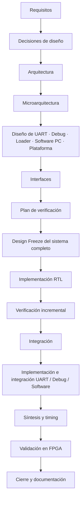

Cada fase tiene entregables concretos y una condición de salida. No se debe avanzar a la fase siguiente mientras la anterior tenga decisiones críticas sin resolver.

**Vigencia de hazards (2026-09-26):** `DEC-ARCH-003` está aprobada con 47 acuerdos. Las referencias de este plan a los acuerdos previos de confirmación, arbitraje, enables y verificación se interpretan con la revisión del acuerdo 47: IF solo detecta, todo fetch fault se confirma en ID, y el control selecciona ocho acciones (seis no terminales y dos de drenado). La matriz 46 queda revisada por el 47.

---

# 2. Principios de trabajo

## 2.1. Diseñar antes de implementar

Ningún bloque RTL debe escribirse antes de conocer:

- qué responsabilidad tiene;
- qué datos recibe;
- qué datos produce;
- en qué ciclo actúa;
- qué estado mantiene;
- qué requisitos satisface;
- cómo se verificará.

La implementación debe materializar una arquitectura previamente definida, no crearla de manera accidental.

### Condición común para comenzar implementación

**Criterio de trabajo establecido — 2026-09-30:** completar el diseño del sistema entero antes de programar cualquier componente. Esto comprende CPU, Debug, UART, protocolo, Loader, preparación de sesión, software de PC y plataforma. Tener especificada una ALU u otro bloque independiente no habilita a implementarlo mientras el diseño global siga abierto.

**Criterio de alcance establecido — 2026-10-01:** Mantener el diseño proporcional al trabajo práctico. La PC y la FPGA se diseñan conjuntamente y se asume que el cliente cumple el protocolo. Conservar las comprobaciones, timeouts y recuperación básicos aprobados, sin agregar mecanismos ni pendientes por incumplimientos arbitrarios del emisor o casos extremos ajenos al uso previsto. Completar el diseño significa especificar el funcionamiento requerido para el TP, sin exigir robustez de un producto de propósito general.

Antes de escribir RTL, software, modelos ejecutables o testbenches deben estar definidos y revisados:

- los tres pendientes actuales, respetando sus dependencias;
- el criterio de DMEM utilizada, contenido observable y mecanismo de captura coherente;
- los servicios UART, comandos, paquetes, respuestas, errores, timeouts y recuperación;
- la microarquitectura de Debug, recepción/carga y preparación: estados privados, eventos, secuencias, ownership y relación con la FSM global;
- la estrategia del assembler y validación de imagen, las capas de software, sus interfaces y los flujos de uso;
- los puertos, parámetros, tipos, codificaciones y adaptaciones físicas que aún figuran como parciales en interfaces.md, incluida la composición de los tops;
- la integración prevista de clock/reset, recursos y restricciones de plataforma;
- los casos de prueba, resultados esperados, assertions previstas y matriz requisito → diseño → prueba, documentados sin programar todavía los tests.

El hito **D0 — Design Freeze del sistema completo** registra ese cierre. Durante esta etapa se trabaja en especificaciones, tablas, diagramas, secuencias por ciclo y revisión documental. La implementación incremental comienza después de D0 y M6; no se adelantan bloques por considerar que sus contratos locales ya están cerrados.

El cierre significa que las decisiones y conexiones necesarias están especificadas. Simulación, inferencia, timing y FPGA se comprobarán en implementación. Si esa evidencia exige un cambio, se revisará explícitamente el diseño y sus documentos antes de continuar; no se resolverá una ambigüedad silenciosamente dentro del código.

---

## 2.2. Ninguna decisión arquitectónica debe quedar escondida dentro del código

Toda decisión importante debe estar documentada.

Ejemplos:

- política de STOP/HALT;
- política de flush;
- política de stalls;
- política de forwarding;
- estado que se limpia al reprogramar;
- significado de “memoria utilizada”;
- protocolo UART;
- frecuencia de operación;
- tamaño de memorias.

El código no debe ser la única fuente desde la cual pueda descubrirse una decisión importante.

---

## 2.3. Todo requisito debe poder verificarse

Cada requisito debe terminar asociado a uno o más tests.

La relación deseada es:

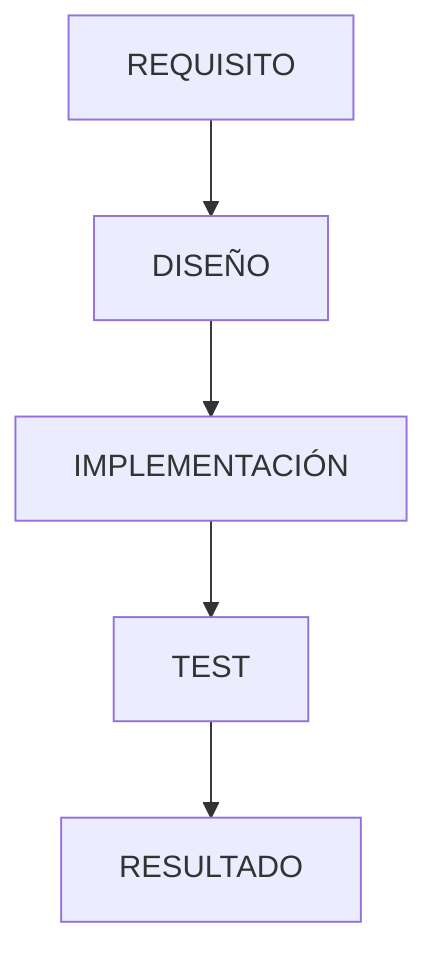

El proyecto debe poder responder objetivamente si cada requisito está:

- verificado;
- pendiente;
- fallando.

---

## 2.4. Integrar progresivamente

Nunca debe esperarse al final para conectar todos los módulos.

La estrategia correcta es:

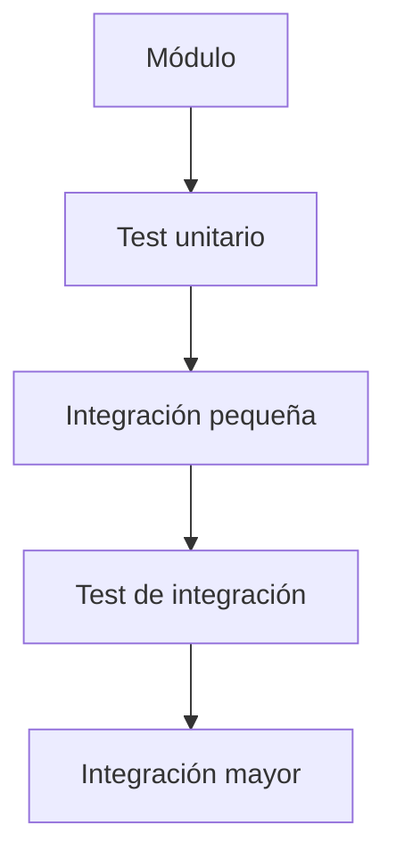

Esto reduce drásticamente la cantidad de posibles causas cuando aparece un error.

---

## 2.5. La IA implementa especificaciones; no inventa la arquitectura

Los agentes de IA deben utilizarse como herramientas de implementación, revisión y generación de tests.

No deben recibir instrucciones vagas como:

> Implementar el procesador completo.

Deben recibir tareas acotadas y basadas en documentos ya aprobados.

---

# 3. Organización inicial del repositorio

Antes de diseñar el hardware debe definirse una estructura de proyecto consistente.

Una organización recomendada es:

```text
/docs
    requirements.md
    decisions.md
    architecture.md
    isa.md
    pipeline.md
    interfaces.md
    hazards.md
    protocol.md
    verification_plan.md

/rtl
    ...

/tb
    ...

/software
    ...

/programs
    ...

/scripts
    ...

/constraints
    ...
```

## Entregables de esta fase

- repositorio creado;
- estructura de carpetas definida;
- convención de nombres acordada;
- estrategia de branches/commits definida;
- documento de requisitos incorporado.

## Gate de salida

No avanzar hasta que todos los integrantes sepan dónde se documentan requisitos, decisiones, diseño, tests y código.

---

# 4. Fase 1 — Congelamiento de requisitos

## Objetivo

Transformar la consigna en una lista de requisitos claros, numerados y verificables.

Cada requisito debe tener un identificador.

Ejemplo:

```text
REQ-CPU-002
El procesador debe implementar las etapas IF, ID, EX, MEM y WB.

REQ-EXEC-009
En modo paso a paso, cada comando STEP debe permitir avanzar exactamente un ciclo del procesador.

REQ-DBG-005
La Debug Unit debe transmitir los 32 registros con índice y valor.
```

## Clasificación recomendada

- `REQ-CPU-*` — procesador;
- `REQ-ISA-*` — instrucciones;
- `REQ-HAZ-*` — hazards;
- `REQ-MEM-*` — memorias;
- `REQ-DBG-*` — debug;
- `REQ-UART-*` — comunicación;
- `REQ-EXEC-*` — modos de ejecución;
- `REQ-SW-*` — software de PC;
- `REQ-TIM-*` — timing;
- `REQ-DOC-*` — documentación.

## Actividades

1. Recorrer la consigna completa.
2. Convertir cada obligación en un requisito independiente.
3. Eliminar ambigüedades de redacción.
4. Identificar decisiones abiertas.
5. Separar requisitos obligatorios de decisiones de implementación.

## Entregables

- `requirements.md`;
- matriz inicial de requisitos;
- listado de decisiones abiertas.

## Gate de salida

No avanzar si existe un requisito importante cuya interpretación todavía sea ambigua.

---

# 5. Fase 2 — Registro de decisiones abiertas

## Objetivo

Resolver las decisiones que la consigna deja al grupo antes de que estas aparezcan accidentalmente dentro del código.

Cada decisión debe registrarse con un identificador.

Ejemplo:

```text
DEC-001 — Política de reprogramación

Decisión:
...

Motivo:
...

Consecuencias:
...

Requisitos afectados:
...
```

## Decisiones que deben cerrarse tempranamente

- representación de STOP/HALT;
- criterio de finalización;
- política de vaciado del pipeline;
- comportamiento ante programa sin STOP;
- política de reprogramación;
- estado que se reinicia;
- capacidades parametrizables de las memorias y perfil de referencia;
- criterio de “memoria utilizada”;
- formato general del protocolo UART;
- información exacta que expondrá Debug;
- política general de reset.

## Entregable

- `decisions.md`.

## Gate de salida

Toda decisión que afecte a más de un módulo debe estar resuelta antes de diseñar esos módulos.

---

# 6. Fase 3 — Arquitectura global

## Objetivo

Definir los grandes subsistemas y sus responsabilidades sin entrar todavía en señales RTL.

El sistema debe visualizarse como tres subsistemas principales:

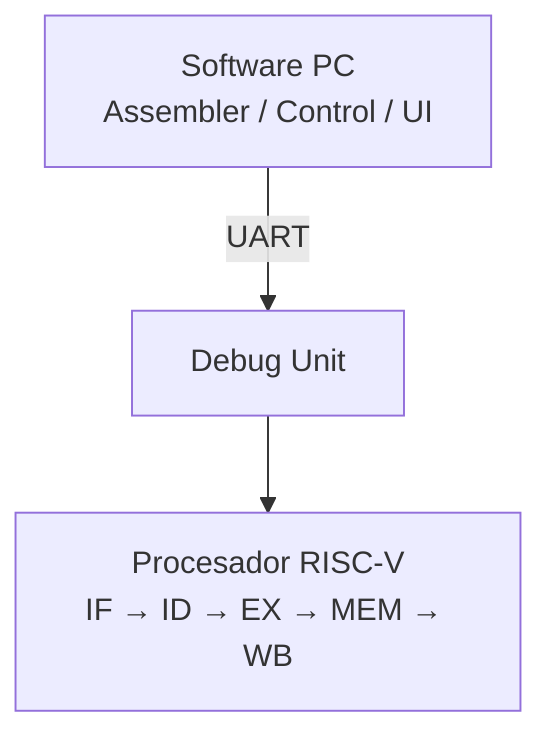

## Subsistemas principales

### Procesador

Responsable de ejecutar instrucciones RISC-V.

### Debug Unit

Responsable de:

- carga de programa;
- control de ejecución;
- recopilación de estado;
- comunicación con la UART.

### Software de PC

Responsable de:

- traducir assembler;
- transmitir programas;
- enviar comandos;
- interpretar respuestas;
- mostrar el estado del procesador.

## Invariantes de direccionamiento acordadas

- el PC y las direcciones efectivas utilizadas por el procesador se expresan en bytes;
- el flujo secuencial de instrucciones de 32 bits utiliza `PC + 4`;
- los offsets de memoria y de control se interpretan en bytes conforme a RV32I;
- la dirección arquitectónica debe mantenerse separada del índice físico de cada memoria;
- Instruction Memory y Data Memory ocupan espacios lógicos independientes sin aliasing;
- `IMEM_BASE`, `DMEM_BASE` y `ENTRY_POINT` valen `0x00000000`;
- los límites exclusivos son `IMEM_CAPACITY_BYTES` y `DMEM_CAPACITY_BYTES`, derivados de la configuración autoritativa;
- IMEM y DMEM utilizan little-endian: la dirección menor contiene los bits menos significativos;
- la imagen ejecutable es un prefijo contiguo desde cero delimitado por `loaded_image_size_bytes`, del cual se deriva `image_valid`;
- CPU/loader sobre IMEM y CPU/Debug sobre DMEM no requieren acceso directo simultáneo para satisfacer el contrato mínimo;
- IF y MEM sí pueden demandar simultáneamente sus memorias lógicamente independientes;
- IF obtiene instrucciones completas de 32 bits: el direccionamiento por byte no implica fetches parciales.

## Entregable

- `architecture.md`;
- diagrama general;
- descripción de responsabilidades.

## Gate de salida

Todos los integrantes deben poder explicar el sistema completo sin consultar código.

---

# 7. Fase 4 — Especificación del ISA soportado

## Objetivo

Definir formalmente el comportamiento de cada instrucción requerida.

Debe construirse una tabla única que actúe como referencia para Control Unit, datapath, tests y assembler.

`DEC-ARCH-004` fija como **únicas codificaciones legales** las 32 instrucciones RV32I requeridas (`jal`, `jalr`, `beq`, `bne`, `lb`, `lh`, `lw`, `lbu`, `lhu`, `sb`, `sh`, `sw`, `lui`, `add`, `sub`, `sll`, `srl`, `sra`, `and`, `or`, `xor`, `slt`, `sltu`, `addi`, `andi`, `ori`, `xori`, `slti`, `sltiu`, `slli`, `srli`, `srai`) según RISC-V User-Level ISA V2.2 y la word custom exacta `halt = 0x0000000B`. El reconocimiento de cada instrucción deberá respetar su patrón **completo**, incluidos los campos fijos y restricciones aplicables, sin restringir los operandos e inmediatos legales ni aceptar una coincidencia parcial de `opcode`/`funct3`/`funct7`. Cualquier otra codificación de 32 bits será un candidato de fault por instrucción inválida, no una instrucción adicional por pertenecer a RV32I. Su **detección como candidato ocurre en ID**; su eventual confirmación exige operación válida, camino correcto y ausencia de un evento más antiguo prevaleciente. El trigésimo séptimo acuerdo de `DEC-ARCH-003` fija después el decoder combinacional, `illegal_candidate` y los controles de cada patrón; la confirmación respeta la prioridad por antigüedad y las etapas ya aprobadas, y el cuadragésimo acuerdo fija después sus señales de detección/confirmación; los acuerdos 41–42 fijan después el arbitraje/enables y el 45 audita las coincidencias funcionales.

Ejemplo:

| Instrucción | rs1 | rs2 | Inmediato | Operación | Memoria | rd | Cambio de flujo |
|---|---:|---:|---|---|---|---:|---|
| `add` | Sí | Sí | — | ADD | — | Sí | No |
| `addi` | Sí | No | I | ADD | — | Sí | No |
| `lw` | Sí | No | I | dirección | lectura word | Sí | No |
| `sw` | Sí | Sí | S | dirección | escritura word | No | No |
| `beq` | Sí | Sí | B | comparación | — | No | Condicional |
| `jal` | No | No | J | salto | — | Sí | Incondicional |

## Debe definirse para cada instrucción

- registros fuente;
- registro destino;
- tipo de inmediato;
- extensión de signo;
- operación ALU;
- acceso a memoria;
- tamaño de acceso;
- signed/unsigned;
- valor de Write Back;
- modificación del PC.

La tabla de ISA deberá permitir distinguir patrón legal de contenido dentro de la imagen confirmada y de validez de una entrada del pipeline. Una word puede pertenecer al prefijo cargado de IMEM y ser ilegal: **ID** detecta su codificación; un fetch fuera de ese prefijo es un candidato distinto detectado en **IF**, conforme a `DEC-ARCH-001` y el quinto acuerdo de `DEC-ARCH-004`. Un candidato de instrucción inválida descartado por un redirect más antiguo no se confirma arquitectónicamente por la mera coincidencia de bits, conforme a `DEC-ARCH-002`. La inspección preventiva opcional del loader no reemplaza la política aprobada de confirmación, drenado y llegada a `FAULT`; el mecanismo físico se integrará posteriormente.

Verificar la clasificación de las **33 instrucciones legales** con campos variables permitidos (destinos `x0`, operandos e inmediatos de frontera incluidos) y rechazar patrones cercanos no soportados: otros branches/operaciones estándar, bits fijos o combinaciones `funct3`/`funct7` ilegales, codificaciones reservadas, `0x00000000` y otras palabras `custom-0` que no sean exactamente `0x0000000B`. Contrastar una palabra ilegal dentro del prefijo confirmado, un fetch fuera de imagen y una codificación candidata del camino joven `wrong-path`; verificar su **clasificación como candidato**, la prioridad de la instrucción más antigua cuando ambas pertenezcan al camino correcto y el descarte del candidato joven ante un evento anterior prevaleciente, con las confirmaciones del cuadragésimo acuerdo y sin prescribir enables, flush o coincidencias globales aún no cubiertas; entre misalignment y access fault de un mismo acceso prevalece misalignment y un fault confirmado sigue el drenado preciso y la atomicidad de `DEC-ARCH-004`.

## Entregable

- `isa.md`.

## Gate de salida

No debe existir ninguna instrucción requerida cuyo comportamiento interno siga siendo ambiguo; la tabla y sus casos de clasificación deberán distinguir las codificaciones de las 33 instrucciones legales del resto sin clasificar como legal una palabra cargada ilegal ni tratar los bits residuales de una entrada inválida como instrucción activa.

---

# 8. Fase 5 — Diseño del datapath base

## Objetivo

Determinar cómo viajan los datos por el procesador antes de introducir optimizaciones o resolución de hazards.

Debe diseñarse:

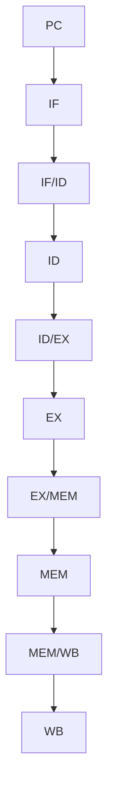

El primer acuerdo parcial de `DEC-ARCH-007` fija el **Register File arquitectónico de 32 × 32 bits** y su interfaz funcional **2R1W**. En ID, `rs1[4:0]` y `rs2[4:0]` direccionan dos lecturas independientes que entregan respectivamente `rs1_value[31:0]` y `rs2_value[31:0]` para su transporte a ID/EX cuando corresponda; ambos operandos pueden obtenerse simultáneamente. El segundo acuerdo fija la **lectura combinacional**: `IF/ID.instruction → rs1/rs2 → Register File → rs1_value/rs2_value → ID/EX`, sin flanco ni ciclo adicional para leer. Solo un ciclo CPU efectivo autorizado que capture una nueva entrada válida en ID/EX incorpora arquitectónicamente esos valores originales; durante HOLD las salidas combinacionales pueden variar sin que ID/EX capture ni avance el pipeline. En WB, un único puerto funcional recibe `rd[4:0]`, `MEM/WB.wb_value[31:0]` y una condición de escritura válida. El tercer acuerdo fija la **escritura síncrona** exclusivamente en el flanco activo de un ciclo CPU efectivo autorizado y para `MEM/WB.valid && MEM/WB.reg_write && MEM/WB.rd != x0`, tomando los campos **anteriores al flanco**, no la entrada que MEM/WB pueda capturar simultáneamente. No hay escritura arquitectónica anticipada en EX o MEM. En HOLD, incluso con MEM/WB retenida durante varios clocks físicos, el banco no recibe writeback ni repite el de esa instrucción. `x0` conserva permanentemente cero conforme a `REQ-CPU-013`; su representación física concreta y los detalles RTL se elegirán en implementación bajo la neutralidad de primitiva del octavo acuerdo de `DEC-ARCH-007`; la integración temporal del banco con avance, HOLD, reset y sesión ya está fijada por el séptimo acuerdo conforme a `DEC-ARCH-008`. El cuarto acuerdo fija el **resultado arquitectónico**: cada puerto coincidente observa el `MEM/WB.wb_value` nuevo; el quinto fija el **bypass combinacional explícito WB→ID** para obtenerlo, sin depender del modo de lectura/escritura del recurso físico. La observación de los 32 registros por Debug no impone un puerto funcional adicional y se definirá con su mecanismo de snapshot o consulta.

El quinto acuerdo de `DEC-ARCH-007` implementa la coincidencia mediante **selección combinacional independiente en ambas lecturas de ID**: `bypass_rsN = cpu_effective_cycle && MEM/WB.valid && MEM/WB.reg_write && MEM/WB.rd != x0 && MEM/WB.rd == rsN`; `rsN_value` elige `MEM/WB.wb_value` cuando ese término es verdadero y `RF[rsN]` en otro caso. ID/EX conserva como base el valor **posbypass**, no necesariamente el dato crudo del almacenamiento, si captura una instrucción válida; lectura de `x0` siempre devuelve cero y ningún intento de escribir `x0` modifica el banco ni activa bypass. Este camino interno WB→ID es distinto de los dos muxes 3:1 aprobados en `DEC-ARCH-003` que seleccionan posteriormente los valores efectivos de EX entre ID/EX, EX/MEM y MEM/WB. El sexto acuerdo fija que el valor posbypass es solo la base de ID/EX: la Forwarding Unit y los muxes externos conservan su prioridad por productor más reciente y disponibilidad, incluido el stall `load-use`. El séptimo acuerdo aplica a esos caminos las prioridades globales y los ciclos efectivos de `DEC-ARCH-008`; el octavo acuerdo permite elegir el recurso físico en implementación solo si conserva íntegramente el contrato, y el noveno acuerdo ya fija los casos límite y la matriz mínima de verificación para el cierre aprobado.

Así, si `I1` escribe `x5 = 10` en WB mientras `I2` más reciente producirá `x5 = 20` e `I4` lee `x5` en ID, el bypass puede capturar `10` como base de I4; al llegar I4 a EX, usa `20` si I2 es el productor pendiente más reciente con dato disponible. Si I2 aún no tiene su dato (por ejemplo, un load), I4 espera sin utilizar `10` como fallback. Si WB es el único productor relevante, el valor posbypass ya es el correcto y no se introduce stall adicional. El bypass WB→ID tampoco elimina el stall nominal de un `load-use` inmediato ni el reenvío posterior desde MEM/WB.

El séptimo acuerdo de `DEC-ARCH-007` aplica al banco la prioridad **reset global > LOAD aceptado/preparación > ciclo CPU efectivo > HOLD**: el reset funcional prevalece sobre writeback y deja `x0…x31` lógicamente en cero; durante LOAD/preparación no hay writebacks CPU y el banco debe quedar lógicamente en cero antes del commit, sin iniciar automáticamente RUN o STEP. RUN autoriza los writebacks elegibles de ciclos efectivos; un STEP aceptado autoriza un único ciclo y a lo sumo la escritura de su MEM/WB previa; HOLD conserva el banco aun con MEM/WB válida durante varios clocks físicos. Las instrucciones anteriores supervivientes a `HALT_DRAIN` o `FAULT_DRAIN` escriben solo en ciclos efectivos: automáticamente bajo RUN o mediante un STEP nuevo por ciclo. La realización física de la puesta a cero se elegirá en implementación conforme al octavo acuerdo, sin imponer clear paralelo ni equiparar ciclos de preparación con ejecución CPU.

## Análisis obligatorio

Debe seguirse manualmente el recorrido de al menos:

- `add`;
- `addi`;
- `lw`;
- `sw`;
- `beq`;
- `jal`;
- `jalr`;
- `lui`.

Para cada una debe identificarse:

- dónde nace cada dato;
- en qué etapa se utiliza;
- hasta qué etapa debe conservarse;
- dónde termina.

Para `jal` y `jalr`, seguir además `instruction_PC + 4` desde `ID/EX.pc` hasta la escritura arquitectónica en WB, independiente del PC global de IF. El `Link Adder` lo calcula físicamente en EX, el `Result MUX` lo consolida en `EX/MEM.ex_result` y el `WB Value MUX` en MEM selecciona ese mismo resultado como `MEM/WB.wb_value`, sin campo registrado adicional `link_value`.

Verificar la interfaz 2R1W con dos índices fuente distintos leídos de manera independiente en ID y disponibles conjuntamente para los valores originales de ID/EX; contrastar cada dirección con su dato, inclusive cuando una instrucción solo usa una de las fuentes. Sin escritura concurrente al registro leído, variar cada índice de lectura y comprobar que su salida refleja el valor correspondiente **sin esperar flanco ni ciclo adicional**. En un ciclo efectivo RUN o STEP que capture una entrada válida en ID/EX, comprobar que `rs1_value` y `rs2_value` corresponden a esa instrucción y quedan disponibles como respaldo del forwarding; una bubble o flush no convierte bits residuales en operandos válidos. Durante HOLD las salidas pueden cambiar combinacionalmente, pero ID/EX y el pipeline permanecen estables sin writeback. Comprobar que un productor válido en WB entrega su `rd` y `wb_value` al puerto de escritura y que una instrucción sin escritura válida, inválida o dirigida a `x0` no altera el banco; confirmar que EX y MEM no escriben arquitectónicamente el Register File. Para `x0` comprobar siempre lectura de cero sin prescribir su bloqueo o representación física. En RUN y STEP, comprobar que solo el flanco del ciclo efectivo escribe una vez como máximo desde los campos previos de MEM/WB cuando `valid`, `reg_write` y `rd != x0`; en HOLD, mantener MEM/WB válida durante varios clocks físicos sin cambio del banco ni repetición de writeback. Probar `valid=0`, `reg_write=0`, `rd=x0`, bits residuales, stores, branches, `halt`, entradas descartadas y causantes de fault sin escritura propia, conservando las escrituras anteriores supervivientes al fault. Para la coincidencia WB→ID, comprobar por separado `rs1`, `rs2` y ambos a la vez (por ejemplo, WB escribe `x5 = 100` e ID lee `add x7, x5, x5`): cada puerto coincidente presenta `MEM/WB.wb_value` y ese valor base se captura en ID/EX si ingresa una instrucción válida. El puerto no coincidente conserva su lectura ordinaria; `rd=x0`, `valid=0`, `reg_write=0` o HOLD no seleccionan `wb_value` por coincidencia de bits y leer `x0` siempre da cero. Comparar el valor seleccionado desde los campos **previos al flanco** con la entrada que MEM/WB capturará en ese mismo ciclo, preservando la distinción. Exigir bypass combinacional explícito a cada lectura ID sin depender de la semántica física read-first/write-first/no-change; su frontera funcional con forwarding externo y hazards ya está acordada; el forwarding de EX/MEM y MEM/WB sigue el contrato independiente de `DEC-ARCH-003`, y la tecnología física del banco permanece abierta.

En la verificación del bypass explícito, forzar en la prueba un valor **crudo** de RF distinto de `MEM/WB.wb_value` para el índice coincidente y comprobar que la salida combinacional elegida y la captura válida en ID/EX usan el valor nuevo de WB, tanto con un solo puerto coincidente como con ambos. Contrastar con puerto no coincidente, `rd=x0`, `rs1=x0`/`rs2=x0`, `MEM/WB.valid=0`, `reg_write=0` y HOLD: no hay selección espuria ni efectos de bits residuales; ambos puertos que leen `x0` entregan cero. Repetir con productores elegibles de distinto origen arquitectónico y comprobar que el dato base posbypass no anula la selección posterior del productor pendiente más reciente en EX. No imponer modo específico del recurso de almacenamiento; el cuadragésimo tercer acuerdo fija posteriormente `rf_write_fire` y su uso común como `wb_write_enable`.

Ejercitar la frontera funcional con el productor WB como único coincidente (base posbypass correcta sin espera adicional), luego con otro productor más reciente cuyo dato disponible en EX/MEM o MEM/WB, según su avance, prevalece en EX sobre esa base, y finalmente con un load inmediato cuyo dato aún no está disponible en EX/MEM: subsiste el stall nominal y la consumidora utiliza MEM/WB después de avanzar, sin usar la base vieja ni añadir otro stall por el bypass. Verificar ambos operandos de forma independiente y distinguir el `MEM/WB.wb_value` de WB→ID de la fuente MEM/WB de los muxes de EX; conservar validez, `rd != x0`, uso semántico de fuentes y la invariancia de HOLD. Las prioridades globales de reset y LOAD provienen de `DEC-ARCH-008`, sin definir aquí nuevas fases o enables RTL.

Verificar el contrato temporal del banco después de ensuciar varios registros y dejar una instrucción escritora en MEM/WB: en RUN, cada ciclo efectivo compromete a lo sumo el writeback elegible **preflanco** una vez; en STEP, uno aceptado permite exactamente un ciclo y cero o una escritura, sin otra hasta un nuevo STEP; en HOLD, varios clocks físicos con MEM/WB válida no cambian el RF. Hacer coincidir reset funcional con un writeback candidato: prevalece el cero lógico de `x0…x31` y no se compromete la instrucción; al aceptar LOAD se inhiben commits CPU y la nueva sesión solo puede confirmarse tras restablecer el cero lógico del banco, quedando preparada pero detenida. Durante `HALT_DRAIN` y `FAULT_DRAIN`, comprobar que anteriores válidas escriben exactamente al avanzar por los ciclos autorizados de RUN o STEP, sin escrituras de causantes/jóvenes descartadas ni duplicación en HOLD. El mecanismo físico de puesta a cero no es criterio de estas pruebas; `x0` siempre lee cero.

El octavo acuerdo de `DEC-ARCH-007` permite implementar el Register File con registros, RAM distribuida/LUT, BRAM u otro recurso equivalente, sujeto a su **interfaz y temporización observables**, no a la primitiva inferida. En evaluación de síntesis y timing, documentar el recurso elegido y comprobar que ambas lecturas ID entregan el dato combinacionalmente, sin presentar la dirección y esperar un flanco ni insertar ciclos o etapas; que la escritura sigue siendo síncrona y única por ciclo efectivo elegible; y que el bypass explícito entrega el nuevo valor para coincidencias WB→ID independientemente del modo físico `write-first`/`read-first`/`no-change`. Si el recurso no satisface directamente esas condiciones, emplear otro o lógica adicional que preserve el contrato, incluidos `x0`, HOLD, RUN/STEP, drenados y cero lógico tras reset/preparación. El noveno acuerdo fija la matriz mínima obligatoria de 23 casos y cierra `DEC-ARCH-007`; sus pruebas de forwarding y `load-use` son la frontera con `DEC-ARCH-003`, cuya implementación permanece pendiente.

Tomar la **matriz de 23 casos de `DEC-ARCH-007` en `decisions.md`** como criterio mínimo de aceptación del Register File: cubrir índices iguales y distintos, ambas lecturas combinacionales, escrituras válidas e inhibidas, `x0`, cada coincidencia WB→ID, prioridad del productor más reciente, `load-use`, WB como único productor, RUN, STEP, HOLD con MEM/WB retenida durante varios clocks físicos, reset, nueva sesión, ambos drenados y equivalencia entre recursos físicos elegibles. La matriz documenta verificaciones exigidas; no presupone que ya se hayan ejecutado.

Para las instrucciones que calculan direcciones deberá identificarse además:

- la dirección arquitectónica expresada en bytes;
- el desplazamiento en bytes definido por el ISA;
- la conversión posterior a un índice físico, sin incorporarla a la semántica arquitectónica;
- el ancho del acceso cuando corresponda.

## Entregable

- primer apartado de `pipeline.md`;
- diagrama de datapath.

## Gate de salida

Cada dato necesario en una etapa posterior debe tener un camino explícito desde su origen.

---

# 9. Fase 6 — Diseño del control

## Objetivo

Determinar qué decisiones necesita tomar el procesador para cada instrucción.

Deben identificarse conceptos de control como:

- escritura de registros;
- lectura/escritura de memoria;
- tamaño de memoria;
- signed/unsigned;
- selección de operandos;
- operación de ALU;
- selección de Write Back;
- branch;
- jump;
- uso de inmediato.

Después debe determinarse en qué etapa se utiliza cada decisión.

Esto permite definir qué información de control debe atravesar:

```text
ID/EX
EX/MEM
MEM/WB
```

## Entregable

- tabla de control;
- actualización de `pipeline.md`.

## Gate de salida

Cada instrucción debe tener completamente definido su comportamiento de control.

---

# 10. Fase 7 — Diseño de los registros del pipeline

## Objetivo

Definir con precisión qué información conserva cada registro intermedio.

Para cada latch debe especificarse:

```text
Nombre
Datos almacenados
Señales de control almacenadas
Validez observable
PC asociado
Instrucción asociada
Reset
Enable
Flush
Comportamiento ante stall
```

La representación observable de trabajo del pipeline distinguirá una instrucción activa de una entrada inactiva; la forma de exponer candidatos de fetch queda para `DEC-ARCH-009`. En IF/ID, `valid=0` no describe una instrucción activa, pero el campo **`fetch_fault_valid=1`** puede conservar un candidato pendiente para resolverlo en ID. Si `valid=0` y el flag es cero, los bits residuales no habilitan instrucciones ni faults; no será obligatorio exponer si la invalidez provino de burbuja, flush, llenado o drenado.

Una instrucción joven invalidada por la redirección de una instrucción válida en EX no podrá escribir registros o DMEM, redirigir el PC, iniciar `halt` ni producir un fault arquitectónico, aunque persistan campos de datos residuales. `DEC-ARCH-003` fija IF/ID e ID/EX con `valid=0` durante esa redirección, sin requerir limpiar otros bits ni indicar si la invalidez provino de bubble o flush. El decimoctavo acuerdo distingue la retención de PC e IF/ID por inhibición conceptual de captura de la invalidación mediante `valid=0`; el vigésimo concreta para IF/ID su habilitación de escritura y la capacidad de producir `valid_next=0`; el vigésimo primero fija la captura normal e invalidación de la nueva entrada de ID/EX tanto por bubble como por flush. Los nombres/códigos funcionales principales del conjunto semántico `ID/EX.control` se fijan en el trigésimo cuarto acuerdo; los acuerdos 41–42 fijan después las acciones/enables, el acuerdo 45 audita las coincidencias y deja el empaquetado opcional como detalle RTL; la prioridad semántica de las fronteras y las acciones de PC/latches ya constan en los acuerdos trigésimo y trigésimo primero.

El vigésimo noveno acuerdo de `DEC-ARCH-003` **revisa explícitamente** el contenido de IF/ID: conserva `valid`, `pc[31:0]` e `instruction[31:0]` y añade `fetch_fault_valid` y `fetch_fault_cause[2:0]`, cuyo ancho/código fija el trigésimo quinto acuerdo. En un fetch normal, IF/ID captura `valid=1, fetch_fault_valid=0`, su PC y la instrucción completa, cuyos índices, inmediato y uso semántico se derivan combinacionalmente en ID: `rs1`, `rs2`, `rd`, `uses_rs1` y `uses_rs2` no son campos registrados. En un fetch con candidato captura `valid=0, fetch_fault_valid=1`, el **PC causante** y la causa seleccionada, sin interpretar los bits de `instruction` ni transportar el candidato a ID/EX. En la ruta normal, ID resuelve ese candidato por antigüedad; si se descarta, el flag queda a cero. Un `load-use stall` nominal inhibe la captura y retiene **los cinco campos** del consumidor; ante redirect válido, `valid_next=0` y `fetch_fault_valid_next=0` descartan instrucciones y candidatos jóvenes, sin obligar a borrar PC, instrucción o causa residuales ni capturar el target en ese flanco. Una entrada inactiva sin flag no habilita decode, hazards, control ni fault por residuos.

ID/EX conserva diez **elementos funcionales enumerados**: `valid`, `pc[31:0]`, `instruction[31:0]`, `rs1[4:0]`, `rs2[4:0]`, `rd[4:0]`, `rs1_value[31:0]`, `rs2_value[31:0]`, `immediate[31:0]` y el placeholder semántico `control`. En avance normal captura esos datos y controles asociados desde ID; ante `load-use` o redirect, su nueva entrada recibe `valid_next=0` sin obligación de limpiar el resto. El PC propio de la instrucción permite calcular destinos relativos y enlace; la instrucción completa y el PC preservan trazabilidad. Los índices de fuentes y los valores leídos en ID permiten seleccionar independientemente el dato efectivo en EX, pero solo si cada fuente se usa semánticamente; `rd` continúa hacia las etapas posteriores. El inmediato ya generado/extendido se consume cuando corresponde en EX. El trigésimo tercer acuerdo fija la composición **semántica** de `control`, sin exigir un campo/bus RTL físico único; los nombres, anchos y códigos funcionales de los controles principales se fijan en el trigésimo cuarto acuerdo y el control vigente está fijado por `DEC-ARCH-003`, acuerdos 40–47; la matriz 46 queda revisada por el 47. Resta implementar y verificar RTL. Con `valid=0`, los demás valores pueden conservar residuos sin efectos funcionales.

EX concentra sus resultados en un único `ex_result[31:0]` mediante un `Result MUX` combinacional con entradas `alu_result[31:0]`, `immediate[31:0]` y `link_value[31:0]`. R-type e I-type aritmética/shifts seleccionan el resultado arquitectónico de la ALU; loads y stores seleccionan su dirección efectiva de la ALU; `lui` selecciona directamente el inmediato ya generado en su representación arquitectónica; `jal` y `jalr` seleccionan el enlace calculado desde `ID/EX.pc` en EX. Solo el resultado consolidado se captura en EX/MEM: en un load **no** es el dato cargado y en un store no es un resultado de registro. Las otras entradas no se agregan como campos físicos a EX/MEM; el trigésimo cuarto acuerdo fija `result_sel[1:0]` y sus códigos; el trigésimo octavo acuerdo fija después su selección funcional directa, y el cuadragésimo segundo su captura condicionada por acción.

Para `jal` y `jalr` válidos, el `Link Adder` en EX calculará `link_value = ID/EX.pc + 4` con el PC propio de la instrucción, no el PC global de IF. El `Result MUX` seleccionará ese valor como `ex_result[31:0]` para su captura en EX/MEM y forwarding; el `WB Value MUX` seleccionará `EX/MEM.ex_result` en MEM como único `MEM/WB.wb_value[31:0]` hasta WB. No se requiere un campo registrado adicional `link_value`; la escritura en `rd` ocurre solo en WB, y `rd = x0` conserva cero sin suprimir el salto.

Para un store válido, el dato efectivo de `rs2` quedará correctamente resuelto al atravesar EX y se preservará en `EX/MEM.store_data[31:0]` hasta su consumo en MEM para escribir DMEM. `EX/MEM.ex_result[31:0]` transportará la dirección efectiva, y `mem_op[3:0]` indicará clase y ancho del acceso con los códigos del trigésimo cuarto acuerdo.

Para cada instrucción válida que escribe arquitectónicamente `rd`, MEM seleccionará antes de la captura de MEM/WB un **único valor de 32 bits**: el dato leído, ensamblado little-endian y extendido desde DMEM para loads, o `EX/MEM.ex_result[31:0]` para R-type, I-type aritmética/shifts, `lui` y el enlace de `jal`/`jalr`. MEM/WB conservará ese dato como `wb_value[31:0]` para WB y forwarding. Una entrada sin escritura arquitectónica puede conservar bits residuales sin efecto.

El contenido físico de EX/MEM queda fijado a ocho campos: `valid`, `pc[31:0]`, `instruction[31:0]`, `rd[4:0]`, `reg_write`, `mem_op`, `ex_result[31:0]` y `store_data[31:0]`. En avance normal, `load-use stall` o redirect válidos nominales, EX/MEM captura en un ciclo efectivo la entrada **previa** de ID/EX y los resultados de EX: `valid`, `pc`, `instruction` y `rd` de ID/EX, `reg_write`/`mem_op` del control correspondiente, `ex_result` producido en EX y `store_data` de `rs2_effective`. La bubble o flush que simultáneamente produce `ID/EX.valid_next=0` no invalida la instrucción antigua capturada en EX/MEM. `pc` e `instruction` preservan trazabilidad; `rd` y `reg_write` identifican productores para forwarding y posterior WB. `mem_op` transporta a MEM tipo de acceso, ancho y extensión de loads; `ex_result` es resultado reenviable de ALU/LUI/enlace o dirección efectiva de load/store; `store_data` lleva el dato ya resuelto de stores. `valid=0` impide efectos aun con bits residuales. No se registran por separado `rs1`, `rs2`, `rs1_value`, `rs2_value`, `immediate`, `link_value` ni `alu_result`.

El contenido físico de MEM/WB queda fijado a seis campos: `valid`, `pc[31:0]`, `instruction[31:0]`, `rd[4:0]`, `reg_write` y `wb_value[31:0]`. En avance normal, `load-use stall` y redirect válidos nominales, MEM/WB captura en un ciclo efectivo los primeros cinco campos desde la entrada **previa** de EX/MEM y el `wb_value` seleccionado en MEM antes del flanco para esa misma instrucción. Si EX/MEM era inválido, MEM/WB propaga `valid=0` sin flush específico; los otros campos pueden ser residuales. `pc` e `instruction` identifican la instrucción observada por Debug; `rd` y `reg_write` identifican si escribe un destino; `wb_value` es el único dato hacia WB y forwarding. Escritura efectiva y elegibilidad de forwarding requieren `valid`, `reg_write` y `rd != x0`; el reenvío requiere además coincidencia con una fuente realmente usada. No se registran en MEM/WB por separado `ex_result`, `load_value`, `store_data`, `immediate`, `rs1`, `rs2`, `rs1_value`, `rs2_value` ni `mem_op`.

`DEC-ARCH-009` definirá la representación externa exacta de los cuatro latches. La revisión explícita del vigésimo noveno acuerdo de `DEC-ARCH-003` añade a IF/ID únicamente `fetch_fault_valid` y `fetch_fault_cause[2:0]`, codificado en el trigésimo quinto acuerdo; los otros tres latches conservan sus campos aprobados. Otros campos nuevos requerirían revisar el acuerdo correspondiente. La validez de instrucción observable no exige conservar las causas de bubble/flush ni limpiar campos residuales; el candidato registrado de IF/ID se expone con sus indicadores según protocol.md; no se agregan señales combinacionales.

El diseño deberá considerar además cómo se transportan o resuelven candidatos de evento hasta determinar que pertenecen al flujo válido. La detección interna de `halt` o de una condición candidata a fault no constituirá por sí sola un cambio global; un candidato invalidado por una instrucción anterior no podrá iniciar finalización ni convertirse en error arquitectónico. `DEC-ARCH-004` ubica la detección de candidatos de fetch en IF, codificación inválida en ID y accesos DMEM y destinos desalineados en EX. Conforme al acuerdo 47 de `DEC-ARCH-003`, IF solo detecta candidatos: durante `load-use`, sin frontera EX/ID prevaleciente, solo se aplica `act_load_use`, se retienen PC y los cinco campos de IF/ID y no se confirma ni captura el candidato; al avanzar se redetecta en ese PC y se transporta por IF→IF/ID→ID, donde puede confirmarse con `fault_pc=IF/ID.pc` si no lo descarta una frontera EX anterior. El vigésimo octavo acuerdo fija ID como etapa candidata de `halt` y EX como confirmación arquitectónica en un ciclo efectivo. El cuadragésimo acuerdo fija después las señales de candidatos y de confirmación/aplicación por antigüedad; los acuerdos 41–45 fijan después la integración de enables, flush y coincidencias. El trigésimo cuarto acuerdo fija los nombres/códigos de controles y selectores principales.

Para `halt = 0x0000000B`, IF/ID válido y coincidencia exacta en ID generan solo un **candidato**, sin retención de PC ni cambio de ejecución. Únicamente una instrucción válida en ID/EX que representa `halt` y continúa en el flujo correcto se **confirma en EX** durante un ciclo CPU efectivo: se retiene el PC registrado (sin recargar el PC de `halt`, sumar cuatro ni añadir una entrada al Next-PC MUX), IF deja de admitir nuevas instrucciones, el propio `halt` se consume con `EX/MEM.next.valid=0` y las entradas jóvenes de ID/EX e IF/ID quedan inválidas. Por ejemplo, antes del flanco `MEM/WB:I1, EX/MEM:I2, ID/EX:halt, IF/ID:I4, IF:I5`: I1 e I2 conservan sus efectos/avance, `halt` no progresa válido hacia MEM e I4/I5 se descartan. Un redirect anterior en EX descarta al candidato joven de ID sin confirmar finalización. El drenado conceptual `HALT_DRAIN` progresa solo por ciclos efectivos automáticos bajo RUN o por un STEP nuevo por ciclo; HOLD no avanza ni repite efectos. `FINISHED` exige `halt` confirmado y los cuatro latches con `valid=0`, distinto de `FAULT`; si no hay anteriores, no se impone un ciclo vacío artificial. El cuadragésimo acuerdo fija después `ex_halt_candidate` y `halt_confirm` a partir de `flow_op=HALT` (código `101`) y la frontera EX; el control vigente está fijado por `DEC-ARCH-003`, acuerdos 40–47; la matriz 46 queda revisada por el 47. Resta implementar y verificar RTL.

## Registros

- IF/ID;
- ID/EX;
- EX/MEM;
- MEM/WB.

## Regla

No agregar señales “por si acaso”.

Cada campo debe existir porque una etapa posterior lo necesita o porque forma parte del contrato de observabilidad aprobado por `DEC-SYS-006`.

## Entregable

- especificación de latches en `pipeline.md`.

## Gate de salida

Toda señal almacenada debe tener un consumidor claramente identificado.

---

# 11. Fase 8 — Diseño de forwarding y hazards

## Objetivo

Resolver dependencias en papel antes de escribir lógica RTL.

El primer acuerdo parcial de `DEC-ARCH-003` fija para cada fuente consumida o resuelta al atravesar EX la elección conceptual entre ID/EX, EX/MEM y MEM/WB, con prioridad **EX/MEM > MEM/WB > ID/EX** si el productor coincidente es válido, escribe registro, tiene `rd != x0` y ofrece el dato correcto. La selección de `rs1` y `rs2` será independiente; coincidencias con productores inválidos, escrituras a `x0` o instrucciones que no usan esa fuente no habilitarán forwarding. Un productor más reciente coincidente pero todavía no disponible bloqueará el uso de un valor anterior: no se sustituirá por un MEM/WB obsoleto.

Una dependencia ALU→ALU con resultado disponible podrá usar EX/MEM sin espera normal. Un `load` en EX/MEM no entregará su dato a EX por un bypass combinacional `DMEM → EX` en el mismo ciclo, aunque DMEM tenga lectura combinacional. El segundo acuerdo parcial de `DEC-ARCH-003` fija para un `load-use` inmediato un **stall nominal de un ciclo**: cuando un load válido en ID/EX con `rd != x0` precede a un consumidor válido en IF/ID que utiliza realmente ese registro, PC e IF/ID se retienen, ID/EX recibe una bubble y el load y las instrucciones más antiguas continúan avanzando. IF/ID retiene al consumidor; la instrucción siguiente en IF no lo reemplaza. Después, el consumidor avanza y usa el dato disponible desde MEM/WB por forwarding. La integración concreta con branches y `jalr`, las señales y las prioridades concurrentes permanecen para las próximas subdecisiones, conservando la regla general de operandos efectivos en EX.

El noveno acuerdo parcial precisa cuándo se solicita ese stall: `ID/EX.valid` y `ID/EX.is_load`, destino `rd != x0`, `IF/ID.valid` y coincidencia del destino con `rs1` si `uses_rs1` o con `rs2` si `uses_rs2`. Los indicadores de uso proceden de la clasificación 3A y el trigésimo séptimo acuerdo fija después `uses_rs1`/`uses_rs2` como salidas combinacionales de ID, sin almacenarlas en IF/ID. No habrá stall por coincidencias de campos sin uso, productores o consumidores inválidos o destinos `x0`. Se incluyen la base y el dato de stores, y los operandos de `beq`, `bne` y `jalr`. La ecuación no necesita un término redirect: la misma entrada ID/EX no puede ser a la vez load y branch/jump que redirige. Se conserva la prioridad local aprobada para los demás stalls `wrong-path`, sin imponer RTL; `DEC-ARCH-004` aplica este stall solo a instrucciones anteriores que sobreviven a la frontera de fault.

El decimosexto acuerdo parcial fija la realización física de esa detección mediante un **bloque combinacional situado lógicamente en ID**. Observa `ID/EX.valid`, `ID/EX.rd` y la información que permite decidir si el productor es load; del consumidor recibe `IF/ID.valid` y los índices y usos de fuentes derivados de `IF/ID.instruction`. Puede representarse como `Load-Use Hazard Detector`, con dos comparaciones de igualdad y las condiciones lógicas de la ecuación aprobada, sin requerir compuertas individuales explícitas ni codificar `ID/EX.control`. Su resultado conceptual `load_use_stall` podrá evaluarse durante HOLD sin actualizar estado; solo se aplica en un ciclo efectivo RUN/STEP conforme al patrón nominal. El vigésimo cuarto acuerdo integra conceptualmente esa salida en el control combinacional nominal del pipeline; el cuadragésimo primero fija después la aplicación del stall y el cuadragésimo segundo sus ecuaciones de captura, retención, bubble e invalidación. El control vigente está fijado por `DEC-ARCH-003`, acuerdos 40–47; la matriz 46 queda revisada por el 47. Resta implementar y verificar RTL.

El decimocuarto acuerdo parcial fijó originalmente los campos `valid`, `pc[31:0]` e `instruction[31:0]` de IF/ID, y el vigésimo noveno agregó `fetch_fault_valid` y `fetch_fault_cause[2:0]` (ancho fijado en el trigésimo quinto acuerdo): los términos `IF/ID.rs1`/`rs2` y `IF/ID.uses_rs1`/`uses_rs2` de la condición anterior son índices y propiedades decodificados combinacionalmente desde la instrucción, no campos adicionales del latch de cinco campos. La instrucción consumidora permanece asociada a su PC y retenida íntegramente durante el stall; un redirect invalida el trabajo joven sin dar efectos a los bits residuales. El vigésimo acuerdo fija habilitación conceptual de escritura e invalidación de `valid` para IF/ID; los nombres funcionales y ecuaciones de control están fijados por los acuerdos 40–47; solo la representación externa de Debug permanece en `DEC-ARCH-009`.

El decimoquinto acuerdo parcial fija el camino físico de forwarding hacia EX: **dos muxes combinacionales 3:1 de 32 bits**, independientes para `rs1_effective` y `rs2_effective`. El primero recibe `ID/EX.rs1_value`, `EX/MEM.ex_result` y `MEM/WB.wb_value`; el segundo, `ID/EX.rs2_value`, `EX/MEM.ex_result` y `MEM/WB.wb_value`. La topología no convierte en elegible cualquier dato presente en una entrada: se conserva la elección por productor válido más reciente y valor disponible. Un load coincidente en EX/MEM bloquea el uso de datos anteriores y mantiene el stall nominal hasta poder reenviar desde MEM/WB. Los nombres, anchos y códigos funcionales de los selectores se fijan después en el trigésimo cuarto acuerdo; el trigésimo noveno fija sus ecuaciones RTL combinacionales, mientras el cuadragésimo primer acuerdo, revisado por el 47, fija la aplicación del stall en avance no terminal cuando no prevalece una frontera EX/ID.

El decimoséptimo acuerdo parcial fija una **Forwarding Unit combinacional** que controla ambos muxes de modo independiente mediante `forward_a_sel` y `forward_b_sel` conceptuales. Toma los índices de ID/EX y el uso semántico de fuentes derivado de su instrucción/control; observa validez, destino y escritura en EX/MEM y MEM/WB, más la disponibilidad del resultado de EX/MEM obtenida de información existente, sin añadir campos físicos. Selecciona el dato del productor coincidente más reciente solo si ya es correcto: EX/MEM disponible, en otro caso MEM/WB si EX/MEM no produce esa fuente, y si no hay productor, el original de ID/EX. Con un load reciente en EX/MEM no disponible el consumidor esperará: cualquier salida combinacional de los muxes durante la espera carece de efecto funcional, sin cuarta entrada ni fallback obsoleto. Un ID/EX inválido o una fuente no utilizada no produce consumo arquitectónico de sus selecciones. Los nombres, anchos y códigos funcionales de los selectores se fijan después en el trigésimo cuarto acuerdo y sus ecuaciones RTL combinacionales en el trigésimo noveno; el cuadragésimo primer acuerdo fija después la selección global de acciones, y el cuadragésimo segundo la captura de operandos en latches.

El **trigésimo segundo acuerdo de `DEC-ARCH-003`** cierra las ecuaciones funcionales de ambos bloques: `load_use_stall = ID/EX.valid && ID/EX.is_load && (ID/EX.rd != x0) && IF/ID.valid && ((IF/ID.uses_rs1 && IF/ID.rs1 == ID/EX.rd) || (IF/ID.uses_rs2 && IF/ID.rs2 == ID/EX.rd))`. Los índices y usos de IF/ID se obtienen combinacionalmente de su instrucción; `is_load` se deriva del control de ID/EX. Para **cada** fuente `rsN`, `exmem_match_rsN` exige `ID/EX.valid && ID/EX.uses_rsN && EX/MEM.valid && EX/MEM.reg_write && EX/MEM.rd != x0 && EX/MEM.rd == ID/EX.rsN`, y `memwb_match_rsN` usa las mismas condiciones de consumidor y las de productor `MEM/WB.valid && MEM/WB.reg_write && MEM/WB.rd != x0 && MEM/WB.rd == ID/EX.rsN`. Se fijan `forward_exmem_rsN = exmem_match_rsN && exmem_result_available` y **`forward_memwb_rsN = !exmem_match_rsN && memwb_match_rsN`**. El segundo término niega la coincidencia EX/MEM **aunque el dato no esté disponible**; si EX/MEM contiene un load coincidente, la consumidora no puede ejecutar con MEM/WB ni con el valor base: cualquier salida del mux durante esa espera es residual, no un operando consumido. `exmem_result_available = !is_load(EX/MEM.mem_op)` queda fijado en el trigésimo octavo acuerdo; es verdadero para resultado R-type, I-type aritmética/shifts, `lui` o enlace de `jal`/`jalr` transportado por `ex_result` y falso para el load cuyo `ex_result` es dirección. Su uso ya depende de `exmem_match_rsN`, que aporta las condiciones de validez y productor escritor. Por fuente, los Forward MUX 3:1 eligen EX/MEM, en otro caso MEM/WB, en otro caso base posbypass WB→ID registrada en ID/EX; `ID/EX.uses_rsN` se deriva de su instrucción/control sin campos adicionales. El resultado combinacional `load_use_stall` solo se **aplica** en una ejecución alcanzable si no hay frontera terminal previa ni frontera EX/ID prevaleciente en ese ciclo; el cuadragésimo primer acuerdo fija después la aplicación del stall y el cuadragésimo segundo las capturas/invalidaciones; los selectores se codifican en el trigésimo cuarto acuerdo, sin nuevo bypass ni bloque.

El **trigésimo noveno acuerdo de `DEC-ARCH-003`** concreta la realización RTL de los dos bloques combinacionales: el detector obtiene `ifid_rs1=IF/ID.instruction[19:15]`, `ifid_rs2=IF/ID.instruction[24:20]` y `ifid_uses_rs1/rs2` del decoder de ID; calcula `idex_is_load=is_load(ID/EX.mem_op)` y aplica la ecuación funcional anterior con `ID/EX.valid`, `IF/ID.valid`, `ID/EX.rd!=5'd0` y comparaciones por fuente usada. `fetch_fault_valid` no sustituye `IF/ID.valid` como consumidor. La Forwarding Unit deriva `idex_uses_rs1/rs2` de `ID/EX.instruction` ya almacenada y forma separadamente `exmem_match_rs1/rs2` y `memwb_match_rs1/rs2` con validez de consumidor, uso real de la fuente, validez/escritura/destino distinto de `x0` del productor y coincidencia del `rd` con el `rsN` de ID/EX. No registra índices ni usos adicionales.

Por cada fuente conserva `forward_exmem_rsN = exmem_match_rsN && !is_load(EX/MEM.mem_op)` y `forward_memwb_rsN = !exmem_match_rsN && memwb_match_rsN`. Los selectores independientes de dos bits realizan `forward_a_sel = forward_exmem_rs1 ? 01 : forward_memwb_rs1 ? 10 : 00` y `forward_b_sel = forward_exmem_rs2 ? 01 : forward_memwb_rs2 ? 10 : 00`, con el mux A sobre `ID/EX.rs1_value`, `EX/MEM.ex_result`, `MEM/WB.wb_value`, y B sobre los mismos productores con base `ID/EX.rs2_value`. Nunca generan `11` funcionalmente. Ante un load productor coincidente pero no disponible, ambos enables son cero y el selector presenta `00` como **salida física residual no consumible**: la unidad no autoriza ejecutar con base obsoleta ni MEM/WB anterior. La aplicación de `load_use_stall` tras las fronteras por antigüedad se fija después en el cuadragésimo primer acuerdo mediante `Pipeline Hazard Control`; ninguno de los dos bloques detectores genera ciclos o commits durante HOLD. Los acuerdos 42 y 45 fijan después los enables/flush y auditan las coincidencias globales.

El acuerdo parcial 3A clasifica semánticamente el uso de `rs1` y `rs2` por instrucción en `decisions.md`, `DEC-ARCH-003`, acuerdo 3A: ALU registro-registro, branches y stores usan ambos; ALU inmediata, shifts inmediatos, loads y `jalr` usan solo `rs1`; `jal`, `lui` y `halt` no usan ninguno. El trigésimo séptimo acuerdo fija después el decoder único, `decode_legal` y `uses_rs1`/`uses_rs2` combinacionales: solo una instrucción válida con fuentes realmente utilizadas puede habilitar dependencia o forwarding. El acuerdo 3B distingue el consumo funcional de la resolución del valor: los operandos fuente de ALU, loads, branches, `jalr` y la base `rs1` de stores se consumen en EX; el dato `rs2` de stores se consume en MEM, pero su valor correcto se resuelve al atravesar EX y se transporta por EX/MEM. Un `load → store-address` o `load → store-data` inmediato mantiene el stall nominal y luego usa forwarding desde MEM/WB hacia EX; no se incorpora bypass especial para dato de store en MEM.

La matriz aprobada en el cuarto acuerdo permite reenviar desde `EX/MEM.ex_result` resultados disponibles de R-type, I-type aritmética/shifts, `lui` y el enlace `instruction_PC + 4` de `jal`/`jalr`, calculado en EX desde `ID/EX.pc` y seleccionado por el `Result MUX`; un load en EX/MEM tiene allí su dirección efectiva pero no el dato cargado disponible para EX. Desde MEM/WB se podrá reenviar el **valor arquitectónico ya seleccionado para WB** de cualquiera de esas clases o de loads, sin reconstruir su origen en la lógica de forwarding. Stores, branches, `halt`, entradas inválidas y escrituras con `rd = x0` no son productores. Si el load más reciente en EX/MEM coincide con la fuente, el consumidor espera el valor cargado y no toma un dato anterior de MEM/WB; se preserva la prioridad EX/MEM disponible > MEM/WB > ID/EX y las reglas de `load-use`.

El décimo acuerdo parcial precisa el punto de convergencia de WB: en MEM se elige el resultado del load una vez ensamblado y extendido, o el valor arquitectónico de EX transportado por EX/MEM para las demás instrucciones escritoras. MEM/WB captura **ese mismo valor único** antes de suministrarlo tanto a WB como al forwarding. Una lectura combinacional de DMEM no autoriza forwarding `DMEM → EX` en el mismo ciclo: el dato de load solo es reenviable normalmente una vez capturado en MEM/WB. El contenido de ese campo carece de efectos para entradas inválidas o sin escritura, preservando la política de faults de `DEC-ARCH-004`.

El undécimo acuerdo parcial fija los campos físicos de MEM/WB y hace de `wb_value[31:0]` el único dato para WB y forwarding. `valid`, `rd[4:0]` y `reg_write` determinan la elegibilidad del productor; `pc[31:0]` e `instruction[31:0]` preservan trazabilidad. El vigésimo tercer acuerdo precisa la captura desde la entrada previa de EX/MEM y el valor ya seleccionado en MEM en avance normal, `load-use` y redirect nominales, sin retención o flush específicos de MEM/WB; una entrada EX/MEM inválida se propaga como inválida. No hace falta transportar por separado a WB resultados intermedios, operandos, inmediato ni operación de memoria. La representación externa de Debug permanece en `DEC-ARCH-009` y el manejo de faults en `DEC-ARCH-004`.

El duodécimo acuerdo parcial fija los ocho campos físicos de EX/MEM: `ex_result[31:0]` transporta resultados disponibles o direcciones efectivas; `store_data[31:0]` lleva el dato de store ya resuelto; `mem_op[3:0]` informa a MEM el tipo, ancho y extensión con los códigos del trigésimo cuarto acuerdo. El vigésimo segundo acuerdo fija la captura de la salida de EX en avance normal, `load-use` y redirect nominales, sin retener EX/MEM por el stall ni invalidarlo por el redirect; la validez capturada es la de ID/EX **antes** de su nueva bubble o flush. Para reenviar `ex_result` se requieren `valid`, `reg_write`, `rd != x0`, fuente realmente usada y valor disponible: un load en EX/MEM no entrega su dato cargado desde ese campo. Para escribir DMEM, un store válido usa dirección y dato de EX/MEM; los enables y coincidencias siguen los acuerdos 40–47 de `DEC-ARCH-003` y la semántica de `DEC-ARCH-004`. La representación externa de Debug corresponde a `DEC-ARCH-009`.

El decimotercer acuerdo parcial enumera diez elementos funcionales de ID/EX, incluido el placeholder `control` revisado en el trigésimo tercero. Para cada fuente semánticamente usada, `rs1`/`rs2` permiten buscar independientemente el productor pendiente más reciente, mientras `rs1_value`/`rs2_value` son los valores base posbypass de respaldo solo si ningún productor pendiente aplica; una coincidencia de campos no usados no habilita forwarding ni hazard. `pc` sirve a branch/jump y enlace, `immediate` al cálculo que lo requiere y `rd` avanza con la instrucción. `control` designa información de EX y etapas posteriores sin exigir bus físico único; la prioridad global de `DEC-ARCH-008` y su aplicación temporal al banco en `DEC-ARCH-007` ya están acordadas; la frontera funcional bypass→base y forwarding→operando final ya está aprobada. Un ID/EX inválido no produce efectos; las ecuaciones de bubble, flush y faults están fijadas en el acuerdo 47.

El **trigésimo tercer acuerdo de `DEC-ARCH-003`** fija la composición semántica generada en ID: `alu_op` (ADD/SUB/SLL/SRL/SRA/AND/OR/XOR/SLT/SLTU), `alu_src` (`rs2_effective` o inmediato), `result_sel` (ALU, IMMEDIATE, LINK para `alu_result`, `immediate`, `link_value`), `flow_op` (NONE, BEQ, BNE, JAL, JALR, HALT), `mem_op` (NONE, LB, LH, LW, LBU, LHU, SB, SH, SW) y `reg_write` como intención de escribir `rd`. `beq`/`bne` usan SUB y `ALU.zero`; cargas/stores usan ADD para dirección; `flow_op` elige semánticamente redirects, con target relativo a `ID/EX.pc` o JALR limpiando el bit 0, y `HALT` identifica en EX al candidato válido previamente detectado en ID. En EX se consumen `alu_op`, `alu_src`, `result_sel` y `flow_op`; a **EX/MEM** solo continúan como control `mem_op` y `reg_write`, y a **MEM/WB** solo `reg_write`. `is_load`, `uses_rs1/rs2`, `mem_to_reg`, `is_halt` y `target_sel` son derivables, no campos obligatorios adicionales. `valid=0` vuelve inertes los residuos sin exigir NOP física; ningún control joven o invalidado compromete efectos. Los nombres, anchos y códigos funcionales se fijan en el trigésimo cuarto acuerdo; la generación global del ciclo se fija después en el acuerdo 44 y el acuerdo 45 aclara que el empaquetado RTL es detalle de implementación; los acuerdos cuadragésimo primero y segundo fijan después arbitraje, enables y próximos estados del pipeline, conservando exactamente la información funcional de los latches anteriores.

El **trigésimo cuarto acuerdo de `DEC-ARCH-003`** fija los nombres, anchos y codificaciones de estos controles: ALU CPU de 32 bits con `alu_op[5:0]` (SLL=000000, SRL=000010, SRA=000011, ADD=100000, SUB=100010, AND=100100, OR=100101, XOR=100110, SLT=101010, SLTU=101011; NOR=100111 existe en la ALU previa pero el decoder TP3 no lo emite), `alu_src` (0 RS2 / 1 IMMEDIATE), `result_sel[1:0]` (00 ALU / 01 IMMEDIATE / 10 LINK / 11 RESERVED), `flow_op[2:0]` (000 NONE / 001 BEQ / 010 BNE / 011 JAL / 100 JALR / 101 HALT / 110–111 RESERVED), `mem_op[3:0]` (0000 NONE; 0001 LB, 0010 LH, 0011 LW, 0100 LBU, 0101 LHU, 0110 SB, 0111 SH, 1000 SW; 1001–1111 RESERVED), y `reg_write` (0 NO WRITE / 1 WRITE). La ALU de TP1/TP2 tiene opcode de seis bits y datos parametrizables por defecto de ocho; SLL, SLT y SLTU requieren implementación para el CPU, sin alterar códigos existentes. EX/MEM conserva `mem_op[3:0]` y `reg_write`, MEM/WB solo `reg_write`, sin bus `control` único.

Los selectores locales son `forward_a_sel[1:0]` y `forward_b_sel[1:0]` (00 ID_EX / 01 EX_MEM / 10 MEM_WB / 11 RESERVED), `target_sel` (0 PC_RELATIVE / 1 JALR, derivado en EX de `flow_op==JALR`), `wb_value_sel` (0 EX_RESULT / 1 LOAD_VALUE, derivado en MEM de `is_load(EX/MEM.mem_op)`), `next_pc_sel` (0 PC_PLUS_4 / 1 REDIRECT_TARGET) y `pc_write_enable` (0 retener / 1 capturar). En avance normal se captura `PC+4` (1,0), en redirect EX aplicable el target (1,1), y en `load-use`, `halt`, fault o drenado se retiene PC con `pc_write_enable=0` y selección de mux irrelevante; HOLD global tampoco autoriza actualización. Los códigos locales no agregan campos de pipeline ni una entrada de retención al Next-PC MUX. Un selector residual durante la espera por productor EX/MEM no disponible **no valida** el consumo de un operando anterior. La integración y arbitraje están fijados en los acuerdos 40–47, además de estos nombres, anchos, códigos y derivaciones locales del acuerdo 38.

El **trigésimo séptimo acuerdo de `DEC-ARCH-003`** fija un único decoder combinacional de ID sobre la word completa: `opcode=instruction[6:0]`, `funct3=instruction[14:12]`, `funct7=instruction[31:25]`, `illegal_candidate=IF/ID.valid && !decode_legal` y `halt_candidate=IF/ID.valid && decode_legal && (IF/ID.instruction==32'h0000000B)`. El decoder emite `decode_legal`, `alu_op[5:0]`, `alu_src`, `result_sel[1:0]`, `flow_op[2:0]`, `mem_op[3:0]`, `reg_write`, `uses_rs1` y `uses_rs2`. Un fetch candidato con `IF/ID.valid=0, fetch_fault_valid=1` no es instrucción ilegal ni se decodifica como tal; un `halt` detectado en ID solo se confirma en EX. La clasificación no sustituye validez, camino correcto, arbitraje por antigüedad ni enables de ingreso a ID/EX.

Solo son legales los diez R-type de `opcode=0110011` con parejas `funct7/funct3` exactas (ADD/SUB, SLL/SLT/SLTU, XOR, SRL/SRA, OR, AND), las seis I aritméticas `opcode=0010011` con `funct3=000/010/011/100/110/111`, los tres shifts I del mismo opcode con `instruction[31:25]=0000000` para SLLI/SRLI y `0100000` para SRAI, cinco loads `opcode=0000011`, tres stores `0100011`, BEQ/BNE `1100011` con `funct3=000/001`, `jal=1101111`, `jalr=1100111` únicamente con `funct3=000`, `lui=0110111` y `halt=32'h0000000B` como word exacta. Para cada familia se generan las codificaciones de control aprobadas del trigésimo cuarto acuerdo y la tabla exhaustiva del acuerdo 37 de `DEC-ARCH-003` en `decisions.md`. Las instrucciones R, branches y stores usan dos fuentes; I aritméticas/shifts, loads y `jalr` solo `rs1`; `jal`, `lui` y `halt` ninguna. `uses_rs1`/`uses_rs2` son salidas locales combinacionales, no campos registrados; la extensión/generación de inmediatos mantiene su contrato separado. Los valores variables válidos de registros/inmediatos, incluidos los cinco bits de `shamt`, no se restringen por la comprobación de bits fijos.

La lógica comienza con `decode_legal=0`, `alu_op=ADD`, `alu_src=0`, `result_sel=00`, `flow_op=000`, `mem_op=0000`, `reg_write=0` y ambos `uses_rsN=0`; solo las coincidencias legales sustituyen los defaults. `jal`, `lui` y `halt` tienen controles ALU deterministas aun cuando no consuman su resultado. La codificación ilegal conserva defaults neutros y, si se confirma su fault en ID, no entra válida a ID/EX. No se emiten NOR ni códigos reservados de los controles para instrucciones válidas. El resultado de un decoder en HOLD o una entrada inválida no tiene por sí mismo efectos arquitectónicos; los acuerdos cuadragésimo primero y segundo fijan después el arbitraje de acciones y la captura/invalidez de latches, sin exigir bus de control empaquetado.

El **trigésimo octavo acuerdo de `DEC-ARCH-003`** fija las derivaciones locales sobre el `mem_op[3:0]` disponible en ID/EX o EX/MEM: `is_load` es verdadero para LB/LH/LW/LBU/LHU (`0001`–`0101`), `is_store` para SB/SH/SW (`0110`–`1000`) y `mem_access = is_load || is_store`. `access_size[1:0]` es `00` BYTE para LB/LBU/SB, `01` HALFWORD para LH/LHU/SH y `10` WORD para LW/SW (`11` reservado); con `mem_access=0` carece de significado funcional. `load_unsigned` vale uno únicamente para LBU/LHU y cero para los otros loads; en stores, NONE y códigos reservados no se consume. Ninguna de estas señales ocupa otro campo registrado. En EX/MEM `exmem_result_available = !is_load(EX/MEM.mem_op)` concreta la disponibilidad del resultado para las coincidencias de forwarding ya cualificadas por validez, fuente usada, `reg_write`, `rd!=x0` e igualdad: un load coincidente no puede reenviar su dirección ni dejar elegir MEM/WB anterior o la base obsoleta. En entradas inválidas o controles residuales, la evaluación aislada de `!is_load` no habilita forwarding ni compromete efectos.

Asimismo, EX deriva `is_beq/is_bne/is_jal/is_jalr/is_halt` por comparación de `ID/EX.flow_op[2:0]` con `001/010/011/100/101`; `target_sel = is_jalr` selecciona PC_RELATIVE para BEQ/BNE/JAL y JALR_TARGET para JALR, mientras NONE/HALT no consumen el target. MEM deriva `wb_value_sel = is_load(EX/MEM.mem_op)` (uno solo para LB/LH/LW/LBU/LHU) y selecciona LOAD_VALUE o EX_RESULT, sin efecto de writeback si falta validez/escritura. EX aplica el `result_sel` ya transportado (`00` ALU, `01` IMMEDIATE, `10` LINK; `11` reservado) sin otra derivación. Las ecuaciones locales quedan cerradas; validez, ciclo efectivo, faults y la integración RTL de muxes/enable/arbitraje siguen sus contratos respectivos sin introducir nuevos campos de pipeline.

El octavo acuerdo parcial precisa la selección de **cada fuente por separado**: EX/MEM si es productor válido coincidente y su dato correcto está disponible; si EX/MEM no produce ese registro, MEM/WB válido coincidente con su valor seleccionado para WB; si ninguno lo produce, el valor original de ID/EX. La identificación del productor más reciente precede a la disponibilidad: si EX/MEM contiene un load productor coincidente cuyo dato aún no está listo, no se utiliza un MEM/WB más antiguo ni el valor original; se conserva el `load-use stall` ya fijado. Se aplicará a los operandos de `beq`, `bne`, `jalr` y a la dirección y el dato de store resueltos en EX, sin bypass adicional hacia MEM ni cambiar el contrato ya aprobado para el banco de registros en `DEC-ARCH-007`.

El sexto acuerdo parcial fija una prioridad local de control: un stall causado exclusivamente por instrucciones jóvenes del camino incorrecto no impedirá aplicar una redirección válida de una instrucción más antigua en EX ni conservará ese trabajo como válido. La colisión directa con el `load-use` clásico no es nominal, porque en ID/EX no pueden estar simultáneamente el load y el branch/jump que redirige. Otras causas de stall permanecen para `DEC-ARCH-003`; `DEC-ARCH-004` fija el stall de `load-use` solo cuando productor y consumidor sobreviven como anteriores a un fault.

El séptimo acuerdo parcial fija las transiciones nominales de PC e IF/ID, ID/EX, EX/MEM y MEM/WB en ciclos efectivos: avance normal captura la etapa anterior y sigue `PC + 4` si corresponde; `load-use stall` retiene PC e IF/ID, inserta `ID/EX.valid=0` y deja avanzar EX/MEM y MEM/WB; un redirect válido en EX pone PC en target, `IF/ID.valid=0` e `ID/EX.valid=0`, mientras la instrucción de control pasa a EX/MEM y las anteriores continúan a MEM/WB. Bubble y flush se distinguen por causa pero comparten `valid=0`, sin NOP física ni borrado obligatorio de campos residuales. Una entrada inválida no puede producir efectos funcionales. Los acuerdos posteriores de `DEC-ARCH-003` fijan el arbitraje y auditan las coincidencias funcionales, preservando `DEC-ARCH-004`.

El decimoctavo acuerdo parcial fija el mecanismo físico general de esos casos nominales: **retener es impedir la captura de nuevo contenido** en PC e IF/ID (con habilitación conceptual de escritura); **bubble/flush es producir `valid=0`** para la entrada nueva de ID/EX o para IF/ID e ID/EX, respectivamente. Durante `load-use`, IF/ID conserva sus cinco campos tras la revisión del acuerdo vigésimo noveno y el load avanza a EX/MEM mientras MEM/WB continúa; durante redirect, PC captura el target, los dos latches jóvenes quedan inválidos y la instrucción de control pasa a EX/MEM. La retención no se confunde con HOLD global: se aplica en un ciclo efectivo autorizado. El control vigente está fijado por `DEC-ARCH-003`, acuerdos 40–47; la matriz 46 queda revisada por el 47. Resta implementar y verificar RTL.

El decimonoveno acuerdo parcial fija un **Next-PC MUX** de dos entradas, `pc_plus_4` (desde el PC global) y `redirect_target` (decidido por una instrucción válida en EX), seguido del registro PC con habilitación de escritura. En avance nominal el mux elige `pc_plus_4` y PC captura; en `load-use stall` la escritura se inhibe y PC se conserva independientemente de su entrada; ante redirect válido se selecciona el target y se habilita su captura, coherente con la invalidación de IF/ID e ID/EX. La petición de retención de trabajo exclusivamente `wrong-path` no anula la carga del target. El trigésimo cuarto acuerdo fija `next_pc_sel` y `pc_write_enable` como señales de un bit con códigos 0/1; el cuadragésimo segundo acuerdo fija después `pc_write_enable` y `next_pc_sel` desde las acciones del cuadragésimo primero, sin tercera entrada al mux.

El vigésimo acuerdo parcial concreta para IF/ID el mecanismo de escritura e invalidación: captura sus cinco campos desde IF en avance normal (`fetch_fault_valid=0` para instrucción, `valid=0` para candidato de fetch), inhibe su captura durante `load-use` y produce `valid_next=0` y `fetch_fault_valid_next=0` ante redirect válido en EX. La retención atribuible exclusivamente a trabajo joven `wrong-path` no impide esa invalidación; `pc` e `instruction` pueden conservar residuos sin efectos ni requerir NOP física. El mecanismo actúa en ciclos efectivos RUN/STEP y no actualiza IF/ID durante HOLD. El cuadragésimo segundo acuerdo fija después las ecuaciones de captura/retención/invalidez de los cinco campos; el cuadragésimo cuarto acuerdo fija después el ciclo global y el cuadragésimo quinto audita las coincidencias.

El vigésimo primer acuerdo parcial concreta la actualización de ID/EX: captura desde ID los diez elementos funcionales enumerados en avance normal, con `control` como placeholder de información que puede representarse mediante señales separadas; en `load-use` produce una nueva entrada inválida con `valid_next=0` mientras el load que ocupaba ID/EX avanza a EX/MEM y el consumidor permanece en IF/ID; ante redirect válido produce también `valid_next=0` para descartar la instrucción joven mientras la instrucción de control avanza válida. Bubble por espera y flush por descarte comparten el efecto físico sobre validez sin exigir NOP, borrar otros campos o registrar una causa. Solo un ciclo efectivo RUN/STEP aplica la transición; HOLD no la aplica. El control vigente está fijado por `DEC-ARCH-003`, acuerdos 40–47; la matriz 46 queda revisada por el 47. Resta implementar y verificar RTL.

El vigésimo segundo acuerdo parcial concreta el avance de EX/MEM en esos mismos ciclos nominales. Captura desde la instrucción previa de ID/EX `valid`, `pc`, `instruction` y `rd`, junto con `reg_write`, `mem_op`, `ex_result` y el `rs2_effective` resuelto en EX como `store_data`. Con `load-use` recibe al load válido mientras ID/EX se convierte en bubble e IF/ID retiene al consumidor; con redirect recibe a la instrucción de control válida mientras se invalidan las dos entradas más jóvenes y PC toma el target. Un load solo entrega su dirección en EX/MEM y podrá suministrar el dato al consumidor desde MEM/WB después de avanzar. Una entrada previa inválida continúa inválida; RUN/STEP aplican el avance nominal y HOLD no captura. El control vigente está fijado por `DEC-ARCH-003`, acuerdos 40–47; la matriz 46 queda revisada por el 47. Resta implementar y verificar RTL.

El vigésimo tercer acuerdo parcial concreta el avance de MEM/WB en esos mismos ciclos nominales: captura desde la entrada **previa** de EX/MEM `valid`, `pc`, `instruction`, `rd` y `reg_write`, más el único `wb_value` ya seleccionado en MEM antes del flanco. Durante `load-use` sigue avanzando la instrucción más antigua mientras el load pasa a EX/MEM; durante redirect sigue avanzando la entrada más antigua que la instrucción de control que pasa a EX/MEM. Si EX/MEM era inválido, MEM/WB captura `valid=0` por propagación y no por un flush propio. El resultado de load recién transferido a EX/MEM no se captura prematuramente en MEM/WB ni se reenvía a EX por bypass DMEM→EX. RUN/STEP aplican el avance, HOLD conserva el latch y reset/LOAD mantienen su prioridad global; los acuerdos 40–45 fijan después las fronteras, enables y auditoría funcional de coincidencias.

El vigésimo cuarto acuerdo parcial fija un **`Pipeline Hazard Control` combinacional** que recibe conceptualmente `load_use_stall` del detector en ID y `redirect_valid` de una instrucción de control válida en EX para coordinar PC/Next-PC MUX, IF/ID e ID/EX. Su selección nominal es **redirect válido > `load-use stall` aplicable > avance normal**: redirect carga target e invalida IF/ID e ID/EX; sin redirect, stall retiene PC e IF/ID e inserta bubble en ID/EX; sin ambos, captura normal con PC secuencial. EX/MEM y MEM/WB avanzan en los tres casos con la entrada previa de sus etapas, sin flush o retención específicos por estos eventos. La regla local de redirect sobre una retención debida exclusivamente a trabajo joven `wrong-path` se conserva; el load de ID/EX que activa el stall clásico no puede ser simultáneamente la instrucción de control que redirige en EX. Detector y Forwarding Unit siguen siendo bloques distintos; esta selección nominal no decidió faults ni stalls de otras causas; el cuadragésimo primer acuerdo concreta después el arbitraje combinacional de ocho acciones, incluida la aplicación de `load_use_stall`, y los acuerdos 42–47 completan enables/flush y coincidencias. Las salidas combinacionales solo producen transiciones en un ciclo efectivo autorizado por `DEC-ARCH-008`.

El vigésimo quinto acuerdo parcial fija el cálculo y transporte físico del enlace de `jal`/`jalr`: `ID/EX.pc + 4` se obtiene en EX mediante un `Link Adder`, el `Result MUX` selecciona ese valor combinacional como `ex_result` antes de capturar EX/MEM y el `WB Value MUX` en MEM selecciona `EX/MEM.ex_result` como el único `wb_value` que captura MEM/WB. El resultado es reenviable desde EX/MEM para productor válido con `rd != x0`; también desde MEM/WB por la política general. No hay campo registrado `link_value` ni escritura anticipada en EX: el compromiso del enlace sigue en WB. La selección semántica y sus códigos funcionales se fijan en los acuerdos posteriores de `DEC-ARCH-003`; el cuadragésimo acuerdo fija además la supresión del enlace al confirmar fault propio de target desalineado. El acuerdo 42 fija después la integración global de enables/flush subordinada a `DEC-ARCH-004`.

El vigésimo sexto acuerdo parcial fija la **realización física del `Result MUX`** de tres entradas de 32 bits en EX: `alu_result` para R-type, I-type aritmética/shifts y dirección efectiva de loads/stores; `immediate` arquitectónico para `lui`; `link_value` del `Link Adder` para `jal`/`jalr`. `ex_result` concentra esos valores en EX/MEM, pero la dirección de un load no se reenvía como dato cargado ni la de un store como valor de registro. En `beq`, `bne`, `halt` y otras instrucciones sin escritura de `rd`, los bits residuales de `ex_result` no habilitan WB o forwarding. El trigésimo cuarto acuerdo fija `result_sel[1:0]` y sus códigos; la integración con faults y prioridades está fijada por los acuerdos 40–47 de `DEC-ARCH-003`.

El vigésimo séptimo acuerdo parcial fija la **generación física del redirect en EX**: el `Target Adder` suma `ID/EX.pc + immediate` para `beq`/`bne`/`jal`; el `JALR Adder` suma `rs1_effective + immediate` y fuerza a cero el bit 0 para `jalr`; un `Target MUX` selecciona el `redirect_target` de 32 bits entre ambos resultados. Para branches la ALU resta los operandos efectivos de 32 bits y `equal = ALU.zero`; `redirect_valid` exige `ID/EX.valid` y la condición del branch, o `jal`/`jalr` válidos. `redirect_valid` alimenta conceptualmente el `Pipeline Hazard Control` y `redirect_target` alimenta el `Next-PC MUX`, distinto del `Target MUX` y del `Link Adder` de enlace. Durante HOLD no hay transiciones por estas salidas combinacionales; los códigos funcionales de `target_sel` y `flow_op` se fijan en el trigésimo cuarto acuerdo; los acuerdos 40–45 fijan después la integración con faults y eventos; el empaquetado RTL opcional queda como detalle físico.

Se deben estudiar secuencias representativas.

### Dependencia ALU → ALU

```asm
add x1, x2, x3
sub x4, x1, x5
```

### Load-use

```asm
lw  x1, 0(x2)
add x3, x1, x4
```

### Dependencias con store

```asm
add x1, x2, x3
sw  x1, 0(x4)
```

Contrastar el uso de `rs1` para dirección con el de `rs2` para dato en secuencias `lw x5, 0(x1); sw x6, 0(x5)` y `lw x5, 0(x1); sw x5, 0(x6)`. En ambos casos inmediatos aislados deberá verse el stall `load-use` nominal; al retomar, el store resuelve en EX el valor requerido y transporta el dato efectivo por EX/MEM hasta la escritura en MEM. Verificar también productores ALU disponibles para base y dato de store sin forzar un stall innecesario ni un bypass adicional hacia MEM.

### Dependencias asociadas a branch

```asm
add x1, x2, x3
beq x1, x0, label
```

Contrastar también productores consecutivos del mismo `rd` antes de un consumidor (vence EX/MEM sobre MEM/WB), dependencias separadas sobre `rs1` y `rs2`, escrituras a `x0`, entradas inválidas y operaciones sin escritura de registro. Ante un `load` más reciente en EX/MEM y un productor anterior del mismo `rd` en MEM/WB, el consumidor esperará el dato cargado en lugar de tomar el valor obsoleto. Comprobar el uso posterior de un valor elegible desde MEM/WB. Para un `load-use` inmediato aislado, verificar una sola bubble y un ciclo de stall; aplicar las prioridades de los acuerdos 40–47 ante causas concurrentes. Se emplearán los dos muxes aprobados con selectores y ecuaciones por fuente fijados en los acuerdos trigésimo cuarto y trigésimo noveno.

Verificar la tabla de fuentes con codificaciones cuyos bits en posiciones de `rs1` o `rs2` coincidan accidentalmente con el `rd` de un load anterior: `jal`, `lui` y `halt` no generan dependencias; las instrucciones I y los shifts inmediatos ignoran `rs2`. Comparar con dependencias reales de ambos operandos en instrucciones ALU registro-registro y branches. Para stores, comprobar que tanto la base `rs1` como el dato `rs2` son fuentes y que el dato se resuelve en EX, se transporta en `EX/MEM.store_data` y se consume en MEM, utilizando las codificaciones de selectores pactadas sin imponer ecuaciones RTL adicionales.

Ejercitar consumidores inmediatos de resultados R-type, I-type aritmética/shifts y `lui` con `rd != x0`, observando forwarding desde EX/MEM cuando el dato esté disponible. Para `jal`/`jalr`, comprobar que el enlace es obtenible desde EX/MEM y que una instrucción del flujo válido que dependa de él recibe el valor correcto cuando alcance EX, sin presuponer un consumidor inmediato en el camino secuencial descartado. Contrastar loads en EX/MEM que todavía no pueden reenviar su dato con el posterior uso del dato seleccionado para WB en MEM/WB. Comprobar desde MEM/WB valores de ALU, DMEM, LUI y enlace y rechazar productores inválidos, sin escritura o con `rd = x0`; si un load más reciente coincide mientras MEM/WB guarda un valor anterior del mismo registro, no consumir este último. Aplicar los códigos de selectores del trigésimo cuarto acuerdo con las prioridades de eventos concurrentes aprobadas en los acuerdos 40–47.

Probar selecciones independientes de `rs1` y `rs2`: ambos desde EX/MEM en `add x5, x1, x2; sub x6, x5, x5`; uno desde EX/MEM y el otro desde MEM/WB; uno reenviado y el otro conservado desde ID/EX. Dos productores sucesivos del mismo `rd` deben entregar el valor más reciente de EX/MEM, y un load más reciente aún no disponible no podrá ser sustituido por el valor previo de MEM/WB. Contrastar EX/MEM inválido, sin escritura, con `rd=x0` o que escribe otro registro: no bloqueará un MEM/WB coincidente válido. Verificar que el valor original de ID/EX se usa cuando no hay productores pendientes aplicables, y que una fuente semánticamente no usada no activa forwarding. Repetir con `beq`, `bne`, `jalr` y stores, respetando `forward_a_sel`/`forward_b_sel` ya fijados y sin bypass de dato de store en MEM.

Verificar que cada uno de los dos muxes 3:1 de 32 bits tiene como entradas solo el valor original de su propia fuente en ID/EX, el `ex_result` de EX/MEM y el único `wb_value` de MEM/WB. Ejercitar para cada fuente las tres elecciones y sus combinaciones independientes: ambos originales, ambos desde EX/MEM, ambos desde MEM/WB, etapas distintas y mezcla de original/reenviado. Contrastar R-type, I-type aritmética/shifts, `lui` y enlaces de `jal`/`jalr` desde EX/MEM frente a loads solo desde MEM/WB. Si EX/MEM contiene el productor más reciente pero es un load sin valor disponible, el consumidor no usará como operando válido ni la dirección efectiva, ni un MEM/WB anterior, ni el dato original: deberá esperar, aunque el mux presente bits combinacionales. Fuentes semánticamente no usadas, productores inválidos/no escritores y `rd=x0` no habilitarán forwarding. Repetir con comparación de branches, dirección/dato de stores y destino de `jalr`, con nombres/codificación de selectores del trigésimo cuarto acuerdo y sin bypass adicional a MEM.

Verificar la Forwarding Unit para `rs1` y `rs2` por separado: comparar los índices de ID/EX con cada `rd` elegible, observar `reg_write`, validez y `rd != x0` en EX/MEM y MEM/WB, y derivar uso de fuentes y disponibilidad desde el estado ya presente sin ampliar latches. Contrastar ambos productores del mismo registro (vence EX/MEM disponible), EX/MEM no productor con MEM/WB coincidente y ninguno con original de ID/EX; repetir con fuentes desde etapas distintas y con `jal`/`lui` o instrucciones I que no usan una fuente. Frente al load más reciente en EX/MEM, comprobar que el consumidor retenido no toma como válido el dato anterior o la dirección, aunque el mux presente bits durante la espera; tras el avance del load a MEM/WB, comprobar que se usa el `wb_value` correcto. Una instrucción inválida en ID/EX o productores inválidos/sin escritura/a `x0` no pueden originar forwarding funcional; repetir con ALU, base y dato de store, branches y `jalr`. Aplicar los bits de selectores pactados, sin hacer que esta unidad genere el stall del detector en ID.

Comprobar las **ecuaciones funcionales definitivas** por fuente de forma independiente: con EX/MEM y MEM/WB coincidentes del mismo `rd`, `exmem_match_rsN=1` excluye `forward_memwb_rsN` aun si EX/MEM es un load no disponible; con EX/MEM disponible se selecciona exactamente `ex_result` de ALU, LUI o enlace `jal`/`jalr`; sin coincidencia EX/MEM y con coincidencia MEM/WB se selecciona exactamente `wb_value`; sin productor elegible se usa el valor base posbypass de ID/EX. Repetir para `rs1` y `rs2` con productores de etapas diferentes, una fuente no usada, registros `x0`, consumidores/productores inválidos o no escritores y una escritura WB→ID que capturó un valor base desplazado después por un productor más reciente. Si EX/MEM coincide sin dato disponible, las dos habilitaciones son cero: ningún valor residual del mux ni un MEM/WB obsoleto se **consume** arquitectónicamente; el stall previo retiene a la consumidora hasta que pueda recibir el load desde MEM/WB. Usar `forward_a_sel[1:0]`/`forward_b_sel[1:0]` según sus códigos aprobados, sin exigir cuarta entrada, campo de disponibilidad ni bypass DMEM→EX.

Para el **RTL combinacional del trigésimo noveno acuerdo**, contrastar `ifid_rs1=IF/ID.instruction[19:15]`, `ifid_rs2=IF/ID.instruction[24:20]`, `ifid_uses_rs1/rs2` del decoder e `idex_is_load=is_load(ID/EX.mem_op)` con la condición booleana exacta del detector. `IF/ID.valid=0, fetch_fault_valid=1` no cuenta como consumidor aunque los índices residuales coincidan. Por fuente, comprobar las cuatro coincidencias `exmem_match_rs1/rs2` y `memwb_match_rs1/rs2` con productor/consumidor válidos, uso real, escritura, `rd!=5'd0` y `rd==ID/EX.rsN`, volviendo a derivar `idex_uses_rs1/rs2` de `ID/EX.instruction` sin registrar esos bits. Ejercitar de manera independiente ambos selectores: `01` para EX/MEM coincidente disponible, `10` solo si EX/MEM no coincide y MEM/WB sí, `00` si ninguna habilitación es verdadera, nunca `11` funcionalmente; cotejar sus tres entradas con los valores efectivos de cada mux. Para EX/MEM load coincidente y MEM/WB anterior coincidente, `forward_a_sel` o `forward_b_sel` **puede ser físicamente `00`** porque ambas habilitaciones son cero, pero esa salida base no se consume. Negar `exmem_match_rsN` —no `forward_exmem_rsN`— al evaluar MEM/WB; contrastar fuente no usada, `x0`, entrada inválida, store con dato `rs2`, bubble y HOLD sin transición. Mantener el control de aplicación del stall separado de la detección combinacional.

Verificar la condición de `load-use` con casos de resultado verdadero por coincidencia real de `rs1`, de `rs2` y de ambos frente a un load válido en ID/EX y consumidor válido en IF/ID. Negar por separado cada término habilitante: productor inválido, productor no load, `rd=x0`, consumidor inválido, fuente no usada pese a coincidencia numérica, o fuentes usadas sin coincidencia. Usar instrucciones I y shifts inmediatos para falsos `rs2`, `jal`/`lui`/`halt` sin fuentes, y stores, `beq`/`bne` y `jalr` para dependencias verdaderas. Comprobar en RUN y STEP que un caso verdadero aislado produce el único ciclo nominal de stall con PC/IF/ID retenidos, bubble en ID/EX y avance del load y de instrucciones anteriores, seguido de forwarding desde MEM/WB; los casos falsos no introducirán ese stall. No exigir un redirect simultáneo del mismo ID/EX ni una implementación específica de las compuertas internas del detector.

Conforme al acuerdo 47 de `DEC-ARCH-003`, IF solo detecta candidatos: durante `load-use`, sin frontera EX/ID prevaleciente, solo se aplica `act_load_use`, se retienen PC y los cinco campos de IF/ID y no se confirma ni captura el candidato; al avanzar se redetecta en ese PC y se transporta por IF→IF/ID→ID, donde puede confirmarse con `fault_pc=IF/ID.pc` si no lo descarta una frontera EX anterior. Una evaluación combinacional durante HOLD no aplica stall, forwarding ni cambios de pipeline; RUN/STEP y la frontera seleccionada gobiernan los efectos. Verificar la misma ecuación sin añadir índices ni usos como campos de IF/ID o ID/EX.

Contrastar la salida combinacional del bloque de detección en ID con la ecuación aprobada para las combinaciones anteriores: índices/usos derivados de IF/ID, validez y destino de ID/EX, y clasificación load sin imponer un subcampo de `control`. Ante `load_use_stall=1` durante HOLD, verificar que ni PC, ni IF/ID, ni ID/EX, ni los latches posteriores cambian por esa evaluación; con el siguiente ciclo efectivo autorizado, comprobar la retención de PC e IF/ID, bubble en ID/EX y progreso de EX/MEM y MEM/WB, incluso al consumir un STEP. Las condiciones falsas no aplican este patrón y un candidato invalidado no puede producir efectos; la integración RTL con otros eventos y faults queda para `DEC-ARCH-003`, preservando `DEC-ARCH-004`.

Verificar las decisiones nominales del `Pipeline Hazard Control` y las ocho acciones del cuadragésimo primer acuerdo revisado por el 47, con los enables y valores `next` exactos fijados después en el cuadragésimo segundo acuerdo: redirect válido selecciona target, habilita PC e invalida IF/ID e ID/EX; sin redirect, `load_use_stall` aplicable inhibe escrituras de PC e IF/ID e inserta bubble en ID/EX; sin ambas condiciones, PC elige `pc_plus_4` y los latches capturan sus entradas anteriores respetando `valid`. Tanto en RUN como en STEP, comprobar que EX/MEM captura la instrucción de control ante redirect o el load ante stall, y MEM/WB la entrada anterior de EX/MEM, sin pérdida de instrucciones ni duplicación de compromisos. Contrastar un branch no tomado con stall independiente y una retención causada solo por trabajo `wrong-path` descartado con redirect más antiguo: en este último caso ni PC ni latches jóvenes quedan retenidos como válidos. Durante HOLD los resultados combinacionales pueden variar, pero PC, latches y contador permanecen estables; no exigir colisión directa imposible del load-use clásico con redirect de la misma entrada y contrastar las fronteras fault/`halt`/redirect y stalls según el cuadragésimo primer acuerdo, aplicando también las coincidencias cerradas por los acuerdos 44–47.

Para `lb`/`lbu`, `lh`/`lhu` y `lw` válidos, comprobar en MEM selección de lanes little-endian, ensamblado y extensión signed/unsigned **antes de MEM/WB**, y que el valor capturado coincide bit a bit con el escrito en WB y el reenviado desde MEM/WB. Repetir con resultados ALU, LUI y enlace `instruction_PC + 4` transportados desde EX/MEM. En stores, branches, `halt`, entradas inválidas o destinos `rd=x0`, verificar que bits residuales del dato seleccionado no causan escrituras ni forwarding. Un load que requiere stall no reenvía desde EX/MEM ni por bypass DMEM→EX; las condiciones semánticas de confirmación y antigüedad de `DEC-ARCH-004` dejan el instante físico para integración en `DEC-ARCH-003`, pero sí fijan respuesta precisa, invalidez selectiva y cero efectos de la causante.

Comprobar que MEM/WB registra exactamente `valid`, `pc[31:0]`, `instruction[31:0]`, `rd[4:0]`, `reg_write` y `wb_value[31:0]` y que PC e instrucción acompañan a su valor bajo avance normal, `load-use stall` y redirect de una instrucción más joven. Con `valid=0`, `reg_write=0` o `rd=x0`, inyectar datos residuales en `wb_value` y comprobar que ni WB ni forwarding los usan; con un productor válido escritor y fuente coincidente, verificar que ambos leen el mismo campo. Confirmar que `ex_result`, `load_value`, `store_data`, `immediate`, operandos fuente y `mem_op` no requieren campos separados en MEM/WB. Enables e integración con flush/faults siguen el acuerdo 47; la representación serializada de Debug está aprobada en protocol.md.

Verificar por ciclo efectivo que `MEM/WB.next.valid`, `pc`, `instruction`, `rd` y `reg_write` coinciden con la entrada **anterior al flanco** de EX/MEM y que `MEM/WB.next.wb_value` coincide con el valor ya seleccionado en MEM para esa instrucción, no con un resultado de la instrucción nueva de EX/MEM. Repetir con load ensamblado/extendido y con resultado de EX, incluido el enlace de `jal`/`jalr`; usar exactamente ese dato para WB y forwarding cuando haya un productor elegible. Ante `load-use` y redirect, comprobar que MEM/WB recibe la instrucción más antigua sin retención o flush específicos, mientras EX/MEM recibe respectivamente al load o a la instrucción de control. Con EX/MEM inválida, comprobar propagación `MEM/WB.valid=0` sin atribuirla a un flush y ausencia de escrituras o forwarding aunque los demás bits sean residuales. Repetir en RUN y STEP, contrastar estabilidad total durante HOLD y preservar reset/LOAD y faults para sus políticas respectivas.

Comprobar que EX/MEM registra exactamente `valid`, `pc[31:0]`, `instruction[31:0]`, `rd[4:0]`, `reg_write`, `mem_op`, `ex_result[31:0]` y `store_data[31:0]`; verificar PC e instrucción asociados bajo avance, `load-use stall` y redirect (la instrucción de control antigua sigue válida y el trabajo joven descartado no causa efectos). Ejercitar `ex_result` como valor de ALU, LUI y enlace reenviable, y como dirección efectiva de `lb`/`lbu`/`lh`/`lhu`/`lw` y `sb`/`sh`/`sw`; en MEM, interpretar `mem_op[3:0]` para tipo, ancho y extensión con los bits pactados. Para stores dependientes, incluidos `load → store-data`, comprobar que `store_data` lleva `rs2` resuelto por forwarding en EX y se consume en MEM, sin bypass especial. Con EX/MEM inválido o `reg_write=0`/`rd=x0` rechazar forwarding aun si `ex_result` contiene bits residuales; un store válido no escribe `rd` pero sí puede escribir DMEM, mientras uno inválido no escribe DMEM aunque `mem_op` y `store_data` conserven bits. Confirmar que operandos, inmediato, `link_value` y `alu_result` no necesitan campos separados. La frontera y prioridades arquitectónicas de faults se verificarán conforme a `DEC-ARCH-004`; el cuadragésimo tercer acuerdo de `DEC-ARCH-003` fija después `dmem_store_fire` y `dmem_metadata_write_fire` para ese efecto.

Comprobar por clase la selección combinacional de las **tres entradas** del `Result MUX`: para R-type e I-type aritmética/shifts, `ex_result = alu_result` arquitectónico; para loads y stores, `ex_result = alu_result` como dirección efectiva (el load no reenvía su dirección como dato); para `lui`, `ex_result = immediate` ya representado arquitectónicamente; para `jal`/`jalr`, `ex_result = link_value = ID/EX.pc + 4` aunque el PC global de IF difiera. Tras el ciclo efectivo, comparar `EX/MEM.ex_result` con lo seleccionado **antes** del flanco, sin registrar las entradas por separado. Comprobar que `beq`, `bne`, `halt`, entradas inválidas y cualquier otra instrucción sin escritura de `rd` no reenvían ni escriben registros por bits residuales, manteniendo el acceso de un store válido a MEM y el redirect de un salto válido. Repetir la captura en RUN y STEP; durante HOLD, permitir variaciones combinacionales sin cambiar EX/MEM ni provocar escrituras. Usar `result_sel[1:0]` y sus códigos pactados, con las reglas de faults y prioridades aprobadas.

Verificar la captura física de EX/MEM por ciclo efectivo comparando los ocho campos con la entrada **anterior al flanco** de ID/EX y la salida de EX: `valid`, `pc`, `instruction`, `rd`, control `reg_write`/`mem_op`, resultado `ex_result` y `rs2_effective` en `store_data`. En `load-use`, EX/MEM debe recibir al load válido aunque ID/EX capture simultáneamente una bubble; el dato cargado llega luego a MEM/WB para forwarding, sin usar la dirección efectiva como dato. Ante redirect, EX/MEM recibe válida la instrucción de control, incluido su enlace para `jal`/`jalr` cuando corresponda, aunque la nueva ID/EX e IF/ID queden inválidas. En avance normal una ID/EX previamente inválida produce EX/MEM inválida aun si los campos restantes presentan residuos. Repetir en RUN y STEP y comprobar estabilidad completa de EX/MEM durante HOLD; no exigir enables particulares ni generalizar el comportamiento a faults u otros eventos.

Comprobar que ID/EX captura conjuntamente desde ID `valid`, PC e instrucción asociados, índices `rs1`/`rs2`/`rd`, valores originales `rs1_value`/`rs2_value`, inmediato extendido y el conjunto semántico `control` bajo avance normal, sin reactivar una entrada inválida. Ejercitar fuentes usadas y campos con bits coincidentes que no se usan, selección independiente de originales/EX/MEM/MEM/WB y rechazo de un valor antiguo ante un load más reciente sin dato disponible; contrastar ambas fuentes de ALU registro-registro, stores y branches, y solo `rs1` en `jalr` e instrucciones I. Verificar el PC propio para destinos relativos y enlace `PC + 4`, el inmediato para instrucciones pertinentes y el avance de `rd` a EX/MEM. Durante `load-use stall` y redirect, verificar `ID/EX.valid_next=0` como bubble o flush de la nueva entrada: respectivamente avanza el load o la instrucción de control válida a EX/MEM, sin pérdida del consumidor retenido en IF/ID ni efectos de bits residuales. No imponer NOP, limpieza de datos, bus `control` empaquetado, mecanismo físico de coincidencias lectura/escritura del banco ni mecanismos distintos de las ecuaciones de invalidación y arbitraje de los acuerdos 40–47: códigos, decoder y control ya están fijados.

Verificar el **decoder del trigésimo séptimo acuerdo** sobre la whitelist de 33 instrucciones: ejercitar los diez pares `funct7/funct3` R-type y rechazar variantes cercanas, especialmente ADD/SUB y SRL/SRA con el bit fijo cambiado; las seis I aritméticas conservan sus inmediatos variables y las tres I shifts exigen los siete bits fijos exactos de SLLI/SRLI/SRAI, admitiendo todo `shamt[4:0]`. Probar los cinco `funct3` de loads, los tres de stores, los dos de branches, `jal`, `lui`, `jalr` solo con `funct3=000` y `halt` solo si la word completa es `32'h0000000B`; rechazar los `funct3` no soportados, otros custom-0, `0x00000000` y otros opcodes. Variar registros, destinos `x0` e inmediatos permitidos en familias legales sin falsos rechazos. Comparar `decode_legal`, las seis categorías de control y `uses_rs1`/`uses_rs2` con las tablas exactas, incluidos `alu_op=ADD, alu_src=1 (IMMEDIATE)` para `jal`/`lui` y `alu_op=ADD, alu_src=0 (RS2)` para `halt`, deterministas y sin consumo funcional de la ALU en esas tres clases, y el dato `rs2` de store reenviado en EX aunque `alu_src=1`. Para ilegal, exigir defaults `decode_legal=0`, `alu_op=ADD`, `alu_src=0`, `result_sel=00`, `flow_op=000`, `mem_op=0000`, `reg_write=0` y ambas fuentes no usadas; si se confirma su fault ID, no ingresa válida a ID/EX. Probar `illegal_candidate=IF/ID.valid && !decode_legal` frente a `halt_candidate=IF/ID.valid && decode_legal && (instruction==32'h0000000B)` con IF/ID válida, inválida, residuo de word ilegal y `fetch_fault_valid=1`: nunca tratar un fetch candidato como instrucción ilegal ni confirmar `halt` por match parcial. Un redirect EX anterior descarta la ilegal joven detectada, y HOLD no confirma nada por combinaciones residuales. Estas salidas son combinacionales, no nuevos campos de pipeline.

Verificar las **ecuaciones locales del trigésimo octavo acuerdo** con los nueve `mem_op` funcionales: NONE no activa `is_load`, `is_store` ni `mem_access`; LB/LH/LW/LBU/LHU activan solo `is_load`, SB/SH/SW solo `is_store`, y `mem_access` es la disyunción. Contrastar `access_size[1:0]`: `00` LB/LBU/SB, `01` LH/LHU/SH, `10` LW/SW, nunca `11` para un acceso válido; con NONE, códigos reservados o `mem_access=0` no exigir tamaño funcional. LB/LH/LW se extienden como signed y LBU/LHU como unsigned según `load_unsigned`; en stores o entrada sin load no exigir que este valor sea consumido. En ID/EX `is_load` identifica al productor del stall; en EX/MEM `exmem_result_available = !is_load(EX/MEM.mem_op)` es falso para cada load. Probar por fuente una coincidencia con load reciente en EX/MEM y un productor antiguo del mismo `rd` en MEM/WB: `forward_exmem_rsN=0` y `forward_memwb_rsN=0` por negar **`exmem_match_rsN`**, sin consumir dirección EX/MEM, dato MEM/WB ni base ID/EX obsoletos. Para EX/MEM inválida o no escritora, `!is_load` puede ser uno pero la coincidencia cualificada es falsa y no hay forwarding espurio.

Recorrer `flow_op=NONE/BEQ/BNE/JAL/JALR/HALT` y comprobar que solo el predicado local correspondiente se activa; `target_sel=is_jalr` selecciona JALR_TARGET solo para JALR y PC_RELATIVE para BEQ/BNE/JAL, sin efecto de target para NONE/HALT o entrada inválida. Probar `wb_value_sel=is_load(EX/MEM.mem_op)` para los cinco loads frente al resto y asegurar que su salida no compromete writeback si falta `EX/MEM.valid`/`reg_write` o hay fault propio; `result_sel=00/01/10` selecciona ALU/IMMEDIATE/LINK y `11` no se genera para instrucción válida. Estos controles no añaden campos a los latches ni autorizan ciclos por sí solos; mantener la prioridad por antigüedad y la integración funcional auditada después en el acuerdo 45.

Verificar la codificación del **trigésimo cuarto acuerdo** para instrucciones válidas y cada selector: las diez operaciones ALU con los opcodes de seis bits pactados y datos de 32 bits, incluidas SLL, SLT y SLTU aún ausentes en la ALU previa; un decoder válido nunca emite NOR aunque siga implementado en la ALU. Comprobar `alu_src` registro/inmediato, tres entradas `result_sel` (descartando `11`), seis clases `flow_op` (sin emitir `110`/`111`) y nueve valores `mem_op` (sin emitir `1001`–`1111`) y su preservación de ID/EX a EX/MEM. Verificar `reg_write` en clases escritoras/no escritoras, su avance a MEM/WB y su subordinación a `valid`/fault/ciclo efectivo. Para ambos operandos, ejercitar `forward_a_sel` y `forward_b_sel` en `00`, `01` y `10` de forma independiente, sin emitir `11` para una selección funcional válida; cuando EX/MEM coincide pero su load no tiene dato, el mux puede presentar bits residuales que **no se consumen**. En EX, `target_sel = (flow_op == JALR)` debe seleccionar JALR solo para esa clase; en MEM, `wb_value_sel = is_load(EX/MEM.mem_op)` debe elegir LOAD_VALUE para loads válidos elegibles; con una entrada inválida el selector puede presentar bits residuales que no se consumen. Contrastar `next_pc_sel` y `pc_write_enable`: normal (0,1), redirect (1,1) y stall/`halt`/fault/drenado (selector indiferente, enable=0); HOLD no captura. Asegurar que estos selectores son locales, sin campos de pipeline añadidos, y que un código residual/RESERVED en entrada inválida no produce efectos. No derivar de estas tablas una política de tratamiento RTL de codificaciones reservadas en una entrada que ya fue invalidada.

Verificar la **reducción semántica del control** por familias de instrucciones en ciclos efectivos: ID distingue operaciones ALU y selecciona `alu_src` registro/inmediato, ADD para dirección de loads/stores y SUB con `ALU.zero` para `beq`/`bne`; `result_sel` lleva a `EX/MEM.ex_result` respectivamente ALU (resultado o dirección), inmediato de `lui` o enlace `ID/EX.pc + 4` de `jal`/`jalr`. `flow_op` identifica NONE, BEQ, BNE, JAL, JALR y HALT sin confirmar en ID el `halt` candidato: solo EX válido confirma o redirige según corresponda, con `Target MUX` ya aprobado y fault propio prevaleciente. Comprobar los nueve casos de `mem_op` (NONE, cinco loads y tres stores): EX/MEM conserva tipo, ancho y signed/unsigned necesarios para MEM y permite derivar `is_load`/disponibilidad sin bit extra; `reg_write` continúa por EX/MEM y MEM/WB para escritores, nunca habilita escritura por sí solo si `valid=0` o la causante se invalida. Confirmar que `alu_op`, `alu_src`, `result_sel` y `flow_op` no se transportan operativamente a EX/MEM, y `mem_op` no llega a MEM/WB; contrastar bubble/flush y residuos de control con entradas válidas sin exigir NOP ni bus único. Repetir en RUN/STEP y HOLD y aceptar representaciones RTL equivalentes, sin imponer un bus empaquetado ni modificar las ecuaciones de enables/flush ya fijadas para las ocho acciones; el cuadragésimo quinto acuerdo audita después las coincidencias y deja el empaquetado como detalle RTL.

Verificar que la escritura habilitada de IF/ID captura juntos sus cinco campos físicos revisados (`valid`, `pc[31:0]`, `instruction[31:0]`, `fetch_fault_valid`, `fetch_fault_cause[2:0]`) y que solo con instrucción válida ID deriva de la word registrada los índices fuente/destino, el inmediato y `uses_rs1`/`uses_rs2` conforme a 3A, sin más campos en IF/ID. Con un `load-use stall` aislado en RUN y STEP, comprobar que la escritura inhibida conserva los cinco campos bit a bit, no admite el fetch siguiente, y el consumidor avanza más tarde a ID/EX con el mismo PC e instrucción; los bits de campos semánticamente no usados no provocan stalls falsos. Ante redirect válido, comprobar que `valid_next=0` y `fetch_fault_valid_next=0` dejan IF/ID sin instrucción ni candidato joven aunque `pc`, `instruction` y `fetch_fault_cause` conserven residuos, que estos no activen decode/hazard/control y que el fetch del target solo se capture válidamente en un ciclo efectivo posterior. Una retención causada únicamente por trabajo joven `wrong-path` no conserva válida la entrada frente al redirect. Durante HOLD las señales combinacionales no producirán captura o invalidación. Aplicar las ecuaciones de enable/flush del acuerdo 47, sin confirmación anticipada de fetch en IF.

Comparar físicamente los dos resultados nominales: en el stall efectivo, PC conserva exactamente su valor e IF/ID conserva `valid`, `pc` e `instruction`, mientras ID/EX **cambia** a `valid=0` y EX/MEM/MEM/WB avanzan; en el redirect efectivo, PC cambia al target, IF/ID e ID/EX se invalidan y EX/MEM/MEM/WB avanzan con sus instrucciones correspondientes. Inyectar bits residuales no nulos en las entradas que quedan inválidas y comprobar que no se decodifican como activas, no comprometen resultados ni generan un fault; no exigir borrado ni NOP física. En un STEP con stall o redirect comprobar un único ciclo efectivo, y durante HOLD ninguna evaluación combinacional aplicará retención selectiva, bubble o flush como transición. Contrastar una petición de retención atribuible exclusivamente a trabajo joven `wrong-path` con redirect más antiguo válido: se descarta ese trabajo y se captura el target sin conservarlo como válido, sin generalizar la prioridad a otros stalls o faults.

Comprobar específicamente en RUN y STEP que `ID/EX.valid_next=0` invalida la **nueva** entrada en ambos casos nominales, sin retener en ID/EX al load ni invalidar en EX/MEM a la instrucción de control que redirige. Usar residuos no triviales en los demás elementos de ID/EX, incluidas las categorías de control e impedir cualquier ejecución, escritura, forwarding o fault arquitectónico causado por esa entrada inválida. Durante HOLD las condiciones combinacionales pueden cambiar, pero no se captura una entrada ni se modifica `valid`. No exigir una prioridad adicional entre un `load-use` clásico y un redirect de la misma entrada ID/EX, que no pueden coexistir; otras coincidencias requieren integración RTL en `DEC-ARCH-003` conforme a `DEC-ARCH-004`.

## Para cada caso debe determinarse

- cuándo se produce el dato;
- cuándo se necesita;
- si puede resolverse mediante forwarding;
- si requiere stall;
- qué etapa debe detenerse;
- qué latch debe conservarse;
- si es necesario insertar una burbuja;
- si existe un candidato de fault y qué condición puede descartarlo;
- cómo se suprimen los efectos de una operación causante y de las posteriores;
- cómo progresan simultáneamente IF y MEM sin stalls atribuibles a la lectura combinacional de las memorias.

## Resultado conceptual

Cada dependencia debe clasificarse como:

```text
sin acción
forward
stall
flush
combinación de las anteriores
```

## Entregable

- `hazards.md`;
- diagramas ciclo por ciclo de casos representativos.

## Gate de salida

Los acuerdos trigésimo segundo, trigésimo cuarto, trigésimo séptimo, trigésimo octavo y trigésimo noveno cierran la especificación combinacional de los dos bloques de hazards de datos y los dos muxes de forwarding. Su implementación deberá conservar las ecuaciones y los casos verificables; el cuadragésimo primer acuerdo fija después la aplicación del stall y el arbitraje combinacional de acciones mediante `Pipeline Hazard Control`. Los acuerdos 42, 44 y 45 fijan después, respectivamente, enables/flush, autorización de ciclo y auditoría de coincidencias; la matriz final del acuerdo 46 está aprobada y revisada por el 47; resta ejecutar la verificación RTL.

---

# 12. Fase 9 — Diseño de branches, jumps y flush

## Objetivo

Definir exactamente cómo se resuelven los cambios de flujo.

`DEC-ARCH-002`, ya aprobada, fija **EX — Execute** como punto arquitectónico de resolución de `beq`, `bne`, `jal` y `jalr`. Solo una instrucción válida en EX podrá decidir un cambio de flujo. Esto permite que haya instrucciones más jóvenes admitidas antes de conocer la redirección, sin fijar cuántas habrá: `DEC-ARCH-003` fija la invalidación nominal de IF/ID e ID/EX mediante `valid=0`, y el acuerdo 42 fija después las señales funcionales de control de los latches.

La arquitectura inicial hará fetch **secuencial por defecto** (`PC + 4`) mientras IF esté habilitada y aún no se haya resuelto una redirección válida en EX. Para `beq`/`bne`, el resultado observable equivale a asumir `not taken` hasta su resolución: un branch no tomado conserva las instrucciones secuenciales; uno tomado redirige e invalida el trabajo joven `wrong-path`. Esta equivalencia no representa un predictor estático `always not taken` implementado: no hay estructura ni decisión explícita de predicción asociada al branch. El contrato de `DEC-ARCH-002` es **fetch secuencial por defecto + resolución en EX + invalidación ante redirect**. No se incorporarán predictor dinámico, predicción estática adicional, BTB, tablas de historial, delay slots ni resolución anticipada de branches o jumps en ID. El fetch secuencial provisional no fuerza un avance durante HOLD, stalls o cualquier otra retención local permitida por `DEC-ARCH-008` y `DEC-ARCH-003`.

En EX, para `beq` y `bne` la ALU restará `rs1_effective - rs2_effective` de 32 bits y su indicador `ALU.zero` representará la igualdad: `beq` se toma si es uno, `bne` si es cero. Estos operandos provienen de los dos muxes de forwarding 3:1 ya aprobados y deben ser los valores más recientes; la comparación no depende de signed/unsigned. El `Target Adder` calculará `pc_relative_target = ID/EX.pc + immediate` para `beq`/`bne` (inmediato B) y `jal` (inmediato J); el `JALR Adder` calculará `jalr_sum = rs1_effective + immediate_I` y `jalr_target = jalr_sum & 0xFFFFFFFE` para `jalr`. Un `Target MUX` combinacional seleccionará `redirect_target[31:0]` entre ambos caminos. Los inmediatos se interpretarán según RV32I y `ID/EX.pc` será el PC de la instrucción, distinto del PC global de IF; nombres/códigos funcionales de selectores se fijan en el trigésimo cuarto acuerdo; el control vigente está fijado por `DEC-ARCH-003`, acuerdos 40–47; la matriz 46 queda revisada por el 47. Resta implementar y verificar RTL.

EX decidirá combinacionalmente `redirect_valid = ID/EX.valid AND ((beq AND ALU.zero) OR (bne AND !ALU.zero) OR jal OR jalr)`, donde las clases de instrucción corresponden semánticamente a `flow_op=BEQ/BNE/JAL/JALR`; su codificación se fija en el trigésimo cuarto acuerdo y el empaquetado RTL opcional es detalle de implementación, como aclara después el cuadragésimo quinto acuerdo. EX entregará el `redirect_target` del `Target MUX` para una redirección aplicable. Una entrada inválida no podrá redirigir por bits residuales; un branch no tomado conservará el camino secuencial sin flush causado por ese branch, aunque el target combinacional esté presente. Estos nombres describen conexiones conceptuales sin imponer identificadores RTL.

El cuarto acuerdo parcial de `DEC-ARCH-004` exige que el **destino arquitectónico** de un `beq`/`bne` tomado o de un `jal`/`jalr` válido cumpla `target[1:0] = 00`; de lo contrario hay un candidato de fault `instruction-address-misaligned`. Un branch no tomado no utiliza el target ni genera candidato por sus bits de alineación. En `jalr`, se borra **solo el bit 0** de `jalr_sum` antes de comprobar el target: `jalr_sum[0] = 1` no basta para considerarlo desalineado, mientras `jalr_target[1] = 1` sí produce candidato. No se redondea ni se borra `target[1]`, y no se ejecuta desde dirección desalineada ni se reconstruye un fetch entre dos words. El séptimo acuerdo prohíbe **aplicar el redirect** a ese destino desalineado: no habrá fetch arquitectónico desde él, sin cambiar la ecuación combinacional nominal de `redirect_valid`; el cuadragésimo acuerdo fija después `redirect_requested`, `target_misaligned_candidate` y `redirect_apply`, mientras las ecuaciones globales de enable/flush están fijadas por el acuerdo 42 revisado por el 47. Un target alineado fuera de imagen/capacidad sí permite redirigir por alineación; el fetch posterior en IF detecta por separado `instruction-access-fault`.

La realización nominal de IF/PC utilizará `pc_plus_4` y `redirect_target` como entradas conceptuales de un **Next-PC MUX** cuya salida alimenta un PC con habilitación de escritura. `redirect_target` proviene del `Target MUX` de EX, distinto de ese Next-PC MUX; `pc_plus_4` proviene del PC global actual, distinto de `instruction_PC + 4` usado como enlace por `jal`/`jalr`, y no se prescribe su sumador secuencial físico. El `Pipeline Hazard Control` combinacional recibirá conceptualmente `redirect_valid` de EX y `load_use_stall` de ID para coordinar esa selección con la retención o invalidación de IF/ID e ID/EX. En avance normal se selecciona el valor secuencial y se habilita la escritura; ante `load-use stall` se inhibe la escritura y el valor en la entrada del registro es irrelevante; ante redirect válido en EX se selecciona el target y se habilita la escritura. Una solicitud de stall originada solo en trabajo joven descartado no bloquea esta última captura. Los códigos funcionales `next_pc_sel` y `pc_write_enable` se fijan en el trigésimo cuarto acuerdo; el cuadragésimo primer acuerdo fija después la selección de acciones por evento; el cuadragésimo segundo acuerdo fija después `pc_write_enable`, `next_pc_sel` y los enables/valores `next` de los cuatro latches para estas acciones.

Ante una redirección válida en EX, todo trabajo más joven ya admitido por el camino secuencial incorrecto quedará inválido arquitectónicamente. La instrucción de control y las más antiguas no se descartarán por esa redirección; las anteriores podrán completar según sus propias condiciones. Los descartes impedirán writes de registros y DMEM, nuevas redirecciones, finalización por `halt` y faults arquitectónicos, incluidos los originados por un fetch candidato del camino incorrecto. Un branch no tomado no invalidará instrucciones secuenciales válidas. `DEC-ARCH-003` fija para el redirect nominal la invalidez de IF/ID e ID/EX en el ciclo efectivo, sin imponer cantidad de instrucciones válidas descartadas ni la realización RTL de flush; la integración con otros eventos está fijada en los acuerdos 40–47.

La penalización de control aceptada ante redirección dependerá de ocupación, stalls, bubbles y demás condiciones del pipeline; no habrá una cantidad universal de ciclos perdidos o entradas descartadas. Un branch no tomado no tendrá penalización por invalidación del camino secuencial, sin excluir stalls independientes. Una cifra nominal, como «dos ciclos», no será un requisito arquitectónico. Agregar predicción, BTB o resolución temprana exigirá revisar `DEC-ARCH-002` y la verificación correspondiente.

Un candidato de fault solo podrá confirmarse si su operación permanece válida, en el camino correcto y sin invalidación ni evento prevaleciente de una instrucción más antigua. La detección de `halt` o de una condición candidata a fault no afectará por sí sola el estado global. Entre eventos de instrucciones distintas prevalece la **más antigua en orden de programa**, aunque los candidatos se hayan detectado en etapas diferentes. Si una redirección más antigua descarta una instrucción joven, también descarta su candidato; para causas simultáneas de desalineación y acceso inválido **en la misma operación**, prevalece `misalignment > access fault`. El cuadragésimo acuerdo de `DEC-ARCH-003` fija después las condiciones RTL de confirmación/aplicación, preservando `DEC-ARCH-004` y `DEC-SYS-001`; los acuerdos 42 y 45 fijan después los enables e integran las coincidencias globales.

La detección de **candidatos de fault** de `DEC-ARCH-004` se distribuye por la primera etapa que reúne sus datos: **IF** comprueba sobre PC la alineación y la pertenencia de los cuatro bytes a capacidad IMEM e imagen confirmada; **ID** comprueba la codificación completa de una word obtenida por fetch válido y transportada por IF/ID contra la whitelist; **EX** comprueba rango completo y alineación natural de loads/stores, y el target desalineado de una rama tomada o un `jal`/`jalr` válido. Con la aclaración aprobada de AUD-004, EX forma primero `effective_address = (rs1_effective + immediate) mod 2^32`, con forwarding e inmediato con signo extendido a 32 bits; el carry de esa suma no constituye por sí solo un fault. Después comprueba `{1'b0, effective_address} + N <= DMEM_CAPACITY_BYTES` con suma/comparación sin signo de 33 bits, sin wrap-around del extremo de la región. La alineación se evalúa independientemente sobre la dirección efectiva de 32 bits, antes de cualquier acceso físico a DMEM. EX resuelve también la condición del branch antes de comprobar su target, y `jalr` borra el bit 0 antes de comprobar el bit 1. IF no reemplaza el chequeo de destino en EX; ID no interpreta palabras residuales de un fetch inválido como instrucciones ilegales del flujo válido. Para stores inválidos no se modifican DMEM ni metadata, y para loads inválidos no se escribe `rd`; la detección simultánea de causas de un mismo acceso puede ocurrir en paralelo, prevaleciendo desalineación sobre acceso inválido.

Cada candidato pertenece a un fetch/instrucción concreto: puede evaluarse combinacionalmente aun durante HOLD, pero no confirma por sí mismo un fault ni cambia el estado global. Si una instrucción más antigua redirige e invalida trabajo joven en IF o ID, sus candidatos detectados también se descartan. Entre instrucciones distintas prevalece la más antigua, **sin equiparar prioridad arquitectónica con etapa de detección**; entre causas concurrentes de desalineación y acceso inválido de la **misma operación** prevalece la primera. Conforme al acuerdo 47 de `DEC-ARCH-003`, IF solo detecta candidatos: durante `load-use`, sin frontera EX/ID prevaleciente, solo se aplica `act_load_use`, se retienen PC y los cinco campos de IF/ID y no se confirma ni captura el candidato; al avanzar se redetecta en ese PC y se transporta por IF→IF/ID→ID, donde puede confirmarse con `fault_pc=IF/ID.pc` si no lo descarta una frontera EX anterior. La detección candidata de `halt` en ID y su confirmación en EX se fijan en el vigésimo octavo acuerdo de `DEC-ARCH-003`; esta regla no amplía los campos físicos ya acordados de los latches.

**Adaptación y regresión de shifts RV32 (AUD-011):** conservar opcodes de TP1/TP2 requiere adaptar la cantidad al contrato CPU: `shamt=operand_b[4:0]` después de seleccionar registro/inmediato y forwarding. SLL/SRL/SRA usan únicamente esos cinco bits; SRA trata el dato como signed. No usar los bits fijos de SRAI como cantidad. La adaptación puede ser interna o en la frontera de ALU, sin modificar los TPs anteriores. Probar con `0x80000000` y cantidades 0, 31, 32, 33 y `0xFFFFFFFF`, contrastando SRL/SRA y SLL; 32 equivale a 0, 33 a 1 y `0xFFFFFFFF` a 31. Repetir con cantidad reenviada y con SRAI legal de shamt pequeño.

El **cuadragésimo acuerdo de `DEC-ARCH-003`** fija la detección y confirmación/aplicación RTL de estos eventos. En IF, `if_fetch_range_valid` exige `image_valid` y compara `{1'b0, PC} + 33'd4` con `IMEM_CAPACITY_BYTES` y `loaded_image_size_bytes`; `if_fetch_misaligned = (PC[1:0] != 00)` se evalúa independientemente y prevalece sobre `if_fetch_access_fault = !if_fetch_range_valid` para la causa candidata `000` frente a `001`. En ID, `id_fault_candidate = (IF/ID.valid && !decode_legal) || (!IF/ID.valid && IF/ID.fetch_fault_valid)` distingue ilegal `010` de candidato de fetch transportado y usa `IF/ID.pc`. En EX, `effective_address = (rs1_effective + ID/EX.immediate) mod 2^32` conforme a AUD-004, `mem_nbytes` es 1/2/4 según BYTE/HALFWORD/WORD y `dmem_range_valid` compara `{1'b0, effective_address} + mem_nbytes <= DMEM_CAPACITY_BYTES`; la desalineación natural se comprueba en paralelo. Los candidatos de load/store exigen `ID/EX.valid` y su clase `mem_op`, con desalineación por delante de access fault de **esa misma instrucción**. `branch_taken` usa `is_beq && ALU.zero || is_bne && !ALU.zero`; `redirect_requested` requiere `ID/EX.valid` y branch tomado o `jal`/`jalr`. `target_misaligned_candidate` solo prueba `redirect_target[1:0]` si hay solicitud, y después de borrar el bit 0 para `jalr`.

La señal `redirect_requested` es la realización de la solicitud **nominal** antes denominada conceptualmente `redirect_valid`; `redirect_apply` añade las condiciones para modificar PC y descartar trabajo joven. Un target desalineado puede producir solicitud sin aplicación.

En EX, `ex_fault_candidate` reúne target desalineado y faults propios load/store, `ex_halt_candidate=ID/EX.valid && (ID/EX.flow_op==HALT)` no vuelve a comparar la word, y `ex_frontier` ordena **fault propio → halt → redirect** sin prioridad universal por tipo entre instrucciones. El acuerdo exige `cpu_cycle_fire && terminal_none` para `ex_fault_confirm`, `halt_confirm` y `redirect_apply`; `id_fault_confirm=cpu_cycle_fire && terminal_none && !ex_frontier_selected && id_fault_candidate`, y `fault_confirm=ex_fault_confirm || id_fault_confirm` conforme al acuerdo 47. `cpu_cycle_fire` es aquí el ciclo autorizado conceptualmente, equivalente al evento efectivo de `DEC-ARCH-008`, y `terminal_none` impide confirmar eventos nuevos en drenado: el cuadragésimo cuarto lo deriva de `global_state` y fija aparte la autorización del ciclo. Conforme al acuerdo 47 de `DEC-ARCH-003`, IF solo detecta candidatos: durante `load-use`, sin frontera EX/ID prevaleciente, solo se aplica `act_load_use`, se retienen PC y los cinco campos de IF/ID y no se confirma ni captura el candidato; al avanzar se redetecta en ese PC y se transporta por IF→IF/ID→ID, donde puede confirmarse con `fault_pc=IF/ID.pc` si no lo descarta una frontera EX anterior. En IF ordinario un candidato no confirmado se transporta a IF/ID para resolución posterior en ID. Los acuerdos cuadragésimo primero y segundo fijan después el arbitraje y los enables de PC/latches; el cuadragésimo cuarto sustituye el registro `terminal_kind` por estados de la FSM. HOLD no confirma ni aplica nada.

El **cuadragésimo primer acuerdo de `DEC-ARCH-003`, revisado por el 47,** fija un solo `Pipeline Hazard Control` combinacional para seleccionar una acción por ciclo CPU efectivo a partir de `cpu_cycle_fire`, `terminal_none`/`terminal_active` derivados de `global_state`, `pipeline_empty`, las candidaturas EX/ID/IF y `load_use_stall`. Define `terminal_active` para estados terminales y `drain_active=terminal_active && !pipeline_empty`; el cuadragésimo cuarto sustituye `drain_auto` por estados AUTO/STEP fuera del árbitro. Conserva las confirmaciones/aplicación EX del cuadragésimo acuerdo y forma `ex_frontier_selected=ex_fault_confirm || halt_confirm || redirect_apply`, que durante `cpu_cycle_fire && terminal_none` coincide con `ex_frontier` sin habilitación de ciclo. Conforme al acuerdo 47 de `DEC-ARCH-003`, IF solo detecta candidatos: durante `load-use`, sin frontera EX/ID prevaleciente, solo se aplica `act_load_use`, se retienen PC y los cinco campos de IF/ID y no se confirma ni captura el candidato; al avanzar se redetecta en ese PC y se transporta por IF→IF/ID→ID, donde puede confirmarse con `fault_pc=IF/ID.pc` si no lo descarta una frontera EX anterior.

Solo tras esas fronteras se aplica `load_use_apply=cpu_cycle_fire && terminal_none && !ex_frontier_selected && !id_fault_confirm && load_use_stall`; si no aplica, `normal_advance=cpu_cycle_fire && terminal_none && !ex_frontier_selected && !id_fault_confirm && !load_use_apply`. Conforme al acuerdo 47 de `DEC-ARCH-003`, IF solo detecta candidatos: durante `load-use`, sin frontera EX/ID prevaleciente, solo se aplica `act_load_use`, se retienen PC y los cinco campos de IF/ID y no se confirma ni captura el candidato; al avanzar se redetecta en ese PC y se transporta por IF→IF/ID→ID, donde puede confirmarse con `fault_pc=IF/ID.pc` si no lo descarta una frontera EX anterior. Con frontera terminal previa y anteriores aún activas, `drain_cycle=cpu_cycle_fire && drain_active` se divide en `drain_load_use=drain_cycle && load_use_stall` o `drain_advance=drain_cycle && !load_use_stall`. En drenado alcanzable bajo el acuerdo 47, IF/ID e ID/EX están inválidos y `load_use_stall` vale cero: solo progresa trabajo anterior en EX/MEM y MEM/WB mediante `act_drain_advance` cuando hay ciclo efectivo. La rama `act_drain_load_use` se conserva y se verifica únicamente mediante entradas/estado artificial, no como escenario end-to-end desde reset.

Las ocho salidas combinacionales `act_ex_fault`, `act_halt`, `act_redirect`, `act_id_fault`, `act_load_use`, `act_normal`, `act_drain_load_use` y `act_drain_advance` corresponden exactamente a esas ocho condiciones. Son mutuamente excluyentes (`$onehot0`) y cubren con **exactamente una** acción cada `cpu_cycle_fire && (terminal_none || drain_active)`. Sin autorización no hay acción secuencial; con frontera terminal y pipeline vacío tampoco hay acción de pipeline ni confirmación nueva. La selección por sí sola no definía los enables, invalidaciones ni valores `next` RTL concretos de PC y latches: el cuadragésimo segundo acuerdo los deriva después de estas acciones y de la tabla preflanco del trigésimo primer acuerdo, preservando los commits de anteriores. `cpu_cycle_fire` se genera después en `Cycle Authorization` a partir de modos/aceptaciones, no dentro del árbitro.

El **cuadragésimo segundo acuerdo de `DEC-ARCH-003`** deriva precisamente esos próximos estados de las ocho acciones: `pipeline_action` es su OR; con cero y sin reset/LOAD/preparación de mayor prioridad, PC y los cuatro latches se retienen íntegros. `pc_write_enable=act_normal || act_redirect` y `next_pc_sel=act_redirect` eligen `PC+4` o `redirect_target` solo cuando PC captura, sin tercera entrada. IF/ID usa `ifid_capture_if=act_normal`, `ifid_hold=act_load_use || act_drain_load_use` e `ifid_invalidate=act_redirect || act_halt || act_ex_fault || act_id_fault || act_drain_advance`. Captura `valid=1, fetch_fault_valid=0, pc=PC, instruction=if_instruction, fetch_fault_cause=000` para fetch normal, o `valid=0, fetch_fault_valid=1, pc=PC, instruction=0, fetch_fault_cause=if_fetch_fault_cause` para candidato IF ordinario. Retiene los cinco campos en HOLD por acción; al invalidar limpia **ambos** bits de validez y puede conservar o poner a cero PC/instrucción/causa residuales.

ID/EX aplica `idex_capture_id=act_normal || act_drain_advance` y `idex_bubble` en las otras seis acciones. En captura registra `IF/ID.valid`, PC, instrucción, índices `rs1/rs2/rd` extraídos de la word, `immediate`, bases `id_rs1_value_after_wb_bypass`/`id_rs2_value_after_wb_bypass` y controles `decoded_alu_op`, `decoded_alu_src`, `decoded_result_sel`, `decoded_flow_op`, `decoded_mem_op`, `decoded_reg_write`; en bubble basta poner `valid_next=0`. EX/MEM captura EX en `act_normal`, `act_load_use`, `act_redirect`, `act_id_fault` y ambos actos de drenado; invalida `valid_next=0` solo ante `act_halt || act_ex_fault`. La captura conserva PC/instrucción/destino/`reg_write`/`mem_op`, `store_data=rs2_effective` y `ex_result` elegido por `result_sel` entre ALU, inmediato LUI o enlace. `act_redirect` conserva válida a la instrucción de control, `act_id_fault` deja avanzar EX anterior y `act_load_use` deja avanzar el load anterior sin confirmar el candidato IF. En **toda** acción, `memwb_capture_mem=pipeline_action` captura desde EX/MEM **previo al flanco** validez, PC/instrucción, `rd`, `reg_write` y `wb_value=is_load(EX/MEM.mem_op)?load_value:EX/MEM.ex_result`; el descarte de una causante en etapa joven no borra una instrucción anterior de MEM o WB.

| Acción | PC | IF/ID | ID/EX | EX/MEM | MEM/WB |
|---|---|---|---|---|---|
| `act_normal` | `PC+4` | Capturar IF | Capturar ID | Capturar EX | Capturar MEM |
| `act_load_use` | Retener | Retener | Bubble | Capturar EX | Capturar MEM |
| `act_redirect` | `redirect_target` | Invalidar | Bubble | Capturar EX | Capturar MEM |
| `act_halt` / `act_ex_fault` | Retener | Invalidar | Bubble | Invalidar | Capturar MEM |
| `act_id_fault` | Retener | Invalidar | Bubble | Capturar EX | Capturar MEM |
| `act_drain_load_use` | Retener | Retener | Bubble | Capturar EX | Capturar MEM |
| `act_drain_advance` | Retener | Invalidar | Capturar ID | Capturar EX | Capturar MEM |

Esta agrupación reproduce las **ocho** acciones sin fusionarlas funcionalmente. Bajo `act_drain_advance` no se admite nuevo fetch: se captura en ID/EX la entrada previa de IF/ID, que en todo drenado alcanzable es inválida, a la vez que IF/ID queda con `valid=fetch_fault_valid=0`. La fila `act_drain_load_use` conserva su comportamiento contractual: en una prueba combinacional con estado artificial, el consumidor permanece íntegro en IF/ID, ID/EX recibe bubble y el load avanza. Ese caso no es alcanzable desde una sesión legal bajo el acuerdo 47 y no se exige cubrirlo end-to-end desde reset. Un código de control, instrucción o dato residual solo puede capturarse con `valid=0` y no compromete efectos. Los controles de actualización son combinacionales, sin campos o estado nuevos; la generación del ciclo global está fijada por el acuerdo 44 y el próximo estado de estas acciones por el acuerdo 47.

El **cuadragésimo tercer acuerdo de `DEC-ARCH-003`** cierra el gating de efectos CPU: `rf_write_fire=cpu_cycle_fire && MEM/WB.valid && MEM/WB.reg_write && MEM/WB.rd!=x0` usa campos previos al flanco; `wb_write_enable=rf_write_fire` y `bypass_rs1/rs2=rf_write_fire && MEM/WB.rd==id_rs1/rs2` garantizan bypass solo de una escritura elegible. `dmem_store_fire=cpu_cycle_fire && EX/MEM.valid && is_store(EX/MEM.mem_op)` compromete dirección/dato preflanco `EX/MEM.ex_result`/`EX/MEM.store_data` y los lanes SB/SH/SW; `dmem_metadata_write_fire=dmem_store_fire` actualiza atómicamente datos y validez de los bytes seleccionados en la implementación de referencia. La legalidad de rango y alineación ya se resolvió en EX antes de admitir válida la entrada EX/MEM; no se repite en MEM. `dmem_load_access=cpu_cycle_fire && EX/MEM.valid && is_load(EX/MEM.mem_op)` es solo un enable físico opcional; el load compromete su resultado más adelante por WB, no por leer combinacionalmente DMEM. Un fault/`halt`/redirect joven no veta stores MEM ni escrituras WB anteriores válidas; un causante fault no llega válido a la etapa de sus efectos.

`redirect_commit=redirect_apply` conserva el enable y selector de PC del cuadragésimo segundo acuerdo. El enlace `jal`/`jalr` cruza EX/MEM y MEM/WB hasta `rf_write_fire`, sin enable independiente; un fault propio impide su redirect y escritura. `fault_capture_fire=fault_confirm` captura causa/PC al confirmar, `halt_commit=halt_confirm` señala la confirmación y `cycle_counter_increment=cpu_cycle_fire` cuenta una vez cada ciclo efectivo. Las antiguas ecuaciones `terminal_write_enable` y `drain_auto_write_enable` del cuadragésimo tercero se sustituyen **expresamente** por las transiciones de la FSM del cuadragésimo cuarto, que también fija la generación de `cpu_cycle_fire`; los commits restantes permanecen sujetos a reset global > LOAD aceptado/preparación efectiva > ciclo CPU efectivo > HOLD.

El **cuadragésimo cuarto acuerdo de `DEC-ARCH-003`** revisa expresamente la representación terminal registrada de los acuerdos 36 y 40–43: ya no existen flip-flops `terminal_kind` y `drain_auto` ni sus write-enables, porque la **FSM Moore global de 14 estados** representa NO_IMAGE, LOADING, PREPARING_READY/RUN/STEP, READY, RUNNING, STEPPING, HALT_DRAIN_AUTO/STEP, FAULT_DRAIN_AUTO/STEP, FINISHED y FAULT. Los predicados `terminal_none`, `terminal_active` y `drain_active` del Hazard Control se derivan combinacionalmente de `global_state` y `pipeline_empty`, conservando sus ocho acciones y confirmaciones. Los estados DRAIN alcanzables contienen trabajo superviviente únicamente en EX/MEM y MEM/WB, con IF/ID e ID/EX inválidos y sin candidato registrado en IF/ID; FINISHED/FAULT se alcanzan en el **mismo flanco** que deja vacíos los cuatro latches, según `pipeline_empty_next` derivado de sus `valid_next`. `fault_cause`/`fault_pc` siguen globales y persistentes, capturados solo por `fault_confirm`; `fault_info_valid` solo se deriva de FAULT_DRAIN_AUTO/STEP o FAULT. La FSM calcula transiciones y emite señales de modo Moore, sin escribir el datapath ni originar `cpu_cycle_fire` directamente.

El bloque separado `Cycle Authorization` forma `cycle_request` desde RUNNING y los drenados AUTO; desde READY, STEPPING o drenados STEP con RUN/STEP aceptado; o desde PREPARING_RUN/STEP con `prepare_done`. `cpu_cycle_fire=!reset && !load_accept && cycle_request`, y `cycle_from_continuous` se deriva combinacionalmente del origen RUN/AUTO (1) frente a STEP (0), solo si hay ciclo. La prioridad de comandos aceptados es RESET > LOAD > STEP > RUN; un LOAD rechazado en RUNNING o drenado AUTO no suprime ciclos. LOAD sí es admisible desde STEPPING y drenado STEP, donde cancela el ciclo y abandona la sesión anterior bajo prioridad superior. Un RUN aceptado en drenado STEP ejecuta el ciclo actual y continúa en AUTO si quedan anteriores; en paso a paso cada STEP consume **un** ciclo. Un STEP no terminal puede aplicar load-use; en drenado alcanzable aplica `act_drain_advance`, sin stall. Desde FINISHED/FAULT, RUN o STEP prepara una **sesión nueva** con la imagen confirmada, sin reanudar la sesión terminal; esto aprueba una recuperación adicional desde FAULT sin sustituir el reset global obligatorio.

`prepare_done=1` indica **antes del flanco** que PC, RF, pipeline, DMEM lógica y contador ya están preparados desde flancos anteriores y que **no habrá escrituras de preparación ni Loader en ese flanco**. PREPARING_RUN/STEP pueden, por tanto, consumir en ese flanco el primer ciclo CPU y dejar `cycle_count=1`, sin violar la precedencia de preparación **efectiva** sobre ejecución. PREPARING_READY con `prepare_done` publica `loaded_image_size_bytes` **solo después** de recibir/validar la imagen y completar preparación; ese flanco no ejecuta CPU. `load_ok` conserva privadamente el tamaño pero todavía no confirma imagen. PREPARING_RUN/STEP reutilizan una imagen ya confirmada, restablecen `cycle_count=0` antes de `prepare_done` y no escriben su tamaño. El contador sigue incrementando exactamente una vez por `cpu_cycle_fire`; los modos y estados observables se derivan de `global_state` sin registrar `run_active`, `drain_auto`, `terminal_kind`, `image_valid` o `fault_valid` redundantes. Solo se mantienen como estado global `global_state`, `fault_cause`, `fault_pc`, `loaded_image_size_bytes` y `cycle_count`, además del progreso privado del Loader y Session Preparation. La revisión de `DEC-SYS-006` del 2026-09-26 fija `cycle_count[63:0]` unsigned e incremento módulo `2^64`, sin fault ni flag adicional; la representación externa Debug/UART está aprobada en protocol.md.

Conforme al acuerdo 47 de `DEC-ARCH-003`, IF solo detecta candidatos: durante `load-use`, sin frontera EX/ID prevaleciente, solo se aplica `act_load_use`, se retienen PC y los cinco campos de IF/ID y no se confirma ni captura el candidato; al avanzar se redetecta en ese PC y se transporta por IF→IF/ID→ID, donde puede confirmarse con `fault_pc=IF/ID.pc` si no lo descarta una frontera EX anterior. Ninguno de estos casos necesita una prioridad general nueva: las ocho acciones continúan mutuamente excluyentes y cubren todo ciclo procesable; sin `cpu_cycle_fire` ninguna avanza. La cadena combinacional **acíclica** usa `global_state`/comandos actuales → `Cycle Authorization` → confirmaciones/acción → `valid_next` → `pipeline_empty_next` → FSM.next_state; el próximo estado no realimenta el ciclo presente. Stores en MEM y writebacks en WB anteriores a una frontera joven conservan el commit preflanco, y `cycle_count` cuenta un ciclo incluso si hay stall/redirect/bubble. Un fetch IF y un acceso load/store MEM pueden coexistir por independencia de IMEM y DMEM, sin introducir stall estructural.

La auditoría mantiene las ecuaciones del detector `load-use` y la Forwarding Unit por fuente: EX/MEM productor coincidente más reciente bloquea un MEM/WB anterior si su load no tiene dato disponible, y las salidas residuales de `forward_a_sel`, `forward_b_sel`, `result_sel`, `target_sel` o `wb_value_sel` no autorizan efectos sin ciclo, validez y control local. El placeholder `ID/EX.control` admite señales separadas, estructura o bundle equivalente para `alu_op`, `alu_src`, `result_sel`, `flow_op`, `mem_op` y `reg_write`: su empaquetado concreto queda en la implementación RTL y **no** condiciona el cierre arquitectónico. La representación externa de estados y latches permanece en `DEC-ARCH-009`/protocolo. Con las coincidencias funcionales cubiertas, el cuadragésimo sexto acuerdo aprueba después `DEC-ARCH-003` mediante su matriz final; esta auditoría no afirma que ya exista RTL comprobado.

Un fault **confirmado** establece una frontera arquitectónica precisa: las instrucciones anteriores todavía activas completan normalmente, mientras la causante y todas las más jóvenes no producen efectos y no ingresan instrucciones nuevas. **PC se retiene** desde la confirmación y durante todo el drenado, sin nuevos fetches admitidos; no se vacía indiscriminadamente el pipeline. La condición de error es observable durante el drenado semántico `FAULT_DRAIN`; cuando hayan completado todas las anteriores y los cuatro latches IF/ID, ID/EX, EX/MEM y MEM/WB estén con `valid=0`, se llegará a **`FAULT`**, distinto de `FINISHED`/DONE y con el pipeline vacío. Si una instrucción anterior está en MEM o WB, su store o writeback válido deberá conservarse exactamente una vez. Un candidato no confirmado, incluido uno `wrong-path`, no inicia este drenado ni detiene por sí solo la admisión. El drenado progresa en ciclos efectivos automáticamente bajo contexto continuo RUN o mediante un STEP nuevo por ciclo bajo paso a paso; HOLD no progresa. `halt` válido anterior descarta faults jóvenes y alcanza `FINISHED` tras drenar anteriores; un fault anterior descarta `halt` joven y termina en `FAULT`. Conforme al acuerdo 47 de `DEC-ARCH-003`, IF solo detecta candidatos: durante `load-use`, sin frontera EX/ID prevaleciente, solo se aplica `act_load_use`, se retienen PC y los cinco campos de IF/ID y no se confirma ni captura el candidato; al avanzar se redetecta en ese PC y se transporta por IF→IF/ID→ID, donde puede confirmarse con `fault_pc=IF/ID.pc` si no lo descarta una frontera EX anterior.

En el ciclo efectivo que **confirma** un fault, las entradas se deciden con los valores **previos al flanco**, conservando la progresión normal del trabajo anterior:

| Etapa de la causante | Nueva entrada inválida para la causante y posteriores | Trabajo anterior que avanza |
|---|---|---|
| Fetch candidato ya registrado en IF/ID y resuelto en ID (ruta ordinaria) | `IF/ID.next.fetch_fault_valid=0`, `IF/ID.next.valid=0` y `ID/EX.next.valid=0`; no propagar candidato ni admitir otro fetch | ID/EX previa → EX/MEM; EX/MEM previa → MEM/WB; MEM/WB previa puede completar WB |
| Instrucción ilegal de IF/ID en ID | `IF/ID.next.valid=0`, `IF/ID.next.fetch_fault_valid=0` y `ID/EX.next.valid=0`; descartar IF | ID/EX previa → EX/MEM; EX/MEM previa → MEM/WB; MEM/WB previa puede completar WB |
| Instrucción de ID/EX en EX | `IF/ID.next.valid=0`, `ID/EX.next.valid=0` y `EX/MEM.next.valid=0`; descartar IF | EX/MEM previa → MEM/WB; MEM/WB previa puede completar WB |

En todos los casos PC conserva bit a bit su valor desde la confirmación durante el drenado. Conforme al acuerdo 47 de `DEC-ARCH-003`, IF solo detecta candidatos: durante `load-use`, sin frontera EX/ID prevaleciente, solo se aplica `act_load_use`, se retienen PC y los cinco campos de IF/ID y no se confirma ni captura el candidato; al avanzar se redetecta en ese PC y se transporta por IF→IF/ID→ID, donde puede confirmarse con `fault_pc=IF/ID.pc` si no lo descarta una frontera EX anterior. Para `jal`/`jalr` causante en EX por target desalineado, no hay redirect ni escritura de enlace, y no progresa válidamente a EX/MEM; la entrada EX/MEM **anterior** sí puede pasar a MEM/WB. Las entradas nuevas inválidas pueden conservar datos residuales, pero su flag de candidato joven se limpia al descartarlas. En `FAULT_DRAIN` alcanzable solo progresan instrucciones anteriores en EX/MEM y MEM/WB; IF/ID e ID/EX permanecen inválidos y no hay stall load-use ni consumo de forwarding por una instrucción válida en EX. Con `act_drain_advance` en cada ciclo efectivo, sin capturas de trabajo joven, se alcanzan finalmente los cuatro `valid=0`. Ningún resultado combinacional de IF ni clock físico de HOLD produce captura o ciclo oculto; la selección por antigüedad preserva `DEC-ARCH-004` sin fijar ecuaciones RTL de arbitraje.

La interacción de eventos no se rige por una jerarquía fija de tipos: primero se filtran validez, camino correcto y antigüedad. Un redirect aplicable anterior descarta faults jóvenes `wrong-path`; un fault anterior suprime un redirect joven. `halt` válido anterior descarta candidato de fault posterior y termina en `FINISHED`; fault anterior descarta `halt` joven y termina en `FAULT`. Para **una misma instrucción** de control con target desalineado, el fault propio suprime el efecto normal: branch tomado, `jal` o `jalr` no aplica redirect y `jal`/`jalr` tampoco escriben enlace, aunque exista `redirect_valid` combinacional nominal. Un `load-use stall` se aplica en avance no terminal solo sin frontera EX/ID prevaleciente; el load causante en EX invalida al consumidor joven de ID, por lo que esa dependencia no origina stall. Tras confirmar una frontera terminal, el drenado alcanzable no contiene instrucciones válidas en IF/ID o ID/EX y no puede producir load-use. Conforme al acuerdo 47 de `DEC-ARCH-003`, IF solo detecta candidatos: durante `load-use`, sin frontera EX/ID prevaleciente, solo se aplica `act_load_use`, se retienen PC y los cinco campos de IF/ID y no se confirma ni captura el candidato; al avanzar se redetecta en ese PC y se transporta por IF→IF/ID→ID, donde puede confirmarse con `fault_pc=IF/ID.pc` si no lo descarta una frontera EX anterior.

El **trigésimo acuerdo de `DEC-ARCH-003`** fija el orden semántico de cada ciclo efectivo: filtrar primero validez/camino correcto y evaluar la instrucción **más antigua en EX** (fault propio suprime los efectos de la causante y no entra válida a EX/MEM; si no hay fault, `halt` confirmado se consume en EX; si no, redirect válido carga el target **y la instrucción de control sí continúa válida** a EX/MEM). Solo sin frontera EX se evalúa en **ID** una ilegal sobre instrucción válida o un fetch candidato registrado con `IF/ID.valid=0, fetch_fault_valid=1`. Conforme al acuerdo 47 de `DEC-ARCH-003`, IF solo detecta candidatos: durante `load-use`, sin frontera EX/ID prevaleciente, solo se aplica `act_load_use`, se retienen PC y los cinco campos de IF/ID y no se confirma ni captura el candidato; al avanzar se redetecta en ese PC y se transporta por IF→IF/ID→ID, donde puede confirmarse con `fault_pc=IF/ID.pc` si no lo descarta una frontera EX anterior. De otro modo IF solo origina candidatos para captura normal en IF/ID y resolución posterior en ID. La frontera confirmada descarta trabajo joven y deja avanzar a las anteriores según su acción; sin frontera se aplica `load-use` nominal o avance. Después de confirmar fault o `halt`, solo pueden quedar anteriores en EX/MEM y MEM/WB: el drenado alcanzable no requiere ni puede generar un stall load-use. Una frontera de fault/`halt` previamente confirmada impide nuevos eventos del trabajo descartado y solo drena anteriores. No es una jerarquía universal de tipos; reset/LOAD/HOLD de `DEC-ARCH-008` dominan el arbitraje CPU. Los códigos de los selectores principales quedaron fijados en el trigésimo cuarto acuerdo y las ecuaciones combinacionales de forwarding en el trigésimo noveno; los acuerdos 40–45 fijan después las ecuaciones funcionales de aplicación global y auditan el arbitraje concurrente.

La tabla del acuerdo 47 aplica ocho acciones sobre contenidos previos al flanco. MEM/WB captura la antigua MEM incluso si EX/MEM recibe inválido; el writeback anterior en WB y un store anterior en MEM pueden completar durante una confirmación. Si coinciden candidato IF y load-use sin frontera EX/ID, solo act_load_use retiene PC/IF/ID, introduce bubble ID/EX y deja avanzar el load y MEM; no comienza drenado. Después, act_normal captura el candidato y pasa el consumidor a ID/EX. La confirmación posterior en ID invalida IF/ID e ID/EX y conserva EX anterior; una frontera EX anterior descarta el candidato en su lugar. Toda invalidación de IF/ID limpia ambos flags. En drenado no se admiten nuevos fetches, se conservan las dos acciones aprobadas y progresan los anteriores hasta FINISHED/FAULT, sin ciclo vacío artificial. HOLD retiene todos los registros; no cambia la prioridad global de DEC-ARCH-008.

Conforme al acuerdo 47 de `DEC-ARCH-003`, IF solo detecta candidatos: durante `load-use`, sin frontera EX/ID prevaleciente, solo se aplica `act_load_use`, se retienen PC y los cinco campos de IF/ID y no se confirma ni captura el candidato; al avanzar se redetecta en ese PC y se transporta por IF→IF/ID→ID, donde puede confirmarse con `fault_pc=IF/ID.pc` si no lo descarta una frontera EX anterior. La causa se selecciona por antigüedad entre instrucciones y por `misalignment > access fault` dentro del mismo acceso. `fault_pc` de load/store o salto causante en EX proviene del PC de la instrucción, **no** de su dirección efectiva, target ni necesariamente del PC global retenido. Ambos datos permanecen estables durante `FAULT_DRAIN` y `FAULT` aunque avancen anteriores; candidatos jóvenes o descartados no los sobrescriben. El estado global de Debug distingue `FAULT_DRAIN`/`FAULT` de RUN/STEP, drenado por `halt` (`HALT_DRAIN`)/`FINISHED` y de cualquier indicación de DONE. La FSM del acuerdo 44 realiza estas fases con estados AUTO/STEP; no se agrega `fault_address` separado. Los metadatos globales no ocupan ninguno de los cuatro latches: `DEC-ARCH-003` sí añade a IF/ID `fetch_fault_valid` y `fetch_fault_cause` para la ruta normal. Su representación externa y los momentos permitidos de captura de Debug continúan diferidos; el cuadragésimo primer acuerdo fija el arbitraje combinacional de acciones, mientras el cuadragésimo segundo acuerdo fija después enables/flush de PC y latches para las ocho acciones y el cuadragésimo quinto audita las coincidencias funcionales.

El **trigésimo quinto acuerdo de `DEC-ARCH-003`** fija `IF/ID.fetch_fault_cause[2:0]` y `fault_cause[2:0]` global con la misma tabla: 000 instruction-address-misaligned, 001 instruction-access-fault, 010 illegal-instruction, 011 RESERVED, 100 load-address-misaligned, 101 load-access-fault, 110 store-address-misaligned y 111 store-access-fault. IF solo genera 000/001 para un candidato válido; ID puede confirmar 010; EX usa 000 para target desalineado o 100–111 para load/store. Conforme al acuerdo 47 de `DEC-ARCH-003`, IF solo detecta candidatos: durante `load-use`, sin frontera EX/ID prevaleciente, solo se aplica `act_load_use`, se retienen PC y los cinco campos de IF/ID y no se confirma ni captura el candidato; al avanzar se redetecta en ese PC y se transporta por IF→IF/ID→ID, donde puede confirmarse con `fault_pc=IF/ID.pc` si no lo descarta una frontera EX anterior. Ni el flag de candidato inactivo ni la ausencia de fault global necesitan un código NONE: sus bits de causa pueden ser residuales. Solo al confirmar se captura el código global, que permanece estable en `FAULT_DRAIN` y `FAULT`; el PC causante sigue su contrato anterior. La prioridad `misalignment > access fault` selecciona el código correspondiente dentro de cada operación y la antigüedad entre instrucciones no cambia.

El trigésimo sexto acuerdo describía `terminal_kind[1:0]` y `drain_auto` registrados; el cuadragésimo cuarto revisa explícitamente esa realización y deriva NONE/HALT/FAULT y la modalidad automática/STEP del estado global de 14 estados. Reset y una sesión nueva dejan de exponer fault anterior; `fault_cause`/`fault_pc` permanecen globales fuera del pipeline y solo valen en estados FAULT_DRAIN_AUTO/STEP o FAULT. Las confirmaciones siguen seleccionándose por antigüedad y la nueva FSM conserva la terminación precisa en el flanco que vacía los latches.

`pipeline_empty` sigue siendo la conjunción de invalidez de los cuatro latches, sin `fetch_fault_valid`. Los estados `HALT_DRAIN_AUTO/STEP` y `FAULT_DRAIN_AUTO/STEP` son ahora estados RTL explícitos de la FSM; FINISHED/FAULT se alcanzan directamente si `pipeline_empty_next` después de confirmar o drenar. Conforme al acuerdo 47 de `DEC-ARCH-003`, IF solo detecta candidatos: durante `load-use`, sin frontera EX/ID prevaleciente, solo se aplica `act_load_use`, se retienen PC y los cinco campos de IF/ID y no se confirma ni captura el candidato; al avanzar se redetecta en ese PC y se transporta por IF→IF/ID→ID, donde puede confirmarse con `fault_pc=IF/ID.pc` si no lo descarta una frontera EX anterior. Ni `drain_mode` ni el antiguo `drain_auto` generan ciclos: `Cycle Authorization` requiere modo continuo o RUN/STEP aceptado según corresponda. El formato Debug/UART sigue abierto.

El **reset global** será la recuperación mínima obligatoria desde `FAULT` y podrá interrumpir también el drenado conforme a `DEC-ARCH-008`: al tomar efecto en un flanco funcional invalida la condición y la interpretación de `fault_cause`/`fault_pc`, deja PC en cero, latches inválidos, ninguna sesión ejecutable activa (`loaded_image_size_bytes=0`, `image_valid=0`) y ninguna indicación de `FINISHED`/DONE. RUN/STEP requieren preparar y confirmar una nueva sesión. No se exige poner en cero los bits físicos de los metadatos inválidos ni borrar físicamente IMEM/DMEM; LOAD desde FAULT es elegible según el acuerdo 44; comandos adicionales de recuperación y formato UART permanecen para protocolo.

El duodécimo acuerdo de `DEC-ARCH-004` cierra la política arquitectónica: **toda operación causante de fault confirmado produce cero efectos propios**. Un load no escribe `rd`; un store no habilita **ningún byte de escritura** ni modifica dato o metadata DMEM, aun si parte de la región candidata está dentro de rango; un `jal`/`jalr` con destino desalineado no redirige ni escribe link; un branch tomado con destino desalineado no redirige; una instrucción ilegal no escribe RegFile/DMEM, no redirige ni inicia `halt`. Las anteriores supervivientes sí completan una vez. En RUN su drenado progresa en ciclos efectivos automáticos, en STEP exige una orden aceptada por ciclo y HOLD no progresa, sin ciclos ocultos ni un ciclo vacío obligatorio cuando no haya anteriores. Conforme al acuerdo 47 de `DEC-ARCH-003`, IF solo detecta candidatos: durante `load-use`, sin frontera EX/ID prevaleciente, solo se aplica `act_load_use`, se retienen PC y los cinco campos de IF/ID y no se confirma ni captura el candidato; al avanzar se redetecta en ese PC y se transporta por IF→IF/ID→ID, donde puede confirmarse con `fault_pc=IF/ID.pc` si no lo descarta una frontera EX anterior.

`jal` y `jalr` producirán `instruction_PC + 4` como valor de enlace de 32 bits para escritura arquitectónica en WB, no en EX. `DEC-ARCH-003` fija su cálculo físico en EX desde `ID/EX.pc` por el `Link Adder` y su selección por el `Result MUX` como `EX/MEM.ex_result`; el `WB Value MUX` en MEM lo transferirá sin reconstrucción a `MEM/WB.wb_value` para WB. El valor será obtenible desde EX/MEM para forwarding conforme a la matriz aprobada aunque el PC global de IF haya avanzado. Un destino `rd = x0` no modificará `x0` ni cancelará la redirección; el cuadragésimo cuarto acuerdo fija después la autorización global y el cuadragésimo quinto audita las coincidencias; las ecuaciones de PC y latches por acción ya están fijadas.

El PC solo podrá actualizarse por redirección dentro de un ciclo lógico efectivo según `DEC-ARCH-008`: HOLD no lo modificará, un STEP aceptado autorizará exactamente un ciclo y a lo sumo una actualización del PC si corresponde, y RUN avanzará según sus ciclos habilitados. La salida del Next-PC MUX no anula la inhibición local de escritura: un stall podrá retener el PC aunque el ciclo cuente, salvo si su causa pertenece exclusivamente al trabajo joven `wrong-path` descartado por un redirect válido más antiguo. Esa petición de stall no podrá bloquear el destino ni la invalidación. Las demás prioridades entre redirect, stall, flush y otros eventos corresponden a `DEC-ARCH-003`, y la política de faults a `DEC-ARCH-004`; reset y LOAD mantienen la prioridad global de `DEC-ARCH-008` sin requerir otras entradas en el mux nominal.

Contratos de integración ya aprobados en `DEC-ARCH-003`, pendientes de realización y verificación RTL:

- Result MUX, WB Value MUX y enlace registrado: acuerdos 23–25 y 38;
- Target MUX, destinos y operandos efectivos: acuerdos 26–27 y 39;
- controles `next_pc_sel`, `pc_write_enable`, invalidez de ambos flags IF/ID y bubble ID/EX: acuerdo 42 revisado por el 47;
- prioridad EX→ID, descarte de candidatos wrong-path y ocho acciones: acuerdos 40–47.

`DEC-ARCH-002` fija los valores de destino; `DEC-ARCH-004` ya fija su legalidad **por alineación** cuando se pretende transferir el control y detecta ese candidato en EX. Si el target es desalineado, no se aplica redirect ni hay fetch arquitectónico desde él; si está alineado pero fuera de rango/imagen, se permite redirigir por alineación y el fetch posterior en IF detecta `instruction-access-fault`. La confirmación requiere validez, camino correcto y ausencia de un evento anterior prevaleciente; cuando el fault propio se confirma, PC se retiene y `jal`/`jalr` no escriben enlace. El cuadragésimo acuerdo fija después `target_misaligned_candidate` y las condiciones de `ex_fault_confirm`/`redirect_apply` en ciclo efectivo; el control vigente está fijado por `DEC-ARCH-003`, acuerdos 40–47; la matriz 46 queda revisada por el 47. Resta implementar y verificar RTL.

La taxonomía conceptual comprende `instruction-address-misaligned`, `instruction-access-fault`, `illegal-instruction`, `load-address-misaligned`, `load-access-fault`, `store-address-misaligned` y `store-access-fault`. La prioridad de causa en una operación no depende del orden temporal de evaluación: IF y EX pueden detectar en paralelo rango y alineación, mientras la selección arquitectónica prevaleciente es determinista. Una word obtenida de un fetch inválido no genera `illegal-instruction` por su contenido residual; ID solo comprueba codificación tras un fetch válido. El trigésimo quinto acuerdo de `DEC-ARCH-003` fija después la codificación binaria común de tres bits para causa candidata y global confirmada; la representación externa y el reporte UART siguen abiertos.

## Casos obligatorios

- `beq` tomado;
- `beq` no tomado;
- `bne` tomado;
- `bne` no tomado;
- `jal`;
- `jalr`.

Comprobar para todos los casos que solo una instrucción de control válida en EX puede decidir el cambio de flujo. Ejercitar operandos iguales/distintos de 32 bits para `beq`/`bne`, desplazamientos RV32I positivos y negativos con el PC de la instrucción retenido hasta EX, dependencias que exijan operandos recientes, saltos incondicionales y el borrado del bit 0 de `jalr`; verificar los destinos, su **clasificación por alineación** y que uno desalineado no aplica redirect, con `target_misaligned_candidate` y `redirect_apply` fijados después en el cuadragésimo acuerdo, sin imponer ecuaciones globales de enable/flush. Comprobar que el branch no tomado conserva el camino secuencial, que una entrada inválida en EX no redirige y que la selección del próximo PC solo se aplica en un ciclo habilitado en los casos nominales sin candidato de fault, sin avance durante HOLD ni duplicación por flancos físicos posteriores a un STEP. Conforme al acuerdo 47 de `DEC-ARCH-003`, IF solo detecta candidatos: durante `load-use`, sin frontera EX/ID prevaleciente, solo se aplica `act_load_use`, se retienen PC y los cinco campos de IF/ID y no se confirma ni captura el candidato; al avanzar se redetecta en ese PC y se transporta por IF→IF/ID→ID, donde puede confirmarse con `fault_pc=IF/ID.pc` si no lo descarta una frontera EX anterior.

Clasificar por separado destinos de control alineados y desalineados en EX: `beq`/`bne` con `ID/EX.pc + immediate_B` que termina en `00` o `10`, tanto con branch tomado como **no tomado**; la variante no tomada nunca produce candidato por la alineación de un target que no usa. Para `jal`, usar inmediatos J con ambos resultados; para `jalr`, reenviar `rs1_effective` cuando corresponda y ejercitar `jalr_sum[1:0] = 00`, `01`, `10` y `11`: tras `& 0xFFFFFFFE`, `00`/`01` producen target alineado y `10`/`11` candidato `instruction-address-misaligned` por `target[1]`. Repetir con `ID/EX.valid=0` y bits residuales de control sin confirmar un fault, y con candidato joven `wrong-path` descartado por una instrucción anterior. No imponer una modificación de la ecuación **nominal** `redirect_valid`, pero exigir que un target desalineado no aplique redirect ni produzca fetch arquitectónico desde él; aplicar PC, flush, forwarding y control según el acuerdo 47, pero exigir ausencia de enlace si se confirma el fault del salto. RUN/STEP solo pueden aplicar transiciones en ciclos efectivos y HOLD no aplica ninguna, aun si cambian las salidas combinacionales de EX.

Comprobar la generación combinacional de EX separando los **dos caminos de destino**: para `beq`/`bne` tomados y `jal` válido, `Target Adder` calcula `pc_relative_target = ID/EX.pc + immediate_B/J` y `Target MUX` lo selecciona como `redirect_target`, incluso si el PC global de IF es distinto; para `jalr` válido, `JALR Adder` usa `rs1_effective + immediate_I`, borra el bit 0 y `Target MUX` selecciona ese `jalr_target`, también cuando `rs1_effective` provenga de forwarding. Ejercitar desplazamientos positivos y negativos, valores de `rs1` reenviados y resultados con bit 0 originalmente uno. En branches, comprobar la resta ALU de los dos operandos efectivos tras forwarding y que `equal = ALU.zero` produce redirect en `beq` solo con cero, en `bne` solo sin cero, sin depender de signed/unsigned. Una entrada `ID/EX.valid=0` no activa `redirect_valid` aun con bits residuales de branch/jump; un branch no tomado no activa flush aunque `redirect_target` presente bits. Verificar que `redirect_valid` conduce la decisión nominal del `Pipeline Hazard Control` y `redirect_target` es el dato del Next-PC MUX **solo cuando** se aplica un redirect válido en un ciclo efectivo RUN o STEP; durante HOLD pueden cambiar las salidas combinacionales sin mover PC ni latches. El `Target MUX` de EX no sustituye al Next-PC MUX ni al `Link Adder`; aplicar `target_sel` codificado y `redirect_apply` condicionado a `!ex_fault_candidate && !ex_halt_candidate` según el cuadragésimo acuerdo, aplicando enables/flush de PC y latches del cuadragésimo segundo acuerdo sin imponer prioridades globales ajenas a las ocho acciones cubiertas.

Comprobar la ruta física nominal de próximo PC en RUN y STEP, con destinos alineados y sin candidato de fault concurrente: avance normal captura `pc_plus_4` calculado desde el PC global; un `load-use stall` inhibe la escritura y preserva bit a bit PC aun si cambia la salida del mux, mientras IF/ID se retiene e ID/EX se invalida; `beq`/`bne` tomados y `jal`/`jalr` válidos seleccionan y capturan `redirect_target` junto al flush de IF/ID e ID/EX. Un branch no tomado selecciona el camino secuencial salvo stall válido independiente. Una redirección más antigua supera solo la retención causada exclusivamente por trabajo joven `wrong-path`; durante HOLD ningún valor combinacional del mux cambia PC. Usar `next_pc_sel` y `pc_write_enable` con sus códigos aprobados; las coincidencias con faults siguen la frontera por antigüedad y la supresión de efectos propios de la causante.

Probar redirecciones por `beq`/`bne` tomados y `jal`/`jalr` con trabajo joven del camino incorrecto que intentaría escribir `rd`, hacer store, redirigir nuevamente, ejecutar `halt` o producir un candidato de fault. Verificar la ausencia de esos efectos, el progreso de instrucciones anteriores que no tengan otra causa de detención y la preservación del camino secuencial ante branches no tomados. IF/ID e ID/EX quedarán inválidos, sin exigir que siempre hubieran contenido dos instrucciones válidas ni una señal de flush particular; la instrucción de control avanzará válida a EX/MEM y las anteriores a MEM/WB. Si aparece una petición de stall originada exclusivamente por ese trabajo joven, comprobar que no impide aplicar el destino ni retiene como válidas las instrucciones descartadas. Un branch no tomado no invoca esa prioridad y conserva el tratamiento normal de un stall válido. No exigir una colisión imposible del `load-use` clásico y un branch/jump ocupando simultáneamente ID/EX; las coincidencias con fault se verifican por antigüedad y por supervivencia del trabajo al que se atribuye el stall, sin fijar otros stalls.

En el ciclo de redirect nominal con target alineado y sin fault candidato concurrente, comprobar que PC toma el target y que IMEM combinacional presenta su instrucción después del flanco, mientras `IF/ID.valid=0` e `ID/EX.valid=0` sin capturar el target como instrucción válida en IF/ID en ese flanco. En el siguiente ciclo efectivo habilitado podrá ingresar el fetch del target; durante HOLD no ocurrirá tal captura. Para `jal`/`jalr` sin fault, confirmar que el flush no invalida su recorrido hacia WB; si el fault por destino desalineado se confirma, no se aplica redirect, PC se retiene y la instrucción no entra válidamente en EX/MEM ni escribe enlace.

Contrastar la invalidación por redirect con la retención por `load-use`: en el redirect, IF/ID no conserva como válida la instrucción joven aunque una condición de retención de trabajo `wrong-path` fuese candidata; PC captura el target e ID/EX recibe `valid=0`. Con residuos en IF/ID e ID/EX, no se producirán escrituras, un segundo redirect, `halt` ni fault arquitectónico desde el camino descartado. Conforme al acuerdo 47 de `DEC-ARCH-003`, IF solo detecta candidatos: durante `load-use`, sin frontera EX/ID prevaleciente, solo se aplica `act_load_use`, se retienen PC y los cinco campos de IF/ID y no se confirma ni captura el candidato; al avanzar se redetecta en ese PC y se transporta por IF→IF/ID→ID, donde puede confirmarse con `fault_pc=IF/ID.pc` si no lo descarta una frontera EX anterior.

Contrastar trazas con fetch secuencial por defecto en branches tomados/no tomados y `jal`/`jalr`, con distinta ocupación y bubbles. Verificar para `beq`/`bne` la equivalencia observable con `not taken`: antes de resolver en EX IF continúa por `PC + 4` cuando se habilita el avance; un branch no tomado conserva las instrucciones secuenciales y uno tomado invalida el trabajo joven `wrong-path` tras el redirect. Revisar que la descripción y realización no introduzcan estructura ni decisión explícita de predicción, y que HOLD o un stall no fuercen `PC + 4` por la mera política provisional. Documentar la penalización observada para cada caso sin exigir una cifra fija ni introducir un predictor o resolución alternativa en ID.

En STEP, verificar que una orden aceptada autoriza un único ciclo efectivo capaz de seleccionar el PC de destino e invalidar el trabajo joven `wrong-path` coherentemente, y que esa resolución no se repite ni necesita un STEP adicional. Contrastar con HOLD, donde una evaluación combinacional de EX no aplica la redirección; reset y LOAD aceptado conservan su prioridad global sobre los ciclos CPU.

Verificar las **ecuaciones del cuadragésimo acuerdo** en tres niveles separados: (1) detección, causa priorizada y metadatos candidatos, (2) confirmación/aplicación condicionada a `cpu_cycle_fire && terminal_none` y a las fronteras anteriores, (3) transiciones preflanco ya aprobadas. En IF ensayar imagen inválida, último fetch completo, un byte fuera de imagen/capacidad, PC desalineado dentro y fuera de rango, suma de PC+4 cercana a `2^32` y perfil no potencia de dos: gana `000` sobre `001` dentro del mismo fetch. En ID distinguir `IF/ID.valid=1` ilegal de `valid=0, fetch_fault_valid=1`, sin activar legalidad por residuos ni tratar al candidato como consumidor load-use. En EX ensayar `mem_nbytes` 1/2/4 y región completa, incluidos último acceso admisible, cruces de límite y suma ensanchada, byte sin desalineación, halfword/word desalineados dentro y fuera de rango y las causas load `100/101` y store `110/111` sin escritura parcial. Ejercitar `branch_taken` con operandos efectivos, branch no tomado con target desalineado (sin candidatura), `jalr_sum[1:0]=00/01/10/11` tras borrar bit 0, y target alineado fuera de imagen que redirige antes de detectar un fetch inválido posterior.

Probar conjuntamente `ex_fault_candidate`, `ex_halt_candidate` y `redirect_requested`: fault propio EX bloquea el redirect y el enlace aun con solicitud combinacional; `halt` EX no recompara la word, se consume sin avanzar válido; redirect EX aplicable conserva válida la instrucción de control y descarta candidatos jóvenes de ID/IF. Conforme al acuerdo 47 de `DEC-ARCH-003`, IF solo detecta candidatos: durante `load-use`, sin frontera EX/ID prevaleciente, solo se aplica `act_load_use`, se retienen PC y los cinco campos de IF/ID y no se confirma ni captura el candidato; al avanzar se redetecta en ese PC y se transporta por IF→IF/ID→ID, donde puede confirmarse con `fault_pc=IF/ID.pc` si no lo descarta una frontera EX anterior. Exigir exclusividad de `ex_fault_confirm`, `id_fault_confirm` , `fault_confirm` como OR, captura única de `fault_cause_in`/`fault_pc_in` de la etapa confirmante, la transición a estados FAULT o HALT según `pipeline_empty_next`, estabilidad de metadatos durante drenado y ausencia de efectos por candidatos durante HOLD, después de una frontera terminal o sin ciclo efectivo. Comprobar los efectos de reset/LOAD conforme a su precedencia sin inferir de las candidaturas la autorización del ciclo fijada en el cuadragésimo cuarto.

Conforme al acuerdo 47 de `DEC-ARCH-003`, IF solo detecta candidatos: durante `load-use`, sin frontera EX/ID prevaleciente, solo se aplica `act_load_use`, se retienen PC y los cinco campos de IF/ID y no se confirma ni captura el candidato; al avanzar se redetecta en ese PC y se transporta por IF→IF/ID→ID, donde puede confirmarse con `fault_pc=IF/ID.pc` si no lo descarta una frontera EX anterior. Tras una frontera terminal representada por el estado FSM, las confirmaciones de EX/ID y el avance nominal permanecen a cero. En estados alcanzables, `drain_advance` permite completar anteriores en EX/MEM y MEM/WB, sin nuevos fetches ni flush global; IF/ID e ID/EX permanecen inválidos y `load_use_stall` es cero. La retención y bubble de `drain_load_use` se comprueban con entradas/estado artificial rotulado como no alcanzable desde una sesión legal bajo el acuerdo 47. Con pipeline vacío y terminal activo no existe acción; con `cpu_cycle_fire=0` tampoco se producen acciones secuenciales aunque cambien candidatos combinacionales. Contrastar las **ocho** acciones para `$onehot0` en todo caso y exactamente una si `cpu_cycle_fire && (terminal_none || drain_active)`, incluidos RUN, STEP, HOLD, drenado HALT/FAULT y el ciclo que vacía el último latch; los estados AUTO solo solicitan ciclo a `Cycle Authorization`, y el árbitro no lo genera por sí mismo. Las transiciones precisas de los latches siguen la tabla aprobada y las ecuaciones de enables/valores `next` del cuadragésimo segundo acuerdo, sin agregar estados ni latches.

Verificar las **ecuaciones de próximo estado del cuadragésimo segundo acuerdo** mediante una matriz por las ocho acciones y las cinco columnas PC/IF/ID/ID/EX/EX/MEM/MEM/WB. La matriz conserva `act_drain_load_use` como prueba combinacional con entradas/estado artificial, explícitamente no alcanzable end-to-end desde reset bajo el acuerdo 47; no exige un cover de ejecución legal para esa rama. `pipeline_action=0` debe retener íntegros los cinco registros, incluido IF/ID con su candidato de fetch, sin bubbles ni repetición de commits; reset/LOAD conservan mayor prioridad. Con `act_normal` y fetch normal o candidato, exigir respectivamente `(valid,fetch_fault_valid)=(1,0)` con `if_instruction` o `(0,1)` con instrucción cero y causa seleccionada; `fetch_fault_cause=000` de fetch normal carece de efecto. En redirect, halt, fault EX, fault ID y drenado con avance, exigir IF/ID `valid_next=fetch_fault_valid_next=0`, sin imponer borrado de sus otros campos. Con `act_load_use` o `act_drain_load_use`, retener bit a bit los cinco campos, insertando bubble ID/EX y permitiendo que el EX previo y la MEM previa progresen. En `act_drain_advance`, ID/EX captura la entrada previa de IF/ID con su validez y campos, mientras IF/ID queda invalidado y PC se retiene. Se conservan esta ecuación y la acción `act_drain_load_use`. Bajo el acuerdo 47, toda confirmación EX/ID invalida IF/ID, incluido `fetch_fault_valid`, e ID/EX; por eso la captura de `act_drain_advance` mantiene ID/EX inválido durante todo drenado alcanzable. Aplicar los dos niveles de verificación siguientes.

**Criterio de verificación AUD2-002 — alcanzabilidad del drenado (REQ-HAZ-004).** Se mantienen exactamente la FSM de **14 estados**, las **8 acciones** oficiales y todas las ecuaciones funcionales del CPU, incluidas `act_drain_load_use` y `act_drain_advance`. La distinción siguiente afecta únicamente a las pruebas y su cobertura.

**A. Pruebas end-to-end desde reset, sin inyección de estado.** En una sesión legal bajo el acuerdo 47, comprobar la propiedad de estado:

```text
global_state en {HALT_DRAIN_AUTO, HALT_DRAIN_STEP,
                 FAULT_DRAIN_AUTO, FAULT_DRAIN_STEP}
    implica IF/ID.valid == 0
         && IF/ID.fetch_fault_valid == 0
         && ID/EX.valid == 0
    y, por consecuencia, load_use_stall == 0
```

La propiedad se comprueba después del flanco que confirma la frontera y durante todo el drenado, incluidos HOLD y los cambios STEP→AUTO. Toda confirmación EX/ID establece esos tres ceros; HOLD los conserva y `act_drain_advance` vuelve a invalidar IF/ID y captura en ID/EX una entrada inválida. Solo sobrevive trabajo anterior en EX/MEM y MEM/WB. Con `cpu_cycle_fire=1` se selecciona `act_drain_advance`; sin autorización no se selecciona ninguna acción. Verificar los commits anteriores exactamente una vez y la transición final mediante `pipeline_empty_next`, sin ciclo vacío adicional.

**B. Prueba combinacional con entradas/estado artificial.** Conservar y verificar `act_drain_load_use` mediante inyección que presente un load válido en ID/EX y un consumidor dependiente válido en IF/ID junto con drenado y ciclo habilitado. Rotular el ensayo **«no alcanzable desde una sesión legal bajo el acuerdo 47»**. Comprobar selección, retención de PC/IF/ID, bubble ID/EX, capturas EX/MEM y MEM/WB, exclusión mutua y ausencia de nuevas confirmaciones según las ecuaciones existentes. Es cobertura de la rama combinacional, no evidencia de una traza legal. No exigir que un cover end-to-end desde reset alcance `act_drain_load_use`, ni alterar la arquitectura o las hipótesis de la prueba A para hacerlo alcanzable.

Para EX/MEM, contrastar `exmem_capture_ex` con las seis acciones autorizadas y `exmem_invalidate=act_halt || act_ex_fault`, verificando que redirect conserva válida la instrucción de control y fault ID conserva válida a EX anterior; `store_data` siempre se forma de `rs2_effective` y `ex_result` de ALU/inmediato/enlace según `result_sel` sin campo adicional. Para MEM/WB, toda acción captura la **EX/MEM previa**, no la nueva entrada desde EX, seleccionando `load_value` solo cuando `is_load(EX/MEM.mem_op)` y en otro caso `EX/MEM.ex_result`; MEM/WB previa y un store anterior en MEM pueden comprometerse una sola vez aun si EX se invalida. Comprobar las fórmulas `pc_write_enable=act_normal || act_redirect` y `next_pc_sel=act_redirect`, incluidos HOLD, drenado y fault, sin tercera entrada ni capturas por selector residual. Un `valid_next=0` hace inertes los campos residuales en cada latch; solo validez, ciclo y antigüedad habilitan efectos.

Verificar el **gating del cuadragésimo tercer acuerdo** sobre campos previos al flanco: `rf_write_fire` requiere ciclo efectivo, MEM/WB válido, `reg_write` y `rd!=x0`; ambos bypasses WB→ID coinciden únicamente con ese permiso. `dmem_store_fire` requiere ciclo, EX/MEM válido e `is_store`; selecciona dirección/dato/lanes SB/SH/SW de esa entrada y habilita exactamente el mismo commit de metadata, con atomicidad de dato/validez por byte. Contrastar `EX/MEM.valid=0` con `mem_op` residual, un store con fault propio EX que nunca llega válido a MEM, un load cuyo acceso físico opcional no escribe RF hasta WB y un store MEM anterior coincidente con fault/`halt` joven: el store se compromete y la nueva EX/MEM causante se invalida. Repetir con writeback WB anterior en la misma frontera, sin veto por fault/`halt`/redirect joven ni repetición durante HOLD. `jal`/`jalr` no tienen escritura de enlace separada: el enlace válido atraviesa EX/MEM→MEM/WB→`rf_write_fire`; su fault propio no redirige ni escribe enlace. `redirect_commit` debe igualar `redirect_apply`, mientras un target combinacional durante HOLD no mueve PC.

Conforme al acuerdo 47 de `DEC-ARCH-003`, IF solo detecta candidatos: durante `load-use`, sin frontera EX/ID prevaleciente, solo se aplica `act_load_use`, se retienen PC y los cinco campos de IF/ID y no se confirma ni captura el candidato; al avanzar se redetecta en ese PC y se transporta por IF→IF/ID→ID, donde puede confirmarse con `fault_pc=IF/ID.pc` si no lo descarta una frontera EX anterior. `halt_commit=halt_confirm=act_halt` conduce a FINISHED o HALT_DRAIN_AUTO/STEP sin cambiar metadatos de fault. Sin confirmación el estado y los metadatos se conservan ante candidatos `wrong-path` o HOLD; no existen registros `terminal_kind` ni `drain_auto` ni sus enables anteriores. `cycle_from_continuous` solo clasifica el ciclo confirmante como continuo o STEP; la modalidad queda codificada en el estado DRAIN correspondiente. `cycle_counter_increment=cpu_cycle_fire` suma una vez en avance, stall, redirect, confirmación y cada ciclo de drenado; con terminal vacío no se autoriza otro ciclo. RESET o LOAD aceptado prevalecen, sin commit CPU previo ni incremento.

Verificar los **14 estados del cuadragésimo cuarto acuerdo** y los eventos aceptados con una matriz de transición, incluyendo reset desde cualquier estado, LOAD admitido en READY/STEPPING/drenado STEP/FINISHED/FAULT y rechazado en RUNNING/drenado AUTO, prioridad STEP sobre RUN, carga con `load_ok`/`load_fail` mutuamente excluyentes, y abandono de sesión de paso a paso por LOAD aceptado. `load_ok` no publica tamaño: `loaded_image_size_bytes=0` hasta el commit de `PREPARING_READY && prepare_done`, que llega a READY sin CPU; LOAD fallido deja tamaño cero. Durante `PREPARING_RUN/STEP` se reutiliza la imagen vigente; antes del flanco con `prepare_done=1` PC, RF, DMEM lógica, latches y contador deben estar preparados **ya en flancos anteriores**, sin escrituras de mantenimiento/Loader concurrentes. El flanco de `prepare_done` consume el primer ciclo continuo/STEP con `cycle_count` pasando de cero a uno; sin `prepare_done` no hay CPU ni STEP consumido. Desde FINISHED/FAULT, RUN/STEP inicia una **sesión nueva**, nunca reanuda el pipeline previo. En drenado STEP, RUN aceptado ejecuta un ciclo y cambia a AUTO si sobreviven anteriores; un STEP aceptado ejecuta solo un ciclo de `act_drain_advance` en estados alcanzables. El STEP con stall se verifica por separado en ejecución no terminal. Con `pipeline_empty_next=1`, confirmar o vaciar el último latch lleva directamente a FINISHED/FAULT, sin ciclo extra. Contrastar `terminal_none` y `drain_active` derivados del estado con los ocho `act_*`, ausencia de lazos entre FSM, autorización, acciones y `valid_next`, y retención estable de `fault_cause`/`fault_pc` hasta nuevo fault válido.

Conforme al acuerdo 47 de `DEC-ARCH-003`, IF solo detecta candidatos: durante `load-use`, sin frontera EX/ID prevaleciente, solo se aplica `act_load_use`, se retienen PC y los cinco campos de IF/ID y no se confirma ni captura el candidato; al avanzar se redetecta en ese PC y se transporta por IF→IF/ID→ID, donde puede confirmarse con `fault_pc=IF/ID.pc` si no lo descarta una frontera EX anterior. Contrastar `$onehot0` y una acción entre seis nominales o dos de drenado en cada ciclo procesable, ninguna sin autorización; PC/latches actualizan solo según la tabla preflanco. Con una frontera joven y un productor anterior en MEM o WB, comprobar commit una vez; `cycle_count` cuenta también stalls, redirects y drenado, sin commits durante HOLD. Probar fetch IF y acceso MEM válidos simultáneos sin stall estructural, y productores EX/MEM/MEM/WB coincidentes por fuente, incluido load más reciente no disponible que impide usar dato anterior. Selectores o datos residuales en entradas inválidas, HOLD y camino descartado no crean efectos. La matriz del cuadragésimo sexto acuerdo, revisada por el 47, cierra formalmente `DEC-ARCH-003` como decisión **Aprobada**; la representación externa corresponde a `DEC-ARCH-009` y Debug/UART. Esa matriz es criterio de verificación para el RTL futuro, no prueba de hardware ya implementado.

Ejercitar una detección candidata antes de saber si la instrucción pertenece al camino correcto: un `halt` o candidato de fault más joven descartado no iniciará drenado, FINISHED ni una condición de error, ni detendrá la admisión desde el destino válido. Contrastar con eventos de instrucciones que permanecen en el flujo válido: el evento de una instrucción anterior prevalece sobre candidatos jóvenes, incluido un redirect más antiguo que los descarta; el cuadragésimo acuerdo fija las condiciones de confirmación RTL de fault y `halt` en sus etapas respectivas y el cuadragésimo primero la selección combinacional de acciones; el cuadragésimo segundo fija después los enables/flush de PC y latches para estas acciones; el cuadragésimo quinto acuerdo audita y resuelve después esas coincidencias. Un salto con fault **propio** por destino desalineado suprime redirect y escritura de enlace.

Verificar `halt` con word exacta y `IF/ID.valid=1` frente a codificaciones parecidas o IF/ID inválido: la coincidencia en ID solo produce un candidato y no ordena por sí misma retener PC ni iniciar drenado; durante HOLD no hay transición arquitectónica. Con branch tomado o jump anterior en EX y `halt` joven en ID, el redirect prevalece, el candidato se invalida y no aparece `HALT_DRAIN`/`FINISHED`. En otra traza confirmar un `halt` válido en EX durante ciclo efectivo con anteriores en MEM/WB y EX/MEM y jóvenes en IF/ID e IF: PC conserva **su valor global registrado previo** sin recargar el PC de `halt`; IF no admite, EX/MEM, ID/EX e IF/ID reciben `valid_next=0` en la frontera, mientras el store/writeback de anteriores progresa exactamente una vez. Comprobar que no se introduce entrada adicional al Next-PC MUX, ni efectos del `halt` o de jóvenes (incluidos redirect y fault). Continuar `HALT_DRAIN` en RUN y bajo STEP separado por órdenes aceptadas, con HOLD intercalado sin cambios ni commits repetidos; `FINISHED` aparece solo tras confirmación y `valid=0` en los cuatro latches, nunca por mera detección ID ni como `FAULT`. Cuando no haya anteriores, no exigir un ciclo de drenado vacío. Comprobar `flow_op=3'b101` para `halt` válido sin modificar las ecuaciones de enables/flush del cuadragésimo segundo acuerdo ni las transiciones de la FSM del cuadragésimo cuarto.

Para `jal` y `jalr` con destino alineado y sin fault candidato concurrente, comprobar `link_value = ID/EX.pc + 4` calculado en EX con el PC global de IF diferente del PC del salto. Verificar que el `Result MUX` selecciona el enlace en `ex_result`, que EX/MEM lo captura válido aun durante redirect, y que el `WB Value MUX` selecciona exactamente ese `EX/MEM.ex_result` como `MEM/WB.wb_value` antes de escribirlo arquitectónicamente solo en WB. Para `rd` no nulo verificar forwarding elegible desde EX/MEM y MEM/WB, y para `rd = x0` confirmar redirect sin alterar cero ni habilitar forwarding por ese destino. Una instrucción inválida tampoco puede escribir o reenviar aunque el sumador y muxes presenten bits residuales; durante HOLD no se captura ni escribe nada y un STEP aceptado autoriza una sola transición. Ante target desalineado comprobar candidato y ausencia de redirect, sin imponer ecuaciones globales de enable/flush; el cuadragésimo acuerdo fija después `ex_fault_confirm` y la ausencia de `redirect_apply` por fault propio, y los nombres/códigos de selectores ya están aprobados; si el fault se confirma, no se escribe el enlace.

## Entregable

- sección de control de flujo en `pipeline.md`;
- actualización de `hazards.md`.

## Gate de salida

Debe poder dibujarse ciclo por ciclo qué ocurre con instrucciones tomadas por el camino incorrecto.

---

# 13. Fase 10 — Diseño de STOP y drenado del pipeline

## Objetivo

Definir de manera explícita la diferencia entre:

```text
dejar de hacer fetch
```

y:

```text
haber terminado completamente la ejecución
```

El procesador no debe considerarse finalizado mientras queden instrucciones válidas pendientes dentro del pipeline.

## Debe definirse

- cómo se detecta STOP/HALT;
- en qué momento deja de ingresar trabajo nuevo;
- cómo terminan las instrucciones anteriores;
- cómo se invalidan instrucciones posteriores;
- cómo se detecta que el pipeline está vacío;
- cuándo se genera el evento `program_finished`;
- cómo se mantiene distinguible un fault de memoria sin reportarlo como finalización normal.

## Entregable

- especificación de terminación en `pipeline.md`.

## Gate de salida

Debe existir una secuencia temporal inequívoca desde la detección de STOP hasta el estado final.

---

# 14. Fase 11 — Contratos de interfaces

**Estado documental — 2026-09-30:** [interfaces.md](interfaces.md) formaliza el mapa de bloques, entradas y salidas y contiene contratos y criterios de verificación de 54 bloques. La [auditoría de interfaces](interfaces_audit.md) registra su contraste documental. Las fronteras parciales y los detalles de realización de sus secciones 15.1–15.2 deben concretarse antes de implementar las conexiones afectadas; esta entrega no declara satisfecho el gate global del sistema ni ejecutada la verificación RTL.

## Objetivo

Definir formalmente las interfaces antes de repartir implementación entre personas o agentes.

Para cada módulo debe documentarse:

```text
Nombre
Responsabilidad
Inputs
Outputs
Clock
Reset
Enable
Condiciones especiales
Errores posibles
```

## Módulos conceptuales mínimos

- PC;
- Instruction Memory;
- Register Bank;
- Immediate Generator;
- Control Unit;
- ALU;
- Data Memory;
- IF/ID;
- ID/EX;
- EX/MEM;
- MEM/WB;
- Forwarding;
- Hazard Detection;
- Processor Top;
- Debug Unit.

## Capacidades y límites

Los contratos de Instruction Memory, Data Memory y los componentes de carga y observabilidad deberán documentar:

- capacidad expresada en bytes;
- configuración autoritativa y parámetros derivados;
- relación entre capacidad total e imagen o posiciones válidas;
- límites de carga y observación derivados del perfil;
- ausencia de constantes mágicas independientes para representar una misma capacidad.

## Contrato de configuración autoritativa

La documentación de configuración deberá distinguir:

- parámetros de entrada expresados en bytes;
- dominio arquitectónicamente válido: desde 4 hasta `2^32` bytes inclusive y múltiplos de cuatro;
- perfil físico `REFERENCE=1024/2048` y perfil de validación `ALT_1000=1000/1000`;
- rechazo diferenciado de configuraciones inválidas y válidas no declaradas;
- fórmulas de cantidades, límites, comparadores y anchos derivados;
- estrategia para evitar anchos nulos con un único elemento;
- validadores o assertions previos a ejecución;
- propagación coherente a RTL, loader, Debug, tests y software.

Las capacidades no necesitarán ser potencias de dos. Una configuración arquitectónicamente válida podrá ser rechazada por falta de soporte físico, pero deberá fallar claramente durante el build y no producir un bitstream funcionalmente degradado.

## Contratos de direccionamiento de memorias

Las interfaces futuras deberán documentar por separado:

- dirección arquitectónica expresada en bytes;
- selección inequívoca del espacio Instruction Memory o Data Memory;
- ancho del acceso solicitado;
- transformación a índice interno;
- selección de byte, halfword o word;
- mapeo little-endian de bytes, con los bits menos significativos en la dirección menor;
- bases cero y rangos derivados de las capacidades configuradas;
- distinción entre una posición dentro de la capacidad de IMEM y una instrucción cargada válida;
- mapeo de la imagen ejecutable como prefijo no vacío y contiguo desde `0x00000000`;
- `loaded_image_size_bytes` como única fuente persistente del estado confirmado e `image_valid` como señal combinacional derivada;
- tamaño múltiplo de cuatro, límite exclusivo, ancho inclusivo e instruction count derivado;
- separación entre progreso de carga y tamaño confirmado;
- clear del tamaño solo al aceptar LOAD y único write no nulo en el commit completo de sesión;
- ausencia de un entry point configurable en el contrato mínimo;
- validación de dirección completa y ancho antes de obtener el índice físico;
- pertenencia completa a la imagen mediante `PC + 4 <= loaded_image_size_bytes` con aritmética ensanchada, independiente de `PC[1:0] = 00` para fetch;
- lectura lógica cero de bytes DMEM válidos no escritos;
- candidato de fault asociado a la validez del flujo;
- detección de fetch fuera de rango/imagen o desalineado en IF, codificación inválida en ID y accesos DMEM fuera de rango o desalineados en EX, independientes de la confirmación del fault;
- ausencia de efectos parciales, wrap-around y aliasing por truncamiento;
- PC retenido e IF sin admisión tras fault confirmado; invalidez selectiva de causante y jóvenes en IF/ID, ID/EX o EX/MEM según su etapa, sin perder el progreso de las anteriores ni su stall `load-use` necesario; `FAULT` solo tras completar anteriores y tener los cuatro latches `valid=0`, separado de FINISHED;
- alineación natural estricta de accesos DMEM por ancho conforme a `DEC-ARCH-004`, independiente del rango;
- alineación natural de Instruction Fetch conforme a `DEC-ARCH-004`: `PC[1:0] = 00`, independiente de rango e imagen;
- alineación de destinos de control y legalidad de codificación ya definidas por `DEC-ARCH-004`, con detección de targets desalineados en EX y codificaciones inválidas en ID; condiciones semánticas de confirmación, prioridad por antigüedad entre instrucciones, supresión de efectos de la causante y `misalignment > access fault` dentro de una operación ya fijadas, sin aplicar redirect al target desalineado; `fault_cause`/`fault_pc` persistentes y reset global como recuperación mínima; las etapas/transporte ya fijados en `DEC-ARCH-003` y la codificación interna de causa definida en su trigésimo quinto acuerdo; el reporte externo y otras vías de recuperación permanecen pendientes.

Este contrato no fija nombres RTL, agrupamiento físico final de byte enables ni tecnología de memoria. Los guards lógicos de cada enable se fijan en el contrato de muxes y escrituras. Tampoco fija el endianness del transporte UART, que podrá diferir del little-endian arquitectónico si loader y software realizan una conversión inequívoca.

No se soportarán imágenes sparse ni se mantendrá un bitmap de validez por instrucción. El límite exclusivo de imagen deberá poder representar `2^32`. `loaded_image_size_bytes` será necesario internamente para determinar pertenencia, pero no formará parte obligatoria del snapshot mínimo de Debug.

## Contrato del estado confirmado de imagen

El estado persistente utilizará un único registro y señales derivadas:

```text
IMAGE_SIZE_WIDTH = max(1, ceil(log2(IMEM_CAPACITY_BYTES + 1)))
image_valid      = (loaded_image_size_bytes != 0)
loaded_instruction_count = loaded_image_size_bytes / 4
```

La configuración y las expresiones de elaboración deberán representar `IMEM_CAPACITY_BYTES + 1` sin overflow. El registro admitirá desde cero hasta la capacidad completa inclusive: 4, 1000, 1024 y `2^32` bytes requerirán respectivamente 3, 10, 11 y 33 bits.

El control garantizará y verificará mediante assertions que el tamaño persistente sea cero o esté entre cuatro y la capacidad inclusive y sea múltiplo de cuatro. Un valor fuera de esa invariante será un error interno, no un fault arquitectónico; `image_valid` no duplicará esa validación y continuará siendo solo la comparación contra cero.

La aceptación efectiva de LOAD escribirá cero. Una solicitud rechazada antes de ser aceptada conservará el registro. El progreso de recepción podrá usar contadores independientes, pero no publicará tamaño parcial. El único write no nulo coincidirá con el commit completo de sesión después de validar la imagen y preparar DMEM y el restante estado inicial. Reset y prioridades seguirán el contrato aprobado en `DEC-ARCH-008`.

La pertenencia extenderá operandos antes de evaluar `PC + 4` y comparar contra capacidad y tamaño confirmado. No se almacenará un instruction count paralelo ni un flip-flop global independiente para `image_valid`, aunque esta última señal continuará disponible en las interfaces conceptuales que la consuman.

## Contrato de reset e inicialización de sesión

Reset global e inicialización de sesión serán eventos conceptualmente distintos.

Cuando el reset distribuido acondicionado sea observado activo en un flanco, el estado funcional deberá quedar como mínimo en:

```text
PC                         = 0x00000000
x0 ... x31                 = 0
contador lógico de ciclo   = 0
IF/ID.valid                = 0
ID/EX.valid                = 0
EX/MEM.valid               = 0
MEM/WB.valid               = 0
estado de ejecución        = sin ejecución activa y sin imagen válida
loaded_image_size_bytes    = 0
image_valid                = 0, por derivación
control interno            = condición segura sin operaciones pendientes
```

RUN, STEP pendiente, drenado, finalización, fault no persistente y LOAD parcial dejarán de estar activos. Ninguna transacción anterior podrá producir efectos arquitectónicos después de que el reset funcional haya tomado efecto. Reset tendrá prioridad conceptual sobre los restantes enables; la estructura RTL concreta que implemente esa prioridad será un detalle de implementación.

El reset no exigirá borrar físicamente IMEM, el array de datos DMEM, la metadata DMEM ni los campos de datos de latches cuyo `valid` sea cero. Los residuos no constituirán una imagen ni una sesión ejecutable. No se entrega snapshot en NO_IMAGE ni después de reset; cada nueva sesión prepara memoria utilizada vacía según DEC-SYS-005. Los snapshots automáticos RUN/STEP observan coherentemente los campos fijados por el contrato.

La preparación de una nueva sesión podrá reutilizar mecanismos internos de reset, pero no requerirá aplicar el reset global. Antes del commit deberán estar listos la imagen completa recibida y validada, `PC = 0x00000000`, los 32 registros en cero, el pipeline inválido, DMEM lógicamente en cero, el conjunto de memoria utilizada vacío, el contador lógico en cero y el estado de ejecución preparado pero detenido.

`loaded_image_size_bytes` permanecerá en cero durante recepción, validación y preparación. Su único write no nulo marcará el commit completo de sesión y hará `image_valid = 1` por derivación. La frontera de commit deberá ser coherente, sin imponer que toda la preparación ocurra en un ciclo. Antes de ella RUN y STEP no avanzarán la CPU; después de ella tampoco comenzarán automáticamente.

Estos acuerdos no fijan fuente física de reset, nombres exactos de señales, codificación de FSM, duración u orden interno de preparación, mecanismo concreto de invalidación, codificación de ownership, distribución RTL de enables, tratamiento temporal de colisiones ni secuencia **física** de control del fault. Su frontera precisa, el drenado de anteriores y el estado final `FAULT` corresponden a `DEC-ARCH-004`; la implementación deberá preservarlos junto con la semántica de ciclos de `DEC-ARCH-008`.

## Contrato de estrategia temporal del reset global

La fuente física de reset podrá ser asíncrona respecto del clock principal, pero no se distribuirá directamente a CPU, pipeline, control ni enables funcionales. Cualquiera sea su polaridad eléctrica, el wrapper la normalizará una única vez a una solicitud activa en alto antes del sincronizador.

La implementación de referencia utilizará dos etapas con aserción asíncrona y desaserción sincronizada:

```systemverilog
(* ASYNC_REG = "TRUE" *) logic [1:0] reset_sync;

always_ff @(posedge clk or posedge reset_request_async) begin
    if (reset_request_async)
        reset_sync <= 2'b11;
    else
        reset_sync <= {reset_sync[0], 1'b0};
end

assign reset = reset_sync[1];
```

Una solicitud válida llevará inmediatamente la cadena a `11` y asertará el reset distribuido sin esperar un flanco. Al liberarla, el cero progresará `11 -> 10 -> 00` exclusivamente mediante flancos activos. Los registros funcionales consumirán el reset resultante de forma síncrona dentro de `always_ff @(posedge clk)`; no se utilizará como política general una sensibilidad asíncrona para CPU, pipeline o control.

Dos etapas serán la referencia mínima, aunque podrá adoptarse un mecanismo equivalente con latencia documentada. El acondicionador no garantizará pulsos que incumplan el ancho mínimo del recurso asíncrono ni constituirá un debouncer. La implementación inicial no exigirá un filtro de rebotes dedicado. Fuente o pin físico, duración mínima concreta, interfaz de placa y realización de la relación con `locked` permanecerán en integración y `DEC-ARCH-005`; su semántica se fija en el contrato de estabilidad siguiente. La inicialización física de la FPGA no sustituirá un evento de reset válido.

El acuerdo se limita al dominio funcional principal. La implementación inicial tendrá únicamente ese dominio; introducir otro requerirá revisar `DEC-ARCH-005` y documentar su CDC.

## Contrato de dominio de clock funcional

La implementación inicial utilizará un único dominio de clock funcional principal para CPU, pipeline, control, loader, escrituras y metadata de memorias, Debug y UART. Las lecturas combinacionales de IMEM y DMEM no formarán dominios adicionales; sus capturas y efectos secuenciales pertenecerán al clock principal.

RUN, STEP, HOLD, LOAD y mantenimiento se implementarán mediante enables, próximo estado y eventos síncronos. No detendrán, gatearán, dividirán ni generarán clocks funcionales. STEP autorizará un ciclo lógico sin crear un pulso de clock.

La frontera de integración será:

```text
clock físico de placa
        -> adaptación según plataforma
        -> único clock funcional principal
        -> estado secuencial del sistema
```

La adaptación dependerá de la plataforma. En Basys 3 se generarán 50 MHz desde su oscilador físico de 100 MHz mediante un recurso dedicado de clock; para otra plataforma podrá definirse la adaptación correspondiente. El clock físico de entrada de un generador no constituirá un segundo dominio funcional del RTL de usuario. Selección/configuración concreta del recurso, conexión física de `locked`, pin y XDC quedan para integración y no bloquean la aprobación arquitectónica de `DEC-ARCH-005`.

UART derivará sus ritmos del clock funcional mediante contadores, acumuladores, ticks o clock-enables síncronos. Un `baud_tick` conceptual será un enable, no un clock distribuido, y no se utilizará en `posedge` o `negedge`. Baud rate, oversampling y generación concreta corresponderán a `DEC-SYS-007` y a integración, sin reabrir la estrategia de `DEC-ARCH-005`.

Si una necesidad física futura justificara otro dominio interno, antes de aceptarlo deberán revisarse la decisión y la verificación, documentando frontera CDC, sincronización o handshake, constraints, coherencia de Debug y memorias e impacto sobre reset.

## Contrato parcial de plataforma y frecuencia funcional de referencia

La plataforma de referencia para `REFERENCE=1024/2048` será **Digilent Basys 3**, FPGA **AMD/Xilinx Artix-7 XC7A35T-1CPG236C**. Su oscilador de **100 MHz** alimentará un recurso dedicado de clock (Clock Wizard, MMCM o equivalente soportado) que suministre el único dominio funcional con objetivo inicial de **50 MHz** (`Tclk = 20 ns`). La salida usará la distribución dedicada de la FPGA; no se aceptará un flip-flop divisor u otra lógica ordinaria distribuida como clock funcional.

El objetivo de 50 MHz deberá restringirse y comprobarse después de síntesis e implementación, no considerarse alcanzado por haber elegido el período. Se analizarán el clock primario de 100 MHz / 10 ns, el funcional generado de 50 MHz / 20 ns, los constraints pertinentes, el camino crítico, WNS, TNS, WHS, THS, skew y cualquier ruta relevante sin restringir. El cierre post-implementation de `REFERENCE` exigirá `WNS >= 0 ns`, `TNS = 0 ns`, `WHS >= 0 ns` y `THS = 0 ns` para **todos los caminos relevantes restringidos**, incluidos los asociados al clock primario, al generado y a las interfaces que requieran constraints. Deberán verificarse la cobertura de clocks, caminos e interfaces y la justificación, documentación y validez de toda excepción temporal. No se impondrá margen positivo adicional; la síntesis correcta o un reporte con análisis incompleto no demostrarán cumplimiento. `ALT_1000` no adquiere obligación de timing físico.

`DEC-ARCH-005` aprueba la estrategia arquitectónica y el objetivo de referencia de 50 MHz para `REFERENCE` sobre Basys 3 antes de timing closure. Los reportes post-implementation de WNS/TNS/WHS/THS, camino crítico, cobertura de constraints y frecuencia efectivamente alcanzada verifican después ese objetivo; no son condición para aprobar el ADR ni para Architecture Freeze. Si la evidencia demuestra que 50 MHz no puede cumplirse razonablemente, se revisará explícitamente `DEC-ARCH-005`, sin reducir la frecuencia de forma silenciosa.

Si el recurso de generación elegido proporciona `locked` o indicación equivalente, se aplicará el contrato semántico de estabilidad y reset siguiente. Quedan por concretar conexión, temporización y secuencia RTL exactas; se preservará la estrategia de reset de `DEC-ARCH-008`.

Ante violaciones de setup o hold, o cobertura relevante incompleta, se diagnosticarán primero los caminos y sus causas, se justificará la corrección o eventual revisión explícita de frecuencia y se repetirá regresión y timing post-implementation. No se reducirá silenciosamente el objetivo ni se introducirán stalls o salidas de memoria registradas que contradigan `DEC-ARCH-006`.

## Contrato parcial de estabilidad del generador y reset funcional

Cuando el generador proporcione `locked` o indicación equivalente, su ausencia y la solicitud externa de reset serán causas de reset global. Durante arranque o pérdida posterior de estabilidad, cualquiera de ellas asertará asíncronamente el reset distribuido. Su desaserción solo podrá comenzar con solicitud externa inactiva **y** estabilidad indicada; `locked = 1` por sí solo no liberará los registros funcionales, pues la desaserción atravesará el acondicionador sincronizado de `DEC-ARCH-008`.

Si la pérdida de estabilidad detiene los flancos válidos del clock funcional, el reset distribuido podrá asertarse igualmente, pero PC, pipeline, control, `loaded_image_size_bytes` y demás estado funcional solo aplicarán reset en el primer flanco válido que lo observen. Antes de reanudar operación funcional normal deberá haberse consumido el reset global: RUN o drenado y LOAD parcial quedarán abortados, la sesión inválida con `loaded_image_size_bytes = 0` e `image_valid = 0` derivado, sin FINISHED ni DONE. Una carga posterior exigirá nueva solicitud válida. No se añade una FSM específica ni se fija la conexión RTL del generador.

## Contrato de prioridad y avance

La prioridad conceptual global será:

```text
1. RESET GLOBAL
2. LOAD ACEPTADO / PREPARACIÓN DE SESIÓN
3. CICLO EFECTIVO DE CPU
4. HOLD
```

Esta jerarquía se realiza con la FSM global de 14 estados del acuerdo 44 y autorización/enables separados; no exige puertos literales `session_init` o `cpu_enable`.

Reset dominará cualquier acción coincidente. No se aceptará ni confirmará LOAD, se abandonará cualquier carga en curso y no se producirán writes de CPU, loader o mantenimiento en el flanco dominado por reset. Reset será además la vía mínima obligatoria de recuperación durante RUN.

La segunda clase comenzará solo al aceptar LOAD y abarcará recepción, escrituras IMEM, validación, preparación DMEM, restante estado inicial y commit o fallo. Durante todo ese intervalo no habrá ciclos efectivos, writebacks, stores ni incremento del contador de la ejecución anterior. Loader y mantenimiento progresarán con enables propios y no dependerán del enable de CPU. Una solicitud LOAD se rechazará mientras ya exista contexto continuo, incluido su drenado automático, y no entrará en esta clase.

Un ciclo efectivo de CPU solo podrá autorizarse con una sesión confirmada y en RUN, ante un STEP aceptado o durante drenado habilitado según el modo vigente. Cada STEP autorizará exactamente un ciclo. Los ciclos RUN sucesivos, stalls habilitados y drenado contarán una vez cada uno.

La autorización global no obliga a actualizar todos los elementos. Los acuerdos cuadragésimo segundo y tercero de `DEC-ARCH-003` fijan respectivamente los holds/bubbles/flushes del pipeline y `rf_write_fire`, `dmem_store_fire`, `dmem_metadata_write_fire` y el gating de los demás efectos CPU. Ciclo efectivo y validez local impiden commits durante HOLD o duplicados; la generación global de la autorización está fijada en el acuerdo 44.

En HOLD, el plano de ejecución conservará su estado sin commits de CPU. UART y control externo podrán continuar según sus reglas. El clock principal no se detendrá para implementar reset, LOAD, RUN, STEP ni HOLD; la política se implementará mediante próximo estado y enables síncronos, no mediante clock gating arbitrario. La pérdida de estabilidad del generador podrá impedir temporalmente flancos funcionales válidos y no equivale a un modo de avance.

## Contrato de HOLD

Dentro de la clase de menor prioridad, HOLD significará ausencia de ciclo efectivo, no un modo RTL ni una señal obligatoria. Reset y LOAD aceptado tampoco generan ciclos CPU. La preparación efectiva con writes inhibe CPU; en PREPARING_RUN/STEP con `prepare_done` ya terminó antes del flanco, que ejecuta el primer ciclo sin mantenimiento concurrente. PREPARING_READY con `prepare_done` confirma la sesión sin ciclo CPU. Durante HOLD permanecerán congelados PC, banco de registros, los cuatro latches completos, contador, progreso microarquitectónico del CPU, drenado y estados de fault o finalización ya alcanzados.

No se capturarán instrucciones, reconocerán nuevos eventos de ejecución ni producirán writebacks, stores, metadata CPU o incrementos del contador. Una instrucción retenida podrá conservar un efecto pendiente, pero no repetirlo durante los clocks físicos de espera.

El plano de control externo podrá continuar acondicionando reset, recibiendo y transmitiendo UART, decodificando comandos, evaluando LOAD, capturando o serializando Debug y preparando la autorización de un RUN o STEP legal. Esta actividad no contará como ciclo CPU ni podrá alterar incorrectamente el estado funcional congelado.

Las lecturas combinacionales de memoria, ALU, comparadores, muxes, forwarding y hazards podrán seguir evaluándose. No se exige constancia de sus señales, sino ausencia de captura secuencial y de efectos arquitectónicos sin ciclo efectivo y validez local.

Desde un estado reanudable, un STEP aceptado autorizará exactamente un ciclo y luego no habrá otro sin una nueva autorización. La transmisión del snapshot posterior no añadirá ciclos. El drenado paso a paso continuará requiriendo un STEP por ciclo.

Sin imagen o durante LOAD no hay ejecución CPU. En FINISHED/FAULT con imagen confirmada, RUN/STEP elegibles aceptan preparar una sesión nueva mediante PREPARING_RUN/STEP, sin ejecutar ni reanudar la sesión anterior; al cumplirse `prepare_done` consumen su primer ciclo. En drenado STEP, STEP ejecuta un ciclo y RUN puede convertir a AUTO; en drenado AUTO se conserva la autorización continua. Desde FAULT, reset global continúa como recuperación mínima: invalida imagen y exige LOAD posterior. LOAD directo desde FAULT ya es elegible conforme al acuerdo 44; se rechaza durante RUNNING/drenado AUTO. PAUSE/RESUME, captura en RUN y respuestas UART adicionales permanecen fuera de este contrato.

## Contrato de ciclo lógico

`cpu_enable` será un alias conceptual para el evento final de ciclo efectivo, también describible como `cpu_cycle_fire`; ninguno será una señal RTL obligatoria. El evento solo existirá después de descartar reset y LOAD aceptado o preparación efectiva con writes, comprobar una sesión confirmada y autorizar un ciclo por RUN, STEP aceptado o drenado según el modo vigente. Una solicitud LOAD rechazada no suprimirá el evento que corresponda.

Una solicitud preliminar suprimida por prioridad no contará ni avanzará estado. La ausencia del evento final solo implicará HOLD cuando tampoco exista una acción superior.

Un stall dentro de un ciclo autorizado seguirá siendo un ciclo lógico y contará una vez aunque algunos elementos se retengan. Bubbles, flushes e invalidaciones producidos dentro de esa transición también contarán. Los patrones locales están fijados por `DEC-ARCH-003`, acuerdo 47.

RUN producirá eventos sucesivos mientras corresponda. Cada STEP válido y aceptado producirá exactamente uno y no equivaldrá a completar una instrucción. En ejecución no terminal, ese ciclo puede contener un stall load-use. El drenado alcanzable será automático en RUN y requerirá un STEP por ciclo en modo paso a paso; cada ciclo efectivo aplicará `act_drain_advance`, sin load-use, y no progresará durante HOLD.

En operación normal, el contador incrementará exactamente una vez por evento final y se conservará cuando no exista. Reset e inicialización de sesión podrán establecerlo en cero como acciones de mayor prioridad sin constituir ciclos CPU. El contador es unsigned de 64 bits y su incremento es módulo `2^64`, conforme a la revisión de `DEC-SYS-006`; el wrap no detiene ni altera ejecución, `global_state` ni flags, y no requiere estado persistente adicional.

## Contrato de generación desde RUN y STEP

La solicitud conceptual de ciclo provendrá de una autorización continua o de un STEP válido y aceptado. El evento final solo existirá después de aplicar las prioridades de reset y LOAD aceptado o preparación efectiva con writes, verificar una sesión confirmada y comprobar un estado ejecutable. Ninguno de estos conceptos exige señales denominadas `run_active`, `step_pulse` o `cpu_enable`.

Un RUN válido establecerá contexto continuo y solicitará ciclos sucesivos. Si se reconoce `halt` bajo ese contexto, el estado observable podrá pasar a DRAINING mientras la autorización automática se conserva hasta vaciar el pipeline. No será necesario mantener RUN como nombre del estado ni como flag físico durante el drenado.

Un STEP aceptado solicitará exactamente un ciclo y no permanecerá activo en clocks posteriores. Stall, bubble, flush o invalidación dentro del ciclo no evitarán que la orden quede consumida. El stall load-use corresponde a ejecución no terminal; en drenado alcanzable se aplica `act_drain_advance`. El drenado paso a paso requerirá una nueva orden por ciclo.

Una solicitud suprimida por reset, LOAD aceptado/preparación efectiva con writes o estado no ejecutable no generará un evento ni quedará latente para ejecutarse después. Su respuesta concreta permanece para control y protocolo.

La condición DRAINING y la presencia de instrucciones válidas no autorizarán ciclos por sí mismas. El contexto continuo o STEP decidirán el avance; las condiciones locales determinarán únicamente qué cambia dentro del ciclo.

FINISHED eliminará la autorización después de `halt` reconocido y pipeline vacío. Un fault confirmado retendrá PC e impedirá la admisión de trabajo nuevo; la causante y jóvenes no avanzarán válidamente, mientras **solo** las instrucciones anteriores activas completarán su avance. La condición de error y `fault_cause`/`fault_pc` se conservarán observables durante el drenado conceptual `FAULT_DRAIN` y en `FAULT`; cuando los cuatro latches queden con `valid=0` y hayan completado las anteriores, llegará a `FAULT` sin FINISHED ni DONE y con pipeline vacío. Bajo contexto continuo los ciclos de drenado serán automáticos; en paso a paso exigirán un STEP por ciclo y durante HOLD no habrá progreso. Reset global es la recuperación mínima desde `FAULT`, sin reanudar la sesión anterior. Conforme al acuerdo 47 de `DEC-ARCH-003`, IF solo detecta candidatos: durante `load-use`, sin frontera EX/ID prevaleciente, solo se aplica `act_load_use`, se retienen PC y los cinco campos de IF/ID y no se confirma ni captura el candidato; al avanzar se redetecta en ese PC y se transporta por IF→IF/ID→ID, donde puede confirmarse con `fault_pc=IF/ID.pc` si no lo descarta una frontera EX anterior.

## Contrato de inicialización de sesión

La fase conceptual comenzará al aceptar LOAD y terminará únicamente con commit completo o fallo. En la aceptación se escribirá `loaded_image_size_bytes = 0`; `image_valid` será cero por derivación y no existirán ciclos efectivos de CPU. Una solicitud rechazada conservará la sesión vigente.

Durante los ciclos siguientes podrán superponerse recepción y escrituras IMEM, validación de imagen, preparación lógica de DMEM, puesta a cero de registros y contador, invalidación del pipeline, preparación del PC, control y conjunto de memoria utilizada. No se fijan FSM privadas, orden físico, paralelismo ni duración; se respeta la FSM global del acuerdo 44, y `session_init` no será una señal obligatoria.

El contenido parcial de IMEM y el estado parcialmente preparado no constituirán una sesión mientras el tamaño confirmado sea cero. Loader, UART y mantenimiento podrán progresar mediante enables propios, sin avance ni efectos de la CPU anterior.

El commit requerirá imagen completa recibida, validada y escrita; PC en cero; banco en cero; pipeline inválido; DMEM lógicamente en cero; memoria utilizada vacía; contador en cero; y ejecución inicial detenida. Solo entonces el único write no nulo de `loaded_image_size_bytes` publicará la sesión y hará `image_valid = 1` por derivación. No existirá almacenamiento persistente separado para esa validez.

Después del commit no comenzará RUN ni STEP automáticamente. Un fallo mantendrá tamaño cero sin rollback de imagen o estado parcial; una carga posterior podrá reiniciar el procedimiento. Reset dominará cualquier fase y abortará la carga.

## Contrato de polaridad del reset

Toda solicitud y reset conceptual dentro del diseño será activo en alto. Una fuente física activa en bajo se invertirá una sola vez en el wrapper; una activa en alto pasará sin inversión. Desde esa frontera, sincronizador y lógica funcional compartirán la semántica `1 = reset activo`.

La cadena será fuente física, normalización de polaridad, solicitud asíncrona activa en alto, acondicionador con aserción asíncrona y desaserción sincronizada, reset distribuido activo en alto y consumo funcional síncrono. La normalización no modificará esa estrategia temporal.

No se impondrá el nombre literal `reset`. Se permitirán nombres claros y documentados; `_n` quedará reservado para señales activas en bajo, normalmente físicas. Una misma señal interna no podrá recibir interpretaciones de polaridad diferentes.

Cambiar la placa o fuente física solo deberá modificar el wrapper y constraints correspondientes. Pin, duración mínima concreta y realización de la relación semántica con `locked` permanecerán como asuntos de integración.

## Contrato de rebotes y entrada física de reset

La implementación inicial no incorporará obligatoriamente un debouncer digital dedicado. La entrada física normalizada alimentará el acondicionador ya aprobado, que asertará asíncronamente y liberará de forma sincronizada pero no se considerará un filtro de rebotes. Reset conservará semántica de nivel, no de evento contable por pulsación.

Sin filtro, una aserción válida podrá activar la cadena sin esperar un flanco; un pulso que incumpla el ancho mínimo del recurso asíncrono quedará fuera del contrato. Un rebote podrá prolongar reset, impedir temporalmente su liberación o producir una liberación sincronizada y posterior reaserción asíncrona. Toda reentrada volverá a aplicar el estado global de reset; no se prometerá un único intervalo continuo por accionamiento físico.

La fuente deberá cumplir los requisitos eléctricos y temporales aplicables, incluido el ancho mínimo del recurso de aserción asíncrona. La duración concreta dependerá del clock, dispositivo, placa y constraints y se documentará en integración. El arranque y el envío de comandos deberán esperar la estabilización de reset, y pulsos arbitrariamente cortos quedarán fuera del contrato.

La confiabilidad se validará sobre la FPGA real. Si existe evidencia de comportamiento inaceptable, podrá añadirse un filtro o debouncer en el wrapper sin alterar polaridad interna, aserción asíncrona, desaserción sincronizada, consumo funcional síncrono, alcance, prioridad ni bloqueo de ciclos CPU. Su estructura y posición exactas requerirán análisis según el mecanismo elegido y no quedan fijadas ahora.

## Contrato de aceptación de LOAD durante ejecución continua

Una solicitud LOAD se rechazará mientras ya exista contexto de ejecución continua. La condición incluye RUN normal y el drenado automático originado por RUN, aunque el estado observable se denomine DRAINING y no exista una señal RTL `run_active`. El rechazo se mantendrá mientras subsista la autorización continua, hasta FINISHED, fault o una intervención externa válida según las prioridades fijadas en el acuerdo 44.

El rechazo conservará `loaded_image_size_bytes`, `image_valid` y la sesión vigente. No iniciará recepción ni preparación de sesión, no escribirá IMEM, no preparará DMEM, no invalidará el pipeline y no modificará por sí mismo PC, registros, contador o estado de ejecución. Tampoco añadirá stall, bubble, flush, pausa, fault o finalización ni suprimirá un ciclo RUN que corresponda.

Durante ese contexto, la CPU conservará el flujo funcional de IMEM y el loader no recibirá ownership, grant ni write enable. La solicitud rechazada no quedará latente: después de terminar el contexto continuo hará falta una nueva solicitud válida para iniciar LOAD.

Solo LOAD aceptado o su preparación tendrán prioridad sobre el avance CPU e invalidarán inmediatamente la imagen confirmada. LOAD no servirá como aborto o recuperación implícita de RUN; el reset global satisfará la intervención externa mínima exigida por `REQ-EXEC-015`.

El acuerdo 44 fija el arbitraje interno RESET > LOAD > STEP > RUN entre comandos elegibles y la elegibilidad según estado. Respuesta de rechazo, payload y framing están aprobados en protocol.md. LOAD desde FINISHED/FAULT está admitido; en RUNNING y drenado AUTO se rechaza sin suprimir el ciclo.

## Contrato de recuperación mínima durante RUN

El reset global será la vía mínima obligatoria para abandonar una ejecución RUN activa o no terminante. También dominará el drenado continuo: no esperará `halt`, vaciado del pipeline ni finalización de operaciones pendientes.

En el flanco en que la lógica funcional observe reset activo se abortarán ejecución y drenado, se invalidará el pipeline, se impedirán efectos posteriores, se eliminarán estados transitorios y se aplicarán todos los valores del contrato global. La sesión quedará inválida con `loaded_image_size_bytes = 0` e `image_valid = 0`, y el sistema quedará detenido y disponible para recibir posteriormente una nueva solicitud LOAD.

Esta intervención no constituirá FINISHED, DONE ni finalización normal. Los efectos ya comprometidos antes de tomar reset pertenecerán a la ejecución anterior; ningún efecto pendiente se comprometerá después. LOAD seguirá rechazándose durante el contexto continuo y no quedará latente.

`DEC-PROTO-002` podrá exponer reset o mecanismos adicionales por UART, pero no deberá seleccionar otra vía para satisfacer el mínimo arquitectónico de `REQ-EXEC-015`.

## Alcance de realización

`DEC-ARCH-008` fija semántica, prioridades, ownership y condiciones conceptuales de enable. La FSM global de 14 estados y su autorización están fijadas; no impone su codificación binaria, nombres de puertos, FSM privadas, owners/grants, orden físico de preparación o mecanismo de invalidación DMEM; el trigésimo sexto acuerdo de `DEC-ARCH-003` introdujo `terminal_kind[1:0]` y `drain_auto`, sustituidos expresamente por la FSM de 14 estados del cuadragésimo cuarto. Su codificación binaria y el estado privado de los submódulos no se imponen.

Los patrones locales de hazards permanecen en `DEC-ARCH-003`; la temporización e integración RTL de la confirmación de faults, en las decisiones de pipeline y control, preservando la secuencia arquitectónica aprobada en `DEC-ARCH-004`; su representación externa, en Debug y protocolo; y pin, duración mínima concreta y realización física de la relación con `locked`, en integración y `DEC-ARCH-005`.

## Contratos de ownership y demanda

Cada memoria lógica admitirá como máximo un agente autorizado por vez y podrá permanecer sin agente activo. El contrato no exige acceso concurrente CPU/loader sobre IMEM ni CPU/Debug directo sobre DMEM.

Durante ejecución, CPU utilizará IMEM para fetch y DMEM para load/store. Una solicitud LOAD durante contexto continuo será rechazada y no transferirá ownership. Durante una carga efectivamente aceptada, el loader será el agente de IMEM y CPU no avanzará. Una lectura Debug directa requerirá CPU quiescente; mirrors o snapshots aislados podrán desacoplar la observación.

IMEM y DMEM serán interfaces lógicas independientes. En un mismo ciclo deberá ser posible atender:

```text
IMEM -> una solicitud de fetch
DMEM -> una solicitud de load o store
```

sin hazard estructural ni stall de lectura por compartir una única interfaz no concurrente.

No se fijan aquí codificación de owners, señales de grants, muxes ni secuencia RTL de arbitraje. `DEC-ARCH-008` define la semántica de ownership y las condiciones de enable; assertions de implementación comprobarán que nunca exista más de un agente autorizado por memoria.

## Contrato temporal de memorias

Las interfaces de IMEM y DMEM hacia la CPU deberán documentar y preservar:

- dirección y controles de lectura combinacionales;
- salida no registrada disponible durante el mismo ciclo;
- ausencia de `ready`, latencia variable o stall de lectura;
- captura en IF/ID o MEM/WB al flanco que finaliza la etapa conceptual correspondiente;
- validación combinacional de rango e imagen antes de permitir efectos;
- escritura síncrona mediante write enable;
- ausencia de cambios de contenido antes del flanco activo;
- dato nuevo observable combinacionalmente después del flanco;
- como máximo un compromiso de escritura por cada avance efectivo habilitado mediante RUN o STEP.

Un dato combinacional producido para una dirección inválida no tendrá significado arquitectónico. El control deberá convertir la condición válida del flujo en el dato o candidato de fault correspondiente, sin writeback ni efectos parciales.

Una memoria con salida necesariamente registrada no satisfará este contrato mediante un simple stall. Solo podrá emplearse si una estructura combinacional equivalente preserva realmente la latencia cero. El backend aprobado es RTL inferido y toda revisión física futura deberá conservar el contrato de muxes y write enables definido debajo.

## Contrato de implementación física de memorias

La implementación inicial de IMEM, DMEM y metadata utilizará RTL sintetizable e inferible. Los reportes de síntesis e implementación identificarán el recurso realmente seleccionado; el contrato no exige una primitiva física concreta.

XPM o primitivas podrán evaluarse posteriormente por memoria si síntesis, utilización o timing aportan evidencia objetiva. Toda alternativa deberá quedar detrás del mismo wrapper y preservar lectura combinacional, escritura síncrona, ownership, concurrencia y semántica observable. La selección y configuración concretas se definirán solo si se adopta un fallback.

IMEM se organizará conceptualmente como words completas de 32 bits:

```text
IMEM_WORD_COUNT = IMEM_CAPACITY_BYTES / 4
word_index       = PC >> 2
```

El loader reconstruirá una instrucción completa antes de escribirla. La dirección arquitectónica del fetch seguirá expresada en bytes: para obtener una instrucción arquitectónicamente válida deberá comprobarse **`PC[1:0] = 00`** además de la pertenencia completa de los cuatro bytes a IMEM y a la imagen confirmada, con suma y comparación ensanchadas. Solo una solicitud legal podrá utilizar `word_index = PC >> 2` como índice de su word: el shift no redondea ni corrige PC, y una salida combinacional de IMEM para un PC desalineado no se admite como instrucción. No se ensamblan bytes de dos words para fetch. La alineación y el rango se detectan independientemente en IF, pero si coinciden en el mismo fetch prevalece `instruction-address-misaligned` sobre `instruction-access-fault`; la alineación de destinos de control se clasifica por separado en EX y un target desalineado no aplica redirect.

DMEM utilizará cuatro lanes o bancos lógicos de bytes:

```text
DMEM_WORD_COUNT = DMEM_CAPACITY_BYTES / 4
byte_address_i  = address + i
bank_i          = byte_address_i[1:0]
row_i           = byte_address_i >> 2
```

Un store válido modificará únicamente sus bytes y un load ensamblará los bytes little-endian antes de extenderlos. `DEC-ARCH-004` fija **alineación natural estricta**: `lb`/`lbu`/`sb` admiten cualquier dirección por alineación, `lh`/`lhu`/`sh` requieren `address[0]=0` y `lw`/`sw` requieren `address[1:0]=00`. Un acceso desalineado es candidato de fault, sin corrección/truncamiento de dirección, división entre words, ensamblado desde dos words ni múltiples accesos internos para completarlo; un store causante de fault no habilita **ningún byte de escritura** ni modifica dato o metadata de DMEM, incluso con una región solo parcialmente fuera de rango. La derivación conceptual de `bank_i`/`row_i` para bytes candidatos que crucen una word no determina legalidad ni habilita escrituras: un acceso multibyte naturalmente alineado no cruza esa frontera. Rango de la región completa y alineación se clasifican independientemente y pueden fallar a la vez, con prioridad `misalignment > access fault` dentro del mismo acceso. El mapping tampoco exige que Vivado materialice cuatro RAM físicas.

### Perfiles

| Perfil | IMEM bytes | DMEM bytes | Compromiso |
|---|---:|---:|---|
| `REFERENCE` | 1024 | 2048 | Elaboración, simulación, síntesis, implementación y hardware |
| `ALT_1000` | 1000 | 1000 | Elaboración, simulación y smoke tests de parametrización |

`REFERENCE` es el único perfil con compromiso físico completo. `ALT_1000` verificará que límites, índices y metadata no dependan de potencias de dos, sin exigir síntesis, implementación ni timing closure.

Las configuraciones inválidas y las arquitectónicamente válidas pero no soportadas deberán rechazarse claramente y con diagnósticos distinguibles. Ampliar el compromiso físico requerirá una decisión posterior.

## Contrato de cero lógico de DMEM

La semántica obligatoria será que todo byte no escrito durante la sesión actual se lea como cero. La implementación de referencia asociará un valid bit a cada byte:

```text
VALID_BIT_COUNT = DMEM_CAPACITY_BYTES
logical_byte[a] = valid[a] ? data[a] : 8'h00
```

Cada store válido actualizará atómicamente dato y validez de los bytes seleccionados; los restantes conservarán ambos valores. Los loads filtrarán cada byte antes de ensamblar y extender.

El bitmap de un bit por byte no será una representación física universal. Perfiles futuros podrán utilizar generation tags, metadata jerárquica u otra técnica equivalente si preservan granularidad por byte, aislamiento entre sesiones, loads, stores, latencia y observación Debug.

El mecanismo de inicialización podrá ser paralelo, secuencial, mediante FSM o equivalente. No se fijan cantidad de bits por ciclo, señales ni secuencia temporal. El contrato de `DEC-ARCH-008` impedirá el commit de sesión y RUN/STEP hasta alcanzar el cero lógico requerido.

La metadata podrá contribuir a implementar Debug, pero no define por sí misma el criterio de memoria utilizada de `DEC-SYS-005`.

## Contrato de observabilidad

La interfaz entre Processor Top y Debug Unit deberá permitir construir un snapshot que contenga:

- contador lógico de ciclo;
- PC global;
- estado global de ejecución;
- para una condición de fault confirmada, `fault_cause` y `fault_pc` globales estables durante `FAULT_DRAIN` y `FAULT`, distintos de los dos campos de candidato de fetch añadidos solo a IF/ID;
- validez de la imagen ejecutable;
- banco completo de registros;
- los cuatro latches con `valid`, PC, instrucción y campos registrados documentados;
- subconjunto utilizado de Data Memory.

El contrato deberá definir los eventos de reset e incremento del contador y una frontera inequívoca entre estado persistente obligatorio y señales combinacionales excluidas. Todos los campos de un snapshot, incluidos estado y metadatos del fault cuando la condición está confirmada, deberán corresponder a un único estado lógico. Un candidato no confirmado no presentará sus datos como fault actual; después del reset los metadatos anteriores serán inválidos, independientemente de sus bits residuales.

Captura mediante lectura directa de estado retenido, momentos automáticos de RUN/STEP y representación externa están aprobados en protocol.md; puertos y secuencia física de lectura/serialización permanecen en diseño de bloques. Las capacidades de memoria o el identificador del perfil no serán campos obligatorios de Debug.

## Entregable

- `interfaces.md`.

## Gate de salida

Un integrante debe poder implementar un módulo sin necesitar modificar arbitrariamente la interfaz de otro.

---

# 15. Fase 12 — Plan de verificación

## Objetivo

Diseñar los tests del sistema completo antes de implementar cualquier componente. En esta fase se documentan estímulos, resultados esperados, cobertura y criterios de aceptación; la programación de testbenches, modelos y scripts de regresión comienza después de D0 y M6.

Debe existir una matriz:

| Requisito | Test | Nivel | Estado |
|---|---|---|---|
| REQ-ISA-008 | `test_add` | unitario/integración | pendiente |
| REQ-ISA-018 | `test_lb_sign` | CPU | pendiente |
| REQ-HAZ-004 | `test_load_use` | CPU | pendiente |
| REQ-EXEC-009 | `test_step_cycle` | sistema | pendiente |

## Niveles de prueba

### Nivel 1 — Unitarios

Módulos individuales:

- ALU;
- Immediate Generator;
- Register Bank;
- Control Unit;
- memorias;
- latches.

### Nivel 2 — Integración local

Combinaciones pequeñas:

- ID;
- EX;
- MEM;
- forwarding + EX;
- hazard + pipeline.

### Nivel 3 — Procesador completo

Programas pequeños ejecutados sobre CPU sin UART.

### Nivel 4 — Sistema de debug

UART + protocolo + Debug Unit sin depender inicialmente del CPU completo.

### Nivel 5 — End-to-end

PC → UART → FPGA → CPU → Debug → UART → PC.

## Automatización recomendada

Los tests deberían poder ejecutarse mediante scripts reproducibles.

Idealmente:

```text
./run_tests
```

o equivalente.

## Entregable

- `verification_plan.md`;
- estructura inicial de `/tb`.

## Gate de salida

Ningún bloque principal debe comenzar a implementarse sin saber qué tests deberá superar.

---

# 16. Fase 13 — Implementación RTL incremental

**Precondición:** D0 — Design Freeze del sistema completo y M6 — Verification Ready satisfechos. El diseño de UART/Debug, carga, software y plataforma se completa antes de esta fase, aunque sus secciones descriptivas aparezcan después en el documento.

## Orden recomendado

1. ALU.
2. Immediate Generator.
3. Register Bank.
4. PC.
5. Instruction Memory.
6. Data Memory.
7. Control Unit.
8. Pipeline Registers.
9. Datapath básico.
10. Forwarding.
11. Hazard Detection.
12. Branches y jumps.
13. STOP y drenado.
14. Processor Top.

## Ciclo de trabajo por módulo

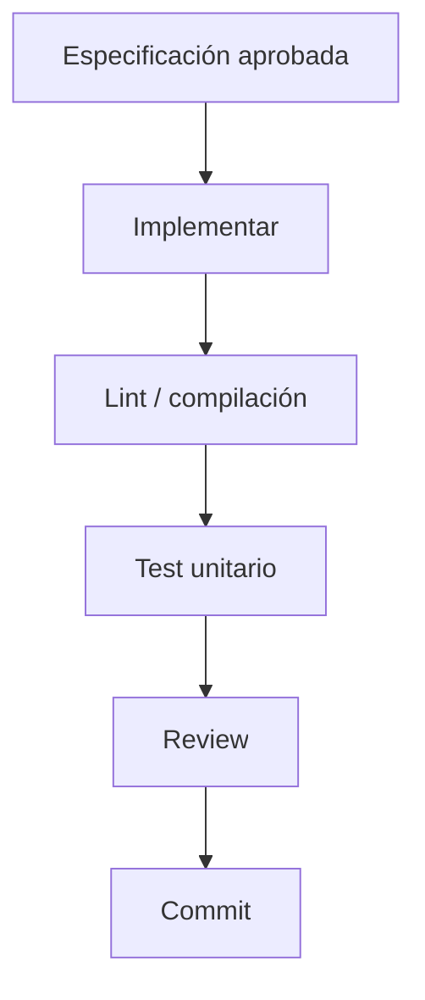

No deben acumularse varios módulos sin probar.

---

# 17. Fase 14 — Validación del CPU con programas diagnósticos

## Objetivo

Validar el procesador completo antes de incorporar UART.

Crear programas assembler pequeños y específicos.

## Orden recomendado

### Aritmética

- `addi`;
- `add`;
- `sub`.

### Lógica y shifts

- `and`;
- `or`;
- `xor`;
- `sll`;
- `srl`;
- `sra`.

### Comparaciones

- `slt`;
- `sltu`;
- inmediatas equivalentes.

### Memoria

- `sw` / `lw`;
- `sb` / `lb` / `lbu`;
- `sh` / `lh` / `lhu`;
- almacenar `0x12345678` como `78 56 34 12` en direcciones crecientes y reconstruirlo con `lw`;
- combinar `sb` y `sh` sobre lanes distintos y verificar reconstrucción y extensión signed/unsigned;
- cargar los bytes `B3 85 A5 00` en IMEM y obtener por fetch la instrucción `0x00A585B3`;
- fetch lineal en `0x00000000`, `0x00000004` y `0x00000008`;
- primer y último PC alineados de una imagen confirmada con fetch de cuatro bytes dentro del límite;
- PC desalineado (`PC[1:0] = 01`, `10` o `11`) con cuatro bytes candidatos dentro de IMEM y de la imagen: candidato `instruction-address-misaligned`, sin truncar PC ni admitir una word residual o reconstruida desde dos words;
- PC alineado fuera de imagen/capacidad (`instruction-access-fault`) y PC desalineado también fuera de imagen/capacidad: detectar ambas condiciones, pero seleccionar `instruction-address-misaligned` para ese mismo fetch;
- fetch desalineado del trabajo joven `wrong-path` invalidado por un redirect anterior sin confirmar un fault arquitectónico; no equiparar esta prueba a la legalidad del destino de branch/jump;
- flujo secuencial con `PC + 4`;
- branches y `jal` con desplazamientos byte-addressed positivos y negativos;
- `jalr` con el cálculo normativo de destino;
- `lb`, `lbu` y `sb` con offsets de byte no múltiplos de cuatro;
- accesos alineados de halfword y word;
- clasificación de `lh`/`lhu`/`sh` con `address[0]=1` y `lw`/`sw` con `address[1:0] != 00` como candidatos de fault por desalineación, incluso cuando toda la región candidata esté dentro de capacidad;
- `sb`/`lb`/`lbu` en cada posición de byte por alineación; un byte fuera de rango sigue siendo inválido por rango;
- stores multibyte desalineados sin escrituras de bytes ni metadata, sin truncar bits bajos o dividir entre dos words, y loads desalineados sin ensamblado arquitectónico de dos words;
- contrastar para load y store una dirección alineada fuera de rango (`load-access-fault`/`store-access-fault`), otra desalineada dentro de rango (`load-address-misaligned`/`store-address-misaligned`) y otra que viola ambas condiciones: seleccionar la causa de desalineación dentro de esa operación, independientemente de cuál condición se detecte antes;
- mismo valor numérico en IMEM y DMEM con contenidos diferentes y sin aliasing;
- fetch dentro de capacidad pero fuera de la imagen;
- fetch fuera de la capacidad configurada;
- fetch inválido del camino incorrecto descartado sin fault;
- lectura de bytes DMEM válidos no escritos con resultado cero;
- regiones multibyte válidas con mezcla de bytes escritos y no escritos;
- primer y último acceso válido de 1, 2 y 4 bytes;
- acceso que cruza el límite por uno o más bytes;
- dirección fuera de rango con los mismos bits bajos que una válida;
- suma ensanchada de dirección efectiva y ancho cuyo extremo excede capacidad, sin confundirla con el carry permitido de base más inmediato;
- store inválido sin escrituras parciales;
- load inválido sin writeback;
- equivalencia observable de direccionamiento y lanes little-endian entre un modelo por bytes y memorias internas organizadas por palabras o bancos.

Las pruebas de rango y endianness de operaciones válidas conservarán direcciones naturalmente alineadas; además se verificará por separado la **clasificación** de los casos desalineados de DMEM e Instruction Fetch y de los destinos de control efectivamente usados, acordada en `DEC-ARCH-004`. Ante destino de control desalineado, no se aplicará redirect ni habrá fetch arquitectónico desde él; tras confirmar un fault solo completarán las anteriores y se llegará a `FAULT` conservando causa y PC de la instrucción causante. La implementación RTL se verificará contra las coincidencias aprobadas en `DEC-ARCH-003`; la representación externa y las vías adicionales de recuperación se resolverán en Debug y protocolo.

**Regresión obligatoria de AUD-004 — dos sumas distintas.** Verificar primero `effective_address=(rs1_effective+immediate) mod 2^32` (inmediato con signo extendido a 32 bits) y después el extremo exclusivo `end={1'b0,effective_address}+N` sin signo en 33 bits. Rango válido significa `end<=DMEM_CAPACITY_BYTES`; la alineación se evalúa independientemente. Los casos con carry que terminan dentro de rango deben ejecutar normalmente si cumplen las demás condiciones, sin veto adicional por el carry.

| rs1_effective | immediate | N | DMEM_CAPACITY_BYTES | effective_address | Rango válido | Alineación válida |
|---|---:|---:|---:|---|---|---|
| `0xFFFFFFFF` | +1 | 1 | 2048 | `0x00000000` | Sí | Sí |
| `0xFFFFFFFC` | +4 | 4 | 2048 | `0x00000000` | Sí | Sí |
| `0x00000000` | -1 | 1 | 2048 | `0xFFFFFFFF` | No | Sí |
| `0xFFFFFFFF` | +0 | 1 | 4294967296 | `0xFFFFFFFF` | Sí | Sí |
| `0xFFFFFFFF` | +0 | 2 | 4294967296 | `0xFFFFFFFF` | No | No |
| `0xFFFFFFFE` | +0 | 2 | 4294967296 | `0xFFFFFFFE` | Sí | Sí |
| `0xFFFFFFFC` | +0 | 4 | 4294967296 | `0xFFFFFFFC` | Sí | Sí |
| `0xFFFFFFFD` | +0 | 4 | 4294967296 | `0xFFFFFFFD` | No | No |
| `0x000003E4` | +0 | 4 | 1000 | `0x000003E4` | Sí | Sí |
| `0x000003E5` | +0 | 4 | 1000 | `0x000003E5` | No | No |
| `0x000003E8` | +0 | 1 | 1000 | `0x000003E8` | No | Sí |

`4294967296=2^32` es la capacidad conceptual máxima aprobada, no una obligación de implementar una memoria física de ese tamaño para esta prueba. Verificar aritméticamente ese límite sin truncar la capacidad. Repetir los vectores para loads y stores del ancho correspondiente, con base leída o reenviada. Cuando fallen rango y alineación, conservar la prioridad de desalineación; ningún store causante modifica datos/metadata y ningún load causante escribe `rd`. La dirección que se transporta por `EX/MEM.ex_result[31:0]` sigue siendo el resultado modular, sin carry registrado ni una causa de fault nueva.

Contrastar explícitamente la **etapa de detección** y la asociación con cada operación: en IF, primer/último fetch completo, PC alineado o desalineado dentro de imagen y PC dentro/fuera de imagen o IMEM, incluso dos causas en un mismo fetch; en ID, word completa legal, ilegal y parecida a `halt` o a otra instrucción válida **solo tras fetch válido**, incluyendo bits residuales con `IF/ID.valid=0`; en EX, loads/stores de 1, 2 y 4 bytes con `rs1_effective` reenviado, primer/último acceso válido, región que cruza límite, suma ensanchada de dirección efectiva y ancho cuyo extremo excede capacidad, sin confundirla con el carry permitido de base más inmediato, desalineación y causas simultáneas. Comprobar que la detección de memoria usa la dirección efectiva y el ancho **antes de MEM**, sin permitir accesos físicos inválidos, efectos parciales de stores ni escritura de `rd` por un load inválido. En EX verificar además la alineación del destino tras resolver `beq`/`bne` tomado/no tomado o calcular `jal`/`jalr` enmascarado; la prueba no equipara esta evaluación al fetch posterior. Candidatos jóvenes en IF/ID descartados por redirect de una instrucción anterior no producirán efectos arquitectónicos ni alterarán estado global; compararlos con candidatos de operaciones que permanecen en el flujo válido sin fijar cuándo se confirman. Durante HOLD se podrán observar condiciones combinacionales sin transiciones; en RUN/STEP las transiciones requieren ciclos efectivos, sin prescribir latches ni señales adicionales para candidatos.

Verificar por separado la **confirmación arquitectónica y antigüedad**: con load desalineado válido en EX, word ilegal en ID y fetch fuera de rango en IF del mismo flujo, el evento de la instrucción en EX prevalece por ser la más antigua, sin interpretar la etapa como prioridad universal; con un branch tomado más antiguo en EX y candidatos en ID e IF, esos candidatos se descartan como `wrong-path` sin cambiar el estado global. Incluir un candidato inválido o ya descartado, y un evento anterior que prevalece aunque el candidato joven se detecte primero. Para un fault confirmado, comprobar que la operación causante y las posteriores no escriben registros ni DMEM ni comprometen otros efectos arquitectónicos, que **todas las más antiguas activas completan normalmente**, que PC queda retenido y que no ingresa trabajo nuevo hasta alcanzar `FAULT` después del drenado y con los cuatro latches inválidos. Distinguir de esa antigüedad la prioridad `misalignment > access fault` **dentro de la operación**, según las etapas de resolución ya aprobadas con el arbitraje de los acuerdos 40–47; HOLD no confirma por evaluación combinacional y RUN/STEP solo aplican transiciones en ciclos efectivos.

Repetir la frontera precisa con fault confirmado por codificación inválida en ID, fetch inválido detectado en IF y confirmado en ID, acceso DMEM inválido o destino desalineado en EX, y con anteriores en MEM/WB o burbujas: cada store y writeback previo se compromete exactamente una vez, incluso si el trabajo causante o joven permanece como bits residuales sin validez arquitectónica. Comparar RUN, STEP y HOLD durante el drenado y el estado final `FAULT` con el drenado de `halt` hacia `FINISHED`, con las ecuaciones del acuerdo 47 y los estados AUTO/STEP del acuerdo 44, sin imponer codificación binaria, nombres de puertos ni cantidad fija de ciclos.

Comprobar **desde valores preflanco** la selección por etapa causante en un ciclo efectivo: solo EX o ID pueden confirmar; ID invalida la nueva entrada de ID/EX y descarta IF/ID e IF mientras ID/EX, EX/MEM y MEM/WB anteriores avanzan; EX invalida la nueva entrada de EX/MEM, IF/ID e ID/EX y descarta IF, mientras EX/MEM y MEM/WB anteriores avanzan. En todos los casos PC se retiene bit a bit y los latches que preservan anteriores no se vacían en bloque; las entradas jóvenes pueden contener bits residuales pero quedan con `valid=0`. Un branch tomado, `jal` o `jalr` causante de destino desalineado en EX no redirige; los saltos tampoco escriben enlace ni pasan válidos a EX/MEM. En `FAULT_DRAIN` alcanzable las anteriores en EX/MEM y MEM/WB progresan por ciclos efectivos mediante `act_drain_advance`, con IF/ID e ID/EX inválidos y sin load-use; verificar finalmente `IF/ID.valid=ID/EX.valid=EX/MEM.valid=MEM/WB.valid=0` antes de `FAULT` y conservar pipeline vacío allí. El candidato no confirmado o `wrong-path` no inicia estas acciones y HOLD no actualiza nada.

Verificar cuatro órdenes entre eventos de **instrucciones distintas**: redirect aplicable anterior y fault joven → el candidato queda `wrong-path` sin `FAULT`; fault anterior y redirect joven → sin redirect y `FAULT` tras drenado; `halt` válido anterior y fault joven → candidato descartado, drenado y `FINISHED`; fault anterior y `halt` joven → `halt` descartado, `FAULT` sin `FINISHED`. La candidatura de `halt` se detecta en ID, pero solo se confirma en EX en un ciclo efectivo si sigue válida; no aplicar una prioridad fija por tipo de evento. Para control con fault **propio** por destino desalineado, suprimir redirect y enlace del propio salto, sin alterar la ecuación combinacional nominal de `redirect_valid`.

Conforme al acuerdo 47 de `DEC-ARCH-003`, IF solo detecta candidatos: durante `load-use`, sin frontera EX/ID prevaleciente, solo se aplica `act_load_use`, se retienen PC y los cinco campos de IF/ID y no se confirma ni captura el candidato; al avanzar se redetecta en ese PC y se transporta por IF→IF/ID→ID, donde puede confirmarse con `fault_pc=IF/ID.pc` si no lo descarta una frontera EX anterior. Contrastar la dependencia de un consumidor joven descartado (no bloquea la frontera ni aplica stall) con un load-use nominal sin frontera EX/ID prevaleciente (aplica `act_load_use`). No exigir stalls entre supervivientes durante drenado alcanzable; allí solo quedan anteriores en EX/MEM y MEM/WB. Durante `FAULT_DRAIN`/`HALT_DRAIN` no se confirma ningún candidato del trabajo joven descartado, pero sí avanzan anteriores en RUN o por STEP nuevo por ciclo; HOLD no confirma ni progresa. Preservar selección de causas de una misma operación, con las ocho acciones y la FSM de 14 estados pactadas, sin modificar la prioridad por antigüedad.

Verificar las **ocho acciones** de la tabla de transición vigente del acuerdo 47 a partir de entradas previas al flanco: normal captura IF/ID/EX/MEM y `PC+4`; `load-use` retiene PC y los cinco campos de IF/ID, inserta bubble sin congelar EX/MEM; redirect EX captura destino, invalida IF/ID e ID/EX **incluido `fetch_fault_valid`** y conserva válida a la instrucción de control en EX/MEM; `halt` EX y fault EX invalidan la nueva EX/MEM sin perder la antigua MEM; fault ID invalida solo a causante/jóvenes y preserva la EX anterior. Conforme al acuerdo 47 de `DEC-ARCH-003`, IF solo detecta candidatos: durante `load-use`, sin frontera EX/ID prevaleciente, solo se aplica `act_load_use`, se retienen PC y los cinco campos de IF/ID y no se confirma ni captura el candidato; al avanzar se redetecta en ese PC y se transporta por IF→IF/ID→ID, donde puede confirmarse con `fault_pc=IF/ID.pc` si no lo descarta una frontera EX anterior. En el siguiente ciclo efectivo normal, comprobar que el consumidor sale de IF/ID hacia ID/EX mientras el load progresa a MEM/WB y el candidato se captura en IF/ID, todavía sin confirmación. En el ciclo posterior, resolver primero el consumidor en EX con forwarding y solo después el candidato ID: un redirect/fault propio EX descarta ese candidato; sin frontera EX se confirma en ID y el consumidor avanza. Intercalar HOLD y STEP para descartar avances o commits duplicados. Hacer coincidir cada frontera con writeback previo en WB y store anterior en MEM: ambos surten efecto exactamente una vez en ese mismo ciclo efectivo; las entradas nuevas inválidas no eliminan efectos previos. Contrastar drenado con anteriores en EX/MEM o MEM/WB y terminación directa sin anteriores; toda frontera confirmada EX/ID invalida IF/ID e ID/EX; en ambos, alcanzar `FINISHED`/`FAULT` al quedar los cuatro `valid=0`, sin ciclo extra. Un fetch candidato todavía no confirmado se captura en IF/ID sin activar prematuramente las acciones de fault.

Probar load-use con candidato IF sin frontera EX/ID: durante el stall solo se aplica `act_load_use`, se retienen PC y los cinco campos de IF/ID, ID/EX recibe bubble y el load avanza a EX/MEM. No se confirma ni se captura el candidato, ni cambian causa/PC globales. En el siguiente avance normal el consumidor pasa a ID/EX y el candidato redetectado se captura en IF/ID. En el ciclo posterior un redirect o fault propio del consumidor EX prevalece sobre el candidato ID; solo sin frontera EX este confirma, con `fault_pc=IF/ID.pc`. Intercalar HOLD/STEP y comprobar forwarding, ausencia de pérdida/duplicación y commits únicos. Si el load productor ya causa fault en EX durante el stall potencial, se aplica `act_ex_fault`: se descartan consumidor y candidato joven, sin ejecutar el stall por la dependencia descartada.

Para la **ruta normal de fetch** comprobar que IF/ID captura `valid=1, fetch_fault_valid=0` con instrucción válida, o `valid=0, fetch_fault_valid=1` con PC causante y causa seleccionada (incluida la prioridad entre desalineación y acceso inválido), sin interpretar como ilegal la word residual. En ID, un candidato joven descartado por redirect, fault o `halt` anterior limpia el flag **aunque `valid` ya sea cero**, sin publicar error; uno superviviente confirma el fault con `fault_pc=IF/ID.pc` y no avanza a ID/EX. Diferenciar la entrada `valid=0, fetch_fault_valid=0` (bubble/flush/residuo) que nunca confirma. Conforme al acuerdo 47 de `DEC-ARCH-003`, IF solo detecta candidatos: durante `load-use`, sin frontera EX/ID prevaleciente, solo se aplica `act_load_use`, se retienen PC y los cinco campos de IF/ID y no se confirma ni captura el candidato; al avanzar se redetecta en ese PC y se transporta por IF→IF/ID→ID, donde puede confirmarse con `fault_pc=IF/ID.pc` si no lo descarta una frontera EX anterior. Una ilegal en ID se detecta solo con `IF/ID.valid=1`, y un fault de load/store/target en EX no añade campos a ID/EX, EX/MEM o MEM/WB. Comprobar los cinco campos estables en HOLD, una sola transición por STEP, descarte de flag ante reset/LOAD y persistencia global de `fault_cause`/`fault_pc` tras confirmar, comprobando `fetch_fault_cause[2:0]` solo en 000/001 para candidatos válidos sin imponer exposición UART.

Conforme al acuerdo 47 de `DEC-ARCH-003`, IF solo detecta candidatos: durante `load-use`, sin frontera EX/ID prevaleciente, solo se aplica `act_load_use`, se retienen PC y los cinco campos de IF/ID y no se confirma ni captura el candidato; al avanzar se redetecta en ese PC y se transporta por IF→IF/ID→ID, donde puede confirmarse con `fault_pc=IF/ID.pc` si no lo descarta una frontera EX anterior. Contrastar expresamente `fault_pc` de EX con el PC global de IF retenido y con dirección efectiva/target problemático: solo el primero corresponde a la instrucción causante. Ante causas concurrentes de un mismo acceso, la causa persistente respeta `misalignment > access fault`; entre candidatos de instrucciones distintas persiste la causa/PC de la más antigua prevaleciente. Un candidato `wrong-path`, invalidado o no confirmado no publica metadatos de fault actual. Al confirmar se capturan una sola vez causa y PC, y ambos permanecen estables aunque drenen stores/writebacks anteriores en EX/MEM y MEM/WB, se evalúen candidatos posteriores o haya HOLD. En drenado alcanzable no ocurre load-use. La estabilidad de metadatos bajo `act_drain_load_use` se verifica solo mediante inyección combinacional de entradas/estado artificial, rotulada como no alcanzable desde una sesión legal bajo el acuerdo 47, sin cover end-to-end desde reset. En snapshots **permitidos**, verificar coherencia de estado y metadatos de un mismo ciclo, sin exigir captura arbitraria mientras RUN avanza.

Para la **codificación del trigésimo quinto acuerdo**, comprobar en el ciclo efectivo de confirmación los siete valores `fault_cause[2:0]`: `000` para fetch IF desalineado y, por separado, target desalineado de branch/jal/jalr EX; `001` para acceso fetch fuera de IMEM/imagen; `010` para instrucción ilegal ID; `100`/`101` para load desalineado/fuera de rango y `110`/`111` para store desalineado/fuera de rango. Ante desalineación y rango inválido simultáneos de un mismo acceso, priorizar `000` para fetch/target, `100` para load y `110` para store. Nunca confirmar `011=RESERVED` como causa válida ni fabricar `NONE`: sin candidato `IF/ID.fetch_fault_valid=0` hace irrelevante `IF/ID.fetch_fault_cause[2:0]`, y sin fault global el estado/flag vuelve irrelevante la causa global. Para candidatos válidos de IF, verificar exclusivamente `000` y `001`; cuando uno se confirma normalmente en ID, el código llega al estado global **sin traducción**. Conforme al acuerdo 47 de `DEC-ARCH-003`, IF solo detecta candidatos: durante `load-use`, sin frontera EX/ID prevaleciente, solo se aplica `act_load_use`, se retienen PC y los cinco campos de IF/ID y no se confirma ni captura el candidato; al avanzar se redetecta en ese PC y se transporta por IF→IF/ID→ID, donde puede confirmarse con `fault_pc=IF/ID.pc` si no lo descarta una frontera EX anterior. Comprobar que HOLD, trabajo `wrong-path` o posterior a una frontera anterior no publica ni reemplaza causa; durante `FAULT_DRAIN` y `FAULT` el código confirmado persiste con su `fault_pc`, incluso si los bits de candidato descartado quedan residuales. La representación Debug/UART y la codificación del estado/flag global permanecen independientes de esta tabla.

Verificar la **semántica terminal revisada por el cuadragésimo cuarto acuerdo**: tras reset `global_state=NO_IMAGE`, y tras preparación nueva READY/RUNNING/STEPPING, con metadatos de fault anteriores sin validez aunque conserven bits. La candidatura joven descartada no altera el estado. Conforme al acuerdo 47 de `DEC-ARCH-003`, IF solo detecta candidatos: durante `load-use`, sin frontera EX/ID prevaleciente, solo se aplica `act_load_use`, se retienen PC y los cinco campos de IF/ID y no se confirma ni captura el candidato; al avanzar se redetecta en ese PC y se transporta por IF→IF/ID→ID, donde puede confirmarse con `fault_pc=IF/ID.pc` si no lo descarta una frontera EX anterior. `halt_confirm` procede de EX y `fault_confirm` de EX/ID; `cycle_from_continuous` conserva la selección AUTO/STEP. Con `pipeline_empty_next=1` se llega directamente a FINISHED/FAULT y de otro modo a un estado DRAIN del tipo/origen correcto. FINISHED y FAULT son excluyentes y solo aparecen con los cuatro `valid=0`.

En estados `HALT_DRAIN_AUTO/STEP` o `FAULT_DRAIN_AUTO/STEP` alcanzables desde reset, probar drenado automático desde confirmación continua o por STEP separado por órdenes nuevas. Verificar en todo ese drenado `IF/ID.valid == 0`, `IF/ID.fetch_fault_valid == 0` e `ID/EX.valid == 0`, y por consecuencia `load_use_stall == 0`; solo pueden completar anteriores en EX/MEM y MEM/WB. Cada ciclo efectivo selecciona `act_drain_advance` y cuenta una vez; HOLD no selecciona ninguna acción. La rama `act_drain_load_use` se conserva, pero su cobertura es combinacional con entradas/estado artificial y no un cover end-to-end desde reset. LOAD aceptado en drenado STEP domina el avance y abandona la sesión, mientras un LOAD rechazado en drenado AUTO no la modifica. Sin autorización no hay commits ni avance, y reset/LOAD dominante inhibe los efectos CPU. Los metadatos de fault son válidos solo en FAULT_DRAIN_AUTO/STEP o FAULT; fuera de allí sus bits residuales no significan fault. El flanco que vacía el último latch cambia a FINISHED/FAULT sin ciclo extra; la representación UART está aprobada en protocol.md.

Comprobar que la confirmación vuelve observable la condición de error: si hay anteriores activas, distinguir `FAULT_DRAIN` de ejecución y de `FAULT` hasta que completen y queden los cuatro latches inválidos; si ya no hay trabajo anterior, no imponer un ciclo artificial de drenado antes de `FAULT`. En ambas fases cuando correspondan hay error observable con la **misma causa y PC**, sin `program_finished`/DONE ni confusión con drenado de `halt`/`FINISHED`; aplicar los estados AUTO/STEP del acuerdo 44 sin duración fija del drenado. Aplicar reset global desde `FAULT_DRAIN` y desde `FAULT`: cuando toma efecto funcional invalida la condición y la interpretación de metadatos, pone PC a cero, latches inválidos y `image_valid=0`/`loaded_image_size_bytes=0`, sin FINISHED ni reanudación por RUN/STEP hasta una nueva sesión confirmada. Verificar que no se presenta el fault anterior como actual tras el reset o el nuevo LOAD, sin exigir borrar bits físicos de causa/PC, IMEM ni DMEM y sin decidir comandos UART de recuperación adicionales.

Verificar destinos de control con `beq`/`bne` tomados y no tomados, `jal` y `jalr` tras borrar solo el bit 0: un destino efectivo desalineado de transferencia tomada o incondicional genera candidato `instruction-address-misaligned` en EX y **no aplica redirect** ni provoca fetch arquitectónico desde ese destino; un branch no tomado no produce ese candidato. Con target alineado pero fuera de IMEM o imagen confirmada, permitir el redirect por alineación y detectar `instruction-access-fault` en el fetch posterior de IF, no en la instrucción de control. Contrastar además fetch IF desalineado y fuera de rango/imagen a la vez, y loads y stores EX desalineados y fuera de DMEM: ambas condiciones se detectan en su etapa, pero la causa prevaleciente de la misma operación es la desalineación. Para fetch inválido, ID no puede producir `illegal-instruction` por una word residual. No derivar una prioridad temporal de la detección paralela ni exigir selector, enable, PC alternativo o flush específicos; aplicar los códigos de causa aprobados en el trigésimo quinto acuerdo y exigir ausencia de redirect y de link del salto causante de fault confirmado.

La regresión mínima de `DEC-ARCH-004` deberá cubrir las **dieciséis áreas de la matriz aprobada**: legalidad de las 33 words soportadas frente a reservadas, `0x00000000` y matches parciales de `halt`; alineación de byte/halfword/word y los cuatro patrones de `PC[1:0]`; branch tomado/no tomado, `jal` y `jalr` con bit 0 enmascarado; desalineación y fuera de rango simultáneos; descarte `wrong-path` y prioridad por antigüedad; fault preciso con carga sin writeback, store sin ningún byte enable ni modificación de datos/metadata incluso parcialmente dentro de rango, control sin redirect/link e instrucción ilegal sin RegFile/DMEM/redirect/`halt`; `FAULT` distinto de `FINISHED`; `fault_cause`/`fault_pc` estables durante drenado y final; y reset global que elimina fault y sesión. Ejecutar casos de drenado en RUN, STEP y HOLD según su disciplina de ciclos efectivos, sin fijar ecuaciones RTL ni representación UART.

### Latencia y compromiso de escrituras

- cambiar un PC válido entre flancos y observar la instrucción correspondiente sin aplicar otro clock;
- cambiar una dirección DMEM válida entre flancos y observar el dato correspondiente sin aplicar otro clock;
- capturar la instrucción combinacional en IF/ID dentro del mismo ciclo IF;
- capturar el dato de load en MEM/WB dentro del mismo ciclo MEM;
- seleccionar en MEM el dato de load ya ensamblado y extendido antes de MEM/WB, sin agregar latencia de memoria ni un bypass combinacional DMEM→EX;
- comprobar por revisión y aserciones que no existe `ready`, latencia variable ni stall atribuible a la lectura de memoria;
- verificar que IMEM y DMEM no cambian antes del flanco activo de una escritura habilitada;
- leer después del flanco y observar el valor nuevo;
- ejecutar un store seguido de un load y observar el contenido actualizado;
- repetir el compromiso síncrono con `sb`, `sh` y `sw`, preservando little-endian;
- producir datos combinacionales desde accesos inválidos y verificar que nunca generan writeback ni efectos;
- atender simultáneamente fetch y load o store sin espera propia de memoria;
- comprobar por separado que load-use utiliza el stall nominal aprobado y que los demás hazards conservan los stalls que se aprueben posteriormente;
- ejecutar stores en RUN y STEP y verificar un único compromiso por cada ciclo habilitado correspondiente;
- comparar simulación RTL y netlist para detectar cambios de latencia introducidos por inferencia u optimización.

### Inferencia y fallback físico

- elaborar, simular, sintetizar e implementar `REFERENCE` mediante RTL inferido;
- inspeccionar y registrar por separado el recurso efectivamente inferido para IMEM, DMEM y metadata;
- registrar warnings de inferencia en lugar de asumir el mapping por el estilo RTL;
- comprobar en netlist que no se introdujo una salida registrada;
- medir LUTs, registros, RAM distribuida, BRAM y timing atribuibles a cada memoria;
- elaborar, simular y ejecutar smoke tests de `ALT_1000` sin exigir síntesis ni timing closure;
- si resultados físicos justifican evaluar XPM o primitivas, comparar recursos, timing y regresión sin cambiar consumidores ni contrato observable.

### Organización por words y lanes

- acceder a la primera, una intermedia y la última word válida de IMEM;
- rechazar como fetch arquitectónico un `PC` desalineado incluso si `PC >> 2` apunta a una word cargada; comprobar por separado alineación y región de los cuatro bytes;
- verificar que el loader solo escribe una entrada IMEM después de reconstruir una word completa;
- comprobar ausencia de cambios IMEM antes del flanco de escritura;
- mapear `0x12345678` como `78 56 34 12` en los cuatro lanes y reconstruirlo;
- ejecutar `sb` en cada offset y conservar los otros bytes;
- ejecutar `sh` en offsets 0 y 2 y `sw` en offset 0 de una word con la selección lógica exacta;
- reconstruir `lb`, `lbu`, `lh`, `lhu` y `lw` con extensión correcta;
- comprobar que stores parciales no realizan read-modify-write de la word completa;
- calcular bank y row por byte candidato, incluidos cruces hacia la row siguiente solo como **mapping de candidatos**;
- rechazar por alineación los candidatos multibyte que crucen word, sin efectuar accesos entre rows, dividir, corregir ni truncar la dirección;
- suprimir escrituras de datos y metadata de stores desalineados sin efectos parciales; conservar por separado la comprobación de rango y el descarte `wrong-path`;
- verificar equivalencia aunque Vivado no materialice cuatro RAM físicas.

### Ownership y concurrencia

- permitir ciclos sin agente activo y comprobar mediante assertions que existe como máximo uno por memoria;
- ejercer CPU y loader sobre IMEM en fases excluyentes;
- ejercer CPU y Debug directo sobre DMEM con quiescencia;
- atender fetch y load/store simultáneos sobre memorias lógicamente independientes;
- ejecutar loads o stores consecutivos con fetch continuo;
- tratar una operación multibyte como una única transacción CPU;
- verificar que LOAD, STEP, stalls y flushes no pierden ni duplican escrituras bajo las condiciones conceptuales de enable aprobadas en `DEC-ARCH-008`;
- comprobar una implementación mínima sin exigir puertos adicionales.

### Cero lógico y metadata DMEM

- precargar datos físicos residuales y observar `0x00` para bytes lógicamente inválidos;
- mezclar bytes válidos e inválidos en byte, halfword y word;
- aplicar sign/zero extension después de sustituir bytes inválidos por cero;
- comprobar que `sb`, `sh` y `sw` actualizan dato y validez de exactamente sus bytes;
- conservar dato y validez de bytes no seleccionados;
- ejecutar stores fuera de rango, descartados o del camino incorrecto sin cambios;
- hacer que un programa A escriba DMEM y que un programa B observe cero al iniciar una nueva sesión;
- impedir el commit de sesión y RUN/STEP mientras no se haya establecido el cero lógico;
- comprobar 2048 valid bits en la implementación de referencia;
- verificar que el criterio Debug de memoria utilizada no se deduce automáticamente del bitmap;
- si se adopta otra representación, ejecutar la misma regresión de granularidad por byte, sesiones, loads, stores y Debug;
- dejar cantidad de bits por ciclo, FSM y señales concretas como detalles de implementación, preservando el comportamiento de reset de `DEC-ARCH-008`.

### Capacidades parametrizables

- elaborar, simular, sintetizar, implementar y probar en hardware `REFERENCE=1024/2048`;
- cargar una imagen válida de 256 instrucciones y rechazar una de 257;
- elaborar, simular y ejecutar smoke tests de `ALT_1000=1000/1000` sin asumir potencias de dos;
- comprobar en `ALT_1000` límites, índices, word counts y metadata derivados;
- verificar que comandos de runtime no alteran capacidades sintetizadas;
- comprobar los límites inclusivos del perfil de referencia;
- distinguir una posición de IMEM dentro de capacidad pero fuera de la imagen válida;
- elaborar el caso arquitectónico mínimo de 4 bytes sin convertirlo en perfil formal;
- rechazar tempranamente capacidades inválidas;
- distinguir el rechazo de una configuración válida pero no soportada;
- comprobar cálculos del límite arquitectónico `2^32` sin exigir síntesis FPGA;
- buscar parámetros redundantes y números mágicos mediante revisión estática.

### Punto de entrada y validez de carga

- comprobar que una carga válida deja el PC en `0x00000000` sin iniciar RUN ni STEP;
- comprobar que el primer fetch habilitado utiliza `0x00000000`;
- cargar una imagen mínima de una instrucción desde cero;
- cargar imágenes contiguas de varios tamaños, incluida una que ocupe toda la capacidad;
- rechazar una imagen vacía;
- rechazar imágenes sparse, con huecos o cuyo tamaño no sea múltiplo de cuatro;
- verificar que todos estos rechazos mantienen RUN y STEP deshabilitados;
- completar luego una carga válida y comprobar la recuperación;
- verificar que la carga mínima no transporta un entry point configurable;
- comprobar que aceptar LOAD escribe `loaded_image_size_bytes = 0` y deriva inmediatamente `image_valid = 0`;
- comprobar que una solicitud LOAD rechazada conserva la imagen confirmada vigente;
- mantener el progreso de recepción separado y comprobar que ninguna escritura parcial aumenta el tamaño confirmado;
- verificar que imagen, DMEM y restante estado inicial estén listos antes del único write no nulo;
- verificar que el commit escribe una vez `loaded_image_size_bytes` y deriva combinacionalmente `image_valid = 1`;
- verificar que una carga vacía, truncada, mal formada, interrumpida, sobredimensionada o fallida conserva tamaño cero e `image_valid = 0`;
- cargar un programa B más corto que A y comprobar que el sufijo físico residual no pertenece a la imagen;
- verificar el último comienzo válido y el primer fetch fuera del límite confirmado mediante `PC + 4`;
- comprobar el límite exclusivo `2^32` con aritmética ensanchada y sin wrap-around;
- verificar que capacidades de 4, 1000, 1024 y `2^32` derivan anchos de 3, 10, 11 y 33 bits;
- representar exactamente una imagen de capacidad completa sin truncamiento;
- activar assertions con tamaños 1, 2, 6 y mayores que capacidad, sin producir faults arquitectónicos;
- derivar exactamente instruction count para todos los tamaños legales probados;
- confirmar mediante revisión estática que no existen flip-flop global `image_valid`, instruction count persistente ni bitmap de validez por instrucción;
- comprobar equivalencia RTL/netlist de `image_valid = (loaded_image_size_bytes != 0)`.

### Dominio de clock funcional

- revisar que registros de CPU, pipeline, control, loader, Debug, UART y metadata utilicen el mismo clock funcional principal;
- comprobar en los reportes de clocking que ningún otro clock funcional alcance estado secuencial del RTL de usuario;
- buscar y prohibir sensibilidad `posedge` o `negedge` sobre RUN, STEP, HOLD, ticks UART, divisores lógicos o enables;
- comprobar que reset, RUN, STEP, HOLD, LOAD, mantenimiento y comunicación UART no detengan ni gateen el clock principal mientras el generador entregue un clock válido; la pérdida de estabilidad puede impedir flancos válidos;
- aceptar STEP y comprobar exactamente una transición lógica sin alterar ni generar clock;
- generar ticks UART con distintas relaciones y verificar que solo habilitan transiciones dentro del dominio principal;
- comprobar que un `baud_tick` nunca se distribuye como clock ni crea endpoints temporales de otro dominio;
- comprobar en Basys 3 la conversión del oscilador de 100 MHz al único clock funcional de 50 MHz con distribución dedicada, sin divisores ordinarios usados como clocks;
- comprobar que la integración del recurso no modifica las interfaces funcionales internas;
- si el recurso expone `locked`, arrancar con estabilidad ausente y verificar reset distribuido activo; recuperar estabilidad con reset externo todavía activo, luego liberar ambas causas y comprobar desaserción sincronizada antes de operación normal;
- perder `locked` durante RUN, drenado y LOAD parcial, incluso sin flancos funcionales válidos: comprobar aserción asíncrona del reset distribuido y efectos funcionales solo en el primer flanco válido que lo observe;
- tras esa pérdida, comprobar aborto sin FINISHED/DONE, `loaded_image_size_bytes = 0`, `image_valid = 0` derivado y nueva LOAD válida únicamente después de recuperar estabilidad y liberar reset;
- bloquear una futura incorporación de otro dominio hasta revisar `DEC-ARCH-005` y documentar CDC, constraints y verificación;
- mantener selección/configuración concreta del generador, conexión y secuencia RTL de `locked`/reset, pin y XDC como detalles de integración, y la evidencia post-implementation como tarea de timing closure posterior a la aprobación de `DEC-ARCH-005`.

### Reset global e inicialización de sesión

- partir de un sistema con imagen y estado de sesión no triviales y aplicar el reset global cuando su interfaz definitiva lo permita;
- comprobar, en el flanco que consume el reset interno, `PC = 0x00000000`, `x0 ... x31 = 0` y contador lógico de ciclo igual a cero;
- comprobar `IF/ID.valid = ID/EX.valid = EX/MEM.valid = MEM/WB.valid = 0`, permitiendo residuos en los demás campos inactivos;
- comprobar `loaded_image_size_bytes = 0`, `image_valid = 0`, ausencia de ejecución activa y control en condición segura;
- ensuciar previamente RUN, STEP pendiente, drenado, finalización, fault, LOAD parcial y operaciones en tránsito, y comprobar que no quedan activas ni producen efectos arquitectónicos posteriores al reset funcional;
- no exigir borrado físico de IMEM, datos DMEM o metadata DMEM ni interpretar sus residuos como una sesión válida;
- no fijar todavía el valor, disponibilidad o interpretación del campo Debug de memoria utilizada cuando no existe sesión;
- iniciar después un LOAD y comprobar que el sistema puede preparar una nueva sesión sin aplicar nuevamente el reset global;
- comprobar que DMEM todavía requiere la preparación lógica de sesión aunque PC, banco, contador y pipeline ya presenten sus valores de reset;
- mantener tamaño e imagen válida en cero aunque la imagen completa ya haya sido recibida y validada mientras falte cualquier preparación de sesión;
- comprobar en la frontera de commit que PC, registros, pipeline, cero lógico DMEM, memoria utilizada, contador y estado de ejecución forman un estado inicial coherente;
- verificar que completar el commit deja el sistema preparado pero detenido, sin iniciar RUN ni STEP;
- aplicar solicitudes externas válidas con distintos desfases respecto del clock y comprobar aserción `00 -> 11` sin esperar un flanco y desaserción `11 -> 10 -> 00` por flancos;
- comprobar que el reset distribuido puede asertarse entre flancos, que solo se desaserta por flancos y que sus efectos funcionales ocurren en flancos;
- verificar mediante revisión RTL y CDC que la entrada externa solo alcanza los recursos asíncronos del acondicionador y no alimenta directamente lógica funcional;
- comprobar que CPU, pipeline y control consumen reset mediante lógica síncrona en `posedge clk`, sin generalizar sensibilidad asíncrona a sus registros;
- no exigir respuesta a pulsos que incumplan el ancho mínimo del recurso asíncrono ni tratar el acondicionador como debouncer;
- diferir las pruebas del pin o fuente física, duración mínima concreta y realización física de la relación con `locked` a integración y `DEC-ARCH-005`.

### Recuperación por reset durante RUN

- ejecutar un loop sin `halt`, aplicar reset global y comprobar que RUN se aborta en el primer flanco de consumo funcional;
- repetir durante ejecución normal y drenado continuo, sin esperar FINISHED ni vaciado del pipeline;
- comprobar que la recuperación no activa `program_finished`, DONE ni otra indicación de finalización normal;
- verificar pipeline inválido, PC, registros y contador en cero, tamaño confirmado cero, `image_valid = 0` y control detenido;
- retener writeback, store y transacciones en vuelo y comprobar ausencia de efectos posteriores al flanco dominado por reset;
- comprobar que LOAD sigue rechazándose antes del reset mientras existe contexto continuo y que esa solicitud no queda latente;
- enviar una nueva solicitud LOAD después del reset y completar una sesión nueva antes de autorizar RUN o STEP;
- permitir mecanismos adicionales de protocolo sin convertirlos en requisito para satisfacer `REQ-EXEC-015`.

### Prioridad global y enables

- coincidir reset, LOAD aceptado y solicitud de ciclo CPU, y observar únicamente los efectos de reset;
- asertar reset durante LOAD y comprobar que no progresa una escritura del loader, mantenimiento ni commit de sesión en el flanco dominado;
- coincidir aceptación o progreso de LOAD con una solicitud de CPU y comprobar que loader o mantenimiento pueden progresar mientras se suprimen fetch, avance, writeback, store y contador CPU;
- verificar que una solicitud LOAD rechazada no entra en la prioridad de preparación ni invalida por sí sola la imagen vigente;
- Sin imagen o durante LOAD no hay ejecución CPU. En FINISHED/FAULT con imagen confirmada, RUN/STEP elegibles aceptan preparar una sesión nueva mediante PREPARING_RUN/STEP, sin ejecutar ni reanudar la sesión anterior; al cumplirse `prepare_done` consumen su primer ciclo. En drenado STEP, STEP ejecuta un ciclo y RUN puede convertir a AUTO; en drenado AUTO se conserva la autorización continua.
- ejecutar RUN y comprobar ciclos sucesivos autorizados;
- aceptar un STEP y comprobar exactamente un ciclo efectivo, incluido un STEP durante drenado;
- mantener HOLD durante varios clocks con WB o store pendiente y comprobar PC, latches y contador estables, sin writes repetidos;
- ejecutar un ciclo con stall y comprobar un incremento del contador aunque los enables locales retengan parte del pipeline;
- comprobar que cada writeback, store y actualización de metadata CPU requiere ciclo efectivo y validez local y se compromete como máximo una vez;
- permitir actividad de UART y control externo durante HOLD sin avance de CPU ni incremento del contador;
- verificar por revisión que RUN, STEP y HOLD no detienen, generan ni gatean arbitrariamente el clock principal;
- aplicar mediante el `Pipeline Hazard Control` combinacional los patrones nominales de `DEC-ARCH-003`: avance normal por etapa con mux secuencial y escritura de PC; `load-use` con escritura de PC inhibida, retención de IF/ID sin nueva captura, bubble `valid=0` en ID/EX y progreso posterior; redirect con mux hacia target y escritura de PC habilitada, IF/ID e ID/EX inválidos por `valid=0` y avance de EX/MEM y MEM/WB; aplicar los enables/valores `next` de las ocho acciones fijados en el acuerdo 42 y la integración auditada en el 45, con la matriz del acuerdo 46 revisada por el 47.

### HOLD y actividad independiente

- inicializar PC, banco, cuatro latches, contador, drenado y estado de ejecución con valores no triviales y comprobar que permanecen estables durante múltiples clocks de HOLD;
- retener una instrucción de WB y una de store y comprobar ausencia de writes repetidos; autorizar luego un ciclo legal y observar como máximo un compromiso;
- variar entradas y selecciones combinacionales durante HOLD y comprobar que no generan captura ni efecto arquitectónico;
- recibir y decodificar comandos UART, capturar un snapshot permitido y serializarlo sin alterar CPU ni contador;
- aceptar STEP desde un estado preparado y comprobar un único ciclo seguido nuevamente por ausencia de avance;
- repetir STEP durante drenado y comprobar exactamente un ciclo por orden;
- Sin imagen o durante LOAD no hay ejecución CPU. En FINISHED/FAULT con imagen confirmada, RUN/STEP elegibles aceptan preparar una sesión nueva mediante PREPARING_RUN/STEP, sin ejecutar ni reanudar la sesión anterior; al cumplirse `prepare_done` consumen su primer ciclo. En drenado STEP, STEP ejecuta un ciclo y RUN puede convertir a AUTO; en drenado AUTO se conserva la autorización continua.
- reanudar un estado legalmente habilitable y comprobar continuidad desde los mismos PC, registros y latches;
- comprobar que la espera física no cambia el resultado arquitectónico del programa;
- aplicar DEC-PROTO-002 aprobada: sin PAUSE/RESUME ni captura adicional durante RUN; rechazo LOAD, reset y recuperación según protocol.md.

### Evento final de ciclo lógico

- generar una solicitud de avance simultánea con reset y con LOAD aceptado, y comprobar que no existe ciclo efectivo ni incremento del contador;
- Sin imagen o durante LOAD no hay ejecución CPU. En FINISHED/FAULT con imagen confirmada, RUN/STEP elegibles aceptan preparar una sesión nueva mediante PREPARING_RUN/STEP, sin ejecutar ni reanudar la sesión anterior; al cumplirse `prepare_done` consumen su primer ciclo. En drenado STEP, STEP ejecuta un ciclo y RUN puede convertir a AUTO; en drenado AUTO se conserva la autorización continua.
- ejecutar varios ciclos RUN y comprobar correspondencia uno a uno entre eventos finales, transiciones CPU e incrementos;
- ejecutar un STEP nominal y comprobar exactamente un evento final;
- ejecutar un STEP con stall `load-use` y comprobar que la orden se consume, el contador incrementa una vez, PC e IF/ID se retienen, ID/EX recibe una bubble y el load y las instrucciones más antiguas avanzan; requerir nuevos STEP para los ciclos siguientes;
- comparar stall autorizado con HOLD: ambos podrán retener PC, pero solo el primero contará y permitirá progreso local;
- producir bubbles, flushes e invalidaciones dentro de ciclos efectivos y comprobar que cuentan con los patrones de latches del acuerdo 47;
- verificar drenado automático por ciclos en RUN y un STEP por ciclo durante drenado paso a paso;
- comprobar que ciclos del clock funcional con actividad exclusiva de UART, Debug, loader y mantenimiento no producen eventos CPU ni incrementos;
- verificar que, salvo reset e inicialización efectiva de sesión, el contador solo cambia ante un evento final de ciclo.

### Contador lógico de 64 bits — revisión AUD-005

Verificar `cycle_count[63:0]` unsigned y el incremento módulo `2^64` por `cpu_cycle_fire`. Sembrar valores cercanos al máximo en el banco de prueba, sin simular `2^64` ciclos: `0xFFFFFFFFFFFFFFFE → 0xFFFFFFFFFFFFFFFF → 0 → 1` con cuatro estados consecutivos. Con `cpu_cycle_fire=0`, incluido HOLD y actividad exclusiva de UART/Loader/mantenimiento, conservar el valor incluso en el máximo. Repetir el wrap en un ciclo de stall y uno de drenado; comprobar ausencia de fault, detención, cambio de `global_state` debido al contador, flag de overflow o estado persistente adicional. Los cambios de estado debidos a otros eventos conservan su contrato.

Reset e inicialización efectiva de nueva sesión prevalecen y dejan cero antes del primer ciclo. `PREPARING_RUN/STEP && prepare_done` ejecuta ese primer ciclo y deja uno; `PREPARING_READY && prepare_done` deja cero sin ciclo CPU. Verificar el valor completo en un snapshot permitido sin fijar orden de bytes ni framing UART.

### Generación desde RUN, STEP y drenado

- aceptar RUN desde una sesión preparada y comprobar eventos finales sucesivos sin comandos adicionales;
- reconocer `halt` durante contexto continuo, observar DRAINING y continuar automáticamente hasta FINISHED sin exigir que RUN siga siendo el estado visible;
- reconocer `halt` durante control paso a paso, volver a ausencia de avance y requerir un STEP por cada ciclo de drenado;
- mantener `draining = 1` sin contexto continuo ni STEP y comprobar que no aparece un evento final;
- aceptar un STEP y comprobar una sola solicitud y un solo evento, incluso ante stall, bubble, flush o invalidación;
- verificar que un STEP rechazado o suprimido no reaparece como ciclo latente al desaparecer reset, LOAD u otra condición superior;
- Sin imagen o durante LOAD no hay ejecución CPU. En FINISHED/FAULT con imagen confirmada, RUN/STEP elegibles aceptan preparar una sesión nueva mediante PREPARING_RUN/STEP, sin ejecutar ni reanudar la sesión anterior; al cumplirse `prepare_done` consumen su primer ciclo. En drenado STEP, STEP ejecuta un ciclo y RUN puede convertir a AUTO; en drenado AUTO se conserva la autorización continua.
- confirmar un fault durante contexto continuo, cesar la admisión y los efectos de causante/jóvenes, continuar automáticamente solo los ciclos necesarios para que las instrucciones anteriores activas completen y alcanzar `FAULT` sin reportar FINISHED;
- comprobar mediante revisión que la implementación no depende de estados o señales RTL con nombres `run_active`, `step_pulse` o DRAIN.

### Inicialización multiciclo y commit de sesión

- aceptar LOAD y comprobar en ese flanco `loaded_image_size_bytes = 0`, `image_valid = 0` derivado y ausencia de ciclo CPU;
- rechazar una solicitud LOAD y comprobar que conserva la sesión vigente;
- recibir y escribir una imagen completa mientras DMEM u otro estado aún no está preparado, y comprobar que el tamaño continúa en cero;
- comprobar que loader, UART y mantenimiento progresan durante la fase sin writeback, store, fetch válido ni incremento del contador CPU;
- ejercer la implementación elegida con tareas de preparación superpuestas o secuenciales y comprobar que ninguna publica prematuramente la sesión;
- intentar commit omitiendo por separado imagen válida, PC, banco, pipeline, cero lógico DMEM, memoria utilizada, contador o control inicial, y comprobar que se bloquea;
- completar todas las precondiciones y comprobar un único write no nulo del tamaño, con `image_valid` derivado y sin estado redundante;
- comprobar que el estado posterior al commit permanece detenido hasta un RUN o STEP posterior;
- fallar o interrumpir la carga en distintas fases y comprobar tamaño cero, ausencia de rollback y posibilidad de una carga válida posterior;
- aplicar reset durante recepción, escrituras IMEM y preparación DMEM, y comprobar aborto sin writes de loader o mantenimiento en el flanco dominado;
- confirmar que punteros, contadores o flags internos de progreso nunca se interpretan como sesión confirmada.

### Polaridad y frontera de placa

- simular una fuente física activa en alto y comprobar aserción asíncrona y desaserción sincronizada;
- simular una fuente activa en bajo con una única inversión en wrapper y comprobar comportamiento funcional idéntico;
- verificar que ninguna señal física alcanza directamente CPU, pipeline, control o enables;
- comprobar que el reset interno activo en alto produce los valores funcionales acordados;
- comprobar que la aserción de la cadena y del reset distribuido no espera un flanco y que la desaserción atraviesa las dos etapas;
- revisar que `_n` solo identifique señales activas en bajo y que no existan interpretaciones opuestas de una misma señal;
- cambiar el wrapper de placa en la prueba sin modificar módulos funcionales;
- aplicar pulsos por debajo del requisito asíncrono del dispositivo y documentar que su respuesta no está garantizada;
- aplicar una aserción válida y comprobar que activa inmediatamente la cadena, aunque no ocurra un flanco;
- simular rebotes de aserción y liberación con distintas duraciones, incluyendo prolongación, liberación sincronizada y reaserción asíncrona;
- comprobar que cada reentrada aplica nuevamente el estado global aprobado sin producir un ciclo CPU válido;
- bloquear comandos funcionales hasta que reset se estabilice;
- validar repetidamente el pulsador o fuente real sobre FPGA y registrar cualquier evidencia que justifique añadir un filtro;
- mantener duración mínima concreta, pin concreto y realización física de la relación con `locked` como pruebas de integración pendientes.

### LOAD durante contexto continuo

- solicitar LOAD durante varios ciclos de RUN y comprobar correspondencia uno a uno entre ciclos efectivos, incrementos del contador y evolución normal del CPU;
- coincidir la solicitud rechazada con fetch, store, writeback, branch y stall, verificando que no añade ni suprime efectos arquitectónicos;
- comprobar que `loaded_image_size_bytes` e `image_valid` conservan sus valores y que no comienzan recepción, preparación DMEM ni invalidación del pipeline;
- reconocer `halt` bajo contexto continuo, solicitar LOAD durante el drenado y comprobar rechazo mientras las instrucciones anteriores completan hasta FINISHED;
- solicitar LOAD alrededor de un fault y comprobar que el rechazo no se reporta como FINISHED, aplicando la elegibilidad y prioridades del acuerdo 44 según el estado previo;
- mantener o repetir solicitudes durante RUN y comprobar que ninguna se acepta automáticamente al terminar el contexto continuo;
- emitir posteriormente una nueva solicitud desde una condición que la FSM definitiva permita y comprobar que solo su aceptación efectiva invalida la imagen;
- comprobar LOAD > STEP > RUN entre comandos elegibles desde reposo, con reset dominante, conforme al acuerdo 44; el formato de respuesta UART está aprobado en protocol.md.

### Ownership y concurrencia

- permitir ciclos sin ningún agente activo sobre una memoria;
- comprobar mediante assertions la condición at-most-one, sin exigir XOR exacto;
- atender fetch y load simultáneos sobre memorias independientes;
- atender fetch y store simultáneos;
- ejecutar loads o stores consecutivos con fetch continuo;
- comprobar que la CPU no emite más de una transacción por memoria y ciclo;
- tratar un store alineado que active varios lanes de una misma row como una única transacción DMEM; el mapeo de candidatos hacia otra row no autoriza un store desalineado ni crea una transacción funcional adicional;
- aceptar LOAD únicamente sin fetch válido ni escritura concurrente de CPU;
- solicitar LOAD durante RUN normal y comprobar rechazo sin transferencia de ownership ni modificación de IMEM;
- repetir durante el drenado automático iniciado por RUN y comprobar rechazo hasta finalizar la autorización continua;
- comprobar que un LOAD rechazado no queda latente ni se acepta automáticamente al terminar RUN;
- dejar para protocolo y control la respuesta concreta y el arbitraje de RUN/LOAD coincidentes desde reposo;
- construir un snapshot STEP coherente entre avances;
- leer directamente DMEM solo con CPU quiescente;
- observar un mirror/shadow aislado mientras CPU conserva DMEM viva, si se implementa;
- separar captura o aislamiento del snapshot de su transmisión UART;
- verificar una implementación mínima sin puertos adicionales, prioridad ni arbitraje;
- admitir una implementación con puerto o mirror adicional que conserve la misma semántica;
- si se adopta un backend físico compartido, atender simultáneamente ambas interfaces sin aliasing ni stall;
- usar iguales valores numéricos en IMEM y DMEM sin cruzar espacios;
- rechazar o diferir LOAD/Debug incompatible antes de que alcance la memoria;
- introducir stalls documentados por hazards o control sin perder ni duplicar operaciones, manteniendo ausencia de espera propia de lectura de memoria;
- comprobar mediante assertions que las transiciones de control aprobadas por `DEC-ARCH-008` preservan ownership exclusivo;
- detectar una colisión de ownership como violación interna, sin convertirla en fault de programa ni fijar aquí su secuencia temporal.

### Observabilidad y snapshots

- comprobar un snapshot posterior a STEP y el incremento exacto de su contador;
- comprobar varios ciclos RUN contra el contador de avances efectivos;
- contar ciclos habilitados con stall y durante drenado;
- comprobar que espera de STEP, carga y actividad exclusiva de UART no incrementan el contador;
- verificar que una nueva sesión reinicia el contador en cero;
- diferenciar el PC global de los PCs asociados a instrucciones en tránsito;
- seguir instrucciones activas mediante `valid`, PC e instrucción en los cuatro latches;
- presentar como inactivas entradas con bits residuales cuando `valid = 0`;
- aceptar una misma representación inactiva para burbuja, flush y vacío;
- distinguir conceptualmente RUN/STEP, drenado por `halt`, `FINISHED`, `FAULT_DRAIN` y `FAULT`; en los dos últimos, observar `fault_cause` y `fault_pc` persistentes sin presentar candidatos no confirmados como fault actual;
- verificar que registros, latches, estado, imagen válida y memoria utilizada pertenecen a un único ciclo lógico;
- verificar que, cuando se capture un snapshot permitido durante el error, su estado, causa, PC causante y latches pertenecen al mismo ciclo lógico; comprobar que reset invalida la interpretación de los metadatos anteriores sin exigir bits cero ni snapshot durante RUN;
- comprobar que una transmisión lenta no mezcla estados de ciclos diferentes;
- comprobar que observar Debug no altera el resultado arquitectónico;
- verificar que el contrato funciona sin consultar capacidades al hardware.

### Hazards

- ALU → ALU;
- prioridad EX/MEM sobre MEM/WB con productores consecutivos del mismo `rd`;
- forwarding independiente de `rs1` y `rs2` y rechazo de productores inválidos, sin escritura o con `rd = x0`;
- selección independiente con ambas fuentes desde EX/MEM, fuentes desde etapas distintas y fallback a ID/EX; un load coincidente más reciente y no disponible bloquea un MEM/WB anterior del mismo `rd`;
- dos muxes combinacionales 3:1 independientes hacia EX, con los tres datos aprobados por operando y combinaciones de orígenes distintas, sin seleccionar datos no disponibles ni imponer codificación de selectoras;
- Forwarding Unit combinacional que controla ambos muxes por productor más reciente y fuente usada, sin consumo funcional de selecciones residuales ante consumidor inválido o load aún no disponible;
- captura normal de los diez elementos funcionales enumerados de ID/EX (con control representable de forma distribuida) para fuente realmente usada, valor original y destino independientes; bubble por `load-use` y flush por redirect comparten `valid_next=0` de la nueva entrada, con PC e instrucción vinculados y residuos inertes, sin codificación anticipada de `control`;
- IF/ID conserva sus cinco campos (`valid`, `pc`, `instruction`, `fetch_fault_valid`, `fetch_fault_cause`): captura normal de instrucción o candidato, retención íntegra en HOLD/load-use y limpieza de ambos flags ante descarte; un candidato coincidente con stall se redetecta desde el mismo PC y solo puede confirmarse después en ID;
- resultados R-type, I-type aritmética/shifts, `lui` y enlaces de `jal`/`jalr` disponibles desde EX/MEM; loads solo desde MEM/WB, que reutiliza el valor arquitectónico seleccionado para WB;
- enlace de `jal`/`jalr` calculado en EX por `Link Adder` desde `ID/EX.pc + 4`, seleccionado por `Result MUX` en `EX/MEM.ex_result` y por `WB Value MUX` en `MEM/WB.wb_value`; verificar forwarding elegible, descarte de `rd=x0` o entrada inválida y escritura únicamente en WB, sin campo registrado `link_value`;
- `Result MUX` combinacional de EX con entradas `alu_result`, `immediate` y `link_value`: comprobar resultados ALU R/I, direcciones de loads/stores, inmediato de `lui` y enlace de `jal`/`jalr` en el único `EX/MEM.ex_result`; el load no reenvía la dirección como dato, y bits residuales de instrucciones sin escritura no habilitan WB ni forwarding;
- ocho campos de EX/MEM capturados desde la instrucción previa en ID/EX y los resultados de EX tanto en avance normal como en `load-use` y redirect nominales, sin retención por ese stall ni invalidación por ese redirect: resultado de ALU/LUI/enlace o dirección efectiva en `ex_result`, `rs2_effective` en `store_data`, control de memoria en `mem_op` y validez/identidad del productor, sin aceptar un load como fuente de dato disponible en EX/MEM;
- convergencia en MEM de load ensamblado/extendido y resultado de EX hacia un único valor de MEM/WB, idéntico para WB y forwarding y sin efecto si la entrada no escribe `rd`;
- seis campos de MEM/WB capturados desde EX/MEM anterior y el `wb_value` ya seleccionado en MEM: avance normal, `load-use` y redirect sin retención o flush específicos; propagación de `valid=0` desde EX/MEM sin atribuirla a flush y rechazo de forwarding/escritura ante invalidez, ausencia de escritura o `rd=x0`;
- load-use inmediato aislado con un ciclo nominal de stall, PC e IF/ID retenidos, bubble en ID/EX, progreso y único compromiso del load y de las instrucciones anteriores, y consumo posterior del dato desde MEM/WB sin perder ni duplicar instrucciones;
- retención por inhibición de captura de PC e IF/ID, diferenciada de bubble/flush por `valid=0` en ID/EX o IF/ID; residuos inválidos inertes, avance de latches antiguos y una sola transición efectiva en RUN/STEP frente a ninguna en HOLD;
- Next-PC MUX con entradas secuencial `pc_plus_4` y `redirect_target`: escritura habilitada en avance normal y redirect válido, inhibida en `load-use` aunque cambie la entrada; PC de target coherente con flush y prioridad local sobre stall del camino descartado, con los códigos RTL pactados para `next_pc_sel`/`pc_write_enable`, con la integración de faults del acuerdo 47;
- redirect combinacional en EX: `Target Adder` desde `ID/EX.pc + immediate` para `beq`/`bne`/`jal`, `JALR Adder` desde `rs1_effective + immediate` con bit 0 borrado y `Target MUX` para `redirect_target`; branches comparados por resta ALU de operandos efectivos y `ALU.zero`, `redirect_valid` cualificado por validez, conectado al `Pipeline Hazard Control`, con target al Next-PC MUX sin transición durante HOLD;
- `Pipeline Hazard Control` combinacional con ocho acciones (seis no terminales y dos de drenado), `$onehot0`, prioridad de fronteras EX→ID y después stall/avance normal; el detector load-use y la Forwarding Unit conservan sus funciones, sin confirmación desde IF ni registros adicionales;
- detección `load-use` solo con ID/EX load válido y `rd != x0`, IF/ID válido y coincidencia con `rs1` o `rs2` realmente usados; rechazar por separado productor inválido/no load, consumidor inválido, `x0`, fuente no utilizada y ausencia de coincidencia;
- bloque combinacional de detección en ID con índices y uso de fuentes derivados de IF/ID: misma condición conceptual, sin transición durante HOLD y stall nominal al autorizar RUN/STEP;
- ausencia de stall `load-use` cuando `rd = x0`, el consumidor es inválido o la coincidencia corresponde a un campo fuente que no utiliza;
- ausencia de hazards o forwarding por bits de inmediatos de `jal`, `lui`, instrucciones I y shifts inmediatos, o por campos de `halt`; dependencias reales en ambos operandos de ALU registro-registro y branches;
- store dependiente de `rs1` como base en EX o `rs2` como dato en MEM; dato resuelto en EX y preservado por EX/MEM, sin bypass especial hacia MEM;
- `load → store-address` y `load → store-data` inmediatos con stall nominal y posterior forwarding MEM/WB→EX, sin perder ni duplicar el store;
- load-use sin bypass combinacional directo DMEM→EX, incluido el caso de un MEM/WB anterior al load que escribe el mismo `rd`;
- consumo desde MEM/WB cuando es el productor válido más reciente disponible;
- ALU→store para base y dato, con valores disponibles resueltos en EX y escritura correcta en DMEM;
- dependencias múltiples.

### Control

- branches tomados/no tomados;
- `jal`;
- `jalr`;
- alineación `target[1:0]=00` solo para branches tomados y `jal`/`jalr` válidos; `jalr` comprueba `target[1]` después de forzar `target[0]=0`, sin fault candidato por branch no tomado ni por entrada inválida; destino desalineado no aplica redirect ni genera fetch arquitectónico desde él, sin fijar el control físico de PC, flush o enlace.

### Legalidad de codificación

- reconocer todas las instrucciones de la whitelist con variantes legales de registros e inmediatos, y solo `0x0000000B` como `halt`;
- clasificar como candidato de instrucción inválida `0x00000000`, instrucciones RV32I no soportadas, campos funcionales o bits fijos incorrectos y palabras `custom-0` que coincidan parcialmente con `halt`;
- diferenciar en ID la palabra ilegal dentro de la imagen confirmada del candidato de fetch fuera de imagen detectado en IF y de bits residuales de una entrada inválida o descartada `wrong-path`; confirmar solo para operación válida del camino correcto sin evento anterior prevaleciente, sin adelantar instante físico; la respuesta arquitectónica y ausencia de efectos de la causante ya están aprobadas en `DEC-ARCH-004`.

### Finalización

- ensamblado y reconocimiento de `halt` como `0x0000000B`;
- `0x00000000` no interpretado como `halt`;
- STOP con instrucciones previas todavía activas;
- ausencia de efectos de instrucciones posteriores a STOP;
- `halt` joven descartado por un branch o jump anterior;
- drenado automático del pipeline durante RUN;
- drenado de exactamente un ciclo por cada STEP;
- loop sin `halt` en STEP: un ciclo por comando y ninguna finalización al dejar de enviar comandos;
- loop sin `halt` en RUN: ausencia de finalización normal y recuperación mediante reset global;
- fin de la región cargada y `0x00000000` sin activación de `program_finished`;
- timeout del testbench que finaliza la prueba, pero no el DUT;
- recuperación externa y condiciones de error distinguibles de la finalización normal.

## Gate de salida

No comenzar la integración con UART hasta que el CPU funcione de manera estable en simulación.

---

# 18. Fase 15 — Modelo de referencia

## Objetivo

Crear un modelo funcional secuencial del subconjunto de RISC-V implementado.

Puede escribirse en Python.

No necesita modelar el pipeline.

Debe modelar únicamente el comportamiento arquitectónico:

```text
PC
registros
memoria
ejecución de instrucciones
```

El modelo representará IMEM y DMEM con semántica little-endian, limitará los fetches a la imagen contigua confirmada mediante `image_valid` y `loaded_image_size_bytes`, y mantendrá validez lógica por byte para que DMEM no escrita en la sesión devuelva cero. El formato de entrada del modelo podrá utilizar otro orden de transporte únicamente si existe una conversión explícita antes de poblar la memoria lógica.

El resultado del modelo deberá distinguir conceptualmente:

- finalización normal por `halt`;
- `instruction-address-misaligned` (`000`), distinguiendo fetch desalineado de target de control desalineado;
- `instruction-access-fault` (`001`);
- `illegal-instruction` (`010`);
- `load-address-misaligned` / `load-access-fault` (`100` / `101`);
- `store-address-misaligned` / `store-access-fault` (`110` / `111`).

Conservar el PC causante y suprimir todos los efectos de la instrucción defectuosa. Un target desalineado no redirige ni escribe enlace y usa el PC del salto; un target alineado fuera de imagen permite redirect y el fetch posterior usa su propia dirección como fault_pc. La desalineación prevalece sobre acceso fuera de rango en una misma operación. Se pueden usar categorías simbólicas equivalentes a los siete códigos internos; `011` permanece reservado. No se necesita modelar pipeline, drenado ni formato UART. Comparar causa, PC y ausencia de efectos, además de registros/memoria. La dirección de loads/stores sigue la aclaración AUD-004 (32 bits modulares, región ensanchada).

## Uso

Ejecutar un mismo programa sobre:

```text
modelo de referencia
```

y:

```text
procesador RTL
```

Al finalizar comparar:

- registros;
- memoria;
- PC cuando corresponda.

## Beneficio

Permite detectar errores funcionales complejos sin depender solamente de inspección manual de waveforms.

## Gate de salida

No es estrictamente necesario para comenzar el proyecto, pero es altamente recomendable antes de pruebas complejas y regresiones.

---

# 19. Fase 16 — Diseño del protocolo UART/Debug

**Orden de ejecución:** esta fase de diseño se completa antes de D0, M6 y cualquier implementación RTL o software. La numeración histórica de las fases identifica secciones; no autoriza a diferir el protocolo hasta después de programar el CPU.

## Objetivo

Definir el protocolo antes de implementarlo.

**Estado del diseño — 2026-10-01:** consolidado en [protocol.md](protocol.md) y revisado en [debug_protocol_audit.md](debug_protocol_audit.md). DEC-PROTO-001/002/003 cerradas; checklist de 52 tareas archivada. Resta diseño de bloques y software antes de D0; este cierre no habilita implementación.

## Debe especificarse

- comandos;
- códigos;
- formato de paquetes;
- tamaño de campos;
- orden de bytes del transporte y conversión explícita hacia el little-endian arquitectónico;
- direcciones;
- delimitación de mensajes;
- finalización de carga;
- formato de imagen contigua desde cero, sin huecos y con tamaño múltiplo de cuatro;
- separación entre progreso y el único tamaño confirmado durante y después de la carga;
- `image_valid` derivado del tamaño y único write no nulo al completar el commit de sesión;
- rechazo o falta de efecto de RUN y STEP sin una imagen válida;
- capacidades o identificación del perfil activo solo si se decide reportarlas opcionalmente;
- rechazo de imágenes que exceden la capacidad configurada;
- rechazo de imágenes vacías, sparse, con huecos o de tamaño no múltiplo de cuatro;
- ausencia de un campo obligatorio de entry point configurable;
- reporte de faults de fetch, load y store: RUN final FAULT, STEP realizado DONE con estado de fault en Debug;
- identificación y delimitación inequívoca de cada snapshot;
- contador lógico de ciclo, PC global y estado de ejecución;
- validez y campos de los cuatro latches;
- garantía de que todos los campos transportados pertenecen a una misma captura lógica;
- respuestas;
- errores;
- estado de ejecución.

## Comandos conceptuales

Como mínimo deben existir mecanismos equivalentes a:

```text
LOAD_PROGRAM
RUN
STEP
```

y mensajes de respuesta capaces de transportar:

```text
REGISTERS
PIPELINE_STATE
MEMORY
DONE
ERROR
```

Los nombres y códigos concretos están aprobados en protocol.md; los nombres conceptuales anteriores no agregan operaciones ni resultados.

## Gate de salida

Python y Verilog deben poder implementarse leyendo exactamente el mismo documento, sin inventar comportamientos adicionales.

---

# 20. Fase 17 — UART y Debug Unit aislados

## Objetivo

Verificar la comunicación sin introducir todavía la complejidad del procesador completo.

## Secuencia recomendada

### Test 1 — UART básica


### Test 2 — Recepción de comandos


### Test 3 — Carga de memoria


Verificar que los bytes recibidos se convierten desde el orden de transporte aprobado y quedan almacenados con semántica little-endian. El test deberá demostrar que cambiar el endianness UART no altera la representación arquitectónica esperada si se aplica la conversión correspondiente.

Verificar además que aceptar una carga escribe tamaño confirmado cero y deriva `image_valid = 0`, que una solicitud rechazada conserva la imagen vigente, que el progreso de recepción permanece separado y que la invalidación lógica de DMEM puede avanzar sin exponer una sesión parcial. Una carga truncada, inválida o fallida no publicará imagen ni sesión; una carga válida posterior solo escribirá el tamaño no nulo cuando imagen, metadata DMEM y estado inicial estén preparados, estableciendo por derivación la validez de la nueva sesión.

Para el perfil de referencia, verificar la carga válida de 256 instrucciones y el rechazo de una imagen de 257 instrucciones. Comprobar que loader, testbench, Debug y software aplican límites coherentes con el perfil declarado.

Verificar también el rechazo de una imagen vacía, sparse, con huecos o de tamaño no múltiplo de cuatro, sin habilitar RUN o STEP, y la recuperación mediante una carga válida posterior. El mecanismo mínimo de carga producirá una secuencia contigua desde `0x00000000` y no dependerá de transmitir un entry point configurable. La pertenencia de una word al prefijo de imagen confirmada no garantiza su legalidad de codificación: la whitelist de `DEC-ARCH-004` clasifica por separado las 32 instrucciones RV32I soportadas y `halt = 0x0000000B`; la eventual validación preventiva de palabras por el loader es opcional y el instante físico de confirmación se integra posteriormente, respetando la prioridad por antigüedad y el fault preciso ya aprobados.

Verificar que una carga aceptada no coincida con fetch válido. Una solicitud recibida durante RUN normal o su drenado automático deberá rechazarse sin writes de loader, transferencia de ownership, invalidación de imagen ni perturbación del avance CPU; al terminar el contexto no se aceptará de forma latente.

### Test 4 — Lectura de estado simulado

Conectar patrones conocidos para contador lógico, PC global, estado de ejecución, validez de imagen, banco de registros, cuatro latches y memoria utilizada, y verificar que Debug los envía correctamente.

Incluir entradas de pipeline inválidas con contenido residual y comprobar que nunca se presentan como instrucciones activas. Simular una transmisión más lenta que los cambios de estado de origen o mantener explícitamente detenido el origen, según el mecanismo elegido, y verificar que la respuesta reconstruida corresponde a una única captura lógica.

La prueba deberá separar la captura coherente de la transmisión: una vez aislado el snapshot, no se exigirá que la CPU permanezca detenida durante toda la serialización salvo que el mecanismo elegido lo requiera.

## Gate de salida

UART y Debug deben funcionar independientemente del CPU antes de integrarlos con él.

---

# 21. Fase 18 — Software de PC

**Diseño previo obligatorio:** antes de D0 se resuelven DEC-SYS-009 y DEC-SYS-008, se especifican las capas e interfaces siguientes y se documentan los flujos y errores conforme al protocolo. La implementación de esas capas comienza después de D0 y M6.

## Arquitectura recomendada

Separar claramente:

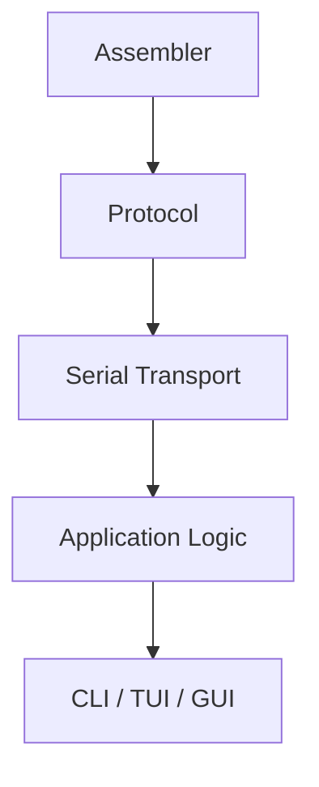

## Componentes

### Assembler

Convierte código fuente en instrucciones máquina. El toolchain deberá producir una imagen little-endian no vacía, contigua y sin huecos desde `0x00000000`, con tamaño múltiplo de cuatro, y aplicar los límites del perfil sin duplicar constantes.

### Serial Transport

Maneja el puerto serie.

### Protocol

Codifica comandos y decodifica respuestas. Debe reconstruir y validar un snapshot completo antes de entregarlo a la lógica de aplicación.

### Application Logic

Coordina carga, ejecución y lectura de estado.

### UI

Presenta las operaciones al usuario, incluidos el contador lógico, PC global, estado de ejecución, validez de imagen, registros, pipeline y memoria utilizada. Un fault de memoria deberá mostrarse como ejecución anormal y no como finalización normal.

## Regla

La interfaz visual no debe contener la lógica del protocolo ni del assembler.

## Estrategia recomendada

El formato de aplicación se selecciona al cerrar DEC-SYS-008; CLI, TUI o GUI deben integrarse con las mismas capas funcionales especificadas. El orden de implementación se fija después de esa elección y del cierre global del diseño.

---

# 22. Fase 19 — Integración end-to-end

## Objetivo

Verificar el sistema completo.

Flujo:

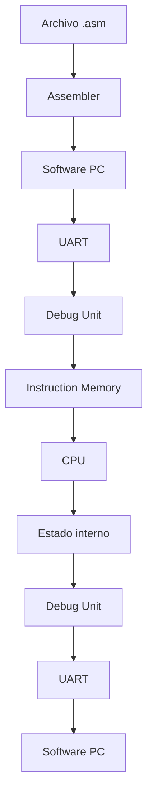

## Pruebas de aceptación mínimas

### Carga

- cargar programa A;
- comprobar que la imagen es contigua, comienza en `0x00000000`, utiliza little-endian arquitectónico y no transporta un entry point configurable;
- ejecutarlo;
- comprobar resultado.

### Reprogramación

- cargar programa B sin resintetizar;
- ejecutarlo;
- comprobar que registros, memoria de datos y metadata de posiciones utilizadas comienzan lógicamente en cero o vacíos;
- comprobar que PC y pipeline presentan el estado inicial definido antes de ejecutar;
- comprobar que no depende incorrectamente del programa A;
- usar un programa B más corto y comprobar que no se ejecutan instrucciones residuales de A;
- comprobar que finalizar la carga no inicia RUN ni STEP;
- comprobar que el PC queda en `0x00000000` hasta recibir RUN o STEP;
- intentar RUN y STEP durante una carga en curso y verificar que no avanza la ejecución;
- comprobar que aceptar LOAD pone el tamaño confirmado en cero y deriva `image_valid = 0` sin confundir el progreso con el tamaño publicado;
- mantener bloqueado el commit de sesión mientras la metadata DMEM no esté completamente invalidada;
- completar la recepción y validación de la imagen mientras todavía falta preparar estado de sesión, y comprobar que el tamaño continúa en cero;
- interrumpir o invalidar una carga y verificar que no queda una imagen ejecutable parcial ni un tamaño confirmado distinto de cero;
- rechazar una imagen vacía, sparse, con huecos o de tamaño no múltiplo de cuatro;
- verificar el único write no nulo del tamaño y el commit coherente de contador y sesión solo después de preparar DMEM;
- completar después una carga válida y comprobar que el sistema vuelve a quedar preparado;
- comprobar que Debug no presenta estado de la sesión anterior como estado actual;
- comprobar que el contador lógico de la nueva sesión comienza en cero;
- comprobar que una dirección de instrucciones no cargada no se interpreta como `halt`.

### Ejecución continua

- RUN;
- ejecución completa;
- recepción de un snapshot final coherente;
- comprobación del contador contra la cantidad de ciclos habilitados.

### Faults de memoria

- provocar fetch fuera de imagen y fuera de capacidad en el flujo válido;
- provocar load y store total o parcialmente fuera de rango;
- comprobar ausencia de writeback o escrituras de la operación causante;
- para `sb`/`sh`/`sw` defectuosos por rango o desalineación, comprobar habilitación nula de **todos** los bytes candidatos de escritura y ausencia de cambios en datos y metadata DMEM, aun cuando solo algunos bytes del acceso caigan fuera de rango; comparar con el mismo store legal, que escribe sus bytes exactamente una vez;
- comprobar que ninguna codificación ilegal reconocida como fault escribe RegFile/DMEM, redirige ni inicia `halt`, y que `jal`/`jalr` causantes de target desalineado tampoco escriben link;
- comprobar ausencia de efectos de instrucciones posteriores;
- descartar un acceso inválido del camino incorrecto sin entrar en fault;
- con I1 válida más antigua en MEM, I2 causante en EX e I3/I4 jóvenes en ID/IF, permitir que I1 complete exactamente una vez, impedir cualquier efecto de I2/I3/I4 y retener PC sin admitir instrucciones nuevas; repetir con anteriores en WB, fetch detectado en IF y confirmado en ID, ilegal en ID, otras ocupaciones/burbujas y candidato detectado pero todavía no confirmado;
- comprobar desde valores preflanco que IF captura candidatos solo con avance normal; ante load-use sin frontera EX/ID, PC/IF/ID se retienen, ID/EX recibe bubble y no hay confirmación. El candidato redetectado pasa después por IF/ID y solo puede confirmar en ID, donde se invalidan IF/ID e ID/EX; una causante EX invalida además EX/MEM. En ambos casos progresan las anteriores;
- comprobar `fault_cause` y `fault_pc` únicos al confirmar cada clase, estables durante el drenado y en `FAULT` aun con anteriores activas; un fetch causante usa su dirección y una instrucción obtenida su PC propio, nunca el target o dirección efectiva por defecto;
- tras completar **todas** las instrucciones anteriores y tener `IF/ID.valid=ID/EX.valid=EX/MEM.valid=MEM/WB.valid=0`, comprobar `FAULT` con pipeline vacío y metadatos aún observables, nunca `FINISHED`/DONE; contrastar con `halt` válido que termina en `FINISHED`;
- verificar drenado automático en RUN, un STEP por ciclo en modo paso a paso y ninguna transición durante HOLD, con PC retenido, latches jóvenes inválidos y progreso de anteriores; sin cantidad fija de ciclos y usando FAULT_DRAIN_AUTO/STEP conforme al acuerdo 44;
- distinguir estado de fault observable desde `FAULT_DRAIN` de drenado por `halt`/`FINISHED`; desde `FAULT_DRAIN` o `FAULT`, reset global invalida metadatos y sesión, deja PC=0 y pipeline vacío, sin reanudación de la sesión previa; una nueva sesión con la imagen todavía válida puede prepararse por RUN/STEP desde FAULT conforme al cuadragésimo cuarto acuerdo; dejar para Debug y protocolo la codificación de transporte externo, la representación de estado y metadatos, el acceso UART y vías adicionales de recuperación; la FSM global sustituye el registro `terminal_kind[1:0]`, mientras `fault_cause[2:0]` conserva su codificación interna; se conserva la prioridad por antigüedad; en drenado alcanzable solo completan anteriores en EX/MEM y MEM/WB mediante `act_drain_advance`, con IF/ID e ID/EX inválidos y sin load-use. La rama `act_drain_load_use` se verifica solo con entradas/estado artificial rotulado como no alcanzable desde una sesión legal bajo el acuerdo 47, sin exigir cover end-to-end desde reset.

### Paso a paso

- enviar STEP;
- verificar avance de exactamente un ciclo;
- observar un snapshot coherente con el contador incrementado exactamente una vez;
- repetir.

### Finalización

- ensamblar y detectar `halt` con la codificación aprobada;
- dejar de incorporar instrucciones;
- descartar instrucciones posteriores sin efectos arquitectónicos;
- drenar el pipeline;
- comprobar drenado automático en RUN y ciclo a ciclo en STEP;
- comprobar que una ejecución sin `halt` no informa finalización normal;
- recuperar una ejecución no terminante durante RUN mediante reset global;
- verificar que la recuperación no emite el indicador de protocolo reservado para la finalización normal;
- informar finalización.

## Gate de salida

Todos los requisitos funcionales del sistema deben estar trazados a una prueba de aceptación ejecutada con éxito.

---

# 23. Fase 20 — Regresión automática

## Objetivo

Evitar que una corrección rompa características que ya funcionaban.

Debe mantenerse un conjunto estable de tests y ejecutarlo de forma frecuente.

Idealmente cada cambio relevante debe ejecutar:

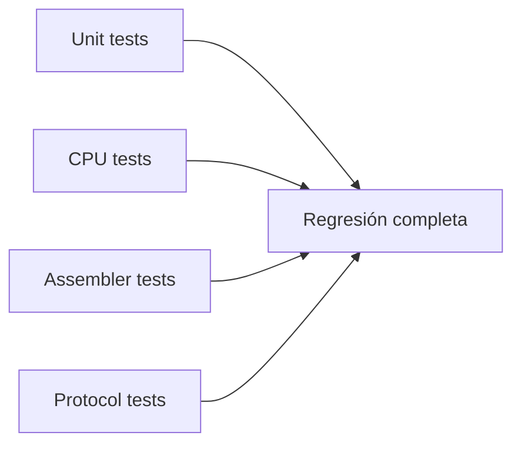

Antes de integrar una rama:

```text
toda la regresión debe pasar
```

Esto es especialmente importante cuando se utilicen agentes de IA para modificar código existente.

---

# 24. Fase 21 — Síntesis y análisis temporal

## Objetivo

Comprobar que el diseño funcional puede implementarse correctamente sobre la FPGA.

Flujo:

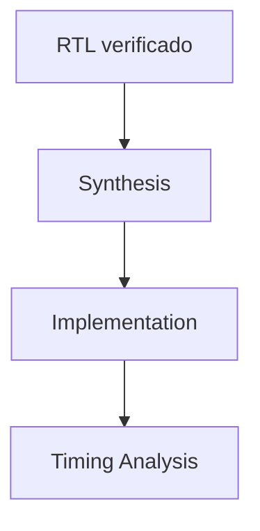

## Analizar

- WNS;
- TNS;
- WHS;
- THS;
- camino crítico;
- fanout problemático;
- clock skew;
- restricciones;
- caminos e interfaces relevantes sin restringir y excepciones temporales justificadas;
- frecuencia máxima razonable.

Para `REFERENCE=1024/2048` en Digilent Basys 3 (Artix-7 `XC7A35T-1CPG236C`), el objetivo inicial será un único clock funcional de 50 MHz / 20 ns generado por recurso dedicado desde el oscilador físico de 100 MHz. Se deberán restringir y verificar tanto el clock primario como el generado, mediante los constraints del recurso elegido o equivalentes sin duplicarlos, y comprobar que las rutas e interfaces relevantes se analizan. El Timing Summary y los reportes de Vivado post-implementation, después de place-and-route, deberán documentar WNS/TNS, WHS/THS, camino crítico, skew, cobertura y excepciones; todavía no se presume cumplimiento.

La puerta de cierre a 50 MHz exigirá `WNS >= 0 ns`, `TNS = 0 ns`, `WHS >= 0 ns` y `THS = 0 ns` para **todos los caminos relevantes restringidos** de la implementación, no solo los del dominio funcional. Comprobar clocks reconocidos, caminos síncronos analizados, interfaces con constraints adecuados y ausencia de caminos críticos relevantes sin restringir. Toda excepción temporal tendrá justificación, documentación y verificación; los slacks favorables con cobertura incompleta no serán evidencia suficiente. No se exigirá margen positivo adicional: uno pequeño podrá anotarse sin invalidar el cierre.

Para `REFERENCE` también deben registrarse la tecnología efectivamente inferida para IMEM, lanes de DMEM y metadata de validez, los warnings relevantes, utilización de recursos e impacto sobre timing. `ALT_1000` requiere elaboración, simulación y smoke tests de parametrización, pero no síntesis, implementación ni timing closure obligatorios.

La organización física de `REFERENCE` deberá verificarse bajo la demanda simultánea de fetch y acceso de datos, preservando lectura combinacional y escritura síncrona. No podrá incorporarse salida registrada, handshake o stall para cerrar timing sin revisar `DEC-ARCH-006`.

El análisis deberá cubrir explícitamente:

- `PC -> detección en IF de rango, imagen y alineación -> IMEM -> IF/ID`;
- `ID/EX + forwarding -> dirección efectiva y detección de rango/alineación en EX -> EX/MEM -> organización DMEM habilitada solo para acceso válido -> filtro de validez -> ensamblado/extensión -> MEM/WB`, sin trasladar la detección de candidatos de DMEM a MEM;
- equivalencia de latencia entre simulación RTL y netlist;
- inferencia y timing de `REFERENCE`;
- frecuencia alcanzable y recursos consumidos por memoria;
- ancho derivado de `loaded_image_size_bytes`, incluido el caso conceptual de 33 bits;
- costo del comparador `loaded_image_size_bytes != 0` y ausencia de un flip-flop global `image_valid`;
- único write no nulo del tamaño durante el commit completo de sesión;
- assertions de rango y múltiplo de cuatro activas en simulación o formal sin convertir su lógica en semántica arquitectónica;
- preservación de ownership y ausencia de escrituras duplicadas según el contrato aprobado en `DEC-ARCH-008`;
- atomicidad entre dato y validez para los bytes seleccionados;
- costo de row/lane selection, ensamblado y extensión;
- cantidad de valid bits y recursos consumidos por metadata;
- costo y timing del mecanismo de invalidación elegido por la implementación;
- efecto del mux `valid ? data : 0` sobre el camino crítico;
- preservación de la máscara lógica de escritura sin read-modify-write;
- cantidad y tipo real de puertos inferidos, sin exigir etiquetas single/simple-dual/true-dual;
- ausencia de dependencia funcional respecto de puertos opcionales;
- simultaneidad IF/MEM en netlist y hardware;
- un único clock funcional alcanzando el estado secuencial de CPU, pipeline, control, memorias, Debug y UART;
- origen de 100 MHz, generación y distribución dedicada del funcional a 50 MHz y análisis temporal de ambos clocks;
- setup y hold sin violaciones en todos los caminos relevantes restringidos, incluidos los de interfaces, con cobertura y excepciones temporales verificadas;
- operación funcional posterior a clock válido si el generador expone `locked`, sin fijar todavía su circuito de integración;
- ausencia de clocks generados desde RUN, STEP, HOLD, divisores lógicos o ticks UART;
- ancho de banda, no aliasing y timing concurrente si se comparte un backend físico;
- evidencia objetiva antes de evaluar XPM o primitivas.

RTL inferido será la implementación inicial. Si no cumple los gates funcionales o físicos, podrán evaluarse XPM o primitivas por memoria siempre que preserven el contrato. Cambiar a lectura síncrona requerirá revisar la decisión y sus dependencias.

La documentación deberá diferenciar explícitamente una configuración inválida de una configuración válida pero no soportada por el target, justificando cualquier límite práctico mediante recursos, herramientas o tecnología elegida.

La frecuencia final debe justificarse a partir de estos resultados. Si hay violaciones de setup o hold, o falta cobertura relevante, no se declarará timing cerrado ni se reducirá el objetivo silenciosamente: cualquier revisión deberá motivarse por el análisis de los caminos y quedar documentada antes de declarar aprobado el cierre temporal. Ni la síntesis exitosa ni la ausencia de errores generales de Vivado sustituyen los reportes post-implementation.

## Regla

Si falla setup, hold o la cobertura de constraints:

1. identificar los caminos afectados, las rutas no analizadas y las excepciones aplicadas;
2. comprender las causas de las violaciones o de la cobertura incompleta;
3. decidir y justificar qué modificar;
4. volver a ejecutar regresión funcional;
5. volver a sintetizar, implementar y analizar timing post-implementation.

No optimizar el diseño a ciegas.

---

# 25. Fase 22 — Validación en FPGA real

## Objetivo

Repetir sobre hardware físico los escenarios ya verificados en simulación.

## Orden

1. UART básica.
2. Carga de programa.
3. Programa aritmético simple.
4. Memoria.
5. Hazards.
6. Branches/jumps.
7. Continuo.
8. Step.
9. Debug completo.
10. Reprogramación.

## Diagnóstico

Si falla en simulación:

> problema lógico o de especificación.

Si funciona en simulación y falla en FPGA:

> investigar clock, constraints, timing, reset, UART, inicialización o integración física.

---

# 26. Fase 23 — Cierre técnico

Antes de considerar terminado el desarrollo:

- eliminar código muerto;
- resolver warnings relevantes;
- eliminar señales temporales de debug;
- revisar resets;
- revisar constantes mágicas;
- uniformar nombres;
- revisar comentarios;
- ejecutar la regresión completa;
- repetir síntesis;
- verificar timing final;
- actualizar diagramas;
- actualizar protocolo;
- actualizar decisiones;
- actualizar README.

La documentación final debe describir **el sistema realmente implementado**, no una versión anterior del diseño.

---

# 27. Uso profesional de agentes de IA

Los agentes deben trabajar sobre tareas pequeñas y completamente especificadas.

## Formato recomendado de tarea

```text
Tarea:
Implementar RegisterBank.

Fuente de verdad:
docs/interfaces.md
docs/isa.md
docs/decisions.md

Requisitos:
REQ-CPU-...
REQ-DBG-...

Tests:
tb/register_bank/...

Restricciones:
- No modificar interfaces externas.
- No modificar otros módulos.
- No introducir decisiones arquitectónicas.
- No cambiar requisitos.
- Si la especificación es insuficiente, reportar la ambigüedad.
- Ejecutar los tests definidos antes de dar la tarea por terminada.
```

## Flujo por cambio generado por IA

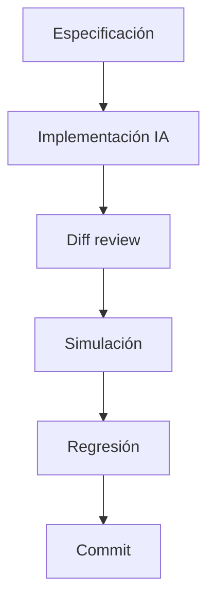

Nunca aceptar código generado únicamente porque compila.

---

# 28. Hitos formales del proyecto

| Hito | Condición |
|---|---|
| **M0 — Requirements Freeze** | requisitos identificados y numerados |
| **M1 — Decision Freeze** | decisiones globales críticas cerradas |
| **M2 — Architecture Freeze** | arquitectura global aprobada |
| **M3 — ISA Freeze** | todas las instrucciones especificadas |
| **M4 — Pipeline Freeze** | datapath, control, latches y flujo definidos |
| **M5 — Hazard Freeze** | forwarding, stalls y flush definidos |
| **D0 — Design Freeze del sistema completo** | CPU, Debug, UART/protocolo, Loader/preparación, software y plataforma diseñados; pendientes resueltos e interfaces físicas concretadas |
| **M6 — Verification Ready** | casos de prueba, resultados esperados y matriz de trazabilidad documentados; programación de tests todavía posterior |
| **M7 — CPU Functional** | CPU pasa regresión sin UART |
| **M8 — Debug Functional** | UART + Debug pasan pruebas aisladas |
| **M9 — Full Integration** | sistema end-to-end funcional |
| **M10 — Timing Closure** | implementación cumple timing |
| **M11 — Hardware Acceptance** | FPGA supera pruebas de aceptación |
| **M12 — Release** | documentación y código finalizados |

---

# 29. Orden resumido recomendado

```text
1. Preparar repositorio
2. Congelar requisitos
3. Resolver decisiones abiertas
4. Diseñar arquitectura global
5. Especificar ISA
6. Diseñar datapath
7. Diseñar control
8. Diseñar latches
9. Diseñar forwarding y hazards
10. Diseñar branches/jumps
11. Diseñar STOP y drenado
12. Definir servicios y parámetros UART
13. Definir memoria utilizada, campos Debug y captura coherente
14. Diseñar protocolo, comandos, respuestas, errores y recuperación
15. Diseñar Debug, Loader y preparación de sesión en detalle
16. Diseñar assembler, validación de imagen, capas de PC e interfaz de usuario
17. Concretar plataforma, clock/reset y restricciones previstas
18. Completar interfaces físicas y composición de tops
19. Diseñar modelo de referencia, pruebas y matriz de trazabilidad
20. Auditar el diseño completo y cerrar D0 y M6
21. Implementar RTL incrementalmente y programar sus tests
22. Implementar modelo de referencia y validar CPU sin UART
23. Implementar y verificar UART, Loader y Debug aislados
24. Implementar software de PC según el diseño cerrado
25. Integrar sistema completo
26. Ejecutar regresiones
27. Sintetizar y analizar timing
28. Validar en FPGA
29. Cerrar documentación y entrega
```

---

# 30. Criterio principal de avance

La regla general del proyecto debe ser:

> **No avanzar por cantidad de código escrito. Avanzar por evidencia de que una fase está correctamente especificada, implementada y verificada.**

El objetivo no es producir RTL rápidamente.

El objetivo es construir un sistema cuya corrección pueda demostrarse de manera progresiva.

Invertir tiempo en requisitos, arquitectura, interfaces y verificación al comienzo reduce significativamente el riesgo de rediseños tardíos, problemas de integración y errores difíciles de localizar al final del proyecto.
