# Protocolo UART entre PC y FPGA

## Propósito y alcance

La PC y la FPGA comparten una única interpretación de los bytes intercambiados por UART. Sobre ese enlace la PC puede cargar una imagen de programa, iniciar o continuar una ejecución, avanzar exactamente un ciclo, aplicar reset global y consultar si el sistema está disponible para una nueva carga. La FPGA responde a esas solicitudes y, en los puntos definidos por la arquitectura, entrega una observación coherente del estado de Debug.

El protocolo fija tres cosas inseparables:

- cómo se representa cada solicitud y cada respuesta;
- cuándo un intercambio comienza y cuándo termina;
- qué ocurre si la recepción queda incompleta, aparece un error UART o se pierde una respuesta.

La semántica interna de la CPU no se redefine aquí. RUN, STEP, preparación, drain, terminales y elegibilidad arquitectónica pertenecen a [Control de ejecución y sesión](architecture/execution_control.md). El contenido persistente que puede observarse y la coherencia de un snapshot pertenecen a [Arquitectura de Debug](architecture/debug_architecture.md). Este documento toma esos contratos y define cómo se representan y secuencian sobre UART.

PC y FPGA forman un sistema diseñado conjuntamente para este trabajo práctico. La PC prepara completamente una imagen antes de solicitar LOAD, transmite exactamente la cantidad declarada y respeta las esperas entre operaciones. Las reglas de recuperación cubren errores básicos de recepción, respuestas truncadas y pérdida de sincronización sin repetir automáticamente operaciones que podrían haber producido efectos.

Los diagramas muestran mensajes entre ambos extremos y, cuando resulta útil, hitos internos que explican la secuencia. Una flecha de respuesta representa todos sus bytes en el orden indicado. Cuando se menciona el **fin físico** de una respuesta se incluye el bit de Stop del último byte. Los hitos internos del protocolo no agregan estados a la FSM global de ejecución.

---

# Configuración compartida

Antes de intercambiar operaciones, ambos extremos parten de la misma configuración de enlace y del mismo perfil de memoria.

## Enlace UART

El enlace utiliza:

```text
19200 baud nominales
8 bits de datos
sin paridad
1 bit de Start
1 bit de Stop
```

es decir, **8N1**.

El receptor utiliza sobremuestreo por 16 y los bloques operan en el dominio funcional común de 50 MHz.

Cada byte ocupa diez bits físicos:

```text
1 Start + 8 datos + 1 Stop
```

A 19200 baud, transmitir un byte requiere aproximadamente:

```text
0,520833 ms
```

Start y Stop delimitan bytes individuales. El final de un mensaje completo se determina por la estructura de la operación y no por un marcador adicional.

RX y TX disponen de FIFO independientes de cuatro bytes. Estas FIFO desacoplan la recepción y la transmisión del procesamiento interno, pero su profundidad no limita ni el tamaño de una imagen ni el tamaño de un snapshot.

La recepción continúa procesando bytes a medida que llegan. Si TX no puede aceptar inmediatamente un nuevo byte, el emisor conserva el byte pendiente sin detener por ello el consumo o descarte de RX.

## Perfil de memoria

PC y FPGA seleccionan previamente el mismo perfil. Las capacidades provienen de la [tabla de perfiles de memoria](architecture/memory_architecture.md#perfiles-definidos).

| Perfil | IMEM | DMEM | Alcance |
|---|---:|---:|---|
| `REFERENCE` | 1024 bytes | 2048 bytes | Perfil por defecto; incluye validación física en FPGA |
| `ALT_1000` | 1000 bytes | 1000 bytes | Elaboración y simulación de parametrización |

El formato de los mensajes no cambia entre perfiles. La capacidad seleccionada afecta:

- el máximo tamaño aceptable de una imagen;
- el máximo número de posiciones de DMEM que puede aparecer en Debug;
- las ventanas de recuperación calculadas a partir del máximo tamaño posible de una respuesta.

El perfil no se negocia por UART. Tampoco existe una operación para consultar capacidades ni se transmite un identificador de perfil. La aplicación de PC utiliza una configuración externa coherente con la FPGA sintetizada.

---

# Representación de los mensajes

## Campos binarios y orden de bytes

Todos los campos se transmiten en binario.

Los campos de más de un byte utilizan **little-endian**:

```text
byte menos significativo primero
```

Una dirección o un dato de 32 bits ocupa cuatro bytes. `cycle_count`, de 64 bits, ocupa ocho.

Los campos que representan tamaños o cantidades utilizan **cinco bytes unsigned**. Esto permite representar no solo cualquier valor de 32 bits sino también:

```text
2^32
```

Cada campo de ocho bits o menos ocupa un byte completo. Los bits significativos conservan el valor definido por la arquitectura y los bits superiores no utilizados se transmiten en cero.

Dos campos pequeños distintos nunca comparten un mismo byte.

Los booleanos se representan como:

```text
00
01
```

Los datos arquitectónicos conservan exactamente su patrón de bits. Cuando un valor representa un dato signed, el protocolo no agrega una codificación especial: transmite el patrón binario registrado.

Los nombres utilizados en este documento —RUN, DONE, FAULT, `global_state`, etc.— existen para describir el contrato. No se transmiten como texto ASCII.

El protocolo no incorpora checksum, CRC ni marcador explícito de fin de mensaje. La longitud y la estructura de cada respuesta permiten reconocer su final.

---

# Solicitudes y respuestas

## Códigos de operación

El primer byte de una solicitud identifica la operación.

| Código | Operación | Solicitud |
|---|---|---|
| `0x01` | LOAD | Código + `N` unsigned de cinco bytes little-endian; seis bytes. El contenido se transmite después de aceptación |
| `0x02` | RUN | Un byte, sin parámetros |
| `0x03` | STEP | Un byte, sin parámetros |
| `0x04` | RESET | Un byte, sin parámetros |
| `0x05` | CHECK_READY | Un byte, sin parámetros |

RUN, STEP, RESET y CHECK_READY quedan completos al recibir correctamente su único byte.

LOAD tiene dos fases diferenciadas. Primero se transmite una cabecera de seis bytes:

```text
01 + N[39:0]
```

y solamente después de recibir la aceptación de esa cabecera se transmiten exactamente `N` bytes de programa.

Esta separación permite que la FPGA valide el tamaño y la elegibilidad de la carga antes de recibir el contenido.

## Cabecera común de respuesta

Toda respuesta comienza con dos bytes:

| Posición | Campo | Significado |
|---:|---|---|
| 0 | Código de operación | Reproduce el código de la solicitud |
| 1 | Resultado | Indica aceptación, finalización, disponibilidad o error |

Los resultados definidos son:

| Código | Resultado | Uso |
|---|---|---|
| `0x01` | ACCEPTED | LOAD, RUN o RESET aceptado |
| `0x02` | DONE | LOAD completado o ciclo STEP realizado |
| `0x03` | READY | CHECK_READY: disponible para LOAD |
| `0x04` | BUSY | No disponible para la operación |
| `0x05` | NO_IMAGE | RUN o STEP sin imagen válida |
| `0x06` | INVALID_SIZE | Tamaño LOAD inválido |
| `0x07` | INCOMPLETE_REQUEST | Tamaño LOAD incompleto |
| `0x08` | INCOMPLETE_DATA | Programa LOAD incompleto |
| `0x09` | UART_ERROR | Error UART durante recepción LOAD |
| `0x0A` | FINISHED | RUN termina normalmente por `halt` |
| `0x0B` | FAULT | RUN termina por fault de CPU |
| `0x0C` | UNKNOWN_COMMAND | Código de operación desconocido |

LOAD, CHECK_READY y RESET producen respuestas de exactamente dos bytes.

Un RUN rechazado o un STEP rechazado también termina al completar esos dos bytes.

RUN aceptado tiene dos respuestas distintas:

```text
RUN / ACCEPTED
...
RUN / FINISHED + Debug
```

o:

```text
RUN / ACCEPTED
...
RUN / FAULT + Debug
```

STEP aceptado no utiliza una aceptación separada. Produce directamente:

```text
STEP / DONE + Debug
```

una vez ejecutado su único ciclo.

El código de operación, el código de resultado y el byte externo de `global_state` pertenecen a tablas distintas. Que dos tablas utilicen el mismo valor numérico no relaciona semánticamente esos códigos.

---

# Consultar disponibilidad

CHECK_READY permite saber si el transporte y el estado actual permiten comenzar una nueva LOAD.

La PC utiliza esta consulta antes de la primera carga, antes de reemplazar una imagen y después de recuperar la comunicación.

La solicitud es:

```text
05
```

Si una nueva LOAD puede comenzar:

```text
05 03
```

Si el sistema no está disponible:

```text
05 04
```

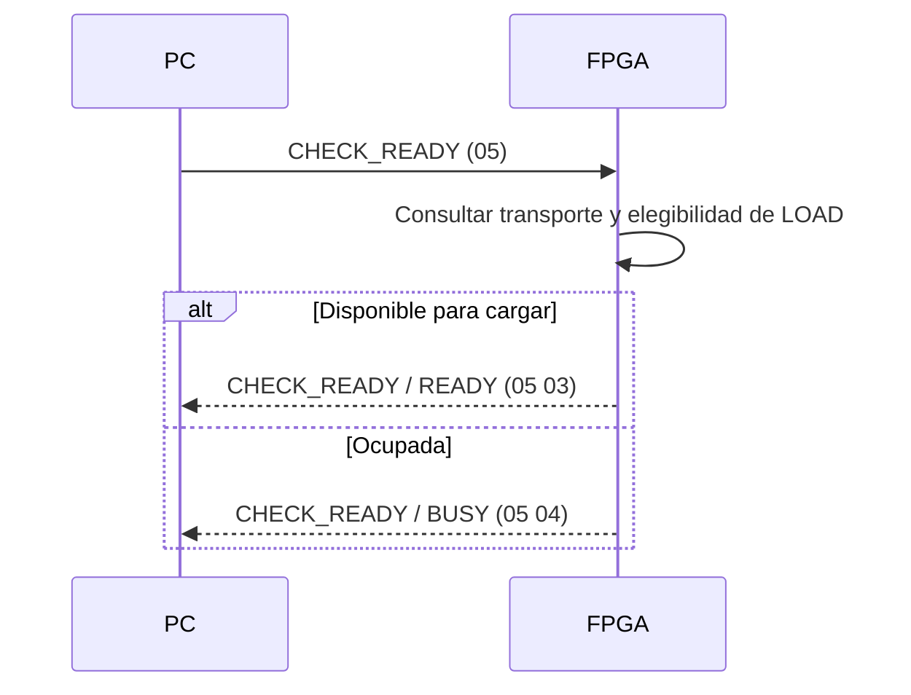
```mermaid
sequenceDiagram
    participant PC as PC
    participant FPGA as FPGA
    PC->>FPGA: CHECK_READY (05)
    FPGA->>FPGA: Consultar transporte y elegibilidad de LOAD
    alt Disponible para cargar
        FPGA-->>PC: CHECK_READY / READY (05 03)
    else Ocupada
        FPGA-->>PC: CHECK_READY / BUSY (05 04)
    end
```

READY significa únicamente **disponible para LOAD**. La respuesta no distingue si la FPGA está en `NO_IMAGE` o si conserva una imagen válida.

CHECK_READY no modifica la CPU, no modifica la imagen y no reserva una carga posterior. La FPGA evalúa cada LOAD con el estado que exista cuando recibe su propia cabecera.

La PC consulta antes de cada LOAD. La FPGA valida esa LOAD de forma independiente, sin almacenar ni exigir una consulta previa.

Durante RUN o drain automático, CHECK_READY responde BUSY siempre que el transporte esté admitiendo comandos.

Durante recuperación RX o exclusión para transmitir Debug, RX se consume y se descarta. En esas fases CHECK_READY no genera respuesta.

---

# Cargar una imagen

LOAD separa validación, aceptación, transferencia de contenido, preparación y confirmación final.

## Imagen y tamaño

LOAD comienza con `01` seguido de `N`, un entero unsigned de cinco bytes little-endian. La cabecera completa ocupa seis bytes.

`N` representa la cantidad total de bytes de la imagen. La imagen:

- comienza en dirección cero de IMEM;
- ocupa un prefijo contiguo;
- contiene al menos una instrucción;
- tiene tamaño múltiplo de cuatro;
- no excede la capacidad IMEM del perfil activo.

La FPGA valida los 40 bits recibidos antes de reducir el tamaño al ancho interno.

Una imagen de 32 bytes utiliza:

```text
01 20 00 00 00 00
```

El valor `2^32` se representa dentro del campo de tamaño como:

```text
00 00 00 00 01
```

y solamente podría aceptarse si una capacidad futura lo permitiera.

El programa contiene instrucciones de cuatro bytes little-endian en direcciones crecientes. El Loader reconstruye cada word completa antes de escribir IMEM; no necesita almacenar toda la imagen en un buffer adicional.

LOAD valida formato y tamaño globales. La legalidad ISA de cada instrucción se comprueba al ejecutarla mediante el decoder de la CPU.

El formato no incorpora entry point configurable ni imágenes con huecos.

## Secuencia normal

La PC prepara todos los bytes antes de iniciar el intercambio. Luego consulta disponibilidad, envía la cabecera, espera ACCEPTED, transmite exactamente `N` bytes y finalmente espera DONE.

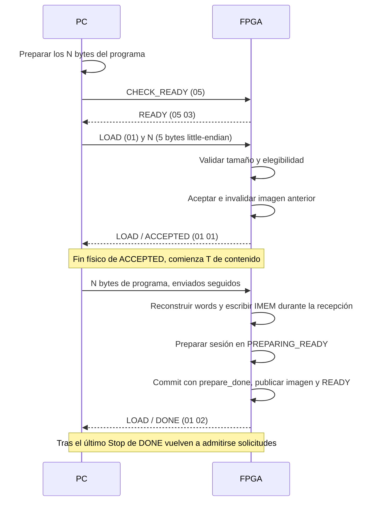
```mermaid
sequenceDiagram
    participant PC as PC
    participant FPGA as FPGA
    PC->>PC: Preparar los N bytes del programa
    PC->>FPGA: CHECK_READY (05)
    FPGA-->>PC: READY (05 03)
    PC->>FPGA: LOAD (01) y N (5 bytes little-endian)
    FPGA->>FPGA: Validar tamaño y elegibilidad
    FPGA->>FPGA: Aceptar e invalidar imagen anterior
    FPGA-->>PC: LOAD / ACCEPTED (01 01)
    Note over PC,FPGA: Fin físico de ACCEPTED, comienza T de contenido
    PC->>FPGA: N bytes de programa, enviados seguidos
    FPGA->>FPGA: Reconstruir words y escribir IMEM durante la recepción
    FPGA->>FPGA: Preparar sesión en PREPARING_READY
    FPGA->>FPGA: Commit con prepare_done, publicar imagen y READY
    FPGA-->>PC: LOAD / DONE (01 02)
    Note over PC,FPGA: Tras el último Stop de DONE vuelven a admitirse solicitudes
```

Mientras transmite, la PC sigue escuchando respuestas. No introduce pausas intencionales ni espera confirmaciones por byte, instrucción o bloque.

La FPGA procesa cada byte antes de que llegue completo el siguiente. Este presupuesto incluye reconstrucción en un registro y escritura de cada word. Esperar espacio en TX no detiene el consumo o descarte de RX.

## Momento de aceptación

Con el transporte disponible, LOAD puede aceptarse en:

```text
NO_IMAGE
READY
STEPPING
HALT_DRAIN_STEP
FAULT_DRAIN_STEP
FINISHED
FAULT
```

No se acepta durante RUN, drain automático, otra carga o preparación.

Aceptar LOAD abandona la sesión anterior e invalida inmediatamente la imagen confirmada previa. El tamaño confirmado queda en cero mientras se recibe la nueva imagen.

Una LOAD aceptada que falla no restaura el programa anterior.

En cambio, una solicitud rechazada, o un tamaño que queda incompleto antes de aceptación, conserva imagen y sesión anteriores. Un rechazo durante RUN tampoco detiene la ejecución.

La FPGA recibe los seis bytes completos de cabecera antes de aceptar o rechazar por tamaño o elegibilidad. Un rechazo completo termina con su respuesta de dos bytes y la PC no envía contenido.

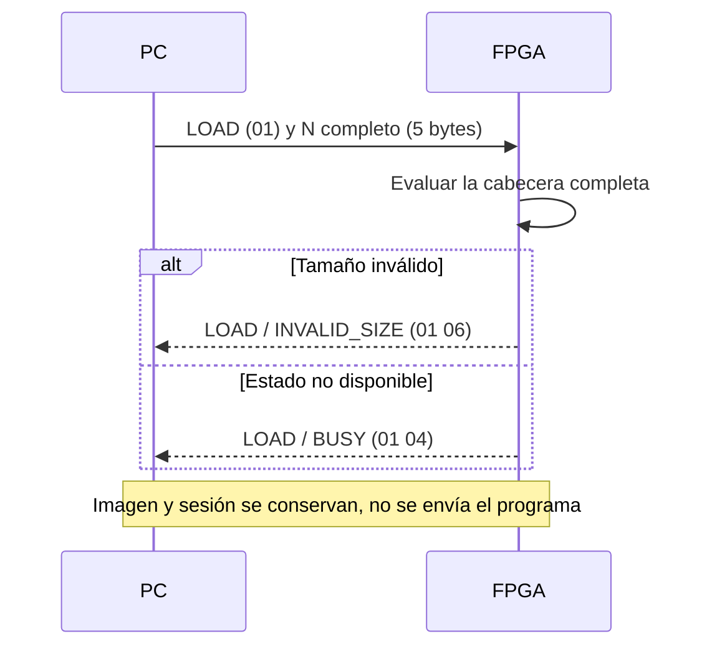
```mermaid
sequenceDiagram
    participant PC as PC
    participant FPGA as FPGA
    PC->>FPGA: LOAD (01) y N completo (5 bytes)
    FPGA->>FPGA: Evaluar la cabecera completa
    alt Tamaño inválido
        FPGA-->>PC: LOAD / INVALID_SIZE (01 06)
    else Estado no disponible
        FPGA-->>PC: LOAD / BUSY (01 04)
    end
    Note over PC,FPGA: Imagen y sesión se conservan, no se envía el programa
```

## Preparación y commit

Recibir todos los bytes no confirma todavía una imagen ejecutable.

Después del contenido, el sistema entra en `PREPARING_READY` y establece el estado inicial:

```text
PC = 0
Register File = 0
latches inválidos
DMEM lógicamente en cero
cycle_count = 0
memoria utilizada = vacía
```

El commit con `prepare_done` publica `N`, vuelve válida la imagen y deja el sistema en `READY`. Ese flanco no ejecuta CPU.

LOAD / DONE se transmite después de completar esta preparación.

Para `REFERENCE` y `ALT_1000`, la preparación posterior a LOAD tiene un presupuesto máximo de:

```text
1 ms = 50.000 clocks @ 50 MHz
```

incluido el commit.

No se espera 1 ms fijo: la confirmación se envía cuando la preparación termina. Un perfil futuro revisa esa cota.

Desde el final del contenido hasta el último Stop de DONE, RX adicional se descarta. La PC espera los dos bytes completos de DONE antes de otra solicitud.

Una carga correcta reabre recepción sin el silencio de recuperación.

Si DONE se pierde, la imagen ya comprometida sigue válida. Un timeout de PC no revierte un commit de FPGA.

## Recepción incompleta

El timeout de inactividad es:

```text
T = 100 ms = 5.000.000 clocks @ 50 MHz
```

Durante el tamaño, `T` comienza después del opcode. Durante el contenido comienza después del fin físico de ACCEPTED, incluido Stop.

Cada byte válido reinicia `T` mientras falten bytes. Si un byte completa tamaño o contenido, termina la supervisión de esa fase.

Por eso `T` limita pausas de recepción y no la duración total de la transferencia.

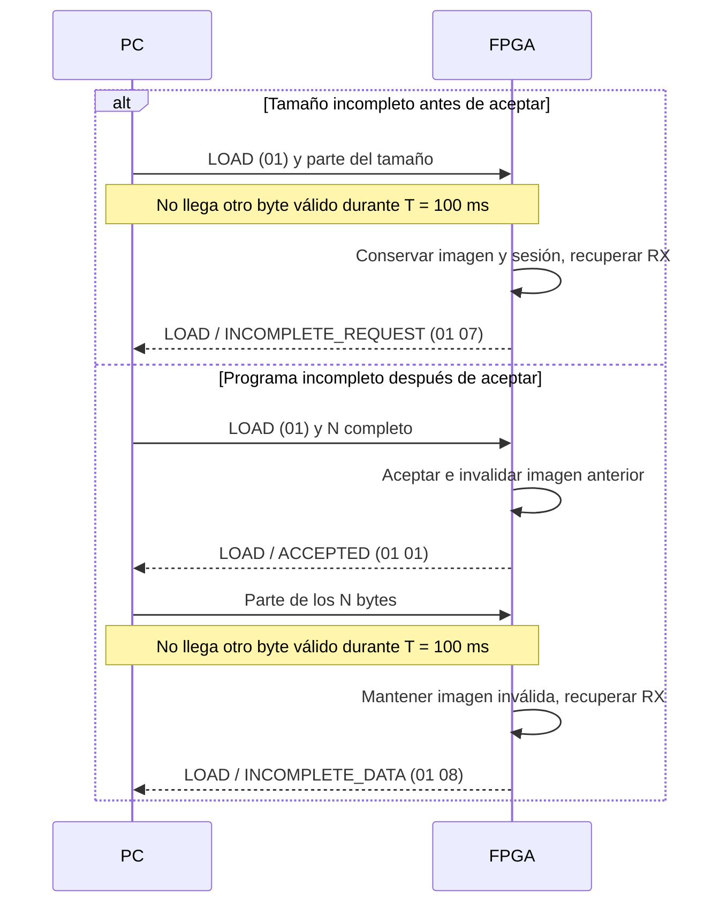
```mermaid
sequenceDiagram
    participant PC as PC
    participant FPGA as FPGA
    alt Tamaño incompleto antes de aceptar
        PC->>FPGA: LOAD (01) y parte del tamaño
        Note over PC,FPGA: No llega otro byte válido durante T = 100 ms
        FPGA->>FPGA: Conservar imagen y sesión, recuperar RX
        FPGA-->>PC: LOAD / INCOMPLETE_REQUEST (01 07)
    else Programa incompleto después de aceptar
        PC->>FPGA: LOAD (01) y N completo
        FPGA->>FPGA: Aceptar e invalidar imagen anterior
        FPGA-->>PC: LOAD / ACCEPTED (01 01)
        PC->>FPGA: Parte de los N bytes
        Note over PC,FPGA: No llega otro byte válido durante T = 100 ms
        FPGA->>FPGA: Mantener imagen inválida, recuperar RX
        FPGA-->>PC: LOAD / INCOMPLETE_DATA (01 08)
    end
```

Si coinciden eventos:

```text
error UART
    >
byte válido
    >
timeout T
```

Un byte válido en el límite completa la fase o reinicia el contador. El timeout se declara solo cuando no hay error ni byte válido.

## Error UART durante LOAD

Un error UART durante tamaño o contenido aborta la recepción y produce:

```text
01 09
```

Externamente no se distingue entre error de trama y desbordamiento.

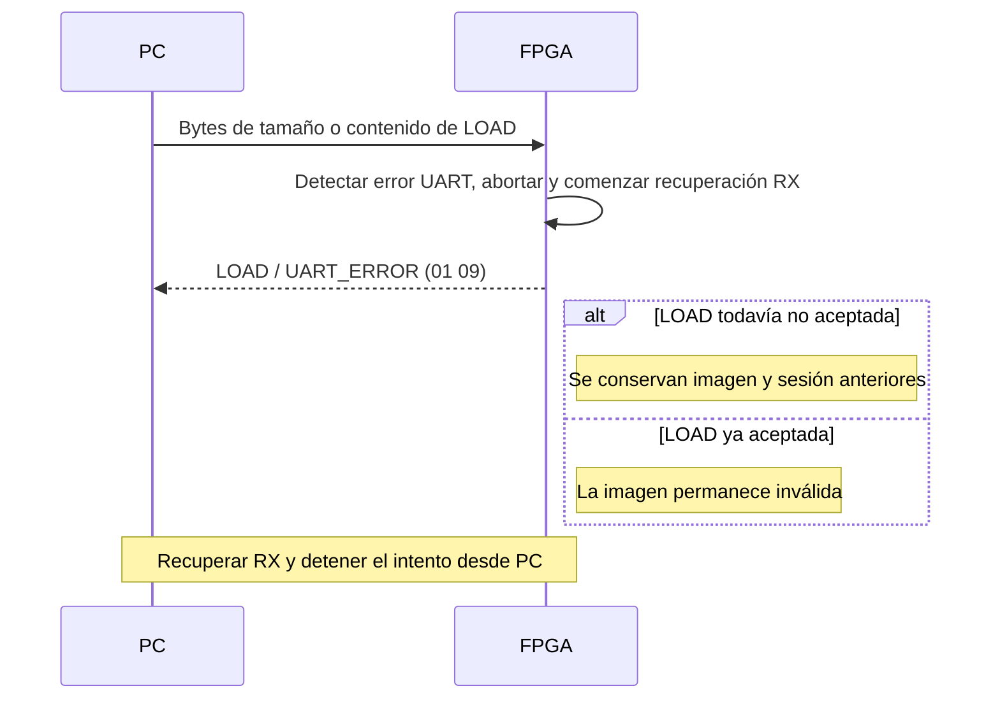
```mermaid
sequenceDiagram
    participant PC as PC
    participant FPGA as FPGA
    PC->>FPGA: Bytes de tamaño o contenido de LOAD
    FPGA->>FPGA: Detectar error UART, abortar y comenzar recuperación RX
    FPGA-->>PC: LOAD / UART_ERROR (01 09)
    alt LOAD todavía no aceptada
        Note right of FPGA: Se conservan imagen y sesión anteriores
    else LOAD ya aceptada
        Note right of FPGA: La imagen permanece inválida
    end
    Note over PC,FPGA: Recuperar RX y detener el intento desde PC
```

La recuperación elimina la recepción parcial y los bytes RX pendientes, pero conserva TX. La secuencia general aparece en [Recuperación de la recepción](#recuperación-de-la-recepción).

## Resumen de LOAD

| Fase / resultado | Respuesta | Efecto |
|---|---|---|
| Aceptación | `01 01` | Invalida imagen anterior e inicia recepción |
| Éxito preparado y comprometido | `01 02` | Imagen válida y READY, sin CPU automático |
| Tamaño inválido | `01 06` | Conserva imagen y sesión; rechazo completo sin silencio de recuperación |
| Estado no disponible | `01 04` | Conserva ejecución e imagen; cabecera completa recibida |
| Tamaño incompleto | `01 07` | Conserva imagen y sesión; recupera RX |
| Contenido incompleto después de aceptar | `01 08` | Imagen inválida; recupera RX |
| Error UART durante tamaño o contenido | `01 09` | Aborta y recupera RX; imagen según si LOAD ya fue aceptada |

---

# Ejecutar con RUN

RUN inicia o continúa ejecución automática y, si parte de un estado terminal, prepara antes una sesión nueva sobre la misma imagen.

## Aceptación y terminal

La solicitud es `02`.

Si existe una imagen válida y la operación es elegible:

```text
02 01
```

confirma que la orden fue tomada, no que preparación o ejecución hayan terminado.

Desde `READY` comienza la ejecución. Desde `STEPPING` continúa la sesión. Desde drain STEP continúa automáticamente. Desde `FINISHED` o `FAULT`, primero prepara una sesión nueva de la misma imagen.

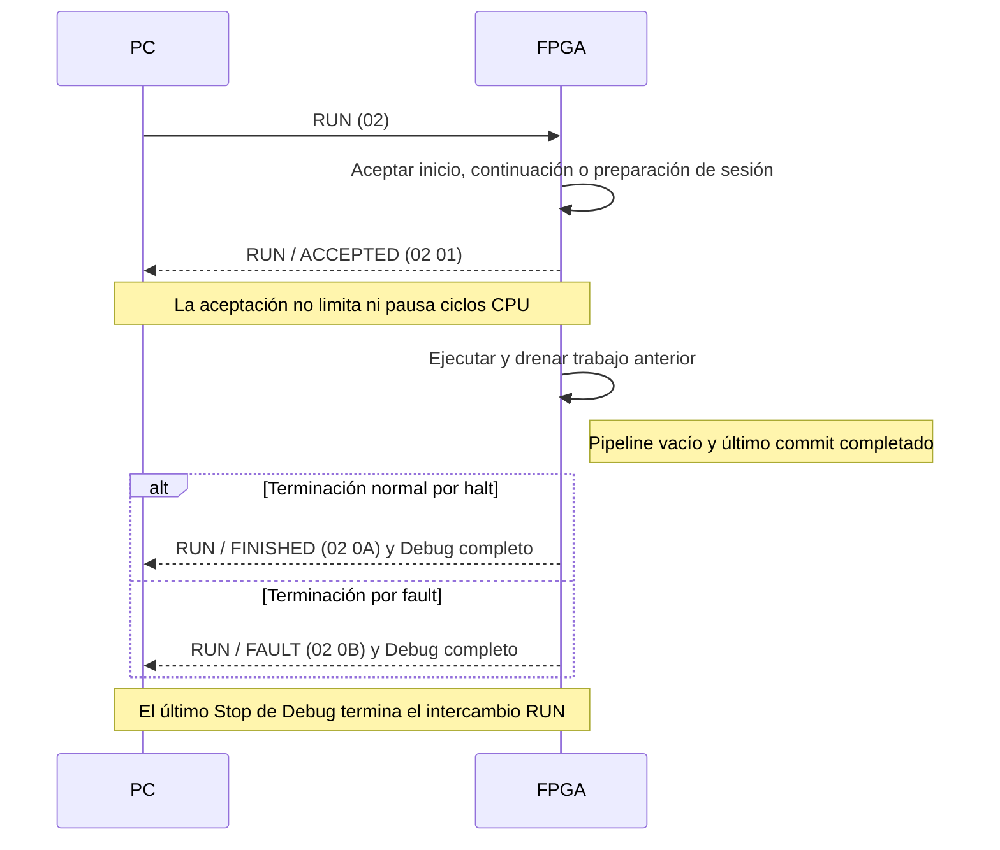
```mermaid
sequenceDiagram
    participant PC as PC
    participant FPGA as FPGA
    PC->>FPGA: RUN (02)
    FPGA->>FPGA: Aceptar inicio, continuación o preparación de sesión
    FPGA-->>PC: RUN / ACCEPTED (02 01)
    Note over PC,FPGA: La aceptación no limita ni pausa ciclos CPU
    FPGA->>FPGA: Ejecutar y drenar trabajo anterior
    Note right of FPGA: Pipeline vacío y último commit completado
    alt Terminación normal por halt
        FPGA-->>PC: RUN / FINISHED (02 0A) y Debug completo
    else Terminación por fault
        FPGA-->>PC: RUN / FAULT (02 0B) y Debug completo
    end
    Note over PC,FPGA: El último Stop de Debug termina el intercambio RUN
```

La respuesta terminal representa el estado posterior al último ciclo que alcanza `FINISHED` o `FAULT`, con pipeline vacío y commits finales incluidos.

Se transmite después de ACCEPTED completo aunque el programa termine antes de que esa aceptación haya salido físicamente por UART.

La PC espera hasta 200 ms por ACCEPTED. Luego espera la terminación sin timeout de duración del programa.

Durante ejecución efectiva puede consultar disponibilidad o solicitar RESET cuando la fase de transporte lo permite.

## Rechazo

Sin imagen válida:

```text
02 05
```

Durante `RUNNING` o drain automático, otro RUN:

```text
02 04
```

sin alterar la ejecución.

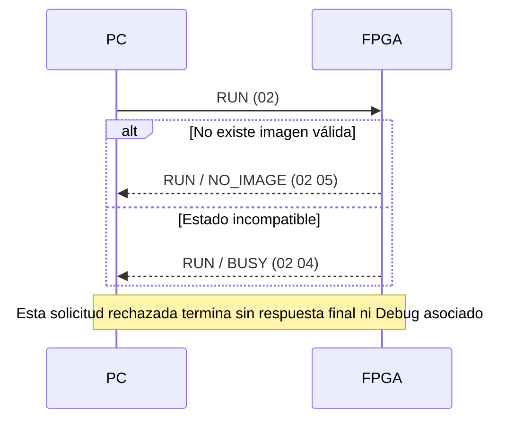
```mermaid
sequenceDiagram
    participant PC as PC
    participant FPGA as FPGA
    PC->>FPGA: RUN (02)
    alt No existe imagen válida
        FPGA-->>PC: RUN / NO_IMAGE (02 05)
    else Estado incompatible
        FPGA-->>PC: RUN / BUSY (02 04)
    end
    Note over PC,FPGA: Esta solicitud rechazada termina sin respuesta final ni Debug asociado
```

Si otra RUN estaba ejecutando, conserva su resultado terminal y su Debug pendientes. Rechazar la nueva solicitud no cancela el intercambio de la ejecución anterior.

---

# Avanzar con STEP

STEP representa un ciclo efectivo, no una instrucción completa.

## Un ciclo y una observación

La solicitud es `03`.

Cada STEP elegible ejecuta exactamente un ciclo CPU y produce una única respuesta:

```text
03 02 + Debug
```

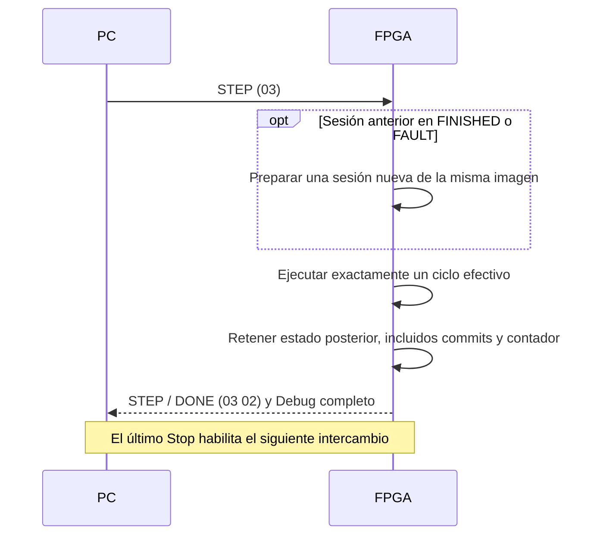
```mermaid
sequenceDiagram
    participant PC as PC
    participant FPGA as FPGA
    PC->>FPGA: STEP (03)
    opt Sesión anterior en FINISHED o FAULT
        FPGA->>FPGA: Preparar una sesión nueva de la misma imagen
    end
    FPGA->>FPGA: Ejecutar exactamente un ciclo efectivo
    FPGA->>FPGA: Retener estado posterior, incluidos commits y contador
    FPGA-->>PC: STEP / DONE (03 02) y Debug completo
    Note over PC,FPGA: El último Stop habilita el siguiente intercambio
```

No existe aceptación separada.

El ciclo puede avanzar normalmente, producir stall, confirmar `halt` o fault, o avanzar drain. Todos consumen un STEP.

Desde un terminal, la preparación ocurre antes del único ciclo.

## Halt, fault y drain por pasos

Todo STEP realizado responde DONE. El estado alcanzado se distingue mediante `global_state`, que puede quedar en:

```text
STEPPING
HALT_DRAIN_STEP
FAULT_DRAIN_STEP
FINISHED
FAULT
```

Si queda trabajo anterior después de una frontera terminal, cada STEP posterior avanza un ciclo adicional de drain.

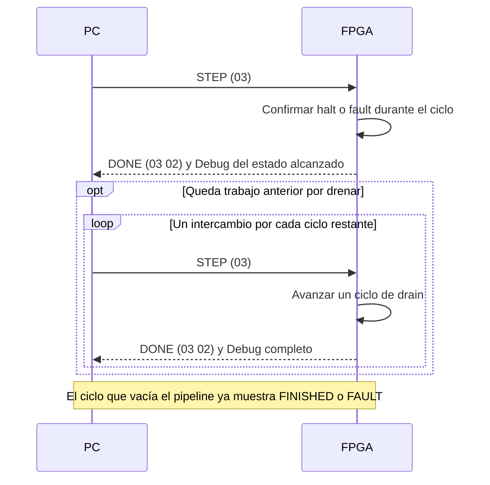
```mermaid
sequenceDiagram
    participant PC as PC
    participant FPGA as FPGA
    PC->>FPGA: STEP (03)
    FPGA->>FPGA: Confirmar halt o fault durante el ciclo
    FPGA-->>PC: DONE (03 02) y Debug del estado alcanzado
    opt Queda trabajo anterior por drenar
        loop Un intercambio por cada ciclo restante
            PC->>FPGA: STEP (03)
            FPGA->>FPGA: Avanzar un ciclo de drain
            FPGA-->>PC: DONE (03 02) y Debug completo
        end
    end
    Note over PC,FPGA: El ciclo que vacía el pipeline ya muestra FINISHED o FAULT
```

No existe un STEP adicional para anunciar la terminación.

En estados de fault, `fault_cause` y `fault_pc` acompañan la observación y se interpretan según la validez del estado global.

## Rechazo

Sin imagen:

```text
03 05
```

En estado incompatible, incluidos `RUNNING` y drains automáticos:

```text
03 04
```

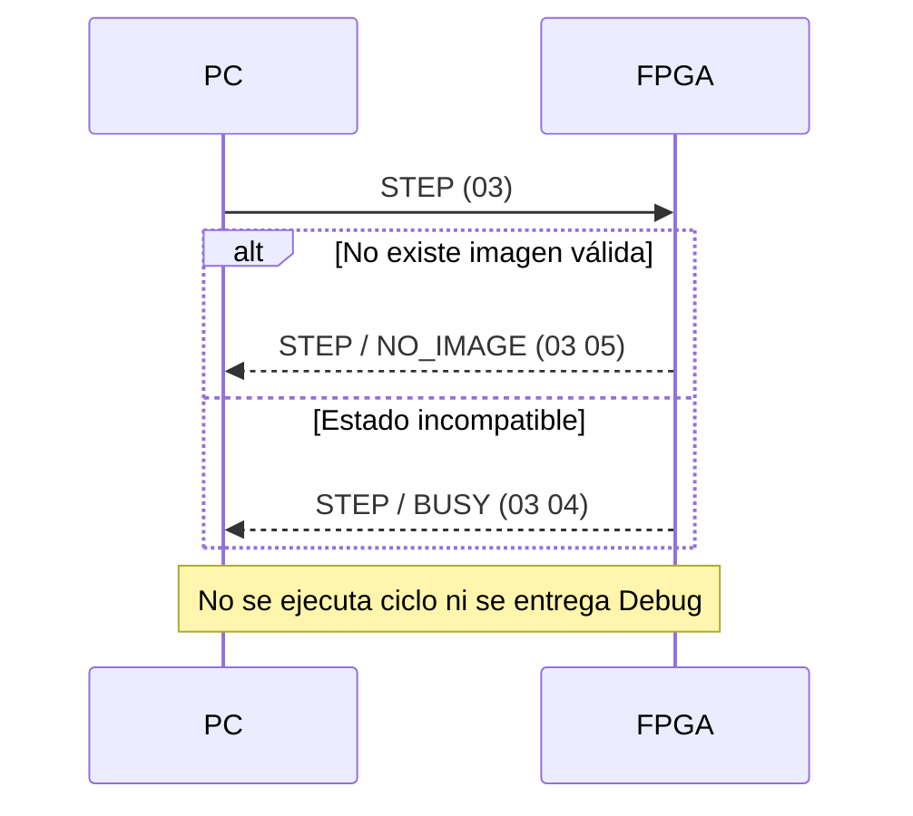
```mermaid
sequenceDiagram
    participant PC as PC
    participant FPGA as FPGA
    PC->>FPGA: STEP (03)
    alt No existe imagen válida
        FPGA-->>PC: STEP / NO_IMAGE (03 05)
    else Estado incompatible
        FPGA-->>PC: STEP / BUSY (03 04)
    end
    Note over PC,FPGA: No se ejecuta ciclo ni se entrega Debug
```

Con imagen válida y transporte disponible, RUN y STEP son elegibles en `READY`, `STEPPING`, drains STEP, `FINISHED` y `FAULT`.

---

# Aplicar reset global

RESET UART y botón físico conducen al mismo reset global, pero no atraviesan el transporte de la misma manera.

## RESET desde PC

La solicitud es `04` y responde:

```text
04 01
```

La FPGA termina físicamente esos dos bytes antes de generar el reset global. Encolar ACCEPTED en TX no alcanza.

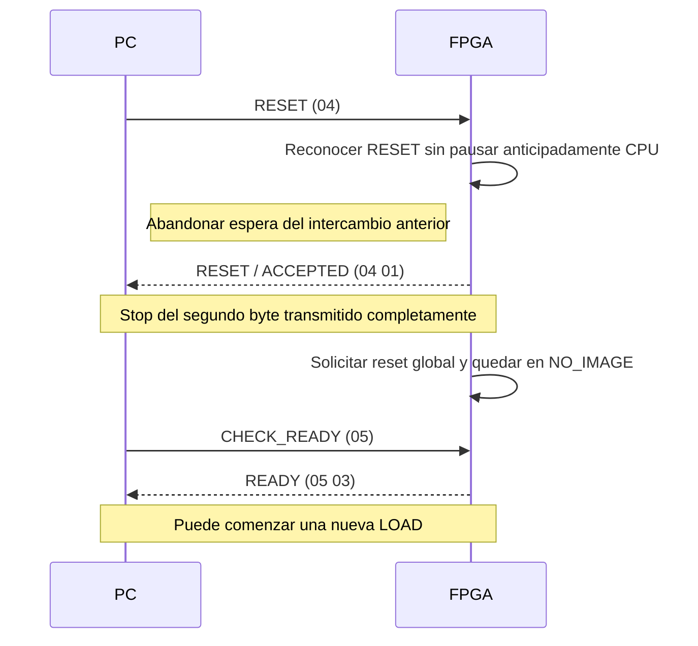
```mermaid
sequenceDiagram
    participant PC as PC
    participant FPGA as FPGA
    PC->>FPGA: RESET (04)
    FPGA->>FPGA: Reconocer RESET sin pausar anticipadamente CPU
    Note right of PC: Abandonar espera del intercambio anterior
    FPGA-->>PC: RESET / ACCEPTED (04 01)
    Note over PC,FPGA: Stop del segundo byte transmitido completamente
    FPGA->>FPGA: Solicitar reset global y quedar en NO_IMAGE
    PC->>FPGA: CHECK_READY (05)
    FPGA-->>PC: READY (05 03)
    Note over PC,FPGA: Puede comenzar una nueva LOAD
```

Reconocer RESET no pausa anticipadamente la CPU ni agrega un estado global de espera UART.

Si había un RUN pendiente, la PC abandona esa espera.

El reset deja `NO_IMAGE`, sin imagen ejecutable, y no exige borrar físicamente todos los arrays.

Durante una respuesta Debug, RESET UART se solicita después de recibir el mensaje completo. Un byte RESET enviado durante la exclusión se descarta como cualquier RX adicional.

## Botón físico

El botón es otra fuente del mismo reset global. Puede interrumpir una transmisión y no genera aceptación UART ni notificación espontánea.

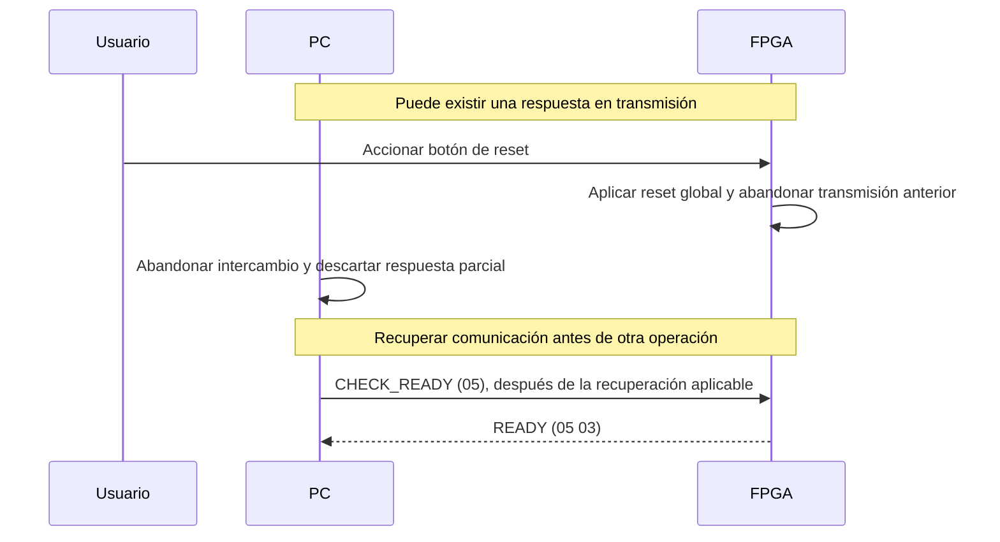
```mermaid
sequenceDiagram
    participant Usuario as Usuario
    participant PC as PC
    participant FPGA as FPGA
    Note over PC,FPGA: Puede existir una respuesta en transmisión
    Usuario->>FPGA: Accionar botón de reset
    FPGA->>FPGA: Aplicar reset global y abandonar transmisión anterior
    PC->>PC: Abandonar intercambio y descartar respuesta parcial
    Note over PC,FPGA: Recuperar comunicación antes de otra operación
    PC->>FPGA: CHECK_READY (05), después de la recuperación aplicable
    FPGA-->>PC: READY (05 03)
```

La última observación completa puede conservarse como anterior. Un fragmento truncado nunca se mezcla con datos de una sesión nueva.

---

# Orden de los intercambios

La elegibilidad arquitectónica y la fase del transporte se evalúan conjuntamente.

## Una operación en curso

La PC mantiene una operación normal en curso por vez.

LOAD comprende cabecera, aceptación, contenido y respuesta final. STEP termina con DONE + Debug. CHECK_READY termina con dos bytes. RESET comprende aceptación y flujo posterior de consulta.

RUN es la excepción: después de ACCEPTED, la CPU puede seguir ejecutando mientras el resultado terminal queda pendiente.

Durante `RUNNING` o drain automático, fuera de exclusiones de transporte, la PC puede solicitar CHECK_READY o RESET y espera esa respuesta antes de otra solicitud.

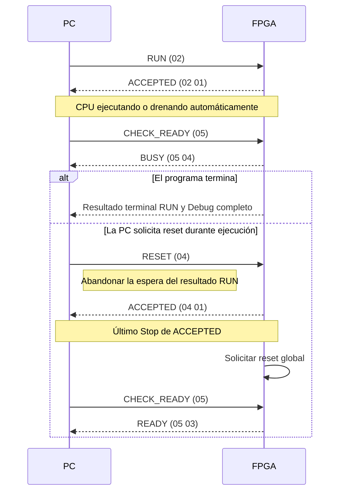
```mermaid
sequenceDiagram
    participant PC as PC
    participant FPGA as FPGA
    PC->>FPGA: RUN (02)
    FPGA-->>PC: ACCEPTED (02 01)
    Note over PC,FPGA: CPU ejecutando o drenando automáticamente
    PC->>FPGA: CHECK_READY (05)
    FPGA-->>PC: BUSY (05 04)
    alt El programa termina
        FPGA-->>PC: Resultado terminal RUN y Debug completo
    else La PC solicita reset durante ejecución
        PC->>FPGA: RESET (04)
        Note right of PC: Abandonar la espera del resultado RUN
        FPGA-->>PC: ACCEPTED (04 01)
        Note over PC,FPGA: Último Stop de ACCEPTED
        FPGA->>FPGA: Solicitar reset global
        PC->>FPGA: CHECK_READY (05)
        FPGA-->>PC: READY (05 03)
    end
```

LOAD, RUN y STEP enviados durante ejecución continua o drain automático responden BUSY sin cancelar ciclos CPU. Para LOAD, primero se reciben sus seis bytes de cabecera.

## Respuestas coincidentes

Cada respuesta termina completamente antes de comenzar otra. No se intercalan respuestas, incluidos sus cuerpos Debug.

Si RUN alcanza terminal mientras ya sale una respuesta breve, esa respuesta termina primero. El estado terminal queda retenido y luego se transmite RUN terminal + Debug.

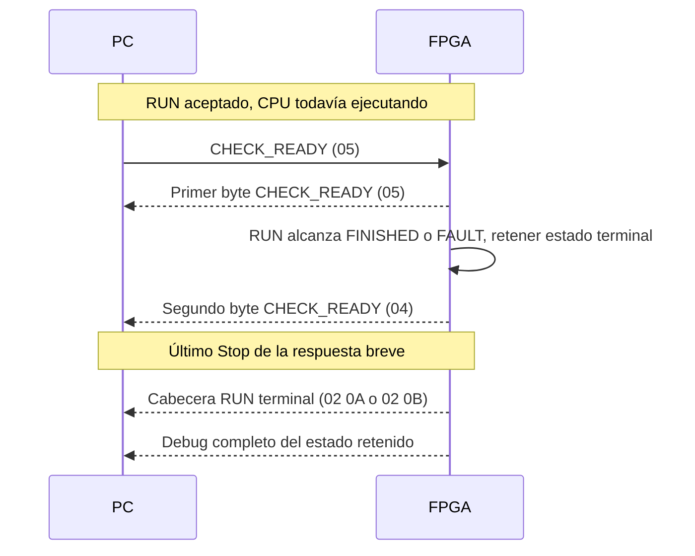
```mermaid
sequenceDiagram
    participant PC as PC
    participant FPGA as FPGA
    Note over PC,FPGA: RUN aceptado, CPU todavía ejecutando
    PC->>FPGA: CHECK_READY (05)
    FPGA-->>PC: Primer byte CHECK_READY (05)
    FPGA->>FPGA: RUN alcanza FINISHED o FAULT, retener estado terminal
    FPGA-->>PC: Segundo byte CHECK_READY (04)
    Note over PC,FPGA: Último Stop de la respuesta breve
    FPGA-->>PC: Cabecera RUN terminal (02 0A o 02 0B)
    FPGA-->>PC: Debug completo del estado retenido
```

La misma regla mantiene ACCEPTED antes de un resultado RUN muy rápido.

El arbitraje físico de TX y los registros privados necesarios pertenecen al diseño de bloques.

## Estado CPU y fase de transporte

Estar en un estado CPU elegible no basta si el transporte todavía está ocupado.

| Fase | Política de solicitudes |
|---|---|
| Transporte disponible, `NO_IMAGE` | CHECK_READY→READY; LOAD validado; RUN/STEP→NO_IMAGE; RESET reconocido |
| Transporte disponible, `READY` / `STEPPING` / drains STEP / `FINISHED` / `FAULT` | LOAD/RUN/STEP según arquitectura; CHECK_READY→READY; RESET reconocido |
| `RUNNING` / drains AUTO, fuera de respuestas/exclusión | CHECK_READY→BUSY; RESET reconocido; LOAD/RUN/STEP→BUSY sin detener CPU |
| Tamaño o contenido LOAD | Los bytes pertenecen a LOAD y no se interpretan como comandos |
| Preparación LOAD y confirmación final | PC espera; RX adicional descartado hasta último Stop de DONE |
| Preparación RUN/STEP y respuesta pendiente | PC espera el intercambio antes de otra operación normal |
| Respuesta breve en TX | PC espera completa; otra respuesta no se intercala |
| Debug pendiente o en transmisión | PC espera; FPGA consume y descarta RX sin responder ni guardar comandos |
| Recuperación por silencio | FPGA consume y descarta RX, incluidas consultas y RESET UART |

No existe una cola de comandos para bytes recibidos durante períodos de descarte. El botón físico conserva reset directo en todas las fases.

---

# Enviar una observación coherente

Debug aparece automáticamente después de cada STEP realizado y al finalizar RUN.

No existe `READ_STATE` ni captura adicional durante RUN continuo, LOAD, preparación, reset o `NO_IMAGE`.

## Instante observado

El snapshot de STEP corresponde al estado posterior al ciclo. El de RUN corresponde al estado posterior al último ciclo que alcanza terminal tras el drain.

Incluye commits RF/DMEM y `cycle_count` posteriores a ese flanco.

Desde ese instante hasta el fin físico de la respuesta:

- la CPU no ejecuta nuevos ciclos;
- no comienza LOAD;
- no comienza preparación de otra sesión.

UART, lectura de Debug y serialización continúan con el clock funcional.

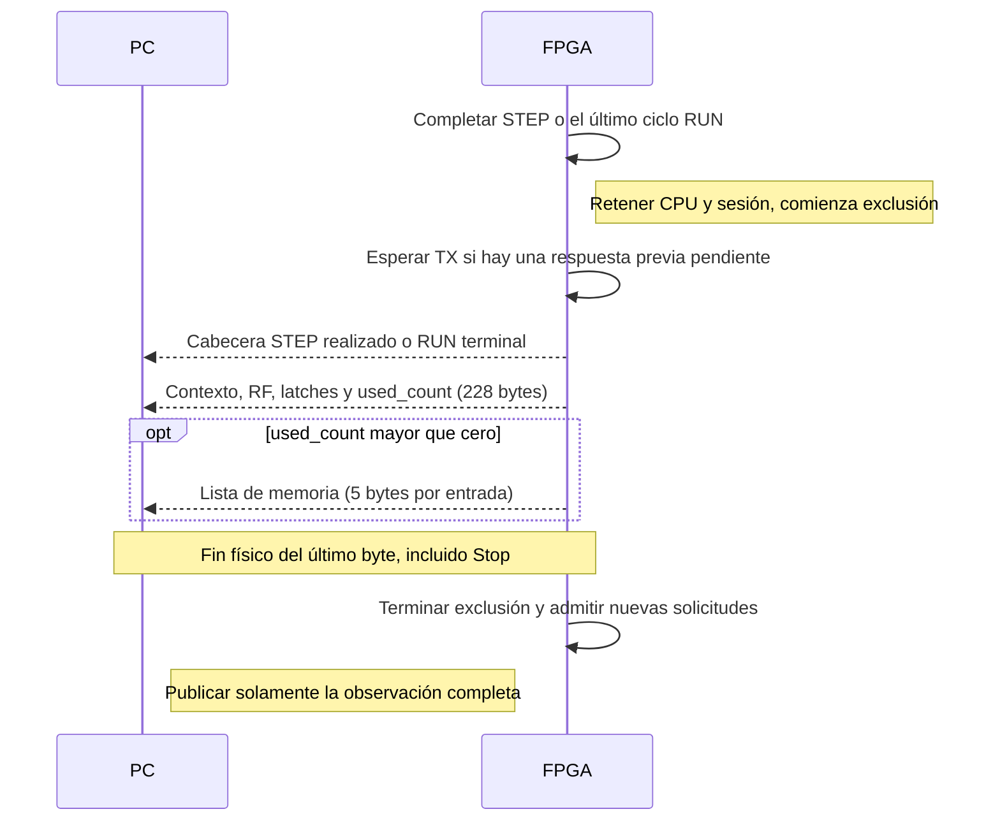
```mermaid
sequenceDiagram
    participant PC as PC
    participant FPGA as FPGA
    FPGA->>FPGA: Completar STEP o el último ciclo RUN
    Note right of FPGA: Retener CPU y sesión, comienza exclusión
    FPGA->>FPGA: Esperar TX si hay una respuesta previa pendiente
    FPGA-->>PC: Cabecera STEP realizado o RUN terminal
    FPGA-->>PC: Contexto, RF, latches y used_count (228 bytes)
    opt used_count mayor que cero
        FPGA-->>PC: Lista de memoria (5 bytes por entrada)
    end
    Note over PC,FPGA: Fin físico del último byte, incluido Stop
    FPGA->>FPGA: Terminar exclusión y admitir nuevas solicitudes
    Note right of PC: Publicar solamente la observación completa
```

La exclusión incluye la espera previa por TX, la cabecera y todo el cuerpo.

Durante ella, RX se consume y se descarta sin interpretar comandos, responder o guardar solicitudes.

La estabilidad permite serializar directamente sin una copia completa adicional de RF, latches o DMEM.

Los puertos concretos pertenecen al diseño de bloques. El reset físico puede abortar el envío; RESET UART se solicita una vez terminada la respuesta.

## Interpretación

Todos los campos seleccionados se transmiten incluso con `valid=0`. La FPGA no los filtra ni los reemplaza por cero.

El lector usa `valid` para distinguir instrucciones activas.

En IF/ID, `fetch_fault_valid` habilita por separado la interpretación de su PC y `fetch_fault_cause`.

`fault_cause` y `fault_pc` globales solo son vigentes en estados de fault.

El snapshot no incluye `next.valid` ni diagnósticos combinacionales.

---

# Estructura del snapshot

Los offsets se cuentan desde cero después de los dos bytes de cabecera común.

## Distribución general

| Campo / bloque | Offset | Bytes |
|---|---:|---:|
| `global_state` | 0 | 1 |
| `image_valid` | 1 | 1 |
| PC global | 2 | 4 |
| `cycle_count` | 6 | 8 |
| `fault_cause` global | 14 | 1 |
| `fault_pc` global | 15 | 4 |
| RF `x0…x31` | 19 | 128 |
| IF/ID | 147 | 11 |
| ID/EX | 158 | 30 |
| EX/MEM | 188 | 20 |
| MEM/WB | 208 | 15 |
| `used_count` | 223 | 5 |
| Lista de memoria | 228 | `5*used_count` |

El contexto ocupa 19 bytes.

Después se transmite RF desde `x0` hasta `x31`. Cada registro ocupa cuatro bytes y `x_i` comienza en:

```text
19 + 4*i
```

`x0` conserva su cero arquitectónico.

`cycle_count` es unsigned de 64 bits y se transmite completo en ocho bytes. Cuenta ciclos efectivos de sesión, incluidos stalls y drain, con wrap módulo `2^64`. Una sesión nueva comienza en cero y UART no incrementa el contador.

## Latches

Los latches se identifican por posición, sin ID adicional.

| Latch | Campos, con bytes entre paréntesis |
|---|---|
| IF/ID | `valid(1)`, `pc(4)`, `instruction(4)`, `fetch_fault_valid(1)`, `fetch_fault_cause(1)` |
| ID/EX | `valid(1)`, `pc(4)`, `instruction(4)`, `rs1(1)`, `rs2(1)`, `rd(1)`, `rs1_value(4)`, `rs2_value(4)`, `immediate(4)`, `alu_op(1)`, `alu_src(1)`, `result_sel(1)`, `flow_op(1)`, `mem_op(1)`, `reg_write(1)` |
| EX/MEM | `valid(1)`, `pc(4)`, `instruction(4)`, `rd(1)`, `reg_write(1)`, `mem_op(1)`, `ex_result(4)`, `store_data(4)` |
| MEM/WB | `valid(1)`, `pc(4)`, `instruction(4)`, `rd(1)`, `reg_write(1)`, `wb_value(4)` |

Internamente:

```text
IF/ID   = 5 campos, 69 bits
ID/EX   = 15 campos, 193 bits
EX/MEM  = 8 campos, 139 bits
MEM/WB  = 6 campos, 103 bits
```

Externamente:

```text
IF/ID   = 11 bytes
ID/EX   = 30 bytes
EX/MEM  = 20 bytes
MEM/WB  = 15 bytes
total   = 76 bytes
```

## Controles registrados

Los controles conservan los códigos de [Etapa ID](architecture/stage_id.md#codificación-de-los-controles).

Cada campo ocupa un byte con padding superior en cero.

| Campo | Códigos |
|---|---|
| `alu_op` | SLL=`0x00`, SRL=`0x02`, SRA=`0x03`, ADD=`0x20`, SUB=`0x22`, AND=`0x24`, OR=`0x25`, XOR=`0x26`, SLT=`0x2A`, SLTU=`0x2B` |
| `alu_src` | Registro=`0`, inmediato=`1` |
| `result_sel` | ALU=`0`, IMMEDIATE=`1`, LINK=`2` |
| `flow_op` | NONE=`0`, BEQ=`1`, BNE=`2`, JAL=`3`, JALR=`4`, HALT=`5` |
| `mem_op` | NONE=`0`, LB=`1`, LH=`2`, LW=`3`, LBU=`4`, LHU=`5`, SB=`6`, SH=`7`, SW=`8` |
| `reg_write` | `0` o `1` |

El snapshot no agrega un bus de control duplicado.

Los valores registrados se transmiten incluso en entradas inválidas y el lector usa `valid` para decidir si tienen significado.

## `global_state`

| Código | `global_state` |
|---|---|
| `0x00` | NO_IMAGE |
| `0x01` | LOADING |
| `0x02` | PREPARING_READY |
| `0x03` | READY |
| `0x04` | RUNNING |
| `0x05` | STEPPING |
| `0x06` | HALT_DRAIN_AUTO |
| `0x07` | HALT_DRAIN_STEP |
| `0x08` | FAULT_DRAIN_AUTO |
| `0x09` | FAULT_DRAIN_STEP |
| `0x0A` | FINISHED |
| `0x0B` | FAULT |
| `0x0C` | PREPARING_RUN |
| `0x0D` | PREPARING_STEP |

Esta es una codificación externa; no impone la codificación física de la FSM.

Tener un código externo tampoco habilita nuevos momentos de snapshot.

Cabecera y estado se interpretan por separado.

Ejemplos:

```text
03 02 05 = STEP / DONE / STEPPING
03 02 0A = STEP / DONE / FINISHED
03 02 0B = STEP / DONE / FAULT
02 0A 0A = RUN / FINISHED / FINISHED
02 0B 0B = RUN / FAULT / FAULT
```

## Causa y PC de fault

`fault_cause` conserva tres bits arquitectónicos y completa el byte con ceros superiores.

| Byte | Causa |
|---|---|
| `0x00` | INSTRUCTION_ADDRESS_MISALIGNED |
| `0x01` | INSTRUCTION_ACCESS_FAULT |
| `0x02` | ILLEGAL_INSTRUCTION |
| `0x03` | RESERVED, ninguna causa válida |
| `0x04` | LOAD_ADDRESS_MISALIGNED |
| `0x05` | LOAD_ACCESS_FAULT |
| `0x06` | STORE_ADDRESS_MISALIGNED |
| `0x07` | STORE_ACCESS_FAULT |

`fault_cause` y `fault_pc` siempre ocupan su lugar.

Solo son vigentes en:

```text
FAULT_DRAIN_AUTO
FAULT_DRAIN_STEP
FAULT
```

Fuera de esos estados no se exige NONE ni borrar los registros.

En IF/ID, `fetch_fault_valid` habilita por separado el PC y la causa del candidato de fetch.

## Memoria utilizada

La lista contiene los bytes escritos por stores CPU comprometidos durante la sesión actual, incluidos valores cero.

Cada commit de:

```text
SB → 1 byte
SH → 2 bytes
SW → 4 bytes
```

incorpora esas direcciones al conjunto.

Loads y preparación no agregan entradas.

Sobrescribir una dirección actualiza su valor y no duplica la entrada.

Cada sesión comienza con lista vacía, también al reiniciar la misma imagen desde `FINISHED` o `FAULT`.

`used_count` es unsigned de cinco bytes little-endian y cuenta entradas desde cero hasta la capacidad DMEM inclusive. Puede representar:

```text
2^32 = 00 00 00 00 01
```

Cada entrada:

| Campo | Bytes | Representación |
|---|---:|---|
| Dirección de byte | 4 | little-endian |
| Valor actual | 1 | byte almacenado |

Las direcciones son únicas y aparecen en orden creciente.

La lista representa estado actual, sin historial, deltas ni huecos no escritos.

La metadata de validez de la implementación de referencia puede reutilizarse para obtener el conjunto, sin exigir otro bitmap o contador persistente.

## Final y longitud

La parte fija del cuerpo ocupa 228 bytes y termina con `used_count`.

Si `K=used_count`:

```text
lista = 5*K bytes
cuerpo = 228 + 5*K bytes
respuesta completa = 230 + 5*K bytes
```

| `K` | Longitud completa |
|---:|---:|
| 0 | 230 bytes |
| 2 | 240 bytes |
| 1000 | 5230 bytes |
| 2048 | 10470 bytes |

Con `K=0`, los cinco bytes de cantidad son cero y no siguen entradas.

La PC reconoce el final por la cantidad; no hay marcador ni longitud adicional.

Solo un mensaje completo constituye una nueva observación. Si se interrumpe, se descarta el parcial y se conserva el último snapshot completo anterior.

---

# Recuperación de la recepción

## Descarte y silencio

Después de una recepción incompleta o un error UART, la FPGA abandona el mensaje parcial, descarta RX pendiente y conserva TX.

Luego exige:

```text
R = 100 ms
```

de silencio continuo:

```text
5.000.000 clocks @ 50 MHz
```

Cualquier actividad RX reinicia `R`.

Al terminar:

```text
línea en reposo
ningún byte en curso
FIFO RX vacía
```

antes de admitir solicitudes.

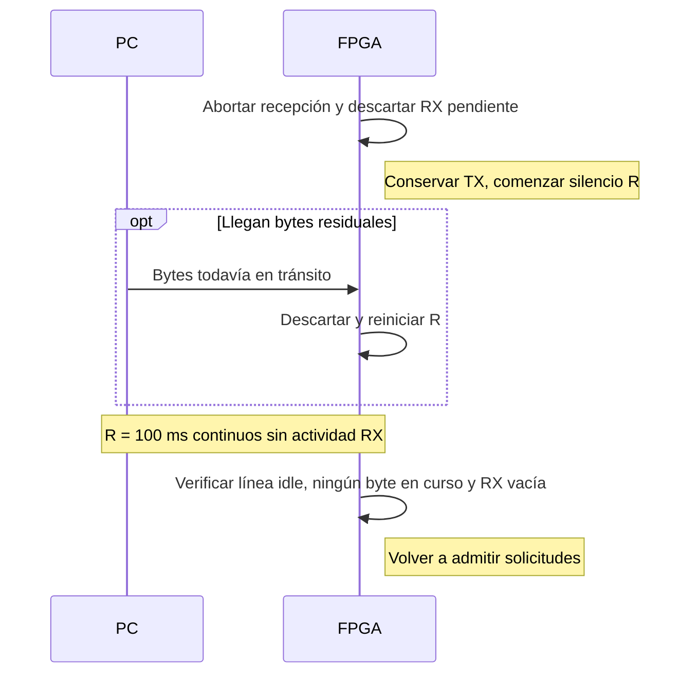
```mermaid
sequenceDiagram
    participant PC as PC
    participant FPGA as FPGA
    FPGA->>FPGA: Abortar recepción y descartar RX pendiente
    Note right of FPGA: Conservar TX, comenzar silencio R
    opt Llegan bytes residuales
        PC->>FPGA: Bytes todavía en tránsito
        FPGA->>FPGA: Descartar y reiniciar R
    end
    Note over PC,FPGA: R = 100 ms continuos sin actividad RX
    FPGA->>FPGA: Verificar línea idle, ningún byte en curso y RX vacía
    Note right of FPGA: Volver a admitir solicitudes
```

Durante recuperación se descartan todos los bytes, incluso CHECK_READY y RESET UART.

Es una fase privada de transporte: no aplica reset global ni agrega estado a la FSM CPU.

## Código desconocido

En contexto de comandos, un byte válido fuera de `0x01` a `0x05` produce:

```text
<byte recibido> 0C
```

Por ejemplo:

```text
06 0C
```

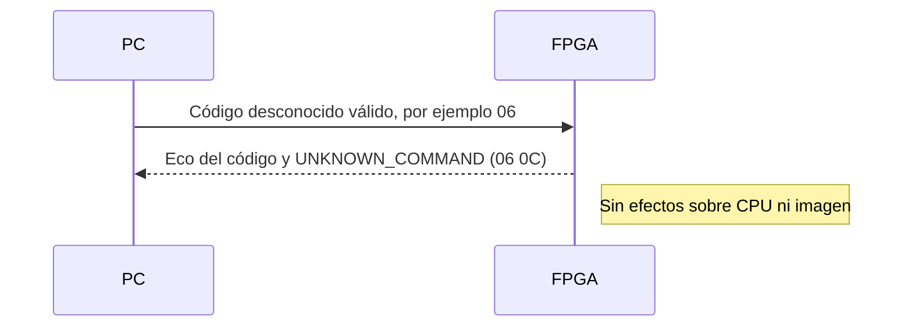
```mermaid
sequenceDiagram
    participant PC as PC
    participant FPGA as FPGA
    PC->>FPGA: Código desconocido válido, por ejemplo 06
    FPGA-->>PC: Eco del código y UNKNOWN_COMMAND (06 0C)
    Note right of FPGA: Sin efectos sobre CPU ni imagen
```

Tamaño y contenido LOAD no se interpretan como comandos.

Tampoco se generan UNKNOWN_COMMAND durante recuperación o exclusión Debug.

## Error UART al recibir un código

Si el error ocurre sobre el byte que debía contener el opcode fuera de LOAD, no hay código confiable para responder.

La FPGA descarta la recepción, no responde y entra en la misma recuperación por `R`.

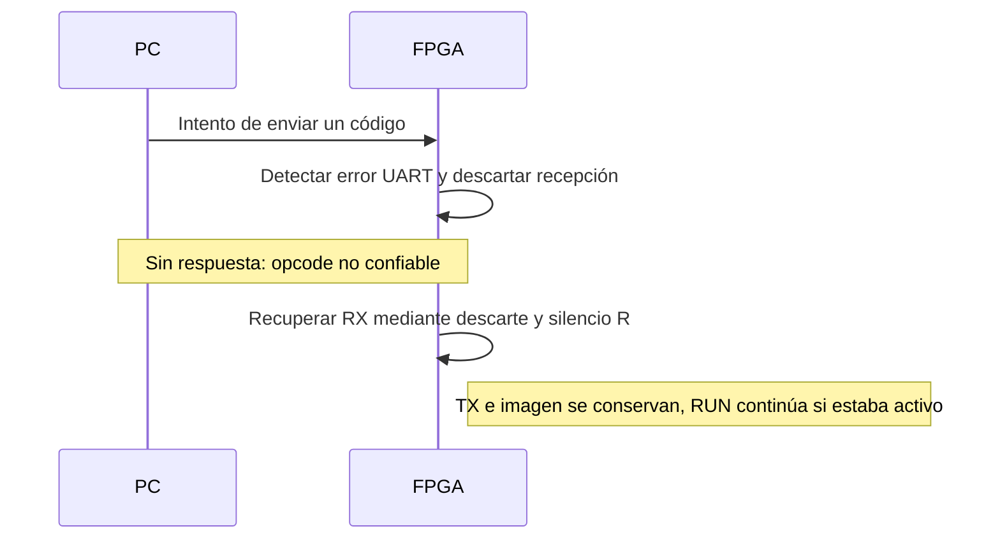
```mermaid
sequenceDiagram
    participant PC as PC
    participant FPGA as FPGA
    PC->>FPGA: Intento de enviar un código
    FPGA->>FPGA: Detectar error UART y descartar recepción
    Note over PC,FPGA: Sin respuesta: opcode no confiable
    FPGA->>FPGA: Recuperar RX mediante descarte y silencio R
    Note right of FPGA: TX e imagen se conservan, RUN continúa si estaba activo
```

El error prevalece sobre interpretar el byte como comando.

No aplica reset CPU ni invalida una imagen confirmada.

RUN, STEP, RESET y CHECK_READY no requieren timeout de campos adicionales.

---

# Esperas y recuperación desde PC

Los plazos distinguen fases. `N` es el tamaño de imagen, `K` la memoria utilizada y `C` la capacidad DMEM.

Los cálculos incluyen diez bits físicos por byte.

`ceil` redondea hacia arriba.

| Espera | Inicio | Plazo |
|---|---|---:|
| CHECK_READY y aceptación LOAD/RUN | Inicio de solicitud | 200 ms |
| Final LOAD, perfiles actuales | Inicio de envío del contenido | `N*10*1000/19200 + 201` ms |
| Aceptación RESET | Inicio de solicitud | 200 ms |
| Cabecera STEP completa | Inicio de solicitud | 200 ms |
| Terminación RUN antes de cabecera final | Después de ACCEPTED | Sin límite de ejecución |
| Completar cabecera final RUN iniciada | Primer byte de esa cabecera | 200 ms |
| Parte fija Debug, 228 bytes | Cabecera completa | 319 ms |
| Lista Debug, `K>0` | `used_count` completo | `ceil(5*K*10*1000/19200 +200)` ms |
| `K=0` | Fin de parte fija | Respuesta terminada |

Los 228 bytes fijos requieren nominalmente 118,75 ms. Con margen de 200 ms y redondeo hacia arriba:

```text
319 ms
```

Ejemplos de lista:

```text
K=2     → 206 ms
K=1000  → 2805 ms
K=2048  → 5534 ms
```

Los mismos plazos se aplican al cuerpo Debug de STEP y RUN terminal.

Antes del primer byte terminal RUN no existe límite sobre duración del programa. Una vez iniciada la cabecera final, la PC tiene 200 ms para completarla.

Los plazos son máximos de espera, no demoras obligatorias.

## Recuperar LOAD

Ante error o vencimiento, la PC detiene nuevos envíos y cancela lo pendiente en lo posible.

Antes de consultar de nuevo espera una ventana que cubre transmisión de cabecera+programa, `T` y `R`, redondeada hacia arriba a múltiplos de 100 ms:

```text
W_load(N) =
    100 * ceil(
        (
            (N+6)*10*1000/19200
            + 100
            + 100
        ) / 100
    ) ms
```

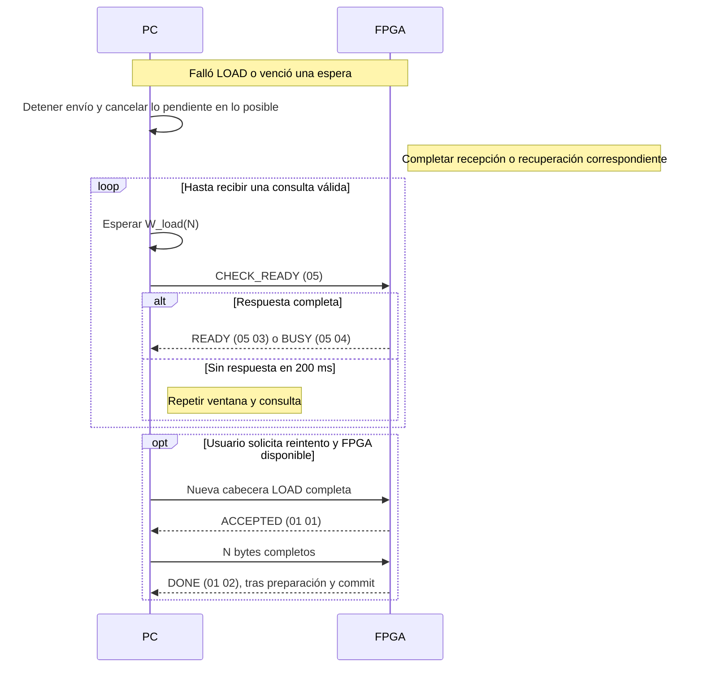
```mermaid
sequenceDiagram
    participant PC as PC
    participant FPGA as FPGA
    Note over PC,FPGA: Falló LOAD o venció una espera
    PC->>PC: Detener envío y cancelar lo pendiente en lo posible
    Note right of FPGA: Completar recepción o recuperación correspondiente
    loop Hasta recibir una consulta válida
        PC->>PC: Esperar W_load(N)
        PC->>FPGA: CHECK_READY (05)
        alt Respuesta completa
            FPGA-->>PC: READY (05 03) o BUSY (05 04)
        else Sin respuesta en 200 ms
            Note right of PC: Repetir ventana y consulta
        end
    end
    opt Usuario solicita reintento y FPGA disponible
        PC->>FPGA: Nueva cabecera LOAD completa
        FPGA-->>PC: ACCEPTED (01 01)
        PC->>FPGA: N bytes completos
        FPGA-->>PC: DONE (01 02), tras preparación y commit
    end
```

Ejemplos:

```text
N=32   → W_load = 300 ms
N=1024 → W_load = 800 ms
```

Si CHECK_READY no responde, se repite ventana y consulta.

El reintento es una nueva LOAD completa solicitada por el usuario.

No existe RETRY ni reenvío automático.

Perder ACCEPTED o DONE no demuestra que la FPGA haya revertido la operación.

## Perder una respuesta o conexión

Fuera de LOAD, un timeout, desconexión o respuesta truncada hace que la PC informe fallo y abandone el parcial.

Si existía un snapshot completo anterior, se conserva como observación anterior.

No se repiten automáticamente STEP, RUN ni RESET porque la operación pudo haber ocurrido.

Para cubrir una respuesta Debug aun sin haber recibido `used_count`, se usa la capacidad DMEM `C`.

```text
B_lista(C) =
    ceil(
        5*C*10*1000/19200
        + 200
    ) ms
```

```text
W_debug(C) =
    100 * ceil(
        (
            200
            + 319
            + B_lista(C)
        ) / 100
    ) ms
```

Valores:

```text
REFERENCE → W_debug = 6100 ms
ALT_1000  → W_debug = 3400 ms
```

La ventana comienza después de abandonar el intercambio o retomar el enlace tras una desconexión.

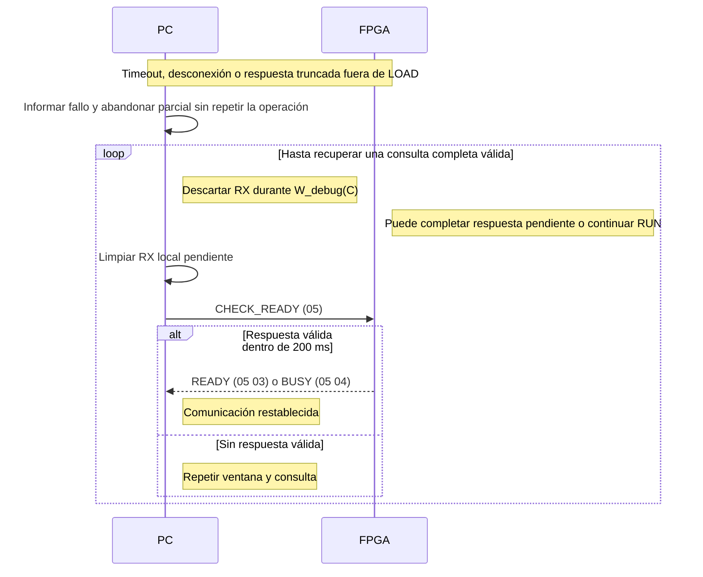
```mermaid
sequenceDiagram
    participant PC as PC
    participant FPGA as FPGA
    Note over PC,FPGA: Timeout, desconexión o respuesta truncada fuera de LOAD
    PC->>PC: Informar fallo y abandonar parcial sin repetir la operación
    loop Hasta recuperar una consulta completa válida
        Note right of PC: Descartar RX durante W_debug(C)
        Note right of FPGA: Puede completar respuesta pendiente o continuar RUN
        PC->>PC: Limpiar RX local pendiente
        PC->>FPGA: CHECK_READY (05)
        alt Respuesta válida dentro de 200 ms
            FPGA-->>PC: READY (05 03) o BUSY (05 04)
            Note right of PC: Comunicación restablecida
        else Sin respuesta válida
            Note right of PC: Repetir ventana y consulta
        end
    end
```

Durante `W_debug(C)` la PC descarta RX. Después limpia lo pendiente y envía CHECK_READY.

Una respuesta completa `05 03` o `05 04` restablece comunicación. Si no llega en 200 ms, se repite ventana y consulta.

Solo CHECK_READY se repite automáticamente porque es informativa.

La PC no busca cabeceras dentro del cuerpo de una respuesta pendiente ni reanuda automáticamente una ejecución desconocida.

READY o BUSY no reconstruyen sesión ni `cycle_count`.

Para volver a un estado conocido, el usuario puede aplicar RESET y cargar otra vez.

`W_debug` no limita la duración de RUN: el programa puede continuar y CHECK_READY responder BUSY.

LOAD conserva su recuperación mediante `W_load`; `W_debug` no la reemplaza.

---

# Límites del diseño de bloques

El protocolo fija formatos, condiciones, secuencias, tiempos, respuestas, descarte y contenido del snapshot.

El diseño de [uart_core](architecture/uart_core.md) y sus bloques físicos define los puertos de actividad RX, recepción en curso y fin físico TX, el generador de ticks desde 50 MHz, las FIFO y la separación entre control y acciones de las máquinas de estado del TP2.

La realización interna todavía debe concretar:

- arbitraje y FSM privadas de recepción/serialización;
- seguimiento del fin físico de las respuestas;
- demostración del presupuesto de consumo RX y continuidad durante espera TX;
- puertos y recorrido de DMEM utilizada;
- ownership de recursos;
- preparación por recurso.

Estos detalles permanecen en DEC-SYS-007 y en [interfaces](interfaces.md#152-detalles-de-realización-que-deben-concretarse-por-módulo).

DEC-SYS-008 y DEC-SYS-009 completan aplicación PC y assembler.

El cierre del protocolo no completa D0 del sistema ni adelanta implementación.

## Trazabilidad

- [Decisiones aprobadas](decisions.md#dec-proto-001--formato-detallado-del-protocolo): DEC-PROTO-001/002/003, DEC-ARCH-009 y DEC-SYS-005; diseño consolidado el 2026-10-01.
- [Arquitectura de memoria](architecture/memory_architecture.md): capacidades, imagen contigua, little-endian y bytes escritos de la sesión.
- [Control de ejecución y sesión](architecture/execution_control.md): aceptación, preparación, ciclos y terminación.
- [Arquitectura de Debug](architecture/debug_architecture.md): contenido persistente, coherencia e interpretación.
- [Contratos de interfaces](interfaces.md): conexiones y detalles físicos pendientes.
- [Revisión documental del protocolo](debug_protocol_audit.md): recorridos, ejemplos, tablas y cálculos del contrato aprobado.
